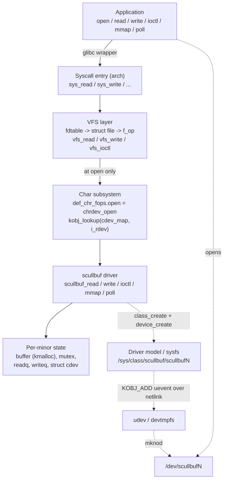
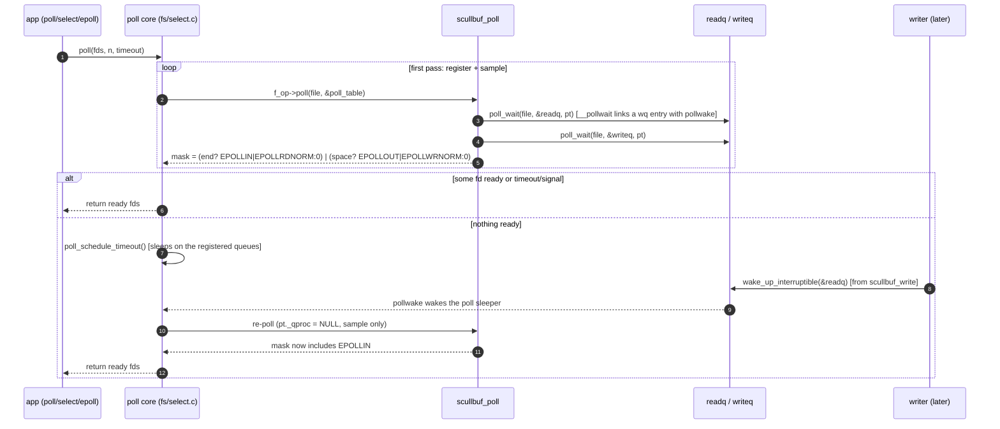
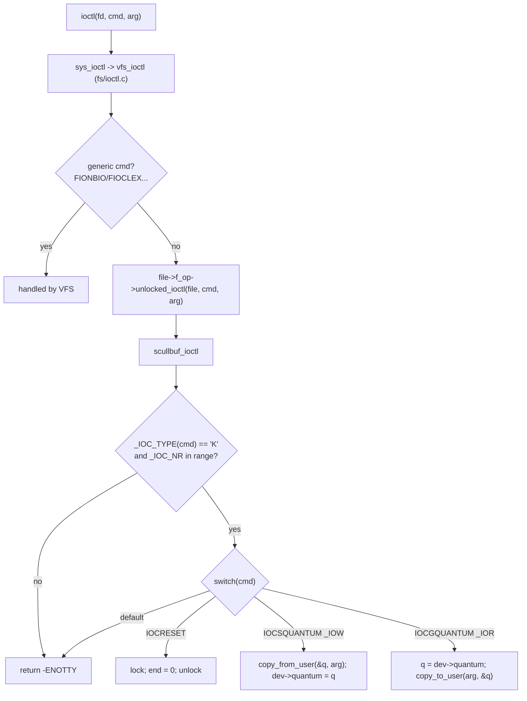
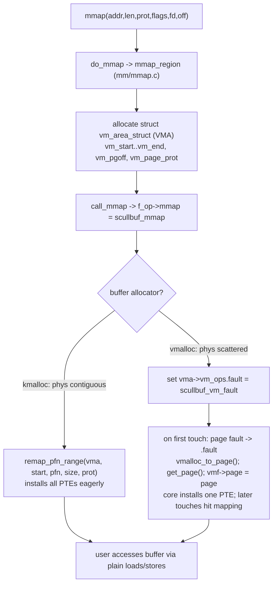

# Part 3 — End-to-End Traces & Diagrams

Visual companions to [02-internals.md](02-internals.md). The mermaid diagrams render on
GitHub and in VS Code's Markdown preview. Each diagram is followed by, or paired with, an
annotated textual call stack so you can read it without a renderer.

---

## 1. Overall architecture



**Reading it:** solid arrows are the per-syscall data path; dotted arrows are the one-time
setup path that makes the `/dev` node exist. Notice the char subsystem (`chrdev_open`) is on
the path **only at open time** — after that, the VFS dispatches straight from `struct file`'s
swapped `f_op` into the driver.

---

## 2. Module load — building the device

```mermaid
sequenceDiagram
    autonumber
    participant U as insmod
    participant M as scullbuf_init
    participant CH as char subsystem
    participant DM as driver model
    participant UD as udev / devtmpfs

    U->>M: module_init()
    M->>CH: alloc_chrdev_region(&base, 0, 4, "scullbuf")
    CH-->>M: dynamic major assigned
    M->>DM: class_create("scullbuf") [6.4+ single arg]
    DM-->>M: /sys/class/scullbuf/
    loop for each minor i in 0..3
        M->>M: mutex_init, init_waitqueue_head x2, kzalloc(buffer, GFP_KERNEL)
        M->>CH: cdev_init(&cdev, &scullbuf_fops); cdev.owner = THIS_MODULE
        M->>CH: cdev_add(&cdev, MKDEV(major,i), 1)
        Note over CH: kobj_map(cdev_map,...) — DEVICE IS NOW LIVE
        M->>DM: device_create(class, NULL, MKDEV(major,i), NULL, "scullbuf%d", i)
        DM-->>UD: KOBJ_ADD uevent (MAJOR, MINOR, DEVNAME) over netlink
        UD-->>UD: devtmpfs mknod /dev/scullbufN; udev applies perms/rules
    end
    M->>DM: proc_create("scullbuf", 0, NULL, &scullbuf_proc_ops)
    M-->>U: return 0
```

> Ordering invariant: `cdev_add` (step making it live) happens **before**
> `device_create` (which can trigger an almost-immediate `open` via udev). Therefore the
> buffer/mutex/wait-queues — set up just before `cdev_add` — are guaranteed ready.

---

## 3. `open("/dev/scullbuf0")` — the fops swap

```mermaid
sequenceDiagram
    autonumber
    participant A as application
    participant VFS as VFS (fs/open.c, namei.c)
    participant CD as chrdev_open (fs/char_dev.c)
    participant MAP as cdev_map (drivers/base/map.c)
    participant DRV as scullbuf_open

    A->>VFS: openat("/dev/scullbuf0", O_RDWR)
    VFS->>VFS: path_openat -> link_path_walk -> inode (S_IFCHR, i_rdev, i_fop=def_chr_fops)
    VFS->>VFS: do_dentry_open: f->f_op = def_chr_fops
    VFS->>CD: def_chr_fops.open(inode, filp)
    CD->>MAP: kobj_lookup(cdev_map, inode->i_rdev, &idx)
    MAP-->>CD: kobject -> container_of -> struct cdev *
    CD->>CD: inode->i_cdev = cdev; list_add(&inode->i_devices)
    CD->>CD: cdev_get(p) => kobject_get + try_module_get(owner)
    CD->>CD: fops = fops_get(p->ops)  (== scullbuf_fops)
    CD->>CD: replace_fops(filp, fops) [filp->f_op is now scullbuf_fops]
    CD->>DRV: filp->f_op->open(inode, filp)
    DRV->>DRV: dev = container_of(inode->i_cdev, struct scullbuf_dev, cdev)
    DRV->>DRV: filp->private_data = dev
    DRV-->>CD: 0
    CD-->>VFS: 0
    VFS-->>A: fd
```

**Annotated call stack (same path, top calls bottom):**

```text
sys_openat
  do_sys_openat2                         fs/open.c
    do_filp_open                         fs/namei.c
      path_openat
        link_path_walk                   -> resolves dentry -> struct inode
        do_open
          vfs_open
            do_dentry_open               fs/open.c
              f->f_op = fops_get(inode->i_fop)        // == &def_chr_fops
              f->f_op->open(inode, f)
                chrdev_open              fs/char_dev.c
                  kobj_lookup(cdev_map, inode->i_rdev) drivers/base/map.c
                  inode->i_cdev = cdev                 // cache for next time
                  cdev_get -> try_module_get(owner)    // pin module
                  fops_get(cdev->ops)                  // scullbuf_fops
                  replace_fops(filp, scullbuf_fops)    // THE SWAP
                  filp->f_op->open(inode, filp)
                    scullbuf_open        (driver)
                      container_of(inode->i_cdev,...)  // recover dev
                      filp->private_data = dev
```

---

## 4. Blocking `read()` woken by a concurrent `write()`

This is the producer/consumer heart of the driver.

```mermaid
sequenceDiagram
    autonumber
    participant R as Reader process
    participant RR as scullbuf_read
    participant L as dev->lock (mutex)
    participant Q as dev->readq (waitqueue)
    participant WW as scullbuf_write
    participant W as Writer process

    R->>RR: read(fd, buf, n)
    RR->>L: mutex_lock_interruptible
    RR->>RR: check dev->end == 0  (empty!)
    RR->>L: mutex_unlock  (must drop before sleeping)
    RR->>Q: wait_event_interruptible(readq, end != 0)
    Note over RR,Q: task state TASK_INTERRUPTIBLE, then schedule() -> sleeps off-CPU

    W->>WW: write(fd, data, m)
    WW->>L: mutex_lock_interruptible
    WW->>WW: copy_from_user(dev->buffer, data, m); dev->end += m
    WW->>L: mutex_unlock
    WW->>Q: wake_up_interruptible(&dev->readq)
    Q-->>RR: wake: condition (end != 0) now true

    RR->>L: mutex_lock_interruptible (re-acquire)
    RR->>RR: re-check end != 0  (true) -> copy_to_user(buf, dev->buffer, k)
    RR->>RR: advance *f_pos; stats
    RR->>L: mutex_unlock
    RR->>RR: wake_up_interruptible(&dev->writeq)
    RR-->>R: return k
```

**Why each step is where it is:**

- The reader **unlocks before `wait_event_interruptible`** — otherwise the writer could
  never take `dev->lock` to produce data or fire the wakeup (self-deadlock, internals §8).
- `wait_event_interruptible` internally does *arm-state → re-check → schedule*, defeating
  the lost-wakeup race. On signal it returns `-ERESTARTSYS` (Ctrl-C works).
- After waking, the reader **re-locks and re-checks** `end != 0` because another reader may
  have consumed the data first (thundering herd).
- The reader then **wakes writers** (`writeq`) since it just freed space.

---

## 5. `poll()` readiness



The key insight (internals §9): **the same `wake_up_interruptible(&readq)` that wakes a
blocking `read()` also wakes a `poll()`** sleeper, because `poll_wait` registered an entry on
that very queue. One mechanism, two consumers.

---

## 6. `ioctl()` decode and dispatch



The `_IOC` bit layout that `_IOC_TYPE`/`_IOC_NR`/`_IOC_DIR`/`_IOC_SIZE` decode is tabulated
in [04-appendix.md](04-appendix.md#ioctl-encoding).

---

## 7. `mmap()` — eager vs lazy backing



This diagram is the visual form of the internals §11 rule:
**`kmalloc` ⇒ `remap_pfn_range` (eager)**, **`vmalloc` ⇒ `vm_ops->fault` (lazy)**, because
only a physically contiguous buffer has a single PFN run to remap.

---

## 8. Close and unload

```mermaid
sequenceDiagram
    autonumber
    participant A as application
    participant VFS as VFS (__fput)
    participant DRV as scullbuf_release
    participant MOD as module refcount
    participant U as rmmod

    A->>VFS: close(fd)
    VFS->>VFS: fput -> refcount of struct file hits 0 -> __fput
    VFS->>DRV: filp->f_op->release(inode, filp)
    DRV->>DRV: drop fasync, decrement counters
    VFS->>MOD: fops_put + cdev_put -> module_put(owner)
    Note over MOD: when module refcount returns to 0, unload is permitted

    U->>MOD: rmmod scullbuf
    alt refcount > 0 (an fd still open)
        MOD-->>U: -EBUSY
    else refcount == 0
        MOD->>DRV: scullbuf_exit (reverse order)
        DRV->>DRV: proc_remove; per-minor device_destroy + cdev_del + kfree(buffer)
        DRV->>DRV: class_destroy; unregister_chrdev_region
        MOD-->>U: unloaded
    end
```

---

### Cross-references

| Diagram | Internals section | Design section |
|---------|-------------------|----------------|
| 1 Architecture | [02 §1–§4](02-internals.md) | [01 §2](01-design.md) |
| 2 Module load | [02 §15](02-internals.md) | [01 §15](01-design.md) |
| 3 open | [02 §4](02-internals.md) | [01 §7](01-design.md) |
| 4 blocking read/write | [02 §8](02-internals.md) | [01 §10](01-design.md) |
| 5 poll | [02 §9](02-internals.md) | [01 §11](01-design.md) |
| 6 ioctl | [02 §10](02-internals.md) | [01 §12](01-design.md) |
| 7 mmap | [02 §11](02-internals.md) | [01 §13](01-design.md) |
| 8 close/unload | [02 §13](02-internals.md) | [01 §15](01-design.md) |
