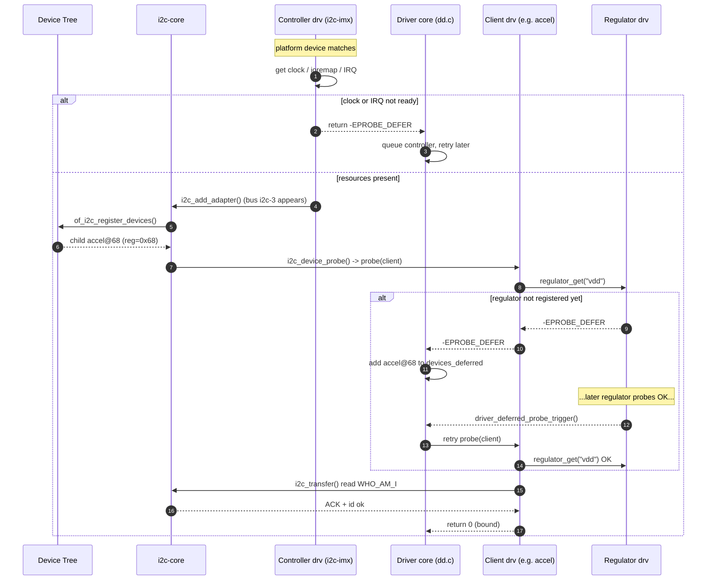
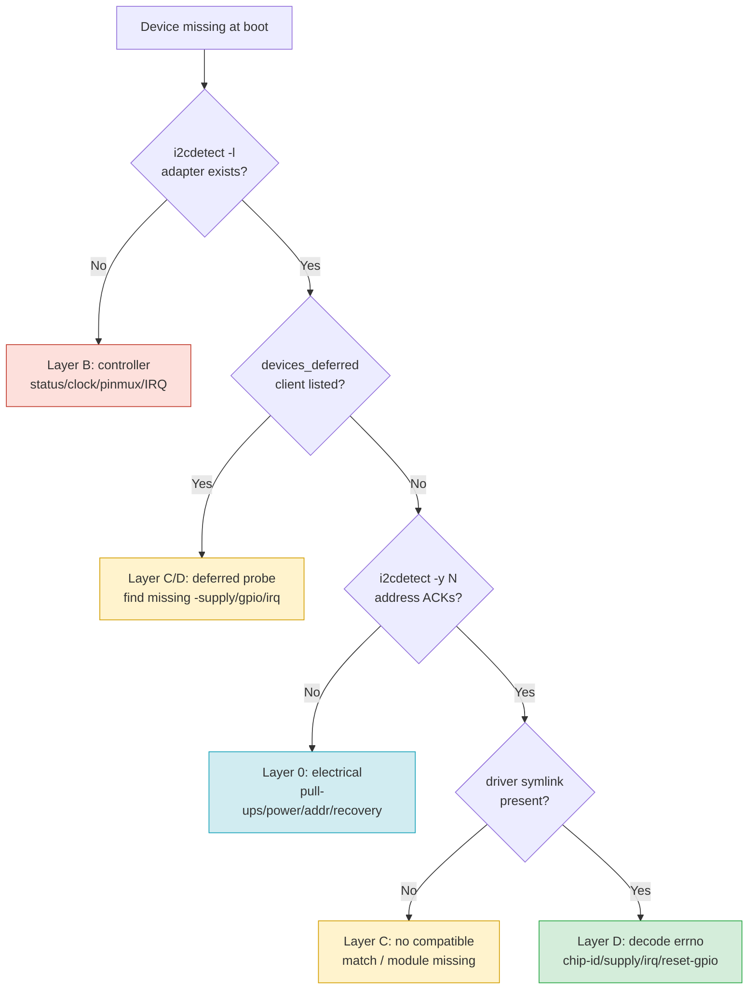
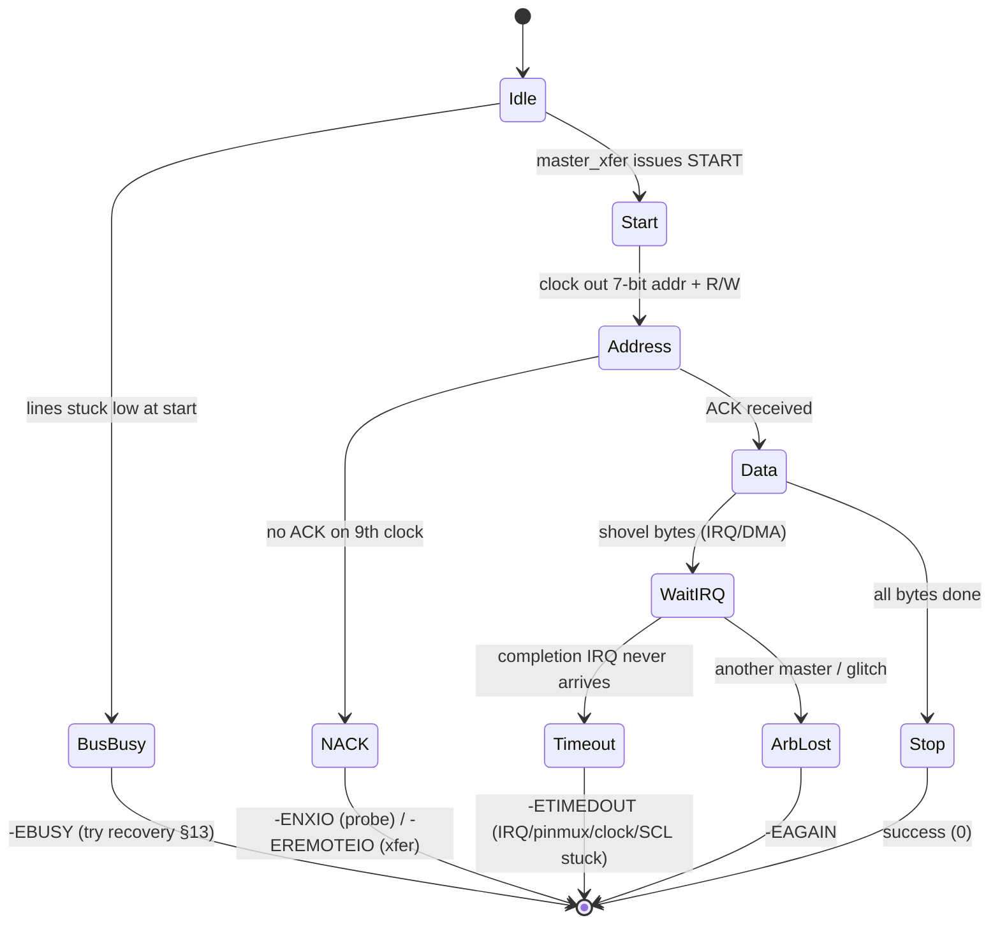
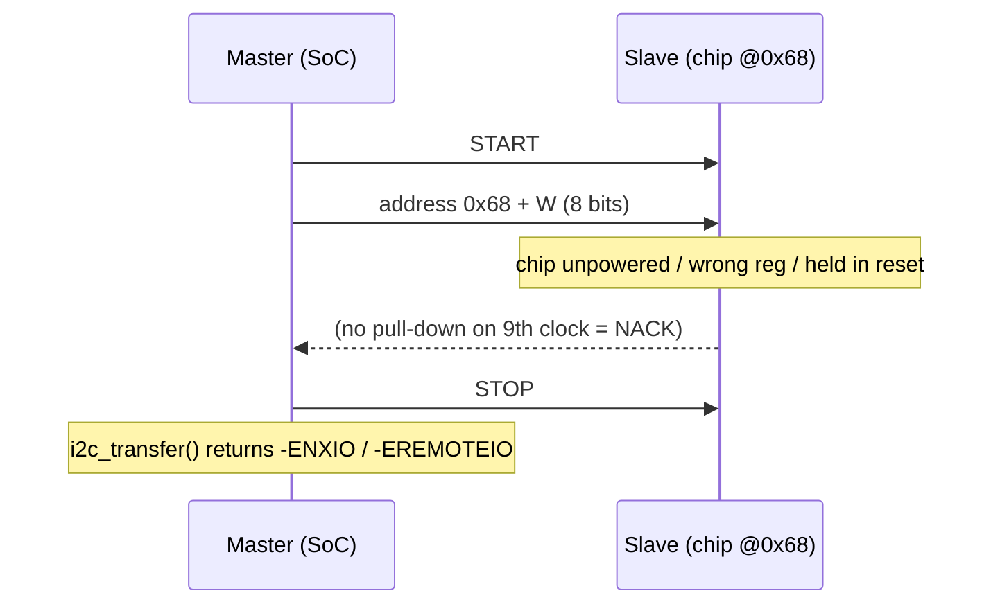

# Part 5 — Debugging I2C Failures at Boot (ARM/ARM64 + Device Tree)

This document is a **methodology and reference** for the single most common class of
embedded-Linux bring-up bugs: *"an I2C device (or the whole bus) does not come up during
boot."* It is written the same way as the rest of this set — pinned to a concrete kernel,
with real struct layouts, real call paths, and diagrams — but the subject is now a **real
hardware bus** (`i2c-N`) on an **ARM/ARM64 SoC described by a Device Tree**, not a RAM
device.

**Target kernel:** the `6.17` series. Symbols, struct field names, tracepoints, and the
`-EPROBE_DEFER` value (`517`) were verified against the headers in
`/lib/modules/6.17.0-35-generic/build` (`include/linux/i2c.h`, `include/uapi/linux/i2c.h`,
`include/trace/events/i2c.h`, `include/linux/errno.h`). Driver-source citations refer to
the mainline `drivers/i2c/` tree at the same series.

> **Platform note.** The local machine these docs were verified on is x86-64, but I2C
> boot failures are overwhelmingly an **embedded ARM/ARM64 + Device Tree** problem, so
> that is the platform assumed throughout. Where x86/ACPI differs (enumeration via
> `_HID`/`_CRS` instead of DT, the `i2c-designware` controller, SMBus), it is flagged but
> not developed. The running hardware example is the i.MX controller (`i2c-imx`), with
> notes on `i2c-designware`, `i2c-bcm2835`, and `i2c-tegra`.

---

## TL;DR — the first five commands

When a board boots and "the I2C thing isn't there," run these **before theorizing**. Four
out of five boot I2C bugs are identified here.

```sh
# 1. Did the CONTROLLER (adapter) even register? List every I2C bus the kernel knows.
i2cdetect -l                       # or: ls -l /sys/class/i2c-dev/

# 2. Is a CLIENT driver stuck waiting for a dependency? (THE #1 boot cause.)
cat /sys/kernel/debug/devices_deferred

# 3. What did the kernel actually say? Filter the log for the subsystem + your driver.
dmesg | grep -iE 'i2c|<your-driver>|probe'

# 4. Is the device ELECTRICALLY answering on the wire? (Scan bus N, read-safe.)
i2cdetect -y -r 3                  # bus 3; an address shows => the chip ACKs

# 5. Are the device's PREREQUISITES up? (clocks / regulators / pinmux.)
cat /sys/kernel/debug/clk/clk_summary       | grep -i i2c
cat /sys/kernel/debug/regulator/regulator_summary
cat /sys/kernel/debug/pinctrl/*/pinmux-pins  | grep -i i2c
```

Map of outcomes:

| Symptom from above | Most likely layer | Jump to |
| --- | --- | --- |
| Bus **not** in `i2cdetect -l` | Controller didn't probe (clock/pinmux/IRQ/DT) | [§4](#4-i2c-on-the-boot-timeline-who-probes-when), [§7.1](#71-layer-b--controller--adapter-never-appears) |
| Bus present, client in `devices_deferred` | Dependency ordering → deferred probe | [§5](#5-deferred-probe--the-1-boot-time-i2c-failure) |
| `i2cdetect -y` shows **nothing** at the address | Wire/electrical or address wrong | [§6](#6-the-wire-protocol-and-where-it-breaks), [§7.2](#72-layer-0--the-electrical-bus-is-dead-or-stuck) |
| Address ACKs, but driver still errors | Client driver / addressing / power | [§7.4](#74-layer-d--the-client-driver-fails-in-probe) |
| `-ETIMEDOUT` in dmesg | Controller xfer never completes (IRQ/clock/stretch) | [§8](#8-the-errno-decoder) |

---

## 1. Scope and the mental model

"I2C failed at boot" is never one bug — it is a **symptom reported at the top of a tall
stack**. The single most important debugging move is to stop saying "I2C is broken" and
instead locate *which layer* failed. There are four software layers plus the physical
bus, and a failure in any one of them surfaces as "the device isn't working":

```text
                       WHAT THE USER SEES: "the sensor/PMIC/touch isn't there"
                                                  ▲
   ┌──────────────────────────────────────────────┴───────────────────────────────┐
   │ LAYER D — the CLIENT driver (e.g. drivers/iio/.../bmi160, rtc, regulator/pmic)│
   │   • binds to a compatible; its ->probe() runs i2c_transfer() to talk to chip  │
   │   • fails if: chip NACKs, wrong addr, supply/gpio/irq not ready (defer), HW id │
   └──────────────────────────────────────────────┬───────────────────────────────┘
                                                  │ i2c_transfer(client->adapter, …)
   ┌──────────────────────────────────────────────┴───────────────────────────────┐
   │ LAYER C — the I2C CORE (drivers/i2c/i2c-core-*.c)                              │
   │   • parses DT, instantiates clients, matches drivers, serializes the bus      │
   │   • fails if: DT child wrong (reg/compatible/status), no driver, bus locked   │
   └──────────────────────────────────────────────┬───────────────────────────────┘
                                                  │ adap->algo->master_xfer(adap, msgs)
   ┌──────────────────────────────────────────────┴───────────────────────────────┐
   │ LAYER B — the CONTROLLER driver (the SoC IP: i2c-imx / -designware / -bcm2835)│
   │   • drives the I2C peripheral registers, runs the START/ADDR/DATA state machine│
   │   • fails if: no clock, no pinmux, no IRQ, wrong reg base, reset/power off     │
   └──────────────────────────────────────────────┬───────────────────────────────┘
                                                  │ SDA / SCL pins (open-drain)
   ┌──────────────────────────────────────────────┴───────────────────────────────┐
   │ LAYER 0 — the PHYSICAL BUS: 2 wires + pull-ups + the slave chip's power rail   │
   │   • fails if: no/weak pull-ups, slave unpowered, shorted/stuck line, contention│
   └────────────────────────────────────────────────────────────────────────────┘
```

The whole of this document is organized around **descending this stack**: identify the
lowest layer that is broken, fix it there, and re-test. A fix at Layer 0 (a missing
pull-up) can masquerade as ten different Layer-C/D errno values, so **never start
debugging in the client driver.**

> **Interview point.** "An I2C device isn't detected at boot — walk me through it." The
> expected answer is *not* a guess ("maybe the address is wrong"). It is the layered
> method: *Did the adapter register? Is the client deferred? Does the address ACK on the
> wire? Are clocks/regulators/pinmux up?* — i.e. bottom-up isolation before hypothesis.

### The two distinct boot questions

There are really **two separate things** that can "fail at boot," and conflating them
wastes hours:

1. **Adapter (controller) registration** — does `/dev/i2c-N` / `i2c-N` exist at all?
   This is Layer B/C and happens when the *controller* driver probes. If this fails,
   *nothing* on that bus can work.
2. **Client (device) instantiation + probe** — does the chip on the bus get a driver
   bound and talk successfully? This is Layer C/D and happens per child node. The adapter
   can be perfectly healthy while one client silently defers forever.

`i2cdetect -l` answers (1). `/sys/kernel/debug/devices_deferred` and `dmesg` answer (2).

---

## 2. The I2C software stack and its data structures

You cannot debug what you cannot name. These are the objects the core manipulates, with
the header line they live on (verified against `include/linux/i2c.h` for the 6.17 series).

| Object | Header | Represents | "Owned" by |
| --- | --- | --- | --- |
| `struct i2c_adapter` | `i2c.h:733` | one **bus / controller instance** (`i2c-3`) | the controller driver |
| `struct i2c_algorithm` | `i2c.h:544` | *how* to do a transfer on that bus (`master_xfer`) | the controller driver |
| `struct i2c_client` | `i2c.h:331` | one **chip** on a bus (address + adapter) | the I2C core |
| `struct i2c_driver` | `i2c.h:270` | a **client driver** (probe/remove/match) | the device driver |
| `struct i2c_msg` | `uapi/i2c.h` | one **transfer segment** (addr, flags, len, buf) | the caller |
| `struct i2c_board_info` | `i2c.h:425` | a template to instantiate a client | board/DT code |
| `struct i2c_bus_recovery_info` | `i2c.h:654` | how to un-wedge a stuck bus | controller driver |

### 2.1 The controller side — `i2c_adapter` + `i2c_algorithm`

```c
struct i2c_adapter {
        struct module *owner;
        unsigned int   class;
        const struct i2c_algorithm *algo;  /* how transfers are issued    */
        void          *algo_data;
        const struct i2c_lock_operations *lock_ops;
        struct rt_mutex bus_lock;          /* serializes the whole bus    */
        int            timeout;            /* in jiffies                  */
        int            retries;
        struct device  dev;                /* the adapter device          */
        struct device *dev_parent;
        int            nr;                 /* the "N" in i2c-N            */
        char           name[48];
        struct i2c_bus_recovery_info *bus_recovery_info;  /* §13         */
        const struct i2c_adapter_quirks  *quirks;
        ...
};

struct i2c_algorithm {
        /* THE function that actually pokes the controller registers: */
        int (*master_xfer)(struct i2c_adapter *adap, struct i2c_msg *msgs, int num);
        int (*smbus_xfer)(struct i2c_adapter *adap, u16 addr, ...);
        u32 (*functionality)(struct i2c_adapter *adap);
        ...
};
```

The controller driver (e.g. `drivers/i2c/busses/i2c-imx.c`) fills in `master_xfer` and
calls `i2c_add_adapter()` (exported) or `i2c_add_numbered_adapter()`. *That* call is what
makes `i2c-N` appear. **If the controller's `->probe()` returns before that call — because
a clock, pinmux, or IRQ wasn't available — the bus simply never exists.** (See §4, §7.1.)

### 2.2 The client side — `i2c_client` + `i2c_driver`

```c
struct i2c_client {
        unsigned short flags;          /* I2C_CLIENT_TEN, _PEC, …          */
        unsigned short addr;           /* the 7-bit chip address           */
        char           name[I2C_NAME_SIZE];
        struct i2c_adapter *adapter;   /* WHICH bus this chip sits on      */
        struct device   dev;           /* the driver-model device          */
        int             init_irq;
        int             irq;           /* resolved IRQ (often a GPIO IRQ)  */
        struct list_head detected;
};

struct i2c_driver {
        unsigned int   class;
        int  (*probe)(struct i2c_client *client);   /* modern SINGLE-arg form */
        void (*remove)(struct i2c_client *client);
        struct device_driver       driver;          /* .of_match_table here  */
        const struct i2c_device_id *id_table;
        ...
};
```

> **Version note (bites when porting).** Through kernel 6.2 the callback was
> `int (*probe)(struct i2c_client *, const struct i2c_device_id *)` *and* a second
> `probe_new` existed during the migration. As of the 6.17 headers there is a **single
> `probe(struct i2c_client *client)`** — the `id` argument is gone; use
> `i2c_get_match_data()` / `of_device_get_match_data()` inside probe instead. Out-of-tree
> drivers written against the old prototype **fail to build or silently never match** —
> a real "device missing at boot" cause that is pure software.

### 2.3 The transfer unit — `i2c_msg`

Every read or write on the wire is one or more `i2c_msg` segments handed to
`i2c_transfer()`:

```c
struct i2c_msg {
        __u16 addr;   /* slave address (7-bit, right-justified)             */
        __u16 flags;  /* I2C_M_RD => read; 0 => write; I2C_M_TEN, _NOSTART… */
        __u16 len;    /* number of bytes in buf                             */
        __u8 *buf;    /* data payload                                       */
};
```

Verified flag values (`uapi/linux/i2c.h`): `I2C_M_RD = 0x0001` (note the comment
"guaranteed to be 0x0001"), `I2C_M_TEN = 0x0010` (10-bit addressing),
`I2C_M_RECV_LEN = 0x0400`, `I2C_M_NOSTART = 0x4000`, `I2C_M_STOP = 0x8000`. A classic
register read is **two messages**: a write of the register pointer (`flags = 0`) followed
by a read (`flags = I2C_M_RD`), with a repeated-START between them (i.e. *no* STOP after
the first — the core does this by default for a multi-message transfer).

### 2.4 The source-file map

When dmesg points at a function, this is where it lives:

| Concern | File |
| --- | --- |
| Core: adapter/client registration, `i2c_transfer`, locking | `drivers/i2c/i2c-core-base.c` |
| **DT parsing**: turn DT child nodes into clients | `drivers/i2c/i2c-core-of.c` (`of_i2c_register_devices()`) |
| SMBus emulation layer | `drivers/i2c/i2c-core-smbus.c` |
| ACPI enumeration (x86) | `drivers/i2c/i2c-core-acpi.c` |
| The `/dev/i2c-N` userspace shim | `drivers/i2c/i2c-dev.c` |
| Controller (i.MX) | `drivers/i2c/busses/i2c-imx.c` |
| Controller (DesignWare, common on x86 + many SoCs) | `drivers/i2c/busses/i2c-designware-*.c` |
| Controller (Raspberry Pi) | `drivers/i2c/busses/i2c-bcm2835.c` |
| GPIO bit-bang fallback | `drivers/i2c/busses/i2c-gpio.c` |
| Deferred-probe machinery | `drivers/base/dd.c` |
| Tracepoints | `include/trace/events/i2c.h` |

---

## 3. How I2C is described in the Device Tree

On ARM/ARM64 there is **no probing of the bus topology** — the kernel learns the entire
I2C layout from the Device Tree handed over by the bootloader. A huge fraction of "boot"
bugs are simply *wrong DT*. You must be able to read these nodes fluently.

### 3.1 The controller node

```dts
&i2c3 {                                   /* a label into the SoC .dtsi      */
        pinctrl-names = "default";
        pinctrl-0 = <&pinctrl_i2c3>;      /* MUX the SDA/SCL pads — see §7.1 */
        clock-frequency = <100000>;       /* 100 kHz standard mode           */
        clocks = <&clk IMX8MP_CLK_I2C3_ROOT>;   /* gate must be enabled      */
        interrupts = <GIC_SPI 37 IRQ_TYPE_LEVEL_HIGH>;
        status = "okay";                  /* MUST be okay, not disabled      */
        #address-cells = <1>;             /* child reg = 1 cell (the addr)   */
        #size-cells = <0>;                /* I2C children have no size        */

        /* ... client child nodes go here ... */
};
```

Every one of these properties is a boot-failure candidate:

- **`status`** — if it is `"disabled"` (often the default in the SoC `.dtsi`, expected to
  be flipped to `"okay"` in the board `.dts`), the controller is *skipped entirely* and
  the bus never appears. The number-one DT mistake.
- **`pinctrl-0` / `pinctrl-names`** — if the SDA/SCL pads are not muxed to the I2C
  function, the controller drives nothing; symptom is usually `-ETIMEDOUT` or "bus busy"
  (lines read as stuck because they're still GPIOs). See §7.1.
- **`clocks`** — if the module clock isn't provided/enabled, register access can hang or
  the controller computes a nonsense divider; probe fails or transfers time out.
- **`interrupts`** — most controller drivers are interrupt-driven; a missing/wrong IRQ
  means `master_xfer` starts a transfer and then waits forever → `-ETIMEDOUT`.
- **`#address-cells = <1>` / `#size-cells = <0>`** — the canonical values for an I2C bus
  node. Wrong values make the core misparse child `reg` properties.

### 3.2 The client (child) nodes

```dts
&i2c3 {
        status = "okay";

        pmic@25 {                         /* node-name@unit-address          */
                compatible = "nxp,pca9450c";
                reg = <0x25>;             /* THE 7-bit I2C address (must match HW) */
                interrupt-parent = <&gpio1>;
                interrupts = <3 IRQ_TYPE_LEVEL_LOW>;   /* PMIC IRQ via a GPIO */
                regulators { /* ... */ };
        };

        accel@68 {
                compatible = "bosch,bmi160";
                reg = <0x68>;
                vdd-supply = <&reg_3v3>;  /* a REGULATOR dependency → defer  */
                vddio-supply = <&reg_1v8>;
                interrupt-parent = <&gpio4>;
                interrupts = <11 IRQ_TYPE_EDGE_RISING>;
        };

        touch@5d {
                compatible = "goodix,gt928";
                reg = <0x5d>;
                reset-gpios = <&gpio5 2 GPIO_ACTIVE_LOW>;  /* a GPIO dependency */
                irq-gpios   = <&gpio5 3 GPIO_ACTIVE_HIGH>;
        };
};
```

Boot-failure candidates at the client level:

- **`reg` = wrong address** — the most common "the chip NACKs" bug. The address in DT
  must equal the chip's *actual* 7-bit address (which often depends on an ADDR strap pin).
  A mismatch → every transfer NACKs → `-ENXIO`/`-EREMOTEIO`. (See §6, §8.)
- **`compatible` mismatch / missing driver** — if no built-in or loaded driver has a
  matching `of_match_table`, the client is *created* but **never bound**; `i2cdetect`
  shows the address as `UU`-vs-number, and the device just "isn't there" functionally.
- **`*-supply` (regulators)** — the driver core resolves these before/inside probe; if
  the regulator hasn't registered yet, probe returns `-EPROBE_DEFER` (see §5). If the
  regulator never comes up, the client **defers forever**.
- **`*-gpios`, `interrupt-parent`** — same deferral story: the GPIO/IRQ controller must be
  probed first, else `-EPROBE_DEFER`.

### 3.3 The bit-bang escape hatch — `i2c-gpio`

When you suspect the **SoC controller** (Layer B) but want to prove the **chip + wires**
(Layer 0) are fine, replace the hardware controller with a software one that toggles two
GPIOs:

```dts
i2c_sw: i2c-gpio {
        compatible = "i2c-gpio";
        sda-gpios = <&gpio4 12 (GPIO_ACTIVE_HIGH|GPIO_OPEN_DRAIN)>;
        scl-gpios = <&gpio4 13 (GPIO_ACTIVE_HIGH|GPIO_OPEN_DRAIN)>;
        i2c-gpio,delay-us = <5>;          /* ~100 kHz                        */
        #address-cells = <1>;
        #size-cells = <0>;
        /* same child nodes as before */
};
```

If the device works on `i2c-gpio` but not on the hardware block, the bug is in the
**controller driver / its clock / pinmux / IRQ**, not in the chip or wiring. This is one
of the highest-value isolation tricks in I2C bring-up.

---

## 4. I2C on the boot timeline: who probes when

"At boot" is the crux — these failures are fundamentally about **ordering**. To reason
about them you need the initcall/probe model.

### 4.1 initcall levels and built-in vs module

Built-in drivers (`=y` in the kernel config) register during boot in **initcall-level
order**. Most bus controllers and subsystem cores use `subsys_initcall` or
`module_init` mapped to `device_initcall` (level 6). The kernel walks these levels in
sequence:

```text
early → core → postcore → arch → subsys → fs → rootfs → device → late
  0       1       2         3       4      5      ...       6        7
                         ▲                                  ▲
          clocks/pinctrl often here              most i2c controllers & clients here
```

Key consequences for I2C:

- **The I2C core** registers the `i2c` bus_type early (`postcore_initcall`), so it is
  always ready before controllers.
- **A controller** built-in driver probes when its platform device matches — but only
  *after* its `clocks`/`pinctrl`/`power-domains` providers exist. If those are **modules**
  or later initcalls, the controller probe returns `-EPROBE_DEFER` and is retried (§5).
- **A client** can only be instantiated after its **adapter** registers, and can only
  *bind* after its **own** dependencies (regulators, GPIOs, IRQ parents) exist.

> **Interview point.** "Why does ordering even matter if everything is in one image?"
> Because there is no single correct static order — driver A on bus X may depend on
> regulator B which depends on GPIO C on bus Y. The kernel does **not** topologically sort
> this ahead of time; it discovers it dynamically via **deferred probe** (§5). Boot
> failures are usually a *missing edge* in that dependency graph (a forgotten `-supply`),
> or a dependency that can *never* be satisfied.

### 4.2 The dependency graph that must resolve

A single I2C client typically sits at the top of a chain like this:

```text
   pinctrl (mux SDA/SCL)        clock controller        power domain
          │                          │                       │
          └──────────────┬───────────┴───────────────────────┘
                         ▼
                 i2c controller (adapter i2c-3 registers)
                         │
                         ▼
                 i2c client created from DT child
                         │
        ┌────────────────┼─────────────────┐
        ▼                ▼                  ▼
   regulator (-supply)  GPIO ctrl (reset)  IRQ parent (gpioX)
        │                │                  │
        └────────────────┴──────────────────┘
                         ▼
              client ->probe() finally succeeds
```

Every arrow is a potential `-EPROBE_DEFER`. If *any* leaf never probes (e.g. a regulator
whose own parent is a PMIC **on this very I2C bus**), the whole chain stalls. The
PMIC-on-I2C case is special and worth its own note.

### 4.3 The PMIC-on-I2C chicken-and-egg

A very common and confusing boot hang/failure: the **PMIC that supplies other devices is
itself an I2C client**. So:

```text
reg_3v3 (a regulator inside the PMIC)  ← needed by → accel@68
                  ▲
                  │ provided by
            pmic@25  ← is an I2C client on → i2c3
                  ▲
                  │ needs
            i2c3 controller ← needs → its clock + pinmux
```

If `i2c3` itself depends (clock/power) on something the PMIC powers, you have a genuine
cycle that must be broken by **always-on / boot-on regulators** (`regulator-always-on`,
`regulator-boot-on`) or by the bootloader pre-enabling rails. Symptom: PMIC probe works,
but a *downstream* client defers forever, or the board hangs the instant a rail is
toggled. Recognizing "the regulator is behind the same bus" is the whole battle.

### 4.4 Bootloader (U-Boot) vs kernel

The bootloader frequently uses I2C too (to read an EEPROM, set the PMIC voltages, read a
board ID). This matters for kernel debugging in two ways:

- If **U-Boot's** I2C works but the **kernel's** doesn't, the wiring and pull-ups are
  almost certainly fine — focus on kernel DT/clock/pinmux (Layer B/C), not Layer 0.
- U-Boot may leave the bus in a **mid-transaction / stuck** state (slave holding SDA low)
  if it was reset mid-transfer; the kernel controller then sees "bus busy" at probe. This
  is exactly what bus recovery (§13) exists for.

> This document does **not** cover U-Boot internals; it only uses "does it work in the
> bootloader?" as a Layer-0 vs Layer-B/C discriminator.

---

## 5. Deferred probe — the #1 boot-time I2C failure

If you remember one section, remember this one. **Most "device missing at boot" reports on
a healthy bus are deferred-probe problems**, and they are almost invisible unless you know
where to look.

### 5.1 The mechanism

When a driver's `->probe()` discovers that a resource it needs (a regulator, GPIO,
clock, IRQ parent, or even the I2C adapter) is **not registered yet**, it returns the
special errno **`-EPROBE_DEFER` (value 517)**. The driver core (`drivers/base/dd.c`) then:

1. Does **not** treat this as a hard failure.
2. Puts the device on the **deferred-probe pending list**.
3. **Re-tries** every device on that list whenever *any new driver/device successfully
   probes* (the assumption: a new successful probe may have provided the missing
   dependency).

This is how the kernel resolves the dependency graph of §4.2 without a static order. It
usually "just works" — until a dependency is *never* satisfied, at which point the device
silently stays on the list forever.

```text
   client ->probe()                         driver core (dd.c)
        │ regulator_get("vdd") → -EPROBE_DEFER
        ├───────────────────────────────────────► add to deferred_probe_pending_list
        │                                          (NO error printed at default loglevel)
        │
        │   ...later, regulator driver probes OK...
        │                                   ◄────  driver_deferred_probe_trigger()
        │   ->probe() retried, regulator_get OK
        ▼
     success, device bound
```

### 5.2 How to SEE it (the part everyone misses)

At the **default log level, deferred probe is silent.** The device is simply absent with
no error. Reveal it:

```sh
# The authoritative list of who is still waiting and (newer kernels) on what:
cat /sys/kernel/debug/devices_deferred
# e.g.:
#   3-0068    bmi160 i2c          ← accel@68 on i2c3 is still deferred
#   spi0.0    ...

# Make the core log every defer + the final probe ordering:
#   add to kernel cmdline:
initcall_debug
# then:
dmesg | grep -iE 'probe defer|deferred|EPROBE'

# Turn on dynamic debug for the driver core to see each retry:
echo 'file drivers/base/dd.c +p' > /sys/kernel/debug/dynamic_debug/control
```

If your device is in `devices_deferred` **after boot has settled**, its dependency was
*never* met — go find which `-supply` / `*-gpios` / `interrupt-parent` points at a
provider that itself never probed (recurse with the same tool).

### 5.3 Permanent deferral and the timeout

There is a safety net: `driver_deferred_probe_timeout` (cmdline
`deferred_probe_timeout=N`, seconds). When it expires, the core gives up on stragglers and
— crucially — makes `_get` calls for **optional** resources return real errors instead of
`-EPROBE_DEFER`, so drivers that can run degraded finally proceed. Symptoms tied to this:

- A device that appears **only after a multi-second delay** post-boot → it was deferring
  and the timeout (or a late module load) finally released it.
- `deferred probe timeout, ignoring dependency` in dmesg → a dependency was abandoned;
  the device may come up **half-initialized**.

> **Interview point.** "A sensor shows up 8 seconds after boot, then works — why?" It was
> on the deferred list waiting for a provider (often a regulator from a module, or a
> firmware-loaded resource), and was retried when that provider finally probed, or when
> `deferred_probe_timeout` fired. The fix is to make the dependency available earlier
> (build it in, fix the DT edge), not to add a `sleep`.

---

## 6. The wire protocol, and where it breaks

When the bus *is* registered and the client *is* bound but transfers still fail, you are
into Layer 0 — the electrical protocol. You must know the state machine to read a scope or
a controller error register.

### 6.1 One transaction

```text
 SDA ──┐        ┌─A6─A5─A4─A3─A2─A1─A0─R/W┐    ┌D7..D0┐    ┌──
       │ START  │   7-bit address         │ACK │ data │ACK │ STOP
 SCL ──┴─┐ ┌──┐ └─┐ ┌─┐ ┌─┐ … ┌─┐ ┌──────┘ ┌┘ └─┐ … ┌┘ ┌┘ └──
         └─┘  └───┘ └─┘ └─┘   └─┘ └─        └────┘   └──┘
   ▲START: SDA falls while SCL high   ▲ACK: slave pulls SDA LOW on the 9th clock
   ▲STOP : SDA rises while SCL high   ▲NACK: SDA stays HIGH on the 9th clock
```

The two lines are **open-drain**: devices only ever *pull low*; **pull-up resistors**
return them high. This single fact explains most electrical failures:

- **No / too-weak pull-ups** → lines can't return high, or rise too slowly → the
  controller reads "bus busy"/garbage → `-ETIMEDOUT`, `-EBUSY`, random NACKs. (Boards
  that "worked on the eval kit" but not on the custom PCB are usually missing or wrong
  pull-ups.)
- **No / too-strong pull-ups** with a long bus / high capacitance → rise-time violation →
  flaky, speed-dependent failures (works at 100 kHz, fails at 400 kHz).

### 6.2 The break points and what each means

| On-the-wire event | Cause | How it surfaces in Linux |
| --- | --- | --- |
| Address sent, **NACK** on 9th clock | no chip at that address, chip unpowered, wrong `reg` | `-ENXIO` (probe), `-EREMOTEIO` (xfer) |
| **SDA stuck low** before START | a slave is mid-transfer/wedged (often after a warm reboot) | "bus busy"/`-EBUSY` at controller init → needs recovery (§13) |
| **SCL stuck low** | shorted line, or a slave clock-stretching forever | `-ETIMEDOUT`; recovery can't fix a hardware short |
| **Clock stretching** (slave holds SCL low to slow master) | slow slave (some PMICs/EEPROMs) | OK *if* controller supports it; else `-ETIMEDOUT` |
| **Arbitration lost** (multi-master, or noise) | two masters, or glitching | `-EAGAIN` (`-EARBITRATIONLOST` maps here) |
| Data ACKed but wrong values | rise-time / noise / wrong speed | CRC/ID checks in driver fail → driver-specific `-EIO`/`-ENODEV` |

### 6.3 Addressing subtleties that cause "phantom missing device"

- **7-bit vs 8-bit confusion.** Linux DT `reg` and `i2cdetect` use the **7-bit** address
  (`0x68`). Datasheets often print the **8-bit** read/write byte (`0xD0`/`0xD1`). Putting
  `0xD0` in `reg` points at the wrong (or out-of-range) address → permanent NACK. Halve
  it.
- **Address straps.** Many chips choose between e.g. `0x68`/`0x69` based on an ADDR pin.
  If the board strap differs from the reference design, the DT `reg` must change too.
- **Reserved addresses.** `0x00`–`0x07` and `0x78`–`0x7F` are reserved; a typo into that
  range never works.
- **Address collision.** Two chips strapped to the same address on one bus → one or both
  fail unpredictably. `i2cdetect` showing a device you didn't expect (or missing one you
  did) is the tell.

---

## 7. Failure taxonomy by layer

This is the lookup table: *symptom → layer → root causes → first move.* Organized
top-down by where the failure originates.

### 7.1 Layer B — controller / adapter never appears

**Symptom:** `i2cdetect -l` does not list the bus; `/sys/bus/i2c/devices/i2c-N` absent;
*no* client on that bus can work.

| Root cause | Typical dmesg / evidence | First move |
| --- | --- | --- |
| `status` not `"okay"` in DT | bus silently absent | grep the live DT: `ls /proc/device-tree/.../i2c@*/status` |
| Clock not provided/enabled | `i2c-imx: ... could not get clock`, or probe `-EPROBE_DEFER` forever | check `clk_summary`; verify `clocks=` provider probed |
| Pinmux missing/wrong | probe ok but every xfer `-ETIMEDOUT`; lines read stuck | check `pinmux-pins`; confirm `pinctrl-0` group muxes I2C func |
| IRQ missing/wrong | transfers start then `-ETIMEDOUT` | verify `interrupts=`; `cat /proc/interrupts | grep i2c` |
| Wrong `reg` base / SoC variant | `-EIO` on register access, oops, hang | confirm controller `compatible` matches the SoC |
| Controller driver not built | no `i2c-imx`/`i2c-bcm2835` in `lsmod`/`dmesg` | enable `CONFIG_I2C_<soc>`; check `modprobe` |
| Power domain off | probe `-EPROBE_DEFER` / `genpd` error | check `power-domains=`; `cat /sys/kernel/debug/pm_genpd/...` |

### 7.2 Layer 0 — the electrical bus is dead or stuck

**Symptom:** bus exists, but `i2cdetect -y N` shows *nothing*, or "bus busy" at init.

| Root cause | Evidence | First move |
| --- | --- | --- |
| Missing/weak pull-ups | scope: lines don't reach VDD or rise slowly | measure SDA/SCL idle voltage (should ≈ VDD); add/fix pull-ups |
| Slave unpowered | regulator off; `regulator_summary` shows 0 µV/disabled | bring the rail up (DT `-supply`, `regulator-boot-on`) |
| SDA stuck low (wedged slave) | controller "bus busy"; warm-reboot-only | trigger recovery (§13); power-cycle to confirm |
| SCL shorted/stuck | scope: SCL never rises | hardware inspection; recovery won't help a short |
| Wrong voltage domain | 1.8 V part on a 3.3 V bus (or vice-versa) | check level shifting / VDDIO supply |

### 7.3 Layer C — core/DT instantiation issues

**Symptom:** bus is healthy, address ACKs on `i2cdetect`, but the device "isn't there" as
a functional driver.

| Root cause | Evidence | First move |
| --- | --- | --- |
| `compatible` has no matching driver | client created but **unbound**; `/sys/.../N-00xx/driver` missing | fix `compatible`, load the module, check `MODALIAS` |
| Wrong `reg` address | NACK on probe → `-ENXIO` | compare DT `reg` to datasheet **7-bit** addr (§6.3) |
| Child under wrong parent / `#address-cells` wrong | core misparses; address looks bogus | verify bus node cells = `<1>`/`<0>` |
| Driver built as module, not present in initramfs | works after `modprobe`, not at boot | add to initramfs / build in |

### 7.4 Layer D — the client driver fails in probe

**Symptom:** driver binds and `->probe()` runs but returns an error; device disappears or
dmesg shows a driver-specific failure.

| Root cause | Evidence | First move |
| --- | --- | --- |
| Dependency not ready | probe returns `-EPROBE_DEFER`; in `devices_deferred` | resolve provider (§5); find the missing `-supply`/gpio/irq |
| Chip ID / WHO_AM_I mismatch | driver logs "unexpected id 0xNN"; `-ENODEV` | wrong chip variant or wrong addr; confirm part |
| Supply present but wrong voltage / sequencing | probe `-EIO`; intermittent | check rail voltage + power-on sequence/timing |
| IRQ never fires | probe ok, device dead; `/proc/interrupts` count = 0 | verify GPIO IRQ polarity/`interrupts` flags |
| Reset GPIO polarity wrong | chip held in reset → all NACK | check `reset-gpios` active-low/high vs schematic |

---

## 8. The errno decoder

When dmesg shows a negative errno (or the positive magnitude), this is what the bus is
telling you. These are the values you will actually see from I2C paths.

| errno | Value | I2C meaning | Most likely cause | First move |
| --- | --- | --- | --- | --- |
| `-EPROBE_DEFER` | 517 | "retry me later" — a dependency isn't up yet | regulator/gpio/irq/adapter not registered | §5: `devices_deferred`, find provider |
| `-ENXIO` | 6 | no device acknowledged the **address** (probe path) | wrong `reg`, chip unpowered/absent | §6.3 verify 7-bit addr; `i2cdetect` |
| `-EREMOTEIO` | 121 | remote I/O — a **NACK** mid-transfer | chip NACKed data/addr; flaky wire | scope ACK bit; check pull-ups/addr |
| `-ETIMEDOUT` | 110 | controller transfer never completed | no IRQ, no pinmux, SCL stuck, clock-stretch unsupported | §7.1 IRQ/pinmux; scope SCL |
| `-EAGAIN` | 11 | arbitration lost | multi-master contention or noise/glitch | check for 2nd master; scope for glitches |
| `-EBUSY` | 16 | bus busy at start of transfer | SDA/SCL stuck low (wedged slave) | §13 recovery; power-cycle test |
| `-ENODEV` | 19 | driver decided no device (often after ID read) | wrong chip/variant, half-NACK | confirm part + address |
| `-EIO` | 5 | generic controller/transfer error | register access fault, bad config | check `reg` base, clock, SoC variant |
| `-EINVAL` | 22 | bad message/parameters | malformed `i2c_msg`, len 0, bad flags | inspect the calling driver |
| `-ENOMEM` | 12 | allocation failed (rare, DMA buffers) | memory pressure / DMA setup | check controller DMA path |

> **Key distinction.** `-ENXIO` vs `-EREMOTEIO` both mean "NACK," but **where**:
> `-ENXIO` is the *address* phase failing (no one home) and is what `i2c_transfer`/probe
> scanning returns; `-EREMOTEIO` is a NACK *during* a multi-byte transfer. `-ETIMEDOUT` is
> categorically different — the chip may be fine; the **controller** never saw completion,
> which points at IRQ/pinmux/clock or SCL stuck, *not* at addressing.

---

## 9. Call-path traces: where each error is actually returned

To debug confidently you must know *which function* emits the error you see. There are two
paths that matter at boot: **registration/probe** (does the device come up?) and
**transfer** (can it talk?).

### 9.1 Registration & probe — from adapter to bound client

```text
controller platform driver ->probe()                 [drivers/i2c/busses/i2c-imx.c]
  ├─ devm_clk_get(), devm_ioremap_resource()         ← clock/regs; FAIL → -EPROBE_DEFER/-EIO
  ├─ devm_pinctrl / implicit pinctrl default state    ← pinmux; wrong → later -ETIMEDOUT
  ├─ platform_get_irq()                               ← IRQ; FAIL → -EPROBE_DEFER/-ENXIO
  ├─ i2c_add_adapter(&i2c->adapter)                   [i2c-core-base.c]  ← bus i2c-N born
  │     └─ i2c_register_adapter()
  │           └─ of_i2c_register_devices(adap)        [i2c-core-of.c]  ← walk DT children
  │                 └─ for each child node:
  │                       i2c_new_client_device(adap, &info)  [i2c-core-base.c]
  │                             └─ device_register() → bus i2c_bus_type
  │                                   └─ i2c_device_match()  (of_match / id_table / acpi)
  │                                         └─ i2c_device_probe()   ← calls YOUR driver
  │                                               └─ client_driver->probe(client)
  │                                                     ├─ regulator_get / gpiod_get / irq
  │                                                     │     └─ not ready → -EPROBE_DEFER ──┐
  │                                                     ├─ i2c_transfer() read WHO_AM_I       │
  │                                                     │     └─ NACK → -ENXIO/-EREMOTEIO     │
  │                                                     └─ return 0 (bound) or errno          │
  └─ return                                                                                   │
                                                                                             ▼
                                        driver core (dd.c): -EPROBE_DEFER → deferred list (§5)
```

Reading this, you can place any boot error precisely:

- **Bus never appears** → failure is *above* `i2c_add_adapter()` (clock/pinmux/IRQ in the
  controller probe). Nothing below ran.
- **Bus appears, client unbound** → `i2c_device_match()` found no driver (compatible/id
  problem, §7.3).
- **Client bound-then-failed** → inside `client_driver->probe()`; the errno tells you
  which line (defer vs NACK vs ID).

### 9.2 Transfer — every `read()`/`write()` to the chip

```text
client driver: i2c_smbus_read_*/i2c_transfer(client->adapter, msgs, n)  [i2c-core-base.c]
  └─ __i2c_transfer(adap, msgs, num)
        ├─ i2c_lock_bus(adap, I2C_LOCK_SEGMENT)         ← rt_mutex bus_lock
        ├─ trace_i2c_write()/trace_i2c_read() per msg   [include/trace/events/i2c.h]
        ├─ adap->algo->master_xfer(adap, msgs, num)     ← CONTROLLER driver state machine
        │     ├─ write START + addr; wait for ACK
        │     │     └─ NACK            → -ENXIO / -EREMOTEIO
        │     ├─ shovel bytes (IRQ- or DMA-driven)
        │     │     └─ completion IRQ never arrives → wait_for_completion_timeout()
        │     │           → -ETIMEDOUT                  ← pinmux/IRQ/clock/SCL-stuck
        │     ├─ arbitration lost      → -EAGAIN
        │     └─ bus busy at start     → -EBUSY → maybe i2c_recover_bus() (§13)
        ├─ trace_i2c_reply()/trace_i2c_result()
        └─ i2c_unlock_bus(adap, I2C_LOCK_SEGMENT)
```

The four tracepoints (`i2c_write`, `i2c_read`, `i2c_reply`, `i2c_result` — verified in
`include/trace/events/i2c.h`) bracket exactly this path, which is why ftrace (§11.6) gives
you a perfect message-by-message view without touching code.

> **Interview point.** "You see `-ETIMEDOUT` from a sensor read at boot. Controller bug or
> sensor bug?" Most likely **controller-side**: `master_xfer` started a transfer and the
> completion IRQ never came, or SCL is held low. The sensor NACKing would be
> `-ENXIO`/`-EREMOTEIO`, not a timeout. Check IRQ wiring/pinmux and scope SCL before
> touching the sensor driver.

---

## 10. A layered debugging methodology

Put §1's model into an algorithm. Always descend; never start in the client driver.

```text
START: "the I2C device isn't working at boot"
  │
  ├─[Q1] Does the ADAPTER exist?  `i2cdetect -l`  /  ls /sys/class/i2c-dev
  │        NO ─► Layer B: controller didn't probe.
  │              check status="okay", clocks (clk_summary), pinmux (pinmux-pins),
  │              IRQ (/proc/interrupts), CONFIG_I2C_<soc>.  →  §7.1  STOP.
  │        YES ▼
  │
  ├─[Q2] Is the CLIENT deferred?  `cat /sys/kernel/debug/devices_deferred`
  │        LISTED ─► Layer C/D: dependency ordering.
  │                  find the missing -supply / *-gpios / interrupt-parent provider,
  │                  recurse on ITS deferral.  →  §5  STOP.
  │        NO ▼
  │
  ├─[Q3] Does the address ACK on the wire?  `i2cdetect -y -r N`
  │        NO ─► Layer 0: electrical/addressing.
  │              scope SDA/SCL idle≈VDD, check pull-ups, slave power (regulator_summary),
  │              verify 7-bit reg (§6.3), bus recovery if stuck (§13).  →  §7.2  STOP.
  │        YES ▼
  │
  ├─[Q4] Is a driver BOUND?  `ls /sys/bus/i2c/devices/N-00xx/driver`
  │        NO ─► Layer C: no compatible match / module missing.  →  §7.3  STOP.
  │        YES ▼
  │
  └─[Q5] Driver bound but probe errors?  `dmesg | grep <driver>`
           ─► Layer D: decode the errno (§8); chip-ID, supply voltage, IRQ polarity,
              reset-gpio polarity.  →  §7.4  STOP.
```

The discipline is: **each question is answered by one command**, and each "NO" sends you
to exactly one layer. This is what turns a vague "I2C is broken" into a ten-minute fix.

---

## 11. Software tooling

### 11.1 `dmesg` — read it correctly

```sh
dmesg --level=err,warn | grep -iE 'i2c|<driver>'   # errors/warnings first
dmesg | grep -iE 'i2c[ -]?[0-9]|probe|defer|timeout|nack|busy'
```

Add `ignore_loglevel` and `initcall_debug` to the kernel cmdline to make boot-time probe
ordering and otherwise-suppressed messages visible.

### 11.2 sysfs — the live topology

```sh
ls /sys/bus/i2c/devices/                 # i2c-3, 3-0068, 3-0025, …  (bus + clients)
ls /sys/class/i2c-dev/                   # which buses expose /dev/i2c-N
cat /sys/bus/i2c/devices/3-0068/name     # what the client is
ls  /sys/bus/i2c/devices/3-0068/driver   # symlink present ⇒ a driver is BOUND
cat /sys/bus/i2c/devices/i2c-3/name      # the adapter/controller name
```

A client directory (`3-0068`) **without** a `driver` symlink = instantiated but unbound =
compatible/module problem (§7.3). No `3-0068` at all = DT child not parsed or `status`
disabled.

### 11.3 debugfs — the dependency providers

```sh
mount -t debugfs none /sys/kernel/debug 2>/dev/null
cat /sys/kernel/debug/devices_deferred                 # §5: who's still waiting
cat /sys/kernel/debug/clk/clk_summary | grep -i i2c    # is the bus clock enabled?
cat /sys/kernel/debug/regulator/regulator_summary      # are the -supply rails up?
cat /sys/kernel/debug/pinctrl/*/pinmux-pins | grep -i i2c   # are SDA/SCL muxed?
cat /sys/kernel/debug/gpio                             # GPIO claims (reset/irq lines)
```

These four files map one-to-one onto the dependency graph of §4.2; they are the fastest
way to prove a provider is (not) up.

### 11.4 The live Device Tree

The DT the kernel actually booted with is exposed; compare it to what you *think* you
shipped:

```sh
ls       /proc/device-tree/soc/i2c@30a40000/        # properties as files
cat      /proc/device-tree/.../status               # "okay"? (no trailing newline)
xxd      /proc/device-tree/.../i2c@30a40000/clock-frequency
# or, if available:
dtc -I fs -O dts /proc/device-tree 2>/dev/null | less   # reconstruct the live .dts
```

This catches "I edited the wrong .dts/overlay" and "the bootloader patched the DT" — both
common when the source tree disagrees with the running board.

### 11.5 `dynamic_debug` and `CONFIG_I2C_DEBUG_*`

Turn on targeted kernel chatter **without rebuilding** (needs `CONFIG_DYNAMIC_DEBUG`):

```sh
# the I2C core:
echo 'file i2c-core-base.c +p'  > /sys/kernel/debug/dynamic_debug/control
# the deferred-probe engine:
echo 'file drivers/base/dd.c +p' > /sys/kernel/debug/dynamic_debug/control
# a specific controller driver:
echo 'module i2c_imx +p'         > /sys/kernel/debug/dynamic_debug/control
```

For deeper, compile-time tracing, enable these Kconfig options and rebuild:

| Kconfig | What it logs |
| --- | --- |
| `CONFIG_I2C_DEBUG_CORE` | core: client add/remove, transfer entry |
| `CONFIG_I2C_DEBUG_ALGO` | algorithm: per-byte state-machine steps |
| `CONFIG_I2C_DEBUG_BUS` | controller/bus-level register activity |
| `CONFIG_DYNAMIC_DEBUG` | runtime `+p` control as above |

### 11.6 ftrace — the I2C tracepoints

The cleanest message-level view, no code changes, using the four verified tracepoints
(`i2c_read`, `i2c_write`, `i2c_reply`, `i2c_result`):

```sh
cd /sys/kernel/tracing
echo 1 > events/i2c/enable          # or enable individually under events/i2c/
echo 1 > tracing_on
cat trace_pipe                      # live: addr, flags, len per transfer
# narrow to one bus/address with a filter:
echo 'adapter_nr==3 && addr==0x68' > events/i2c/i2c_write/filter
```

To capture the **boot** window, add `trace_event=i2c:* tp_printk` (and optionally
`ftrace=function`) to the kernel cmdline so transfers print as they happen during probe.

### 11.7 `i2c-tools` from userspace — and the safety caveats

```sh
i2cdetect -l                 # list adapters (bus number ↔ name/driver)
i2cdetect -y -r 3            # probe bus 3; -r = SMBus read, the SAFER scan method
i2cget  -y 3 0x68 0x75       # read register 0x75 (e.g. WHO_AM_I) from chip 0x68
i2cset  -y 3 0x68 0x6b 0x00  # write 0x00 to register 0x6b   ← DANGEROUS, see below
i2ctransfer -y 3 w1@0x68 0x75 r1   # combined write-then-read (repeated START)
```

> **Safety / OWASP-style caution.** `i2cdetect`, `i2cset`, and `i2ctransfer` write to live
> hardware. On a running system the bus may carry a **PMIC, fuel gauge, or other critical
> chip** — a stray write can brown-out the board, corrupt calibration, or in rare cases
> brick a device. Rules: prefer **`-r`** (read) for scans; never blind-`i2cset` a bus that
> hosts power management; do not scan a bus the kernel is actively driving for a critical
> device. Treat these tools as you would `dd` to a block device.

### 11.8 Boot-ordering visibility

```text
# kernel cmdline additions for boot I2C debugging:
initcall_debug            # log every initcall + its return (spot probe defers/fails)
ignore_loglevel           # don't suppress early messages
deferred_probe_timeout=30 # give late providers time, then surface real errors (§5.3)
trace_event=i2c:*         # capture transfers during boot
```

`initcall_debug` plus `dmesg` lets you reconstruct the exact order controllers/clients
probed and see who returned `-EPROBE_DEFER` (517) and when it finally bound.

---

## 12. Hardware tooling

Software can only tell you what the controller *thinks*. When errno says `-ETIMEDOUT`,
`-EBUSY`, or "phantom NACK," the wire is the ground truth.

- **Oscilloscope (analog truth).** Probe SDA and SCL to ground. **Idle** both should sit
  at ≈VDD (the pull-up level, e.g. 3.3 V/1.8 V). If a line idles **low**, that line is
  stuck/shorted or a device is holding it. Check **rise time**: a slow RC ramp = pull-ups
  too weak or bus capacitance too high (the speed-dependent failure of §6.1).
- **Logic analyzer with I2C decode (digital truth).** The fastest way to see *exactly*
  which byte fails: it annotates START, the 7-bit address, R/W, and crucially **ACK vs
  NACK** on the 9th clock, then data and STOP. "Address `0x68` + W → **NACK**" instantly
  proves the chip isn't answering (power/addr), versus "address ACK, data NACK" (a
  register/protocol issue).
- **Multimeter.** Static checks: VDD/VDDIO present at the chip, pull-ups actually
  connected (resistance from SDA/SCL to VDD), no dead short between SDA/SCL or to ground.

The decision is binary and powerful: **does the address ACK on the wire?** If yes, the
chip is powered and at the right address — the bug is in software/driver (Layers C/D). If
no, it is power/addressing/wiring (Layer 0). A logic analyzer answers this in seconds and
ends most "is it hardware or software?" arguments.

---

## 13. Un-wedging a stuck bus — bus recovery

A frequent **boot-after-warm-reboot** failure: the SoC reset mid-transaction, the slave
was left thinking a read is in progress, and it **holds SDA low** waiting for clocks. The
controller now sees "bus busy" forever and probe fails with `-EBUSY`/`-ETIMEDOUT`.

The I2C core has a standard recovery mechanism (`struct i2c_bus_recovery_info`,
`i2c.h:654`). The controller driver registers it, and the core calls it when a transfer
finds the bus stuck:

```c
/* In the controller driver: */
static struct i2c_bus_recovery_info imx_i2c_recovery = {
        .recover_bus = i2c_generic_scl_recovery,   /* verified: i2c.h:677  */
        .scl_gpiod   = ...,   /* SCL reclaimed as a GPIO to pulse manually */
        .sda_gpiod   = ...,
};
adap->bus_recovery_info = &imx_i2c_recovery;
```

`i2c_generic_scl_recovery()` toggles **SCL up to 9 clock pulses** (one full byte), which
walks a confused slave through its stuck read until it releases SDA, then issues a STOP.
`i2c_recover_bus()` (`i2c.h:674`) is the entry the core invokes.

Debugging angle:

- **Recovery present and working** → you'll see a "bus recovery" / "recovered" note in
  dmesg and the device comes up after a hiccup. Good.
- **No `bus_recovery_info` registered** → a warm-reboot-only failure that a **cold boot
  (power cycle) clears** is the classic signature; the fix is to add recovery (DT
  `pinctrl` "gpio" state exposing SDA/SCL as GPIOs + the recovery struct), not to power
  cycle by hand.
- **Recovery can't fix it** → if pulsing SCL never frees SDA, it isn't a wedged slave —
  it's a hardware short or an unpowered/dead device. Back to §12.

> **Interview point.** "The board's I2C works on a cold boot but fails on `reboot` — why?"
> A slave was left mid-transfer by the reset and is holding SDA low; the controller sees a
> busy bus. The robust fix is **bus recovery** (9 SCL pulses + STOP via `i2c_generic_scl_
> recovery`), exposed through the controller's `i2c_bus_recovery_info` and a pinctrl GPIO
> state — not a manual power cycle.

---

## 14. Diagrams

### 14.1 The boot/probe sequence with deferred probe



### 14.2 The triage decision tree



### 14.3 The transfer state machine (where each errno is born)



### 14.4 A NACK on the wire (what the analyzer shows)



---

## 15. Worked case studies

Each is a realistic boot failure mapped through the method of §10.

### 15.1 PMIC NACKs — supply rail wasn't up

- **Symptom:** `pca9450 3-0025: ... -ENXIO` at boot; board sometimes brown-outs.
- **Triage:** Q1 adapter `i2c-3` present ✔. Q2 not deferred. Q3 `i2cdetect -y -r 3` shows
  **nothing** at `0x25`. → Layer 0.
- **Root cause:** the PMIC's own input rail (or its VDDIO) wasn't enabled early enough;
  the chip wasn't powered when probe ran, so the address NACKed.
- **Fix:** mark the feeding regulator `regulator-boot-on`/`regulator-always-on` (or have
  U-Boot enable it); re-probe shows `0x25` ACK. Confirms via `regulator_summary`.

### 15.2 Touchscreen never appears — deferred on a GPIO/regulator

- **Symptom:** `goodix` driver loaded, but `/dev/input/...` absent; no error in dmesg.
- **Triage:** Q1 adapter ✔. Q2 `cat /sys/kernel/debug/devices_deferred` →
  `3-005d goodix i2c`. → deferred probe (§5).
- **Root cause:** `reset-gpios`/`irq-gpios` point at a GPIO controller (or `vdd-supply` at
  a regulator) that probes **after** the touch driver, and the provider itself was a
  module not in the initramfs, so the dependency was never met → permanent deferral.
- **Fix:** build the GPIO/regulator provider in (or add to initramfs); the retry binds the
  client. Verified by the device leaving `devices_deferred`.

### 15.3 Controller times out — missing `pinctrl` default state

- **Symptom:** `i2c-imx 30a40000.i2c: ... -ETIMEDOUT` on the first transfer; adapter
  exists but no client works.
- **Triage:** Q1 adapter ✔ (controller probed). Q3 `i2cdetect -y 3` → every address times
  out. `pinmux-pins` shows SDA/SCL still owned by GPIO, not the I2C function.
- **Root cause:** the board `.dts` omitted `pinctrl-0 = <&pinctrl_i2c3>` / `pinctrl-names
  = "default"`, so the pads were never muxed to I2C; the controller drives nothing and
  every transfer's completion never comes → timeout.
- **Fix:** add the `pinctrl` default state; scope confirms SDA/SCL now toggle and ACK.

### 15.4 Works cold, fails on reboot — wedged bus

- **Symptom:** after `reboot`, `i2c-3` reports busy / `-EBUSY` at init; a power cycle
  always clears it.
- **Triage:** the cold-vs-warm signature (§13) immediately points at a slave holding SDA
  low across the reset.
- **Root cause:** the controller had **no** `i2c_bus_recovery_info`, so the core couldn't
  pulse SCL to free the confused slave.
- **Fix:** add a `pinctrl` "gpio" state exposing SDA/SCL as GPIOs and register
  `i2c_generic_scl_recovery`; warm reboots now self-recover (9 SCL pulses + STOP).

### 15.5 Right chip, wrong number — `reg` was the 8-bit address

- **Symptom:** a freshly added sensor permanently NACKs (`-ENXIO`); datasheet "address
  0xD0" was copied into DT.
- **Triage:** Q3 `i2cdetect -y 3` shows the chip at **`0x68`**, not `0xD0`. → addressing.
- **Root cause:** `reg = <0xD0>` used the **8-bit** read/write byte; Linux wants the
  **7-bit** address `0x68` (`0xD0 >> 1`). The DT pointed at a nonexistent/out-of-range
  address.
- **Fix:** `reg = <0x68>`; probe ACKs and the ID read succeeds. (See §6.3.)

---

## 16. Appendix: reference, skeletons, glossary & Q&A

### A. errno → cause quick reference

| errno (value) | Phase | Meaning | First suspects |
| --- | --- | --- | --- |
| `-EPROBE_DEFER` (517) | probe | dependency not up yet | regulator / gpio / irq parent / adapter — §5 |
| `-ENXIO` (6) | address | nobody ACKed the address | wrong `reg`, chip unpowered/absent — §6.3 |
| `-EREMOTEIO` (121) | data | NACK mid-transfer | flaky wire, pull-ups, chip protocol |
| `-ETIMEDOUT` (110) | controller | transfer never completed | IRQ / pinmux / clock / SCL stuck — §7.1 |
| `-EAGAIN` (11) | arbitration | arbitration lost | 2nd master, glitches |
| `-EBUSY` (16) | start | bus busy / lines stuck | wedged slave → recovery — §13 |
| `-ENODEV` (19) | driver | "no device" after ID read | wrong chip/variant/addr |
| `-EIO` (5) | controller | generic transfer/register error | `reg` base, clock, SoC variant |
| `-EINVAL` (22) | core | bad `i2c_msg`/params | calling driver bug |

### B. Diagnostic path map (where to look)

| You want to know | Path / command |
| --- | --- |
| Which buses exist | `i2cdetect -l` · `/sys/class/i2c-dev/` · `/sys/bus/i2c/devices/i2c-N` |
| Who is deferred | `/sys/kernel/debug/devices_deferred` |
| Is the bus clock on | `/sys/kernel/debug/clk/clk_summary` |
| Are supplies up | `/sys/kernel/debug/regulator/regulator_summary` |
| Are SDA/SCL muxed | `/sys/kernel/debug/pinctrl/*/pinmux-pins` |
| GPIO claims (reset/irq) | `/sys/kernel/debug/gpio` · `/proc/interrupts` |
| Live Device Tree | `/proc/device-tree/...` · `dtc -I fs -O dts /proc/device-tree` |
| Is a driver bound | `/sys/bus/i2c/devices/N-00xx/driver` (symlink present?) |
| Per-transfer trace | `/sys/kernel/tracing/events/i2c/` (`trace_pipe`) |
| Runtime debug toggles | `/sys/kernel/debug/dynamic_debug/control` |

### C. Relevant Kconfig

| Option | Purpose |
| --- | --- |
| `CONFIG_I2C` | the core (`i2c` bus type) |
| `CONFIG_I2C_CHARDEV` | `/dev/i2c-N` for `i2c-tools` |
| `CONFIG_I2C_<soc>` (e.g. `_IMX`, `_BCM2835`, `_DESIGNWARE_PLATFORM`, `_TEGRA`) | the controller driver |
| `CONFIG_I2C_GPIO` | software bit-bang adapter (isolation, §3.3) |
| `CONFIG_I2C_DEBUG_CORE` / `_ALGO` / `_BUS` | compile-time verbose logging (§11.5) |
| `CONFIG_DYNAMIC_DEBUG` | runtime `+p` control |
| `CONFIG_OF` / `CONFIG_OF_DYNAMIC` | Device Tree (+ overlays) |

### D. Device Tree skeletons

**Controller node (must-have properties):**

```dts
&i2c3 {
        pinctrl-names = "default", "gpio";        /* "gpio" state enables recovery */
        pinctrl-0 = <&pinctrl_i2c3>;
        pinctrl-1 = <&pinctrl_i2c3_gpio>;
        scl-gpios = <&gpio5 18 (GPIO_ACTIVE_HIGH|GPIO_OPEN_DRAIN)>;  /* recovery */
        sda-gpios = <&gpio5 19 (GPIO_ACTIVE_HIGH|GPIO_OPEN_DRAIN)>;
        clock-frequency = <100000>;
        clocks = <&clk IMX8MP_CLK_I2C3_ROOT>;
        interrupts = <GIC_SPI 37 IRQ_TYPE_LEVEL_HIGH>;
        status = "okay";
        #address-cells = <1>;
        #size-cells = <0>;
};
```

**Client node (sensor with supply + IRQ + reset):**

```dts
        accel@68 {
                compatible = "bosch,bmi160";
                reg = <0x68>;                       /* 7-bit address */
                vdd-supply   = <&reg_3v3>;
                vddio-supply = <&reg_1v8>;
                interrupt-parent = <&gpio4>;
                interrupts = <11 IRQ_TYPE_EDGE_RISING>;
                reset-gpios = <&gpio5 2 GPIO_ACTIVE_LOW>;
        };
```

### E. Kernel-version notes (what bites when porting)

| Change | Detail |
| --- | --- |
| `i2c_driver.probe` signature | Modern kernels (incl. 6.17) use **`probe(struct i2c_client *)`** — no `id` arg, and `probe_new` is gone. Old two-arg drivers fail to build / never match. Use `i2c_get_match_data()`. |
| `remove` return type | `void remove(struct i2c_client *)` (was `int`) since 6.1. |
| Match data | Get config via `of_device_get_match_data()` / `i2c_get_match_data()` instead of the old `id->driver_data`. |
| Deferred-probe timeout | `deferred_probe_timeout` defaults changed over time; don't rely on "forever." |
| ACPI vs OF | On x86 the same client may enumerate via ACPI `_HID`/`_CRS` (`i2c-core-acpi.c`); `compatible`/DT reasoning becomes `_HID`/`_CRS` reasoning. |

### F. `i2c-tools` cheat sheet (read-safe first)

| Command | Effect | Safety |
| --- | --- | --- |
| `i2cdetect -l` | list adapters | safe |
| `i2cdetect -y -r N` | scan bus N via SMBus **read** | safe-ish (read) |
| `i2cdetect -y N` | scan via quick-**write** | **risky** on critical buses |
| `i2cget -y N addr reg` | read one register | usually safe |
| `i2ctransfer -y N w1@addr R r1` | write-then-read (repeated START) | depends on payload |
| `i2cset -y N addr reg val` | write a register | **dangerous** (PMIC etc.) |

> Never blind-write (`i2cset`/risky `i2cdetect`) a bus hosting a PMIC/fuel-gauge on a live
> board (§11.7).

### G. Glossary

| Term | Meaning |
| --- | --- |
| **Adapter / controller** | The SoC I2C peripheral instance; one `struct i2c_adapter` = one `i2c-N` bus. |
| **Client** | A chip on the bus; one `struct i2c_client` (address + adapter). |
| **`master_xfer`** | The controller-driver function that runs the bus state machine. |
| **ACK / NACK** | Slave pulls SDA low (ACK) / leaves it high (NACK) on the 9th clock. |
| **Open-drain** | Lines only pulled low by devices; **pull-ups** return them high. |
| **Pull-up** | Resistor to VDD that defines the idle-high level and rise time. |
| **Clock stretching** | A slave holds SCL low to slow the master until it's ready. |
| **Arbitration** | Multi-master rule for who wins the bus; loser gets `-EAGAIN`. |
| **Repeated START** | A new START without an intervening STOP (register read pattern). |
| **Deferred probe** | `-EPROBE_DEFER` (517) → retry when a dependency appears (`dd.c`). |
| **`devices_deferred`** | debugfs list of devices still awaiting dependencies. |
| **Pinmux / pinctrl** | Routing SoC pads to the I2C function; wrong mux → timeouts. |
| **Bus recovery** | Pulsing SCL (≤9 clocks) + STOP to free a slave holding SDA low. |
| **PMIC** | Power-management IC; often itself an I2C client → ordering cycles. |
| **`i2c-gpio`** | Software bit-bang adapter used to isolate controller vs wiring. |
| **7-bit vs 8-bit addr** | DT/`i2cdetect` use 7-bit (`0x68`); datasheets often print 8-bit (`0xD0`). |

### H. Interview Q&A self-check

Answer before expanding; each answer is grounded in the body.

1. **A device is "missing at boot." What's the first thing you check, and why not the
   driver?** Whether the **adapter** exists (`i2cdetect -l`) and whether the client is
   **deferred** (`devices_deferred`). A lower-layer fault (no bus, unmet dependency,
   dead wire) masquerades as a driver bug, so you isolate bottom-up. (§1, §10.)

2. **The bus `i2c-3` doesn't exist at all. Name three causes.** Controller DT
   `status` not `"okay"`; clock/pinmux/IRQ provider missing so the controller probe
   fails/defers; controller driver not built (`CONFIG_I2C_<soc>`). (§7.1.)

3. **What is `-EPROBE_DEFER` and who handles it?** Errno **517** returned by a `->probe()`
   whose dependency isn't registered yet; the driver core (`dd.c`) queues the device and
   retries whenever any new probe succeeds. It's how the kernel resolves dependency
   ordering without a static sort. (§5.)

4. **A sensor shows up 8 s after boot then works. Why?** It was on the deferred list
   waiting for a provider (often a module-built regulator/gpio), and bound when that
   provider finally probed or when `deferred_probe_timeout` fired. Fix the dependency,
   don't add a sleep. (§5.3.)

5. **`-ENXIO` vs `-EREMOTEIO` vs `-ETIMEDOUT`?** `-ENXIO`: address NACK (nobody home,
   probe). `-EREMOTEIO`: NACK mid-transfer. `-ETIMEDOUT`: the **controller** never saw
   completion (IRQ/pinmux/clock/SCL stuck) — the chip may be fine. (§8.)

6. **Adapter is healthy and the address ACKs, but the device "isn't there." Where's the
   bug?** Layer C/D: either no driver matched the `compatible` (client unbound — check the
   `driver` symlink) or `->probe()` failed (chip-ID/supply/irq). (§7.3, §7.4.)

7. **`i2cdetect -y` shows nothing at the expected address. Two non-software causes?**
   Missing/weak pull-ups (lines can't return high) and the slave being unpowered (its
   `-supply` rail is off). Also wrong 7-bit address. (§6, §7.2.)

8. **DT says `reg = <0xD0>` and the chip NACKs forever. Fix?** Linux uses the **7-bit**
   address; `0xD0` is the 8-bit read/write byte. Use `0x68` (`0xD0 >> 1`). (§6.3, §15.5.)

9. **Board works on cold boot, fails on `reboot`. Cause and robust fix?** A slave was left
   mid-transfer and holds SDA low → controller sees bus busy. Add **bus recovery**
   (`i2c_generic_scl_recovery`, 9 SCL pulses + STOP) via `i2c_bus_recovery_info` and a
   pinctrl GPIO state. (§13, §15.4.)

10. **Controller probes, but every transfer is `-ETIMEDOUT`. Top suspect on a custom
    board?** Missing/incorrect **pinmux** (SDA/SCL not routed to the I2C function), or a
    missing/wrong **IRQ** so completion never fires. Check `pinmux-pins` and
    `/proc/interrupts`. (§7.1, §15.3.)

11. **How do you watch individual transfers at boot without editing code?** Enable the I2C
    **tracepoints** (`i2c_read/write/reply/result`) via `/sys/kernel/tracing/events/i2c/`,
    or `trace_event=i2c:* tp_printk` on the cmdline. (§11.6, §9.2.)

12. **How do you prove "is it the controller or the chip/wiring?" in one step?** Swap the
    hardware controller for **`i2c-gpio`** (bit-bang). If the device now works, the bug is
    the controller driver/clock/pinmux/IRQ; if not, it's the chip or wiring. Or: does the
    address ACK on a logic analyzer? (§3.3, §12.)

13. **Why is the PMIC-on-I2C case special?** The PMIC supplies rails that other devices
    (and sometimes the I2C controller) need, but it's itself a client on that bus →
    potential dependency cycle. Break it with `regulator-always-on`/`-boot-on` or
    bootloader pre-enable. (§4.3.)

14. **`devices_deferred` lists your client after boot settles. What does that mean and what
    next?** Its dependency was **never** satisfied (permanent deferral). Find the
    `-supply`/`*-gpios`/`interrupt-parent` whose provider never probed, and recurse on that
    provider's own deferral. (§5.2.)

15. **Which debugfs files map to the I2C dependency graph?** `clk_summary` (bus clock),
    `regulator_summary` (`-supply` rails), `pinmux-pins` (SDA/SCL mux), `devices_deferred`
    (pending), `gpio`/`/proc/interrupts` (reset/irq). (§4.2, §11.3.)

---

### Back to the top

- [README](../README.md) · [01 Design](01-design.md) · [02 Internals](02-internals.md) ·
  [03 Traces & Diagrams](03-traces-and-diagrams.md) · [04 Appendix](04-appendix.md)
