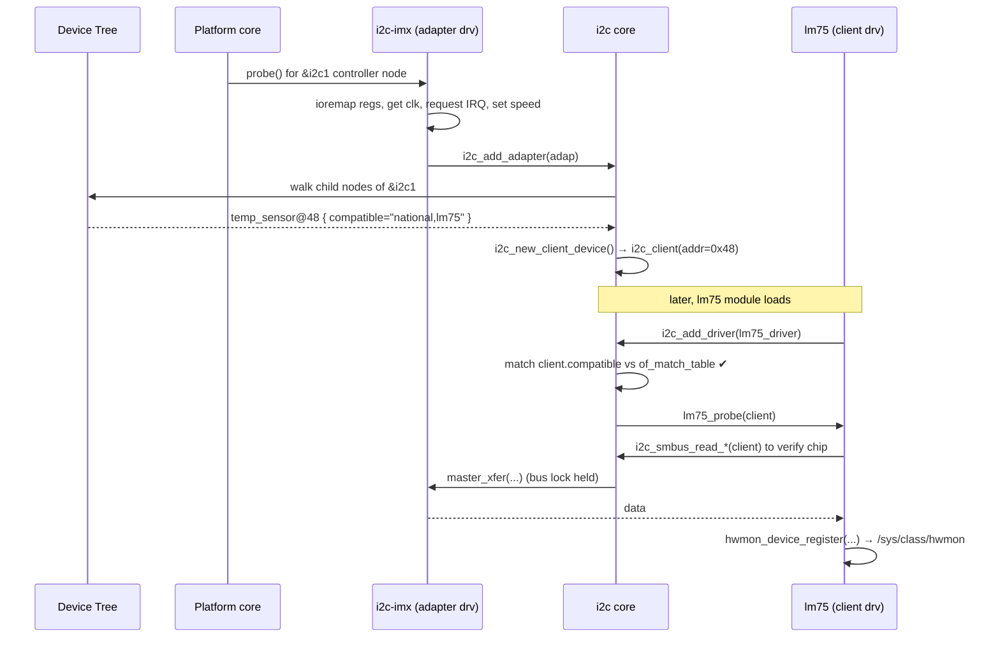
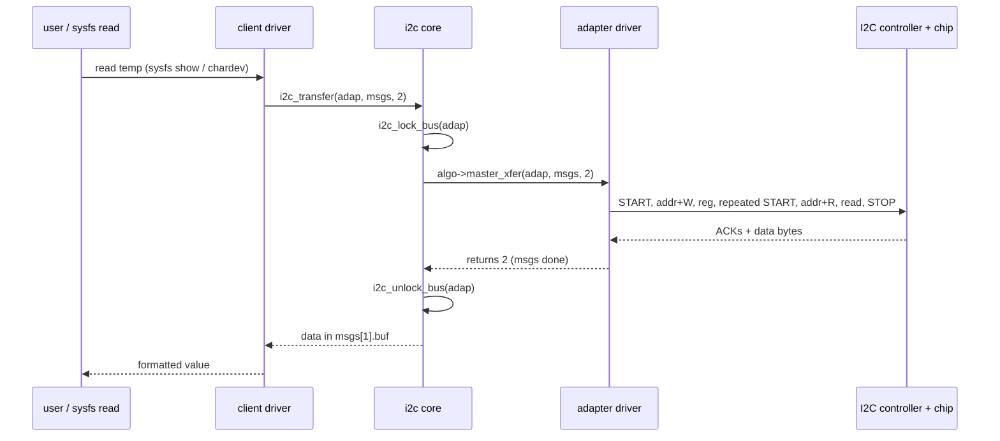

# I2C Driver in Linux — Complete Design (Start to End)

> A from-scratch, interview-ready deep dive into how the I2C subsystem works in the
> Linux kernel: from the two physical wires up to a working device driver, and the
> full path a single byte travels from user space to the chip.

---

## Table of Contents

1. [I2C Protocol Fundamentals (Hardware)](#1-i2c-protocol-fundamentals-hardware)
2. [The Big Picture — Where I2C Lives in Linux](#2-the-big-picture--where-i2c-lives-in-linux)
3. [Core Data Structures](#3-core-data-structures)
4. [Layer 1 — The Bus / Adapter (Controller) Driver](#4-layer-1--the-bus--adapter-controller-driver)
5. [Layer 2 — The I2C Core](#5-layer-2--the-i2c-core)
6. [Layer 3 — Device Instantiation (How a Chip Appears)](#6-layer-3--device-instantiation-how-a-chip-appears)
7. [Layer 4 — The Client (Device) Driver](#7-layer-4--the-client-device-driver)
8. [End-to-End Transaction Walkthrough](#8-end-to-end-transaction-walkthrough)
9. [SMBus vs Raw I2C](#9-smbus-vs-raw-i2c)
10. [User-Space Access](#10-user-space-access)
11. [Boot & Runtime Sequence Diagrams](#11-boot--runtime-sequence-diagrams)
12. [Summary Cheat Sheet](#12-summary-cheat-sheet)

---

## 1. I2C Protocol Fundamentals (Hardware)

**I2C (Inter-Integrated Circuit)** is a two-wire, synchronous, multi-master,
multi-slave, packet-switched serial bus invented by Philips (now NXP). It is used
to connect low-speed peripherals (sensors, EEPROMs, RTCs, PMICs, touch
controllers) to a processor on the **same board**.

### 1.1 Physical Layer

```
        +Vdd
         |
        +-+        +-+         <-- pull-up resistors (typ. 4.7kΩ)
        | |        | |
        +-+        +-+
         |          |
  -------+----+-----+----+-------------  SDA (Serial Data)
              |          |
  ------------+----+-----+----+--------  SCL (Serial Clock)
              |    |     |    |
          +---+----+-+ +-+----+---+
          | Master   | | Slave    |  ... up to 127 (7-bit) devices
          | (SoC)    | | (sensor) |
          +----------+ +----------+
```

- Only **two wires**: `SDA` (data) and `SCL` (clock), plus common ground.
- Both lines are **open-drain / open-collector** → devices can only pull the line
  **LOW**. The **pull-up resistors** pull it HIGH when nobody drives it. This is
  what enables multiple devices to share the bus without bus contention and makes
  **wired-AND** logic and clock stretching possible.
- All devices share the same two wires (a **bus**).

### 1.2 Roles

- **Master** — generates the clock (`SCL`), starts and stops transactions. Usually
  the SoC/controller. In Linux this is the **adapter**.
- **Slave** — responds to its address. Sensors, EEPROMs, etc. In Linux this is the
  **client**.

### 1.3 Addressing

- Each slave has a **7-bit address** (0x08–0x77 usable) → up to 112 devices.
- A **10-bit** addressing mode also exists (rarely used).
- The address is sent in the first byte: `[A6 A5 A4 A3 A2 A1 A0 | R/W]`
  - Bit 0 = **R/W**: `0` = master writes, `1` = master reads.

### 1.4 Bit Transfer Rules

- Data on `SDA` is only allowed to change while `SCL` is **LOW**.
- `SDA` is sampled while `SCL` is **HIGH**.
- Exceptions to that rule are the special **START** and **STOP** conditions.

```
START condition:  SDA falls while SCL is HIGH
STOP  condition:  SDA rises while SCL is HIGH

       _______                 ___________
SDA           |_______        |
       ___________            ___________
SCL              |_______    |
        START                STOP
```

### 1.5 A Full Transaction (Write then Read — "repeated start")

```
S | ADDR+W | A | REG  | A | Sr | ADDR+R | A | DATA | A | DATA | N | P
^   ^        ^   ^      ^   ^     ^       ^   ^      ^                ^
|   |        |   |      |   |     |       |   |      |                +-- STOP
|   |        |   |      |   |     |       |   |      +-- master NACKs last byte
|   |        |   |      |   |     |       |   +-- data from slave
|   |        |   |      |   |     |       +-- slave ACKs its address
|   |        |   |      |   |     +-- address + Read bit
|   |        |   |      |   +-- REPEATED START (no STOP in between)
|   |        |   |      +-- slave ACKs the register pointer
|   |        |   +-- register/command byte written to slave
|   |        +-- slave ACKs (pulls SDA low on 9th clock)
|   +-- 7-bit address + Write bit
+-- START
```

- After every 8 data bits, the receiver sends a **9th** bit: **ACK** (SDA LOW =
  "got it") or **NACK** (SDA HIGH = "stop / no more").
- This "write register pointer, repeated-start, then read" is the most common
  pattern for register-based chips.

### 1.6 Clock Stretching

A slow slave can hold `SCL` LOW after the 8th clock to tell the master "wait, I'm
not ready." The master must wait until the slave releases `SCL`. This is **clock
stretching** and is the main reason I2C timing is flexible.

### 1.7 Multi-Master Arbitration

Because lines are open-drain (wired-AND), two masters starting together will
naturally arbitrate: the one writing a `1` (line HIGH) while another writes a `0`
(line LOW) **sees** a `0`, detects the mismatch, and **backs off**. The winner
never knows arbitration happened. No data is corrupted.

### 1.8 Speed Modes

| Mode             | Clock      |
|------------------|------------|
| Standard         | 100 kHz    |
| Fast             | 400 kHz    |
| Fast-mode Plus   | 1 MHz      |
| High-speed       | 3.4 MHz    |
| Ultra-fast (one-way) | 5 MHz  |

> **Interview soundbite:** *"I2C is a two-wire, open-drain, master-driven bus.
> Devices can only pull lines low; pull-ups restore the high state. Each transfer
> is START, 7-bit address + R/W, 8-bit data units each followed by an ACK/NACK,
> ending in STOP. Slaves can clock-stretch; multiple masters arbitrate via
> wired-AND."*

---

## 2. The Big Picture — Where I2C Lives in Linux

The Linux I2C subsystem is layered. The single most important idea is the
**separation between the controller driver and the device driver**, glued
together by the **I2C core**.

```
 ┌──────────────────────────────────────────────────────────────┐
 │                        USER SPACE                              │
 │   i2c-tools (i2cdetect/i2cget/i2cset), your app via ioctl()    │
 └───────────────┬──────────────────────────────┬───────────────┘
                 │ /dev/i2c-N (char dev)         │ sysfs /sys/bus/i2c
 ════════════════╪══════════════════════════════╪════════════════ syscall
                 │                               │
 ┌───────────────▼───────────────────────────────────────────────┐
 │  i2c-dev.ko        (optional user-space gateway)               │
 ├────────────────────────────────────────────────────────────────┤
 │  CLIENT DRIVERS  (one per chip type)                           │
 │  e.g. lm75 (temp), at24 (eeprom), rtc-ds1307, mpu6050 ...      │
 │  ── register an `struct i2c_driver` with .probe/.remove ──     │
 ├────────────────────────────────────────────────────────────────┤
 │  I2C CORE   (drivers/i2c/i2c-core-*.c)                         │
 │  - i2c_transfer(), SMBus emulation, bus matching, locking,     │
 │    sysfs, device-tree/ACPI enumeration, /dev plumbing          │
 ├────────────────────────────────────────────────────────────────┤
 │  ADAPTER / BUS DRIVERS  (one per HW controller instance)       │
 │  e.g. i2c-imx, i2c-designware, i2c-bcm2835, i2c-tegra ...      │
 │  ── provide `struct i2c_algorithm.master_xfer()` ──            │
 └───────────────┬────────────────────────────────────────────────┘
                 │ MMIO registers / IRQ / DMA
 ════════════════╪═══════════════════════════════════════════════ HW boundary
 ┌───────────────▼────────────────────────────────────────────────┐
 │  I2C CONTROLLER (SoC peripheral)  ──SDA/SCL──►  the chip        │
 └────────────────────────────────────────────────────────────────┘
```

**Four players you must name in an interview:**

| Player | Kernel object | Who writes it | Job |
|--------|---------------|---------------|-----|
| Controller / bus | `struct i2c_adapter` + `struct i2c_algorithm` | SoC vendor | Turn `i2c_msg`s into real SCL/SDA toggling |
| Core | `i2c-core-*.c` | kernel | Routing, matching, locking, SMBus, sysfs, /dev |
| Device driver | `struct i2c_driver` | chip/driver author | Drive one type of chip; expose it to the right subsystem (hwmon, rtc, input…) |
| Device instance | `struct i2c_client` | core (from DT/ACPI/board) | Represents one physical chip on one bus at one address |

> **Key principle:** A client driver (e.g. the LM75 temperature sensor driver)
> works on **any** I2C controller, and any controller can host **any** chip,
> because neither talks to the other directly — they both talk to the **core**
> through standard structures. This is the essence of the design.

---

## 3. Core Data Structures

These six structures are the backbone. Know them cold.

### 3.1 `struct i2c_msg` — one segment of a transfer

```c
struct i2c_msg {
    __u16 addr;     /* 7-bit slave address                       */
    __u16 flags;    /* I2C_M_RD = read; 0 = write; I2C_M_TEN ... */
    __u16 len;      /* number of bytes in buf                    */
    __u8 *buf;      /* the data buffer                           */
};
```

A transaction = an **array of `i2c_msg`**. Between messages with no STOP, the core
asks the adapter to issue a **repeated START**.

### 3.2 `struct i2c_adapter` — one bus/controller instance

```c
struct i2c_adapter {
    struct module        *owner;
    unsigned int          class;
    const struct i2c_algorithm *algo;  /* HOW to talk on the wire */
    void                 *algo_data;
    struct rt_mutex       bus_lock;    /* serializes bus access   */
    int                   timeout;
    int                   retries;
    struct device         dev;         /* embedded device model   */
    int                   nr;          /* bus number → /dev/i2c-N */
    char                  name[48];
    struct i2c_bus_recovery_info *bus_recovery_info;
    ...
};
```

### 3.3 `struct i2c_algorithm` — the "how to move bits" callbacks

```c
struct i2c_algorithm {
    /* The heart of an adapter driver: do an array of i2c_msgs */
    int (*master_xfer)(struct i2c_adapter *adap,
                       struct i2c_msg *msgs, int num);

    /* Optional: native SMBus implementation */
    int (*smbus_xfer)(struct i2c_adapter *adap, u16 addr,
                      unsigned short flags, char read_write,
                      u8 command, int size, union i2c_smbus_data *data);

    /* Which functionality is supported (I2C_FUNC_*) */
    u32 (*functionality)(struct i2c_adapter *adap);
};
```

### 3.4 `struct i2c_client` — one physical chip

```c
struct i2c_client {
    unsigned short        flags;
    unsigned short        addr;     /* 7-bit address on the bus    */
    char                  name[I2C_NAME_SIZE];
    struct i2c_adapter   *adapter;  /* which bus it sits on        */
    struct device         dev;      /* device-model node           */
    int                   irq;      /* attached IRQ, if any        */
    struct list_head      detected;
};
```
Created by the core. Passed to your driver's `.probe()`. You use it as the handle
for every transfer.

### 3.5 `struct i2c_driver` — your client driver

```c
struct i2c_driver {
    /* Modern probe (single arg since v5.3+/6.x) */
    int  (*probe)(struct i2c_client *client);
    void (*remove)(struct i2c_client *client);

    struct device_driver driver;             /* .name, .of_match_table */
    const struct i2c_device_id *id_table;    /* legacy / non-DT match  */

    /* Optional auto-detection for adapters that ask for it */
    int  (*detect)(struct i2c_client *client, struct i2c_board_info *info);
    const unsigned short *address_list;
};
```

### 3.6 Matching tables

```c
/* Device-Tree match (preferred on ARM/embedded) */
static const struct of_device_id foo_of_match[] = {
    { .compatible = "vendor,foo-chip" },
    { }
};
MODULE_DEVICE_TABLE(of, foo_of_match);

/* Legacy/i2c_board_info/userspace "new_device" match */
static const struct i2c_device_id foo_id[] = {
    { "foo-chip", 0 },
    { }
};
MODULE_DEVICE_TABLE(i2c, foo_id);
```

---

## 4. Layer 1 — The Bus / Adapter (Controller) Driver

This driver knows the **SoC's I2C controller hardware** (its registers, IRQ, FIFO,
DMA). It is usually a **platform driver** probed from the device tree.

### 4.1 What it must do

1. `probe()` (platform): map registers (`devm_platform_ioremap_resource`), get
   clock, request IRQ, set bus speed.
2. Fill an `i2c_algorithm` with `master_xfer` + `functionality`.
3. Fill and register an `i2c_adapter` via `i2c_add_adapter()` (dynamic bus number)
   or `i2c_add_numbered_adapter()` (fixed number).
4. On registration, the **core automatically walks the controller's DT child
   nodes** and instantiates every chip described there (creating `i2c_client`s).

### 4.2 The critical function: `master_xfer`

```c
static int foo_i2c_xfer(struct i2c_adapter *adap,
                        struct i2c_msg *msgs, int num)
{
    struct foo_i2c *i2c = i2c_get_adapdata(adap);
    int i, ret;

    for (i = 0; i < num; i++) {
        struct i2c_msg *m = &msgs[i];

        /* issue (repeated) START + address + R/W */
        ret = foo_send_start(i2c, m->addr, m->flags & I2C_M_RD,
                             /*repeated=*/ i != 0);
        if (ret) goto out;

        if (m->flags & I2C_M_RD)
            ret = foo_read_bytes(i2c, m->buf, m->len);   /* read len bytes  */
        else
            ret = foo_write_bytes(i2c, m->buf, m->len);  /* write len bytes */
        if (ret) goto out;
    }
    foo_send_stop(i2c);
    return num;            /* return number of msgs processed on success */
out:
    foo_send_stop(i2c);
    return ret;           /* negative errno on failure */
}
```

> **Contract:** `master_xfer` returns the **number of messages** transferred on
> success (so the core can verify `== num`), or a **negative errno** on failure.
> It must handle the repeated-START between messages and issue exactly one STOP at
> the end. The core holds `bus_lock` around the whole call, so the driver doesn't
> worry about other clients racing.

A full adapter skeleton is in [`03_i2c_adapter_driver.c`](03_i2c_adapter_driver.c).

---

## 5. Layer 2 — The I2C Core

The core (`drivers/i2c/i2c-core-base.c`, `i2c-core-smbus.c`, `i2c-dev.c`) is the
glue. Client drivers and adapter drivers **never call each other directly** — they
both call the core.

### 5.1 `i2c_transfer()` — the central entry point

```c
int i2c_transfer(struct i2c_adapter *adap, struct i2c_msg *msgs, int num)
{
    int ret;

    /* serialize: only one transaction on this physical bus at a time */
    i2c_lock_bus(adap, I2C_LOCK_SEGMENT);
    ret = __i2c_transfer(adap, msgs, num);  /* → adap->algo->master_xfer */
    i2c_unlock_bus(adap, I2C_LOCK_SEGMENT);

    return ret;
}
```

Responsibilities of the core:
- **Locking** — `bus_lock` (rt_mutex) makes the bus exclusive per-transaction.
- **Routing** — dispatch to the correct `adap->algo->master_xfer`.
- **Retries / timeout** — honor `adap->retries` and `adap->timeout`.
- **SMBus** — if the adapter has no native `smbus_xfer`, the core **emulates**
  SMBus on top of `master_xfer` (`i2c_smbus_xfer_emulated`).
- **Matching / binding** — implement `i2c_bus_type.match` (DT compatible → ACPI →
  id_table) to bind drivers to clients.
- **Enumeration** — parse device tree / ACPI / board info, create clients.
- **sysfs & /dev** — expose everything under `/sys/bus/i2c` and `/dev/i2c-N`.

### 5.2 Convenience wrappers the core gives client drivers

```c
i2c_master_send(client, buf, count);     /* one write msg            */
i2c_master_recv(client, buf, count);     /* one read msg             */
i2c_smbus_read_byte_data(client, cmd);   /* SMBus read byte          */
i2c_smbus_write_byte_data(client, cmd, val);
i2c_smbus_read_word_data(client, cmd);
i2c_smbus_read_i2c_block_data(client, cmd, len, buf);

/* The modern, recommended register-access path: regmap-i2c */
regmap_read(map, reg, &val);
regmap_write(map, reg, val);
```

---

## 6. Layer 3 — Device Instantiation (How a Chip Appears)

A chip becomes an `i2c_client` in one of several ways:

### 6.1 Device Tree (the dominant method on embedded/ARM)

```dts
&i2c1 {                              /* the controller node      */
    status = "okay";
    clock-frequency = <400000>;

    temp_sensor@48 {                 /* unit-address = I2C addr   */
        compatible = "national,lm75";
        reg = <0x48>;                /* 7-bit address 0x48        */
        interrupt-parent = <&gpio2>;
        interrupts = <5 IRQ_TYPE_LEVEL_LOW>;
    };
};
```

When the adapter for `&i2c1` registers, the core reads these child nodes and
calls `i2c_new_client_device()` for each — creating a client at `addr 0x48`
named after `compatible`.

### 6.2 ACPI

On x86/ACPI platforms, devices are described by `_HID`/`_CRS` in ACPI tables; the
core's ACPI walker creates the clients.

### 6.3 Board info (legacy, board files)

```c
static struct i2c_board_info my_devs[] = {
    { I2C_BOARD_INFO("lm75", 0x48) },
};
i2c_register_board_info(1, my_devs, ARRAY_SIZE(my_devs));
```

### 6.4 Explicit from another driver

```c
struct i2c_board_info info = { I2C_BOARD_INFO("foo", 0x50) };
client = i2c_new_client_device(adapter, &info);
```

### 6.5 From user space (great for bring-up/debug)

```bash
# instantiate
echo lm75 0x48 > /sys/bus/i2c/devices/i2c-1/new_device
# remove
echo 0x48      > /sys/bus/i2c/devices/i2c-1/delete_device
```

### 6.6 Auto-detection (`.detect` + `address_list`)

Only for adapters with class bits set. The core probes the listed addresses and
calls your `.detect()` to confirm the chip ID. Discouraged for new code; DT is
preferred.

---

## 7. Layer 4 — The Client (Device) Driver

This is what most people mean by "an I2C driver." It drives **one type of chip**
and usually registers it with a higher subsystem (hwmon, iio, rtc, input…).

### 7.1 Lifecycle

```
module_i2c_driver(foo_driver)
        │
        ▼
 i2c_add_driver() ──registers──► i2c_bus_type
        │
        │  core matches each i2c_client on the bus against this driver
        │  (of_match_table → ACPI → id_table)
        ▼
 .probe(client)   ◄── called once per matching chip
        │  - sanity-check the chip (read an ID register)
        │  - allocate driver state (devm_kzalloc)
        │  - i2c_set_clientdata(client, state)
        │  - register with hwmon/iio/rtc/input/regmap...
        ▼
   ...device is live, transfers happen...
        ▼
 .remove(client)  ◄── on unbind / rmmod / hot-unplug
```

### 7.2 Minimal but complete client driver

```c
#include <linux/module.h>
#include <linux/i2c.h>

struct foo_state { struct i2c_client *client; /* ... */ };

static int foo_probe(struct i2c_client *client)
{
    struct foo_state *st;
    int id;

    /* 1. confirm the chip really is there: read a known ID register */
    id = i2c_smbus_read_byte_data(client, FOO_REG_WHOAMI);
    if (id < 0)            return id;            /* bus error          */
    if (id != FOO_CHIP_ID) return -ENODEV;       /* wrong/absent chip  */

    /* 2. allocate per-device state (auto-freed on remove) */
    st = devm_kzalloc(&client->dev, sizeof(*st), GFP_KERNEL);
    if (!st) return -ENOMEM;
    st->client = client;
    i2c_set_clientdata(client, st);

    /* 3. register with whatever subsystem this chip belongs to ... */
    dev_info(&client->dev, "foo chip at 0x%02x ready\n", client->addr);
    return 0;
}

static void foo_remove(struct i2c_client *client)
{
    /* devm_* cleans up automatically; undo any manual setup here */
}

static const struct of_device_id foo_of_match[] = {
    { .compatible = "vendor,foo" }, { }
};
MODULE_DEVICE_TABLE(of, foo_of_match);

static const struct i2c_device_id foo_id[] = {
    { "foo", 0 }, { }
};
MODULE_DEVICE_TABLE(i2c, foo_id);

static struct i2c_driver foo_driver = {
    .driver = {
        .name           = "foo",
        .of_match_table = foo_of_match,
    },
    .probe    = foo_probe,
    .remove   = foo_remove,
    .id_table = foo_id,
};
module_i2c_driver(foo_driver);   /* expands to module_init/exit boilerplate */

MODULE_AUTHOR("you");
MODULE_DESCRIPTION("Foo I2C client driver");
MODULE_LICENSE("GPL");
```

A richer, register-based example is in [`02_i2c_client_driver.c`](02_i2c_client_driver.c).

### 7.3 Reading & writing a register (the common pattern)

```c
/* Write register pointer, then read N bytes with a repeated START */
static int foo_read_regs(struct i2c_client *c, u8 reg, u8 *buf, int len)
{
    struct i2c_msg msgs[2] = {
        { .addr = c->addr, .flags = 0,        .len = 1,   .buf = &reg },
        { .addr = c->addr, .flags = I2C_M_RD, .len = len, .buf = buf  },
    };
    int ret = i2c_transfer(c->adapter, msgs, 2);   /* 2 segments, 1 STOP */
    return (ret == 2) ? 0 : (ret < 0 ? ret : -EIO);
}
```

---

## 8. End-to-End Transaction Walkthrough

### 8.1 Kernel path — a client driver reads a temperature

```
lm75 driver: i2c_smbus_read_word_data(client, TEMP_REG)
   │
   ▼
i2c core: i2c_smbus_xfer()
   │   adapter has native smbus_xfer?  ── yes ─► adap->algo->smbus_xfer()
   │   no ─► i2c_smbus_xfer_emulated(): builds i2c_msg[] and calls...
   ▼
i2c core: i2c_transfer(adap, msgs, num)
   │   i2c_lock_bus(adap)            (exclusive bus)
   ▼
adapter driver: adap->algo->master_xfer(adap, msgs, num)
   │   write controller registers: load slave addr, set R/W, push/pop FIFO
   │   kick a START; wait for IRQ/poll completion; clock-stretch handled by HW
   ▼
I2C controller peripheral  → toggles SCL, drives/reads SDA
   │
   ▼
the chip ACKs address, returns data bytes, master issues STOP
   │
   ▼  (unwind) data copied into msg->buf → returned up the stack to the driver
```

### 8.2 User-space path — `i2cget -y 1 0x48 0x00`

```
i2cget (user)                        user space
   │ open("/dev/i2c-1"); ioctl(fd, I2C_SLAVE, 0x48);
   │ ioctl(fd, I2C_SMBUS, &args)      or read()/write()
   ▼ ─────────────────────────────── syscall boundary ───────────────
i2c-dev.ko: i2cdev_ioctl()
   │ translate ioctl → i2c_smbus_xfer() / i2c_transfer()
   ▼
i2c core  →  adapter master_xfer  →  controller  →  SDA/SCL  →  chip
```

> **Interview soundbite:** *"A client driver calls `i2c_transfer` or an SMBus
> helper. The core takes the bus lock and dispatches to the adapter's
> `master_xfer`, which programs the SoC's I2C controller registers. The controller
> physically toggles SCL and SDA, the slave ACKs and returns data, the result
> flows back up. User space reaches the same `master_xfer` through `/dev/i2c-N`
> and the `i2c-dev` driver."*

---

## 9. SMBus vs Raw I2C

**SMBus** is a stricter subset/profile of I2C (originally for PC battery/PMIC).
Most register-based chips speak the SMBus subset, which is why the SMBus helpers
are so common.

| Aspect | I2C | SMBus |
|--------|-----|-------|
| Spec origin | Philips/NXP | Intel |
| Min clock | none (can be DC) | 10 kHz min |
| Timeout | none (can hang) | 25–35 ms (defined) |
| Transactions | arbitrary length, free-form | fixed forms: read/write byte/word/block, process call |
| PEC (CRC-8) | no | optional |
| Linux helpers | `i2c_master_send/recv`, `i2c_transfer` | `i2c_smbus_*` |

**Why it matters in Linux:** If an adapter implements only `master_xfer`, the core
**emulates** every SMBus call on top of it, so SMBus helpers work everywhere. The
reverse is **not** true — a pure SMBus controller (e.g. some PC chipsets) cannot do
arbitrary raw I2C. Always advertise capabilities through `functionality()`
(`I2C_FUNC_I2C`, `I2C_FUNC_SMBUS_BYTE_DATA`, …) and check with
`i2c_check_functionality()`.

---

## 10. User-Space Access

```bash
# list all buses
i2cdetect -l

# scan bus 1 for devices (shows responding addresses)
i2cdetect -y 1

# read register 0x00 of device 0x48 on bus 1
i2cget -y 1 0x48 0x00

# write 0xAB to register 0x01 of device 0x50 on bus 1
i2cset -y 1 0x50 0x01 0xAB
```

Programmatically:

```c
int fd = open("/dev/i2c-1", O_RDWR);
ioctl(fd, I2C_SLAVE, 0x48);              /* pick the chip          */
u8 reg = 0x00;
write(fd, &reg, 1);                      /* set register pointer   */
u8 val;
read(fd, &val, 1);                       /* read the register      */
```

> **Caution:** Don't poke a bus from user space while a kernel driver owns the
> device (`I2C_SLAVE_FORCE` overrides the safety check — use only for debug).

---

## 11. Boot & Runtime Sequence Diagrams

### 11.1 Boot-time binding (Device Tree)



### 11.2 Runtime read



---

## 12. Summary Cheat Sheet

**The one-paragraph answer:**
> *"Linux splits I2C into a controller (adapter) driver and a device (client)
> driver, decoupled by the I2C core. The adapter driver implements
> `i2c_algorithm.master_xfer`, which knows the SoC controller's registers and
> turns an array of `i2c_msg`s into real START/address/data/STOP signaling. The
> client driver registers an `i2c_driver` with a `.probe`; the core matches it to
> an `i2c_client` (instantiated from device tree, ACPI, board info, or sysfs) and
> calls probe. To talk to the chip, the client driver calls `i2c_transfer` or an
> `i2c_smbus_*` helper; the core takes the per-bus lock and dispatches to the
> adapter's `master_xfer`. User space reaches the same path through `/dev/i2c-N`
> via the `i2c-dev` driver. SMBus is a stricter subset that the core can emulate
> over any raw-I2C adapter."*

**Must-know structures:** `i2c_msg`, `i2c_adapter`, `i2c_algorithm`,
`i2c_client`, `i2c_driver`, `i2c_device_id`/`of_device_id`.

**Must-know functions:**
- Adapter side: `i2c_add_adapter`, `i2c_add_numbered_adapter`, `master_xfer`,
  `functionality`.
- Core: `i2c_transfer`, `__i2c_transfer`, `i2c_smbus_xfer`.
- Client side: `i2c_add_driver` / `module_i2c_driver`, `probe`/`remove`,
  `i2c_master_send/recv`, `i2c_smbus_read*/write*`, `i2c_set/get_clientdata`.

**Must-know flags:** `I2C_M_RD` (read), `I2C_M_TEN` (10-bit), `I2C_M_NOSTART`,
`I2C_M_STOP`.

**Files in the real kernel:**
`drivers/i2c/i2c-core-base.c`, `i2c-core-smbus.c`, `i2c-dev.c`,
`drivers/i2c/busses/*` (adapters), `include/linux/i2c.h`,
`include/uapi/linux/i2c.h` & `i2c-dev.h`.

---

### Companion files in this folder
- [`02_i2c_client_driver.c`](02_i2c_client_driver.c) — full annotated client driver.
- [`03_i2c_adapter_driver.c`](03_i2c_adapter_driver.c) — adapter/controller skeleton.
- [`04_devicetree_and_userspace.md`](04_devicetree_and_userspace.md) — DT bindings + user-space recipes.
- [`05_interview_qa.md`](05_interview_qa.md) — rapid-fire interview Q&A.
