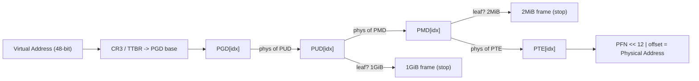
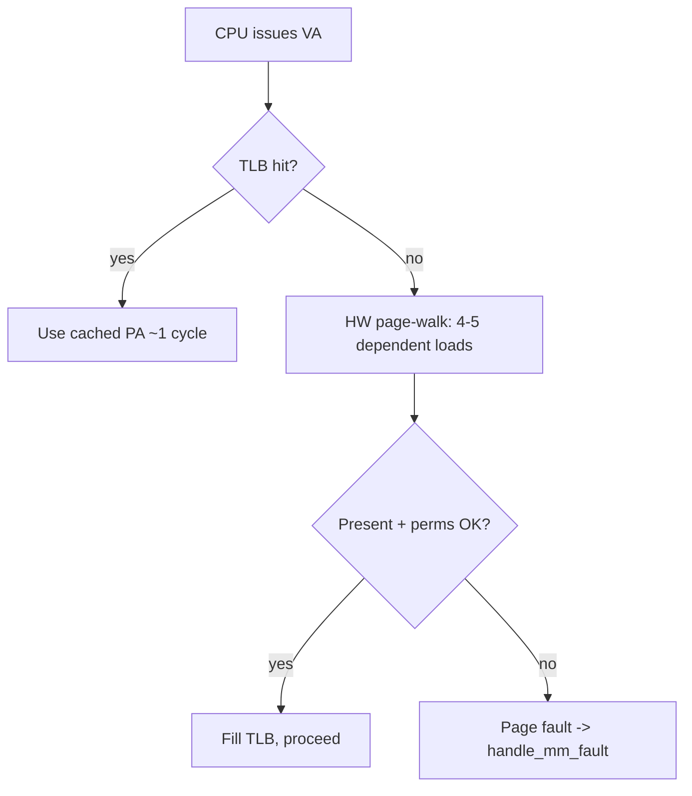

# Q1 — The Linux Page Table Walk (4-Level / 5-Level) on x86-64 and ARM64

> **Subsystem:** Memory Management · **Files:** `arch/x86/mm/`, `arch/arm64/mm/`, `mm/memory.c`, `include/asm-generic/pgtable*`
> **Interviewer is really probing:** Do you understand virtual→physical translation at the
> hardware/software boundary, TLB economics, and how huge pages change the walk?

---

## TL;DR Cheat Sheet (30-second recall)

- A virtual address is **sliced into index fields**, one per page-table level, plus a page offset.
- x86-64 4-level: **PGD → PUD → PMD → PTE** (9 bits each = 512 entries) + 12-bit offset = 48-bit VA.
  5-level (LA57) inserts **P4D** above PUD → 57-bit VA.
- ARM64: same generic names (PGD/PUD/PMD/PTE) map onto **TTBR0/TTBR1 + levels 0–3**; split VA
  with `TTBR0_EL1` (user) / `TTBR1_EL1` (kernel) selected by the top VA bits.
- The **MMU hardware** does the walk on a TLB miss (a "hardware page-table walker"); Linux just
  builds the tables in the format the CPU expects.
- **TLB** caches VA→PA so the walk is skipped on hits; a miss = up to 4–5 memory loads.
- **Huge pages** stop the walk early: a PMD entry (2 MiB) or PUD entry (1 GiB) with the
  "this is a leaf, not a pointer" bit set → fewer levels, fewer TLB entries.
- Linux uses a **5-level-folded** generic model: on a 4-level CPU, P4D folds to a no-op so the
  same `mm/` code compiles for both.

Key structs: `pgd_t`, `p4d_t`, `pud_t`, `pmd_t`, `pte_t`; helpers `pgd_offset()`,
`p4d_offset()`, `pud_offset()`, `pmd_offset()`, `pte_offset_map()`.

---

## The Question

> Explain the Linux page-table walk and how a 4-level (or 5-level) page table is traversed
> on x86-64 and ARM64. Cover PGD → P4D → PUD → PMD → PTE, TLB interaction, and huge pages.

What they want to hear: the **bit-slicing of a VA**, that **hardware** does the walk while
**software builds the tables**, how Linux's **generic folded model** abstracts arch differences,
and the **performance levers** (TLB, huge pages, ASIDs/PCIDs).

---

## Why does a multi-level page table exist?

A flat (single-level) page table for a 48-bit VA with 4 KiB pages would need
$2^{48}/2^{12} = 2^{36}$ entries × 8 bytes = **512 GiB per process** — absurd. The problem:
**most of the address space is unmapped**, so we want a structure that costs memory only for
regions actually in use.

A **radix tree / multi-level table** solves this: upper levels can be **entirely absent**
(a NULL/`none` entry) so a sparse address space costs only the levels along populated paths.
Trade-off: a translation now requires **multiple dependent memory loads** instead of one —
which is exactly why the **TLB** and **huge pages** matter so much.

Design rationale summary:
- **Space:** pay only for mapped regions (sparse-friendly).
- **Sharing:** subtrees can be shared (e.g. kernel half via shared PGD entries; COW fork).
- **Protection granularity:** per-page permission/`NX`/`USER` bits at the leaf.
- **Cost:** more memory accesses per translation → mitigated by TLB + large pages.

---

## When does a walk happen?

- **On a TLB miss** for a virtual address. On a TLB hit, no walk occurs — the cached
  translation is used directly.
- **On a page fault** (`#PF` on x86, data/instruction abort on ARM64), software (`mm/memory.c`,
  `do_page_fault()` → `handle_mm_fault()`) walks/creates the tables, e.g. demand paging, COW,
  populating a `none` entry.
- **During `mmap`/`munmap`/`mprotect`/`fork`**, the kernel walks to install, tear down, or
  change protection of PTEs.
- **During reclaim/migration**, rmap walks find and modify PTEs (see Q5).

Two distinct walkers:
1. **Hardware walker** — the CPU MMU, on TLB miss, reads the tables you built. Fast, automatic.
2. **Software walker** — Linux C code (`walk_page_range()`, `*_offset()` helpers) for fault
   handling, reclaim, dirty/young tracking.

---

## Where in the kernel / hardware

| Element | x86-64 | ARM64 |
|---------|--------|-------|
| Top-level base register | `CR3` (holds PGD phys + PCID) | `TTBR0_EL1` (user) / `TTBR1_EL1` (kernel) |
| VA space split | one space; kernel in high half | hardware split by top bits → two TTBRs |
| Levels (4KB granule) | PGD,PUD,PMD,PTE (+P4D if LA57) | L0,L1,L2,L3 (mapped to PGD,PUD,PMD,PTE) |
| Address-space tag | PCID | ASID (in TTBR) |
| Walk trigger | TLB miss → HW walker | TLB miss → HW walker |

Generic kernel code: `include/linux/pgtable.h`, `mm/memory.c`, `mm/pgtable-generic.c`.
Arch glue: `arch/x86/include/asm/pgtable*.h`, `arch/arm64/include/asm/pgtable*.h`.

---

## How the walk works — step by step

### 1. Slice the virtual address (x86-64, 4-level, 4 KiB pages)

A 48-bit canonical VA is divided into **five fields of 9/9/9/9/12 bits**:

```
 47        39 38        30 29        21 20        12 11            0
+------------+------------+------------+------------+---------------+
|  PGD idx   |  PUD idx   |  PMD idx   |  PTE idx   |  page offset  |
|  (9 bits)  |  (9 bits)  |  (9 bits)  |  (9 bits)  |   (12 bits)   |
+------------+------------+------------+------------+---------------+
   512 entries each level (2^9), each entry 8 bytes → one 4KB table per level
```

With **5-level (LA57)**, bits 56–48 become the **P4D** index and VA grows to 57 bits.

### 2. Walk the levels

1. Read **PGD base** from `CR3` (x86) / `TTBRn_EL1` (ARM64).
2. `entry = PGD[pgd_idx]`. If "present" bit clear → fault. Else entry holds the **physical
   address of the next-level table** (PUD).
3. `entry = PUD[pud_idx]` → physical address of PMD.
4. `entry = PMD[pmd_idx]` → physical address of PTE table (unless it's a 2 MiB **huge** leaf).
5. `pte = PTE[pte_idx]` → **physical frame number (PFN)** + permission/attribute bits.
6. **Physical address = (PFN << 12) | page_offset.**

Each step is a **dependent load** (you must read level N to know where level N+1 is) — this
serial dependency is why a TLB miss is expensive (4 loads for 4-level, 5 for 5-level), and why
hardware **page-walk caches** (intermediate-level caches) exist alongside the TLB.

### 3. TLB interaction

- On a **TLB hit**: VA→PA returned in ~1 cycle; no table reads.
- On a **TLB miss**: hardware walker performs steps above, then **fills the TLB**.
- **Context switch:** changing `CR3`/`TTBR` normally flushes the TLB — unless **PCID (x86)** /
  **ASID (ARM64)** tags entries by address space so they survive the switch (huge win for
  switch-heavy workloads).
- **Invalidation:** `INVLPG`/`invpcid` (x86), `TLBI` (ARM64) flush stale entries after a PTE
  change; Linux batches these (`tlb_gather`/`mmu_gather`) to amortize cost.

### 4. Huge pages — stopping the walk early

A page-table entry has a **"page size / leaf"** bit (x86 `PS` bit; ARM64 block descriptor):

- **2 MiB page:** the **PMD** entry is a *leaf* — its value is the PFN of a 2 MiB region, and
  the walk stops at level PMD. VA offset is now the low **21 bits**.
- **1 GiB page:** the **PUD** entry is the leaf; walk stops one level higher; offset = low 30 bits.

Benefits: **fewer levels per walk**, and crucially **one TLB entry covers 2 MiB / 1 GiB** instead
of 512 / 262144 separate 4 KiB entries → dramatically fewer TLB misses for large working sets.
Used by **hugetlbfs** (explicit) and **THP / Transparent Huge Pages** (automatic, `khugepaged`).
Cost: internal fragmentation, harder to reclaim/migrate, possible TLB shootdown amplification.

---

## Diagrams

### Multi-level walk (4-level x86-64)



### TLB decision



---

## Annotated C

```c
/* The five typed levels (include/linux/pgtable.h, arch overrides them). */
typedef struct { unsigned long pgd; } pgd_t;   /* top */
typedef struct { unsigned long p4d; } p4d_t;   /* only "real" on 5-level */
typedef struct { unsigned long pud; } pud_t;
typedef struct { unsigned long pmd; } pmd_t;
typedef struct { unsigned long pte; } pte_t;   /* leaf: PFN + flags */

/*
 * Canonical software walk for one address `addr` in mm.
 * Each *_offset() = base_of_this_level + index_extracted_from_addr.
 * On a 4-level CPU, p4d_offset() is a compile-time no-op (folding).
 */
static pte_t *walk(struct mm_struct *mm, unsigned long addr)
{
    pgd_t *pgd = pgd_offset(mm, addr);          /* CR3/TTBR base + PGD index */
    if (pgd_none(*pgd) || pgd_bad(*pgd)) return NULL;

    p4d_t *p4d = p4d_offset(pgd, addr);         /* folded away on 4-level */
    if (p4d_none(*p4d)) return NULL;

    pud_t *pud = pud_offset(p4d, addr);
    if (pud_none(*pud)) return NULL;
    if (pud_leaf(*pud)) return (pte_t *)pud;    /* 1 GiB huge page leaf */

    pmd_t *pmd = pmd_offset(pud, addr);
    if (pmd_none(*pmd)) return NULL;
    if (pmd_leaf(*pmd)) return (pte_t *)pmd;    /* 2 MiB huge page leaf */

    return pte_offset_map(pmd, addr);           /* maps + indexes leaf PTE table */
}

/* A PTE packs the physical frame number plus permission/attribute bits. */
/* x86 bits: _PAGE_PRESENT, _PAGE_RW, _PAGE_USER, _PAGE_PSE(huge), _PAGE_NX ... */
```

> **Folding** is the key portability trick: the generic `mm/` code is written for **5 levels**;
> on a 4-level CPU the P4D layer is `#define`d to pass through PGD, so there's literally **one
> set of MM code** for all configurations.

---

## Company Angle

- **Qualcomm (ARM64):** Expect ARM64 specifics — `TTBR0_EL1`/`TTBR1_EL1` split, **ASID**
  management, 4 KB vs 16 KB vs 64 KB **granules** (which change level count and field widths),
  and stage-2 translation for virtualization. Know that ARM64 "levels 0–3" map to PGD–PTE.
- **NVIDIA:** TLB/IOMMU parallels — the GPU's IOMMU/SMMU does its own page walks; huge pages
  reduce IOTLB pressure for large GPU buffers. Be ready to connect CPU page tables to **IOMMU
  page tables (Q18)**.
- **AMD:** NUMA + huge pages — placement of page tables and the cost of remote walks; PCID and
  large-page TLB coverage for multi-die scaling.
- **Google:** THP trade-offs at fleet scale (latency spikes from compaction/`khugepaged`), and
  TLB-shootdown storms as a tail-latency source.

---

## War Story (tell this)

*"We had a data-analytics service whose p99 latency periodically doubled. `perf stat` showed
**dtlb_load_misses.walk_active** spiking — we were spending ~15% of cycles in page-table walks.
The working set was ~40 GiB of randomly-accessed hash tables, so 4 KiB pages thrashed a TLB that
only covers a few MiB. We enabled **THP** for the allocation and, where THP's async collapse was
too jittery, switched the hottest arena to **explicit 1 GiB hugetlb pages** via `mmap(MAP_HUGETLB)`.
TLB walk cycles dropped ~10x and p99 stabilized. The subtle follow-on bug: 1 GiB pages made
**NUMA placement coarser**, so we had to add `numactl`/`mbind` policy so the huge pages landed on
the right node — otherwise we'd traded TLB misses for remote-memory latency."*

Signals this sends: you measure (`perf`), you understand TLB economics, huge-page trade-offs,
and the **second-order NUMA interaction**.

---

## Interviewer Follow-ups (with crisp answers)

1. **Why dependent loads, and how does the CPU hide the cost?**
   Each level's address comes from the previous level's entry → serial. CPUs add **page-walk
   caches** (cache PGD/PUD/PMD intermediates) and do **speculative/parallel walks** for multiple
   misses, but the fundamental latency is hidden mainly by the **TLB** and **huge pages**.

2. **What is folding and why does Linux do it?**
   Generic MM is written for 5 levels; on 4-level hardware P4D (and on 32-bit, more levels) are
   compile-time no-ops, so one code base serves all level counts.

3. **PCID/ASID — what problem do they solve?**
   They tag TLB entries with an address-space ID so a context switch (`CR3`/`TTBR` change)
   doesn't require a full TLB flush, preserving entries across switches.

4. **What's a TLB shootdown?**
   When one CPU changes/unmaps a PTE, other CPUs may hold stale TLB entries; the originator IPIs
   them to invalidate (`flush_tlb_*`). It's a scalability pain point; ARM64 has broadcast `TLBI`
   to avoid IPIs.

5. **How does a 2 MiB THP get created and split?**
   `khugepaged` scans for 512 contiguous, suitable 4 KiB pages and **collapses** them into a PMD
   leaf; it **splits** back to 4 KiB on `mprotect` of a sub-range, partial unmap, or reclaim.

6. **ARM64 granule sizes?**
   4 KB (4 levels), 16 KB, 64 KB granules change field widths and level counts; 64 KB granule can
   reach large VAs in fewer levels but wastes memory on small mappings.

7. **Where do permission bits live and what enforces them?**
   In the **leaf PTE** (and intermediate entries gate sub-trees): `PRESENT`, `RW`, `USER`, `NX`.
   The **MMU** enforces them during the walk; a violation raises a fault.

---

## 30-Minute Talk Track

| Min | Cover |
|-----|-------|
| 0–3 | Why multi-level exists (sparse space, 512 GiB flat-table problem) |
| 3–8 | VA bit-slicing diagram; 9/9/9/9/12 for x86-64; 5-level/LA57 adds P4D |
| 8–13 | Step-by-step walk: PGD→…→PTE, dependent loads, present/perm bits |
| 13–17 | ARM64 specifics: TTBR0/1 split, ASID, granules, levels 0–3 = PGD–PTE |
| 17–21 | TLB: hit vs miss, page-walk caches, PCID/ASID, shootdowns |
| 21–25 | Huge pages: PMD/PUD leaves, hugetlb vs THP, TLB coverage win, trade-offs |
| 25–28 | Linux generic folded model + `*_offset()` helpers + fault path entry |
| 28–30 | War story + trade-off summary |
