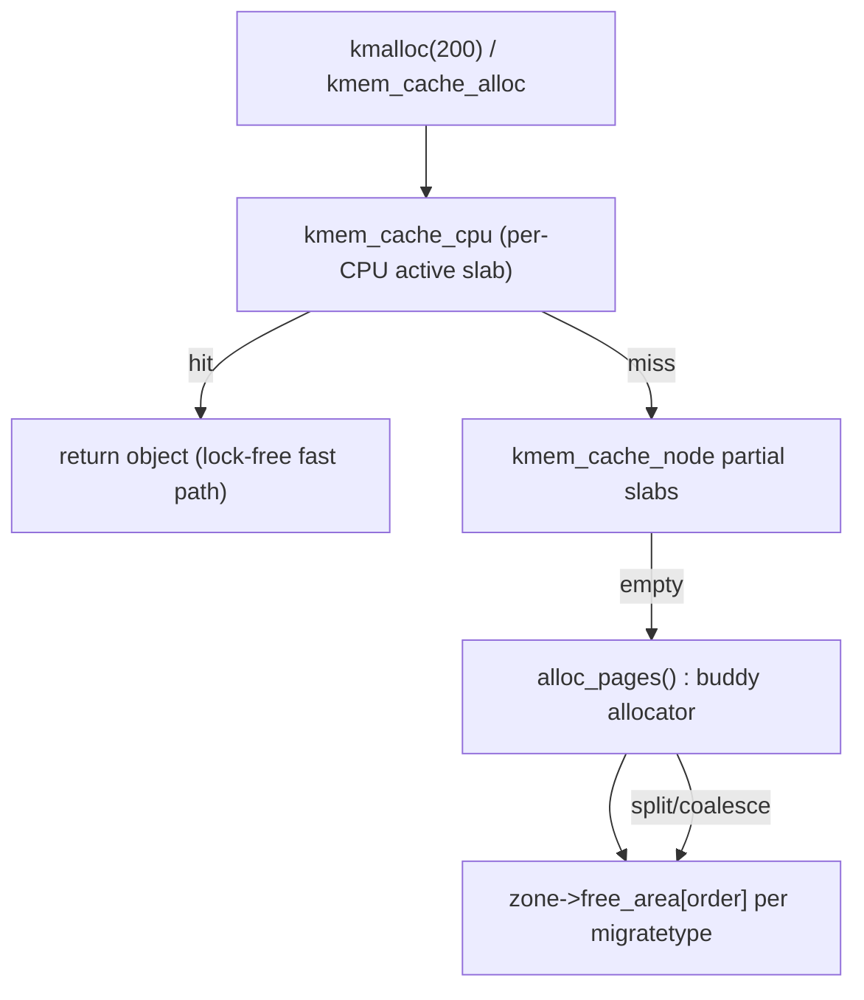

# Q2 — The Buddy Allocator and How It Interacts with SLUB

> **Subsystem:** Memory Management · **Files:** `mm/page_alloc.c`, `mm/slub.c`, `include/linux/mmzone.h`
> **Interviewer is really probing:** Do you understand the **two-tier** physical allocator —
> page-granular buddy underneath, object-granular SLUB on top — and fragmentation control?

---

## TL;DR Cheat Sheet

- **Buddy allocator** = the kernel's **page-frame** allocator. Manages physical memory in
  **power-of-two blocks** ("orders" 0..10): order-0 = 1 page (4 KiB), order-10 = 1024 pages (4 MiB).
- Allocate order-N: find a free block of that order; if none, **split** a larger block in half
  (the two halves are "buddies"). Free: if the **buddy is also free**, **coalesce** them upward.
- **Per-zone free lists**: `free_area[order]` per **migratetype** (`UNMOVABLE`, `MOVABLE`,
  `RECLAIMABLE`…) to fight fragmentation.
- **SLUB** sits **on top of buddy**: it asks buddy for a few pages (a **slab**), then carves them
  into **fixed-size objects** so small frequent allocs don't waste a whole page.
- `kmalloc()` → routes to **kmalloc-N caches** (SLUB) → which get pages from **buddy**.
- **Per-CPU slab caches** (`kmem_cache_cpu`) make the hot path **lock-free / IRQ-cheap**.
- `vmalloc()` is different: virtually contiguous, **physically scattered** order-0 pages.

Key structs: `struct zone`, `free_area`, `struct page`/`folio`, `struct kmem_cache`,
`kmem_cache_cpu`, `kmem_cache_node`.

---

## The Question

> How does the buddy allocator work, and how does it interact with the slab/SLUB allocator?
> Discuss order-N allocations, fragmentation, `kmalloc` vs `vmalloc`, and per-CPU slab caches.

They want the **layering** (buddy = pages, SLUB = objects), the **split/coalesce** algorithm,
**migratetypes/fragmentation**, and the **per-CPU fast path**.

---

## Why two allocators?

Two very different demands:

1. **Page-granular, physically contiguous** allocations (page tables, DMA buffers, slab backing,
   stacks). Needs to track free physical frames and provide contiguous runs. → **Buddy**.
2. **Tiny, extremely frequent** allocations (a 64-byte `struct`, an inode, a `task_struct`).
   Giving each a full 4 KiB page wastes ~98% memory and thrashes the page allocator. → **SLUB**
   carves pages into objects.

**Why buddy specifically?** Power-of-two splitting/coalescing makes **finding a free block** and
**merging on free** both $O(\log N)$ and, crucially, makes coalescing **address-cheap**: a block's
buddy address is just `addr XOR (block_size)`. The cost is **internal fragmentation** (round up to
a power of two) and **external fragmentation** (free pages exist but not contiguous at the needed
order) — the latter is what migratetypes and compaction fight.

**Why SLUB?** Object caching gives: near-zero per-alloc overhead on the hot path, **cache-line
friendly** object packing, per-CPU locality, and **type-stable** memory (great for RCU, see Q7).

---

## When is each used?

- **Buddy (`alloc_pages`, `__get_free_pages`)** — when you need **whole pages** or
  **physically-contiguous** multi-page regions: DMA-coherent buffers, page-table pages, kernel
  stacks, slab refills, hugepages (via the buddy/CMA path).
- **SLUB (`kmalloc`, `kmem_cache_alloc`)** — when you need **small objects** (< a page, typically
  ≤ a few KiB) frequently: most kernel data structures.
- **vmalloc** — when you need a **large virtually-contiguous** buffer but **don't need physical
  contiguity** (and can tolerate TLB cost + no DMA): big tables, module text, some ring buffers.

Rule of thumb stated in interviews: *"Object → SLUB; pages/contiguous → buddy; big-but-scattered →
vmalloc."*

---

## Where in the kernel

```
zone (DMA / DMA32 / Normal / Movable)
  └─ free_area[0..MAX_ORDER-1]                  <- buddy free lists
        └─ per-migratetype list_head           <- UNMOVABLE/MOVABLE/RECLAIMABLE/...
struct kmem_cache (e.g. "kmalloc-256", "inode_cache")
  ├─ kmem_cache_cpu  (per-CPU: active slab + freelist)   <- fast path
  └─ kmem_cache_node (per-NUMA-node: partial slab lists) <- slow path
```

Source: buddy in [`mm/page_alloc.c`], SLUB in [`mm/slub.c`], zone defs in
[`include/linux/mmzone.h`], cache API in [`mm/slab_common.c`].

---

## How it works — step by step

### Buddy: allocation of order N

1. Look at `zone->free_area[N]` for the requested **migratetype**. If a block exists, remove and
   return it.
2. If empty, go to order **N+1**; if a block exists, **split** it: return one half, put the
   **buddy** (other half) on `free_area[N]`. Recurse upward until a block is found or you exhaust
   `MAX_ORDER` (then reclaim/compact or fail).
3. Record the order in the block's `struct page` metadata for later coalescing.

### Buddy: free of order N

1. Compute the **buddy address**: `buddy_pfn = pfn ^ (1 << order)`.
2. If the buddy is **free and same order and same migratetype**, remove it from its list and
   **merge** into an order-(N+1) block. Repeat upward as long as the new buddy is free.
3. Otherwise place the block on `free_area[N]`.

This $XOR$ trick is why coalescing is cheap and why blocks are **naturally aligned** to their size.

### Fragmentation control (the senior detail)

- **Migratetypes** segregate **movable** (user pages, page cache — relocatable) from **unmovable**
  (kernel objects, page tables). Keeping them in separate blocks means the kernel can later
  **migrate/compact** movable regions to form a high-order free block without unmovable junk
  pinning it.
- **`pcplists` (per-CPU page lists)** cache order-0 pages per CPU for lock-free fast alloc/free.
- **Compaction** (`compact_zone`) migrates movable pages to defragment and produce high-order
  blocks for THP/hugepages. **CMA** reserves a migratable region for large contiguous DMA.
- **Watermarks** (min/low/high) gate when to wake `kswapd` / enter direct reclaim (see Q4).

### SLUB on top of buddy

1. `kmalloc(200)` → rounds up to the **kmalloc-256** cache.
2. **Fast path:** grab the per-CPU active slab's **freelist** head (a single pointer chase,
   often no lock, just disabling preemption / a `this_cpu` cmpxchg). Return the object.
3. **Slow path:** per-CPU slab empty → pull a **partial slab** from the `kmem_cache_node` list.
4. **Refill:** no partial slabs → **call buddy** (`alloc_pages`) for a fresh slab (e.g. 1–8 pages),
   thread the objects into a freelist, make it the per-CPU active slab.
5. **Free:** push object back onto a freelist; SLUB stores the freelist pointer **inside the free
   object** (zero metadata overhead). Empty slabs may be returned to buddy.

So the call chain is literally: **`kmalloc` → SLUB cache → (refill) → buddy → zone free_area.**

---

## Diagrams

### Buddy split/coalesce

```
Request order-1 (2 pages), only an order-3 block (8 pages) free:

order-3:  [ AAAAAAAA ]
split ->  order-2: [ AAAA ][ bbbb ]        (b = buddy, put on free_area[2])
split ->  order-1: [ AA ][ cc ][ bbbb ]    (c on free_area[1]); return [AA]

Free [AA]: buddy = [cc]? if free -> merge -> [AAAA]; buddy = [bbbb]? merge -> order-3 again.
```

### Layering



---

## Annotated C

```c
/* Per-zone buddy free lists: one array of free_area per order. */
struct zone {
    struct free_area free_area[MAX_ORDER];   /* index = order */
    /* watermarks gate reclaim (see Q4) */
    unsigned long _watermark[NR_WMARK];      /* WMARK_MIN/LOW/HIGH */
    /* ... */
};

struct free_area {
    struct list_head free_list[MIGRATE_TYPES]; /* UNMOVABLE/MOVABLE/RECLAIMABLE/... */
    unsigned long    nr_free;
};

/* SLUB cache: a per-CPU fast path + per-node partial lists. */
struct kmem_cache {
    struct kmem_cache_cpu __percpu *cpu_slab; /* hot path */
    unsigned int object_size, size, offset;   /* freelist ptr offset inside object */
    struct kmem_cache_node *node[MAX_NUMNODES];
};

struct kmem_cache_cpu {
    void **freelist;     /* next free object on the active slab */
    struct slab *slab;   /* the active slab (was 'struct page') */
    /* tid for lockless cmpxchg fast path */
};

/* The buddy entry point everything funnels into: */
struct page *alloc_pages(gfp_t gfp, unsigned int order); /* 2^order contiguous pages */
void *kmalloc(size_t size, gfp_t flags);                 /* -> kmalloc-N SLUB cache */
```

> SLUB's elegance: the **freelist pointer lives inside the free object itself** (at `offset`),
> so there's **no separate metadata array** — minimal overhead, great cache behavior.

---

## Company Angle

- **AMD (NUMA/multi-core):** per-node `kmem_cache_node`, per-CPU slabs, and **NUMA-local**
  allocation (`alloc_pages_node`) are central to scaling; remote slab refills hurt. Talk about
  **false sharing** of slab metadata across CCX/dies and `SLAB_HWCACHE_ALIGN`.
- **NVIDIA/Qualcomm (DMA):** large **physically-contiguous** buffers come from buddy/CMA; high
  order allocations fail under fragmentation → discuss **CMA** and compaction for big DMA regions.
- **Google (fleet):** fragmentation as a long-uptime problem; `/proc/buddyinfo`, `slabinfo`,
  and THP-allocation failure correlate with tail latency.

---

## War Story

*"A storage node that ran for months started failing **order-4** `alloc_pages` (needed for a
NIC's jumbo-frame ring) even with plenty of free memory. `/proc/buddyinfo` showed tons of order-0
free pages but **nothing at order-3+** — classic external fragmentation. The culprit: a driver was
making long-lived **unmovable** allocations scattered across zones, pinning otherwise-coalescable
regions. We (a) moved the driver's allocations to a dedicated **kmem_cache** so they packed
together, (b) enabled periodic **compaction**, and (c) for the guaranteed-contiguous NIC ring,
switched to a **CMA** reservation at boot. The order-4 failures disappeared. Lesson: free memory ≠
allocatable memory; **migratetype hygiene** is what keeps high orders available."*

---

## Interviewer Follow-ups

1. **How is a buddy found on free?** `buddy_pfn = pfn ^ (1 << order)` — XOR flips the one bit that
   distinguishes the two halves; they're naturally aligned.

2. **Why migratetypes?** To keep movable (reclaimable/relocatable) pages separate from unmovable
   kernel allocations so compaction can build high-order free blocks.

3. **SLUB vs SLAB vs SLOB?** SLUB (default) — simpler, per-CPU, less metadata, scales better. SLAB
   — older, more queues, more metadata. SLOB — tiny systems, removed in recent kernels.

4. **What makes the SLUB fast path fast?** Per-CPU active slab + a lockless `this_cpu_cmpxchg` on
   `(freelist, tid)`; no global lock, often no IRQ disable.

5. **What is `MAX_ORDER`?** The largest buddy order (commonly 10 → 4 MiB blocks; configurable).
   Above that you must use `vmalloc`, CMA, or hugepage paths.

6. **Why can `kmalloc` fail where `vmalloc` succeeds?** `kmalloc` needs **physically contiguous**
   pages (subject to fragmentation); `vmalloc` stitches scattered order-0 pages into a virtually
   contiguous range, so it succeeds under fragmentation (but can't be used for DMA-contiguous needs).

7. **How do GFP flags interact here?** `GFP_ATOMIC` skips reclaim and dips into reserves (IRQ
   context); `GFP_KERNEL` may sleep, reclaim, and compact. Wrong flag in IRQ context = bug (Q3/Q13).

---

## 30-Minute Talk Track

| Min | Cover |
|-----|-------|
| 0–3 | Two-tier model: buddy (pages) under SLUB (objects); why each exists |
| 3–9 | Buddy: orders, split on alloc, XOR-buddy coalesce on free, MAX_ORDER |
| 9–14 | Fragmentation: internal vs external, migratetypes, pcplists, compaction, CMA |
| 14–20 | SLUB: caches, per-CPU active slab, partial lists, refill from buddy, in-object freelist |
| 20–24 | `kmalloc` vs `kmem_cache_alloc` vs `alloc_pages` vs `vmalloc` decision matrix |
| 24–27 | GFP flags & watermarks tie-in (reclaim, atomic context) |
| 27–30 | War story (order-4 fragmentation) + trade-offs |
