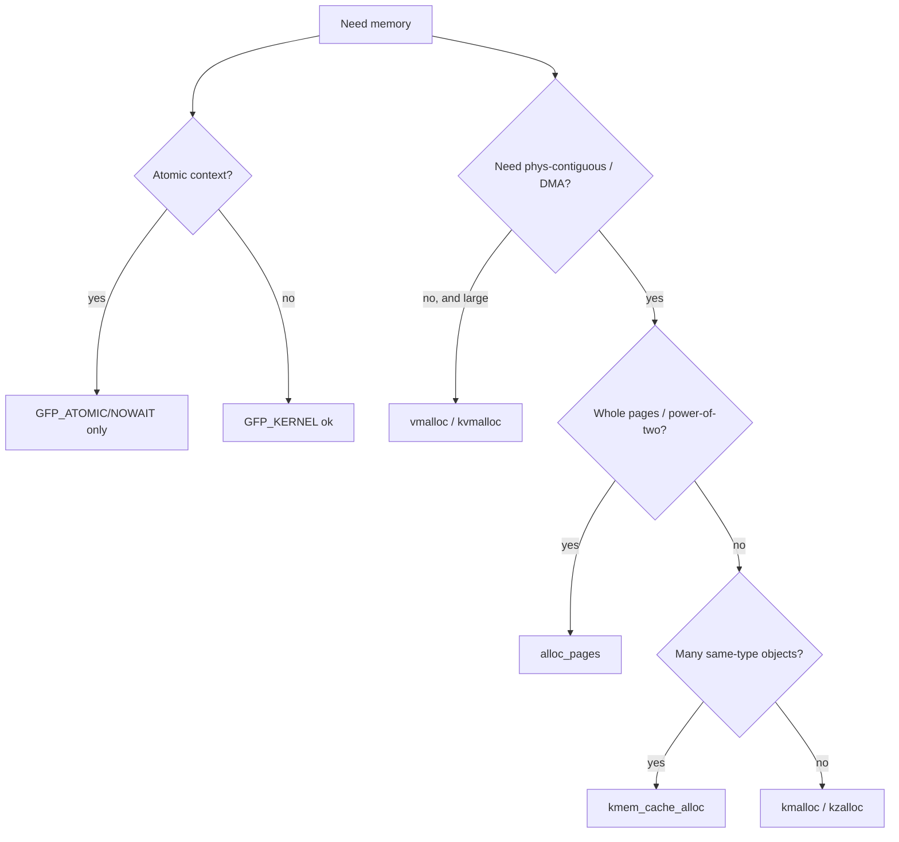

# Q3 — `kmalloc` vs `vmalloc` vs `kmem_cache_alloc` vs `alloc_pages`

> **Subsystem:** Memory Management · **Files:** `mm/slub.c`, `mm/vmalloc.c`, `mm/page_alloc.c`, `include/linux/gfp.h`
> **Interviewer is really probing:** Do you pick the **right allocator for the context** —
> physical contiguity, size, and (critically) **sleeping vs atomic context** via GFP flags?

---

## TL;DR Cheat Sheet

| API | Granularity | Physically contiguous? | Virtually contiguous? | Typical use |
|-----|-------------|------------------------|------------------------|-------------|
| `kmalloc(size, gfp)` | bytes (≤ ~a few MiB) | **Yes** | Yes | general small allocs, DMA-able small buffers |
| `kmem_cache_alloc(cache, gfp)` | fixed object size | Yes | Yes | many same-type objects (inodes, `task_struct`) |
| `alloc_pages(gfp, order)` | $2^{order}$ pages | **Yes** | Yes | whole pages, page tables, slab backing |
| `vmalloc(size)` | bytes (large) | **No** | Yes | big buffers where contiguity not needed |

- **Physical contiguity:** `kmalloc`/`kmem_cache_alloc`/`alloc_pages` = yes; `vmalloc` = **no**
  (scattered order-0 pages stitched via page tables).
- **GFP flags** decide context: `GFP_KERNEL` **may sleep** (process context); `GFP_ATOMIC`
  **never sleeps** (IRQ/atomic, dips into reserves); `GFP_NOWAIT` no sleep, no reserves.
- `kmalloc` returns a **kernel logical address** (direct-mapped, `virt_to_phys` works);
  `vmalloc` returns a **vmalloc-area** address (no simple phys mapping, **not DMA-safe**).
- `vmalloc` costs **extra TLB pressure + page-table setup** and **cannot be used in atomic context**.

---

## The Question

> What's the difference between `kmalloc`, `vmalloc`, `kmem_cache_alloc`, and `alloc_pages`?
> When would you use each? Cover physical contiguity, GFP flags, and sleeping context.

---

## Why do four allocators exist?

Different axes of need:

- **Size & granularity:** a 64-byte struct vs an 8 MiB buffer vs exactly 4 pages.
- **Physical contiguity:** **required** for DMA-without-IOMMU, page tables, some hardware rings;
  **not required** for purely CPU-accessed data.
- **Allocation frequency / type stability:** thousands of identical objects benefit from a
  dedicated cache (constructor reuse, cache-line packing, debugging).
- **Calling context:** can you **sleep** (block waiting for reclaim) or not?

No single allocator optimizes all axes, so the kernel exposes a small toolbox and expects you to
choose. **Choosing wrong** is a classic senior-level mistake: e.g. `GFP_KERNEL` in an IRQ handler
(can sleep → deadlock/oops), or `vmalloc` for a DMA buffer (not physically contiguous → corruption).

---

## When to use each

- **`kmalloc`** — default for small (≤ a page or a few pages) allocations needing **physical
  contiguity** (so it's DMA-able for streaming DMA, and cheap to translate). Backed by SLUB
  `kmalloc-N` caches.
- **`kmem_cache_alloc`** — when you allocate **many objects of the same type** repeatedly. You
  create a `kmem_cache` once; you get packing, optional **constructor**, per-cache stats, and
  better debuggability (`slub_debug` per cache). Examples: `inode_cache`, `task_struct`, skbuff
  head cache.
- **`alloc_pages` / `__get_free_pages`** — when you need **whole pages** or a **contiguous
  power-of-two run**: page-table pages, kernel stacks, a buffer you'll map with `kmap`, slab
  backing, hugepage paths. Returns a `struct page *` (or virtual addr for `__get_free_pages`).
- **`vmalloc`** — when you need a **large** buffer (tens of KiB to many MiB) and **don't** need
  physical contiguity or DMA: large hash tables, module sections, some firmware blobs, big
  software ring buffers. **Never** in atomic context; **never** for non-IOMMU DMA.

---

## Where (address spaces)

```
Kernel virtual layout (conceptual, x86-64):
  [ direct map / lowmem ] <- kmalloc, alloc_pages, kmem_cache_alloc live here
        virt = phys + PAGE_OFFSET  (so virt_to_phys() is arithmetic; DMA-friendly)
  [ vmalloc area ]        <- vmalloc lives here
        scattered phys pages mapped via dedicated kernel page tables
        (no simple virt<->phys; needs vmalloc_to_page())
```

Source: `mm/slub.c` (kmalloc/kmem_cache), `mm/page_alloc.c` (alloc_pages), `mm/vmalloc.c`
(vmalloc), GFP flags in `include/linux/gfp_types.h`.

---

## How — mechanics and the GFP dimension

### Contiguity mechanics

- `alloc_pages(gfp, order)` → buddy returns $2^{order}$ **physically contiguous** pages.
- `kmalloc`/`kmem_cache_alloc` → SLUB, whose slabs come from buddy → object lives in a
  **contiguous, direct-mapped** region. `virt_to_phys()` / `__pa()` work; safe for streaming DMA
  (`dma_map_single`, Q18).
- `vmalloc(size)` → allocates **N separate order-0 pages** from buddy, then **builds page-table
  entries** to make them appear **virtually contiguous** in the vmalloc area. Physically scattered;
  `virt_to_phys()` does **not** work (use `vmalloc_to_page()`).

### GFP flags — the context dimension (this is where seniors shine)

```
GFP_KERNEL  = __GFP_RECLAIM | __GFP_IO | __GFP_FS
              -> MAY SLEEP. Process/syscall context only. Can trigger reclaim, writeback, swap.
GFP_ATOMIC  = __GFP_HIGH (access emergency reserves), no __GFP_RECLAIM
              -> NEVER sleeps. Use in IRQ/softirq/atomic or while holding a spinlock.
GFP_NOWAIT  = no reclaim, no reserves
              -> NEVER sleeps; fails fast rather than dipping into reserves.
GFP_NOIO / GFP_NOFS -> may sleep but must NOT recurse into I/O / filesystem
              (used inside block/FS writeback paths to avoid deadlock).
GFP_DMA / GFP_DMA32  -> restrict physical range for legacy DMA-addressable memory.
__GFP_ZERO  -> zero the memory (kzalloc = kmalloc + __GFP_ZERO).
```

The decisive rule: **if you might be in atomic context (IRQ handler, holding a spinlock,
softirq), you MUST use `GFP_ATOMIC`/`GFP_NOWAIT`** — because `GFP_KERNEL` may block in reclaim,
and sleeping in atomic context is a kernel bug (see Q13). Conversely, in process context, prefer
`GFP_KERNEL` so the allocator can reclaim and you don't waste precious atomic reserves.

### Size limits

- `kmalloc` is practically limited (large `kmalloc` needs high-order buddy blocks → fails under
  fragmentation). For big buffers, prefer `vmalloc` (or `kvmalloc`, which **tries `kmalloc` then
  falls back to `vmalloc`**).
- `alloc_pages` is capped at `MAX_ORDER` (commonly 4 MiB). Bigger contiguous → CMA/hugepage.

---

## Diagrams

### Decision flow



### Address-space contrast

```
kmalloc(4096):   virt ───(phys = virt - PAGE_OFFSET)──► one contiguous phys page  [DMA OK]
vmalloc(16384):  virt ─┬─PTE─► phys page A
                       ├─PTE─► phys page C (non-adjacent)
                       └─PTE─► phys page Q   [virtually contiguous, phys scattered, NO non-IOMMU DMA]
```

---

## Annotated C

```c
/* Small, contiguous, sleeping context: */
buf = kmalloc(256, GFP_KERNEL);          /* may sleep; DMA-able; direct-mapped */
buf = kzalloc(256, GFP_ATOMIC);          /* IRQ-safe, zeroed, uses reserves    */

/* Whole pages / contiguous run: */
struct page *pg = alloc_pages(GFP_KERNEL, 2);   /* 4 contiguous pages */
void *kva = page_address(pg);
__free_pages(pg, 2);

/* Many identical objects -> dedicated cache: */
static struct kmem_cache *mycache;
mycache = kmem_cache_create("my_obj", sizeof(struct my_obj),
                            0, SLAB_HWCACHE_ALIGN, my_ctor);
struct my_obj *o = kmem_cache_alloc(mycache, GFP_KERNEL);
kmem_cache_free(mycache, o);

/* Large, contiguity-not-needed: */
void *big = vmalloc(8 * 1024 * 1024);    /* MUST be process context */
vfree(big);

/* Best of both for "large-ish, don't care how": */
void *p = kvmalloc(size, GFP_KERNEL);    /* tries kmalloc, falls back to vmalloc */
kvfree(p);
```

> `kvmalloc()` is the pragmatic modern choice when a buffer *might* be large: contiguous if it
> can be, scattered if it must be. But it inherits `vmalloc`'s **"no atomic context"** restriction.

---

## Company Angle

- **Qualcomm/NVIDIA (DMA):** the **"vmalloc is not DMA-safe"** trap is a favorite. For DMA you
  need `dma_alloc_coherent`/`dma_map_single` on **physically contiguous** memory (or an IOMMU).
  Know that `vmalloc` buffers need `dma_map_sg` per-page scatterlists, never `dma_map_single`.
- **AMD (NUMA):** `kmalloc_node`/`alloc_pages_node`/`vmalloc_node` for **local** allocation;
  remote memory hurts. Per-cache, per-node SLUB structures.
- **Google (scale/debug):** `kmem_cache` per subsystem improves **observability** (`slabinfo`,
  per-cache `slub_debug`) — useful when hunting leaks across a fleet (Q23).

---

## War Story

*"A new driver intermittently corrupted DMA transfers only under memory pressure. The buffer was
allocated with `vmalloc()` and handed to `dma_map_single()`. Under low fragmentation it happened
to land on physically-adjacent pages and 'worked'; under pressure the pages scattered and DMA wrote
across **unrelated physical pages**. The fix: use `dma_alloc_coherent()` (physically contiguous,
IOMMU-aware) for the descriptor ring, and `dma_map_sg()` with a **scatterlist** for the large
payload. Root lesson the interviewer liked: **`vmalloc` virtual contiguity ≠ physical contiguity**,
and `dma_map_single` assumes the latter."*

---

## Interviewer Follow-ups

1. **What does `GFP_KERNEL` actually allow that `GFP_ATOMIC` doesn't?** Blocking: reclaim, swap,
   writeback, compaction — all of which may **sleep**. `GFP_ATOMIC` skips them and taps emergency
   reserves instead.

2. **Why can't `vmalloc` be used in interrupt context?** It may sleep (allocates page tables, takes
   mutexes) and does TLB work — forbidden in atomic context.

3. **`virt_to_phys()` on a `vmalloc` pointer?** Wrong — it's only valid for the direct map. Use
   `vmalloc_to_page()` to get the `struct page` for each page.

4. **When `kmem_cache` over `kmalloc`?** Many same-size/type objects: better packing, constructor
   reuse, per-cache debugging/stats, optional RCU-safe freeing (`SLAB_TYPESAFE_BY_RCU`).

5. **What's `kvmalloc`?** Tries `kmalloc` (contiguous) and falls back to `vmalloc` (scattered) —
   used by `kvmalloc_array`, many large kernel allocations.

6. **GFP_NOIO / GFP_NOFS — why?** Inside writeback/FS code, recursing into I/O or FS during reclaim
   could deadlock; these flags allow sleeping but **block that recursion**. Modern code prefers
   scoped `memalloc_noio_save()`/`memalloc_nofs_save()`.

7. **Largest `kmalloc`?** Bounded by buddy `MAX_ORDER` and fragmentation; beyond a few MiB use
   `vmalloc`/`kvmalloc`.

---

## 30-Minute Talk Track

| Min | Cover |
|-----|-------|
| 0–3 | Four allocators, the axes: size, contiguity, type, context |
| 3–8 | Contiguity mechanics: direct-map vs vmalloc page-table stitching |
| 8–14 | GFP flags deep dive: KERNEL/ATOMIC/NOWAIT/NOIO/NOFS, sleeping vs atomic |
| 14–18 | `kmalloc`/`kmem_cache_alloc` (SLUB) details + constructors/packing |
| 18–22 | `alloc_pages` (buddy) + `vmalloc` size/TLB trade-offs + `kvmalloc` |
| 22–26 | DMA safety: why vmalloc ≠ DMA, link to dma_map_single vs sg (Q18) |
| 26–30 | Decision flowchart recap + war story |
