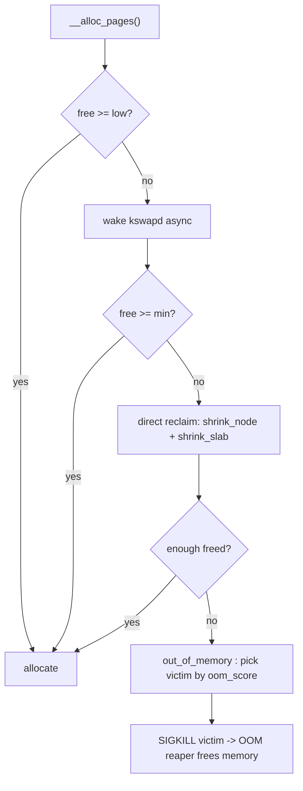

# Q4 — Page Reclaim: LRU Lists, kswapd, Direct Reclaim, and the OOM Killer

> **Subsystem:** Memory Management · **Files:** `mm/vmscan.c`, `mm/page_alloc.c`, `mm/oom_kill.c`, `mm/workingset.c`
> **Interviewer is really probing:** Do you understand how Linux **frees memory under pressure** —
> the LRU machinery, watermark-driven async vs sync reclaim, writeback, and the OOM last resort?

---

## TL;DR Cheat Sheet

- Linux keeps **per-node, per-memcg LRU lists**: **active** and **inactive**, split into
  `ANON` (swap-backed) and `FILE` (page-cache) — so **5 lists** per node (incl. `UNEVICTABLE`).
- **Watermarks** per zone: **min < low < high**. Free dips below **low** → wake **kswapd**
  (async background reclaim). Free hits **min** while allocating → **direct reclaim** (the
  *allocating task* reclaims **synchronously**, blocking).
- Reclaim scans **inactive** lists; **clean** pages are dropped immediately; **dirty** pages need
  **writeback** first; referenced pages get **promoted** to active (second-chance).
- **Anon pages** require **swap** to evict; **file pages** can be written back or just dropped
  (if clean) since they're re-readable from disk.
- **Refault detection / workingset** (shadow entries) decides if the inactive list is too small.
- If reclaim **can't** free enough and we still can't allocate → **OOM killer** picks a victim by
  `oom_score` (∝ memory use, tunable via `oom_score_adj`) and kills it.

Key knobs: `vm.swappiness`, `vm.min_free_kbytes`, `oom_score_adj`, `vm.watermark_scale_factor`.

---

## The Question

> Explain the page-reclaim path: LRU lists, kswapd, direct reclaim, and the OOM killer.
> Cover active/inactive lists, watermarks (min/low/high), writeback, and `oom_score_adj`.

---

## Why does reclaim exist?

Physical RAM is finite, but the kernel **over-commits**: page cache grows to fill RAM, anonymous
allocations are lazy, and many pages are **reclaimable** (clean file cache can be re-read; dirty
pages can be written back; anon pages can be swapped). Reclaim's job is to **convert "in use but
reclaimable" memory back into free pages** *before* allocations fail — and to do so **cheaply and
fairly**, evicting the pages **least likely to be used soon** (approximate LRU).

Design tensions it balances:
- **Latency:** prefer **background** reclaim (kswapd) so allocators rarely block; fall back to
  **direct reclaim** only when background can't keep up.
- **Fairness:** balance **anon vs file** eviction (`swappiness`) and **per-memcg** limits.
- **Accuracy vs cost:** true LRU is too expensive, so use **two lists + referenced bits** as a
  cheap approximation (a CLOCK/second-chance variant).

---

## When does each mechanism trigger?

| Trigger | Mechanism | Context |
|---------|-----------|---------|
| Free < **low** watermark | **kswapd** wakes, reclaims to **high** watermark | async kernel thread |
| Allocation finds free < **min** | **direct reclaim** in the allocating task | synchronous, blocks caller |
| `GFP_ATOMIC` alloc, free low | dips into **reserves** below min (no reclaim) | atomic context |
| Reclaim fails, alloc still stuck | **OOM killer** | last resort |
| memcg over its limit | **memcg reclaim** (then memcg OOM) | per-cgroup |

`kswapd` exists **per NUMA node** (`kswapd0`, `kswapd1`, …). Direct reclaim is what causes those
nasty **allocation-latency spikes** seniors get asked about.

---

## Where in the kernel

```
mm/page_alloc.c   __alloc_pages() -> watermark checks -> wake kswapd / enter direct reclaim
mm/vmscan.c       shrink_node() -> shrink_lruvec() -> shrink_list()/shrink_active_list()
                  shrink_slab()  -> registered shrinkers (dentry/inode/fs caches)
mm/oom_kill.c     out_of_memory() -> select_bad_process() -> oom_kill_process()
mm/workingset.c   refault detection (shadow entries) -> sizes inactive vs active
```

LRU lists hang off the **`lruvec`** in each `pglist_data` (node) and each memcg.

---

## How reclaim works — step by step

### 1. The LRU lists (the data structure)

Per node (and per memcg) there are these lists in a `struct lruvec`:

```
LRU_INACTIVE_ANON   LRU_ACTIVE_ANON
LRU_INACTIVE_FILE   LRU_ACTIVE_FILE
LRU_UNEVICTABLE     (mlock'd, ramfs, etc. — never reclaimed)
```

- New pages enter the **inactive** list.
- A page **referenced** while on inactive (via `PG_referenced` + access bit) gets **promoted to
  active** (second chance) instead of being evicted.
- Active pages that aren't re-referenced **age down** to inactive over time.
- This active/inactive split is a **CLOCK-Pro / second-chance** approximation of LRU — cheap to
  maintain, decent accuracy. (Newer kernels also offer **MGLRU**, multi-gen LRU, with multiple
  generations for better aging — worth a mention.)

### 2. Watermark-driven flow

```
free pages
  high ─────────  kswapd stops here (reclaimed enough)
  low  ─────────  free < low  -> WAKE kswapd (async)
  min  ─────────  free < min  -> allocator does DIRECT reclaim (sync, blocks)
  reserves below min: only GFP_ATOMIC/__GFP_HIGH may use
```

- **kswapd**: woken at **low**, reclaims until **high**, then sleeps. Keeps a buffer so normal
  allocations rarely block.
- **Direct reclaim**: if a task's allocation can't be satisfied (free near **min**), the **task
  itself** runs `shrink_node()` synchronously — this is the latency hit.

### 3. Scanning a list (`shrink_inactive_list`)

For each candidate page on the inactive list:
1. **Referenced?** → rotate/promote (second chance).
2. **Clean file page?** → **drop immediately** (can be re-read from disk). Cheapest eviction.
3. **Dirty page?** → must **write back** first (kick `pageout`/flush threads); skip for now if
   writeback congested.
4. **Anonymous page?** → needs a **swap slot**; if swap is full/disabled, can't evict → pressure
   rises toward OOM. `swappiness` (0–200) biases anon-vs-file eviction.
5. **Unmap** via **rmap** (Q5) from all page tables, then free.

Also runs **`shrink_slab()`**: registered **shrinkers** (dentry cache, inode cache, FS caches,
GPU shrinkers) free reclaimable kernel objects proportional to pressure.

### 4. Refault detection (the senior detail)

When a file page is evicted, Linux leaves a **shadow entry** recording its eviction "age". If that
page is **faulted back in soon** (a *refault*), it means the inactive list was **too small** — so
`mm/workingset.c` **grows the active/inactive balance** accordingly. This stops thrashing where hot
pages are evicted then immediately re-read.

### 5. OOM killer (last resort)

If reclaim can't make progress and the allocation still fails:
1. `out_of_memory()` runs `select_bad_process()`.
2. Each task gets an **`oom_score`** ≈ proportion of total memory it uses (RSS + swap + pgtables),
   adjusted by **`oom_score_adj`** (`-1000` = never kill, `+1000` = kill first; written via
   `/proc/<pid>/oom_score_adj`).
3. The highest-scoring eligible task is killed (`SIGKILL`), freeing its memory. A **per-memcg OOM**
   confines the kill to the offending cgroup.
4. If the victim can't be reaped, the **OOM reaper** kthread asynchronously frees its memory.
   Panic-on-OOM (`vm.panic_on_oom`) is an option for systems that prefer reboot.

---

## Diagrams

### Reclaim control flow



### LRU promotion / eviction

```
new page -> [INACTIVE]
   referenced?  --yes--> [ACTIVE]  --ages down--> [INACTIVE]
   not referenced -> evict: clean file? drop : dirty? writeback : anon? swap
```

---

## Annotated C

```c
/* The per-node/per-memcg LRU container. */
struct lruvec {
    struct list_head lists[NR_LRU_LISTS]; /* ACTIVE/INACTIVE x ANON/FILE + UNEVICTABLE */
    /* ... aging/refault state (workingset) ... */
};

enum lru_list {
    LRU_INACTIVE_ANON, LRU_ACTIVE_ANON,
    LRU_INACTIVE_FILE, LRU_ACTIVE_FILE,
    LRU_UNEVICTABLE,
    NR_LRU_LISTS
};

/* Watermarks live in the zone (see Q2). */
enum zone_watermarks { WMARK_MIN, WMARK_LOW, WMARK_HIGH, NR_WMARK };

/* OOM victim scoring (conceptual). */
long oom_badness(struct task_struct *p) {
    long points = p->mm->total_vm_rss_swap_pgtables; /* ~ memory footprint */
    points += p->signal->oom_score_adj * totalpages / 1000; /* user/admin bias */
    return points; /* highest -> killed */
}
```

> Two threads to name-drop: **`kswapd`** (per-node async reclaim) and the **OOM reaper**
> (async memory reclamation of a killed victim so the system recovers even if the victim is stuck).

---

## Company Angle

- **Google (containers/cgroups):** **memcg reclaim** and **per-cgroup OOM** are central —
  `memory.high` (throttling reclaim) vs `memory.max` (hard limit → memcg OOM), PSI
  (`/proc/pressure/memory`) for pressure stalls, and avoiding global OOM in multi-tenant nodes.
- **AMD/NUMA:** per-node kswapd, **node reclaim** vs allocating remotely (`vm.zone_reclaim_mode`),
  balancing reclaim across NUMA nodes.
- **NVIDIA/Qualcomm:** shrinkers for **GPU/DMA-BUF** memory; mlock/unevictable for pinned DMA;
  on Android, the **LMK/`lmkd` + PSI** userspace killer replaces in-kernel OOM for responsiveness.
- **All:** direct-reclaim latency as a **tail-latency** source.

---

## War Story

*"A latency-sensitive service showed periodic 200 ms stalls. PSI `some avg10` for memory was high,
and `/proc/vmstat` showed `allocstall` (direct-reclaim entries) climbing during the spikes — the
service was hitting the **min** watermark and doing **direct reclaim** in its own request path,
synchronously writing back dirty pages. Two fixes: (1) raised **`vm.min_free_kbytes`** /
`watermark_scale_factor` so **kswapd** started earlier and kept a bigger free buffer, moving work
off the latency path; (2) tuned **dirty ratios** (`vm.dirty_background_ratio`) so writeback happened
continuously instead of in bursts. Stalls dropped ~10x. The interviewer's follow-up — *'why not just
add swap?'* — let me explain that swapping **anon** pages would have *added* latency, and the real
issue was **synchronous direct reclaim**, not capacity."*

---

## Interviewer Follow-ups

1. **kswapd vs direct reclaim?** kswapd = background, async, per-node, triggered at **low**, frees
   to **high**. Direct reclaim = synchronous, in the **allocating task**, triggered near **min** —
   the latency villain.

2. **Why active/inactive instead of one LRU list?** A cheap **second-chance** approximation: pages
   referenced on inactive get promoted; only twice-unused pages are evicted. Avoids evicting hot
   pages on a single touch.

3. **Anon vs file eviction — `swappiness`?** `swappiness` (0–200) biases reclaim toward anon
   (needs swap) vs file (re-readable). 0 ≈ avoid swapping anon until necessary; high ≈ swap anon
   readily to keep file cache.

4. **What's a refault and why track it?** A page evicted then quickly re-read; shadow entries
   detect it and grow the inactive list to stop thrashing (`mm/workingset.c`).

5. **How is the OOM victim chosen and biased?** By `oom_badness` ∝ footprint, adjusted by
   `oom_score_adj` (`-1000`..`+1000`). `-1000` makes a task OOM-immune (e.g. critical daemons).

6. **What are shrinkers?** Callbacks that free **reclaimable kernel objects** (dentries, inodes,
   GPU caches) under pressure, scaled by `shrink_slab()`.

7. **MGLRU?** Multi-Gen LRU: replaces the 2-list scheme with multiple **generations** for better
   aging accuracy and lower scanning cost; opt-in on modern kernels.

8. **PSI?** Pressure Stall Information — quantifies time tasks stall on memory/CPU/IO; used to
   trigger userspace OOM (Android `lmkd`, systemd-oomd) before in-kernel OOM.

---

## 30-Minute Talk Track

| Min | Cover |
|-----|-------|
| 0–3 | Why reclaim exists; reclaimable vs unreclaimable memory |
| 3–8 | LRU lists: active/inactive × anon/file + unevictable; second-chance promotion |
| 8–13 | Watermarks min/low/high; kswapd (async) vs direct reclaim (sync) |
| 13–18 | Scanning: clean-drop vs dirty-writeback vs anon-swap; swappiness; rmap unmap |
| 18–21 | shrink_slab/shrinkers; refault/workingset; MGLRU mention |
| 21–25 | OOM killer: oom_score, oom_score_adj, OOM reaper, memcg OOM |
| 25–28 | cgroup/PSI angle; tuning knobs |
| 28–30 | War story (direct-reclaim latency) + trade-offs |
