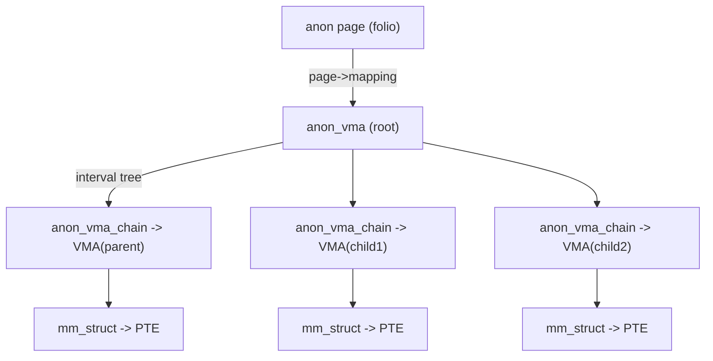
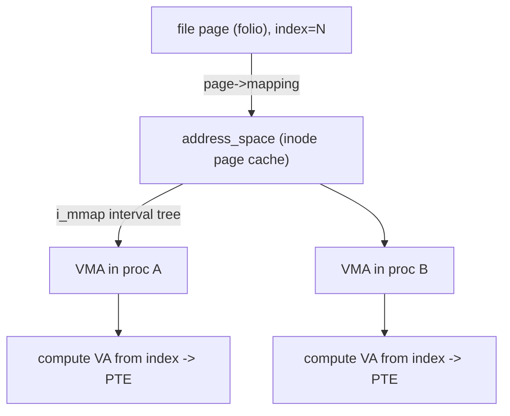

# Q5 — Reverse Mapping (rmap): Why and How

> **Subsystem:** Memory Management · **Files:** `mm/rmap.c`, `include/linux/rmap.h`, `mm/memory.c`
> **Interviewer is really probing:** Do you understand the **page → PTEs** direction (not just
> VA → page), and why reclaim, migration, and COW are impossible without it?

---

## TL;DR Cheat Sheet

- Forward mapping = **VA → physical page** (page-table walk, Q1). **Reverse mapping (rmap)** =
  **physical page → all the VAs/PTEs that map it**.
- Needed because a single physical page can be **shared by many processes/VMAs** (fork/COW, shared
  libraries, shared memory, page cache). To **reclaim, migrate, or write-protect** that page, you
  must find and update **every** PTE pointing at it.
- **Anonymous** pages: `anon_vma` + `anon_vma_chain` link a page to all VMAs that may map it.
  Page → `anon_vma` via `page->mapping` (low bit set marks "anon").
- **File** pages: `address_space->i_mmap` interval tree of VMAs mapping that file; page index gives
  the offset to locate each PTE.
- Core operations: `try_to_unmap()` (reclaim), `try_to_migrate()` (migration/compaction),
  `page_referenced()` (aging), `folio_mkclean()` (write-protect for writeback).
- **`rmap_walk()`** iterates every mapping of a folio and applies a callback.

---

## The Question

> What is reverse mapping (rmap) and why is it needed for page reclaim and migration?

---

## Why does rmap exist?

The page table answers **"given a VA, what physical page?"** But reclaim, migration, and COW need
the **opposite**: **"given a physical page, which PTEs map it, so I can change/remove them all?"**

Without rmap you'd have to **scan every process's entire page table** to find references to one
page — $O(\text{total VAs})$ per page, catastrophic during reclaim of thousands of pages.

The sharing problem makes this essential: one physical page can be mapped by **many** VMAs:
- **`fork()` + COW:** parent and child share the same anon pages read-only until a write.
- **Shared libraries / mmap'd files:** `libc.so` text is one set of physical pages mapped into
  every process.
- **Page cache:** one cached file page mapped into multiple processes' `mmap`s.
- **Shared memory / `MAP_SHARED`.**

To **evict** such a page you must **unmap it from every one of those PTEs first**. rmap makes that
lookup efficient.

---

## When is rmap used?

| Operation | rmap call | Purpose |
|-----------|-----------|---------|
| Page reclaim (Q4) | `try_to_unmap()` | unmap page from all PTEs before freeing |
| Aging | `folio_referenced()` | check/clear accessed bits across all mappers |
| Migration / compaction | `try_to_migrate()` then `remove_migration_ptes()` | repoint all PTEs to the new page |
| Writeback | `folio_mkclean()` | write-protect all mappings so dirtying is re-trapped |
| KSM (dedup) | merges identical pages, fixes up PTEs | memory dedup |
| Memory failure / HWPoison | unmap a bad page from everyone | RAS / ECC handling |
| NUMA balancing | clears PTEs to trap & migrate | autonuma |

Bottom line: **any operation that must atomically affect *all* users of a physical page** uses rmap.

---

## Where in the kernel

```
struct folio/page
  ├─ anonymous: page->mapping -> anon_vma  (low bit 1 = PAGE_MAPPING_ANON)
  │             anon_vma --(interval tree)--> anon_vma_chain --> vma --> mm --> PTE
  └─ file:      page->mapping -> address_space
                address_space->i_mmap (interval tree) --> vma --> mm --> PTE
                page->index gives file offset -> locate exact PTE in each vma
```

Source: `mm/rmap.c` (core), `include/linux/rmap.h` (structs), interval trees in
`mm/interval_tree.c`. Aging/unmap callers in `mm/vmscan.c`, migration in `mm/migrate.c`.

---

## How rmap works — step by step

### Anonymous rmap (the tricky one)

The challenge: after `fork()`, a page may be mapped by the parent and several children. Linux uses
a two-level structure so it can track this **without scanning**:

- Each anon page points (via `page->mapping`) to an **`anon_vma`** (the "root" owner).
- Each VMA has a list of **`anon_vma_chain`** nodes linking it into the `anon_vma`s of itself and
  its ancestors (parent at fork time). The `anon_vma->rb_root` is an **interval tree** of the VMAs.
- To find every PTE for an anon page: take its `anon_vma`, walk the interval tree of VMAs, and for
  each VMA compute the virtual address from `page->index` + VMA range, then locate the PTE.

This **"anon_vma forest"** is the part interviewers love — it elegantly handles COW fork chains
without ever scanning unrelated page tables, at the cost of some structural complexity.

### File rmap (simpler)

- The page belongs to an **`address_space`** (the inode's page cache).
- `address_space->i_mmap` is an **interval tree** of all VMAs mapping that file.
- `page->index` is the page's offset within the file. For each VMA in the tree whose range covers
  that offset, compute the VA and find the PTE.

### `rmap_walk()` — the unifying iterator

`rmap_walk(folio, &control)` abstracts both cases: it enumerates every VMA mapping the folio and
calls a callback (`rmap_one`) per mapping. Reclaim/migration/aging are all implemented as callbacks:

1. `try_to_unmap()`: callback clears each PTE (writing a **swap entry** for anon, or just clearing
   for clean file pages), flushes the TLB, decrements `_mapcount`. When fully unmapped, the page
   can be freed.
2. `try_to_migrate()`: callback replaces each PTE with a **migration entry** (a special non-present
   PTE that faults-and-waits), copies page contents to the new page, then
   `remove_migration_ptes()` installs new PTEs pointing at the destination.

### `_mapcount` and `_refcount`

- `folio->_mapcount` (per page) counts **how many PTEs map it** — reclaim must drive this to -1
  (none) before freeing.
- `_refcount` counts **all references** (mappings + kernel pins). A page with kernel pins (e.g.
  `get_user_pages`/DMA) **can't be migrated/reclaimed** — a classic source of "unmovable page"
  bugs.

---

## Diagrams

### Forward vs reverse

```
Forward (page-table walk):   VA  ──►  PTE  ──►  physical page
Reverse (rmap):              physical page  ──►  { PTE_a, PTE_b, PTE_c, ... }
```

### Anonymous rmap structure



### File rmap structure



---

## Annotated C

```c
/* A folio knows its mapping; low bit distinguishes anon vs file. */
#define PAGE_MAPPING_ANON  0x1
/* folio->mapping points to anon_vma (anon) or address_space (file). */

struct anon_vma {
    struct anon_vma *root;       /* root of the fork forest */
    struct rb_root_cached rb_root; /* interval tree of anon_vma_chains/VMAs */
    atomic_t refcount;
};

struct anon_vma_chain {
    struct vm_area_struct *vma;  /* the VMA this links */
    struct anon_vma *anon_vma;   /* the anon_vma it belongs to */
    struct list_head same_vma;   /* chains for this VMA */
    struct rb_node rb;           /* node in anon_vma->rb_root */
};

/* The unmap operation used by reclaim: */
void try_to_unmap(struct folio *folio, enum ttu_flags flags);
/* The migration operation: */
void try_to_migrate(struct folio *folio, enum ttu_flags flags);
/* Generic iterator over every mapping of a folio: */
void rmap_walk(struct folio *folio, struct rmap_walk_control *rwc);

/* Per-page mapping count: reclaim frees only when this reaches "no mappers". */
/* atomic_t _mapcount;  -1 means unmapped. */
```

> Senior nuance: **migration entries** are special non-present PTEs. A thread touching a page
> mid-migration **faults and waits** on the migration entry until migration completes — that's how
> Linux migrates a page that's actively in use without losing updates.

---

## Company Angle

- **NVIDIA/Qualcomm (DMA pinning):** `get_user_pages()` / `pin_user_pages()` take **refcounts**
  that make pages **unmovable** — a huge gotcha for compaction/CMA and for `MAP_DMA`. Know
  `FOLL_LONGTERM` and why long-term pins break migration. This is the rmap↔DMA intersection.
- **AMD (NUMA balancing):** AutoNUMA uses rmap-style PTE clearing to sample access and **migrate
  pages to the accessing node** — rmap is what lets it repoint all mappers.
- **Google (huge-scale):** KSM dedup and reclaim throughput depend on efficient rmap; rmap lock
  contention (`anon_vma` locks) can show up in profiles under fork-heavy/THP-heavy workloads.

---

## War Story

*"Compaction kept failing to assemble a 2 MiB THP region and `/proc/vmstat` showed
`compact_fail`/`thp_collapse_alloc_failed`. A handful of pages in the target block were
**unmovable**. `page_owner` traced them to a driver doing **`get_user_pages(FOLL_LONGTERM)`** for a
DMA mapping and holding the pins indefinitely. Because those pages had elevated **`_refcount`**,
`try_to_migrate()` couldn't move them — rmap could *find* the mappings but the **pin** blocked
migration. Fix: the driver moved to `pin_user_pages()` with proper unpin on completion, and for the
persistent buffer we allocated from **CMA** (designed to be migratable/reserved). THP success rate
recovered. The teaching point: rmap finds the mappers, but **refcount pins** are what actually
prevent migration."*

---

## Interviewer Follow-ups

1. **Forward vs reverse mapping — one sentence each?** Forward: VA→page via page tables. Reverse:
   page→all PTEs via rmap structures.

2. **Why not scan page tables instead of rmap?** Reclaim touches thousands of pages; scanning every
   process's tables per page is $O(\text{address space})$ — rmap makes it proportional to the
   number of **actual mappers**.

3. **How does anon rmap survive fork chains?** `anon_vma` + `anon_vma_chain` link a page to its
   VMA *and ancestor VMAs*, forming a forest, so COW pages shared across parent/children are all
   discoverable.

4. **What's a migration entry?** A special non-present PTE installed during migration; a faulting
   accessor **blocks** on it until migration finishes, then re-faults to the new page.

5. **What stops a page from being migrated even though rmap finds it?** An elevated **`_refcount`**
   (kernel pin: `get_user_pages`/DMA), `mlock`/unevictable, or being a non-LRU page.

6. **`_mapcount` vs `_refcount`?** `_mapcount` = number of PTEs mapping the page; `_refcount` = all
   references (mappings + pins). Free requires both to drop appropriately.

7. **What's `folio_mkclean()` for?** Write-protect all mappings so the next write **re-faults**,
   letting writeback know the page got dirtied again (correct dirty tracking across shared mappers).

---

## 30-Minute Talk Track

| Min | Cover |
|-----|-------|
| 0–3 | Forward vs reverse; the page-sharing problem (fork/COW/shlibs/page cache) |
| 3–7 | Why scanning page tables is infeasible during reclaim |
| 7–14 | Anonymous rmap: anon_vma + anon_vma_chain forest, fork handling |
| 14–18 | File rmap: address_space->i_mmap interval tree + page->index |
| 18–22 | rmap_walk + callbacks: try_to_unmap, try_to_migrate, page_referenced |
| 22–26 | Migration entries, _mapcount/_refcount, pins blocking migration |
| 26–30 | DMA/NUMA/KSM angle + war story (FOLL_LONGTERM pin blocks THP) |
