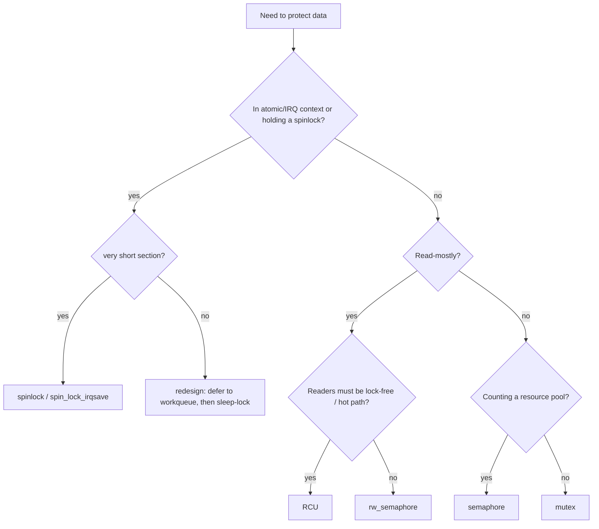

# Q6 — Spinlocks vs Mutexes vs Semaphores vs RW Semaphores vs RCU

> **Subsystem:** Concurrency · **Files:** `kernel/locking/`, `include/linux/spinlock.h`, `mutex.h`, `rwsem.h`, `rcupdate.h`
> **Interviewer is really probing:** Can you choose the **right primitive for the context**
> (atomic vs sleepable), reason about **contention/latency**, and know when **RCU** wins?

---

## TL;DR Cheat Sheet

| Primitive | Sleeps? | Context | Use when |
|-----------|---------|---------|----------|
| **spinlock** | No (busy-wait) | atomic/IRQ/process | short critical sections; **can't sleep** inside |
| **mutex** | Yes | process only | longer sections; one owner; can sleep inside |
| **semaphore** | Yes | process | counting resource (N permits); legacy for mutual exclusion |
| **rw_semaphore** | Yes | process | many readers OR one writer; read-mostly, sleepable |
| **rwlock (spin)** | No | atomic | reader/writer spinlock (mostly deprecated; prefer RCU) |
| **RCU** | readers: no | readers atomic | **read-mostly**, near-zero reader cost, lock-free reads |

- **Golden rule:** **spinlock if you can't sleep**, **mutex if you can**. Holding a spinlock you
  **must not** call anything that sleeps (`kmalloc(GFP_KERNEL)`, `mutex_lock`, `copy_to_user`).
- Spinlock variants: `spin_lock_irqsave()` (disable IRQs, save flags) when the lock is also taken
  in an IRQ handler; `spin_lock_bh()` for softirq.
- **RCU**: readers take **zero locks** (just `rcu_read_lock()` = preempt-off marker); writers
  publish a **new copy** and free the old after a **grace period** (see Q7).
- Mutex has **optimistic spinning** (adaptive): spins briefly if the owner is running on another
  CPU before sleeping — best of both worlds for short holds.

---

## The Question

> Compare spinlocks, mutexes, semaphores, RW semaphores, and RCU. When is each appropriate?

---

## Why so many primitives?

Two fundamental axes:

1. **Can the waiter sleep?** In **atomic context** (IRQ handler, softirq, holding a spinlock,
   `preempt_disable`) you **cannot** sleep — so you need **busy-wait** primitives (spinlock). In
   **process context** you can block, so you can use **sleeping** primitives (mutex/semaphore/rwsem)
   that don't burn CPU while waiting.
2. **Read/write ratio.** If data is **read-mostly**, taking an exclusive lock on every read is
   wasteful and a scalability killer. Reader/writer primitives (rwsem, RCU) let readers proceed
   concurrently. **RCU** goes further: readers pay **almost nothing**.

Secondary axes: **hold time** (short → spin; long → sleep), **fairness**, **contention level**, and
**ownership semantics** (mutex has a single owner enabling priority inheritance and lockdep checks;
semaphores don't).

The senior framing: *"Pick the cheapest primitive that's **correct for the context** and matches
the **access pattern**; default to spinlock for short atomic-safe sections, mutex for sleepable
ones, and RCU when reads vastly outnumber writes."*

---

## When to use each (decision guide)

- **spinlock** — critical section is **short** and/or you're in **atomic context** (IRQ/softirq) or
  protecting data also touched by an IRQ. Never sleep while holding it.
- **mutex** — process context, section may be **long** or call sleeping functions. One owner;
  supports **priority inheritance** (in RT) and **lockdep**.
- **semaphore** — counting a **finite resource pool** (N concurrent users), or producer/consumer
  signaling. For plain mutual exclusion, prefer **mutex** (clearer ownership).
- **rw_semaphore** — **read-mostly** data accessed in **sleepable** context (e.g. `mmap_lock`
  protecting the VMA tree). Many readers OR one writer.
- **rwlock (spinlock flavor)** — historically reader/writer in atomic context; **largely replaced
  by RCU** because writers starve readers and cache-line bouncing hurts. Mention but don't reach for it.
- **RCU** — **read-mostly**, readers must be **fast and lock-free**, writers are rare and can
  tolerate **deferred reclamation**. Routing tables, lists, config that's read on every packet but
  updated occasionally. (Full mechanics in Q7.)

---

## Where in the kernel

```
kernel/locking/spinlock.c, qspinlock.c   <- MCS/queued spinlocks (fair, scalable)
kernel/locking/mutex.c                   <- mutex + optimistic spinning
kernel/locking/rwsem.c                   <- reader/writer semaphore
kernel/locking/semaphore.c               <- counting semaphore
kernel/rcu/                              <- tree RCU, SRCU, tiny RCU
include/linux/spinlock.h, mutex.h, rwsem.h, rcupdate.h
```

Modern spinlocks are **queued spinlocks (qspinlock)** — an **MCS-style** queue so CPUs spin on
**their own** cache line (no thundering-herd cache bouncing) and acquire in **FIFO** order (fair).

---

## How each works — mechanics

### Spinlock (`qspinlock`)

- Busy-waits (spins) until the lock is free; **does not sleep**, so it's safe in atomic context.
- **Disables preemption** while held (so the holder isn't scheduled out, which would stall spinners).
- **qspinlock/MCS**: each waiter queues and spins on a **local** cache line; the holder hands off to
  the next in line → **fair** and **scalable** (no cache-line storm under contention).
- IRQ variants: if the **same lock** is taken in an IRQ handler, a non-IRQ holder must
  `spin_lock_irqsave()` to disable local IRQs — otherwise an IRQ on the same CPU that tries to take
  the held lock **self-deadlocks** (spins forever). This is a top-5 interview gotcha.

### Mutex

- Sleeps if contended → **no CPU burned** while waiting (waiter goes on a wait queue, scheduler
  picks something else).
- **One owner**; unlock must come from the same task. Enables **lockdep ownership checks**,
  **priority inheritance** (PREEMPT_RT), and **deadlock detection**.
- **Optimistic spinning (adaptive mutex):** if the lock is held but the **owner is currently
  running** on another CPU, the waiter spins briefly (betting on a quick release) before sleeping —
  combining spinlock speed for short holds with mutex correctness for long ones.

### Semaphore

- Holds a **count** of available permits; `down()` decrements (sleeps if 0), `up()` increments.
- Count = 1 → binary semaphore (mutual exclusion) but **no ownership** (any task may `up()`), so
  **mutex is preferred** for locking. Counting semaphores are still useful for **resource pools**.

### RW semaphore

- `down_read()` allows **many concurrent readers**; `down_write()` requires **exclusive** access.
- Sleepable; used where readers are common and may block (e.g. page-fault path under `mmap_lock`).
- Writer starvation is mitigated by fairness logic; still, write-heavy workloads scale poorly →
  consider RCU or per-CPU.

### RCU (preview of Q7)

- **Readers:** `rcu_read_lock()`/`rcu_read_unlock()` — essentially **mark a non-preemptible (or
  tracked) read section**; **no atomic ops, no cache-line writes** → near-zero cost, perfectly
  scalable.
- **Writers:** create a **new** version, `rcu_assign_pointer()` to publish it (a release barrier),
  then **wait a grace period** (`synchronize_rcu()`/`call_rcu()`) until all pre-existing readers
  finish before freeing the old version.
- Trade-off: readers may briefly see the **old** copy; memory is **reclaimed late**. Perfect for
  read-mostly; bad for write-heavy or when readers need the absolute latest under mutual exclusion.

---

## Diagrams

### Choosing a primitive



### Cost intuition (uncontended)

```
RCU read           : ~free (no atomics)          ▏
spinlock           : 1 atomic + cache line       ▏▏
mutex (fast path)  : 1 atomic                     ▏▏
mutex (contended)  : sleep + wakeup (us-scale)    ▏▏▏▏▏▏
rwsem write-heavy  : poor scaling                 ▏▏▏▏▏▏▏
```

---

## Annotated C

```c
/* Spinlock used in both process AND IRQ context -> must save/restore IRQ state. */
spin_lock_irqsave(&dev->lock, flags);
/* ... very short critical section; NO sleeping calls here ... */
spin_unlock_irqrestore(&dev->lock, flags);

/* Mutex: process context, may sleep inside. */
mutex_lock(&inst->config_mutex);
ret = kmalloc(sz, GFP_KERNEL);   /* OK: we can sleep here */
mutex_unlock(&inst->config_mutex);

/* RW semaphore: many readers, one writer. */
down_read(&mm->mmap_lock);   /* walk VMAs */ up_read(&mm->mmap_lock);
down_write(&mm->mmap_lock);  /* modify VMA tree */ up_write(&mm->mmap_lock);

/* Counting semaphore: resource pool of N permits. */
sema_init(&pool->slots, N);
down(&pool->slots);  /* acquire one slot (sleeps if none) */
up(&pool->slots);    /* release */

/* RCU read side: near-zero overhead, lock-free. */
rcu_read_lock();
p = rcu_dereference(global_ptr);   /* safe to read *p */
use(p);
rcu_read_unlock();                  /* *p valid until here */
```

> The single most common real bug this question screens for: **sleeping while holding a spinlock**
> (e.g. `kmalloc(GFP_KERNEL)` or `mutex_lock` inside `spin_lock`). It's a deadlock waiting to happen
> and `lockdep`/`might_sleep()` will scream about it.

---

## Company Angle

- **NVIDIA (RCU/RT):** RCU is a flagship topic; expect "why are RCU readers free?" and RT
  implications (RCU readers are preemptible under `PREEMPT_RT`). Priority inheritance on RT mutexes.
- **Google (scale):** lock contention as a scalability wall; moving hot read paths from rwsem/spin
  to **RCU** or **per-CPU**; `qspinlock` fairness; `lockref` for dentry refcounts.
- **AMD (multi-core):** cache-line bouncing of contended spinlocks across CCX/dies; why MCS
  queued locks and per-CPU data matter for many-core scaling.
- **Qualcomm (RT/embedded):** spinlock IRQ-safety, `spin_lock_bh`, and PREEMPT_RT where spinlocks
  become sleeping rt-mutexes (raw_spinlock vs spinlock distinction).

---

## War Story

*"A driver occasionally hard-hung one CPU. `lockdep` was off in production, but the pattern was a
classic **IRQ self-deadlock**: the driver took `spin_lock(&dev->lock)` in process context, and its
**interrupt handler** also took `&dev->lock`. When the IRQ fired on the **same CPU** mid-section,
the handler spun forever waiting for a lock the **interrupted task** held — neither could progress.
The fix was trivial once seen: use `spin_lock_irqsave()` in the process-context path so local IRQs
are disabled while the lock is held. I also turned on `CONFIG_PROVE_LOCKING` in CI so lockdep would
catch the inconsistent IRQ-context lock usage **before** it shipped."*

---

## Interviewer Follow-ups

1. **Spinlock vs mutex one-liner?** Spinlock busy-waits and is atomic-context safe but you can't
   sleep holding it; mutex sleeps when contended and is process-context only.

2. **When `spin_lock_irqsave` vs `spin_lock`?** Use `irqsave` if the **same lock** is acquired in
   an IRQ handler (prevent self-deadlock). `spin_lock_bh` if shared with softirqs.

3. **Why is a semaphore not preferred for mutual exclusion?** No ownership → no priority
   inheritance, weaker lockdep checks, any task can `up()`. Mutex encodes ownership.

4. **What is optimistic spinning in mutex?** If the owner is running on another CPU, spin briefly
   before sleeping — avoids sleep/wakeup cost for short holds.

5. **Why prefer RCU over rwlock?** rwlock writers bounce a shared cache line and can starve;
   RCU readers are lock-free with zero writes, far better read scalability.

6. **raw_spinlock vs spinlock under PREEMPT_RT?** Under RT, normal `spinlock_t` becomes a
   **sleeping** rt-mutex; `raw_spinlock_t` stays a true spinning lock for truly-atomic regions.

7. **Reader/writer fairness in rwsem?** Modern rwsem balances to avoid writer starvation, but
   write-heavy patterns still scale poorly — redesign toward RCU/per-CPU.

8. **What does holding a spinlock disable?** Preemption (always) and, with the `irq`/`bh` variants,
   local IRQs/softirqs — so the section is truly atomic on that CPU.

---

## 30-Minute Talk Track

| Min | Cover |
|-----|-------|
| 0–3 | Two axes: sleep-ability (context) and read/write ratio |
| 3–8 | Spinlock: busy-wait, preempt-off, qspinlock/MCS fairness, IRQ variants |
| 8–12 | Mutex: sleeps, ownership, optimistic spinning, lockdep/PI |
| 12–15 | Semaphore (counting/resource pool) vs mutex; why mutex preferred |
| 15–19 | rw_semaphore: many readers/one writer, mmap_lock example, write scaling |
| 19–24 | RCU: lock-free readers, publish + grace period, when it wins (preview Q7) |
| 24–27 | Decision flowchart + cost intuition + PREEMPT_RT note |
| 27–30 | War story (IRQ self-deadlock) + "cheapest correct primitive" summary |
