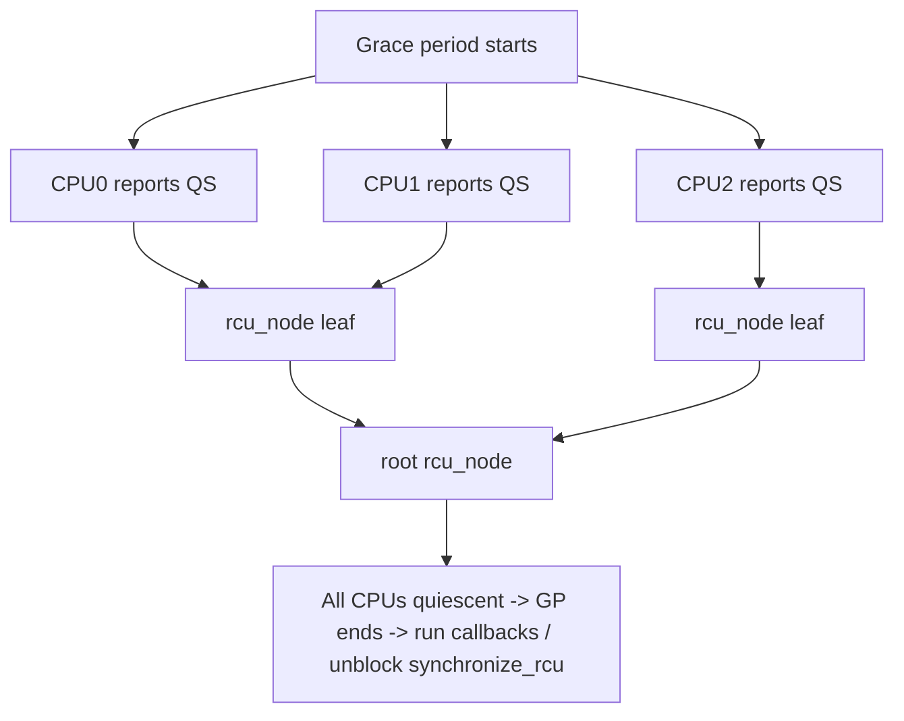

# Q7 — RCU In Depth: Grace Periods, Quiescent States, and Why Readers Are Free

> **Subsystem:** Concurrency · **Files:** `kernel/rcu/tree.c`, `kernel/rcu/srcutree.c`, `include/linux/rcupdate.h`
> **Interviewer is really probing (NVIDIA/Google favorite):** Do you *deeply* understand the
> publish/grace-period model, what a quiescent state is, and **why RCU readers have near-zero cost**?

---

## TL;DR Cheat Sheet

- **RCU = Read-Copy-Update.** Optimized for **read-mostly** data. **Readers are wait-free and
  lock-free**; writers do a **copy → publish → defer-free** dance.
- **Reader side:** `rcu_read_lock()` … `rcu_dereference(p)` … `rcu_read_unlock()`. On non-preempt
  builds this is **literally nothing but a compiler barrier + preempt-disable** — **no atomic ops,
  no writes, no cache-line bouncing** → perfectly scalable.
- **Writer side:** build a new version, `rcu_assign_pointer(gp, new)` (release barrier), then wait
  for a **grace period** before freeing the old version.
- **Grace period:** the time until **every** CPU has passed through a **quiescent state** — i.e.
  every pre-existing reader has finished. Only then can old data be freed safely.
- **Quiescent state (QS):** a point where a CPU is definitely **not** inside an RCU read section —
  e.g. a **context switch**, **idle**, or **user-mode** (on non-preempt RCU).
- `synchronize_rcu()` = **block** until a grace period elapses. `call_rcu(head, cb)` = **async**:
  register a callback to run after the grace period (no blocking).
- The magic: readers never announce themselves; the writer infers "all readers done" by observing
  **all CPUs reach a quiescent state**.

---

## The Question

> Explain RCU in depth — grace periods, `rcu_read_lock`, `synchronize_rcu`, `call_rcu`, and
> quiescent states. Be ready to explain why RCU readers have near-zero overhead.

---

## Why does RCU exist?

For **read-mostly** data (routing tables, config, lists read on every packet/syscall), a
conventional lock — even a reader/writer lock — forces every reader to perform an **atomic
operation** and **write a shared cache line** (the lock word or reader count). Under high core
counts that shared cache line **ping-pongs** between CPUs, and the read path's cost grows with
contention. That's a scalability disaster when reads dominate.

RCU's insight: **let readers run with no synchronization at all**, and make the **writer** shoulder
all the cost. A reader just dereferences a pointer; if a writer is concurrently replacing the data,
the reader either sees the **old** fully-valid version or the **new** fully-valid version — never a
torn state — because the writer **publishes atomically** (single pointer store with a release
barrier) and **doesn't free the old version until no reader can still hold a reference**.

So RCU buys **near-zero, perfectly scalable reads** at the cost of:
- readers may see **slightly stale** data (bounded by a grace period),
- **deferred reclamation** (old memory lingers until the grace period ends),
- writers must coordinate among themselves with a **separate lock** (RCU only sync-izes
  readers-vs-reclamation, **not** writer-vs-writer).

---

## When to use RCU (and when NOT)

**Use RCU when:**
- Reads **vastly** outnumber writes (often 1000:1+).
- Readers are on **hot/latency-critical** paths and must be cheap.
- Readers can tolerate seeing data **as of slightly earlier** (stale-but-consistent).
- The data is reachable via a **single pointer** you can swap (lists, hash tables, trees, config).

**Avoid RCU when:**
- Writes are frequent (grace-period and copy overhead dominates).
- Readers need the **absolute latest** value under strict mutual exclusion.
- You need to **block/sleep** inside the read section (use **SRCU** instead — sleepable RCU).
- The update can't be expressed as an atomic pointer publish.

---

## Where in the kernel

```
kernel/rcu/tree.c        <- "Tree RCU": hierarchical per-CPU QS reporting (scalable)
kernel/rcu/srcutree.c    <- SRCU: sleepable readers (explicit per-instance domains)
kernel/rcu/tasks.c       <- RCU-Tasks (for trampolines/ftrace/BPF)
include/linux/rcupdate.h <- rcu_read_lock/unlock, rcu_dereference, rcu_assign_pointer
include/linux/rculist.h  <- RCU-safe list primitives (list_add_rcu, list_for_each_entry_rcu)
```

Flavors: **RCU** (general), **SRCU** (sleepable), **RCU-Tasks** (BPF/ftrace trampolines).

---

## How RCU works — the mechanism

### The fundamental rule

> **A grace period is guaranteed to be longer than any RCU read-side critical section that started
> before it began.** Therefore, if you (1) unlink an object, (2) wait one grace period, then (3)
> free it — no reader can possibly still hold a pointer to it.

### Reader side — why it's free

```c
rcu_read_lock();                 /* mark start of read section */
p = rcu_dereference(gp);         /* load pointer + dependency-ordering barrier */
do_something(p->field);          /* p stays valid until rcu_read_unlock() */
rcu_read_unlock();               /* mark end */
```

- On **non-preemptible RCU** (`CONFIG_PREEMPT_NONE`): `rcu_read_lock()` is essentially
  `preempt_disable()` and a compiler barrier — **no atomic instruction, no memory write**. The CPU
  simply must not be preempted/context-switch during the section.
- `rcu_dereference()` provides **address-dependency ordering** so the reader never sees a pointer
  newer than the data it points to (critical on weakly-ordered ARM — see Q8).
- Because readers never write shared state, **N CPUs read in parallel with zero contention**.

### Writer side — copy, publish, defer

```c
/* writers serialize among themselves with a normal lock */
spin_lock(&writer_lock);
new = kmalloc(...); *new = *old; new->field = X;   /* COPY + modify */
rcu_assign_pointer(gp, new);                        /* PUBLISH (release barrier) */
spin_unlock(&writer_lock);
synchronize_rcu();                                  /* WAIT one grace period */
kfree(old);                                          /* now safe: no reader holds old */
```

`rcu_assign_pointer()` is a store with a **release barrier**: all writes that built `new` are
visible **before** the pointer becomes visible. After publish, **new readers** see `new`; **existing
readers** may still hold `old`. Wait a grace period, then `old` is unreachable → free it.

### Grace period & quiescent states — how the writer knows readers are done

The writer can't see readers (they don't register). Instead it relies on **quiescent states**:

- A **quiescent state (QS)** is any moment a CPU is provably **not** in an RCU read section. On
  non-preempt RCU these are: **context switch**, **idle loop**, **return to user mode**.
- A **grace period** ends once **every CPU** has reported **at least one QS** *after* the grace
  period started. Since an RCU read section disables preemption (non-preempt RCU), a CPU **can't**
  reach a QS mid-read — so "all CPUs hit a QS" ⇒ "all pre-existing readers finished."

**Tree RCU** scales this: instead of one global counter that every CPU hammers, CPUs report QS up a
**hierarchical tree of `rcu_node`s** (combining fan-in), so grace-period detection doesn't become a
contention point on big machines. A per-CPU **`rcu_data`** tracks each CPU's QS progress; the
**`rcu_state`** machine advances grace periods.

### `synchronize_rcu()` vs `call_rcu()`

- `synchronize_rcu()` — **blocks** the caller until a full grace period passes. Simple but you must
  be in sleepable context and can stall.
- `call_rcu(&obj->rcu_head, free_cb)` — **non-blocking**: queues a callback invoked after the grace
  period. Used in hot/atomic paths and when you can't sleep. Callbacks are batched and run by
  per-CPU **`rcuoc`/softirq** machinery; **`kfree_rcu()`** is a convenience wrapper.

### SRCU (sleepable RCU)

If readers must **sleep** (e.g. block on I/O) inside the read section, normal RCU breaks (its QS
definition assumes readers don't sleep). **SRCU** uses explicit per-domain counters so readers can
block; `srcu_read_lock()` returns an index, `synchronize_srcu()` waits on that domain. Slightly more
reader overhead, but sleepable.

---

## Diagrams

### Publish + grace period timeline

```
writer:    build new --- rcu_assign_pointer(gp,new) ----- synchronize_rcu() ----- kfree(old)
                                |                          |  (grace period)   |
readers:   ...R1 sees old......]                          |                    |
           ......R2 sees old............]                 |  (R1,R2 ended)     |
           .........R3 starts, sees new.................. | ................   |
                                ^ after publish new readers see NEW; old freed only
                                  after all pre-existing readers (R1,R2) finished.
```

### Grace-period detection (Tree RCU)



---

## Annotated C — an RCU-protected list

```c
struct foo { struct list_head list; struct rcu_head rcu; int key, val; };

/* READER: lock-free lookup */
int lookup(int key) {
    struct foo *f; int v = -1;
    rcu_read_lock();
    list_for_each_entry_rcu(f, &foo_list, list)   /* RCU-safe traversal */
        if (f->key == key) { v = f->val; break; }
    rcu_read_unlock();
    return v;   /* may be slightly stale, always consistent */
}

/* WRITER: delete (writers serialize via foo_lock) */
void delete(struct foo *f) {
    spin_lock(&foo_lock);
    list_del_rcu(&f->list);     /* unlink; readers already past see it gone */
    spin_unlock(&foo_lock);
    call_rcu(&f->rcu, free_cb); /* defer free until grace period (no blocking) */
}
static void free_cb(struct rcu_head *h) {
    kfree(container_of(h, struct foo, rcu));
}
```

> Why `list_del_rcu` + `call_rcu` and not plain `kfree`? A reader may be **mid-traversal** holding a
> pointer to `f`. Unlinking makes it invisible to **new** readers; the grace period guarantees
> **existing** readers have finished before we free it.

---

## Company Angle

- **NVIDIA:** "Explain why RCU readers are free" is a signature question — nail the **no-atomic,
  no-write, preempt-disable** explanation and the **dependency-ordering** role of `rcu_dereference`
  on weak-memory ARM (ties to Q8). Also RCU under **PREEMPT_RT** (preemptible readers).
- **Google:** RCU underpins networking (routing/conntrack), VFS (dcache), and **BPF**
  (`rcu_read_lock` around map access; RCU-Tasks for trampolines). Grace-period latency as a tail
  concern; `kfree_rcu`/`call_rcu` offload.
- **AMD:** RCU's appeal on **many-core** systems — read scalability with zero cache-line bouncing;
  Tree RCU's hierarchical QS reporting avoids a global contention point.
- **Qualcomm:** SRCU and RCU on smaller core counts; RCU-stall debugging on SoCs (Q24).

---

## War Story

*"A network stat-collection path read a config object on **every packet** under a `rwlock`. At high
PPS, `perf` showed the rwlock's reader cache line bouncing across all cores — the read path didn't
scale past ~8 cores. We converted the config to **RCU**: readers became `rcu_read_lock()` +
`rcu_dereference()` (zero atomics), and the rare config update did copy → `rcu_assign_pointer` →
`call_rcu` to free the old. Throughput scaled linearly to all cores. The follow-up gotcha I had to
fix: one reader did a **sleeping** allocation inside the read section — illegal under classic RCU
(`rcu_read_lock` disables preemption). I moved that allocation **outside** the section. Had I truly
needed to sleep inside, the answer would've been **SRCU**."*

---

## Interviewer Follow-ups

1. **Why are RCU readers free?** Non-preempt `rcu_read_lock()` is just preempt-disable + compiler
   barrier — **no atomic op, no shared write** — so readers never contend; N CPUs read in parallel.

2. **What exactly is a grace period?** The interval until every CPU has passed ≥1 quiescent state
   after it began; guarantees all pre-existing readers have completed.

3. **What's a quiescent state?** A moment a CPU is provably outside any RCU read section: context
   switch, idle, or user-mode (non-preempt RCU). PREEMPT RCU tracks per-task nesting instead.

4. **`synchronize_rcu` vs `call_rcu`?** Former blocks until a grace period; latter registers an
   async callback (no blocking) — use `call_rcu`/`kfree_rcu` in atomic/hot paths.

5. **What does `rcu_dereference` guarantee that a plain load doesn't?** Address-**dependency
   ordering**: the data pointed to is seen at least as new as the pointer (matters on ARM/Alpha).

6. **Does RCU serialize writers?** No — writers need their **own** lock; RCU only coordinates
   readers vs reclamation.

7. **What is SRCU and when?** Sleepable RCU — readers may block; uses explicit per-domain counters;
   higher reader cost but allows sleeping inside the read section.

8. **What's an RCU stall and how do you debug it?** A CPU stuck in a long read section (or with IRQs
   off) prevents grace periods from ending; the **RCU CPU stall detector** dumps the offending
   stack to `dmesg` (ties to Q24).

9. **Why `rcu_assign_pointer` instead of `gp = new`?** It inserts a **release barrier** so the
   initialized contents of `new` are visible before the pointer publish — preventing readers from
   seeing a pointer to half-initialized data.

---

## 30-Minute Talk Track

| Min | Cover |
|-----|-------|
| 0–3 | Problem: read-mostly data, rwlock cache-line bouncing, why reads must be free |
| 3–7 | Reader side: rcu_read_lock/dereference, why it's zero-cost (preempt-disable) |
| 7–11 | Writer side: copy → rcu_assign_pointer (release) → defer free |
| 11–16 | Grace periods + quiescent states; the fundamental safety rule |
| 16–20 | Tree RCU: per-CPU rcu_data, rcu_node hierarchy, scalable QS reporting |
| 20–23 | synchronize_rcu vs call_rcu/kfree_rcu; batching |
| 23–26 | SRCU (sleepable), RCU-Tasks (BPF), PREEMPT_RT preemptible readers |
| 26–30 | rcu_dereference & weak memory (link Q8) + war story (rwlock→RCU) |
