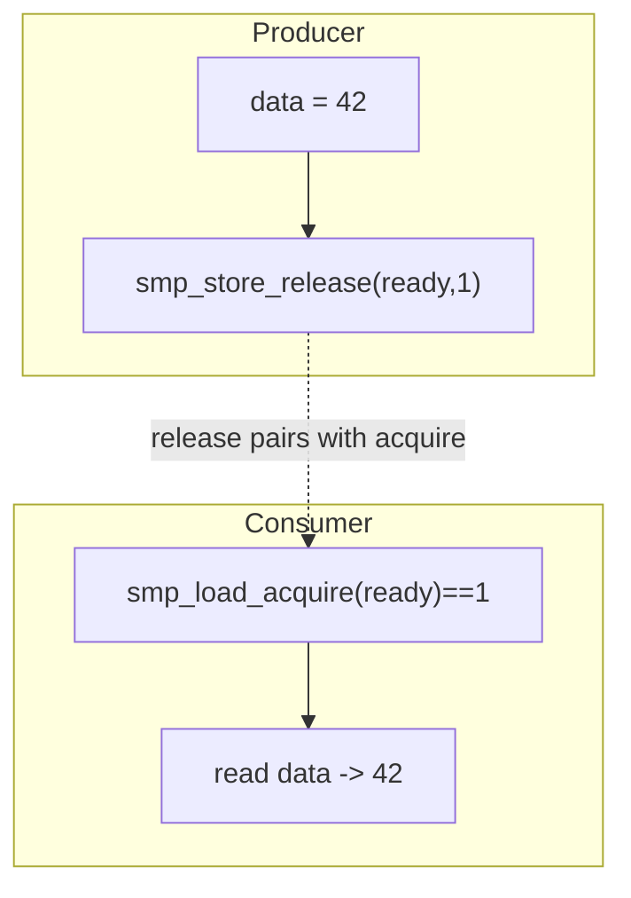

# Q8 — Memory Barriers and the Linux Kernel Memory Model (LKMM)

> **Subsystem:** Concurrency · **Files:** `include/asm-generic/barrier.h`, `Documentation/memory-barriers.txt`, `tools/memory-model/`
> **Interviewer is really probing (NVIDIA/AMD favorite):** Do you understand **out-of-order CPUs**,
> what each barrier orders, and **acquire/release** semantics — especially on **weak-ordered ARM**?

---

## TL;DR Cheat Sheet

- Modern CPUs and compilers **reorder** memory accesses for performance. A single thread sees its
  own program order, but **other CPUs may observe reorderings**. Barriers restore the ordering you
  need.
- **Compiler barrier:** `barrier()` / `READ_ONCE` / `WRITE_ONCE` — stop the **compiler** reordering
  (no CPU instruction). Always needed for shared-memory access (prevents tearing/refetch).
- **CPU SMP barriers:**
  - `smp_mb()` — **full** barrier: orders **all** loads+stores before vs after.
  - `smp_rmb()` — **read** barrier: orders **loads** before vs after.
  - `smp_wmb()` — **write** barrier: orders **stores** before vs after.
- **Acquire/Release (preferred modern style):**
  - `smp_store_release(p, v)` — all prior accesses complete **before** this store is visible.
  - `smp_load_acquire(p)` — this load completes **before** any subsequent accesses.
  - Together they build a one-way fence pairing producer→consumer cheaply.
- **Address dependency** (`rcu_dereference`/`READ_ONCE` of a pointer then deref): orders the
  dependent load **for free** on most CPUs (but **Alpha** needed `smp_read_barrier_depends`,
  now folded in).
- **x86 = strongly ordered** (only store→load reordering; barriers often cheap/no-ops).
  **ARM64/PowerPC = weakly ordered** (almost everything can reorder) → barriers really matter.
- **LKMM** = the formal model (`tools/memory-model/`, `herd7`/`klitmus`) defining exactly what
  orderings the kernel guarantees; "barriers pair" is the core discipline.

---

## The Question

> What are memory barriers? Explain `smp_mb()`, `smp_rmb()`, `smp_wmb()`, and acquire/release
> semantics. Tie to the LKMM and out-of-order CPUs (especially weak-ordered ARM).

---

## Why do memory barriers exist?

To go fast, CPUs and compilers **reorder** memory operations:

- **Compilers** hoist/sink/merge loads and stores, keep values in registers, etc.
- **CPUs** use **store buffers** (a store may be delayed/buffered while later loads proceed),
  **out-of-order execution**, **speculation**, and **cache coherence protocols** that make writes
  become visible to other cores at **different times**.

A single thread always sees its **own** accesses in program order ("as-if-serial"). But a
**second CPU** can observe your loads/stores happening in a **different order** than you wrote them.
For lock-free code, message passing, and even lock *implementations*, that reordering causes
**real bugs**: e.g. you set `data = 42; flag = 1;` but another CPU sees `flag == 1` while still
reading the old `data`.

Barriers exist to **constrain** that reordering exactly where correctness needs it — and **only**
there, because barriers cost performance (they stall the pipeline/drain buffers). The senior skill
is using the **weakest** barrier that's correct (acquire/release over full `smp_mb()`), and making
barriers **pair**.

---

## When do you need a barrier?

- **Lock-free / lockless data structures** (ring buffers, RCU, seqlocks, lockref).
- **Message passing**: "write data, then set a ready flag; reader checks flag, then reads data."
- **Double-checked patterns** and **publish-then-use** (exactly RCU's `rcu_assign_pointer` /
  `rcu_dereference`).
- **MMIO/device interaction**: ordering writes to device registers vs memory (different barriers:
  `mb()`/`wmb()`/`dma_wmb()`/`writel` which has implicit ordering).
- You generally **don't** need explicit barriers when using **locks** — `spin_lock`/`mutex_lock`
  already imply **acquire** semantics and `unlock` implies **release**; the lock does the fencing.

Rule: *"If two CPUs communicate through shared memory **without** a lock, you almost certainly need
paired barriers."*

---

## Where in the kernel

```
include/asm-generic/barrier.h          <- generic smp_mb/rmb/wmb, load_acquire/store_release
arch/*/include/asm/barrier.h           <- arch instructions (x86 mfence/lfence/sfence; arm64 dmb/dsb/isb)
Documentation/memory-barriers.txt      <- the canonical rulebook (read it)
tools/memory-model/                    <- LKMM: linux-kernel.cat, herd7 tooling, litmus tests
include/linux/atomic.h                 <- atomics with explicit ordering (_acquire/_release/_relaxed)
```

ARM64 instructions: `DMB` (data memory barrier), `DSB` (stronger, completion), `ISB` (instruction
sync). x86: `MFENCE`/`LFENCE`/`SFENCE`, though `LOCK`-prefixed RMW already fence.

---

## How barriers work — the model

### The classic message-passing example (why you need TWO barriers)

```c
/* Producer CPU */                    /* Consumer CPU */
data = 42;                            while (READ_ONCE(ready) == 0)
smp_wmb();   /* (A) */                    cpu_relax();
WRITE_ONCE(ready, 1);                 smp_rmb();   /* (B) */
                                      r = data;    /* must see 42 */
```

- Without **(A)** `smp_wmb()`, the producer's `ready=1` store could become visible **before**
  `data=42` → consumer sees `ready==1` but stale `data`.
- Without **(B)** `smp_rmb()`, the consumer could **speculatively load** `data` **before** seeing
  `ready==1` → stale `data`.
- **Barriers pair:** the write barrier on one side **only works** with the read barrier on the
  other. A lone barrier is usually a bug or a misunderstanding.

### Acquire/Release — the modern, cheaper idiom

The same thing, expressed as a one-way fence pair:

```c
/* Producer */                         /* Consumer */
data = 42;                             while (smp_load_acquire(&ready) == 0)
smp_store_release(&ready, 1);              cpu_relax();
                                       r = data;   /* guaranteed to see 42 */
```

- `smp_store_release(&ready, 1)`: **everything before** it (the `data=42`) is visible **before**
  the store of `ready` is observed.
- `smp_load_acquire(&ready)`: **everything after** it (the read of `data`) happens **after** the
  acquire load observes the value.
- This is **cheaper** than two full `smp_mb()`s because each is a **one-directional** fence, and on
  ARM64 maps to efficient `LDAR`/`STLR` instructions. **Prefer acquire/release** to raw rmb/wmb when
  the pattern is publish/consume — it's clearer and pairs by construction.

### The four orderings a full barrier controls

A `smp_mb()` prevents all four reorderings across it: **L→L, L→S, S→L, S→S**. Weaker barriers
control subsets:
- `smp_rmb()`: L→L (and L vs L).
- `smp_wmb()`: S→S.
- `smp_store_release`/`smp_load_acquire`: one-way (prior↔this).

### Address dependencies (the ARM/Alpha subtlety)

If you load a **pointer** and then dereference it, the dereference **depends** on the pointer's
value, so virtually all CPUs keep them ordered **for free** — *except* historically **Alpha**,
which could reorder dependent loads, requiring `smp_read_barrier_depends()`. Modern kernels fold
that into `READ_ONCE`/`rcu_dereference`, so **`rcu_dereference()` is what makes RCU correct on weak
memory** (link to Q7). Note: a **control** dependency (branch on a loaded value, then store) orders
load→store but **not** load→load, and the compiler can break it — so control deps are fragile;
prefer acquire.

### Strong vs weak architectures

| | x86-64 (TSO) | ARM64 / Power (weak) |
|---|---|---|
| S→S reorder | No | **Yes** |
| L→L reorder | No | **Yes** |
| L→S reorder | No | **Yes** |
| S→L reorder | **Yes** | **Yes** |
| `smp_wmb()` cost | ~compiler barrier | real `DMB ishst` |
| `smp_mb()` | `MFENCE`/locked op | `DMB ish` |

> On **x86** a lot of code "accidentally works" because TSO only allows store→load reordering.
> Port it to **ARM64** and the missing barriers turn into **real, rare, horrible bugs**. This is
> *exactly* why NVIDIA/Qualcomm/AMD probe memory ordering.

---

## Diagrams

### Store buffer causing S→L reorder (even on x86)

```
CPU0: store X=1 -> [store buffer] (not yet visible)   load Y -> sees old Y
CPU1: store Y=1 -> [store buffer]                      load X -> sees old X
Both can read old values -> needs smp_mb() to drain store buffers (Dekker/seqlock).
```

### Acquire/release one-way fences



---

## Annotated C

```c
/* Always use READ_ONCE/WRITE_ONCE for plain shared access (compiler-level ordering + no tearing). */
WRITE_ONCE(shared, v);          /* compiler won't split/reorder/cache this store */
x = READ_ONCE(shared);          /* compiler won't refetch/merge this load */

/* Full barrier: order everything (e.g. seqlock writer, Dekker-style). */
smp_mb();

/* Write barrier pairs with read barrier (message passing). */
data = 42; smp_wmb(); WRITE_ONCE(ready, 1);     /* producer  */
if (READ_ONCE(ready)) { smp_rmb(); use(data); } /* consumer  */

/* Preferred: acquire/release (publish/consume). */
smp_store_release(&ready, 1);
if (smp_load_acquire(&ready)) use(data);

/* Atomics with explicit ordering (cheapest correct choice). */
atomic_fetch_add_relaxed(&ctr, 1);          /* no ordering: pure counter */
old = atomic_cmpxchg_acquire(&lock, 0, 1);  /* lock acquire */
atomic_set_release(&lock, 0);               /* lock release */

/* Device MMIO ordering differs from SMP ordering: */
writel(val, reg);   /* has ordering guarantees vs prior writel; use wmb()/dma_wmb() for DMA */
```

> **Mantra:** locks already imply acquire (lock) / release (unlock); you only reach for explicit
> barriers in **lockless** code. And **barriers must pair** — name the partner barrier when you add one.

---

## Company Angle

- **NVIDIA/Qualcomm (ARM64):** weak ordering is the whole point. Expect "what breaks on ARM that
  works on x86," `LDAR`/`STLR`, `DMB ish` vs `DSB`, and **DMA ordering** (`dma_wmb()`,
  descriptor-then-doorbell ordering for device rings — a real GPU/NIC concern).
- **AMD (multi-core):** store buffers, TSO nuances, and lock-free structure correctness across
  many cores; cost of `MFENCE`/locked ops on hot paths.
- **Google (lockless infra):** RCU/seqlock/ring-buffer correctness; LKMM litmus testing of new
  lockless code; `READ_ONCE`/`WRITE_ONCE` discipline in BPF and tracing.

---

## War Story

*"A lockless SPSC ring buffer worked flawlessly on our x86 CI for months, then **corrupted data
sporadically** when we shipped it on an **ARM64** SoC. The producer wrote the payload then bumped
the head index; the consumer read the head then the payload. On x86's TSO this happened to be safe;
on weakly-ordered ARM64 the consumer's **payload load got reordered before** observing the new head,
reading **stale data**. The fix was textbook: producer uses `smp_store_release(&head, new)` after
writing the slot; consumer uses `smp_load_acquire(&head)` before reading the slot — a properly
**paired** acquire/release. I added an **LKMM litmus test** (`herd7`) to CI so the ordering claim was
machine-checked, not just 'works on my x86.'"*

---

## Interviewer Follow-ups

1. **Compiler barrier vs CPU barrier?** `barrier()`/`READ_ONCE`/`WRITE_ONCE` stop the **compiler**;
   `smp_mb/rmb/wmb` stop the **CPU**. You usually need both — `smp_*` imply the compiler barrier too.

2. **Why must barriers pair?** Ordering on one CPU is meaningless unless the other CPU also fences;
   a write barrier orders the producer, the read barrier orders the consumer — together they make
   the message-passing guarantee.

3. **acquire/release vs `smp_mb()`?** Acquire/release are **one-way** (cheaper, map to LDAR/STLR);
   `smp_mb()` is a **full** two-way fence (more expensive). Use the weakest that's correct.

4. **What's special about x86 ordering?** TSO: only **store→load** can reorder, so `smp_wmb`/`rmb`
   are nearly free; that's why missing barriers hide on x86 and surface on ARM.

5. **What is an address dependency and why does it matter for RCU?** Dereferencing a loaded pointer
   is naturally ordered on nearly all CPUs; `rcu_dereference` encodes this so the reader can't see a
   pointer newer than the data it points to.

6. **Do I need barriers when using a spinlock?** No — lock acquire/unlock provide acquire/release
   fencing. Explicit barriers are for **lockless** code.

7. **What's `dma_wmb()` for?** Orders normal memory writes (descriptor) before a write that the
   **device** will see (doorbell), accounting for DMA/coherency — distinct from CPU-to-CPU `smp_wmb`.

8. **What is the LKMM and how do you use it?** A formal operational model in `tools/memory-model/`;
   you write **litmus tests** and run **`herd7`** to prove an ordering is (dis)allowed by the kernel
   model — used to validate new lockless algorithms.

---

## 30-Minute Talk Track

| Min | Cover |
|-----|-------|
| 0–3 | Why reordering happens: compilers, store buffers, OoO, cache coherence |
| 3–7 | READ_ONCE/WRITE_ONCE + barrier(); compiler vs CPU barriers |
| 7–12 | Message-passing example; smp_wmb/smp_rmb; why barriers PAIR |
| 12–17 | Acquire/release: store_release/load_acquire, one-way fences, LDAR/STLR |
| 17–21 | The four reorderings; smp_mb full fence; atomics _acquire/_release/_relaxed |
| 21–25 | Address dependency, rcu_dereference, Alpha history, control-dep fragility |
| 25–28 | x86 TSO vs ARM64 weak ordering table; DMA ordering (dma_wmb, doorbells) |
| 28–30 | LKMM/litmus testing + war story (ARM64 ring buffer) |
