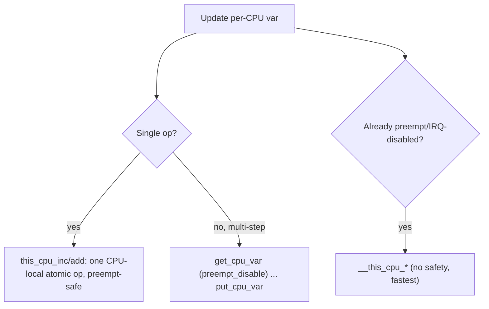

# Q9 — Per-CPU Variables: Lock-Free by Design

> **Subsystem:** Concurrency · **Files:** `include/linux/percpu.h`, `mm/percpu.c`, `include/linux/percpu-defs.h`
> **Interviewer is really probing:** Do you understand how **giving each CPU its own copy** removes
> the need for locking, and the **preemption/migration** hazards of `this_cpu_*` access?

---

## TL;DR Cheat Sheet

- A **per-CPU variable** is an array with **one independent instance per CPU**. Each CPU touches
  **only its own copy**, so there's **no sharing → no lock needed** and **no cache-line bouncing**.
- Declared with `DEFINE_PER_CPU(type, name)`; accessed via `this_cpu_*`, `per_cpu(name, cpu)`,
  `get_cpu_var()/put_cpu_var()`, `__this_cpu_*`.
- The catch: access must be **safe against being moved to another CPU mid-operation**. So
  `this_cpu_*` operations either (a) are **single-instruction atomic-wrt-this-CPU** (e.g.
  `this_cpu_inc` uses a CPU-local atomic that's safe vs interrupts), or (b) require you to
  **disable preemption** (`get_cpu()`/`put_cpu()`) so you don't migrate between "which CPU am I" and
  "use that CPU's copy."
- Used everywhere hot: **statistics/counters**, **per-CPU run queues**, **SLUB per-CPU slabs**,
  **pcp page lists**, **RCU `rcu_data`**, **softirq state**, **memcg stat batching**.
- Trade-off: reading a **global total** means **summing across all CPUs** (`for_each_possible_cpu`)
  — writes are cheap, aggregate reads are O(NR_CPUS).

---

## The Question

> What is a per-CPU variable and how does it avoid locking? How does `this_cpu_*` work with
> preemption?

---

## Why do per-CPU variables exist?

A shared counter incremented by every CPU is a **scalability disaster**: each increment is an
atomic RMW on **one shared cache line**, which **ping-pongs** between cores (cache-coherence
traffic). At high core counts this single line becomes the bottleneck — the classic "hot cache
line."

Per-CPU variables flip the model: **eliminate sharing instead of synchronizing it.** If each CPU
has its **own** copy, increments are **purely local** — no atomics needed against other CPUs, no
cache-line contention, perfect linear scaling on writes. You "pay" only when you need the **global
view** (sum the copies), which for stats is rare and tolerant of slight skew.

This is the **"don't share, partition"** philosophy — the same idea behind per-CPU SLUB slabs,
per-CPU page lists, and per-CPU run queues. It's one of the most important scalability patterns in
the kernel and a favorite senior-level topic.

---

## When to use per-CPU data

- **Statistics & counters** where exact instantaneous global value isn't required (network/VM
  stats, `vmstat`, memcg stats — read approximately, summed on demand).
- **Hot allocator caches**: SLUB `kmem_cache_cpu`, buddy `pcplists` — per-CPU freelists avoid locks
  on the fast path.
- **Per-CPU run queues** (`struct rq`) — the scheduler keeps a runqueue per CPU; balancing moves
  tasks between them (Q14/Q15).
- **Per-CPU state machines**: softirq pending masks, local timers, RCU per-CPU data.
- **Avoiding locks** generally, when work can be **partitioned by CPU**.

**Avoid** when you frequently need a precise global value under contention, or when one CPU must
read/modify **another** CPU's data often (defeats the purpose, reintroduces synchronization).

---

## Where in the kernel

```
include/linux/percpu-defs.h   <- DEFINE_PER_CPU / DECLARE_PER_CPU
include/linux/percpu.h        <- this_cpu_*, per_cpu(), alloc_percpu()
mm/percpu.c                   <- dynamic per-CPU allocator (alloc_percpu/free_percpu)
arch/*/                       <- per-CPU base register (x86 GS, arm64 TPIDR_EL1/per-cpu offset)
```

Mechanism: static per-CPU vars live in a special `.data..percpu` section; at boot the kernel
allocates **one copy of that section per CPU**. A CPU reaches **its** copy by adding a **per-CPU
offset** stored in a dedicated register (x86: `%gs` base; arm64: a per-CPU offset register). So
`this_cpu_read(x)` is just `*(x + this_cpu_offset)` — a single segment-relative access, no lock.

---

## How it works — mechanics & the preemption hazard

### The layout

```
.data..percpu section (template):   [ var A ][ var B ][ var C ]
At boot, replicated per CPU:
  CPU0 area: [A0][B0][C0]   reached via __per_cpu_offset[0]
  CPU1 area: [A1][B1][C1]   reached via __per_cpu_offset[1]
  ...
Access "this CPU's A" = base(A) + this_cpu_offset(current CPU)
```

### The core hazard: migration between "which CPU" and "use its copy"

A naive access:
```c
int cpu = smp_processor_id();     /* (1) I'm on CPU 3 */
                                  /* <-- PREEMPTED, migrated to CPU 5! */
per_cpu(counter, cpu)++;          /* (2) but I update CPU 3's copy from CPU 5 -> race */
```
Between (1) and (2) the task could be **preempted and rescheduled on a different CPU**, so the
"which CPU am I" answer becomes stale and two CPUs could touch the same copy → corruption.

Two solutions:

**1. Make the whole access atomic-wrt-this-CPU (the `this_cpu_*` ops).**
`this_cpu_inc(counter)` compiles (on x86) to a **single instruction** using the `%gs`-relative
address — it computes the CPU offset and does the increment **atomically with respect to
preemption and interrupts on that CPU**. There's no window to migrate, and it's safe against IRQs
on the same CPU. **No global atomic, no lock** — just a CPU-local RMW. This is the preferred,
cheapest form.

**2. Pin to the current CPU with preempt-disable.**
`get_cpu_var(x)` does `preempt_disable()` then returns `&this_cpu(x)`; `put_cpu_var(x)` re-enables
preemption. While preemption is disabled you **cannot be migrated**, so a multi-step sequence on
"this CPU's copy" is safe. `get_cpu()`/`put_cpu()` do the same around `smp_processor_id()`.

```c
struct mystat *s = get_cpu_var(stats);   /* preempt_disable + this CPU's copy */
s->packets++; s->bytes += len;           /* multi-field update, safe: can't migrate */
put_cpu_var(stats);                       /* preempt_enable */
```

**`__this_cpu_*`** (double underscore) variants **assume preemption is already disabled** (or IRQs
off) — they skip the safety and are for code that already guarantees it (e.g. inside an IRQ handler
or under a held spinlock). Using `__this_cpu_*` with preemption enabled is a bug `lockdep`/debug
checks will flag.

### Reading the global aggregate

```c
unsigned long total = 0; int cpu;
for_each_possible_cpu(cpu)
    total += per_cpu(counter, cpu);   /* sum all CPUs' copies */
```
Writes are O(1) and lock-free; the **aggregate read is O(NR_CPUS)** and may be slightly skewed
(another CPU may update mid-sum). For stats that's fine; if you need exactness use additional
synchronization or a folding scheme (e.g. `percpu_counter` with a batched global fallback).

### Dynamic per-CPU memory

`alloc_percpu(type)` / `free_percpu(ptr)` allocate per-CPU instances at runtime (via `mm/percpu.c`),
accessed with `per_cpu_ptr(ptr, cpu)` / `this_cpu_ptr(ptr)`. Used by drivers and subsystems that
need per-CPU state for dynamically created objects.

---

## Diagrams

### No sharing → no contention

```
Shared counter (bad):   CPU0 CPU1 CPU2 CPU3  --all atomic-inc-->  [ one cache line ]  <- bounces
Per-CPU counter (good): CPU0->[c0]  CPU1->[c1]  CPU2->[c2]  CPU3->[c3]   (no bouncing; sum on read)
```

### `this_cpu_inc` vs `get/put_cpu_var`



---

## Annotated C

```c
/* Static per-CPU variable: one instance per CPU. */
DEFINE_PER_CPU(unsigned long, irq_count);

/* Cheapest: single preempt-safe local op (no lock, no global atomic). */
this_cpu_inc(irq_count);
this_cpu_add(bytes_stat, len);

/* Multi-step on this CPU's copy: pin with preempt-disable. */
{
    struct cpu_stat *s = get_cpu_var(cpu_stats); /* preempt_disable() inside */
    s->packets++;
    s->bytes += len;
    put_cpu_var(cpu_stats);                       /* preempt_enable() inside  */
}

/* Already in IRQ/atomic context: skip the safety. */
__this_cpu_inc(softirq_pending);

/* Read another CPU's copy explicitly (e.g. during aggregation/IPI). */
unsigned long c = per_cpu(irq_count, target_cpu);

/* Dynamic per-CPU allocation. */
struct ring __percpu *r = alloc_percpu(struct ring);
this_cpu_ptr(r)->head++;            /* this CPU's ring */
per_cpu_ptr(r, 2)->tail;            /* CPU 2's ring */
free_percpu(r);
```

> Interview one-liner: **`this_cpu_*` is safe because it's a single CPU-local atomic op that can't
> be split by preemption; for multi-step sequences you must `get_cpu()`/`preempt_disable()` so you
> don't migrate between picking the CPU and using its data.**

---

## Company Angle

- **AMD/Google (many-core scaling):** per-CPU data is *the* answer to hot-cache-line contention;
  expect "how would you make this counter scale to 256 cores?" → per-CPU + summed reads, or
  `percpu_counter` with batching.
- **NVIDIA/Qualcomm (RT/IRQ):** `__this_cpu_*` in IRQ handlers, the preemption/IRQ-disable
  requirement, and per-CPU softirq/IRQ stats. Under **PREEMPT_RT**, code relying on
  `preempt_disable` for per-CPU access needs care (local_lock).
- **All:** SLUB per-CPU slabs and buddy pcplists as concrete examples of per-CPU for allocator
  speed (ties to Q2).

---

## War Story

*"A monitoring counter incremented on every packet was implemented as a single `atomic64_t`. On a
new 2-socket, 128-thread box throughput **regressed** versus the old 32-thread box — `perf`
showed enormous time in the atomic increment with massive **cache-line contention** (the counter
line bounced across both sockets). I converted it to a **per-CPU** `DEFINE_PER_CPU(u64, pkts)` with
`this_cpu_add()` on the hot path and a `for_each_possible_cpu` **sum** in the stats reader.
Contention vanished and it scaled linearly. The reviewer's follow-up — *'isn't the sum racy?'* — let
me explain that for monitoring counters slight skew is acceptable, and if exactness were required I'd
use `percpu_counter` (per-CPU batches folded into a globally-locked total only when a batch
threshold is crossed)."*

---

## Interviewer Follow-ups

1. **How do per-CPU vars avoid locks?** Each CPU has a private copy → no sharing → nothing to
   synchronize on the write path; you only synchronize (sum) when reading the global aggregate.

2. **What's the preemption hazard?** Between reading `smp_processor_id()` and using that CPU's copy,
   you could migrate; the access must be a single CPU-local op or be wrapped in preempt-disable.

3. **`this_cpu_inc` vs `__this_cpu_inc`?** The former is safe with preemption enabled (preempt-safe
   single op); the latter assumes preemption/IRQs are already disabled and is faster but unsafe
   otherwise.

4. **`get_cpu_var`/`put_cpu_var`?** They wrap access in `preempt_disable()`/`preempt_enable()` so a
   multi-step update of this CPU's copy can't migrate.

5. **How does a CPU find its copy?** A per-CPU **offset** in a dedicated register (x86 `%gs`, arm64
   per-CPU offset reg) added to the variable's base; one segment-relative access.

6. **How do you read the global total?** Sum `per_cpu(var, cpu)` over `for_each_possible_cpu` —
   O(NR_CPUS), possibly slightly stale.

7. **PREEMPT_RT impact?** RT can preempt almost anywhere; code that used bare `preempt_disable` for
   per-CPU protection often switches to **`local_lock`** so RT can keep it correct while remaining
   preemptible.

8. **When is per-CPU the wrong tool?** When you need exact global values frequently under
   contention, or one CPU must constantly touch other CPUs' copies (reintroduces sharing).

---

## 30-Minute Talk Track

| Min | Cover |
|-----|-------|
| 0–3 | Hot-cache-line problem; partition-don't-share philosophy |
| 3–7 | Layout: .data..percpu replicated per CPU, per-CPU offset register |
| 7–12 | The migration hazard between "which CPU" and "use its copy" |
| 12–17 | `this_cpu_*` single-op safety vs `get_cpu_var`/preempt-disable for multi-step |
| 17–20 | `__this_cpu_*` (already-disabled), per_cpu(cpu) for other CPUs |
| 20–23 | Aggregate reads: for_each_possible_cpu sum; percpu_counter batching |
| 23–26 | Real users: SLUB per-CPU slabs, pcplists, runqueues, RCU rcu_data |
| 26–30 | PREEMPT_RT/local_lock + war story (atomic64 → per-CPU) |
