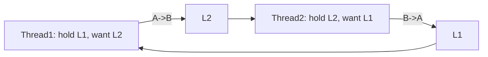
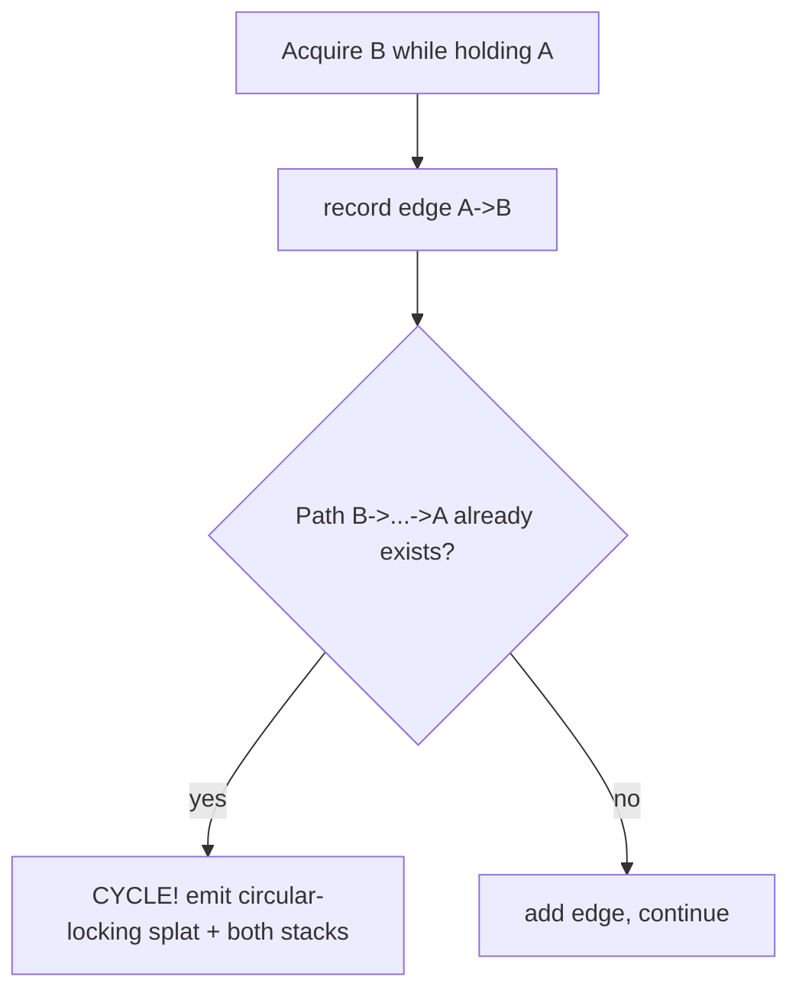

# Q10 — Debugging Deadlocks & Races with lockdep

> **Subsystem:** Concurrency · **Files:** `kernel/locking/lockdep.c`, `lib/locking-selftest.c`, `include/linux/lockdep.h`
> **Interviewer is really probing:** Have you actually **root-caused a real deadlock/race**, and do
> you understand **lock ordering (ABBA)**, **IRQ-safe** locking, and how **lockdep** proves it?

---

## TL;DR Cheat Sheet

- **Deadlock** = cycle of "A waits for B, B waits for A." Classic forms:
  - **ABBA / lock-ordering:** thread1 takes L1→L2, thread2 takes L2→L1. Cross at the wrong moment → hang.
  - **Self-deadlock / recursion:** take a non-recursive lock you already hold.
  - **IRQ inversion:** hold a lock in process context that an **IRQ handler** also takes (without
    disabling IRQs) → IRQ on same CPU spins forever (link Q6).
- **Race condition** = unsynchronized concurrent access producing nondeterministic results
  (lost update, use-after-free, torn read).
- **lockdep** (`CONFIG_PROVE_LOCKING`) is a runtime **lock-correctness validator**: it learns the
  **order** locks are taken in and the **IRQ context** they're used in, builds a dependency graph,
  and **screams the moment** a *potential* violation is observed — even if no actual deadlock
  happened this run.
- lockdep catches: **inconsistent lock ordering** (ABBA), **IRQ-unsafe → IRQ-safe** inversions,
  recursive locking, sleeping-in-atomic (with `might_sleep`/`DEBUG_ATOMIC_SLEEP`).
- Other tools: **KCSAN** (data-race detector), **lockstat** (contention stats), `/proc/lockdep*`,
  hung-task & soft-lockup detectors (Q24).

---

## The Question

> Describe a real deadlock or race condition you debugged. How did lockdep help? Expect follow-ups
> on lock ordering, ABBA deadlocks, and IRQ-safe locking.

---

## Why deadlocks and races happen (and why lockdep is needed)

Concurrency bugs are **probabilistic** — they depend on exact interleavings that may occur once in
millions of runs, on one machine, under one timing. A deadlock might never reproduce in testing yet
hang a customer's box. Two needs follow:

1. **Discipline:** establish and **document a global lock ordering** so cycles are impossible by
   construction.
2. **Verification:** a tool that doesn't wait for the unlucky interleaving but **detects the
   *possibility*** of a cycle from any single observed run. That's **lockdep**: it generalizes from
   "I saw L1 then L2 here, and L2 then L1 there" to "these two orders **can** deadlock," and reports
   it immediately, deterministically.

Why lockdep is so valuable at senior level: it turns rare, timing-dependent hangs into
**reproducible, immediate splats** the first time the offending code path runs in any order.

---

## When do these occur / when does lockdep fire?

- **ABBA**: any time two locks are acquired in **different orders** on different paths.
- **IRQ inversion**: a lock taken in **both** an IRQ handler and process context, where the process
  path doesn't disable IRQs (needs `spin_lock_irqsave`).
- **Recursive**: re-entering a non-recursive lock (e.g. lock taken, then a callback re-takes it).
- **Sleeping in atomic**: `mutex_lock`/`kmalloc(GFP_KERNEL)`/`copy_to_user` while holding a spinlock
  or in IRQ context (`might_sleep()` + lockdep flags it).
- lockdep fires **the first time** it observes a lock usage that's **inconsistent** with what it
  learned earlier — not necessarily when a real deadlock occurs.

---

## Where in the kernel

```
kernel/locking/lockdep.c       <- the validator: lock classes, dependency graph, usage masks
include/linux/lockdep.h        <- lockdep_assert_held(), annotations
kernel/locking/lockdep_proc.c  <- /proc/lockdep, /proc/lock_stat
lib/locking-selftest.c         <- boot-time lockdep self-tests
Config: CONFIG_PROVE_LOCKING, CONFIG_DEBUG_ATOMIC_SLEEP, CONFIG_LOCK_STAT, CONFIG_DEBUG_LOCKDEP
```

KCSAN: `kernel/kcsan/` (`CONFIG_KCSAN`) — a separate **data-race** detector.

---

## How lockdep works — the model

### Lock classes, not lock instances

lockdep reasons about **lock classes** (e.g. "all `inode->i_mutex` locks"), not individual
instances — otherwise it'd track millions of locks. Each lock declared/initialized gets a **class**
(keyed by the lock's init site). This is also why you sometimes need **lock nesting annotations**
(`mutex_lock_nested`, subclasses) when two locks of the *same class* are legitimately held together
(e.g. parent and child inode) — without it lockdep thinks you're recursively self-locking.

### The dependency graph

1. Every time lock **B** is acquired **while holding A**, lockdep records an edge **A → B** ("A
   before B").
2. lockdep maintains the transitive **dependency graph** of all such edges.
3. When adding a new edge **B → A**, it checks: does a path **A → … → B** already exist? If so,
   adding **B → A** creates a **cycle** ⇒ **potential ABBA deadlock** ⇒ **splat** with both stacks.

So lockdep finds ABBA **even if the two orderings never actually ran concurrently** — observing both
orders *at all*, ever, is enough.

### IRQ-context state machine

For each lock class lockdep tracks **usage bits**: was it ever taken in **hardirq** context? in
**softirq**? with IRQs enabled? It then enforces rules like:

> If a lock is **ever** taken in hardirq context (`irq-safe`), it must **never** be held with IRQs
> enabled in a path where a hardirq could take it (`irq-unsafe`) — that's an **IRQ inversion** and
> lockdep reports it (`inconsistent {HARDIRQ-ON} -> {IN-HARDIRQ}` style splats).

This is exactly how lockdep catches the "should have used `spin_lock_irqsave`" bug **without** the
IRQ ever actually firing at the bad moment.

### Reading a lockdep splat

A typical report contains:
- A banner: `WARNING: possible circular locking dependency detected` (ABBA) or
  `inconsistent lock state` (IRQ).
- The **two (or more) lock-acquisition chains** with **stack traces**, labeled like:
  ```
  CPU0                    CPU1
  lock(L1);               lock(L2);
  lock(L2);  <- waits     lock(L1);  <- waits   => ABBA cycle
  ```
- The **lock classes** involved and their init sites.
The fix is almost always: **impose a consistent global order**, or **change IRQ-safety** of a lock,
or **add a nesting annotation** if the held-together same-class locks are actually safe.

---

## Diagrams

### ABBA cycle



### lockdep edge-add check



---

## Annotated C

```c
/* The ABBA setup lockdep catches the first time BOTH orders are seen: */

/* Path 1 */                         /* Path 2 (bug) */
mutex_lock(&a->lock);                mutex_lock(&b->lock);
mutex_lock(&b->lock);   /* A->B */   mutex_lock(&a->lock);   /* B->A  -> cycle */
...                                  ...
mutex_unlock(&b->lock);              mutex_unlock(&a->lock);
mutex_unlock(&a->lock);              mutex_unlock(&b->lock);

/* IRQ-safe fix: lock also taken in IRQ handler -> save/restore IRQ state in process path */
spin_lock_irqsave(&dev->lock, flags);   /* lockdep verifies consistent IRQ usage */
/* ... */
spin_unlock_irqrestore(&dev->lock, flags);

/* Same-class nesting that is actually safe (parent/child inode): annotate to silence lockdep */
mutex_lock(&parent->i_mutex);
mutex_lock_nested(&child->i_mutex, I_MUTEX_CHILD);  /* declares legitimate order */

/* Assertions that document & check invariants (and feed lockdep): */
lockdep_assert_held(&dev->lock);     /* WARN if caller doesn't hold it */
might_sleep();                        /* WARN if called in atomic context */
```

> Two cheap habits that prevent most of these bugs: (1) **document a global lock order** in a comment
> near the struct, and (2) run **CI with `CONFIG_PROVE_LOCKING` + `CONFIG_DEBUG_ATOMIC_SLEEP`** so
> the splat happens in testing, not production.

---

## Company Angle

- **All four companies:** this is the canonical "tell me about a hard bug" question — the *war story*
  matters more than definitions. Have a concrete ABBA or IRQ-inversion ready with the lockdep splat
  and the fix.
- **NVIDIA/Qualcomm (drivers/RT):** IRQ-safe locking, `spin_lock_irqsave` vs `_bh`, threaded IRQ
  interactions, and **PREEMPT_RT** where lock semantics change (sleeping spinlocks → new ordering
  hazards).
- **Google (scale):** running lockdep/KCSAN in fleet test infra; data races found by **KCSAN** in
  lockless code; lockstat for **contention** (not just correctness) tuning.
- **AMD (many-core):** contention as a perf problem — `CONFIG_LOCK_STAT` to find the hottest locks
  and split/convert them (per-CPU, RCU).

---

## War Story (have one ready — this is the whole question)

*"We had a rare hang reported only on a customer's heavily-loaded box; it never reproduced for us.
Enabling **`CONFIG_PROVE_LOCKING`** in a test build immediately produced a `possible circular
locking dependency` splat — even without the hang — between a filesystem's `inode->lock` and the
writeback path's `wb->list_lock`. The two stacks showed **path A** took `inode→wb` while **path B**
(triggered from memory reclaim) took `wb→inode`: textbook **ABBA**. The real deadlock needed both
paths to interleave on the same locks at the same instant — vanishingly rare in the field, which is
why it 'never reproduced.' lockdep didn't need the unlucky timing; seeing **both orders at all** was
enough. The fix established a **single global order** (always inode-before-wb) by reworking the
reclaim path to drop the inode lock before touching writeback. I added the offending workload to CI
under lockdep so any future ordering regression fails the build."*

(Variant to keep ready: an **IRQ-inversion** where a process-context `spin_lock` shared with an IRQ
handler should have been `spin_lock_irqsave` — lockdep's `inconsistent lock state {IN-HARDIRQ-W}`.)

---

## Interviewer Follow-ups

1. **What's an ABBA deadlock?** Two threads acquire two locks in opposite orders; if they interleave
   each holds one and waits for the other → cycle. Fix: a single consistent global lock order.

2. **How does lockdep find ABBA without an actual deadlock?** It records "lock X taken while holding
   Y" edges and flags when a new edge would **close a cycle** in the dependency graph — observing
   both orders *ever* suffices.

3. **What is IRQ-safe locking and the inversion lockdep catches?** A lock taken in IRQ context must
   not be held with IRQs enabled elsewhere; otherwise the IRQ can re-enter and self-deadlock. Use
   `spin_lock_irqsave`. lockdep tracks per-class IRQ usage to detect this.

4. **Why lock *classes* not instances?** Tracking every instance is infeasible; classes (by init
   site) generalize, but require **nesting annotations** for legitimate same-class nesting
   (parent/child inode).

5. **`mutex_lock_nested` / subclasses — why?** To tell lockdep that holding two locks of the same
   class in a defined order is intentional and safe, avoiding false self-deadlock reports.

6. **lockdep vs KCSAN?** lockdep validates **locking discipline/ordering**; KCSAN detects **data
   races** (unsynchronized concurrent accesses) including in **lockless** code lockdep can't see.

7. **What's lockstat for?** `CONFIG_LOCK_STAT` measures **contention** (wait times, acquisitions) to
   find hot locks to optimize — a performance tool, not correctness.

8. **Overhead of lockdep — production?** Significant; it's a **debug/test** feature, normally off in
   production. You run it in CI/dev to catch bugs before shipping.

9. **A race that isn't a deadlock — how to find it?** KCSAN, careful `READ_ONCE/WRITE_ONCE` audit,
   `lockdep_assert_held` to verify invariants, and reasoning about missing barriers (Q8).

---

## 30-Minute Talk Track

| Min | Cover |
|-----|-------|
| 0–3 | Deadlock vs race; why they're rare/timing-dependent and hard to reproduce |
| 3–7 | Deadlock taxonomy: ABBA, self/recursive, IRQ inversion, sleeping-in-atomic |
| 7–12 | lockdep model: lock classes, dependency graph, cycle detection on edge-add |
| 12–16 | IRQ-context usage tracking; how it catches "should be irqsave" without the IRQ firing |
| 16–20 | Reading a splat: the two chains, lock classes, the fix (global order) |
| 20–23 | Nesting annotations, mutex_lock_nested, false positives |
| 23–26 | KCSAN (races), lockstat (contention), might_sleep/DEBUG_ATOMIC_SLEEP |
| 26–30 | War story (ABBA found by lockdep without reproducing) + CI discipline |
