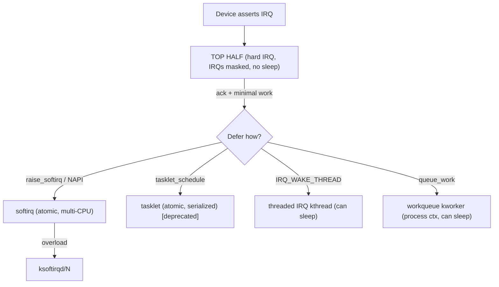

# Q11 — Top Half vs Bottom Half: Softirqs, Tasklets, Threaded IRQs, Workqueues

> **Subsystem:** Interrupts · **Files:** `kernel/softirq.c`, `kernel/irq/manage.c`, `kernel/workqueue.c`, `include/linux/interrupt.h`
> **Interviewer is really probing:** Do you know how Linux **splits interrupt work** to keep IRQs
> short, the **context restrictions** of each deferral mechanism, and **which to pick**?

---

## TL;DR Cheat Sheet

- **Top half (hard IRQ handler):** runs with **interrupts disabled** (on that line/CPU), must be
  **fast** and **non-sleeping**. Just acknowledge the device, grab data, and **schedule** deferred work.
- **Bottom half:** the deferred work, run later in a less restrictive context.
- Four deferral mechanisms:
  | Mechanism | Context | Can sleep? | Concurrency |
  |-----------|---------|------------|-------------|
  | **softirq** | softirq (atomic) | **No** | same softirq runs **concurrently** on multiple CPUs |
  | **tasklet** | softirq (atomic) | **No** | same tasklet **serialized** (never two at once) — *deprecated* |
  | **threaded IRQ** | kernel thread | **Yes** | one thread per IRQ |
  | **workqueue** | kernel thread (process) | **Yes** | flexible, can sleep, schedulable |
- **softirqs** are a **fixed, static set** (`NET_RX`, `NET_TX`, `BLOCK`, `TIMER`, `TASKLET`,
  `RCU`, `SCHED`…) — you can't add new ones; used by core subsystems for high-performance deferral.
- **tasklets** are built **on top of** the `TASKLET_SOFTIRQ`; being phased out (`BH workqueues`
  replace them) due to atomic-context limits and latency.
- **threaded IRQs** (`request_threaded_irq`) move the handler into a **sleepable kthread** — the
  default for most modern drivers and **mandatory** under `PREEMPT_RT`.
- **workqueues** run in **process context**, can **sleep/block**, and are the go-to when deferred
  work needs to allocate, do I/O, or take mutexes.

---

## The Question

> Explain the difference between top half and bottom half. Compare softirqs, tasklets, threaded
> IRQs, and workqueues. When to defer work, context restrictions, and why tasklets are deprecated.

---

## Why split into top/bottom half?

When a device interrupts, the CPU stops what it's doing and runs the handler with **that interrupt
(often more) disabled**. While interrupts are disabled:
- **latency** for *other* interrupts grows (a slow handler delays the timer, the NIC, etc.),
- you **cannot sleep** (no scheduler, no blocking allocations) — see Q13.

So the design principle is: **do the absolute minimum in hard IRQ context** (acknowledge the
device, copy the urgent data, re-enable the device), and **defer the heavy/sleepable processing**
to a context where interrupts are on and (sometimes) sleeping is allowed.

The trade-off space across the four mechanisms is exactly **"how restrictive a context vs how soon
it runs vs whether it can sleep":**
- softirq/tasklet run **very soon** (right after the IRQ, on IRQ-exit) but in **atomic** context.
- threaded IRQ / workqueue run in a **schedulable thread** (can sleep) but with **scheduling
  latency** and the cost of a context switch.

---

## When to use each

- **softirq** — only core, high-throughput subsystems (networking RX/TX, block I/O, timers, RCU,
  tasklet dispatch). You normally **don't add** softirqs in a driver; you consume existing ones
  (e.g. NAPI for networking).
- **tasklet** — historically: simple, serialized, atomic deferral in a driver. **Now discouraged**;
  new code should use **threaded IRQ**, **workqueue**, or the new **BH (bottom-half) workqueues**.
- **threaded IRQ** — the modern default: your handler may need to **sleep** (talk to an I2C/SPI
  device, take a mutex, allocate). `request_threaded_irq()` with a quick top-half check + a threaded
  bottom half. Mandatory for **PREEMPT_RT** (where hardirqs are forced threaded).
- **workqueue** — deferred work that can be **scheduled later**, may **sleep/block/allocate/do
  I/O**, isn't latency-critical to the microsecond. Use a dedicated WQ for ordering/concurrency
  control (`alloc_workqueue` with flags like `WQ_UNBOUND`, `WQ_HIGHPRI`, `WQ_MEM_RECLAIM`).

Decision rule: **need to sleep? → threaded IRQ or workqueue. Must be fast & atomic & high-rate? →
softirq (usually via existing subsystem, e.g. NAPI).**

---

## Where in the kernel

```
kernel/softirq.c        <- __do_softirq(), softirq vector table, ksoftirqd
kernel/irq/manage.c     <- request_irq / request_threaded_irq, irq thread (irq_thread())
kernel/irq/handle.c     <- handle_irq_event() top-half dispatch
kernel/workqueue.c      <- workqueues, worker pools, kworker threads
include/linux/interrupt.h, workqueue.h
```

Softirq vectors (priority order): `HI`, `TIMER`, `NET_TX`, `NET_RX`, `BLOCK`, `IRQ_POLL`,
`TASKLET`, `SCHED`, `HRTIMER`, `RCU`.

---

## How each works — mechanics

### Top half → bottom half flow

1. Hardware asserts IRQ → CPU traps → kernel runs the **top-half** handler (`irq_handler_t`) with
   the line masked.
2. Top half: **ack the device**, read minimal data (e.g. read NIC status, pull descriptors), then
   **raise** a bottom half (`raise_softirq`, `tasklet_schedule`, return `IRQ_WAKE_THREAD`, or
   `queue_work`). Return quickly.
3. On **IRQ exit** (`irq_exit()`), if softirqs are pending and we're not nested, run
   `__do_softirq()` — the **bottom half** for softirqs/tasklets, with **interrupts enabled** but
   still **atomic** (no sleeping).
4. If too many softirqs pile up (`__do_softirq` loops past a limit), processing is **handed off to
   `ksoftirqd/N`** (a per-CPU kthread) to avoid starving user space.

### softirq

- A **statically numbered** action run in atomic context. The **same** softirq vector can run
  **simultaneously on different CPUs** → handlers must be **reentrant/SMP-safe** (use per-CPU data
  or locks). High performance, no per-instance allocation.
- Raised via `raise_softirq(NR)`; consumed in `__do_softirq()` or `ksoftirqd`.
- Example: networking RX uses **NAPI**, which is driven by `NET_RX_SOFTIRQ` to **poll** packets in
  batches (interrupt mitigation) instead of one IRQ per packet.

### tasklet (deprecated)

- Built on `TASKLET_SOFTIRQ`. Guarantees a given tasklet **never runs concurrently with itself**
  (serialized), simplifying driver code — but still **atomic** (can't sleep), and its **strict
  serialization + atomic context** cause latency and limit flexibility.
- **Why deprecated:** can't sleep, single global-ish serialization, priority/latency issues, and
  better alternatives exist (threaded IRQ, workqueue, and new **BH workqueues** that provide
  tasklet-like atomic semantics with a cleaner API). New drivers should **not** use tasklets.

### threaded IRQ

- `request_threaded_irq(irq, hard_fn, thread_fn, flags, name, dev)`:
  - `hard_fn` (optional quick top half) runs in hard IRQ context, returns `IRQ_WAKE_THREAD` to
    defer; if NULL, a default primary handler just wakes the thread.
  - `thread_fn` runs in a dedicated **kthread** (`irq/NN-name`) in **process context** → **can
    sleep**, take mutexes, do slow bus I/O (I2C/SPI/regmap).
- Cleaner than tasklets/workqueues for "handle this IRQ but I might block." Under **PREEMPT_RT**,
  **all** hard IRQs become threaded by default so they're preemptible.

### workqueue

- Deferred work executed by **`kworker`** kthreads from **worker pools**. Runs in **process
  context** → can sleep, allocate `GFP_KERNEL`, do I/O, take mutexes.
- `schedule_work(&w)` on the system WQ, or `alloc_workqueue()` for a dedicated one with controlled
  **concurrency** (`max_active`), **bound vs unbound** CPUs (`WQ_UNBOUND` for cache-cold/long work),
  priority (`WQ_HIGHPRI`), and **reclaim safety** (`WQ_MEM_RECLAIM` to guarantee forward progress
  under memory pressure). **Concurrency-managed** (CMWQ) so blocked workers don't stall the pool.
- `delayed_work` for "run after N jiffies."

---

## Diagrams

### The split



### Context/can-sleep map

```
                 runs-soon  <----------------------->  can-sleep
softirq/tasklet  ████████ (atomic, on IRQ-exit)      ✗ no sleep
threaded IRQ      ████     (scheduled kthread)        ✓ sleep
workqueue         ██       (scheduled, flexible)      ✓ sleep / block / I/O
```

---

## Annotated C

```c
/* Modern driver: split with a threaded IRQ. */
static irqreturn_t my_hardirq(int irq, void *dev) {
    struct mydev *d = dev;
    u32 st = readl(d->regs + STATUS);
    if (!(st & IRQ_PENDING)) return IRQ_NONE;  /* shared IRQ: not ours */
    writel(st, d->regs + ACK);                 /* ack fast, no sleeping */
    d->pending = st;
    return IRQ_WAKE_THREAD;                     /* defer to thread_fn */
}
static irqreturn_t my_threadfn(int irq, void *dev) {
    struct mydev *d = dev;
    mutex_lock(&d->lock);                       /* OK: process context, can sleep */
    process_event(d, d->pending);               /* may do slow I2C/SPI, alloc, etc. */
    mutex_unlock(&d->lock);
    return IRQ_HANDLED;
}
request_threaded_irq(irq, my_hardirq, my_threadfn,
                     IRQF_SHARED, "mydev", dev);

/* Workqueue deferral (can sleep, scheduled later). */
static void my_work(struct work_struct *w) {
    struct mydev *d = container_of(w, struct mydev, work);
    /* allocate, block, do filesystem/IO here */
}
INIT_WORK(&dev->work, my_work);
schedule_work(&dev->work);                       /* from top half or elsewhere */

/* Dedicated WQ with reclaim safety + bounded concurrency. */
dev->wq = alloc_workqueue("mydev", WQ_UNBOUND | WQ_MEM_RECLAIM, 1);
queue_work(dev->wq, &dev->work);
```

> The cardinal rule, again: **top half does the minimum and never sleeps**; everything that might
> block goes to a **threaded IRQ or workqueue**.

---

## Company Angle

- **NVIDIA/Google (networking):** **NAPI** + `NET_RX_SOFTIRQ` for interrupt mitigation (poll
  batches instead of per-packet IRQs), softirq budget, `ksoftirqd` starvation, and **RPS/RFS** to
  spread softirq load across CPUs — core to high-PPS performance.
- **Qualcomm (embedded/RT):** threaded IRQs are the norm on SoCs (slow I2C/SPI/regmap devices that
  must sleep in the handler); **PREEMPT_RT** forced threading; IRQ affinity for power/latency.
- **AMD/NVIDIA (drivers):** workqueue concurrency/ordering, `WQ_MEM_RECLAIM` to avoid deadlock under
  memory pressure, unbound WQ for NUMA-friendly long work.
- **All:** "why are tasklets deprecated and what replaces them" is a current, modern-kernel question.

---

## War Story

*"A sensor driver used a **tasklet** to process IRQ data, but a new revision needed to read a
calibration register over **I2C** — which **sleeps**. The tasklet ran in atomic (softirq) context,
so the I2C call hit `BUG: scheduling while atomic` / `might_sleep` splats and occasionally hung the
CPU. The right fix wasn't to bolt a workqueue onto the tasklet (extra latency, two-stage handoff) —
it was to convert the whole thing to a **threaded IRQ**: a tiny hard-IRQ top half that acks and
returns `IRQ_WAKE_THREAD`, and a `thread_fn` that does the sleeping I2C read under a mutex. Cleaner,
lower latency than tasklet+workqueue, and **PREEMPT_RT-ready**. This is also a concrete example of
*why tasklets are deprecated*: the moment your bottom half needs to sleep, the atomic-context model
breaks."*

---

## Interviewer Follow-ups

1. **Why must the top half be fast?** It runs with interrupts disabled, delaying all other IRQs and
   raising system latency; it also **can't sleep**.

2. **softirq vs tasklet?** Both atomic; a softirq vector can run **concurrently on multiple CPUs**
   (must be SMP-safe), a tasklet is **serialized** with itself. Tasklets are built on the tasklet
   softirq and are deprecated.

3. **Why are tasklets deprecated?** Atomic-only (can't sleep), rigid serialization, latency
   problems, and better replacements (threaded IRQ, workqueue, BH workqueues).

4. **When threaded IRQ vs workqueue?** Threaded IRQ for "this specific interrupt's handler may
   sleep" (tied to the IRQ lifecycle); workqueue for general deferred work, scheduled flexibly,
   possibly long-running, decoupled from a specific IRQ.

5. **What is `ksoftirqd`?** Per-CPU kthread that drains softirqs when they overload `__do_softirq`,
   preventing user-space starvation while still processing softirq backlog.

6. **What is NAPI and why?** Networking switches from per-packet interrupts to **polling** under
   `NET_RX_SOFTIRQ` when traffic is high — fewer IRQs, batched processing, better throughput.

7. **`WQ_MEM_RECLAIM` — why?** Reserves a rescuer thread so the workqueue can make progress during
   memory reclaim (avoids deadlock when work is on the reclaim path).

8. **PREEMPT_RT effect on IRQs?** Hard IRQs are **forced into threads** so they're preemptible;
   softirqs/handlers that assumed atomic context must be RT-safe (raw locks, no unbounded atomic work).

---

## 30-Minute Talk Track

| Min | Cover |
|-----|-------|
| 0–3 | Why split: IRQs masked, no sleep, latency; do minimum then defer |
| 3–7 | Top-half mechanics: ack, minimal read, raise bottom half, irq_exit |
| 7–12 | softirqs: static vectors, multi-CPU concurrency, __do_softirq, ksoftirqd, NAPI |
| 12–16 | tasklets: serialized atomic; why deprecated; BH workqueue replacement |
| 16–21 | threaded IRQ: request_threaded_irq, hard_fn/thread_fn, sleeping, PREEMPT_RT |
| 21–25 | workqueues: kworker/CMWQ, process ctx, flags (UNBOUND/HIGHPRI/MEM_RECLAIM) |
| 25–28 | Decision matrix + context/can-sleep map |
| 28–30 | War story (tasklet→threaded IRQ for I2C) + summary |
