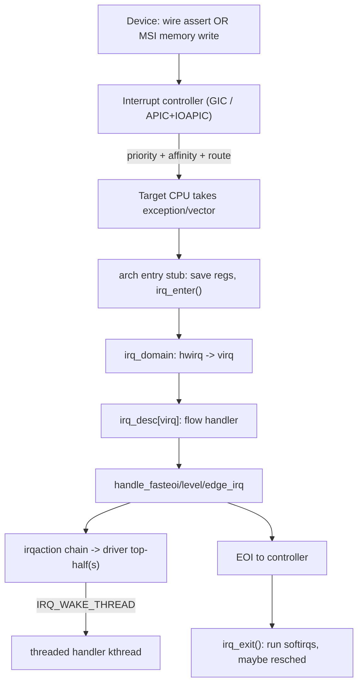

# Q12 — The Full IRQ Path: GIC/APIC, irq_domain, and MSI/MSI-X

> **Subsystem:** Interrupts · **Files:** `kernel/irq/`, `drivers/irqchip/`, `arch/*/kernel/`, `drivers/pci/msi/`
> **Interviewer is really probing:** Can you trace **hardware interrupt → ISR** end to end, and
> explain **interrupt controllers**, the **irq_domain** hwirq↔Linux-irq mapping, and **MSI/MSI-X**?

---

## TL;DR Cheat Sheet

- **Path:** device asserts IRQ → **interrupt controller** (GIC on ARM, (x2)APIC/IOAPIC on x86)
  prioritizes & routes it to a CPU → CPU takes an **exception/vector** → arch **entry stub** saves
  state → **generic IRQ layer** maps **hwirq → Linux IRQ number** via the **`irq_domain`** → finds
  the **`irq_desc`** → runs the registered **handler chain** (flow handler → action(s)) → EOI.
- **Interrupt controller** does prioritization, masking, routing/affinity, and **EOI** (end of
  interrupt) acknowledgment. ARM = **GIC** (Distributor + Redistributor + CPU interface, v3/v4
  with ITS for MSI). x86 = **Local APIC** per CPU + **IOAPIC**/MSI.
- **`irq_domain`** translates a controller-local **hwirq** into a global **Linux virtual IRQ
  (virq)** so drivers use a stable number regardless of which controller/cascade produced it.
  Essential for **hierarchical** controllers (GIC → PCIe → MSI).
- **`irq_desc`** is the per-IRQ kernel object: flow handler, `irqaction` list (registered handlers),
  chip ops (`irq_chip`), stats, affinity.
- **MSI/MSI-X** (PCIe): instead of a wire, the device performs a **memory write** to a special
  address → the controller turns that write into an interrupt. Enables **many vectors per device**,
  no shared lines, better affinity — crucial for **multi-queue NICs/NVMe/GPUs** (NVIDIA/AMD).

---

## The Question

> What happens from the moment a hardware interrupt fires until the ISR runs? Walk through the IRQ
> path. Cover the GIC (ARM) or APIC (x86), the IRQ descriptor, `irq_domain`, and MSI/MSI-X for PCIe.

---

## Why this machinery exists

A CPU has only a handful of exception entry points, but a system has **hundreds of interrupt
sources** with different priorities, that may target different CPUs, and that come and go (hotplug,
PCIe devices). We need:

- **An interrupt controller** to **prioritize**, **mask/unmask**, **route to a chosen CPU**
  (affinity), and provide **acknowledge/EOI** so a device doesn't re-interrupt forever.
- **A naming/translation layer** (`irq_domain`) so a driver can `request_irq(N, ...)` using a
  **stable Linux IRQ number** without caring that hwirq 17 on a cascaded GPIO controller behind the
  GIC is involved. Controllers nest (GIC → PCIe RC → MSI), so a **hierarchical mapping** is needed.
- **MSI/MSI-X** because **wired** interrupt lines are scarce, shared (causing IRQ storms and
  expensive "is it mine?" polling), and can't scale to the **many independent queues** modern
  devices need. A **memory-write interrupt** gives each queue its **own** vector with precise CPU
  affinity.

---

## When each element is involved

- **Every** interrupt goes through the controller (GIC/APIC) and the generic IRQ layer.
- **`irq_domain`** is used at **driver probe/`request_irq`** time to allocate/map a virq, and at
  **interrupt time** to translate the incoming hwirq back to a virq/`irq_desc`.
- **MSI/MSI-X** applies to **PCIe** (and some platform) devices that allocate vectors via
  `pci_alloc_irq_vectors()`; legacy devices use **wired (INTx)** lines through IOAPIC/GIC SPIs.

---

## Where in the kernel

```
arch/arm64/kernel/entry.S / arch/x86/.../entry      <- low-level exception entry stub
kernel/irq/irqdesc.c        <- irq_desc, the per-IRQ descriptor
kernel/irq/irqdomain.c      <- hwirq <-> virq mapping, hierarchical domains
kernel/irq/chip.c, handle.c <- irq_chip ops, flow handlers (handle_level/edge/fasteoi_irq)
kernel/irq/manage.c         <- request_irq / request_threaded_irq, irqaction list
drivers/irqchip/irq-gic-v3*.c   <- ARM GIC driver (incl. ITS for MSI)
arch/x86/kernel/apic/        <- local APIC / IOAPIC
drivers/pci/msi/             <- MSI/MSI-X allocation and programming
```

---

## How the IRQ path works — step by step

### 1. Device → interrupt controller

- **Wired (INTx / SPI):** the device asserts a physical line into the controller. On ARM that's a
  **SPI** (Shared Peripheral Interrupt) at the **GIC Distributor**; on x86 a pin on the **IOAPIC**.
- **MSI/MSI-X:** the device issues a **posted memory write** to a controller-defined address
  (x86: a special LAPIC address encoding vector+CPU; ARM GICv3: the **ITS** `GITS_TRANSLATER`
  register with a DeviceID+EventID). The controller converts this write into an interrupt.

### 2. Controller prioritizes & routes to a CPU

- The controller checks the interrupt's **priority** vs the CPU's current priority mask, applies
  **affinity** (which CPU(s) may take it), and signals the target CPU.
- **GIC** anatomy: **Distributor** (global routing/priority of SPIs), per-CPU **Redistributor**
  (GICv3, handles PPIs/SGIs and LPIs/MSIs), **CPU interface** (delivers to the core); **ITS**
  translates MSIs (DeviceID/EventID → LPI). **x86**: **IOAPIC** routes wired pins to a **Local
  APIC**; MSIs go straight to a LAPIC.
- IRQ types: **SGI** (software-generated, IPIs), **PPI** (per-CPU private, e.g. arch timer),
  **SPI** (shared peripheral), **LPI** (MSI-backed, GICv3+).

### 3. CPU takes the exception → arch entry stub

- The core traps to its **IRQ/interrupt vector** (ARM64: exception level entry; x86: an IDT
  vector). A low-level **assembly stub** saves registers, switches to the IRQ/kernel stack, and
  calls into C (`handle_arch_irq` / `do_IRQ`).
- This is where **`irq_enter()`** marks that we're in hardirq context (updates `preempt_count`,
  see Q13), so the kernel knows sleeping is forbidden.

### 4. Read the hwirq, translate via irq_domain

- The arch code asks the controller **which** interrupt fired → a controller-local **hwirq** number.
- `irq_domain` maps **(domain, hwirq) → virq (Linux IRQ number)**, which indexes the **`irq_desc`**.
  For hierarchical setups (GIC ↔ PCIe ↔ MSI), the domain hierarchy threads the translation through
  each layer.
- `generic_handle_irq(virq)` / `handle_domain_irq()` dispatches into the generic layer.

### 5. Flow handler → registered actions

- Each `irq_desc` has a **flow handler** appropriate to the line type:
  - `handle_level_irq` (level-triggered: mask, handle, ack, unmask),
  - `handle_edge_irq` (edge: ack early, handle, handle re-trigger),
  - `handle_fasteoi_irq` (modern GIC/APIC: handle then single **EOI**).
- The flow handler walks the **`irqaction`** list (multiple for **shared** IRQs) calling each
  driver **`handler_fn`** (the **top half**, Q11). Each returns `IRQ_HANDLED`, `IRQ_NONE` (not
  mine — shared IRQ), or `IRQ_WAKE_THREAD` (defer to threaded handler).
- Spurious/unhandled IRQs are counted; a line that fires with no handler claiming it can be
  **disabled** as spurious.

### 6. EOI and return

- The handler/flow code issues **EOI** to the controller (`irq_chip->irq_eoi`) so it can deliver
  the next interrupt. `irq_exit()` runs pending **softirqs** (Q11) if not nested, then the entry
  stub restores state and returns to the interrupted context (or reschedules if preemption is due).

### 7. Registration side (how the driver got here)

- `request_irq()/request_threaded_irq()` (`kernel/irq/manage.c`) allocates an `irqaction`, links it
  into the `irq_desc`, sets flags (`IRQF_SHARED`, trigger type), and **unmasks** the line via the
  `irq_chip`. For MSI, `pci_alloc_irq_vectors()` programs the device's MSI capability with the
  **address/data** the controller expects.

---

## Diagrams

### End-to-end



### GICv3 anatomy (ARM)

```
Devices --SPI--> [ Distributor ] --route--> [ Redistributor (per-CPU) ] --> [ CPU interface ] --> core
PCIe MSI --write--> [ ITS: DeviceID+EventID -> LPI ] --> Redistributor --> core
PPI (timer), SGI (IPI) handled per-CPU at the Redistributor.
```

---

## Annotated C

```c
/* The per-IRQ descriptor (simplified): the heart of the generic IRQ layer. */
struct irq_desc {
    struct irq_data    irq_data;     /* chip, hwirq, domain, affinity */
    irq_flow_handler_t handle_irq;   /* flow handler: handle_fasteoi_irq etc. */
    struct irqaction  *action;       /* linked list of registered handlers (shared IRQ) */
    unsigned int       irq_count;    /* spurious detection */
    /* ... stats, lock ... */
};

struct irqaction {
    irq_handler_t handler;       /* the driver top-half */
    irq_handler_t thread_fn;     /* threaded bottom-half (optional) */
    void         *dev_id;        /* cookie; also disambiguates shared IRQs */
    struct irqaction *next;      /* next action on a shared line */
    unsigned long flags;         /* IRQF_SHARED, trigger type ... */
};

/* irq_chip: controller-specific ops the flow handler calls. */
struct irq_chip {
    void (*irq_mask)(struct irq_data *);
    void (*irq_unmask)(struct irq_data *);
    void (*irq_eoi)(struct irq_data *);
    int  (*irq_set_affinity)(struct irq_data *, const struct cpumask *, bool force);
};

/* PCIe driver allocating MSI-X vectors (modern API). */
int n = pci_alloc_irq_vectors(pdev, 1, nr_queues, PCI_IRQ_MSIX | PCI_IRQ_MSI);
for (i = 0; i < n; i++)
    request_irq(pci_irq_vector(pdev, i), queue_isr, 0, "nvme-q", &queues[i]);
```

> Senior nuance: for a **shared wired IRQ**, each handler must quickly check its device's status and
> return **`IRQ_NONE`** if the interrupt isn't theirs — otherwise spurious-IRQ detection or storms.
> **MSI-X largely eliminates sharing**, which is one of its big advantages.

---

## Company Angle

- **NVIDIA/AMD (PCIe/GPU/NVMe):** **MSI-X** is the headline — many vectors, per-queue affinity,
  steering completion interrupts to the CPU that submitted the work (cache locality), avoiding
  shared-line storms. Be ready to discuss `pci_alloc_irq_vectors`, vector exhaustion, and affinity.
- **Qualcomm (ARM SoC):** **GICv3/v4** internals (Distributor/Redistributor/ITS), **SPI/PPI/SGI**,
  GPIO controllers as **cascaded irq_domains**, and device-tree `interrupts`/`interrupt-parent`
  describing the hierarchy (ties to Q19). LPIs and the ITS for MSI on ARM.
- **Google (networking):** IRQ affinity + **RPS/RFS**, MSI-X per-queue NIC interrupts, and IRQ
  balancing for tail latency.
- **All:** `irq_domain` hierarchical mapping is the unifying abstraction across these.

---

## War Story

*"A multi-queue NIC delivered all completions to **CPU0** under load — softirq processing pegged one
core while 31 sat idle, capping throughput. The driver had requested a **single MSI** vector
(legacy), so every queue's interrupt funneled to one IRQ/one CPU. I switched it to
**`pci_alloc_irq_vectors(..., PCI_IRQ_MSIX)`** to allocate **one vector per queue**, then set
**per-vector affinity** so each queue's completion interrupt landed on the CPU that submitted its
work (improving cache locality and enabling parallel softirq/NAPI). Throughput scaled across all
cores and tail latency dropped. The interviewer's follow-up — *'what if you run out of vectors?'* —
let me discuss falling back to fewer queues, `PCI_IRQ_AFFINITY` auto-spreading, and that the
**irq_domain/ITS** is what actually allocates and routes those MSI vectors underneath."*

---

## Interviewer Follow-ups

1. **What does the interrupt controller do?** Prioritize, mask/unmask, route to a CPU (affinity),
   and provide EOI/ack so the source can re-arm. GIC (ARM) / LAPIC+IOAPIC (x86).

2. **What is `irq_domain` and why hierarchical?** It maps controller-local **hwirq** to Linux
   **virq**; hierarchy threads translation through nested controllers (GIC→PCIe→MSI, GPIO cascades)
   so drivers use a stable IRQ number.

3. **What's in `irq_desc`?** Flow handler, the `irqaction` chain (handlers, incl. shared), `irq_chip`
   ops, affinity, stats — the per-IRQ kernel object.

4. **MSI vs MSI-X vs wired INTx?** INTx = shared physical line (storms, "is it mine?" checks). MSI =
   memory-write interrupt, up to 32 vectors but contiguous. MSI-X = up to 2048 independently
   addressable vectors with per-vector affinity → best for multi-queue.

5. **How does an MSI become an interrupt?** Device does a **posted memory write** to a controller
   address encoding vector/target (x86 LAPIC addr; ARM ITS `GITS_TRANSLATER` with DeviceID/EventID
   → LPI); controller injects it to the target CPU.

6. **GIC SGI/PPI/SPI/LPI?** SGI = software/IPI; PPI = per-CPU private (arch timer); SPI = shared
   peripheral (wired devices); LPI = MSI-backed (via ITS).

7. **What's a flow handler?** Per-IRQ logic for the trigger type: `handle_level_irq`,
   `handle_edge_irq`, `handle_fasteoi_irq` — masks/acks/EOIs appropriately and calls the actions.

8. **How are shared IRQs disambiguated?** Each handler checks its device's status register and
   returns `IRQ_NONE` if not theirs; `dev_id` cookie distinguishes actions; flags need `IRQF_SHARED`.

9. **Where does `irq_enter`/`irq_exit` matter?** They mark hardirq context (`preempt_count`),
   enforcing no-sleep (Q13) and gating softirq processing on exit (Q11).

---

## 30-Minute Talk Track

| Min | Cover |
|-----|-------|
| 0–3 | Why controllers + domain + MSI exist (priority, routing, naming, scale) |
| 3–8 | Device→controller: wired SPI/INTx vs MSI memory write; GIC vs APIC anatomy |
| 8–12 | CPU exception, arch entry stub, irq_enter, hardirq context |
| 12–16 | irq_domain: hwirq→virq, hierarchical domains (GIC→PCIe→MSI, GPIO cascade) |
| 16–20 | irq_desc + flow handlers + irqaction chain (shared IRQ, IRQ_NONE) |
| 20–24 | MSI/MSI-X deep dive: vectors, affinity, ITS/LPI, pci_alloc_irq_vectors |
| 24–27 | EOI, irq_exit, softirq handoff; threaded IRQ wake |
| 27–30 | War story (single MSI → MSI-X per-queue affinity) + summary |
