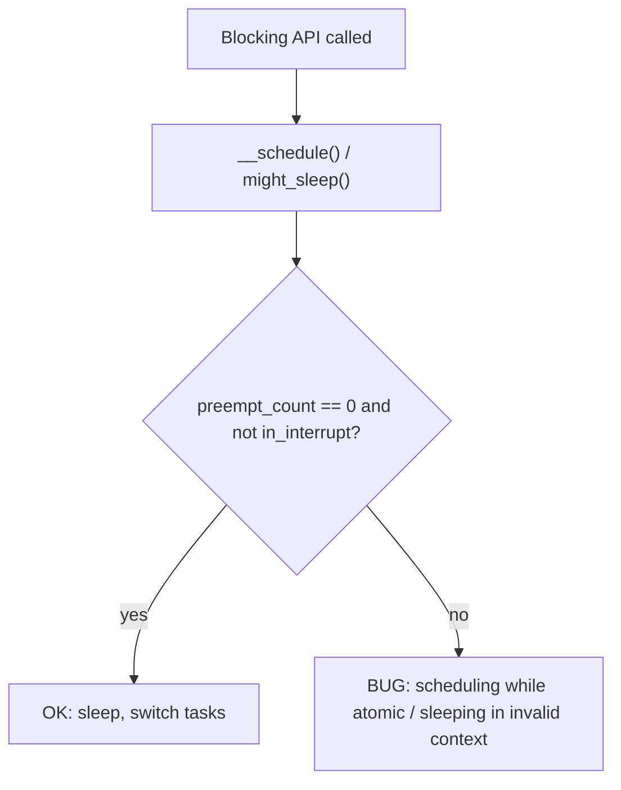

# Q13 — Why You Can't Sleep in Interrupt Context

> **Subsystem:** Interrupts · **Files:** `include/linux/preempt.h`, `kernel/sched/core.c`, `mm/gfp.h`, `kernel/softirq.c`
> **Interviewer is really probing:** Do you truly understand **what "sleeping" means** (invoking
> the scheduler), why there's **no valid task to switch back to** in IRQ context, and which APIs are
> therefore forbidden?

---

## TL;DR Cheat Sheet

- **"Sleeping" = calling `schedule()`** to give up the CPU and let another task run, expecting to be
  **woken later**. It requires a **task context** (a `task_struct`) to save/restore and a way to be
  put on a wait queue.
- **Interrupt (hardirq/softirq) context has no task of its own** — it **borrowed** the
  **interrupted task's** stack and `task_struct`. If you `schedule()` there, you'd:
  1. **steal/suspend the innocent interrupted task** (it didn't ask to sleep), and
  2. have **no mechanism to ever wake the IRQ handler back up** (nothing tracks it as a sleeper).
- The kernel tracks context in **`preempt_count`** (hardirq/softirq/preempt-disable counts). Sleeping
  while any "atomic" count is set triggers **`scheduling while atomic`** / **`BUG`**.
- **Forbidden in IRQ/atomic context:** anything that may block —
  `mutex_lock`, `down()` (semaphore), `kmalloc(GFP_KERNEL)`/`vmalloc`, `copy_to_user`/`copy_from_user`
  (may page-fault → sleep), `msleep`/`schedule`/`wait_event`, `down_read`/`down_write` (rwsem),
  `cond_resched`, blocking I/O.
- **Allowed:** `spin_lock`/`spin_lock_irqsave`, `kmalloc(GFP_ATOMIC)`, `this_cpu_*`, `udelay` (busy
  wait, not sleep), raising softirqs / scheduling work to defer the sleepable part.
- The same rule applies while **holding a spinlock** or **`preempt_disable()`** — you're "atomic".

---

## The Question

> Why can't you sleep in an interrupt context? What APIs are forbidden and why?

---

## Why sleeping is impossible there (first principles)

To **sleep** is to ask the scheduler to **deschedule the current execution and run something else**,
then resume **this** execution later. That mechanism is built entirely around the idea of a
**task (`task_struct`)**:

- The scheduler saves the **current task's** registers/stack and picks a runnable task.
- A sleeper is placed on a **wait queue**; a future event calls `wake_up()` to make it runnable
  again; eventually the scheduler resumes it.

An **interrupt handler is not a task.** When an IRQ fires, the CPU **interrupts whatever task was
running** and executes the handler **on that task's kernel stack**, in **borrowed context**. There
is no separate `task_struct` for "the interrupt handler." Consequences:

1. **Who gets descheduled?** If the handler calls `schedule()`, the scheduler would save and suspend
   the **interrupted task** — a task that was doing unrelated work and **never consented to block**.
   That task would be stuck until the handler "resumes," corrupting scheduling and possibly
   deadlocking (it might hold locks others need).
2. **Who wakes the handler?** Nothing put the **handler** on a wait queue; there's no entity to
   `wake_up()`. The interrupt path expects to **run to completion and return** (EOI, restore the
   interrupted task). A half-finished, blocked handler has **no path back**.
3. **Re-entrancy/state:** IRQs may be disabled; the controller is mid-EOI; nesting and per-CPU IRQ
   state assume the handler **finishes quickly**. Blocking breaks all of that.

So the prohibition isn't arbitrary policy — **there is literally no correct task to suspend and no
mechanism to resume**, so sleeping in IRQ context is **semantically undefined** and the kernel
treats it as a bug.

The same logic extends to **any atomic context**: holding a **spinlock** (preemption disabled) or
`preempt_disable()` means the current CPU must **not** be scheduled away (other CPUs may be spinning
on that lock; descheduling could deadlock). So **"can't sleep" = "in atomic context,"** which
includes hardirq, softirq, spinlock-held, and explicit preempt/IRQ-disabled regions.

---

## When are you "in atomic context"?

| Context | Atomic? | Why |
|---------|---------|-----|
| Hard IRQ handler (top half) | **Yes** | borrowed task, IRQs may be off |
| Softirq / tasklet / `__do_softirq` | **Yes** | runs in atomic deferred context |
| Holding a **spinlock** | **Yes** | preemption disabled; spinners on other CPUs |
| `preempt_disable()` region | **Yes** | must not be rescheduled |
| `local_irq_disable()` region | **Yes** | IRQs off |
| Threaded IRQ handler (`thread_fn`) | **No** | real kthread → **may sleep** |
| Workqueue / kworker | **No** | process context → **may sleep** |
| Syscall / process context | **No** | a real task → may sleep |

`in_atomic()` / `in_interrupt()` / `preempt_count()` reflect this; `might_sleep()` and
`CONFIG_DEBUG_ATOMIC_SLEEP` catch violations.

---

## Where the kernel enforces it

```
include/linux/preempt.h     <- preempt_count layout: HARDIRQ/SOFTIRQ/NMI/PREEMPT bitfields
                               in_interrupt(), in_atomic(), in_hardirq()
kernel/sched/core.c         <- __schedule(): WARN/BUG "scheduling while atomic" if preempt_count != 0
include/linux/kernel.h      <- might_sleep(): WARN if called in atomic context (DEBUG_ATOMIC_SLEEP)
mm/page_alloc.c             <- GFP_KERNEL vs GFP_ATOMIC gates reclaim (which sleeps)
```

`preempt_count` is a single per-CPU/per-task counter partitioned into fields. **Any** non-zero
atomic field means "don't sleep here." `__schedule()` checks it and **screams** if you try.

---

## How violations manifest & the forbidden APIs

### What goes wrong

- `BUG: scheduling while atomic: <task>/<pid>/0x...` — you called `schedule()` (directly or via a
  blocking API) with `preempt_count != 0`.
- `BUG: sleeping function called from invalid context at ...` + `might_sleep()` backtrace — a
  function annotated `might_sleep()` ran in atomic context.
- Hangs/deadlocks (the interrupted task held a lock; now it's suspended forever).

### Forbidden (may sleep) — do NOT call in IRQ/atomic context

| API | Why it sleeps |
|-----|---------------|
| `mutex_lock()`, `down()` (semaphore), `down_read/write()` | block on contention → `schedule()` |
| `kmalloc(GFP_KERNEL)`, `kzalloc(GFP_KERNEL)`, `vmalloc()` | may enter reclaim/writeback → sleep |
| `copy_to_user()` / `copy_from_user()` | user page may be paged out → **page fault → sleep** |
| `msleep()`, `schedule()`, `schedule_timeout()`, `wait_event()` | explicitly block |
| `cond_resched()` | voluntary reschedule point |
| `mutex`-based or blocking driver I/O (I2C/SPI sync, regmap that sleeps) | block on the bus |
| `flush_work()`/`flush_workqueue()` (waiting) | wait → sleep |

### Allowed in IRQ/atomic context

| API | Why it's safe |
|-----|---------------|
| `spin_lock()`, `spin_lock_irqsave()` | busy-wait, never sleeps |
| `kmalloc(GFP_ATOMIC)` / `GFP_NOWAIT` | no reclaim/sleep; uses reserves |
| `this_cpu_*`, `__this_cpu_*`, atomics | local/atomic, no sleep |
| `udelay()`, `ndelay()` (busy-wait) | spin, not sleep (use sparingly) |
| `raise_softirq`, `tasklet_schedule`, `queue_work`, `irq_wake_thread` | **defer** sleepable work |
| `printk` (careful), `WRITE_ONCE`/`READ_ONCE` | non-blocking |

### The correct pattern: defer the sleepable part

If your interrupt needs to do something that sleeps (allocate big, talk to a slow bus, take a
mutex), you **must defer** it (Q11): use a **threaded IRQ** (`thread_fn` runs in a kthread that may
sleep) or **schedule a workqueue** item. The hard IRQ just acks and hands off.

---

## Diagrams

### Why there's no one to wake

```
Task A running ──IRQ fires──► handler runs ON A's stack (borrowed)
   if handler sleeps:  scheduler suspends... A?  (A never asked!)
                       who wakes the *handler*?  nobody queued it.
   => undefined: no task to suspend correctly, no waker. -> BUG.
Correct: handler acks + defers --> returns --> A resumes;
         sleepable work runs later in kthread/workqueue (a REAL task).
```

### preempt_count gate



---

## Annotated C

```c
/* WRONG: sleeps in hard IRQ context. */
static irqreturn_t bad_isr(int irq, void *dev) {
    char *buf = kmalloc(4096, GFP_KERNEL);  /* may reclaim -> sleep -> BUG */
    mutex_lock(&d->lock);                   /* may block -> BUG */
    copy_from_user(buf, uptr, 4096);        /* may fault -> sleep -> BUG */
    return IRQ_HANDLED;
}

/* RIGHT: minimal atomic work, defer the rest. */
static irqreturn_t good_isr(int irq, void *dev) {
    struct mydev *d = dev;
    char *buf = kmalloc(64, GFP_ATOMIC);    /* atomic-safe allocation */
    d->status = readl(d->regs + STATUS);
    writel(ACK, d->regs + ACK);
    return IRQ_WAKE_THREAD;                  /* threaded handler may sleep */
}
static irqreturn_t good_thread(int irq, void *dev) {
    struct mydev *d = dev;
    mutex_lock(&d->lock);                    /* OK: kthread/process context */
    slow_i2c_read(d);                        /* may sleep here */
    mutex_unlock(&d->lock);
    return IRQ_HANDLED;
}

/* Self-check helpers: */
might_sleep();         /* place at top of functions that may block -> catches misuse */
WARN_ON(in_interrupt());
```

> The single most common subtle bug: **`copy_to_user`/`copy_from_user` in atomic context.** They
> *look* harmless but can **page-fault and sleep**. Never touch user memory from IRQ/spinlock
> context; copy in process context or use `get_user_pages` beforehand.

---

## Company Angle

- **Qualcomm/NVIDIA (drivers/RT):** real driver hazard — slow **I2C/SPI/regmap** reads in an ISR.
  The fix is **threaded IRQs**; under **PREEMPT_RT** hardirqs are threaded so handlers *can* sleep,
  but you still can't sleep in true atomic (`raw_spinlock`) regions. Expect RT nuance.
- **Google (debugging at scale):** recognizing `scheduling while atomic` splats, `might_sleep`
  backtraces, and tracing the offending call path with ftrace (Q22).
- **AMD/NVIDIA (perf):** `udelay` vs `msleep` in atomic context — busy-wait burns the CPU; choose
  the right delay primitive and prefer deferring to avoid long atomic sections that hurt latency.

---

## War Story

*"A driver's ISR occasionally produced `BUG: sleeping function called from invalid context` and very
rarely a hard hang. The handler called **`copy_to_user()`** to push a small event to a userspace
buffer directly from hard IRQ context. Most of the time the user page was resident and it 'worked';
when the page had been **swapped/reclaimed**, `copy_to_user` took a **page fault**, which tried to
**sleep** to bring the page back — in atomic context → BUG, and when it raced with the interrupted
task holding `mmap_lock`, a deadlock. The fix: the ISR only **enqueues** the event (atomic), and a
**threaded handler / workqueue** (process context) does the `copy_to_user` safely, where a page
fault can sleep normally. Lesson the interviewer liked: *touching user memory can fault and sleep* —
it belongs in process context, never in an ISR or under a spinlock."*

---

## Interviewer Follow-ups

1. **What does "sleep" actually mean?** Call `schedule()` to deschedule and be resumed later via a
   wait queue + `wake_up` — requires a real task context.

2. **Why can't an IRQ handler sleep?** It runs in **borrowed** (interrupted-task) context with no
   `task_struct` of its own; sleeping would suspend an innocent task and there's **no waker** for the
   handler.

3. **How does the kernel know you're atomic?** `preempt_count` (hardirq/softirq/preempt/NMI fields);
   non-zero ⇒ atomic. `__schedule()` checks it; `might_sleep()` warns.

4. **Name forbidden APIs.** `mutex_lock`, `down`, `kmalloc(GFP_KERNEL)`, `vmalloc`,
   `copy_to/from_user`, `msleep`, `wait_event`, `cond_resched`, blocking I/O.

5. **Why is `copy_to_user` dangerous in IRQ?** The user page may be paged out → page fault → sleep.

6. **GFP_ATOMIC — what does it skip?** Reclaim/writeback/compaction (which sleep); it uses emergency
   reserves and fails fast instead.

7. **Is `udelay` ok in IRQ context? `msleep`?** `udelay` busy-waits (ok, but burns CPU); `msleep`
   sleeps (forbidden). Use `udelay`/`ndelay` for short atomic delays only.

8. **How do you do sleepable work for an interrupt?** Defer to a **threaded IRQ** (`thread_fn`) or
   **workqueue** — real task contexts that may sleep.

9. **PREEMPT_RT twist?** Hardirqs become threaded (can sleep), and `spinlock_t` becomes a sleeping
   rt-mutex; only `raw_spinlock`/NMI regions remain truly atomic where sleeping is still banned.

---

## 30-Minute Talk Track

| Min | Cover |
|-----|-------|
| 0–4 | Define "sleep" = schedule(); requires a task; wait-queue/wakeup mechanics |
| 4–9 | IRQ context borrows the interrupted task's stack; no task, no waker → undefined |
| 9–13 | preempt_count, in_interrupt/in_atomic; "scheduling while atomic" BUG |
| 13–16 | Atomic-context table: hardirq/softirq/spinlock/preempt-disable |
| 16–21 | Forbidden APIs and WHY each sleeps (mutex, GFP_KERNEL, copy_*_user, msleep) |
| 21–24 | Allowed APIs (spinlock, GFP_ATOMIC, udelay, defer mechanisms) |
| 24–27 | Correct pattern: threaded IRQ / workqueue to do sleepable work |
| 27–30 | PREEMPT_RT nuance + war story (copy_to_user in ISR) |
