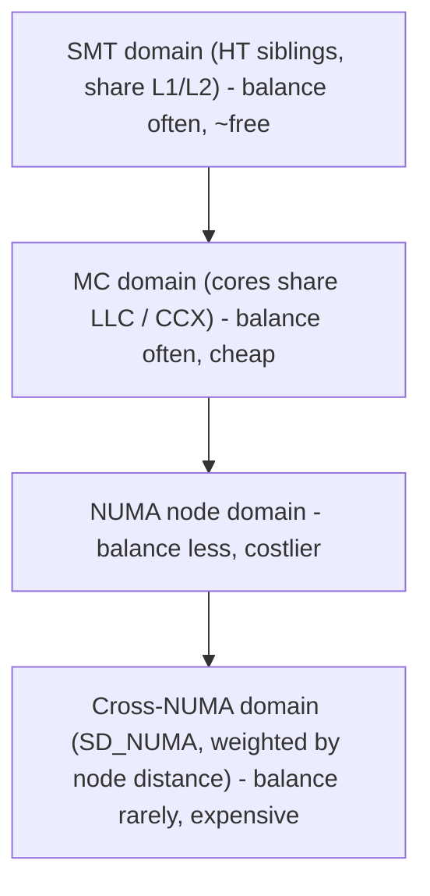
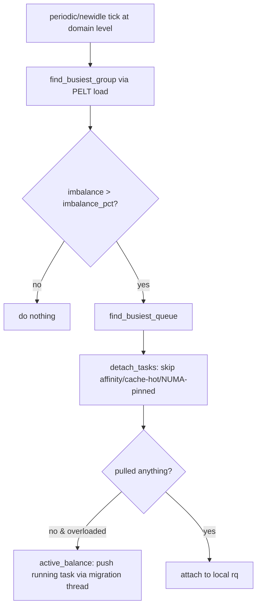

# Q15 — CPU Load Balancing Across Scheduling Domains and NUMA Nodes

> **Subsystem:** Scheduling · **Files:** `kernel/sched/fair.c`, `kernel/sched/topology.c`, `include/linux/sched/topology.h`
> **Interviewer is really probing (AMD favorite):** Do you understand the **topology-aware**
> hierarchy of scheduling domains, **when/how** tasks migrate, and **NUMA-aware** placement costs?

---

## TL;DR Cheat Sheet

- Linux keeps a **per-CPU runqueue**; **load balancing** moves runnable tasks between CPUs so work is
  spread without unnecessary migration (migration is expensive: cold caches, NUMA-remote memory).
- Balancing is **hierarchical** via **scheduling domains (`sched_domain`)** mirroring hardware
  topology: **SMT (hyperthreads) → MC (cores sharing LLC) → NUMA node → cross-NUMA**. Each level has
  its own balancing **interval** and **migration cost threshold**.
- **Key principle:** balance **frequently & cheaply** at low levels (same LLC = cheap migration),
  **rarely & reluctantly** at high levels (cross-NUMA = expensive). Higher levels have larger
  `imbalance_pct` / longer intervals.
- Triggers: **periodic** (`scheduler_tick` → `run_rebalance_domains` softirq), **newidle** (a CPU
  about to go idle pulls work), **fork/exec/wakeup** placement (`select_task_rq_fair` picks a good
  CPU up front), and **active balancing** (push a running task off an overloaded CPU).
- **NUMA balancing (AutoNUMA):** periodically unmaps pages to **sample** which node a task accesses,
  then **migrates pages to the task's node** and/or **the task to its memory's node** to minimize
  remote-memory latency.
- Modern metric: **PELT** (Per-Entity Load Tracking) + **util_est** estimate each task's/CPU's load
  and utilization; **EAS** (Energy-Aware Scheduling) uses it on asymmetric (big.LITTLE) SoCs.

---

## The Question

> How does CPU load balancing work across scheduling domains and NUMA nodes? (Relevant for AMD's
> multi-die/CCX topology and NUMA-aware placement.)

---

## Why load balancing exists (and why it's careful)

Per-CPU runqueues give **scalability** (no global runqueue lock — Q9 philosophy), but they can drift
**out of balance**: one CPU overloaded while others idle. The scheduler must redistribute work — but
**migration is not free**:

- Moving a task to another CPU **cools its caches** (L1/L2, and LLC if crossing an LLC boundary).
- Crossing a **NUMA node** means its memory is now **remote** → higher latency on every access
  (Q1's remote-walk and Q4's node-reclaim concerns).
- Migration takes **runqueue locks** on both CPUs and IPIs.

So balancing is a **cost/benefit** decision that must be **topology-aware**: pulling to a sibling
hyperthread or same-LLC core is cheap and done eagerly; pulling across NUMA nodes is expensive and
done only when the imbalance is large and persistent. That's the entire reason for the **scheduling
domain hierarchy** — it encodes "how expensive is it to move a task across *this* boundary."

---

## When balancing happens

| Trigger | What | Cost bias |
|---------|------|-----------|
| **Periodic** (`run_rebalance_domains`, SCHED_SOFTIRQ) | walk domains, pull from busiest group | per-level interval |
| **Newidle** (`newidle_balance`) | a CPU going idle tries to **pull** work to avoid idling | cheap, latency-driven |
| **Wakeup placement** (`select_task_rq_fair`) | choose the best CPU for a waking task (idle sibling, warm cache) | up-front, avoids later migration |
| **fork/exec** | place new task on a good CPU | up-front |
| **Active balance** | push a long-running task off an overloaded CPU when pull fails | rare, forceful |
| **NUMA balancing** | migrate pages/tasks toward locality | periodic sampling |

---

## Where in the kernel

```
kernel/sched/topology.c   <- builds sched_domain hierarchy from arch topology
kernel/sched/fair.c       <- load_balance(), find_busiest_group(), select_task_rq_fair(),
                             newidle_balance(), task_numa_*() (AutoNUMA), PELT
include/linux/sched/topology.h, sched/sd_flags.h  <- SD_* flags (SD_SHARE_PKG_RESOURCES, SD_NUMA...)
kernel/sched/pelt.c       <- per-entity load tracking
Documentation/scheduler/  <- sched-domains, sched-energy
```

Topology comes from the arch (CPUID/ACPI SRAT/SLIT on x86; device tree / ACPI on ARM) → which CPUs
share SMT, LLC, and which NUMA node each belongs to, plus **node distances** (SLIT) used to weight
remote cost.

---

## How it works — mechanics

### 1. The scheduling-domain hierarchy

Each CPU has a stack of `sched_domain`s from innermost to outermost; each domain groups CPUs into
**`sched_group`s** at that level:

```
CPU0
 └ SMT domain   : {CPU0, CPU1}            (hyperthread siblings; SD_SHARE_CPUCAPACITY)
   └ MC domain  : {CPU0..CPU7}            (cores sharing an LLC / a CCX; SD_SHARE_PKG_RESOURCES)
     └ NUMA dom : {node0 CPUs}            (one NUMA node)
       └ NUMA   : {all nodes}             (cross-socket; SD_NUMA, weighted by node distance)
```

Each level has tunables: **balancing interval** (how often), **`imbalance_pct`** (how lopsided
before acting), and flags (`SD_SHARE_PKG_RESOURCES` = share LLC → cheap; `SD_NUMA` = expensive).
**AMD's CCX/die** structure shows up here: cores in a CCX share an L3, so the **MC domain** boundary
matters — migrating within a CCX is cheap, across CCX/die is costlier (separate L3), across socket
is NUMA-remote.

### 2. The balancing algorithm (`load_balance`)

At each domain level, periodically:
1. **`find_busiest_group()`** — compute each group's load/utilization (via **PELT**), find the
   **busiest** group vs the **local** group.
2. If the imbalance exceeds the level's **`imbalance_pct`**, **`find_busiest_queue()`** picks the
   most-loaded runqueue in that group.
3. **`detach_tasks()`** pulls runnable (not currently-running) tasks from the busiest rq to the
   local rq, respecting **`can_migrate_task`** checks: task **affinity** (`cpus_allowed`), **cache
   hotness** (recently ran → reluctant to move), and **NUMA** preference.
4. If nothing can be pulled but a CPU is clearly overloaded with a **running** task, **active
   balancing** kicks the running task to a less-loaded CPU via the **stop/migration** thread.

### 3. PELT — measuring load fairly

**Per-Entity Load Tracking** decays each task's contribution geometrically over time, so a recently
busy task counts more than one busy long ago. CPU load/util = sum of its entities' PELT signals.
**`util_est`** keeps a running max estimate so a task that periodically spikes is placed on a CPU
with headroom. This avoids balancing on noisy instantaneous load.

### 4. Wakeup placement (`select_task_rq_fair`)

When a task wakes, the scheduler picks a target CPU **before** running it, preferring:
- an **idle** sibling in the same LLC (warm cache, cheap),
- the **previous** CPU (cache affinity) if still suitable,
- spreading to avoid overloading — balanced against keeping it **NUMA-local** to its memory.
Good wakeup placement **prevents** expensive later migrations.

### 5. NUMA balancing (AutoNUMA)

To minimize **remote-memory** latency:
1. Periodically mark some of a task's pages **PROT_NONE** (a "NUMA hint fault" trap).
2. When the task touches one, the fault records **which node** accessed it → builds per-task,
   per-node access stats.
3. Over time, **migrate pages** to the node the task runs on, and/or **migrate the task** to the
   node holding most of its memory (and group related tasks via **NUMA grouping**).
Net effect: tasks and their memory **converge onto the same node**, cutting remote accesses. Tunable
via `numa_balancing` sysctl; can hurt if mis-tuned (migration overhead, false sharing).

### 6. Energy-Aware Scheduling (asymmetric SoCs)

On **big.LITTLE / DynamIQ** (Qualcomm), CPUs have different capacities. **EAS** uses PELT util + an
**energy model** to place tasks on the **most energy-efficient** CPU that still meets performance —
small tasks on LITTLE, heavy tasks on big — instead of pure load spreading.

---

## Diagrams

### Domain hierarchy & balancing cost



### load_balance flow



---

## Annotated C

```c
/* A scheduling domain level: groups + tunables + flags. */
struct sched_domain {
    struct sched_domain *parent;     /* next level up (e.g. MC -> NUMA) */
    struct sched_group  *groups;     /* balancing groups at this level */
    unsigned long min_interval, max_interval; /* balance frequency */
    unsigned int  imbalance_pct;     /* how lopsided before we act (bigger at higher levels) */
    int           flags;             /* SD_SHARE_PKG_RESOURCES, SD_NUMA, SD_SHARE_CPUCAPACITY */
    unsigned long last_balance;
};

/* Whether a task may be pulled to dst CPU during balancing. */
static int can_migrate_task(struct task_struct *p, struct lb_env *env) {
    if (!cpumask_test_cpu(env->dst_cpu, p->cpus_ptr)) return 0; /* affinity */
    if (task_running(env->src_rq, p))                 return 0; /* don't move the current task */
    if (task_hot(p, env) && !env->sd->nr_balance_failed) return 0; /* cache-hot: reluctant */
    return 1;
}

/* PELT util drives placement; util_est tracks periodic peaks. */
unsigned long cpu_util = READ_ONCE(rq->cfs.avg.util_avg);
```

> Senior nuance: **migration cost is the whole game.** The hierarchy exists so the scheduler is
> **eager** to balance where caches/memory are shared (SMT/LLC) and **reluctant** where moving a task
> strands it from its **warm cache and local memory** (cross-NUMA). AMD's CCX/die L3 boundaries make
> the **MC-level** decisions especially impactful.

---

## Company Angle

- **AMD (the headline):** multi-**CCX**/multi-die topology — each CCX has its own L3; the scheduler's
  **MC domain** and **NUMA** layout determine whether migration costs an L3 reload or a remote-memory
  hop. Discuss `SD_SHARE_PKG_RESOURCES`, node distances (SLIT), and keeping tasks within a CCX/node.
- **Google (scale/containers):** balancing interacting with **cgroup cpusets**, NUMA-aware placement
  for big services, and avoiding migration-induced tail latency; `sched_domain` tuning at fleet scale.
- **Qualcomm (mobile):** **EAS** on big.LITTLE/DynamIQ — energy-vs-performance placement, capacity-
  aware scheduling, and avoiding waking big cores unnecessarily.
- **NVIDIA (RT/throughput):** isolating CPUs (`isolcpus`, `nohz_full`) for latency-critical work,
  IRQ + task affinity co-placement, and avoiding cross-NUMA migration of GPU-feeding threads.

---

## War Story

*"On a dual-socket AMD box, a memory-bound analytics workload underperformed versus a single socket.
`numastat` showed huge **remote memory access** counts — the load balancer was spreading worker
threads across **both NUMA nodes** for 'fairness', but each thread's data lived on the node where it
first allocated. Every balance migrated a thread away from its memory, turning local accesses into
remote ones. Two fixes: (1) **bind** each worker + its memory to a node (`numactl --cpunodebind
--membind`, or cpusets) so the balancer couldn't strand threads from their data; (2) where binding
was too rigid, rely on **AutoNUMA** (`numa_balancing=1`) to converge threads and pages onto the same
node. Throughput jumped and remote accesses fell sharply. The interviewer's follow-up — *'why not let
the balancer spread for max CPU utilization?'* — let me explain that for **memory-bound** work,
**locality beats utilization**: an idle remote core is worse than a busy local one."*

---

## Interviewer Follow-ups

1. **Why per-CPU runqueues + balancing instead of one global runqueue?** Global runqueue = one hot
   lock (Q9). Per-CPU scales; balancing redistributes work periodically without that contention.

2. **What's a scheduling domain?** A topology level (SMT/MC/NUMA) grouping CPUs, with its own balance
   interval and imbalance threshold — encodes migration cost per boundary.

3. **Why balance more at low levels?** Migration within shared L1/L2/LLC is cheap (warm caches);
   cross-NUMA strands a task from its memory, so it's done rarely and only for large imbalances.

4. **What is PELT?** Per-Entity Load Tracking: geometrically-decayed per-task load/util used to make
   balancing/placement decisions on smoothed (not instantaneous) signals.

5. **Wakeup placement goal?** Put a waking task on an idle, cache-warm, NUMA-local CPU up front to
   avoid expensive migration later (`select_task_rq_fair`).

6. **How does AutoNUMA work?** Samples accesses via NUMA hint faults, then migrates pages to the
   task's node and/or the task to its memory's node to reduce remote accesses.

7. **What is active balancing?** When the busiest CPU's load is in a **currently-running** task that
   can't be pulled, the migration/stop thread **pushes** it to a less-loaded CPU.

8. **EAS — when and why?** On asymmetric CPUs (big.LITTLE), place tasks for **energy efficiency**
   using an energy model + util, not pure load spreading.

9. **How does AMD CCX topology affect this?** Cores in a CCX share L3; crossing CCX/die loses L3
   warmth and may be NUMA-remote — the MC/NUMA domains capture that so the scheduler keeps tasks
   within a CCX/node when possible.

---

## 30-Minute Talk Track

| Min | Cover |
|-----|-------|
| 0–3 | Per-CPU runqueues → drift → need balancing; migration is expensive |
| 3–8 | Scheduling-domain hierarchy: SMT/MC/NUMA, flags, per-level intervals/imbalance |
| 8–12 | AMD CCX/die L3 boundaries, NUMA distances (SLIT), cost gradient |
| 12–17 | load_balance: find_busiest_group/queue, can_migrate (affinity/hot/NUMA), active balance |
| 17–20 | PELT/util_est: smoothed load; wakeup placement select_task_rq_fair |
| 20–25 | NUMA balancing (AutoNUMA): hint faults, page/task migration, grouping |
| 25–28 | EAS on asymmetric SoCs; isolation (isolcpus/nohz_full) |
| 28–30 | War story (dual-socket locality) + "locality beats utilization" |
