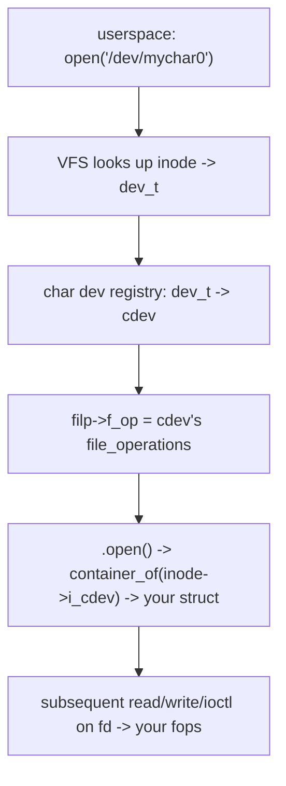

# Q17 — Writing a Character Device Driver

> **Subsystem:** Drivers · **Files:** `fs/char_dev.c`, `include/linux/cdev.h`, `include/linux/fs.h`, `drivers/char/`
> **Interviewer is really probing:** Do you know the **char-device plumbing** end to end —
> major/minor, `cdev`, `file_operations`, `ioctl`, and **safe user/kernel data transfer**?

---

## TL;DR Cheat Sheet

- A **character device** presents a **byte-stream** interface (`read`/`write`/`ioctl`) via a node in
  `/dev`, unlike block devices (random-access, page-cache-backed).
- **Major number** identifies the **driver**; **minor number** identifies a specific **device
  instance** the driver manages. A `dev_t` packs both (`MAJOR()/MINOR()/MKDEV()`).
- Registration steps: **`alloc_chrdev_region()`** (get major+minor range) → **`cdev_init()`** with
  your **`file_operations`** → **`cdev_add()`** (bind cdev to the dev_t range) → create the
  `/dev` node (usually via a **`class`** + `device_create()` so **udev** makes it automatically).
- **`file_operations`** is the vtable: `.open`, `.release`, `.read`, `.write`, `.unlocked_ioctl`,
  `.mmap`, `.poll`, `.llseek`. The kernel routes syscalls on the fd to these.
- **Never** dereference a user pointer directly — use **`copy_to_user()`/`copy_from_user()`** (they
  validate and handle faults). For `ioctl`, validate `cmd`/size and use `_IOR/_IOW/_IORW` encodings.
- **Concurrency:** multiple processes can open the same device → protect shared state with a
  **mutex** (process context, can sleep). Use **`container_of`** to get your device struct from the
  embedded `cdev`/`inode`.
- Modern best practice: **`devm_`**-managed resources and a proper **driver model** binding
  (platform/PCI) rather than hand-rolled init/exit (ties to Q19/Q20).

---

## The Question

> Walk through writing a character device driver — `file_operations`, `cdev`, major/minor numbers,
> and `ioctl`.

---

## Why character devices work this way

Linux exposes devices to userspace through the **filesystem namespace** (`/dev/...`) so that the
**uniform `open/read/write/close` interface** applies to hardware too ("everything is a file"). A
**character device** is the abstraction for hardware best modeled as a **stream or a control
surface** (serial ports, sensors, GPUs' control nodes, `/dev/null`, RNG) — as opposed to **block
devices** (disks: random-access, buffered through the page cache).

The **major/minor** scheme exists so the kernel can route an operation on a `/dev` node to the right
**driver** (major) and the right **instance** (minor) — e.g. major = "my UART driver", minor = "port
0/1/2". The **`cdev`** object is the kernel's binding between a **`dev_t` range** and a
**`file_operations`** table; when a process opens `/dev/foo`, the VFS looks up the inode's `dev_t`,
finds the matching `cdev`, and wires the open file's `f_op` to your handlers.

The **user/kernel boundary** discipline (`copy_to_user`, ioctl encodings) exists because a driver
runs in **privileged kernel context** acting on **untrusted user input** — dereferencing a raw user
pointer would be an **OWASP-class** security hole (arbitrary kernel read/write) and can fault
(Q13). The accessor functions enforce the boundary safely.

---

## When to write a char driver (vs alternatives)

- **Char device:** stream/control interface, custom `ioctl`s, simple byte I/O, memory-mapped
  registers via `.mmap` — sensors, custom accelerators, tty-like devices, misc control nodes.
- **`misc` device** (`miscdevice`): a **single-instance** char device with an **auto-assigned**
  minor under major 10 — less boilerplate; ideal for one-off control nodes.
- **Block device:** if it's a randomly-addressable storage medium needing the page cache/IO
  scheduler.
- **Other subsystems:** prefer an existing framework (IIO for sensors, V4L2 for video, input, hwmon)
  over a raw char device when one fits — you get standard userspace tooling for free. (Worth saying
  in an interview: "I'd check if a subsystem already models this before writing a raw char dev.")

---

## Where in the kernel

```
include/linux/fs.h        <- struct file_operations, struct file, struct inode
include/linux/cdev.h      <- struct cdev, cdev_init/add/del
fs/char_dev.c             <- alloc_chrdev_region, register_chrdev_region, cdev registry
include/linux/uaccess.h   <- copy_to_user / copy_from_user / get_user / put_user
include/uapi/asm-generic/ioctl.h <- _IO/_IOR/_IOW/_IOWR encoding macros
drivers/char/, drivers/misc/  <- examples; misc device = include/linux/miscdevice.h
```

---

## How to build one — step by step

### 1. Reserve a device number range

```c
dev_t devno;
alloc_chrdev_region(&devno, 0 /*first minor*/, NR_DEVS, "mychar"); /* dynamic major */
int major = MAJOR(devno);
```
`alloc_chrdev_region` asks the kernel to **allocate a free major** and a contiguous minor range —
preferred over hard-coding a major (`register_chrdev_region`) which can collide.

### 2. Define `file_operations`

```c
static const struct file_operations my_fops = {
    .owner          = THIS_MODULE,
    .open           = my_open,
    .release        = my_release,
    .read           = my_read,
    .write          = my_write,
    .unlocked_ioctl = my_ioctl,   /* modern ioctl entry (BKL-free) */
    .compat_ioctl   = my_ioctl,   /* 32-bit userspace on 64-bit kernel */
    .llseek         = no_llseek,
};
```

### 3. Register the `cdev`

```c
struct my_dev { struct cdev cdev; struct mutex lock; char *buf; size_t len; };
cdev_init(&dev->cdev, &my_fops);
dev->cdev.owner = THIS_MODULE;
cdev_add(&dev->cdev, devno, 1);   /* bind this cdev to dev_t 'devno' (1 minor) */
```

### 4. Create the `/dev` node (so udev makes it automatically)

```c
struct class *cls = class_create("mychar");
device_create(cls, NULL, devno, NULL, "mychar%d", 0); /* -> /dev/mychar0 via udev */
```
Without this you'd manually `mknod`; the **class + device_create** path lets **udev** create and set
permissions on the node automatically.

### 5. Implement the operations (with safe transfer)

```c
static int my_open(struct inode *inode, struct file *filp) {
    /* recover our device struct from the embedded cdev */
    struct my_dev *dev = container_of(inode->i_cdev, struct my_dev, cdev);
    filp->private_data = dev;       /* stash for read/write/ioctl */
    return 0;
}

static ssize_t my_read(struct file *filp, char __user *ubuf, size_t cnt, loff_t *ppos) {
    struct my_dev *dev = filp->private_data;
    ssize_t ret;
    mutex_lock(&dev->lock);                       /* process context: may sleep */
    if (*ppos >= dev->len) { ret = 0; goto out; } /* EOF */
    cnt = min(cnt, dev->len - *ppos);
    if (copy_to_user(ubuf, dev->buf + *ppos, cnt)) { ret = -EFAULT; goto out; }
    *ppos += cnt; ret = cnt;
out:
    mutex_unlock(&dev->lock);
    return ret;
}
```
Note: **`__user`** annotates user pointers (sparse-checked); `copy_to_user` returns the number of
**uncopied** bytes (0 = success), and handles page faults safely — which is exactly why you can't
do this from atomic context (Q13).

### 6. `ioctl` — the control channel

`ioctl` is for **out-of-band control** that doesn't fit read/write (configure, query, trigger). Use
the **encoding macros** so the command number carries **direction and size**:

```c
#define MYC_MAGIC 'k'
#define MYC_RESET      _IO(MYC_MAGIC, 0)              /* no data */
#define MYC_SET_CFG    _IOW(MYC_MAGIC, 1, struct cfg) /* userspace -> kernel */
#define MYC_GET_STATUS _IOR(MYC_MAGIC, 2, struct st)  /* kernel -> userspace */

static long my_ioctl(struct file *filp, unsigned int cmd, unsigned long arg) {
    struct my_dev *dev = filp->private_data;
    if (_IOC_TYPE(cmd) != MYC_MAGIC) return -ENOTTY;  /* validate magic */
    switch (cmd) {
    case MYC_RESET:
        reset_hw(dev); return 0;
    case MYC_SET_CFG: {
        struct cfg c;
        if (copy_from_user(&c, (void __user *)arg, sizeof c)) return -EFAULT;
        return apply_cfg(dev, &c);     /* validate ranges before using! */
    }
    case MYC_GET_STATUS: {
        struct st s; read_status(dev, &s);
        if (copy_to_user((void __user *)arg, &s, sizeof s)) return -EFAULT;
        return 0;
    }
    default: return -ENOTTY;            /* unknown ioctl -> classic errno */
    }
}
```
**Security must-dos:** validate the **magic/number/size** (`_IOC_*`), **bounds-check** every field
from userspace, and never trust sizes/offsets — ioctl is a notorious source of kernel CVEs.

### 7. Teardown

```c
device_destroy(cls, devno); class_destroy(cls);
cdev_del(&dev->cdev);
unregister_chrdev_region(devno, NR_DEVS);
```
(With `devm_`/driver-model binding, much of this is automatic — see Q20.)

---

## Diagrams

### open() path: fd → your handler



### major/minor routing

```
/dev/mychar0  (c, major=240, minor=0) ─┐
/dev/mychar1  (c, major=240, minor=1) ─┼─► major 240 -> "mychar" driver
/dev/mychar2  (c, major=240, minor=2) ─┘     minor -> which instance
```

---

## Annotated C — the core structs

```c
struct cdev {                 /* binds a dev_t range to file_operations */
    struct kobject kobj;
    struct module *owner;
    const struct file_operations *ops;
    dev_t dev;                /* first dev_t */
    unsigned int count;       /* number of minors */
};

struct file_operations {      /* the syscall vtable for an open fd */
    struct module *owner;
    ssize_t (*read)(struct file *, char __user *, size_t, loff_t *);
    ssize_t (*write)(struct file *, const char __user *, size_t, loff_t *);
    long    (*unlocked_ioctl)(struct file *, unsigned int, unsigned long);
    int     (*mmap)(struct file *, struct vm_area_struct *);
    __poll_t (*poll)(struct file *, struct poll_table_struct *);
    int     (*open)(struct inode *, struct file *);
    int     (*release)(struct inode *, struct file *);
};
```

> Idiom to name-drop: **`container_of(ptr, type, member)`** — recovers your device struct from an
> embedded kernel object (the `cdev` inside your struct, given `inode->i_cdev`). It's how Linux does
> "OO" without language support and appears all over the device model (Q20).

---

## Company Angle

- **Qualcomm/NVIDIA (SoC/GPU):** real drivers bind through the **platform/PCI driver model** with a
  **`probe()`** that sets up the char/misc node (ties to Q19/Q20), use **`devm_`** managed
  resources, and expose `ioctl`/`mmap` for control + memory mapping of device buffers. GPU drivers
  use char nodes (`/dev/dri/*`) with rich ioctl ABIs (DRM).
- **Google (security/ABI):** ioctl as an **attack surface** — strict validation, stable UAPI,
  `compat_ioctl` for 32-bit, and seccomp/permission considerations.
- **All:** `poll`/`epoll` support for event-driven userspace; correct concurrency (mutex) for
  multi-open.

---

## War Story

*"A custom accelerator's char driver passed an **ioctl** struct containing a userspace **length**
and **offset** that the driver used to index a kernel buffer — without bounds-checking. A fuzzer
(syzkaller-style) sent a huge offset and triggered an **out-of-bounds kernel write** — a serious
privilege-escalation primitive. The fix: validate `_IOC_TYPE`/`_IOC_SIZE`, **clamp/verify** every
field (`offset + len <= buf_size`, no integer overflow), and `copy_from_user` into a kernel struct
*before* validation rather than reading user memory piecemeal. I also added the ioctl to our
fuzzing harness. The interviewer's takeaway: **ioctl handlers run privileged on untrusted input —
treat every field as hostile**, which is exactly the OWASP 'input validation at trust boundary'
principle applied to the kernel."*

---

## Interviewer Follow-ups

1. **Major vs minor?** Major selects the **driver**; minor selects the **instance** the driver
   manages; `dev_t` packs both.

2. **Why `cdev_add` and what does it bind?** It registers your `cdev` (which holds your
   `file_operations`) for a `dev_t` range, so opens of those nodes route to your fops.

3. **Why never deref a user pointer directly?** It may be invalid/hostile or paged out — use
   `copy_to/from_user` which validate access and handle faults; direct deref = security hole + can
   sleep/fault.

4. **What do `_IOR/_IOW/_IOWR` encode?** Direction, a magic type, a command number, and the **size**
   of the argument — letting the kernel sanity-check the ioctl.

5. **`unlocked_ioctl` vs old `ioctl`?** `unlocked_ioctl` runs **without the Big Kernel Lock**; the
   driver does its own locking. `compat_ioctl` handles 32-bit userspace on 64-bit kernels.

6. **How do you get your device struct in `read`?** `filp->private_data` (set in `open`) or
   `container_of(inode->i_cdev, struct my_dev, cdev)`.

7. **How to support `select/poll/epoll`?** Implement `.poll`, return readiness masks, and
   `poll_wait()` on a wait queue you wake when data arrives.

8. **misc device — when?** Single-instance control node; `misc_register()` auto-assigns a minor
   under major 10 — less boilerplate than full char registration.

9. **How is `/dev/foo` created automatically?** `class_create` + `device_create` emit a uevent;
   **udev** creates the node with configured permissions.

---

## 30-Minute Talk Track

| Min | Cover |
|-----|-------|
| 0–3 | Char vs block; "everything is a file"; major/minor routing rationale |
| 3–7 | dev_t allocation: alloc_chrdev_region vs register; dynamic major |
| 7–11 | file_operations vtable; cdev_init/cdev_add binding; open() routing |
| 11–15 | class_create/device_create + udev node creation; misc device alternative |
| 15–19 | read/write: container_of, private_data, copy_to/from_user, EOF/locking |
| 19–24 | ioctl: _IOR/_IOW encodings, validation, compat_ioctl, security |
| 24–27 | poll/mmap, concurrency (mutex, multi-open), devm/driver-model binding |
| 27–30 | War story (ioctl bounds-check CVE) + security summary |
