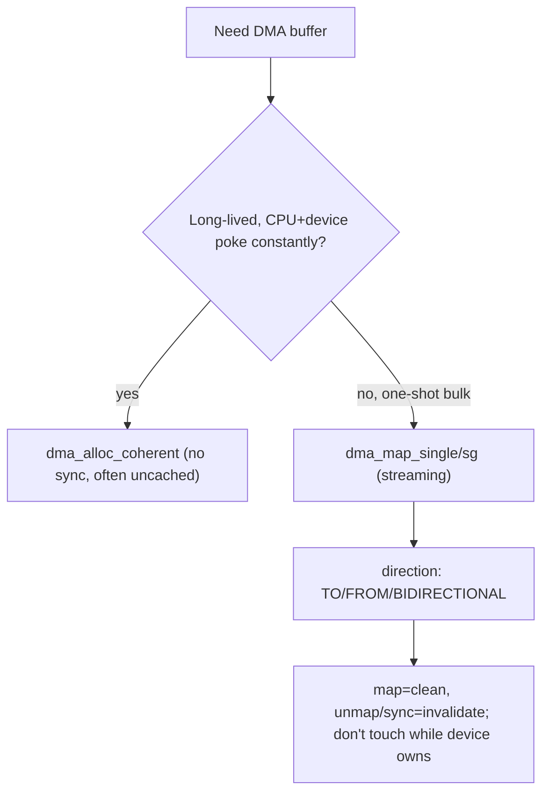
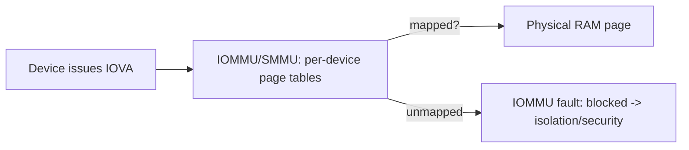

# Q18 — DMA in Linux: Coherent vs Streaming, IOMMU, and Cache Coherency

> **Subsystem:** Drivers/DMA · **Files:** `kernel/dma/`, `drivers/iommu/`, `include/linux/dma-mapping.h`
> **Interviewer is really probing (Qualcomm/NVIDIA favorite):** Do you understand **device-visible
> addresses**, **cache-coherency** hazards, the **DMA API**, the **IOMMU/SMMU**, and **bounce buffers**?

---

## TL;DR Cheat Sheet

- **DMA** = a device reads/writes **system memory directly**, without the CPU copying byte-by-byte.
  The device uses a **DMA address** (a.k.a. bus/IOVA address), which **may differ** from the CPU
  **physical** address — translation done by an **IOMMU/SMMU** if present.
- **Two flavors of the DMA API:**
  - **Coherent / consistent** (`dma_alloc_coherent`): a buffer that's **always in sync** between CPU
    and device (no explicit cache management). Best for **long-lived shared structures** like
    descriptor rings. Often uncached/write-combining → slower CPU access.
  - **Streaming** (`dma_map_single`/`dma_map_sg`): map **existing** memory for a **single DMA
    transfer**; you must **`dma_sync_*`** / unmap to manage cache and ownership. Best for **one-shot
    bulk data** (packets, disk blocks).
- **Cache coherency hazard:** on **non-coherent** architectures (many ARM SoCs), the CPU's caches
  and the device see **different** views unless you flush/invalidate. The DMA API hides this via
  **direction** (`DMA_TO_DEVICE`, `DMA_FROM_DEVICE`, `DMA_BIDIRECTIONAL`) and `dma_sync_*`.
- **IOMMU/SMMU:** an MMU **for devices** — translates **IOVA → physical**, enabling scatter-gather as
  one contiguous IOVA, **isolation/protection** (a device can only touch memory mapped for it), and
  letting 32-bit devices reach high memory.
- **Bounce buffers (SWIOTLB):** when a device **can't address** a buffer (DMA mask too small) and
  there's no IOMMU, the kernel **copies** through a low-memory bounce buffer.
- **`dma_set_mask_and_coherent()`** declares how many address bits the device supports — get this
  wrong and you get silent corruption or bounce overhead.

---

## The Question

> Explain DMA in Linux: coherent vs streaming DMA, `dma_map_single`, the IOMMU, and cache coherency
> issues. Discuss `dma_alloc_coherent`, SMMU, bounce buffers, and `dma_sync_*`.

---

## Why the DMA API exists

Letting a device write memory directly is essential for performance (NICs, GPUs, NVMe move
gigabytes/s; the CPU can't memcpy that). But it creates three hard problems that the **DMA API**
abstracts so drivers stay **portable** across wildly different platforms:

1. **Addressing.** The device doesn't use CPU virtual addresses, and not always CPU **physical**
   addresses either. With an **IOMMU**, the device uses an **IOVA** that the IOMMU translates. A
   driver must obtain the correct **device-visible address** (`dma_addr_t`) — never just pass a
   `kmalloc` pointer or (worse) a `vmalloc` pointer (Q3).

2. **Cache coherency.** On x86 DMA is **coherent** (hardware snoops caches). On many **ARM** SoCs it
   is **not** — if the CPU wrote data that's still in its **write-back cache**, the device DMAs
   **stale memory**; if the device wrote memory, the CPU may read a **stale cache line**. Someone must
   **flush** (clean) or **invalidate** caches at the right moments.

3. **Addressability limits & isolation.** A 32-bit device can't reach memory above 4 GiB; a
   malfunctioning/malicious device could scribble anywhere. The IOMMU and bounce buffers solve these.

The DMA API encodes all this behind a small set of calls + a **direction** argument, so the **same
driver** works on a coherent x86, a non-coherent ARM SoC, with or without an IOMMU.

---

## When to use coherent vs streaming

| Use **coherent** (`dma_alloc_coherent`) | Use **streaming** (`dma_map_*`) |
|----------------------------------------|---------------------------------|
| Long-lived, frequently CPU+device touched | One-shot transfer of existing data |
| Descriptor/command rings, doorbell-adjacent state | Network packets, disk blocks, bulk payloads |
| Need no explicit sync each access | OK to manage ownership per transfer |
| Cost: often uncached → slower CPU reads | Cost: must `dma_map`/`unmap`/`sync` each time |

Rule: *"Control structures the device and CPU poke constantly → coherent. Big data buffers used once
per transfer → streaming (cheaper, cacheable, but you must sync/unmap)."*

---

## Where in the kernel

```
include/linux/dma-mapping.h   <- dma_alloc_coherent, dma_map_single/sg, dma_sync_*, dma_set_mask
kernel/dma/                   <- dma-direct, swiotlb (bounce buffers), dma-mapping core
kernel/dma/swiotlb.c          <- software IO TLB / bounce buffers
drivers/iommu/                <- IOMMU/SMMU drivers (arm-smmu-v3.c, intel/, amd/), iommu-dma.c
include/linux/iommu.h
Device's dma_mask / coherent_dma_mask in struct device
```

---

## How DMA works — mechanics

### The address triangle

```
CPU virtual ──(MMU/page tables, Q1)──► CPU physical ──(IOMMU/SMMU, if any)──► device IOVA
Driver gets a dma_addr_t (IOVA or physical) to program into the device's DMA engine.
```
`dma_addr_t` is **the address you give the device**, returned by the mapping calls. It is **not** a
CPU pointer.

### Coherent mapping

```c
void *cpu = dma_alloc_coherent(dev, size, &dma_handle, GFP_KERNEL);
/* cpu      = CPU virtual address to access the buffer
 * dma_handle = device-visible (DMA) address to program into the device
 * Always coherent: writes by either side are visible to the other without dma_sync. */
... use ring ...
dma_free_coherent(dev, size, cpu, dma_handle);
```
The kernel allocates **physically contiguous** memory (or IOMMU-contiguous IOVA) and sets up mappings
(often **uncached/write-combining** on non-coherent platforms) so **no manual cache ops** are needed.
Ideal for a **descriptor ring** the device polls and the CPU updates continuously.

### Streaming mapping + the ownership model

```c
dma_addr_t da = dma_map_single(dev, buf, len, DMA_TO_DEVICE); /* CPU -> device */
if (dma_mapping_error(dev, da)) { /* handle */ }
/* OWNERSHIP NOW BELONGS TO THE DEVICE: do NOT touch buf via CPU until unmapped/synced. */
program_device_dma(dev, da, len);
... device transfers ...
dma_unmap_single(dev, da, len, DMA_TO_DEVICE);  /* ownership back to CPU; cache managed */
```
The **direction** tells the kernel which cache op to do and when:
- `DMA_TO_DEVICE`: on **map**, **clean/flush** CPU caches so the device sees current data.
- `DMA_FROM_DEVICE`: on **unmap/sync**, **invalidate** CPU caches so the CPU re-reads device-written
  data, not stale lines.
- `DMA_BIDIRECTIONAL`: both (most expensive).

If you need to touch the buffer **between** map and unmap, use the sync calls to transfer ownership
temporarily:
```c
dma_sync_single_for_cpu(dev, da, len, DMA_FROM_DEVICE);   /* invalidate -> CPU can read */
inspect(buf);
dma_sync_single_for_device(dev, da, len, DMA_TO_DEVICE);  /* clean -> hand back to device */
```
**The classic bug:** writing to a streaming buffer **while the device owns it** (after map, before
unmap) → on non-coherent HW the device DMAs stale data or your CPU read is stale. The
**for_cpu/for_device** dance is exactly how you avoid it.

### Scatter-gather

Large buffers are often **physically scattered** (e.g. user pages, `vmalloc`). `dma_map_sg()` maps a
**scatterlist** of segments; **with an IOMMU** these can be coalesced into **one contiguous IOVA**
(big win — the device sees one range). Without an IOMMU, each segment keeps its own address.

### IOMMU / SMMU — the device-side MMU

An **IOMMU** (x86: Intel VT-d / AMD-Vi; ARM: **SMMU**) translates **IOVA → physical** using
device-specific page tables, providing:
- **Contiguity:** scattered physical pages appear contiguous to the device (simplifies SG).
- **Isolation/protection:** a device can only access memory **explicitly mapped** for it → a buggy
  or malicious device (or VM passthrough) **can't corrupt arbitrary RAM** — critical for security and
  virtualization (VFIO passthrough).
- **Addressability:** a 32-bit device can be given low IOVAs that map to high physical memory.
- Cost: IOTLB misses (IOMMU page walks), map/unmap overhead; mitigated by **IOVA caching** and large
  pages. On ARM, **`iommus`** in **device tree** (Q19) binds a device to its SMMU stream ID.

### Bounce buffers (SWIOTLB)

When there's **no IOMMU** and the device's **DMA mask** can't reach a buffer's physical address (e.g.
32-bit device, buffer above 4 GiB), the kernel uses **SWIOTLB**: allocate a buffer in
**device-addressable** low memory, **copy** data through it (`bounce`), and DMA to/from that. Correct
but adds a **memcpy** per transfer → a performance gotcha. Also used by **confidential computing**
(encrypted-memory VMs) to bounce through shared pages.

### Declaring device capability

```c
dma_set_mask_and_coherent(dev, DMA_BIT_MASK(64)); /* device can address 64-bit */
```
Get this wrong (claim 64-bit on a 32-bit-limited device) → **silent corruption**; claim too little →
needless bouncing. The mask drives whether the IOMMU/SWIOTLB path is taken.

---

## Diagrams

### Coherent vs streaming decision



### Non-coherent ownership timeline (streaming, DMA_FROM_DEVICE)

```
CPU:    .......(must NOT read buf)............ dma_sync_for_cpu(invalidate) -> read OK
map ───────────────────────────► device DMAs into memory ──► unmap/sync
Device:        owns buffer, writes memory
```

### IOMMU translation + isolation



---

## Annotated C

```c
/* 1) Declare addressing capability (drives IOMMU/SWIOTLB choice). */
if (dma_set_mask_and_coherent(dev, DMA_BIT_MASK(64)))
    dma_set_mask_and_coherent(dev, DMA_BIT_MASK(32));   /* fallback */

/* 2) Coherent ring (no manual cache ops). */
ring->cpu = dma_alloc_coherent(dev, RING_BYTES, &ring->dma, GFP_KERNEL);

/* 3) Streaming map of a packet for TX. */
dma_addr_t da = dma_map_single(dev, skb->data, skb->len, DMA_TO_DEVICE);
if (dma_mapping_error(dev, da)) return -ENOMEM;
desc->addr = cpu_to_le64(da);
dma_wmb();                       /* ensure descriptor writes land before doorbell (Q8) */
writel(1, dev->regs + DOORBELL); /* tell device to go */
/* ... on TX completion IRQ: */
dma_unmap_single(dev, da, skb->len, DMA_TO_DEVICE);

/* 4) Scatter-gather (IOMMU may coalesce to one IOVA). */
int n = dma_map_sg(dev, sglist, nents, DMA_FROM_DEVICE);
for_each_sg(sglist, sg, n, i)
    program_segment(dev, sg_dma_address(sg), sg_dma_len(sg));
/* ... after transfer ... */
dma_unmap_sg(dev, sglist, nents, DMA_FROM_DEVICE);
```

> Two senior gotchas to state explicitly: (1) **never `dma_map_single` a `vmalloc` buffer** (not
> physically contiguous — Q3); use `dma_map_sg` per-page or a coherent alloc. (2) **DMA ordering ≠
> SMP ordering**: use `dma_wmb()`/`writel` ordering for the **descriptor-then-doorbell** sequence
> (Q8), not `smp_wmb()`.

---

## Company Angle

- **Qualcomm (SMMU/non-coherent):** the **headline** — ARM SoCs are often **non-coherent**, so
  `dma_sync_*` correctness and `DMA_*` direction are make-or-break; **SMMU** stream IDs bound via
  **device tree `iommus`** (Q19); per-device isolation; `dma-ranges`/`dma-coherent` DT properties.
- **NVIDIA (GPU/large transfers):** huge DMA buffers, scatter-gather, IOMMU coalescing, pinned user
  memory (`pin_user_pages`, Q5), peer-to-peer DMA, and IOTLB pressure → huge pages for device memory.
- **AMD (IOMMU/virtualization):** AMD-Vi/VT-d, **VFIO** device passthrough relying on IOMMU
  isolation, addressing masks, and coherency across sockets.
- **Google (security/cloud):** IOMMU isolation for untrusted devices/passthrough; SWIOTLB bounce in
  **confidential VMs** (encrypted memory) — a current, relevant topic.

---

## War Story

*"On an ARM SoC, a network driver worked on our coherent x86 dev board but **dropped/corrupted
received packets** on the real **non-coherent** SoC. The RX path used **streaming** `dma_map_single`
with `DMA_FROM_DEVICE`, but the driver read `skb->data` **before** calling
`dma_unmap_single`/`dma_sync_single_for_cpu` — so the CPU read **stale cache lines** instead of the
data the device had just DMAed into RAM. On x86 hardware snooping hid the bug; on ARM there was no
snoop. The fix: respect the **ownership model** — only touch the buffer **after**
`dma_sync_single_for_cpu(..., DMA_FROM_DEVICE)` (which **invalidates** the CPU cache) or after
`dma_unmap`. I also audited the TX path to ensure we didn't modify buffers after `dma_map`
(`DMA_TO_DEVICE`) until completion. The interviewer's point: **the DMA API's direction + sync calls
ARE the cache-coherency protocol** — skip them and you get the classic 'works on x86, fails on ARM'
bug."*

---

## Interviewer Follow-ups

1. **Coherent vs streaming?** Coherent = persistent, always-in-sync, no manual cache ops (rings);
   streaming = map existing memory per transfer, manage ownership/cache via direction + sync (bulk
   data).

2. **What is `dma_addr_t`?** The **device-visible** address (IOVA or physical) to program into the
   device — not a CPU pointer; obtained from the mapping calls.

3. **Why cache-coherency issues on ARM but not x86?** x86 DMA snoops CPU caches (coherent); many ARM
   SoCs don't, so CPU caches and device memory diverge unless you flush/invalidate via `dma_sync_*`.

4. **What does the DMA direction control?** Which cache operation happens and when (clean on map for
   TO_DEVICE, invalidate on unmap/sync for FROM_DEVICE), and validates access.

5. **What does an IOMMU/SMMU give you?** IOVA→phys translation (SG coalescing), **isolation/protection**
   (device only touches mapped memory), and addressability for limited devices; cost = IOTLB
   misses/map overhead.

6. **What's a bounce buffer (SWIOTLB) and when?** A low-memory staging buffer the kernel copies
   through when a device can't address the real buffer and there's no IOMMU (or for encrypted-memory
   VMs). Adds a memcpy.

7. **Why is `dma_set_mask` important?** It declares addressable bits; wrong value → corruption or
   needless bouncing; drives IOMMU/SWIOTLB decisions.

8. **Can you `dma_map_single` a `vmalloc` buffer?** No — it's physically scattered; use `dma_map_sg`
   or a coherent allocation (ties to Q3).

9. **Descriptor-then-doorbell ordering — which barrier?** `dma_wmb()` (and `writel` ordering), not
   `smp_wmb()` — DMA/device ordering differs from CPU-CPU ordering (Q8).

---

## 30-Minute Talk Track

| Min | Cover |
|-----|-------|
| 0–3 | Why DMA + why an API: addressing, coherency, addressability/isolation |
| 3–7 | Address triangle: virtual→physical→IOVA; dma_addr_t is device-visible |
| 7–12 | Coherent mapping: dma_alloc_coherent, rings, uncached cost |
| 12–18 | Streaming: dma_map_single/sg, direction, ownership model, dma_sync_* |
| 18–22 | Cache-coherency hazard on ARM; the for_cpu/for_device dance; the classic bug |
| 22–26 | IOMMU/SMMU: translation, SG coalescing, isolation, IOTLB; SWIOTLB bounce |
| 26–28 | dma_set_mask; DMA ordering (dma_wmb, doorbell); vmalloc pitfall |
| 28–30 | War story (non-coherent RX) + "the API is the coherency protocol" |
