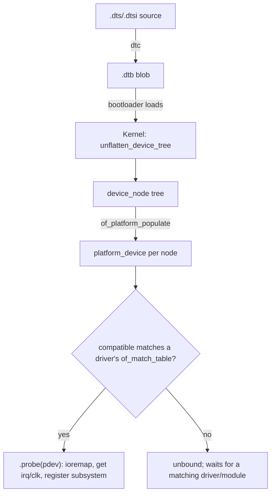

# Q19 — The Device Tree and Driver Matching on ARM Platforms

> **Subsystem:** Drivers · **Files:** `drivers/of/`, `drivers/base/platform.c`, `include/linux/of_device.h`
> **Interviewer is really probing (Qualcomm/embedded core topic):** Do you understand how
> **non-discoverable** hardware is described, how drivers **match** nodes, and the **probe** flow?

---

## TL;DR Cheat Sheet

- **Device Tree (DT)** is a **data structure describing hardware** that can't enumerate itself (most
  ARM SoC peripherals — no PCIe-style discovery). Written in **`.dts`/`.dtsi`**, compiled to a
  **`.dtb`** blob, handed to the kernel by the **bootloader**.
- A DT **node** describes a device: `compatible` string(s), `reg` (register base/size), `interrupts`,
  `clocks`, `iommus`, `dmas`, `gpios`, regulators, etc.
- **Matching:** the kernel turns DT nodes into **`platform_device`s**; a driver advertises an
  **`of_match_table`** of `compatible` strings; the **driver core** matches device↔driver by
  comparing `compatible`, then calls the driver's **`.probe()`**.
- **`compatible`** is the key: `"vendor,device"` (most specific first, with fallbacks), e.g.
  `compatible = "qcom,sdm845-uart", "qcom,geni-uart";`.
- In **`probe()`** you fetch resources from the node: `platform_get_resource`/`devm_ioremap_resource`
  (registers), `platform_get_irq` (IRQ), `devm_clk_get`, `devm_regulator_get`,
  `dma_request_chan`, etc. — almost always via **`devm_`** managed helpers so cleanup is automatic.
- **vs ACPI/PCIe:** PCIe devices are **discoverable** (config space → vendor/device ID); DT is for
  **non-discoverable** platform/SoC devices. x86 servers use **ACPI**; ARM SoCs use **DT** (servers
  may use ACPI too).

---

## The Question

> How does the device tree work on ARM platforms? How are drivers matched to nodes (`compatible`,
> `of_match_table`)? Cover the probe flow, platform devices, and `devm_*` managed resources.

---

## Why the device tree exists

x86/PCIe hardware is **self-describing**: you can probe PCI config space to learn what's there, its
BARs, IRQs, etc. Most **ARM SoC** peripherals (UARTs, I2C controllers, clocks, regulators, GPIO,
sensors on a board) are **not discoverable** — they sit at **fixed addresses** with **fixed IRQs**
wired by the board designer. The kernel has **no way to find them by probing**.

Historically this was hard-coded in C **"board files"** (`arch/arm/mach-*/board-*.c`) — one per
board, a maintenance nightmare (thousands of boards, kernel rebuild per board). The **Device Tree**
replaced that with **data, not code**: a single kernel binary reads a **board-specific DTB** that
**describes** the hardware. Now one kernel image supports many boards; supporting a new board means
writing a `.dts`, not patching the kernel.

So DT solves: **(1)** describing non-enumerable hardware, **(2)** decoupling board specifics from
kernel code, **(3)** giving drivers a uniform way to get their **registers, IRQs, clocks, DMA, IOMMU
bindings** — exactly the resources an SoC driver needs to come up.

---

## When DT is used (vs not)

- **Used:** ARM/ARM64 (and RISC-V, PowerPC) **SoC and embedded** platforms; on-SoC peripherals;
  board wiring (which I2C device on which bus, GPIO assignments, regulator topology).
- **Not (or less):** **PCIe/USB** devices — discoverable via their own buses (config space /
  descriptors); the bus enumerates them and matches by vendor/device ID. (A PCIe **host controller**
  itself is in DT on ARM, but devices behind it are discovered.)
- **ACPI** is the alternative on x86 and ARM **servers**; the driver model abstracts both via the
  **firmware node (`fwnode`)** layer so a well-written driver can match either DT or ACPI.

---

## Where in the kernel

```
drivers/of/                 <- OF (Open Firmware) core: parse DTB, of_match, property accessors
drivers/of/platform.c       <- of_platform_populate(): DT nodes -> platform_device
drivers/base/platform.c     <- platform bus, platform_driver, match, probe
include/linux/of_device.h, of.h, platform_device.h, mod_devicetable.h
arch/arm64/boot/dts/<vendor>/*.dts(i)  <- the device trees themselves
scripts/dtc/                <- device tree compiler (dtc)
```

---

## How it works — from DTS to probe

### 1. The device tree source

```dts
/* board.dtsi / soc.dtsi (simplified) */
soc {
    #address-cells = <2>;
    #size-cells = <2>;

    uart0: serial@a84000 {
        compatible = "qcom,sdm845-geni-uart", "qcom,geni-uart"; /* specific, then fallback */
        reg = <0x0 0x00a84000 0x0 0x4000>;     /* register base + size */
        interrupts = <GIC_SPI 601 IRQ_TYPE_LEVEL_HIGH>; /* IRQ via GIC (Q12) */
        clocks = <&gcc GCC_QUPV3_WRAP0_S0_CLK>;
        clock-names = "se";
        iommus = <&apps_smmu 0x123 0x0>;        /* SMMU stream ID (Q18) */
        status = "okay";
    };
};
```
Key properties:
- **`compatible`** — the match key, **most-specific-first** with fallbacks so a generic driver can
  bind if a specific one isn't present.
- **`reg`** — register region(s); interpreted using parent `#address-cells`/`#size-cells`.
- **`interrupts`** / `interrupt-parent` — wire to the interrupt controller (GIC), feeding the
  `irq_domain` (Q12).
- **`clocks`, `iommus`, `dmas`, `gpios`, regulators** — references (**phandles**) to provider nodes;
  resolved by the respective frameworks.

`.dts` includes shared `.dtsi` (SoC-level), compiled by **`dtc`** into a **`.dtb`**.

### 2. Boot: firmware hands the DTB to the kernel

The **bootloader** (U-Boot, ABL on Qualcomm — Q25) loads the **DTB** into memory and passes its
address to the kernel. Early boot parses it (`unflatten_device_tree()`), building an in-memory tree of
**`device_node`s**.

### 3. DT nodes become platform devices

`of_platform_populate()` walks the tree and creates a **`platform_device`** for each node that
represents a device, attaching its **`device_node`** (so the driver can read properties) and its
**resources** (reg → MEM resource, interrupts → IRQ resource).

### 4. Bus matching → probe

The **platform bus** matches each `platform_device` against registered **`platform_driver`s**:
1. For each driver, compare the device's `compatible` strings against the driver's
   **`of_match_table`** (`of_device_id[]`).
2. On a match, the driver core sets `dev->driver` and calls the driver's **`.probe(pdev)`**.
3. `.probe()` initializes the device: map registers, get IRQ/clocks/regulators, register the
   subsystem interface (e.g. a char/misc node Q17, a tty, an IIO device), and enable the hardware.
4. On unbind/remove, **`.remove()`** runs (or `devm_` auto-cleanup fires).

Matching order: DT `compatible` (OF) is tried; the core also supports ACPI (`acpi_match_table`) and
plain `name`/`id_table` matches — unified through the driver-core match callback.

### 5. Getting resources in probe — with `devm_`

```c
static int my_probe(struct platform_device *pdev) {
    struct my_dev *d = devm_kzalloc(&pdev->dev, sizeof(*d), GFP_KERNEL);
    if (!d) return -ENOMEM;

    /* registers: reg property -> ioremap, auto-unmapped on remove */
    d->regs = devm_platform_ioremap_resource(pdev, 0);
    if (IS_ERR(d->regs)) return PTR_ERR(d->regs);

    /* IRQ from 'interrupts' property */
    d->irq = platform_get_irq(pdev, 0);
    if (d->irq < 0) return d->irq;

    /* clock from 'clocks' phandle (auto-disabled/put on remove) */
    d->clk = devm_clk_get_enabled(&pdev->dev, "se");
    if (IS_ERR(d->clk)) return PTR_ERR(d->clk);

    /* read a custom property */
    of_property_read_u32(pdev->dev.of_node, "fifo-depth", &d->fifo);

    platform_set_drvdata(pdev, d);
    return devm_request_irq(&pdev->dev, d->irq, my_isr, 0, "mydev", d);
}

static const struct of_device_id my_of_match[] = {
    { .compatible = "qcom,sdm845-geni-uart" },
    { .compatible = "qcom,geni-uart" },           /* fallback */
    { }
};
MODULE_DEVICE_TABLE(of, my_of_match);

static struct platform_driver my_driver = {
    .probe  = my_probe,
    .driver = { .name = "mydev", .of_match_table = my_of_match },
};
module_platform_driver(my_driver);
```

### Why `devm_` matters

**`devm_*`** ("managed device resources") tie each acquired resource to the **device's lifetime**:
when the device is unbound or `probe` returns an error, the kernel **automatically releases** them in
reverse order. This eliminates the classic **error-path leak/`goto` ladder** in `probe()` — a huge
source of bugs. Modern drivers use `devm_kzalloc`, `devm_ioremap_resource`, `devm_request_irq`,
`devm_clk_get`, `devm_regulator_get`, etc., almost exclusively.

---

## Diagrams

### DTS → running driver



### compatible matching

```
node:   compatible = "qcom,sdm845-geni-uart", "qcom,geni-uart"
driver: of_match_table = { "qcom,geni-uart" }
        -> matches on the fallback string -> probe() called
```

---

## Annotated C — property accessors

```c
struct device_node *np = pdev->dev.of_node;

of_property_read_u32(np, "clock-frequency", &freq);
of_property_read_string(np, "label", &name);
bool present = of_property_read_bool(np, "qcom,enable-feature");

/* Resolve a phandle reference (e.g. a GPIO, regulator, dma channel). */
struct gpio_desc *rst = devm_gpiod_get(&pdev->dev, "reset", GPIOD_OUT_LOW);
struct regulator *vdd = devm_regulator_get(&pdev->dev, "vdd");

/* The match table entry can carry driver-specific data per compatible. */
static const struct of_device_id ids[] = {
    { .compatible = "vendor,chip-a", .data = &chip_a_cfg },
    { .compatible = "vendor,chip-b", .data = &chip_b_cfg },
    { }
};
const struct of_device_id *m = of_match_device(ids, &pdev->dev);
const struct chip_cfg *cfg = m->data;   /* pick per-variant config */
```

> Senior nuance: use **`.data`** in the match table to share one driver across **hardware variants**
> (different FIFO sizes, quirks) — match on `compatible`, branch on the per-entry config. This is the
> idiomatic way Qualcomm/vendor drivers support many SoCs with one driver.

---

## Company Angle

- **Qualcomm (the headline):** DT is how **every** SoC peripheral comes up — `compatible` naming
  (`qcom,<soc>-<block>`), `.dtsi` layering (SoC vs board), **clocks/regulators/GPIO/pinctrl**
  phandles, **`iommus`** (SMMU stream IDs, Q18), `interrupts` (GIC, Q12), and **runtime PM**
  integration in probe. Bring-up = writing/expanding DTS + probe.
- **NVIDIA (Tegra):** DT-described SoC blocks, GPU/display bindings, power domains; same probe/devm
  model.
- **Google (Android/ChromeOS):** DT overlays, stable bindings (`Documentation/devicetree/bindings/`,
  now YAML-schema validated), and `fwnode` abstraction for DT/ACPI portability.
- **AMD/Intel servers:** mostly **ACPI** + PCIe discovery; good to contrast *why* DT isn't used there
  (devices self-describe).

---

## War Story

*"Bringing up a new sensor on a Qualcomm board, the driver's `probe()` was **never called**. The
hardware and driver were both present, so I checked the match: the `.dts` node had
`compatible = "vendor,sensorX-v2"` but the driver's `of_match_table` only listed
`"vendor,sensorX"`. No string matched → no bind. I added the specific compatible (and kept the
generic as a fallback, most-specific-first). Next, probe **deferred**: `devm_regulator_get` returned
`-EPROBE_DEFER` because the regulator provider hadn't probed yet — the driver core **retries** probe
later once dependencies appear, which is the correct behavior (I just had to return the deferral, not
treat it as fatal). Finally I confirmed `reg`/`interrupts` matched the datasheet. Two lessons:
**`compatible` is an exact-string contract**, and **`-EPROBE_DEFER` is normal** for dependency
ordering — return it and let the core re-probe."*

---

## Interviewer Follow-ups

1. **Why device tree instead of probing?** Most ARM SoC peripherals aren't discoverable; DT
   **describes** them as data, replacing per-board C files, so one kernel supports many boards.

2. **What is `compatible` and how is it matched?** A `"vendor,device"` string (most-specific-first
   with fallbacks); the driver's `of_match_table` lists strings it supports; the bus matches and
   calls `probe`.

3. **DT vs ACPI vs PCIe discovery?** DT/ACPI describe **non-discoverable** platform devices (ARM
   SoC / x86 firmware); PCIe/USB **self-enumerate** via config space/descriptors. `fwnode` unifies
   DT/ACPI for drivers.

4. **What happens in `probe()`?** Acquire resources from the node (registers via ioremap, IRQ,
   clocks, regulators, DMA, IOMMU), register with the relevant subsystem, enable HW.

5. **What does `devm_` do and why?** Ties resources to device lifetime → automatic, ordered cleanup
   on remove/probe-failure, eliminating manual error-path unwinding leaks.

6. **What is `-EPROBE_DEFER`?** Returned when a dependency (clock/regulator/GPIO provider) isn't
   ready; the core **re-probes later** — the mechanism for implicit dependency ordering.

7. **How does one driver support many SoC variants?** Multiple `compatible` entries with per-entry
   **`.data`** configs; match on string, branch on config.

8. **How do interrupts/clocks/IOMMU get wired from DT?** Via **phandles** to provider nodes
   (`interrupt-parent`/GIC, `clocks`/clock controller, `iommus`/SMMU); frameworks resolve them so
   `platform_get_irq`, `devm_clk_get`, DMA mapping work.

9. **`.dts` vs `.dtsi` vs `.dtb`?** `.dtsi` = shared include (SoC-level); `.dts` = board (includes
   dtsi); `.dtb` = compiled blob the bootloader passes to the kernel.

---

## 30-Minute Talk Track

| Min | Cover |
|-----|-------|
| 0–4 | Why DT: non-discoverable SoC HW; death of board files; data-not-code |
| 4–9 | DTS anatomy: compatible, reg, interrupts, clocks, iommus; .dtsi/.dts/.dtb |
| 9–13 | Boot: bootloader passes DTB; unflatten; device_node tree |
| 13–17 | of_platform_populate → platform_device; resources attached |
| 17–22 | Matching: of_match_table vs compatible (specific+fallback); probe called |
| 22–26 | probe(): devm_ioremap/get_irq/clk/regulator; .data per-variant; EPROBE_DEFER |
| 26–28 | DT vs ACVPI/PCIe; fwnode portability; bindings/YAML schema |
| 28–30 | War story (compatible mismatch + probe defer) + summary |
