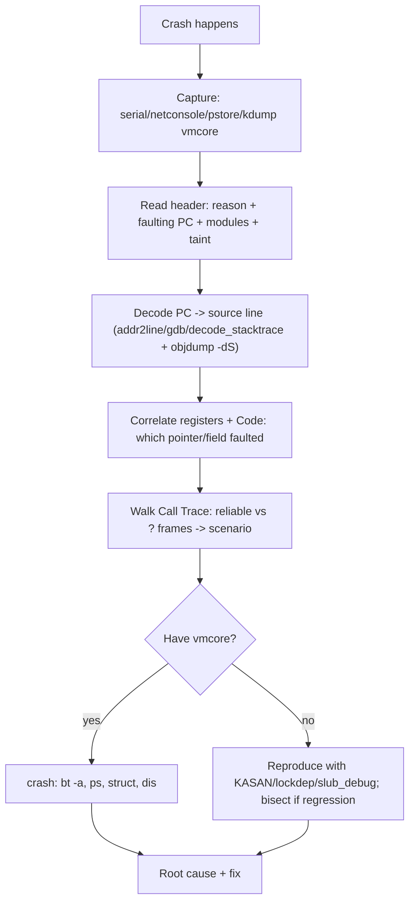

# Q21 — Debugging a Kernel Panic or Oops

> **Subsystem:** Debugging · **Files:** `kernel/panic.c`, `arch/*/kernel/traps.c`, tools: `decode_stacktrace.sh`, `gdb`, `crash`
> **Interviewer is really probing:** Can you read an **oops/panic**, decode the **faulting PC** and
> **call stack**, and drive to root cause with `addr2line`/`gdb`/`crash`/`kdump`?

---

## TL;DR Cheat Sheet

- **Oops** = a recoverable kernel fault (kills the offending task/context, kernel limps on, often
  unstable). **Panic** = unrecoverable (`panic()`), system halts/reboots. An oops **in atomic
  context** (IRQ, holding a lock) usually **escalates to a panic**.
- An oops dump tells you: the **reason** (`BUG`, `NULL deref`, `GPF`, `Unable to handle kernel paging
  request`), the **faulting instruction** (RIP/PC), **registers**, the **`Call Trace:`** (stack
  backtrace), the **`Tainted:`** flags, and **`RIP: <func+offset/funcsize>`**.
- **Decode the PC:** translate `function+0xoffset` to a **source line** with **`addr2line`**,
  **`gdb`** (`list *(func+0x..)`), or **`scripts/decode_stacktrace.sh`** against the matching
  **`vmlinux`** (with debug info) / module `.ko`.
- **Read the stack:** the `Call Trace:` is the chain of callers; `?` entries are **stale/unreliable**
  frames. Top reliable frame = where it died; below = how it got there.
- **`kdump`/`crash`:** configure a **crash kernel** (kexec) to capture a **`vmcore`** on panic, then
  analyze post-mortem with the **`crash`** utility (`bt`, `ps`, `log`, `struct`, `dis`).
- **Reproduce + instrument:** enable `KASAN`/`lockdep`/`slub_debug`/`panic_on_oops`/`panic_on_warn`,
  use `pstore`/`ramoops` to survive reboots, and bisect if it's a regression.

---

## The Question

> How do you debug a kernel panic or oops? Walk through reading the stack trace, decoding the program
> counter, and using `addr2line`/`gdb`/`crash`.

---

## Why oops/panic dumps look the way they do

When the CPU traps on an illegal kernel operation (dereferencing a bad pointer, executing a `BUG()`,
a double fault), there's **no userspace exception model** to fall back on — the kernel itself is
broken. The dump exists to capture, **at the instant of failure**, everything needed to reconstruct
*what* the kernel was doing and *how it got there*, because:

- the system may be too unstable to keep running (so the info must be **printed/saved immediately**),
- there's no debugger attached in production (so the **text dump is the evidence**),
- and the failing instruction + register state + stack is enough for an expert to **localize the
  bug** offline.

So the dump is essentially a **crash report**: fault reason + **PC (where)** + registers (**state**)
+ stack (**how we got here**) + taint (**trust/context**). Your job is to **decode** those raw
addresses back to source and reason backward to the root cause. Tooling exists precisely because the
kernel can't always help you live.

---

## When you get an oops vs panic

| Situation | Result |
|-----------|--------|
| Bad access in **process context**, recoverable | **Oops**: kill task, continue (tainted, fragile) |
| `panic()` called, or oops in **IRQ/atomic** / **`panic_on_oops`** | **Panic**: halt/reboot, optional kdump |
| `WARN()` | Warning + backtrace, **continues** (unless `panic_on_warn`) |
| Hard/soft lockup, RCU stall, hung task (Q24) | Detector dumps stacks; may panic |
| Out-of-bounds/UAF caught by **KASAN** | KASAN report (often the *real* root cause before a later oops) |

---

## Where (kernel + tools)

```
kernel/panic.c                <- panic(), oops_enter/exit, taint flags
arch/x86/kernel/dumpstack.c   <- show_trace/backtrace, reliability markers
arch/arm64/kernel/traps.c     <- arm64 die()/backtrace
scripts/decode_stacktrace.sh  <- symbolize a pasted Call Trace using vmlinux/.ko
tools: addr2line, gdb, objdump, crash (vmcore), kexec-tools (kdump)
pstore/ramoops (persistent storage across reboot), netconsole, serial console
Config: CONFIG_DEBUG_INFO, KASAN, LOCKDEP, PANIC_ON_OOPS, CRASH_DUMP, PSTORE
```

---

## How to debug — step by step

### 1. Capture the full dump reliably

A panic can wipe the screen/logs. Ensure you can **capture** it:
- **Serial console** (`console=ttyS0`) or **netconsole** (UDP to a logger) — survives a dead display.
- **`pstore`/`ramoops`** — writes the dmesg/oops to persistent RAM/flash, readable as
  `/sys/fs/pstore/` **after reboot**. Essential for crashes that reboot instantly.
- **`kdump`** — a reserved **crash kernel** (`crashkernel=` boot arg) boots via **kexec** on panic
  and saves a full **`vmcore`** for `crash`.

### 2. Read the header — what & where

```
BUG: kernel NULL pointer dereference, address: 0000000000000018
#PF: supervisor read access in kernel mode
RIP: 0010:my_driver_read+0x2a/0xc0 [my_driver]
Call Trace:
 <TASK>
 vfs_read+0x9d/0x190
 ksys_read+0x6b/0xf0
 do_syscall_64+0x59/0x90
 ...
Modules linked in: my_driver(O) ...
Tainted: G           O       6.6.0
```
Extract:
- **Reason:** `NULL pointer dereference` at offset `0x18` → likely a struct field at offset 0x18 off
  a NULL pointer.
- **Faulting PC (`RIP`):** `my_driver_read+0x2a` in module `my_driver` — **this is where it died.**
- **Call Trace:** it was called from `vfs_read` ← `ksys_read` ← `read(2)` syscall → so a **read on
  our char device** (Q17) triggered it.
- **Tainted `O`:** an **out-of-tree** module is loaded — note for trust.

### 3. Decode the program counter to a source line

Translate `my_driver_read+0x2a` to a line using the **matching build** (same `vmlinux`/`.ko` with
`CONFIG_DEBUG_INFO`):

```bash
# Against a module:
addr2line -e my_driver.ko -f my_driver_read+0x2a     # or use the absolute addr
# Against vmlinux:
addr2line -e vmlinux -f -i ffffffff8123abcd
# gdb form:
gdb vmlinux -batch -ex 'list *(my_driver_read+0x2a)'
# Best: symbolize the whole pasted trace:
./scripts/decode_stacktrace.sh vmlinux < oops.txt
# Inspect the faulting instruction:
objdump -dS my_driver.ko | less   # find my_driver_read, look at +0x2a
```
`objdump -dS` shows the **exact instruction** at the offset interleaved with source — you can see
*which* dereference faulted (e.g. `mov 0x18(%rax),%rdx` with `%rax == 0`).

### 4. Read the registers + "Code:" line

The dump prints all registers and a **`Code:`** byte dump around the PC. Cross-reference the faulting
register (e.g. `RAX = 0`) with the instruction to confirm **which pointer was NULL** and trace where
it should have been set. Offset `0x18` → match against the struct definition (`pahole`/gdb
`ptype`) to identify the exact field.

### 5. Walk the stack carefully

- Lines without `?` are **reliable** frames (found via frame pointers/ORC unwinder); lines with `?`
  are **stale stack residue** — plausible but not guaranteed. Don't over-trust `?` entries.
- The trace reconstructs the **call path**: from the syscall entry down to the faulting function —
  this tells you the **scenario** that triggered the bug.

### 6. Post-mortem with `crash` (if you have a vmcore)

```bash
crash vmlinux /var/crash/.../vmcore
crash> bt              # backtrace of the panicking task
crash> bt -a           # all CPUs (find who held locks, who was spinning)
crash> ps              # task states
crash> log             # the dmesg at crash time
crash> struct my_dev <addr>   # inspect kernel data structures live
crash> dis my_driver_read     # disassemble around the fault
```
`crash` lets you **inspect kernel memory at the moment of death** — invaluable for "what was this
pointer/struct's actual content."

### 7. Confirm root cause with sanitizers / bisect

- Re-run with **KASAN** — if the NULL/UAF is a memory bug, KASAN often reports the **original**
  offending access (allocation + free + use stacks) far more precisely than the downstream oops.
- **lockdep** for locking-related crashes (Q10); **slub_debug** for slab corruption (Q23).
- If it's a **regression**, **`git bisect`** between a known-good and bad kernel to find the commit.

---

## Diagrams

### Debug workflow



### Anatomy of the dump

```
reason:    BUG: NULL pointer deref, address 0x18      <- WHAT + which offset
RIP:       func+0x2a/0xc0 [module]                    <- WHERE it died (decode this)
registers: RAX=0 ... (the NULL)                       <- STATE (which ptr)
Call Trace: vfs_read <- ksys_read <- do_syscall_64    <- HOW we got here
Tainted/Modules                                       <- trust/context
```

---

## Annotated commands

```bash
# 1. Symbolize a pasted oops fast:
./scripts/decode_stacktrace.sh vmlinux ./modules_dir < oops.txt

# 2. PC -> file:line (function + offset form works):
addr2line -e my_driver.ko -f -i $(printf '%#x' $((0x2a)))   # within the function
addr2line -e vmlinux -f ffffffff8123abcd                    # absolute kernel addr

# 3. See the faulting instruction + source:
objdump -dSr my_driver.ko | awk '/<my_driver_read>:/,/ret/'

# 4. Identify struct field at offset 0x18:
pahole -C my_dev my_driver.ko        # shows each field's byte offset
gdb vmlinux -batch -ex 'ptype struct my_dev'

# 5. Post-mortem:
crash vmlinux vmcore  ->  bt -a ; log ; struct my_dev <ptr> ; dis my_driver_read
```

> Senior habit: **always decode against the *exact* build** that crashed (same `vmlinux`/`.ko`,
> `CONFIG_DEBUG_INFO`, matching `Modules linked in`). A symbol decoded against a mismatched build
> gives a **plausible-but-wrong** line and wastes hours.

---

## Company Angle

- **Google (large-scale debugging):** **kdump/vmcore** pipelines, automated symbolization, crash
  triage at fleet scale, `pstore` collection, and correlating crashes with deploys; KASAN in CI.
- **NVIDIA/AMD (drivers/GPU):** out-of-tree module taint, decoding crashes inside large `.ko`s,
  PCIe/DMA-induced corruption (Q18) surfacing as oops; `crash` to inspect device state.
- **Qualcomm (SoC):** `ramoops`/`pstore` over reserved memory (no disk), serial console bring-up,
  decoding ARM64 backtraces, and minidumps on Android.
- **All:** the meta-skill — **reproduce deterministically + add the right sanitizer** beats staring
  at a single oops.

---

## War Story

*"A driver oopsed intermittently with `NULL pointer dereference` at `my_driver_read+0x2a`. Decoding
with `addr2line`/`objdump -dS` against the exact `.ko` showed the faulting instruction was
`mov 0x18(%rax),...` with `RAX=0` — and `pahole` told me offset **0x18** was the
`buf` pointer in `struct my_dev`. The `Call Trace` showed it came via `vfs_read` → a userspace
`read()`. Root cause: a race between **`open()`** (which allocated `buf`) and a `read()` arriving
before init completed — `filp->private_data`'s `buf` was still NULL. Rather than trust the single
oops, I rebuilt with **KASAN**, which pointed straight at the use-of-uninitialized field and the
ordering. The fix was to initialize `buf` before publishing the device / guard with the device mutex
(Q17). I added `panic_on_oops=1` + `kdump` in our test rigs so future crashes captured a **vmcore**
for `crash` instead of vanishing. Lesson: **decode precisely, correlate register↔struct offset, then
confirm with a sanitizer** — don't guess from the backtrace alone."*

---

## Interviewer Follow-ups

1. **Oops vs panic?** Oops = recoverable fault (kills the context, kernel continues but fragile);
   panic = unrecoverable halt. Oops in atomic context or with `panic_on_oops` becomes a panic.

2. **How do you decode the faulting PC?** `addr2line`/`gdb`/`decode_stacktrace.sh` against the
   matching `vmlinux`/`.ko` with debug info; `objdump -dS` to see the exact instruction.

3. **What do `?` frames in the Call Trace mean?** Unreliable/stale stack entries the unwinder
   couldn't confirm — plausible but don't fully trust them; rely on non-`?` frames.

4. **What is `kdump` and how does it work?** A reserved crash kernel (`crashkernel=`) booted via
   **kexec** on panic that saves a **`vmcore`**; analyzed with `crash`.

5. **What does `Tainted:` tell you?** Trust/context flags — out-of-tree module (`O`), forced module
   load, prior WARN/oops, etc. — narrowing suspicion.

6. **How do you find which pointer was NULL?** Correlate the faulting **register** in the dump with
   the **instruction** (`objdump -dS`) and the **struct offset** (`pahole`/gdb `ptype`).

7. **When KASAN over reading the oops?** Memory-corruption bugs (UAF/OOB) — KASAN reports the
   **allocation/free/use** stacks of the *real* cause, often upstream of the eventual oops.

8. **No disk (embedded) — how to capture?** `ramoops`/`pstore` in reserved RAM, serial/netconsole;
   read `/sys/fs/pstore` after reboot.

9. **It's a regression — strategy?** `git bisect` between good/bad kernels with a reliable repro to
   pinpoint the commit.

---

## 30-Minute Talk Track

| Min | Cover |
|-----|-------|
| 0–4 | What an oops/panic is and why the dump contains PC/regs/stack/taint |
| 4–8 | Capture infrastructure: serial/netconsole, pstore/ramoops, kdump/vmcore |
| 8–12 | Read the header: reason, faulting RIP/PC, modules, tainted |
| 12–17 | Decode the PC: addr2line/gdb/decode_stacktrace + objdump -dS to the instruction |
| 17–20 | Correlate registers ↔ struct offset (pahole) to find the bad pointer/field |
| 20–23 | Walk the stack: reliable vs ? frames → reconstruct the scenario |
| 23–27 | crash on vmcore: bt -a, ps, struct, dis; sanitizers (KASAN/lockdep) to confirm |
| 27–30 | War story (NULL buf race, KASAN confirm) + "decode against the exact build" |
