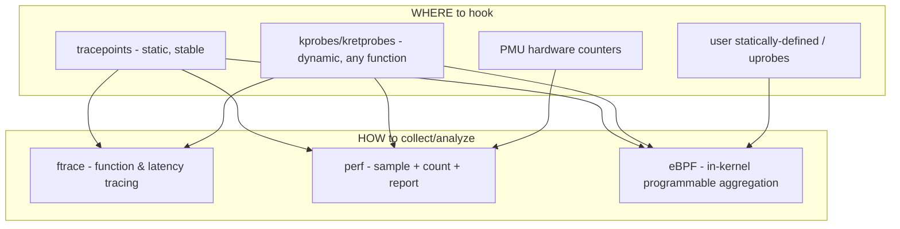
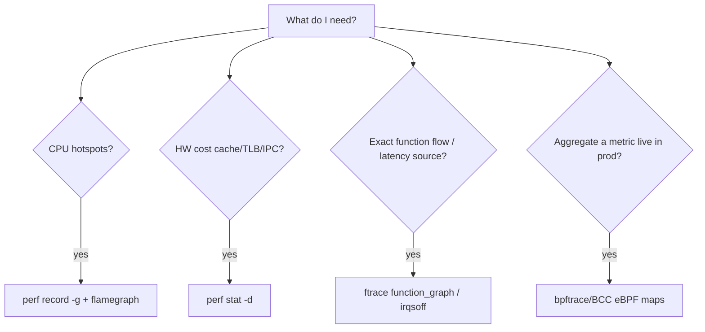

# Q22 — Kernel Performance Analysis: ftrace, perf, kprobes, eBPF, tracepoints

> **Subsystem:** Tracing/Perf · **Files:** `kernel/trace/`, `kernel/events/`, `kernel/bpf/`, tools: `perf`, `bpftrace`, `trace-cmd`
> **Interviewer is really probing (Google loves eBPF):** Do you know the **tracing toolbox**, what
> each tool is for, the **static vs dynamic** instrumentation distinction, and **eBPF** specifically?

---

## TL;DR Cheat Sheet

- **tracepoints** = **static**, maintainer-placed hooks at meaningful kernel events (`sched_switch`,
  `block_rq_issue`, `kmalloc`). Stable-ish ABI, low overhead, the **preferred** attach points.
- **kprobes/kretprobes** = **dynamic** instrumentation — trap **any** kernel instruction/function
  entry (kprobe) or **return** (kretprobe) at runtime. Powerful but no stable ABI (depends on
  symbols). **fprobe/ftrace** give cheaper function-entry tracing.
- **ftrace** = the in-kernel **function/event tracer**: function graph, latency tracers
  (`wakeup`, `irqsoff`, `preemptoff`), event tracing, all via **tracefs** (`/sys/kernel/tracing`).
  `trace-cmd`/`KernelShark` are front-ends.
- **perf** = sampling + counting profiler using **PMU hardware counters** + tracepoints/kprobes:
  CPU profiles (`perf record`/`report`/`top`), flame graphs, `perf stat` (cache misses, IPC, TLB),
  `perf sched`, `perf lock`, `perf mem`.
- **eBPF** = run **safe, verified** sandboxed programs **in the kernel**, attached to
  tracepoints/kprobes/perf events/etc., aggregating data **in-kernel** (maps) — minimal overhead,
  programmable, production-safe. Front-ends: **`bpftrace`** (one-liners), **BCC**, libbpf/CO-RE.
- **Mental model:** *tracepoints/kprobes = **where** to hook; ftrace/perf/eBPF = **how** to collect &
  analyze.* For ad-hoc questions → `bpftrace`/`perf`; for deep function flow → ftrace; for hardware
  cost → `perf stat`.

---

## The Question

> What tools do you use for kernel performance analysis? Explain ftrace, perf, kprobes, eBPF, and
> tracepoints. (Google especially values eBPF expertise.)

---

## Why this toolbox exists

You can't optimize or root-cause what you can't **observe**, and the kernel runs **privileged, hot,
and concurrent** — you need instrumentation that is **low-overhead**, **safe** (won't crash
production), and **flexible** (answer questions you didn't anticipate). Different problems need
different lenses:

- **"Where is CPU time going?"** → sampling profiler reading the **PMU** (perf).
- **"What's the exact sequence/latency of function calls?"** → function/latency tracer (ftrace).
- **"What's the distribution of this value across millions of events, live, in prod?"** →
  in-kernel aggregation (eBPF) so you don't ship every event to userspace.
- **"Hook a specific event that has no static probe."** → dynamic kprobe.

The historic problem: ad-hoc `printk` debugging is slow, noisy, perturbs timing, and can't run in
production at scale. The tracing infrastructure provides **structured, low-overhead, composable**
observability — and **eBPF** is the modern apex: **programmable, verified, safe-in-production**
instrumentation, which is why Google (and everyone) values it.

---

## When to use which

| Question / situation | Tool |
|----------------------|------|
| CPU hotspots / flame graph | `perf record -g` + `perf report` / FlameGraph |
| Hardware costs: cache/TLB misses, IPC, branch misses | `perf stat -d` (PMU counters) |
| Exact function call flow / who-calls-what | ftrace `function_graph` |
| Latency sources: IRQ-off, preempt-off, wakeup | ftrace latency tracers / `perf sched` |
| Hook an arbitrary function with custom logic, live | kprobe + eBPF (`bpftrace`/BCC) |
| Aggregate a metric across many events in prod | eBPF maps (histograms, counts) |
| Stable, low-overhead event stream | **tracepoints** (via perf/ftrace/eBPF) |
| Lock contention | `perf lock`, `/proc/lock_stat` (Q10) |

Rule: **prefer tracepoints** (stable, cheap) over kprobes (dynamic, symbol-dependent); prefer
**eBPF aggregation** over dumping raw events when volume is high.

---

## Where in the kernel

```
kernel/trace/            <- ftrace, function tracer, tracefs, ring buffer, event triggers
kernel/trace/trace_events.c, include/trace/events/  <- tracepoint definitions (TRACE_EVENT)
kernel/kprobes.c, arch/*/kernel/kprobes.c           <- kprobe/kretprobe
kernel/events/core.c     <- perf_event subsystem (PMU, sampling), perf_event_open(2)
kernel/bpf/              <- eBPF: verifier, JIT, maps, helpers; BPF_PROG_TYPE_KPROBE/TRACEPOINT/...
Userspace: tools/perf (perf), bpftrace, bcc, trace-cmd, /sys/kernel/tracing (tracefs)
```

---

## How each works

### Tracepoints (static)

Maintainers place **`TRACE_EVENT()`** macros at significant spots. When **disabled**, a tracepoint is
a **no-op** (a patched-out `nop` via static keys) → ~zero cost. When **enabled**, it calls registered
probe functions with structured fields. They're the **stable, intended** hook points
(`sched:sched_switch`, `block:block_rq_complete`, `net:netif_receive_skb`, `kmem:kmalloc`). perf,
ftrace, and eBPF can all attach to them.

```bash
perf list 'sched:*'                         # discover tracepoints
perf record -e sched:sched_switch -a -- sleep 5
bpftrace -e 'tracepoint:syscalls:sys_enter_openat { @[comm] = count(); }'
```

### kprobes / kretprobes (dynamic)

A **kprobe** dynamically replaces an instruction with a breakpoint (or jump) so a handler runs before
it executes; **kretprobe** hooks function **return** (to measure duration / capture return values).
You can probe **almost any** address — no need for a pre-placed tracepoint — but it's tied to
**symbols/offsets** (no ABI stability) and slightly higher overhead. **fprobe**/ftrace-based
function tracing is cheaper for plain entry hooks.

```bash
# attach eBPF to a kprobe on a function with no tracepoint:
bpftrace -e 'kprobe:vfs_read { @bytes = hist(arg2); }'
bpftrace -e 'kretprobe:vfs_read { @ret = hist(retval); }'
```

### ftrace (function & latency tracer)

The built-in tracer, controlled via **tracefs** (`/sys/kernel/tracing`):
- **`function`** / **`function_graph`** — trace every kernel function entry (and graph with
  durations) — great for "what is this code path actually doing."
- **Latency tracers:** `irqsoff` (longest IRQs-disabled region), `preemptoff`, `wakeup`/`wakeup_rt`
  (scheduler wakeup latency) — directly target latency root causes (ties to Q16/Q24).
- **Event tracing:** enable tracepoints, set **filters** and **triggers** (e.g. stacktrace on an
  event), read the **ring buffer** from `trace`/`trace_pipe`.
- Front-ends: **`trace-cmd`** (record/report), **KernelShark** (GUI).

```bash
cd /sys/kernel/tracing
echo function_graph > current_tracer; echo 1 > tracing_on; cat trace_pipe
echo irqsoff > current_tracer            # find longest IRQ-off latency
```

### perf (sampling + counting)

`perf` drives the **PMU** (Performance Monitoring Unit) and the perf_event subsystem:
- **`perf stat`** — count hardware events for a command/system: instructions, IPC, **cache-misses**,
  **dTLB-load-misses** (link Q1), branch-misses, context-switches. The first thing to run.
- **`perf record -g` / `perf report`** — **sampled** CPU profile with call graphs → **flame graphs**;
  shows where cycles go without tracing every call.
- **`perf top`** — live profile. **`perf sched`** — scheduler latency. **`perf lock`** — contention.
  **`perf mem`/`perf c2c`** — cache-line contention/false sharing (AMD-relevant).

```bash
perf stat -d ./workload                 # IPC, cache/TLB misses
perf record -F 999 -a -g -- sleep 10; perf report   # system-wide profile
perf record -e dTLB-load-misses ...     # hardware-counter-driven sampling
```

### eBPF (programmable, safe, in-kernel)

eBPF lets you load a small program (written in restricted C or a `bpftrace` script) that the kernel
**verifies** (proves it's safe: bounded loops, no wild pointers, no crashes) and **JIT-compiles**,
then attaches to a hook (tracepoint, kprobe, perf event, USDT, LSM, XDP…). It can:
- run logic at the event, read arguments/registers,
- **aggregate in-kernel** using **maps** (hash maps, **histograms**, per-CPU counters) — so only the
  **summary** crosses to userspace (huge overhead win vs streaming every event),
- safely run **in production** (the verifier guarantees it can't crash or loop forever).

```bash
# latency histogram of block I/O, fully in-kernel aggregation:
bpftrace -e 'tracepoint:block:block_rq_issue { @s[args->dev] = nsecs; }
             tracepoint:block:block_rq_complete /@s[args->dev]/ {
                 @us = hist((nsecs - @s[args->dev]) / 1000); delete(@s[args->dev]); }'

# count syscalls by process:
bpftrace -e 'tracepoint:raw_syscalls:sys_enter { @[comm] = count(); }'
```
Front-ends: **`bpftrace`** (awk-like one-liners for ad-hoc analysis), **BCC** (Python+C tools:
`biolatency`, `execsnoop`, `tcpconnect`), **libbpf + CO-RE** (compile-once-run-everywhere production
binaries). This is the toolset Google-scale observability is built on (plus XDP for networking).

---

## Diagrams

### Hook points vs collectors



### Choosing a tool



---

## Annotated examples

```bash
# 1. ALWAYS start broad: hardware efficiency snapshot.
perf stat -d -- ./service          # IPC, cache-misses, dTLB-load-misses (ties to Q1)

# 2. Where are cycles spent (sampled, low overhead, system-wide)?
perf record -F 999 -a -g -- sleep 10
perf report --stdio | head -40     # or fold into a flame graph

# 3. Exact code path of a slow ioctl (dynamic, no tracepoint needed):
cd /sys/kernel/tracing
echo my_ioctl > set_graph_function; echo function_graph > current_tracer
cat trace_pipe                      # see the call graph + per-call durations

# 4. In-kernel latency histogram, production-safe (eBPF):
bpftrace -e 'kprobe:vfs_read { @t[tid] = nsecs; }
             kretprobe:vfs_read /@t[tid]/ {
               @us = hist((nsecs - @t[tid])/1000); delete(@t[tid]); }'

# 5. Scheduler/latency root-cause (ftrace latency tracer; link Q16/Q24):
echo wakeup_rt > /sys/kernel/tracing/current_tracer
```

> Senior workflow to state: **start with `perf stat` (cheap, broad) → `perf record` for hotspots →
> ftrace/eBPF to zoom into the specific path.** Use **tracepoints first**; reach for **kprobes**
> only when no static probe exists; aggregate with **eBPF** when event volume is high.

---

## Company Angle

- **Google (eBPF is the headline):** expect depth on eBPF — the **verifier/JIT/maps**, BCC/bpftrace/
  libbpf CO-RE, **XDP/tc** for networking, eBPF for **observability at fleet scale** without shipping
  raw events, and why in-kernel aggregation matters. Cgroup/scheduler tracing too.
- **NVIDIA/AMD (hardware perf):** `perf stat`/`perf c2c` for **cache-line contention/false sharing**
  (Q9/Q15), PMU counters, IPC, NUMA effects; profiling driver hot paths and DMA.
- **Qualcomm (SoC/RT):** ftrace **latency tracers** (`irqsoff`/`preemptoff`/`wakeup`) for RT latency
  (Q16/Q24), `trace-cmd` on embedded, perf on ARM PMU.
- **All:** the discipline of **measure-don't-guess** and choosing the lowest-overhead tool.

---

## War Story

*"A service had high CPU but unclear cause. **`perf stat -d`** showed a **terrible IPC (~0.4)** and a
huge **dTLB-load-miss** rate — a hint it was memory/TLB-bound, not compute-bound (ties to Q1).
**`perf record -g`** + a flame graph pinned ~30% of cycles in one hash-lookup function walking a
giant table. Rather than ship every access to userspace, I wrote a **bpftrace** kprobe on that
function to build an **in-kernel histogram** of bucket-chain lengths — it revealed pathological
collisions. The flame graph said *where*, the eBPF histogram said *why*. We fixed the hash and, per
Q1, moved the table to **huge pages** to cut TLB misses; IPC roughly doubled. The interviewer's
follow-up — *'why eBPF instead of just perf?'* — let me explain that **eBPF aggregated millions of
events in-kernel** into a small histogram, where `perf record` would have produced an enormous trace;
each tool answered a different question."*

---

## Interviewer Follow-ups

1. **tracepoint vs kprobe?** Tracepoint = static, maintainer-placed, stable-ish, near-zero cost when
   off; kprobe = dynamic, attach to almost any instruction/function at runtime, no ABI stability,
   higher overhead. Prefer tracepoints.

2. **What's a kretprobe for?** Hook function **return** — measure duration or capture return values
   (kprobe hooks entry).

3. **perf vs ftrace?** perf = **sampling/counting** (PMU profiles, hardware costs, flame graphs);
   ftrace = **full function/event tracing** and latency tracers (exact flow, not sampled).

4. **What makes eBPF safe for production?** The **verifier** proves the program terminates and only
   makes safe memory accesses; it's **JIT-compiled**; aggregation in **maps** keeps overhead low.

5. **Why aggregate in-kernel?** High-frequency events (millions/s) would overwhelm userspace if
   streamed; eBPF computes histograms/counts in-kernel and exports only summaries.

6. **What's a flame graph?** A visualization of sampled stacks (width ∝ time) from `perf record`,
   making CPU hotspots and call paths obvious.

7. **Which tool for IRQ/preempt-off latency?** ftrace **`irqsoff`/`preemptoff`/`wakeup_rt`** latency
   tracers (Q16/Q24).

8. **`perf stat` first metrics?** IPC, cache-misses, dTLB/iTLB misses, branch-misses,
   context-switches — to classify a workload as compute- vs memory- vs TLB-bound.

9. **eBPF beyond tracing?** XDP/tc (networking dataplane), LSM (security), sched_ext (scheduling),
   cgroup hooks — programmable kernel extension, not just observability.

---

## 30-Minute Talk Track

| Min | Cover |
|-----|-------|
| 0–3 | Why observability: low-overhead, safe, flexible; measure-don't-guess |
| 3–6 | The model: tracepoints/kprobes = where; ftrace/perf/eBPF = how |
| 6–10 | Tracepoints: static, static-key no-op when off, stable hooks; examples |
| 10–13 | kprobes/kretprobes: dynamic entry/return hooks; fprobe; trade-offs |
| 13–17 | ftrace: function_graph + latency tracers (irqsoff/preempt/wakeup), tracefs |
| 17–22 | perf: PMU counters (perf stat), sampling (record/report), flame graphs, sched/lock/c2c |
| 22–27 | eBPF: verifier/JIT/maps, bpftrace/BCC/libbpf CO-RE, in-kernel aggregation, XDP |
| 27–30 | Workflow (stat→record→ftrace/eBPF) + war story (IPC/TLB + eBPF histogram) |
