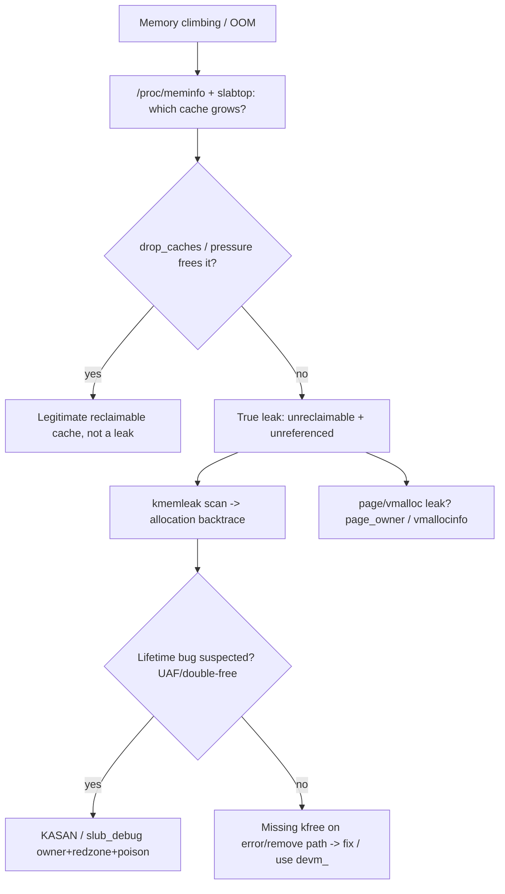

# Q23 — Diagnosing a Kernel Memory Leak: kmemleak, KASAN, slub_debug, slabinfo

> **Subsystem:** Debugging/MM · **Files:** `mm/kmemleak.c`, `mm/kasan/`, `mm/slub.c`, `/proc/slabinfo`
> **Interviewer is really probing:** Do you know how to **find, attribute, and root-cause** kernel
> memory growth — distinguishing a true leak from cache growth, and using the right detector?

---

## TL;DR Cheat Sheet

- **Kernel memory leak** = allocations (`kmalloc`/`kmem_cache_alloc`/`alloc_pages`/`vmalloc`) that are
  **never freed** and **no longer reachable** → memory grows unbounded → eventual OOM (Q4).
- **First triage — *is* it a leak, and *where*?**
  - **`/proc/meminfo`** + **`/proc/slabinfo`** (or `slabtop`): watch which **slab cache** grows
    unbounded → tells you the **object type** leaking (e.g. `kmalloc-256`, `dentry`, your cache).
  - **`/proc/vmallocinfo`** for vmalloc leaks; **`/proc/buddyinfo`** for page-level.
  - **`/proc/<pid>/...`**, `ftrace`/`eBPF` alloc-vs-free counts to confirm growth.
- **`kmemleak`** = a **kernel-side leak detector** (like a conservative GC): periodically scans memory
  for pointers to tracked allocations; anything **unreferenced** is reported with its **allocation
  stack** in `/sys/kernel/debug/kmemleak`. The go-to for "what allocated the leaked object."
- **`KASAN`** = address sanitizer — primarily catches **use-after-free / out-of-bounds**, but its
  **quarantine + allocation/free stacks** also help attribute lifetime bugs that masquerade as leaks.
- **`slub_debug`** = per-cache SLUB debugging: **red-zones**, **poisoning**, **owner tracking**
  (who allocated each object) and double-free/corruption detection — enable per cache
  (`slub_debug=U,kmalloc-256`).
- **Key distinction:** a growing cache might be a **legitimate cache** (reclaimable under pressure)
  vs a **true leak** (unreclaimable, unreferenced). Check whether memory pressure/`drop_caches`
  frees it.

---

## The Question

> How do you diagnose a memory leak in the kernel? Discuss `kmemleak`, `KASAN`, `slub_debug`, and
> slabinfo.

---

## Why kernel leaks are special (and the tooling exists)

Userspace leaks are bounded by the process and reaped on exit; **kernel leaks are forever** (until
reboot) and **shared system-wide** — they slowly starve every process and end in **OOM kills**
(Q4) or allocation failures. There's **no garbage collector** in the kernel: every `kmalloc` needs a
matching `kfree` on **all** code paths (especially **error paths** — the #1 source of leaks).

Diagnosis is hard because:
- the kernel allocates **constantly**; you must separate a **leak** from normal **cache growth**;
- there's no per-process attribution — a leak is just "slab usage climbing";
- the culprit allocation may have happened **long ago** and far from where you notice the symptom.

So the toolbox provides three capabilities: **(1) detect growth & identify the object type**
(slabinfo/meminfo), **(2) attribute the allocation to a stack** (kmemleak, slub_debug owner tracking,
`page_owner`), and **(3) catch lifetime misuse** that causes or mimics leaks (KASAN). The senior
skill is **picking the right one** and **confirming reclaimability** before declaring a leak.

---

## When to use which detector

| Symptom / goal | Tool |
|----------------|------|
| Is memory actually growing & which object type? | `/proc/meminfo`, `/proc/slabinfo` / `slabtop` |
| Page-level / vmalloc growth | `/proc/buddyinfo`, `/proc/vmallocinfo`, `page_owner` |
| "What allocation is leaking (with stack)?" | **kmemleak** (`/sys/kernel/debug/kmemleak`) |
| Use-after-free / out-of-bounds (root cause behind a "leak") | **KASAN** |
| Per-cache corruption, double-free, who-allocated | **slub_debug** (`U`=owner, `Z`=redzone, `P`=poison) |
| Live alloc/free accounting in production | **eBPF/ftrace** on `kmem:kmalloc`/`kfree` tracepoints |

---

## Where in the kernel

```
mm/kmemleak.c               <- the leak detector + /sys/kernel/debug/kmemleak
mm/kasan/                   <- KASAN (generic/SW-tags/HW-tags) shadow memory
mm/slub.c                   <- SLUB + slub_debug (redzone/poison/owner tracking)
mm/page_owner.c             <- per-page allocation stack (page_owner=on)
/proc/slabinfo, /proc/meminfo, /proc/vmallocinfo, /proc/buddyinfo
Config: CONFIG_DEBUG_KMEMLEAK, CONFIG_KASAN, CONFIG_SLUB_DEBUG, CONFIG_PAGE_OWNER
```

---

## How to diagnose — step by step

### 1. Confirm growth and identify the object type

```bash
watch -n5 'grep -E "Slab|SReclaimable|SUnreclaim|VmallocUsed" /proc/meminfo'
slabtop -o            # sort caches by size; watch which one climbs unbounded
sort -k3 -n /proc/slabinfo | tail   # biggest caches
```
If **`SUnreclaim`** (unreclaimable slab) climbs and never drops, that's leak-like. If
**`SReclaimable`** (dentries/inodes) is large but **shrinks under pressure**, it may be **legitimate
cache**, not a leak. A specific cache growing (e.g. `kmalloc-512` or your `mydev_cache`) **names the
object type** — already a huge clue. For pages, watch `/proc/buddyinfo`; for vmalloc,
`/proc/vmallocinfo` (it lists each allocation's caller).

### 2. Distinguish leak vs cache

```bash
echo 3 > /proc/sys/vm/drop_caches    # drop reclaimable caches
# Re-check: reclaimable caches shrink; a true leak does NOT.
```
A **true leak is unreferenced and unreclaimable** — it won't free under pressure or `drop_caches`.
Confirm by inducing memory pressure and watching whether the cache shrinks.

### 3. Attribute the allocation with kmemleak

`kmemleak` works like a **conservative mark-sweep GC**: it tracks each `kmalloc`/`kmem_cache_alloc`/
`vmalloc`/`alloc_pages` and periodically **scans all kernel memory** for any pointer that could
reference each tracked object. Objects with **no pointer anywhere** are flagged as **possibly
leaked**, with the **stack trace of their allocation**:

```bash
# boot with kmemleak=on (CONFIG_DEBUG_KMEMLEAK)
echo scan > /sys/kernel/debug/kmemleak     # trigger an immediate scan
cat /sys/kernel/debug/kmemleak             # list suspected leaks + alloc stacks
```
Example report:
```
unreferenced object 0xffff8881..(size 256):
  comm "modprobe", pid 1234
  backtrace:
    kmalloc_trace+0x..
    my_driver_probe+0x..       <- allocated here, never freed
    really_probe+0x..
```
That backtrace points straight at the **allocation site** whose free is missing (often an
**error-path** or **remove()** that forgot a `kfree` — which is exactly why **`devm_`** (Q19) exists).
Note: kmemleak can have **false positives** (pointers stored in unscanned regions, or value-encoded
pointers), so corroborate.

### 4. Catch the lifetime bug with KASAN / slub_debug

If the "leak" is really a **use-after-free** or **double-free** corrupting accounting, enable:
- **KASAN** — shadow-memory checker that reports UAF/OOB **at the moment of the bad access**, with
  **alloc and free stacks**. The gold standard for object-lifetime bugs. (HW-tags KASAN on arm64 is
  cheap enough for some production/fuzzing.)
- **slub_debug** — per-cache: **owner tracking** (`U`) records alloc/free stacks in each object;
  **red-zones** (`Z`) detect overflow; **poisoning** (`P`) detects use-after-free and uninitialized
  use; catches **double frees**:
```bash
# boot arg: enable owner tracking + redzone + poison on one cache
slub_debug=U,Z,P,kmalloc-256
cat /sys/kernel/slab/kmalloc-256/alloc_calls   # who allocates from this cache
```

### 5. Production-safe accounting with eBPF

When you can't reboot with debug kernels, attach to the **kmem tracepoints** and tally allocations by
stack to find imbalance live:
```bash
bpftrace -e 'tracepoint:kmem:kmalloc { @[kstack] = count(); }'   # alloc hotspots by stack
# Compare alloc vs kfree counts per call site to spot the leak source.
```
**BCC `memleak`** does exactly this: samples allocations, tracks frees, and reports allocations with
**no matching free** plus their stacks — usable on a running system.

### 6. Page / vmalloc leaks

For **page-level** leaks (`alloc_pages` without `__free_pages`), enable **`page_owner=on`** and use
`tools/vm/page_owner_sort` to list allocation stacks of currently-held pages. For **vmalloc**,
`/proc/vmallocinfo` shows each mapping's **caller** — find the one that keeps growing.

---

## Diagrams

### Diagnosis funnel



### kmemleak as conservative GC

```
tracked allocs: {A, B, C}     scan all kernel memory for pointers...
  ptr->A found  (referenced, OK)
  ptr->B found  (referenced, OK)
  C: no pointer anywhere       -> "unreferenced object" -> LEAK candidate + alloc stack
```

---

## Annotated commands

```bash
# 1. Identify the leaking object type:
slabtop -o ; sort -k3 -n /proc/slabinfo | tail
grep -E 'SUnreclaim|SReclaimable|VmallocUsed' /proc/meminfo

# 2. Leak vs cache:
echo 3 > /proc/sys/vm/drop_caches    # reclaimable shrinks; leak persists

# 3. kmemleak (find the allocation site):
echo scan > /sys/kernel/debug/kmemleak
cat       /sys/kernel/debug/kmemleak     # backtraces of unreferenced objects

# 4. Per-cache forensic detail:
#   boot: slub_debug=U,Z,P,<cache>     (owner, redzone, poison)
cat /sys/kernel/slab/<cache>/alloc_calls
#   KASAN build catches UAF/OOB with alloc+free stacks at access time.

# 5. Live production accounting:
/usr/share/bcc/tools/memleak -p <pid>    # or system-wide; alloc-without-free + stacks
bpftrace -e 'tracepoint:kmem:kmalloc { @[kstack]=count(); }'

# 6. Pages / vmalloc:
#   boot: page_owner=on ; cat /sys/kernel/debug/page_owner | sort tool
sort -k2 /proc/vmallocinfo | tail        # growing vmalloc callers
```

> Senior nuance: **always confirm reclaimability first.** Reporting "the dentry cache is huge" as a
> leak is a rookie mistake — it's reclaimable and shrinks under pressure. A real leak is
> **unreferenced + unreclaimable**, which is exactly what **kmemleak** is designed to find.

---

## Company Angle

- **Google (fleet/long-uptime):** leaks surface after **weeks** of uptime; production-safe detection
  via **eBPF/BCC `memleak`** and slab monitoring, not reboot-only debug kernels; correlating slab
  growth with deploys; memcg accounting (Q4) to attribute to cgroups.
- **NVIDIA/AMD (drivers/GPU):** driver error-path and **`remove()`** leaks (forgot to free a DMA
  buffer or descriptor); `page_owner` for large page leaks; KASAN in driver CI.
- **Qualcomm (embedded, no swap):** leaks → fast OOM on small-RAM SoCs; `kmemleak`/`slub_debug` on
  debug builds, `ramoops` to capture the OOM (Q21); memory budgets are tight.
- **All:** **`devm_`** managed resources (Q19) as the structural fix that prevents most error-path
  leaks.

---

## War Story

*"A networking appliance OOM-killed processes every few days of uptime. `slabtop` showed
**`kmalloc-512`** climbing steadily and **never shrinking** under pressure or `drop_caches` — so a
**true leak**, and the cache size told me the object was ~512 bytes. I enabled **`kmemleak`**;
`echo scan` produced an `unreferenced object` report whose backtrace pointed at a **connection-state
allocation** in an **error path** of the packet handler: when a particular malformed packet was
rejected, the code `return`ed before freeing the state object. Classic **error-path leak**. I
confirmed by adding a `bpftrace` tally of allocs vs frees at that call site — allocs outran frees
exactly when malformed packets arrived. The fix: free on the error path (and I refactored to a single
`goto err_free` unwind, the pattern `devm_`/centralized cleanup enforces). Uptime memory went flat.
The interviewer's takeaway: **identify the object via slabinfo, prove it's unreclaimable, then let
kmemleak hand you the allocation stack — and check the error paths first.**"*

---

## Interviewer Follow-ups

1. **Leak vs legitimate cache — how to tell?** A leak is **unreferenced + unreclaimable** (doesn't
   shrink under pressure/`drop_caches`); a cache (dentry/inode) **shrinks** via shrinkers (Q4).

2. **What does kmemleak do?** Acts as a conservative GC: tracks allocations, scans memory for
   pointers, reports **unreferenced** objects with their **allocation backtrace**.

3. **kmemleak false positives — why?** Pointers stored in unscanned regions, value-encoded/obfuscated
   pointers, or deferred frees can make a live object look unreferenced — corroborate.

4. **When KASAN vs kmemleak?** KASAN for **UAF/OOB/lifetime** bugs (reports at the bad access with
   alloc+free stacks); kmemleak for **pure leaks** (unfreed, unreferenced).

5. **What does `slub_debug` add?** Per-cache **owner tracking** (alloc/free stacks), **red-zones**
   (overflow), **poisoning** (UAF/uninit), and **double-free** detection.

6. **Most common leak source?** **Error paths** and `remove()`/teardown that skip a `kfree` —
   mitigated by **`devm_`** managed resources.

7. **How to find a *page* leak?** `page_owner=on` + the page_owner sort tool; `/proc/buddyinfo`
   trends; for vmalloc, `/proc/vmallocinfo` callers.

8. **Production-safe detection without a debug kernel?** **eBPF/BCC `memleak`** and kmem tracepoint
   accounting — find alloc-without-free and stacks live.

9. **How do leaks lead to OOM?** Unfreed unreclaimable memory shrinks free pages until watermarks
   fail and the OOM killer fires (Q4).

---

## 30-Minute Talk Track

| Min | Cover |
|-----|-------|
| 0–3 | Why kernel leaks are forever/system-wide; no GC; error paths are the usual cause |
| 3–8 | Triage: meminfo/slabtop/slabinfo to find the growing object type |
| 8–11 | Leak vs cache: reclaimable (shrinks) vs unreclaimable+unreferenced (leak); drop_caches |
| 11–17 | kmemleak: conservative-GC model, scan, reading the allocation backtrace, false positives |
| 17–22 | KASAN (UAF/OOB, alloc+free stacks) and slub_debug (owner/redzone/poison/double-free) |
| 22–25 | Page/vmalloc leaks: page_owner, vmallocinfo |
| 25–28 | Production-safe: eBPF/BCC memleak, kmem tracepoint accounting; devm_ as the fix |
| 28–30 | War story (error-path kmalloc-512 leak) + "prove unreclaimable, then attribute" |
