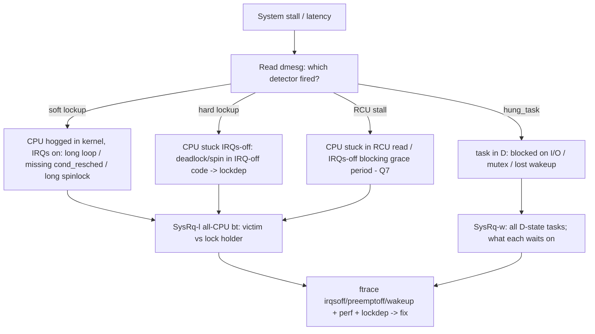

# Q24 — Root-Causing High Latency / Soft Lockups

> **Subsystem:** Debugging/Latency · **Files:** `kernel/watchdog.c`, `kernel/rcu/tree_stall.h`, `kernel/hung_task.c`
> **Interviewer is really probing:** Do you have a **systematic method** to diagnose stalls — and do
> you know the **detectors** (soft/hard lockup, RCU stall, hung task) and what each one *means*?

---

## TL;DR Cheat Sheet

- **Three failure shapes, three detectors:**
  - **Soft lockup** — a task **hogs a CPU in kernel mode without scheduling** for >~20 s (a long
    loop with preemption effectively disabled / not calling `schedule()`). The CPU is alive but the
    scheduler isn't running other tasks there. Detector: per-CPU **`watchdog/N`** kthread +
    hrtimer; `BUG: soft lockup - CPU#N stuck for 22s!`.
  - **Hard lockup** — a CPU is stuck with **interrupts disabled** (no timer ticks at all), often a
    deadlock in IRQ-off code. Detected via **NMI / PMU** watchdog: `NMI watchdog: hard LOCKUP`.
  - **Hung task** — a task stuck in **`D` (uninterruptible sleep)** for >120 s (default), usually
    blocked on I/O or a lock that never releases. Detector: **`khungtaskd`**; `task X blocked for
    more than 120 seconds`.
  - **RCU stall** — a CPU stays in an **RCU read-side section / IRQs-off** so long that grace
    periods can't complete (Q7). Detector: RCU CPU stall warning with the **stuck CPU's stack**.
- **Method:** read **`dmesg`** for which detector fired → it **dumps the offending CPU/task stack**,
  which usually names the culprit. Then confirm with **ftrace latency tracers**
  (`irqsoff`/`preemptoff`/`wakeup`), **`perf`**, lockdep (Q10), and `magic SysRq` (`l`/`t`/`w`).
- **Tunables:** `kernel.watchdog_thresh`, `kernel.hung_task_timeout_secs`, `rcu_cpu_stall_timeout`,
  `softlockup_panic`/`hardlockup_panic`/`hung_task_panic` (→ panic+kdump for a vmcore, Q21).

---

## The Question

> A system is experiencing high latency / soft lockups. How do you root-cause it? Discuss
> `hung_task`, RCU stall detection, `hardlockup`/`softlockup` detectors, and `dmesg` analysis.

---

## Why these detectors exist

A wedged kernel often **can't report its own problem** — if a CPU is spinning with IRQs off, the
timer interrupt that would normally drive logging/scheduling **never fires** on that CPU. So the
kernel builds **independent watchdogs** that fire from a **different vantage point** (another CPU's
NMI, a per-CPU high-res timer, a separate kthread) to notice "this CPU/task hasn't made progress" and
**dump its stack while the evidence is still live**. Each detector targets a **distinct stuck
condition**, which is *why there are several* — and **which one fires immediately narrows the root
cause class**:

- spinning in kernel with preemption off but IRQs on → **soft lockup**,
- spinning with IRQs off (no ticks) → **hard lockup**,
- blocked in `D` state on something that never completes → **hung task**,
- holding off RCU grace periods → **RCU stall**.

Latency problems (not full lockups) are the milder cousin: the system makes progress but with
**unacceptable delays**. The same tools (ftrace latency tracers, perf, scheduler tracepoints) localize
the **longest non-preemptible / IRQ-off / wakeup-delay** regions (ties to Q16).

---

## When each fires (decision table)

| Detector | Condition | Typical default | Meaning |
|----------|-----------|-----------------|---------|
| **softlockup** | CPU in kernel, no `schedule()` | ~20 s (2×`watchdog_thresh` 10) | long loop / preempt-disabled hog |
| **hardlockup** | CPU with **IRQs disabled**, no ticks | ~10 s (NMI/PMU) | deadlock/spin in IRQ-off code |
| **hung_task** | task in `D` state | 120 s | stuck on I/O or a lock that never releases |
| **RCU stall** | grace period can't end | 21 s (`rcu_cpu_stall_timeout`) | reader/IRQs-off CPU blocking RCU |

---

## Where in the kernel

```
kernel/watchdog.c            <- soft/hard lockup detector (per-CPU watchdog kthread + hrtimer)
kernel/watchdog_hld.c        <- hardlockup via NMI/PMU
kernel/hung_task.c           <- khungtaskd: scans for long D-state tasks
kernel/rcu/tree_stall.h      <- RCU CPU stall detection + stack dump
kernel/sched/ + tracepoints  <- sched_switch, sched_wakeup for latency analysis
drivers/tty/sysrq.c          <- magic SysRq (l: all-CPU backtrace, t: tasks, w: blocked tasks)
sysctls: kernel.watchdog_thresh, hung_task_timeout_secs, softlockup_panic, ...
```

---

## How to root-cause — systematic method

### 1. Read `dmesg` — the detector tells you the class and dumps the stack

```
watchdog: BUG: soft lockup - CPU#3 stuck for 23s! [worker:1412]
 RIP: 0010:my_spin_loop+0x4c/0x80 [mymod]
 Call Trace: ... do_the_work+... process_one_work+... worker_thread+...
```
The firing detector + the **stuck CPU/task + its stack** is usually 80% of the answer. For:
- **soft lockup:** the stack shows the **loop/function hogging the CPU** (e.g. a busy-wait, a
  spinlock held too long, an unbounded loop). Look for missing `cond_resched()` (Q16) or a too-long
  critical section.
- **hard lockup:** the NMI backtrace shows code running with **IRQs disabled** — often a **spinlock
  deadlock** (ABBA / IRQ-inversion, Q10) or an infinite loop under `local_irq_disable()`.
- **hung_task:** the dump shows a task in `D` and its stack — **what it's blocked on** (a mutex, a
  completion, an I/O that never finishes, a lost wakeup).
- **RCU stall:** names the CPU(s) preventing the grace period and their stack — a **long RCU
  read-side section**, an IRQs-off region, or a CPU stuck in a loop (Q7).

### 2. Correlate across CPUs — SysRq and all-CPU backtrace

Often the stuck CPU is the **victim**, not the culprit (it's waiting on a lock another CPU holds).
Dump **all** CPUs and all tasks:
```
echo l > /proc/sysrq-trigger     # backtrace on ALL CPUs (find the lock holder)
echo t > /proc/sysrq-trigger     # state/stack of ALL tasks
echo w > /proc/sysrq-trigger     # all tasks in uninterruptible (D) sleep
```
Cross-reference: CPU3 soft-locked spinning on lock L; SysRq-`l` shows CPU7 **holding** L while stuck
elsewhere → **CPU7 is the real culprit**. This victim-vs-culprit reasoning is the senior signal.

### 3. Confirm latency sources with ftrace latency tracers

For latency (not full lockup), pinpoint the longest bad regions (ties to Q16):
```bash
cd /sys/kernel/tracing
echo irqsoff    > current_tracer   # longest interrupts-disabled stretch + stack
echo preemptoff > current_tracer   # longest preemption-disabled stretch
echo wakeup_rt  > current_tracer   # worst RT wakeup latency
cat tracing_max_latency ; cat trace
```
These report the **maximum** observed latency and the **stack** that caused it — directly naming the
function holding IRQs/preemption off too long.

### 4. perf for "where are the cycles / who's spinning"

```bash
perf top                          # what's eating CPU right now
perf record -a -g -- sleep 5; perf report   # system-wide; find the hot spin loop
perf lock record/report           # lock contention (Q10)
```

### 5. Lockdep / KCSAN for the deadlock class

If it's a **deadlock** (hard lockup / hung task on a lock), enable **lockdep** (`CONFIG_PROVE_LOCKING`,
Q10) — it often reports the **ABBA/IRQ-inversion possibility** deterministically, even before the
hang reproduces.

### 6. Capture a vmcore for offline analysis

For intermittent or production stalls, set the **panic-on-detect** sysctls so the detector triggers a
**panic → kdump → vmcore**, then analyze with **`crash`** (Q21):
```bash
sysctl -w kernel.softlockup_panic=1   # or hardlockup_panic / hung_task_panic
# on next event: kdump saves vmcore -> crash> bt -a, ps, struct
```

### 7. Tune detector thresholds (carefully)

`watchdog_thresh`, `hung_task_timeout_secs`, `rcu_cpu_stall_timeout` adjust sensitivity. **Don't just
raise them to silence warnings** — that hides real bugs. Raise only when a *legitimate* long operation
exists (and prefer fixing it, e.g. add `cond_resched()`), or **lower**+panic to catch intermittent
stalls with a vmcore.

---

## Diagrams

### Which detector → which root cause



### Victim vs culprit

```
CPU3: soft lockup, spinning on lock L  (VICTIM, the one reported)
CPU7: holds L, blocked elsewhere       (CULPRIT, found via SysRq-l)
=> always dump ALL CPUs; the reported CPU is often just waiting.
```

---

## Annotated commands

```bash
# 1. Triage:
dmesg | grep -iE 'soft lockup|hard lockup|hung_task|rcu.*stall|blocked for more than'

# 2. Whole-system snapshot (find the lock holder / blocked tasks):
echo l > /proc/sysrq-trigger    # all-CPU backtraces
echo w > /proc/sysrq-trigger    # all uninterruptible (D) tasks
echo t > /proc/sysrq-trigger    # all tasks

# 3. Latency localization (ties to Q16):
cd /sys/kernel/tracing
echo irqsoff > current_tracer ; cat tracing_max_latency ; cat trace

# 4. CPU hotspot / contention:
perf top ; perf record -a -g -- sleep 5 ; perf report
perf lock record -a -- sleep 5 ; perf lock report

# 5. Deadlock proof:
#   build with CONFIG_PROVE_LOCKING -> lockdep splat (Q10)

# 6. Capture for offline:
sysctl -w kernel.hung_task_panic=1   # -> panic -> kdump vmcore -> crash bt -a (Q21)
```

> Senior nuance: **which detector fired is a classifier.** Soft lockup ⇒ "CPU-bound in kernel, fix
> the loop / add `cond_resched`"; hard lockup ⇒ "IRQs-off deadlock, run lockdep"; hung task ⇒ "blocked
> on I/O/lock, find the waiter chain"; RCU stall ⇒ "something is holding off grace periods (Q7)."
> Don't conflate them.

---

## Company Angle

- **Google (scale/tail latency):** soft lockups and stalls as **fleet** signals; correlating with
  deploys; eBPF/`perf` for live latency analysis (Q22); panic+kdump pipelines; PSI
  (`/proc/pressure/*`) for stall pressure (Q4).
- **NVIDIA/Qualcomm (RT/SoC):** RT latency (Q16) — `cyclictest`, ftrace `irqsoff`/`preemptoff` to find
  long atomic regions; hard lockups from driver IRQ-off bugs; RCU stalls on smaller core counts;
  `ramoops` to capture stalls without a disk (Q21).
- **AMD (many-core):** lock contention/false sharing causing latency (Q9/Q15); `perf c2c`/`perf lock`;
  cross-NUMA stalls.
- **All:** the **victim-vs-culprit** reasoning and using the right detector as a classifier.

---

## War Story

*"A storage server intermittently logged `watchdog: BUG: soft lockup - CPU#5 stuck for 22s` and
briefly froze. The reported CPU5 stack showed it **spinning on a spinlock**. But the *culprit* wasn't
CPU5 — I triggered **SysRq-`l`** (all-CPU backtrace) and found **CPU2 holding that spinlock** while
stuck in a long loop **with IRQs disabled**, walking a huge linked list under the lock. So CPU5 was
the **victim**; CPU2's **over-long IRQ-off critical section** was the **root cause** (and a near
hard-lockup). I confirmed with ftrace's **`irqsoff`** tracer, which reported a 20+ second
interrupts-disabled region with CPU2's exact stack. The fix: **bound the critical section** — drop the
lock periodically and `cond_resched()`, and replace the O(n) under-lock walk with an indexed lookup so
the lock was held briefly. Soft lockups vanished. The interviewer's point I nailed: **the reported CPU
is usually the victim — always dump all CPUs to find who holds the lock**, and a soft lockup spinning
on a lock often means someone else has a pathological IRQ-off/critical section."*

---

## Interviewer Follow-ups

1. **Soft vs hard lockup?** Soft = CPU in kernel not scheduling (IRQs on) for ~20 s; hard = CPU stuck
   with **IRQs disabled** (no ticks), detected by NMI/PMU — usually an IRQ-off deadlock.

2. **What is a hung task?** A task in **`D` (uninterruptible)** state >120 s — blocked on I/O or a
   lock/completion that never fires; `khungtaskd` dumps its stack.

3. **What's an RCU stall and its cause?** A CPU stays in an RCU read section / IRQs-off so long that
   grace periods can't complete (Q7); the warning names the stuck CPU + stack.

4. **Why are there separate detectors?** Each watches a **different stuck condition** from an
   **independent vantage** (NMI, hrtimer, kthread) because a wedged CPU can't report itself; which one
   fires classifies the bug.

5. **Reported CPU vs real culprit?** The reported CPU is often the **victim** spinning on a lock;
   **SysRq-`l`** (all-CPU backtrace) finds the **holder/culprit**.

6. **Which tool for a long IRQ-off region?** ftrace **`irqsoff`** latency tracer (or `preemptoff`,
   `wakeup_rt`) — reports max latency + the offending stack.

7. **How to capture an intermittent stall?** Set `*_panic` sysctls so the detector **panics → kdump
   → vmcore**, analyze with `crash` (Q21); or `ramoops` on embedded.

8. **Fix for a soft lockup from a long loop?** Bound the work: add **`cond_resched()`**, shorten
   critical sections, drop locks periodically, or move work off the hot path (Q16/Q11).

9. **Should you just raise the timeouts?** No — that **hides** bugs. Raise only for legitimate long
   ops (prefer fixing them); lowering + panic helps catch intermittent stalls.

---

## 30-Minute Talk Track

| Min | Cover |
|-----|-------|
| 0–4 | Why watchdogs exist: a wedged CPU can't report itself; independent vantage points |
| 4–9 | The four detectors and exactly what condition each catches (classifier table) |
| 9–13 | Step 1: read dmesg; the firing detector + stuck stack ≈ 80% of the answer |
| 13–17 | Victim vs culprit: SysRq-l/t/w to find the real lock holder / blocked chain |
| 17–21 | ftrace latency tracers (irqsoff/preemptoff/wakeup) to localize the region (Q16) |
| 21–24 | perf (top/record/lock) + lockdep for the deadlock class (Q10) |
| 24–27 | Capture: *_panic sysctls → kdump/vmcore → crash; ramoops; tunables caution |
| 27–30 | War story (soft lockup victim; IRQ-off culprit found via SysRq-l) + method recap |
