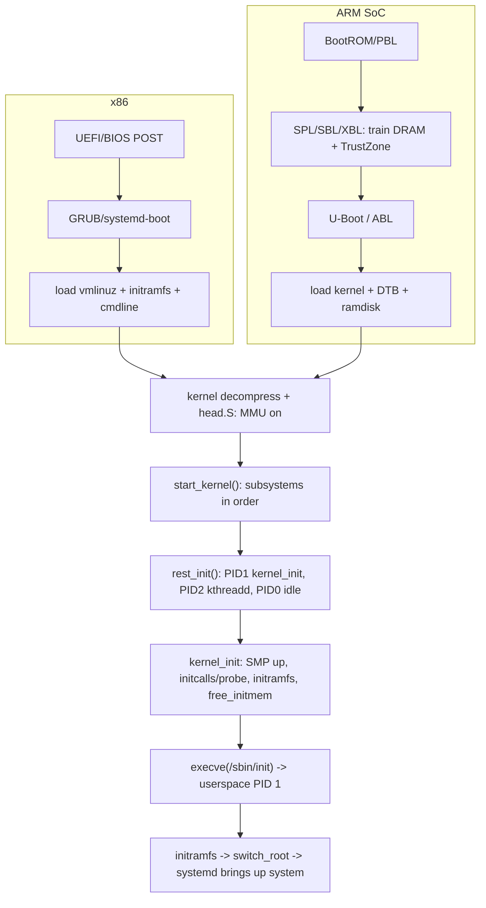

# Q25 — The Boot Sequence: Power-On to `init`/`systemd`

> **Subsystem:** Architecture · **Files:** `init/main.c`, `arch/*/kernel/head.S`, `init/initramfs.c`
> **Interviewer is really probing:** Can you trace the **whole chain** — firmware → bootloader →
> kernel decompress → `start_kernel()` → `rest_init()` → PID 1 — and the **ARM SoC** variant?

---

## TL;DR Cheat Sheet

- **x86 chain:** **firmware (UEFI/BIOS)** → **bootloader (GRUB/systemd-boot)** loads
  **kernel + initramfs + cmdline** → kernel **self-decompresses** → arch head code sets up
  **paging/CPU** → **`start_kernel()`** (the C entry) inits every subsystem → **`rest_init()`**
  spawns **PID 1 (`init`)** and the **kthreadd** (PID 2) → PID 1 mounts root and execs
  **`/sbin/init`** (usually **systemd**).
- **ARM SoC chain:** **BootROM** (mask ROM in silicon) → **SPL/primary bootloader** (e.g. Qualcomm
  **PBL → SBL/XBL**) → **secondary bootloader** (**U-Boot** or Android **ABL**) → loads **kernel +
  DTB (Q19) + initramfs** → same `start_kernel()` onward. Adds **TrustZone/secure boot** stages.
- **`start_kernel()`** highlights (order matters): `setup_arch()` (memory map, DT/ACPI) →
  `setup_per_cpu_areas()` → `mm_init()` (buddy/slab, Q2) → `sched_init()` (Q14) → `trap_init`/
  `init_IRQ()` (Q12) → `time_init` → `rcu_init` (Q7) → `console_init` → ... → `rest_init()`.
- **`rest_init()`**: creates **PID 1** (runs `kernel_init`), creates **`kthreadd` (PID 2)**, then the
  boot CPU becomes the **idle task (PID 0)**.
- **`kernel_init`** (PID 1, in process context): finishes **SMP bringup** (other CPUs online),
  runs **initcalls** (driver probes, Q19/Q20), unpacks/mounts **initramfs**, frees init memory, then
  **`execve()`** userspace `init` (systemd) — the **first userspace process**.
- **initramfs** exists to load **drivers/modules needed to find the real root** (storage, crypto,
  LVM) before pivoting to the actual root filesystem.

---

## The Question

> Walk through the boot sequence from power-on to `init`/`systemd`. Bootloader → decompression →
> `start_kernel()` → memory init → scheduler init → `rest_init()` → PID 1. For ARM SoCs add:
> BootROM → SPL → U-Boot/ABL → kernel.

---

## Why boot is staged this way

At power-on there is **almost nothing**: no RAM controller trained, no MMU, no C stack, no drivers,
one CPU running from a fixed reset vector. You can't just "start the kernel" — the kernel is a large
compressed image that needs **DRAM, a stack, and basic CPU state** to even decompress. So boot is a
**bootstrapping ladder**, each rung creating just enough environment for the next:

1. **Immutable firmware/BootROM** runs from on-chip ROM (can't be corrupted) and brings up the
   **minimum** (a bit of SRAM, the boot media) to load the next stage — and on secure systems,
   **verifies its signature** (root of trust).
2. **Bootloader(s)** train **DRAM**, initialize boot devices, and load the **kernel + initramfs +
   (on ARM) the DTB** into memory, then jump to the kernel.
3. The **kernel** decompresses itself, builds **page tables / enables the MMU** (Q1), and only then
   can run general C code (`start_kernel`) to initialize **every subsystem in dependency order**.
4. Because the kernel can't do everything in early atomic context, it **defers** the rest to a
   **process context** (PID 1, `kernel_init`) where it can sleep, probe drivers, and mount
   filesystems — finally handing off to **userspace `init`**.

The staging is fundamentally about **dependency ordering** (memory before slab before scheduler
before drivers) and **trust** (each stage verifies the next on secure-boot platforms). The **ARM SoC
chain has more stages** because SoCs do more in firmware (power management, TrustZone, multiple
bootloaders) before a general-purpose OS can run.

---

## When each stage runs / hands off

| Stage | Runs in | Hands off to |
|-------|---------|--------------|
| Firmware/BootROM | on-chip ROM, 1 CPU | bootloader |
| Bootloader (GRUB / U-Boot / XBL+ABL) | DRAM, still firmware-ish | kernel entry |
| Kernel decompressor + head.S | early, MMU being set up | `start_kernel()` |
| `start_kernel()` | single CPU, IRQs off → on | `rest_init()` |
| `rest_init()` | spawns kthreads | `kernel_init` (PID 1) |
| `kernel_init` | **process context** (can sleep) | userspace `/sbin/init` |
| systemd (PID 1 userspace) | userspace | services, login |

---

## Where in the kernel

```
arch/x86/boot/, arch/arm64/boot/   <- decompression stub, EFI stub
arch/*/kernel/head.S / head_64.S    <- early asm: stack, paging/MMU, jump to C
init/main.c                         <- start_kernel(), rest_init(), kernel_init()
init/initramfs.c                    <- unpack initramfs cpio
init/do_mounts.c                    <- mount root, prepare_namespace()
include/linux/init.h                <- initcall levels (core/postcore/arch/.../device/late)
drivers/of/fdt.c                    <- early DT parsing (ARM, Q19)
```

---

## How boot works — step by step

### 1. Firmware / BootROM (power-on)

- **x86:** **UEFI** (or legacy BIOS) initializes the platform, runs **POST**, and (UEFI) loads an
  **EFI application** — the bootloader (or the kernel's **EFI stub** directly). Reads boot order from
  NVRAM/ESP.
- **ARM SoC:** the **BootROM** (mask ROM, immutable) runs from on-chip ROM, brings up minimal SRAM,
  and loads the **first external bootloader** from boot media (eMMC/UFS/SD/SPI), often **verifying
  its signature** (secure boot root of trust). On Qualcomm: **PBL** (Primary Boot Loader in ROM).

### 2. Bootloader stages

- **x86:** **GRUB / systemd-boot** picks a kernel, loads **`vmlinuz` + `initramfs`**, sets the
  **kernel command line**, and jumps to the kernel.
- **ARM SoC (more stages, all about getting DRAM + trust up):**
  - **SPL / SBL / XBL** (Secondary/Extensible Boot Loader): **trains DRAM**, sets clocks/power, loads
    later stages. On Qualcomm, **XBL** also loads **TrustZone (TZ/QSEE)** secure-world firmware.
  - **U-Boot** (embedded) or **ABL (Android Boot Loader)**: loads **kernel image + DTB (Q19) +
    initramfs/ramdisk**, applies the **command line**, handles **fastboot**/A-B slots/verified boot
    (AVB), then jumps to the kernel with the **DTB pointer** in the expected register.

### 3. Kernel self-decompression + early arch setup

- The loaded image is usually compressed (`vmlinuz`); a small **decompressor stub** inflates the real
  **`vmlinux`** into memory.
- **`head.S`** (arch early asm): sets up an **initial stack**, builds **early page tables** and
  **enables the MMU** (paging, Q1), configures the boot CPU (mode/exception level — ARM64 drops from
  EL2/EL3 to **EL1**), zeroes BSS, and jumps to the first C function: **`start_kernel()`**. On ARM it
  passes the **DTB address** through.

### 4. `start_kernel()` — initialize everything, in order

Running on **one CPU with interrupts off** initially, it brings subsystems up in **dependency
order** (abbreviated, but the order is the interview gold):

```c
asmlinkage void start_kernel(void) {
    setup_arch(&command_line);   /* parse DT/ACPI, discover memory (memblock), arch CPU setup */
    setup_per_cpu_areas();       /* per-CPU variable areas (Q9) */
    build_all_zonelists(NULL);   /* NUMA zone lists (Q4) */
    mm_init();                   /* buddy + slab/SLUB online (Q2) -> kmalloc works */
    sched_init();                /* runqueues, idle task, scheduler (Q14) */
    trap_init(); init_IRQ();     /* exception vectors + interrupt controllers (Q12) */
    tick_init(); time_init();    /* timekeeping, clocksource */
    rcu_init();                  /* RCU (Q7) */
    console_init();              /* console -> you start seeing printk on screen */
    ...
    rest_init();                 /* never returns */
}
```
Before `mm_init()` only the early **memblock** allocator exists; after it, **`kmalloc`/`alloc_pages`
work**. Before `sched_init()` there's no scheduling; before `init_IRQ()` no device interrupts. This
**ordering is the whole point** — each subsystem depends on the previous.

### 5. `rest_init()` — create the first tasks

```c
static noinline void rest_init(void) {
    /* PID 1: will run kernel_init then exec userspace init */
    pid = user_mode_thread(kernel_init, NULL, CLONE_FS);
    /* PID 2: kthreadd — parent of all kernel threads */
    pid = kernel_thread(kthreadd, NULL, CLONE_FS | CLONE_FILES);
    ...
    /* The boot CPU becomes the idle task (PID 0) */
    cpu_startup_entry(CPUHP_ONLINE);   /* schedule(); idle loop */
}
```
Now there are three lineages: **PID 0** (idle/swapper, the original boot context), **PID 1** (init),
**PID 2** (kthreadd → spawns `kworker`, `ksoftirqd`, `kswapd`, etc.).

### 6. `kernel_init()` (PID 1) — finish bringup, then go to userspace

Runs in **process context** (can sleep, unlike early `start_kernel`):
1. **`smp_init()`** / `kernel_init_freeable()` — **bring other CPUs online** (secondary CPU bringup
   via CPU hotplug state machine).
2. **`do_initcalls()`** — run the **initcall** chain by level (`core → postcore → arch → subsys →
   fs → device → late`), which **registers buses, probes drivers** (Q19/Q20), brings up devices.
3. **Unpack initramfs** (`populate_rootfs`) into a `tmpfs` rootfs.
4. **`free_initmem()`** — free `__init` code/data (no longer needed) back to the page allocator.
5. **`run_init_process()`** — **`execve()`** the userspace init: tries the `init=` cmdline value,
   then `/sbin/init`, `/etc/init`, `/bin/init`, `/bin/sh`. This becomes **PID 1 in userspace** —
   the kernel never returns here.

### 7. initramfs → real root → systemd

- **initramfs** (early userspace) contains just enough to **find and mount the real root**: storage
  drivers/modules, LVM/RAID/crypto (`cryptsetup`), firmware. Its `/init` sets up devices (udev),
  decrypts/assembles the root, then **`switch_root`/`pivot_root`** to the real filesystem and
  **execs the real `init`** (systemd).
- **systemd** (PID 1) then brings up the system: mounts (`fstab`), starts services by **unit
  dependency** ordering and parallelism, sets up cgroups (Q4/Q14), reaches the default **target**
  (multi-user/graphical), spawns login.

---

## Diagrams

### x86 vs ARM SoC chains converging on start_kernel



### PID lineage after rest_init

```
PID 0  swapper/idle      (the original boot CPU context)
PID 1  init -> systemd   (kernel_init -> execve userspace)
PID 2  kthreadd          (parent of kworker, ksoftirqd, kswapd, ...)
```

---

## Annotated C

```c
/* init/main.c — the C entry after early asm (head.S). Single CPU, IRQs initially off. */
asmlinkage __visible void __init start_kernel(void)
{
    setup_arch(&command_line);  /* memory (memblock), DT/ACPI, CPU; before this only firmware view */
    mm_init();                  /* buddy + SLUB online -> kmalloc/alloc_pages usable (Q2) */
    sched_init();               /* scheduler + idle task (Q14) */
    init_IRQ();                 /* interrupt controllers / irq_domain (Q12) */
    rcu_init();                 /* RCU grace-period machinery (Q7) */
    console_init();             /* printk now reaches the console */
    rest_init();                /* spawn PID1/PID2, become idle — never returns */
}

/* PID 1 body: runs in PROCESS context (may sleep). */
static int __ref kernel_init(void *unused)
{
    kernel_init_freeable();     /* smp_init(): other CPUs online; do_initcalls(): probe drivers */
    free_initmem();             /* reclaim __init memory */
    /* hand control to userspace; the kernel never returns past a successful exec */
    if (execute_command) run_init_process(execute_command);  /* init= cmdline */
    run_init_process("/sbin/init");   /* usually systemd */
    run_init_process("/bin/sh");      /* fallback */
    panic("No init found.");
}
```

> Two facts that signal depth: **(1)** the **order** in `start_kernel` is a dependency chain
> (memory→slab→sched→IRQ→rcu→console); **(2)** the switch from `start_kernel` (atomic, early) to
> `kernel_init` (PID 1, **process context**) is *why* driver probing and mounting — which **sleep** —
> happen there, not in early boot (ties to Q13).

---

## Company Angle

- **Qualcomm (SoC bring-up — the headline):** the **multi-stage ARM chain** (PBL→XBL→ABL),
  **DRAM training**, **TrustZone/secure boot (AVB)**, passing the **DTB** (Q19), A/B slots, and
  power/clock setup before the kernel. Bring-up = getting each stage to hand off correctly; debugging
  with **UART logs**/`ramoops` (Q21) when there's no display.
- **NVIDIA (Tegra/Jetson):** similar multi-stage SoC boot, secure boot, DTB, early console.
- **Google (Android/ChromeOS/servers):** **initramfs**/`switch_root`, verified boot, fast boot, A/B
  updates; systemd unit ordering and cgroup setup at boot; large-fleet boot reliability.
- **AMD/Intel (x86 servers):** **UEFI** + EFI stub, ACPI table parsing in `setup_arch`, SMP bringup
  across many cores/NUMA nodes (Q15), and early memory map (`memblock`/`e820`).

---

## War Story

*"On a new Qualcomm board the kernel **hung silently** right after the bootloader jumped to it — no
console output at all. Because the display/console wasn't up yet, I enabled **`earlycon`** on the
debug **UART** (`earlycon=` + the right address from the DTB) so I'd get `printk` **before**
`console_init()` ran. That revealed the kernel was actually starting but **panicking in
`setup_arch()`** parsing the **device tree** — the bootloader (ABL) was passing a **stale/wrong DTB
address**, so memory nodes were garbage and `memblock` had no usable RAM. The fix was in the
**bootloader↔kernel handoff**: ABL had to load the correct DTB and pass its address per the ARM boot
protocol. Once the DTB was right, `start_kernel` proceeded normally to `rest_init` and userspace. Two
lessons: **`earlycon` is essential for pre-`console_init` boot debugging on SoCs**, and **the
bootloader→kernel contract (image + DTB + cmdline in the right registers) is where most SoC
bring-up bugs live** (Q19/Q21)."*

---

## Interviewer Follow-ups

1. **What does the bootloader hand the kernel?** The kernel image (loaded/decompressed), an
   **initramfs**, the **command line**, and on ARM the **DTB** address — placed where the boot
   protocol expects.

2. **Why decompress + `head.S` before C?** The kernel ships compressed and needs a **stack, MMU/page
   tables, and CPU state** before general C (`start_kernel`) can run.

3. **Why does subsystem init order matter in `start_kernel`?** Dependencies: memory/memblock →
   slab (`mm_init`) before anything `kmalloc`s; scheduler before tasks; IRQ before device interrupts;
   RCU before users; console to see output.

4. **What are PID 0, 1, 2?** PID 0 = idle/swapper (the boot context); PID 1 = init (`kernel_init` →
   userspace systemd); PID 2 = kthreadd (parent of all kernel threads).

5. **Why is driver probing in `kernel_init`, not `start_kernel`?** `kernel_init` runs in **process
   context** (can sleep); probing/mounting may block, which is illegal in early atomic boot (Q13).

6. **What is initramfs for?** Early userspace with the **drivers/tools to find and mount the real
   root** (storage, LVM, crypto) before `switch_root` to it.

7. **What are initcalls?** Functions registered at levels (core→…→device→late) run by `do_initcalls`
   to **register buses and probe drivers** in order (Q19/Q20).

8. **ARM SoC extra stages vs x86 — why?** SoCs do **DRAM training, power/clock, TrustZone/secure
   boot** across **multiple bootloaders** (BootROM→XBL→ABL) before a general OS can run; x86 firmware
   (UEFI) handles much of that.

9. **How do you debug a kernel that hangs before console?** **`earlycon`** on a debug UART to get
   `printk` before `console_init`; `ramoops`/`pstore` to capture across reboot (Q21).

---

## 30-Minute Talk Track

| Min | Cover |
|-----|-------|
| 0–4 | Why boot is staged: nothing exists at reset; bootstrapping ladder + trust |
| 4–8 | x86 chain: UEFI/BIOS → GRUB → load vmlinuz+initramfs+cmdline |
| 8–12 | ARM SoC chain: BootROM/PBL → XBL (DRAM+TrustZone) → U-Boot/ABL → kernel+DTB |
| 12–15 | Decompression + head.S: stack, MMU/paging on, EL drop, jump to C |
| 15–21 | start_kernel order: setup_arch → mm_init → sched_init → init_IRQ → rcu → console |
| 21–24 | rest_init: PID1 kernel_init, PID2 kthreadd, PID0 idle |
| 24–27 | kernel_init: SMP bringup, initcalls/probe, initramfs, free_initmem, execve init |
| 27–30 | initramfs → switch_root → systemd; war story (earlycon + bad DTB handoff) |
