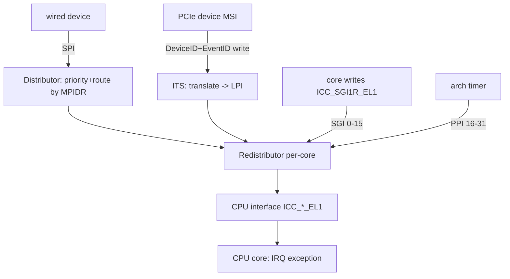
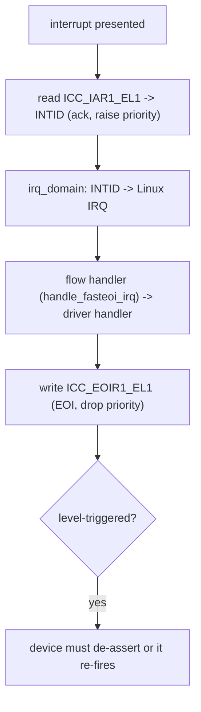

# Q1 — GIC Architecture Deep Dive (GICv2 / v3 / v4, ITS, LPIs)

> **Subsystem:** Interrupt Controllers (ARM) · **Files:** `drivers/irqchip/irq-gic-v3.c`, `irq-gic-v3-its.c`, `irq-gic.c`
> **Interviewer is really probing (Qualcomm/ARM favorite):** Do you understand the **GIC's internal
> blocks** (Distributor / Redistributor / CPU interface / ITS), the **interrupt types** (SGI/PPI/SPI/LPI),
> and how **GICv3 system registers + the ITS** changed MSI handling on ARM?

---

## TL;DR Cheat Sheet

- The **GIC (Generic Interrupt Controller)** is ARM's standard interrupt controller. It **prioritizes,
  routes, masks, and acknowledges** interrupts and delivers them to CPU cores.
- **Interrupt types (by INTID range):**
  - **SGI** (0–15) — **Software Generated Interrupts**: inter-processor (IPIs, Q5), per-CPU.
  - **PPI** (16–31) — **Private Peripheral Interrupts**: per-CPU private lines (e.g. the **arch timer**, Q25).
  - **SPI** (32–1019) — **Shared Peripheral Interrupts**: normal wired device interrupts, routable to any CPU.
  - **LPI** (8192+) — **Locality-specific Peripheral Interrupts**: **MSI-backed**, message-signaled, managed by the **ITS** (GICv3+).
- **GICv2 blocks:** **Distributor** (`GICD`, global routing/priority of SPIs) + **CPU Interface**
  (`GICC`, per-core, MMIO) — limited to **8 CPUs**, no MSI translation in hardware.
- **GICv3 blocks:** **Distributor** (`GICD`, SPIs) + per-CPU **Redistributor** (`GICR`, handles SGIs/PPIs/
  **LPIs**) + **CPU interface via system registers** (`ICC_*_EL1`, not MMIO — faster) + the **ITS**
  (Interrupt Translation Service) that turns device **MSIs** into **LPIs**. Scales to **huge CPU counts**
  (affinity routing by `MPIDR`).
- **GICv4/4.1:** adds **direct injection of virtual LPIs** to running VMs (vSGIs in 4.1) — bypasses the
  hypervisor for VM interrupt delivery (KVM/virtualization).
- Linux models the GIC as **hierarchical `irq_domain`s** (Q3): GIC domain → ITS/MSI domain → device.

---

## The Question

> Walk me through the ARM GIC architecture. What are the Distributor, Redistributor, CPU interface, and
> ITS? What are SGIs/PPIs/SPIs/LPIs, and what changed from GICv2 to GICv3/v4?

What they want: the **block diagram in your head**, the **interrupt-type taxonomy**, why **GICv3 moved to
system registers + an ITS for MSI**, and how it maps onto Linux's **irq_domain/irqchip** model.

---

## Why the GIC exists (and why it evolved)

A System-on-Chip has **hundreds of interrupt sources** — peripherals, timers, inter-core signals,
PCIe/MSI devices — and a handful of CPU cores, each with only a couple of exception entry points (IRQ/FIQ).
Something must sit between them to:

- **prioritize** (a high-priority timer should preempt a low-priority UART),
- **route** an interrupt to a **specific** CPU (affinity) or a group of CPUs,
- **mask/unmask** individual sources,
- provide **acknowledge/EOI** so a level-triggered device doesn't re-interrupt forever,
- and signal cores between each other (**IPIs**).

That's the **GIC**. Its evolution tracks two hardware pressures:

1. **Core counts exploded.** GICv2's **MMIO CPU interface** and 8-CPU affinity limit couldn't scale to
   modern many-core ARM servers/SoCs. **GICv3** replaced the per-core MMIO `GICC` with **system-register**
   access (`ICC_*_EL1`) — far lower latency (no MMIO round-trip) — and introduced **affinity routing** by
   `MPIDR` (hierarchical Aff3.Aff2.Aff1.Aff0) so interrupts can target any of thousands of cores.

2. **MSI/MSI-X needed hardware translation.** PCIe and modern peripherals signal interrupts by **writing to
   memory** (MSI, Q4), not asserting a wire. GICv2 had no native translation; GICv3 added the **ITS**, which
   takes a device's MSI write (a `DeviceID` + `EventID`) and **translates** it into an **LPI** routed to a
   **Redistributor**/CPU — enabling huge numbers of message-signaled interrupts with per-interrupt affinity.

So the GIC is **the** ARM interrupt-routing fabric, and the senior story is *why* v3 split work into a
global **Distributor**, per-CPU **Redistributors**, system-register **CPU interfaces**, and an **ITS** for
MSI — all to **scale cores and message-signaled interrupts**.

---

## When each block / type is involved

| Element | Handles | Per-CPU? |
|---------|---------|----------|
| **Distributor (GICD)** | SPIs: global priority, routing, enable | no (global) |
| **Redistributor (GICR)** | SGIs, PPIs, **LPIs** for one core | yes (one per core) |
| **CPU interface (ICC_\*_EL1 / GICC)** | delivery to the core, ack, EOI, priority mask | yes |
| **ITS** | translates device **MSIs → LPIs** | no (shared, table-driven) |
| **SGI** | IPIs (reschedule, function calls, TLB shootdown) | yes |
| **PPI** | per-core devices (arch timer, PMU, CPU-local) | yes |
| **SPI** | wired peripherals (UART, GPIO, I2C controllers) | routable |
| **LPI** | MSI/MSI-X (PCIe, high-vector-count devices) | routed via ITS |

---

## Where in the kernel

```
drivers/irqchip/irq-gic-v3.c       <- GICv3 driver: Distributor + Redistributor + ICC sysreg access
drivers/irqchip/irq-gic-v3-its.c   <- ITS: device tables, ITT, MSI->LPI translation, LPI affinity
drivers/irqchip/irq-gic-v3-its-pci-msi.c <- PCIe MSI glue on top of the ITS
drivers/irqchip/irq-gic.c          <- GICv2 (Distributor + MMIO CPU interface)
drivers/irqchip/irq-gic-v4.c       <- GICv4 vLPI/vSGI direct injection (KVM)
Device tree: interrupt-controller node (compatible "arm,gic-v3"), #interrupt-cells, msi-controller
```

Linux exposes the GIC as `irq_chip` ops (mask/unmask/eoi/set_affinity) plus **hierarchical irq_domains**
(Q3): the root GIC domain for SGIs/PPIs/SPIs, and a stacked **ITS/MSI domain** for LPIs.

---

## How the GIC works — step by step

### 1. The GICv3 block diagram

```
                 +------------------------------------------------+
   SPIs (wired)  |                 Distributor (GICD)             |  global: priority, enable, route SPIs
   devices  ---->|  routes SPI to a target core's Redistributor   |  by affinity (MPIDR)
                 +------------------------------------------------+
                          |                         |
                 +-----------------+       +-----------------+
   PCIe MSI ---> |   ITS           |       |  Redistributor  |  per-CPU: SGIs(0-15), PPIs(16-31),
   (DeviceID,    | DeviceID+EventID|------>|   (GICR) core0  |  LPIs (pending/config tables in RAM)
    EventID)     |   -> LPI        |       +-----------------+
                 +-----------------+                |
                                            +-----------------+
                                            | CPU interface   |  ICC_*_EL1 system registers:
                                            | (ICC_*_EL1)     |  ack (IAR), priority mask (PMR), EOI
                                            +-----------------+
                                                    |
                                                  CPU core (IRQ/FIQ)
```

- **Distributor (`GICD`):** one global block. Owns **SPIs** — their enable bits, priorities, trigger
  config (level/edge), and **routing** (which core/affinity handles each SPI). Programs `GICD_IROUTER`.
- **Redistributor (`GICR`):** **one per core**. Owns that core's **SGIs (0–15)** and **PPIs (16–31)**, and
  the core's **LPI** configuration/pending tables (held in **RAM**, since LPIs can number in the millions).
- **CPU interface:** in GICv3 accessed via **system registers `ICC_*_EL1`** (not MMIO). The core reads
  `ICC_IAR1_EL1` to **acknowledge** and get the INTID, sets **priority mask** via `ICC_PMR_EL1`, and writes
  `ICC_EOIR1_EL1` to **EOI**.
- **ITS (Interrupt Translation Service):** a separate, table-driven engine that converts an incoming **MSI
  write** — identified by a **DeviceID** (which device) and **EventID** (which of the device's interrupts) —
  into an **LPI INTID** routed to a target Redistributor/collection. Uses in-memory tables (Device table →
  per-device **ITT**, Interrupt Translation Table).

### 2. Interrupt type taxonomy (by INTID)

```
0    - 15   SGI   Software Generated  -> IPIs (Q5), per-CPU, written via ICC_SGI1R_EL1
16   - 31   PPI   Private Peripheral  -> per-core (arch timer @30, PMU, etc.) (Q25)
32   - 1019 SPI   Shared Peripheral   -> wired devices, routable to any core (Distributor)
8192 +      LPI   Locality-specific   -> MSI-backed, ITS-translated (GICv3+), config/pending in RAM
```
SGIs and PPIs are **banked per CPU** (each core has its own copies in its Redistributor); SPIs are global;
LPIs are message-signaled and edge-only (no level LPIs).

### 3. The delivery sequence (an SPI example)

1. A device asserts its **SPI** line into the **Distributor**.
2. The Distributor checks the SPI's **enable**, **priority**, and **routing** (`GICD_IROUTER`), and forwards
   it to the target core's **Redistributor**/**CPU interface** if priority beats the running priority.
3. The core takes an **IRQ exception**; the kernel reads **`ICC_IAR1_EL1`** to **acknowledge** and obtain the
   **INTID** (this raises the running priority).
4. Linux's generic IRQ layer maps INTID → Linux IRQ (`irq_domain`, Q3) and runs the **flow handler**
   (`handle_fasteoi_irq` for the GIC, Q7) → the registered handler(s) (Q9).
5. The kernel writes **`ICC_EOIR1_EL1`** to **EOI** (drop priority); for level interrupts the device must
   also be de-asserted by the handler, else it re-fires.

### 4. The ITS path (an MSI/LPI)

1. A PCIe device performs an **MSI memory write** to the ITS's `GITS_TRANSLATER` with its **DeviceID** +
   **EventID** (programmed by Linux when the driver requested MSI-X, Q4).
2. The **ITS** looks up the **Device table** → the device's **ITT** → maps (DeviceID, EventID) → an **LPI
   INTID** and a **collection** (which Redistributor/CPU).
3. The LPI is delivered to the target **Redistributor**, which uses its in-RAM **LPI config/pending tables**
   to present it to the core (priority, enable). Then the normal ack/EOI flow runs.
4. **Affinity** for an LPI is changed by issuing ITS commands (`MOVI`/`MAPI`) to re-target the collection —
   which is why MSI affinity on ARM goes through ITS command queues, not a simple register write.

### 5. GICv4 — virtual interrupts

**GICv4/4.1** lets the ITS deliver **virtual LPIs (vLPIs)** — and in 4.1, **virtual SGIs** — **directly to a
running guest** vCPU without trapping to the hypervisor. The ITS maintains **vPE (virtual processor)** tables
so a passthrough device's MSI can be injected straight into the VM. Big for **KVM device passthrough /
SR-IOV** performance (fewer VM exits).

---

## Diagrams

### Type routing



### Ack/EOI cycle



---

## Annotated C

```c
/* GICv3 chip ops (drivers/irqchip/irq-gic-v3.c, simplified). */
static struct irq_chip gic_chip = {
    .name           = "GICv3",
    .irq_mask       = gic_mask_irq,        /* GICD/GICR enable-clear */
    .irq_unmask     = gic_unmask_irq,
    .irq_eoi        = gic_eoi_irq,         /* writes ICC_EOIR1_EL1 */
    .irq_set_type   = gic_set_type,        /* level vs edge (GICD_ICFGR) */
    .irq_set_affinity = gic_set_affinity,  /* SPI: GICD_IROUTER (MPIDR) */
};

/* Acknowledge: read the Interrupt Acknowledge Register (system register). */
static u32 gic_read_iar(void) { return read_sysreg_s(SYS_ICC_IAR1_EL1); }
/* End of interrupt. */
static void gic_write_eoir(u32 irq) { write_sysreg_s(irq, SYS_ICC_EOIR1_EL1); }

/* Sending an SGI (IPI, Q5) via system register, targeting affinity. */
static void gic_send_sgi(u64 cluster_id, u16 tlist, unsigned int irq) {
    u64 val = /* encode Aff3/Aff2/Aff1 + target list + INTID */;
    write_sysreg_s(val, SYS_ICC_SGI1R_EL1);   /* fire SGI to target cores */
}

/* ITS: map an MSI (DeviceID,EventID) to an LPI + collection (target CPU). */
/* its_setup_irq -> its_send_mapd/mapti/movi commands on the ITS command queue */
```

> Senior nuance: GICv3's **system-register CPU interface** (`ICC_*_EL1`) is a big latency win over GICv2's
> MMIO `GICC` — acknowledging/EOIing an interrupt is now a **register read/write**, not an MMIO transaction.
> And **LPIs live in RAM** (config/pending tables) precisely because MSI vector counts are huge — the ITS +
> Redistributor table model is what makes millions of MSIs feasible on ARM.

---

## Company Angle

- **Qualcomm/ARM (the headline):** GICv3/v4 internals are core SoC knowledge — Distributor/Redistributor/
  ITS, SGI/PPI/SPI/LPI, `MPIDR` affinity routing, device-tree `interrupts`/`interrupt-controller`/
  `msi-controller` bindings (Q3), and how PPIs back the arch timer/PMU (Q25). PM/wakeup (Q24) and PREEMPT_RT
  (Q22) ride on this.
- **NVIDIA (Tegra/ARM + GPU):** ITS/LPI for PCIe MSI-X (Q4), GICv4 vLPI for VM passthrough, IPIs (Q5).
- **AMD/Intel:** mostly x86 APIC (Q2) — good to **contrast** GIC's Distributor/Redistributor/ITS with
  IO-APIC/Local-APIC + the MSI model.
- **Google (ARM servers):** GICv3 affinity routing at high core counts, ITS scaling for many-queue NICs,
  IRQ affinity (Q15).

---

## War Story

*"On a new ARM64 server platform, a multi-queue NIC's MSI-X interrupts were all landing on **CPU0** despite
us setting per-queue affinity. The NIC used **LPIs** via the **ITS**, and affinity for an LPI isn't a simple
register write — it requires the ITS to **re-map the interrupt's collection** to a new Redistributor via an
ITS command (`MOVI`). Our platform's **ITS command queue** wasn't being flushed/synced correctly by a buggy
firmware/driver combo, so the affinity changes were **silently dropped** and every LPI stayed mapped to the
boot CPU's collection. We confirmed via `/proc/interrupts` (all counts on CPU0) and by tracing the ITS
command queue. The fix was on the irqchip/ITS side — ensuring `MOVI` commands were issued and the command
queue **synced** (`SYNC` command + readback) on `set_affinity`. After that, queues spread across cores. The
interviewer's follow-up — *'why is ARM MSI affinity different from x86?'* — let me explain that on x86 you
reprogram the **MSI message** (address/data) to target a different APIC, whereas on **GICv3** the device
keeps writing the **same** ITS `GITS_TRANSLATER`, and it's the **ITS translation tables** that decide the
target — so affinity = an **ITS command**, not a device-register rewrite."*

---

## Interviewer Follow-ups

1. **What are the GICv3 blocks?** Distributor (global SPIs), per-CPU Redistributor (SGIs/PPIs/LPIs), CPU
   interface via `ICC_*_EL1` system registers, and the ITS (MSI→LPI translation).

2. **SGI vs PPI vs SPI vs LPI?** SGI (0–15) = IPIs/per-CPU software; PPI (16–31) = per-core devices (arch
   timer); SPI (32–1019) = shared wired peripherals; LPI (8192+) = MSI-backed via ITS.

3. **What changed from GICv2 to v3?** MMIO CPU interface → **system registers** (lower latency); 8-CPU limit
   → **MPIDR affinity routing** (many cores); added the **ITS** for MSI→LPI; per-CPU Redistributors.

4. **What does the ITS do?** Translates a device MSI (DeviceID + EventID) into an LPI and a target collection
   (CPU), using in-memory device/translation tables; affinity changes = ITS commands.

5. **Why do LPIs live in RAM?** MSI vector counts are huge; LPI config/pending state is kept in
   Redistributor tables in memory rather than registers.

6. **How is an interrupt acknowledged/EOI'd on GICv3?** Read `ICC_IAR1_EL1` (ack + get INTID), write
   `ICC_EOIR1_EL1` (EOI); level interrupts also need the device de-asserted.

7. **How does Linux model the GIC?** As `irq_chip` ops + **hierarchical irq_domains** (Q3): GIC root domain
   for SGI/PPI/SPI, a stacked ITS/MSI domain for LPIs.

8. **What does GICv4 add?** Direct injection of **virtual LPIs** (and vSGIs in 4.1) to running guests —
   bypassing the hypervisor for VM interrupt delivery (KVM passthrough).

9. **How is an SGI sent?** Write `ICC_SGI1R_EL1` with the target affinity + INTID (used for IPIs, Q5).

---

## 30-Minute Talk Track

| Min | Cover |
|-----|-------|
| 0–3 | Why a GIC: prioritize/route/mask/EOI/IPI for many sources & cores |
| 3–8 | Interrupt type taxonomy: SGI/PPI/SPI/LPI and their INTID ranges + banking |
| 8–14 | GICv3 blocks: Distributor, per-CPU Redistributor, ICC_*_EL1 CPU interface |
| 14–18 | The ITS: DeviceID+EventID → LPI translation, device tables/ITT, collections |
| 18–22 | Delivery sequence: ack (IAR), flow handler, EOI; level vs edge de-assert |
| 22–25 | GICv2→v3 evolution: sysreg interface, MPIDR affinity, why MSI needed ITS |
| 25–28 | GICv4 vLPI/vSGI for VMs; Linux irq_domain/irqchip mapping (Q3) |
| 28–30 | War story (ITS affinity / MOVI) + ARM-vs-x86 MSI affinity contrast |
