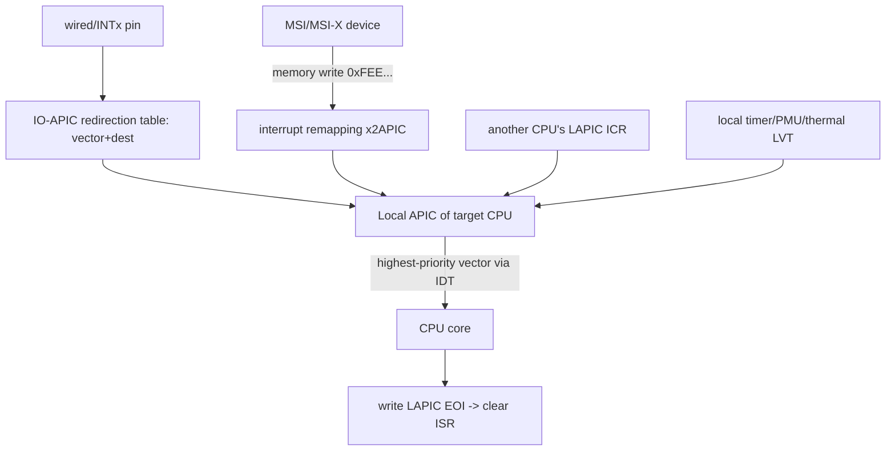

# Q2 — x86 APIC: Local APIC, IO-APIC, and x2APIC

> **Subsystem:** Interrupt Controllers (x86) · **Files:** `arch/x86/kernel/apic/`, `drivers/irqchip/`, `arch/x86/include/asm/apic.h`
> **Interviewer is really probing (AMD/Intel favorite):** Do you understand the **APIC pair** (Local APIC
> per CPU + IO-APIC), **delivery modes**, the **vector** abstraction, **EOI**, and why **x2APIC** exists?

---

## TL;DR Cheat Sheet

- x86 interrupt routing uses two cooperating pieces:
  - **Local APIC (LAPIC):** **one per CPU core**. Receives interrupts (from IO-APIC, MSI, IPIs, the local
    timer), prioritizes them, delivers to the core, and handles **EOI**. Also **sends IPIs** (Q5) via the
    **ICR** (Interrupt Command Register).
  - **IO-APIC:** routes **wired (legacy/INTx) device interrupts** (pins) to a target LAPIC by programming
    **redirection table entries** (vector, delivery mode, destination).
- A **vector** (0–255, usable ~32–255) is the x86 interrupt number the CPU dispatches through the **IDT**.
  Devices are assigned vectors; the LAPIC delivers by vector + priority (upper 4 bits = priority class).
- **MSI/MSI-X** (Q4) bypass the IO-APIC: the device **writes to a special address** (`0xFEE...`) encoding the
  **destination APIC + vector**, delivered straight to a LAPIC — no redirection-table entry needed.
- **Delivery modes:** Fixed, Lowest-Priority, NMI, SMI, INIT, **IPI/Startup**; **destination modes:**
  physical (APIC ID) vs logical (bitmask).
- **x2APIC:** a newer LAPIC mode using **MSRs instead of MMIO**, with a **32-bit APIC ID** — required to
  address **>255 CPUs** and faster (MSR access, no MMIO). Enabled via the **interrupt-remapping** unit.
- **EOI:** the handler writes the LAPIC **EOI register** to dismiss the highest in-service interrupt; for
  level IO-APIC interrupts a directed EOI/remote-IRR handshake clears the source.

---

## The Question

> Explain x86 interrupt delivery: Local APIC vs IO-APIC, vectors, delivery modes, EOI, and what x2APIC adds.

What they want: the **LAPIC-per-CPU + IO-APIC** split, the **vector/IDT** abstraction, how **MSI** sidesteps
the IO-APIC, **EOI** mechanics, and the **x2APIC** scaling motivation — ideally contrasted with the ARM GIC
(Q1).

---

## Why the APIC architecture exists

Like the GIC on ARM (Q1), x86 needs hardware to **route, prioritize, mask, and acknowledge** interrupts from
many sources to many cores. x86's answer is the **APIC (Advanced Programmable Interrupt Controller)**, which
replaced the ancient 8259 **PIC** (two cascaded chips, 15 IRQs, no SMP). The design splits responsibility:

- **Per-core delivery & prioritization → Local APIC.** Each core has its own LAPIC that decides *which*
  pending interrupt to deliver next (by **priority**), presents it to the core via the **IDT vector**, and
  handles **EOI** and **IPIs**. Putting this in each core is what makes **SMP** interrupt handling scale —
  every CPU independently manages its own interrupt state and can receive interrupts targeted at it.
- **Wired-device routing → IO-APIC.** Legacy/INTx device pins connect to an **IO-APIC**, whose
  **redirection table** maps each input pin to a **(vector, destination CPU, delivery mode)** — i.e. it
  decides which LAPIC a wired interrupt goes to.

Two further pressures drove evolution:

1. **Message-signaled interrupts (MSI/MSI-X, Q4):** PCIe devices signal by **writing memory**, not asserting
   a pin. These writes go to a magic address range that the platform routes **directly to a LAPIC** — no
   IO-APIC redirection entry, so devices can have **many** independent vectors with per-vector destination.
2. **Core counts > 255 and speed:** the legacy ("xAPIC") LAPIC uses **MMIO** and an **8-bit APIC ID** (max
   255 addressable). **x2APIC** switches to **MSR**-based access (faster, no MMIO) and a **32-bit APIC ID**,
   enabling large servers — and needs **interrupt remapping** (VT-d/AMD-Vi IOMMU) to securely route/x2APIC
   interrupts.

So the senior framing parallels Q1: a **per-CPU interface (LAPIC)** + a **routing block (IO-APIC)** + a
**message-signaled path (MSI)** + a **scaling upgrade (x2APIC)** — the same problems the GIC solves, with
different hardware names. Being able to **map APIC↔GIC** concepts is a strong signal.

---

## When each element is involved

| Source | Path |
|--------|------|
| Legacy/wired (INTx) device | device pin → **IO-APIC** redirection entry → **LAPIC** → core (vector via IDT) |
| **MSI/MSI-X** device (PCIe) | device memory write (`0xFEE...`) → (remapping) → **LAPIC** → core |
| **IPI** (Q5) | source LAPIC **ICR** → target LAPIC(s) → core |
| **Local timer / PMU / thermal** | **LAPIC** local sources → core |
| **NMI** | special delivery mode → core's NMI handler |

---

## Where in the kernel

```
arch/x86/kernel/apic/apic.c        <- LAPIC setup, EOI, local timer, spurious vector
arch/x86/kernel/apic/io_apic.c     <- IO-APIC redirection table, legacy IRQ routing
arch/x86/kernel/apic/x2apic_*.c    <- x2APIC (cluster/physical) MSR-based access
arch/x86/kernel/apic/msi.c         <- MSI domain on x86 (Q4), vector assignment
arch/x86/kernel/idt.c, apic/vector.c <- IDT, per-CPU vector allocation (apic_chip_data)
arch/x86/include/asm/apic.h        <- apic driver abstraction, EOI, ICR
drivers/iommu/intel/irq_remapping.c, amd/  <- interrupt remapping (x2APIC, security)
```

x86 also models interrupts through **irq_domain** (Q3): a vector domain, the IO-APIC domain, and the MSI
domain are **stacked**.

---

## How x86 interrupt delivery works — step by step

### 1. The two APIC pieces

```
        +-------------------+         +------------------------+
wired   |     IO-APIC       |         |   Local APIC (core 0)  |  per-core: ISR/IRR/TMR,
pins -->| redirection table |-------->|   priority, vector,    |  TPR/PPR priority, EOI,
        | (vector,dest,mode)|         |   local timer, ICR     |  sends/receives IPIs
        +-------------------+         +------------------------+
                                                 |  (IDT vector)
MSI/MSI-X device --memory write 0xFEE...-------> |  --> CPU core
                                                 +------------------------+
                                       (each core has its own Local APIC)
```

- **LAPIC registers:** **IRR** (Interrupt Request Register — pending), **ISR** (In-Service Register —
  being handled), **TMR** (Trigger Mode), **TPR/PPR** (Task/Processor Priority — masking by priority class),
  **EOI** register, **ICR** (send IPIs), **LVT** (Local Vector Table — local timer/PMU/thermal/LINT pins).
- **IO-APIC redirection table:** one entry per input pin → **(vector, destination APIC, delivery mode,
  trigger, mask)**.

### 2. Vectors and the IDT

x86 dispatches interrupts through the **IDT (Interrupt Descriptor Table)** indexed by an 8-bit **vector**
(0–255). The low 32 are CPU exceptions; the rest (~32–255) are available for device interrupts and IPIs. The
LAPIC delivers the **highest-priority pending vector** (priority = upper 4 bits of the vector / TPR class) to
the core, which jumps to that IDT entry → the kernel's interrupt entry stub → the generic IRQ layer
(`irq_domain` maps vector → Linux IRQ, Q3 → flow handler, Q7). **Vector allocation** is a scarce, per-CPU
resource (only ~220 usable), managed by `arch/x86/kernel/apic/vector.c` — a real constraint for MSI-X-heavy
systems (Q4).

### 3. Wired delivery via IO-APIC

For a legacy/INTx device: the IO-APIC's redirection entry says "pin 5 → vector 0x41, destination LAPIC of
CPU2, fixed, level." When the pin asserts, the IO-APIC sends a message to **CPU2's LAPIC**, which raises the
vector. For **level** interrupts, the IO-APIC tracks **remote IRR** until the LAPIC signals EOI back
(directed EOI) so the source can re-assert correctly.

### 4. MSI delivery (bypassing the IO-APIC)

An **MSI** (Q4) device writes a value to a special **address** in the `0xFEE00000` range; the address encodes
the **destination APIC** and the data encodes the **vector + delivery mode**. The platform (with **interrupt
remapping** under x2APIC/IOMMU) delivers it straight to the target **LAPIC** — no IO-APIC entry. This is why
MSI-X scales: each vector independently targets a CPU, configured by reprogramming the device's MSI message
(which is also how x86 **MSI affinity** works — contrast ARM's ITS commands, Q1).

### 5. EOI

When the handler finishes, it writes the LAPIC **EOI register**, which clears the highest **ISR** bit and
lets the next-priority interrupt through. For **level IO-APIC** interrupts, the EOI is also propagated to the
IO-APIC (remote-IRR clear) so the line can re-trigger. Edge/MSI interrupts just need the LAPIC EOI. The
kernel's **fasteoi** flow handler (Q7) drives this. A **spurious-interrupt vector** (0xFF) handles the case
where an interrupt is withdrawn before delivery.

### 6. x2APIC

Legacy **xAPIC** accesses the LAPIC via **MMIO** at a fixed physical page and uses an **8-bit APIC ID** (≤255
addressable CPUs). **x2APIC**:
- accesses the LAPIC via **MSRs** (no MMIO → faster, and per-CPU naturally),
- uses a **32-bit APIC ID** (address huge core counts),
- supports **cluster logical** addressing for efficient multicast IPIs,
- requires **interrupt remapping** (Intel VT-d / AMD-Vi) to be enabled — which also provides **security**
  (an MSI can only target permitted vectors/CPUs) and **isolation** for passthrough/virtualization.

Big servers run in **x2APIC mode** by default. The remapping unit is the x86 analogue of the GIC ITS's role
in mediating MSIs.

---

## Diagrams

### Sources → LAPIC → core



### Priority/EOI

```
LAPIC: IRR (pending) --deliver highest--> ISR (in service) --handler--> write EOI --> clear ISR bit
       TPR/PPR mask by priority class; level IO-APIC EOI also clears remote-IRR at the IO-APIC
```

---

## Annotated C

```c
/* The apic driver abstraction (arch/x86/include/asm/apic.h) — xapic vs x2apic. */
struct apic {
    void (*eoi)(void);                       /* write LAPIC EOI register */
    void (*send_IPI)(int cpu, int vector);   /* via ICR (Q5) */
    void (*send_IPI_mask)(const struct cpumask *, int vector);
    u32  (*get_apic_id)(u32 reg);            /* 8-bit (xapic) vs 32-bit (x2apic) */
    bool (*is_x2apic)(void);
};

/* EOI: dismiss the in-service interrupt. */
static inline void apic_eoi(void) { apic->eoi(); }   /* MMIO write (xapic) or MSR (x2apic) */

/* Per-CPU vector allocation (arch/x86/kernel/apic/vector.c) — a scarce resource. */
struct apic_chip_data {
    struct irq_cfg cfg;        /* assigned vector + destination apicid */
    cpumask_var_t  domain;     /* CPUs the vector is valid on */
};
/* MSI affinity = reprogram the device's MSI message (address/data) to a new vector/CPU. */
```

> Senior nuance: the **vector is per-CPU and scarce** (~220 usable). On MSI-X-heavy systems (many NICs/NVMe
> queues, Q4) you can **exhaust vectors**, and the allocator must spread them across CPUs — a real-world
> constraint that doesn't exist the same way on ARM (LPIs are abundant, ITS-managed, Q1). x86 **MSI affinity
> = rewrite the device's MSI message**; ARM affinity = an ITS command — a clean contrast to draw.

---

## Company Angle

- **AMD/Intel (the headline):** LAPIC/IO-APIC/x2APIC internals, **vector exhaustion** with MSI-X multi-queue
  (NVMe/GPU/NIC, Q4), **interrupt remapping** (AMD-Vi/VT-d) for x2APIC + passthrough security, IPIs and
  **TLB-shootdown** vectors (Q5), many-core IRQ affinity (Q15).
- **NVIDIA (x86 GPU hosts):** MSI-X vector allocation/affinity for GPUs, x2APIC on big servers, IPI cost.
- **Google (x86 fleet):** x2APIC at scale, IRQ affinity/RPS (Q15/Q16), vector pressure, observability via
  `/proc/interrupts` (Q21).
- **Qualcomm:** mostly ARM/GIC (Q1) — value is in **contrasting** APIC vs GIC (per-CPU interface, MSI path,
  affinity mechanism).

---

## War Story

*"A dense server with many **MSI-X**-heavy NVMe drives and NICs failed to bring up all device queues —
drivers logged `-ENOSPC` from `pci_alloc_irq_vectors`. Root cause: **x86 vector exhaustion**. Each MSI-X
vector needs a **per-CPU vector** (only ~220 usable per CPU), and we were requesting one vector **per queue
per device** across dozens of devices — the global pool, spread across CPUs, ran dry. `/proc/interrupts`
showed the allocated vectors piling onto a few CPUs. Fixes: (1) reduced queues-per-device to a sane multiple
of CPU count (you rarely need more queues than CPUs); (2) ensured **managed/auto affinity**
(`PCI_IRQ_AFFINITY`, Q15) spread vectors **across all CPUs** instead of clustering; (3) confirmed **x2APIC +
interrupt remapping** were enabled so we weren't limited by the 8-bit APIC ID. Queues came up and load
spread. The interviewer's follow-up — *'how is this different on ARM?'* — let me explain ARM **LPIs** are
abundant and **ITS-managed** (Q1), so you don't hit a tight per-CPU vector cap the same way; x86's
**IDT-vector scarcity** is a distinctly x86 scaling constraint."*

---

## Interviewer Follow-ups

1. **Local APIC vs IO-APIC?** LAPIC is **per-core** (delivery, priority, EOI, IPIs, local timer); IO-APIC
   **routes wired device pins** to a target LAPIC via its redirection table.

2. **What is a vector?** The 8-bit IDT index (≈32–255 usable) the CPU dispatches through; devices/IPIs are
   assigned vectors; priority is the upper 4 bits.

3. **How does MSI differ from IO-APIC routing?** MSI is a **memory write** to `0xFEE...` encoding
   destination+vector, delivered straight to a LAPIC — no IO-APIC redirection entry; enables many independent
   per-vector destinations.

4. **How is EOI done?** Write the LAPIC **EOI register** (clears the in-service bit); level IO-APIC
   interrupts also clear remote-IRR at the IO-APIC so the line can re-trigger.

5. **What does x2APIC add and why?** MSR-based access (faster, no MMIO) and a **32-bit APIC ID** (>255 CPUs);
   requires **interrupt remapping** (VT-d/AMD-Vi), which also adds security/isolation.

6. **What are delivery modes?** Fixed, Lowest-Priority, NMI, SMI, INIT, Startup (IPI); destination modes
   physical (APIC ID) vs logical (bitmask) — used for IPIs (Q5) and routing.

7. **How does x86 MSI affinity work?** Reprogram the device's **MSI message** (address/data) to target a
   different APIC/vector — contrast ARM's **ITS command** (Q1).

8. **What's vector exhaustion?** Only ~220 usable per-CPU vectors; MSI-X-heavy systems can run out, so the
   allocator must spread vectors and drivers must size queues sanely.

9. **What replaced the 8259 PIC and why?** The APIC — for **SMP** (per-CPU LAPIC), more interrupts, and
   message-signaled delivery the cascaded PIC couldn't do.

---

## 30-Minute Talk Track

| Min | Cover |
|-----|-------|
| 0–3 | Why APIC (vs 8259 PIC): SMP, routing, priority, MSI; parallels to GIC (Q1) |
| 3–8 | LAPIC per core: IRR/ISR/TPR, local timer/LVT, EOI, ICR; IO-APIC redirection table |
| 8–12 | Vectors & the IDT; priority classes; per-CPU vector allocation (scarcity) |
| 12–16 | Wired delivery via IO-APIC; level remote-IRR/EOI handshake |
| 16–20 | MSI/MSI-X bypassing IO-APIC; 0xFEE address; affinity = rewrite MSI message (Q4) |
| 20–24 | x2APIC: MSR access, 32-bit APIC ID, interrupt remapping (VT-d/AMD-Vi), security |
| 24–27 | EOI mechanics; spurious vector; APIC↔GIC concept mapping |
| 27–30 | War story (vector exhaustion) + ARM-vs-x86 affinity/vector contrast |
