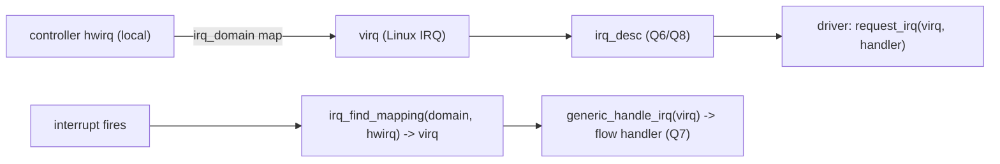
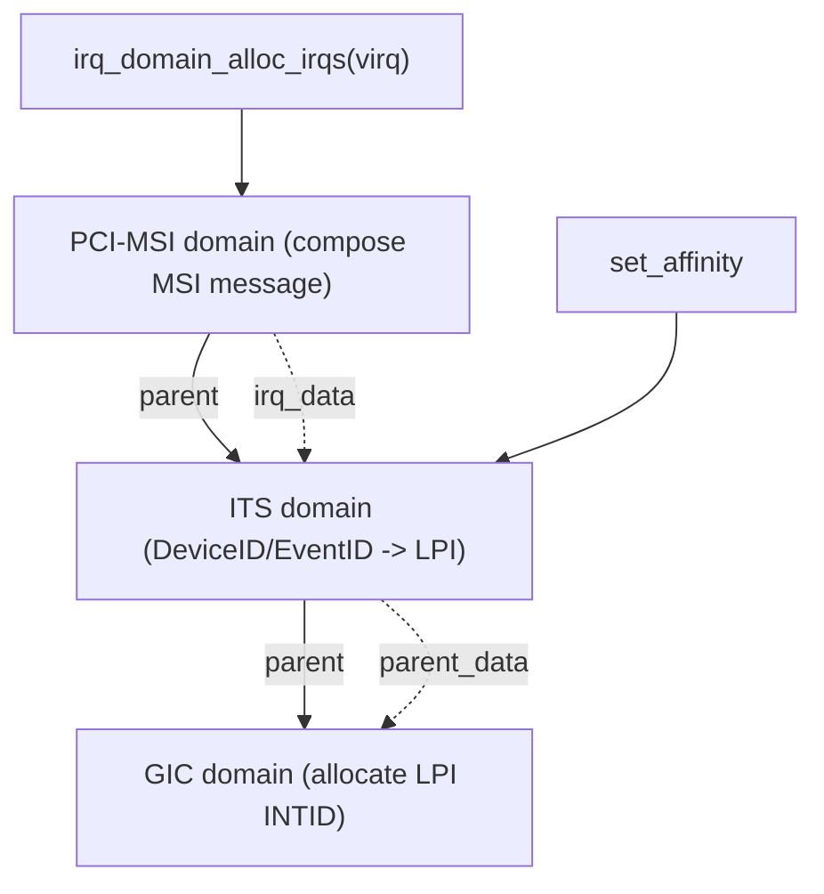

# Q3 — irq_domain and Hierarchical IRQ Domains

> **Subsystem:** Generic IRQ / Controllers · **Files:** `kernel/irq/irqdomain.c`, `include/linux/irqdomain.h`, `drivers/irqchip/`
> **Interviewer is really probing:** Do you understand the **hwirq ↔ Linux virq** mapping, **why** a
> translation layer exists, and how **hierarchical (stacked) domains** model real controller topologies
> (GIC → ITS/MSI → device, or GIC → GPIO)?

---

## TL;DR Cheat Sheet

- An **`irq_domain`** maps a controller-local **hardware IRQ number (`hwirq`)** to a kernel-global **Linux
  IRQ number (`virq`)**. Drivers use the **stable `virq`** (`request_irq(virq, ...)`); the domain hides which
  controller/pin/hwirq actually produced it.
- **Why:** there are **many** interrupt controllers (GIC, GPIO expanders, PCI MSI, cascaded chips), each with
  its own hwirq numbering. Without a translation layer you'd have global hwirq collisions and brittle, fixed
  IRQ numbering. The domain gives each controller its own hwirq space, mapped into one Linux virq space.
- **Mapping storage:** linear array (small fixed controllers), **radix tree** (sparse, e.g. MSI), or a
  trivial 1:1 — chosen per controller (`irq_domain_create_linear/tree`).
- **Hierarchical / stacked domains:** real topologies are **layered** — a PCIe MSI interrupt passes through
  **GIC ITS → GIC** (ARM) or **MSI → vector → IO-APIC/remap** (x86). A **hierarchical irq_domain** stacks
  these so each layer programs its own hardware (`alloc`/`free`/`activate` walk the stack). Each `irq_data`
  has a **`parent_data`** pointer up the chain.
- **DT/ACPI translation:** `irq_domain_translate`/`xlate` converts a device-tree `interrupts =
  <...>` specifier (or ACPI) into `(hwirq, type)`; `irq_create_fwspec_mapping` / `irq_of_parse_and_map`
  produce the `virq` a driver uses.

---

## The Question

> What is an `irq_domain` and why does it exist? Explain hwirq vs virq, the mapping structures, and how
> hierarchical irq_domains model layered controllers (GIC/ITS/MSI, GPIO cascades).

---

## Why irq_domain exists

A modern system has a **tree of interrupt controllers**, not one. The root might be a **GIC** (Q1) or
**APIC** (Q2); below it hang **GPIO controllers** (each GPIO line is an interrupt source), **PCI MSI**
(thousands of message-signaled vectors), **PMICs**, secondary **cascaded** controllers, etc. Each controller
numbers **its own** interrupts from 0 — GPIO chip A's "line 5" and GPIO chip B's "line 5" are different
interrupts, and neither is the GIC's SPI 5.

If drivers used **raw hardware numbers**, you'd have:
- **collisions** (every controller's hwirq 5 means something different),
- **fragility** (hard-coded global IRQ numbers that change with board/SoC),
- **no clean way** to express that an interrupt **flows through multiple controllers** before reaching the
  CPU.

The **`irq_domain`** solves the first two: it gives each controller a **private hwirq space** and maps each
used hwirq to a **unique kernel-global `virq`** (Linux IRQ number) that drivers request. The mapping is
created on demand (sparse IRQs, Q8), so you only allocate `irq_desc`s for interrupts actually in use.

**Hierarchical irq_domains** solve the third — and are the senior topic. A real interrupt often traverses
**several controllers**: a PCIe device's MSI on ARM goes **device → ITS → GIC → CPU**; on x86 **device → MSI
→ remap → vector/IO-APIC → LAPIC**. Each layer has **its own hardware to program** (the ITS needs a
translation entry; the GIC needs an LPI config; the MSI layer needs the message written). A **stacked**
domain models this: allocating one Linux IRQ **walks down the stack**, letting each domain configure its
piece, and the `irq_data` chain (`parent_data`) records the per-layer hwirq. This replaced the old ad-hoc
"chained handler" hacks with a clean, composable model — which is why it underpins **GIC ITS, x86 MSI, GPIO,
and partitioned/nested controllers**.

---

## When irq_domain is used

| Moment | irq_domain action |
|--------|-------------------|
| controller driver init | **create** a domain (`irq_domain_create_linear/tree`, hierarchical) |
| DT/ACPI parse of a device's `interrupts` | **translate** specifier → `(hwirq, type)`; create mapping → `virq` |
| `platform_get_irq` / `irq_of_parse_and_map` | resolve a device's IRQ to a `virq` |
| MSI allocation (Q4) | **hierarchical alloc** down MSI→ITS/remap→GIC/vector domains |
| interrupt fires | controller code does **`irq_find_mapping(domain, hwirq)`** → `virq` → flow handler (Q7) |
| affinity/mask | hierarchical ops walk the stack (each layer's `irq_chip`) |

---

## Where in the kernel

```
kernel/irq/irqdomain.c        <- irq_domain create/alloc/free, mapping (linear/tree), translate,
                                 hierarchical: irq_domain_alloc_irqs, irq_domain_set_hwirq_and_chip
include/linux/irqdomain.h     <- struct irq_domain, irq_domain_ops, hierarchy helpers
kernel/irq/irqdesc.c          <- virq <-> irq_desc (sparse, Q8)
drivers/irqchip/irq-gic-v3.c, irq-gic-v3-its.c <- root + stacked ITS/MSI domains (Q1/Q4)
arch/x86/kernel/apic/{vector,msi,io_apic}.c    <- x86 stacked domains
drivers/gpio/ (gpiolib-of)    <- GPIO controllers as irq_domains (cascaded)
```

---

## How it works — mechanics

### 1. hwirq ↔ virq mapping

```
controller (e.g. GPIO chip): hwirq 0..N  (its own local numbering)
        irq_domain  --maps-->  virq (kernel-global Linux IRQ)  --indexes-->  irq_desc (Q6/Q8)
   driver calls request_irq(virq, handler, ...)  -- never sees hwirq
   on interrupt: chip reads hwirq -> irq_find_mapping(domain, hwirq) -> virq -> generic_handle_irq(virq)
```
The domain stores the hwirq→virq map in one of:
- **linear** (`irq_domain_create_linear`): a fixed-size array — for controllers with a small, dense hwirq
  range (a GIC's SPIs, a GPIO bank).
- **tree** (`irq_domain_create_tree`): a **radix tree** — for **sparse** spaces (MSI, where hwirqs are large
  and scattered).
- **nomap/1:1**: hwirq == virq (rare).

### 2. Creating a mapping

```c
/* controller driver, at probe: */
domain = irq_domain_create_linear(fwnode, nr_irqs, &my_domain_ops, priv);

/* my_domain_ops->map: bind a virq to this controller's chip + flow handler */
static int my_map(struct irq_domain *d, unsigned int virq, irq_hw_number_t hwirq) {
    irq_domain_set_info(d, virq, hwirq, &my_irq_chip, d->host_data,
                        handle_level_irq, NULL, NULL);  /* picks flow handler (Q7) */
    return 0;
}
```
`irq_create_mapping(domain, hwirq)` (or DT/ACPI helpers) allocates a `virq`, allocates the `irq_desc` (Q8),
and calls `->map` to attach the **`irq_chip`** (mask/ack/eoi, Q6) and **flow handler** (Q7).

### 3. DT/ACPI translation

A device tree node says `interrupts = <0 42 4>` (GIC: SPI, hwirq 42, level-high) and `interrupt-parent =
<&gic>`. The kernel:
```
of_irq_parse → fwspec {fwnode=gic, param=[0,42,4]}
   → domain->ops->translate(fwspec) → (hwirq=32+42, type=LEVEL_HIGH)
   → irq_create_fwspec_mapping() → virq
```
`platform_get_irq()` / `irq_of_parse_and_map()` wrap this so a driver just gets a `virq`. The **`#interrupt-
cells`** count and the controller's `xlate`/`translate` op define the specifier format (e.g. GIC uses 3
cells: type, number, flags).

### 4. Hierarchical (stacked) domains — the core topic

For layered controllers, domains are **stacked** with `parent` links, and each Linux IRQ has a **chain of
`irq_data`** (one per layer) via `parent_data`:

```
PCIe MSI (ARM example):
   [ PCI-MSI domain ] --parent--> [ ITS domain ] --parent--> [ GIC domain ]
   alloc one virq -> irq_domain_alloc_irqs walks DOWN:
        GIC domain:  allocate an LPI INTID, set gic_chip
        ITS domain:  program DeviceID/EventID -> LPI translation, set its_irq_chip
        PCI-MSI dom: compose the MSI message (addr/data) for the device, set pci_msi chip
   irq_data chain:  pci_msi_data -> its_data -> gic_data   (each .chip + .hwirq for its layer)
```
- **`alloc`** (bottom-up creation) and **`activate`** configure each layer; **`free`** tears down in reverse.
- A request like **`set_affinity`** is handled by the layer that owns it (the ITS/GIC), walking
  `parent_data` until a domain implements the op (`irq_chip_set_affinity_parent`).
- This is exactly how **GIC ITS/MSI** (Q1/Q4) and **x86 MSI → remap → vector** (Q2/Q4) are built, and how
  **GPIO/cascaded** controllers attach beneath the GIC.

### 5. Cascaded (chained) vs hierarchical

- **Chained handler** (older/simpler): the parent IRQ's handler **demultiplexes** into the child domain
  (e.g. a GPIO controller is one GIC SPI; its handler reads the GPIO status and calls
  `generic_handle_domain_irq(gpio_domain, line)`). Used when the child isn't a true "stacked" hardware layer.
- **Hierarchical**: each layer is real hardware in the **delivery path** that must be programmed per-IRQ
  (MSI/ITS/remap). Modern, composable, supports per-IRQ alloc/affinity across layers.

---

## Diagrams

### hwirq → virq → irq_desc



### Hierarchical domain stack (PCIe MSI on ARM)



---

## Annotated C

```c
/* A domain and its ops. */
struct irq_domain {
    const struct irq_domain_ops *ops;
    struct irq_domain *parent;        /* hierarchical: next layer down */
    irq_hw_number_t hwirq_max;
    void *host_data;
    /* linear: unsigned int *linear_revmap;  tree: struct radix_tree_root */
};

struct irq_domain_ops {
    int  (*translate)(struct irq_domain *, struct irq_fwspec *,
                      unsigned long *hwirq, unsigned int *type);   /* DT/ACPI -> hwirq */
    int  (*map)(struct irq_domain *, unsigned int virq, irq_hw_number_t hwirq);
    /* hierarchical: */
    int  (*alloc)(struct irq_domain *, unsigned int virq, unsigned int nr, void *arg);
    void (*free)(struct irq_domain *, unsigned int virq, unsigned int nr);
    int  (*activate)(struct irq_domain *, struct irq_data *, bool reserve);
};

/* Per-IRQ data carries the per-layer chip + hwirq and a pointer up the stack. */
struct irq_data {
    irq_hw_number_t hwirq;            /* this layer's hwirq */
    struct irq_chip *chip;            /* this layer's chip ops */
    struct irq_data *parent_data;     /* next layer down (hierarchical) */
    struct irq_domain *domain;
};

/* Resolve a device's IRQ to a virq (drivers use this, not hwirq). */
unsigned int irq_of_parse_and_map(struct device_node *node, int index);
int platform_get_irq(struct platform_device *pdev, unsigned int num);
unsigned int irq_create_mapping(struct irq_domain *domain, irq_hw_number_t hwirq);
unsigned int irq_find_mapping(struct irq_domain *domain, irq_hw_number_t hwirq);
```

> Senior nuance: the **`irq_data` → `parent_data` chain** is the heart of hierarchical domains — one Linux
> IRQ has **multiple `irq_data` layers**, each with its own `irq_chip` and `hwirq`, so a single
> `set_affinity`/`mask` is dispatched to the **layer that owns** that operation (e.g. affinity at the ITS,
> masking at the GIC). This is why MSI on modern kernels "just works" across device → translation → root
> controller.

---

## Company Angle

- **Qualcomm/ARM (the headline):** GIC + **GPIO/PMIC cascaded** domains, **ITS/MSI** hierarchical stacks
  (Q1/Q4), device-tree `interrupts`/`interrupt-parent`/`#interrupt-cells` translation, pinctrl/GPIO IRQs.
  Core SoC bring-up knowledge.
- **NVIDIA/AMD/Intel (MSI):** x86 **MSI → remap → vector** and ARM **MSI → ITS → GIC** hierarchical domains
  (Q4); per-IRQ alloc/affinity across layers; vector/LPI management.
- **Google (servers):** scalable MSI domains for many-queue NICs, affinity dispatch through the hierarchy
  (Q15).
- **All:** `irq_domain` is the unifying abstraction behind Q1, Q2, Q4 — expect it as the conceptual glue.

---

## War Story

*"A GPIO-connected sensor's interrupt **never reached its driver** on a new board. The GPIO controller is a
**cascaded irq_domain** hanging off a GIC SPI — its handler demuxes the GIC interrupt into per-line child
IRQs. The bug was a **device-tree translation** mismatch: the sensor node's `interrupts` specifier used the
wrong **`#interrupt-cells`** format / wrong `interrupt-parent`, so `irq_domain` translated it to the **wrong
hwirq** (or failed to map), and `platform_get_irq` returned a `virq` that was never wired to the GPIO line
that actually fired. I traced it with `/proc/interrupts` (no counts on the expected line), `irq_domain`
debugfs (`/sys/kernel/debug/irq/domains`), and DT decompile. Fixing the specifier to match the GPIO
controller's domain `xlate` (correct cells: line number + flags, correct `interrupt-parent = <&gpio>`) made
the mapping resolve to the right hwirq → virq, and the IRQ fired. The interviewer's follow-up — *'cascaded
vs hierarchical here?'* — let me explain a GPIO controller is usually a **cascaded/chained** domain (its
parent handler demuxes), whereas **MSI/ITS** is **hierarchical/stacked** (each layer programs hardware in the
delivery path) — and `irq_domain` cleanly supports both."*

---

## Interviewer Follow-ups

1. **What does an irq_domain do?** Maps a controller's **hwirq** to a kernel-global **virq** so drivers use
   stable Linux IRQ numbers regardless of which controller/pin produced the interrupt.

2. **Why is the translation needed?** Many controllers each number interrupts locally; the domain avoids
   collisions, gives sparse on-demand mapping (Q8), and models layered delivery.

3. **Linear vs tree mapping?** Linear = fixed array for small dense hwirq ranges (GIC SPIs, GPIO bank); tree
   = radix tree for **sparse** spaces (MSI). Chosen per controller.

4. **What is a hierarchical irq_domain?** Stacked domains (`parent` links) modeling layered controllers; one
   virq has an `irq_data` chain (`parent_data`), and alloc/activate/free walk the stack so each layer
   programs its hardware.

5. **Give a hierarchical example.** PCIe MSI: PCI-MSI domain → ITS domain → GIC domain (ARM), or MSI → remap
   → vector/IO-APIC (x86); each layer assigns its hwirq and chip.

6. **How is affinity dispatched in a hierarchy?** It walks `parent_data` until a layer implements
   `set_affinity` (e.g. the ITS/GIC) — `irq_chip_set_affinity_parent`.

7. **How does DT translation work?** `interrupts` specifier + `#interrupt-cells` → `translate`/`xlate` →
   `(hwirq, type)` → `irq_create_fwspec_mapping` → virq; drivers use `platform_get_irq`.

8. **Cascaded vs hierarchical?** Cascaded = a parent handler **demuxes** into a child domain (GPIO
   controller on one SPI); hierarchical = each layer is real delivery-path hardware programmed per-IRQ (MSI).

9. **How do you get from hwirq back to virq at interrupt time?** `irq_find_mapping(domain, hwirq)` →
   `generic_handle_domain_irq` → flow handler (Q7).

---

## 30-Minute Talk Track

| Min | Cover |
|-----|-------|
| 0–4 | Tree of controllers; why raw hwirq collides; need a translation layer |
| 4–8 | hwirq ↔ virq mapping; irq_desc (Q8); drivers use virq only |
| 8–12 | Mapping storage: linear vs radix tree vs nomap; irq_create_mapping/map op |
| 12–16 | DT/ACPI translation: interrupts specifier, #interrupt-cells, xlate → virq |
| 16–22 | Hierarchical domains: stacked layers, irq_data parent_data chain, alloc/activate/free walk |
| 22–25 | MSI example (PCI→ITS→GIC / MSI→remap→vector); affinity dispatch up the stack |
| 25–28 | Cascaded vs hierarchical (GPIO demux vs MSI stack) |
| 28–30 | War story (DT translation/cascaded GPIO) + the unifying abstraction |
