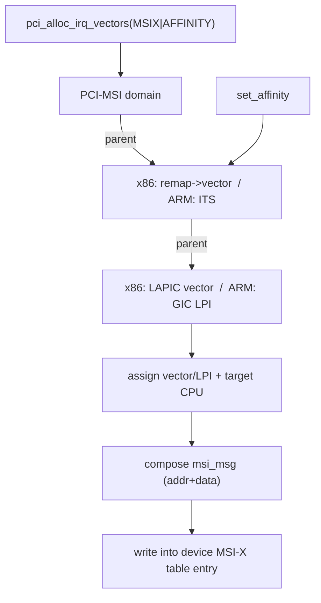

# Q4 — MSI / MSI-X Internals and the MSI irq_domain Hierarchy

> **Subsystem:** Controllers / PCI · **Files:** `drivers/pci/msi/`, `kernel/irq/msi.c`, `arch/x86/kernel/apic/msi.c`, `drivers/irqchip/irq-gic-v3-its-pci-msi.c`
> **Interviewer is really probing (NVIDIA/AMD favorite):** Do you understand MSI as a **memory write**,
> the difference between **MSI and MSI-X**, **multi-queue** vector allocation/affinity, and the **MSI domain
> hierarchy**?

---

## TL;DR Cheat Sheet

- **MSI (Message Signaled Interrupts)** = a device signals an interrupt by **writing a value to a special
  memory address**, instead of asserting a physical wire (INTx). The write is routed by the platform to a
  CPU's interrupt controller (LAPIC on x86, via the ITS→LPI on ARM GICv3).
- **MSI vs MSI-X:**
  - **MSI:** up to **32** vectors, but they must be **contiguous** and share one address; limited masking.
  - **MSI-X:** up to **2048** vectors, each with its **own table entry** (independent address+data → own
    target CPU + vector), per-vector **masking**, table in device BAR memory. Preferred for **multi-queue**.
- **Why:** no shared wires (no INTx storms / "is it mine?" polling, Q10), **many independent vectors** for
  multi-queue devices (NICs/NVMe/GPUs), and **per-vector CPU affinity** for locality and scaling.
- **Allocation:** `pci_alloc_irq_vectors(pdev, min, max, PCI_IRQ_MSIX | PCI_IRQ_MSI | PCI_IRQ_AFFINITY)` →
  returns N vectors; `pci_irq_vector(pdev, i)` gives the Linux IRQ for queue *i*; `request_irq` each.
- **MSI irq_domain hierarchy (Q3):** PCI-MSI domain → (x86) **remap → vector** or (ARM) **ITS → GIC** —
  each layer programs its piece; the **top layer composes the MSI message** (address/data) written into the
  device's MSI/MSI-X capability.
- **Affinity:** x86 = rewrite the device's **MSI message**; ARM = **ITS command** (Q1). `PCI_IRQ_AFFINITY`
  auto-spreads vectors across CPUs (managed affinity, Q15).

---

## The Question

> Explain MSI and MSI-X. How do they differ from wired interrupts and from each other? How are vectors
> allocated for a multi-queue device, and how does the MSI irq_domain hierarchy work?

What they want: **MSI = memory write**, the **MSI vs MSI-X** table/vector differences, the **multi-queue +
affinity** story (the real reason modern devices use MSI-X), and the **hierarchical domain** plumbing (Q3).

---

## Why MSI/MSI-X exists

Legacy **wired interrupts (INTx)** have crippling limitations for modern high-throughput devices:

- **Shared lines:** PCI INTx pins are **shared** among devices, so an interrupt handler must **poll its
  device** to ask "was it me?" (`IRQ_NONE` if not, Q10) — wasteful, and prone to **storms** and "nobody
  claimed it" spurious handling.
- **One interrupt per function:** a wire can't express **many independent** interrupt sources. A modern NIC
  has **dozens of queues**, each wanting its **own** interrupt steered to a **specific CPU** (the one that
  submitted the work, for cache locality). A single shared wire funnels everything to one place.
- **No affinity granularity:** you can't independently target different CPUs per queue with one line.

**MSI** fixes the sharing and the "is it mine?" problem: the device **writes a unique value to memory** to
signal a specific interrupt, so each MSI is **unambiguous** (no polling) and **not shared**. **MSI-X** then
fixes scale and flexibility: a **per-vector table** in the device gives up to **2048** vectors, each with its
**own address+data** — so each queue gets its **own interrupt** targeting its **own CPU**, independently
maskable. This is what enables **multi-queue NICs/NVMe/GPUs** to scale interrupt processing across all cores
(pairs with NAPI/RPS, Q16/Q15).

The senior framing: **MSI converts interrupts from scarce, shared wires into abundant, independently-routed
memory writes** — which is the foundation of modern device interrupt scaling. The kernel plumbing
(`pci_alloc_irq_vectors` + the **hierarchical MSI domain**, Q3) is how this maps onto the GIC/APIC.

---

## When MSI vs MSI-X vs INTx

| Situation | Choice |
|-----------|--------|
| Multi-queue NIC/NVMe/GPU (many vectors, per-CPU affinity) | **MSI-X** |
| Few interrupts, simple device | **MSI** (≤32, contiguous) |
| Legacy device / no MSI capability | **INTx** (shared wire, Q10) |
| Need per-vector masking | **MSI-X** (MSI masking is limited) |
| Vector-constrained x86 host | size MSI-X queues to CPU count (vector scarcity, Q2) |

---

## Where in the kernel

```
drivers/pci/msi/msi.c, irqdomain.c  <- pci_alloc_irq_vectors, MSI/MSI-X capability programming, msi_desc
kernel/irq/msi.c                    <- generic MSI framework, msi_domain, msi_desc, platform MSI
arch/x86/kernel/apic/msi.c          <- x86 MSI domain (compose 0xFEE address/data), vector alloc
drivers/irqchip/irq-gic-v3-its-pci-msi.c, irq-gic-v3-its.c <- ARM ITS PCI MSI domain (Q1)
drivers/iommu/intel|amd (irq remap) <- x86 interrupt remapping for MSI (Q2)
include/linux/msi.h                 <- struct msi_desc, msi_msg (address/data)
```

---

## How MSI/MSI-X works — mechanics

### 1. MSI is a memory write

A device's MSI/MSI-X capability holds a **message address** and **message data**. To raise interrupt *i*, the
device performs a **posted memory write** of `data_i` to `address_i`. On x86 the address is in the
`0xFEE00000` range encoding the **destination LAPIC**, and the data encodes the **vector + delivery mode**
(Q2); on ARM GICv3 the write targets the **ITS `GITS_TRANSLATER`** with the device's **DeviceID/EventID**,
which the ITS translates to an **LPI** (Q1). Either way, **no wire** — the interrupt is a transaction on the
memory/PCIe fabric.

### 2. MSI vs MSI-X details

```
MSI:    one capability, ONE address + data; up to 32 vectors but data low bits vary -> vectors must be
        CONTIGUOUS and share a destination; masking is per-function/limited.
MSI-X:  a TABLE in device BAR memory, one entry PER vector:
            entry = { message address, message data, vector control (mask bit) }
        up to 2048 entries -> each vector independently targets its own CPU+vector and is maskable.
```
MSI-X's **per-entry address+data** is the key: queue 0's completion interrupt can go to CPU0, queue 31's to
CPU31 — independently configured by the kernel (this is what `PCI_IRQ_AFFINITY` programs).

### 3. Allocating vectors (driver view)

```c
/* request up to nr_queues vectors, MSI-X preferred, auto-spread affinity across CPUs */
int n = pci_alloc_irq_vectors(pdev, 1, nr_queues,
                              PCI_IRQ_MSIX | PCI_IRQ_MSI | PCI_IRQ_AFFINITY);
for (i = 0; i < n; i++) {
    int irq = pci_irq_vector(pdev, i);          /* Linux IRQ (virq, Q3) for queue i */
    request_irq(irq, queue_isr, 0, "dev-qN", &queues[i]);
}
```
- `pci_alloc_irq_vectors` tries **MSI-X**, falls back to **MSI**, then **INTx** (per flags), returning how
  many it got (it may be **fewer** than requested — vector scarcity on x86, Q2).
- **`PCI_IRQ_AFFINITY`** enables **managed affinity** (Q15): the kernel **spreads** the vectors across CPUs
  and pins each (`IRQD_AFFINITY_MANAGED`) so queue *i*'s interrupt lands on a sensible CPU — and the device's
  queue-to-CPU mapping should match.

### 4. The MSI irq_domain hierarchy (Q3)

Each MSI is a Linux IRQ created through a **stacked domain**:

```
x86:   [ PCI-MSI domain ] -> [ IRQ remapping domain ] -> [ x86 vector domain ]
ARM:   [ PCI-MSI domain ] -> [ ITS domain ]            -> [ GIC domain ]
alloc N vectors -> irq_domain_alloc_irqs walks DOWN:
   vector/GIC layer: assign a vector / LPI INTID + target CPU
   remap/ITS layer:  program the remap entry / DeviceID+EventID -> LPI translation
   PCI-MSI layer:    COMPOSE the msi_msg (address+data) and WRITE it into the device's MSI-X table
```
The **bottom** layer (vector/GIC) owns the actual interrupt resource; the **top** (PCI-MSI) **writes the
message** the device will use. When you set **affinity**, the request walks the hierarchy to the layer that
re-targets (x86 vector domain rewrites the message / ARM ITS issues a `MOVI`).

### 5. `msi_desc` — per-vector bookkeeping

Each MSI vector has a **`struct msi_desc`** attached to the PCI device: it records the **message
(address/data)**, the **mask** state, the entry index, and the associated `virq`. Masking an MSI-X vector =
setting the **vector control mask bit** in the table entry (true per-vector masking, unlike INTx). The
generic MSI framework (`kernel/irq/msi.c`) manages these and is reused for **platform MSI** (non-PCI devices
that use message interrupts).

### 6. Affinity, interrupt remapping, and security

- **x86 affinity** = recompute and **rewrite the MSI message** (new destination APIC/vector). With
  **interrupt remapping** (VT-d/AMD-Vi, Q2), the message instead indexes a **remap table entry** the kernel
  controls — adding **security** (a device can't forge an arbitrary vector/CPU) and enabling **x2APIC** and
  **passthrough** (the IOMMU remaps guest MSIs).
- **ARM affinity** = an **ITS command** retargeting the LPI's collection (Q1).
- For **VM passthrough/SR-IOV**, remapping/ITS (GICv4 vLPI) lets device MSIs reach the right vCPU safely.

---

## Diagrams

### INTx vs MSI vs MSI-X

```
INTx:    device --asserts shared wire--> one IRQ line (shared) -> "is it mine?" poll (Q10)
MSI:     device --memory write (1 addr, <=32 data)--> controller -> few contiguous vectors
MSI-X:   device --per-entry write (2048 entries, own addr+data+mask)--> controller
            queue0 -> CPU0 vectorA ;  queue31 -> CPU31 vectorZ  (independent affinity + mask)
```

### Allocation + hierarchy



---

## Annotated C

```c
/* Per-vector MSI descriptor (include/linux/msi.h). */
struct msi_desc {
    unsigned int irq;          /* the Linux IRQ (virq) for this vector */
    struct msi_msg msg;        /* the address+data the device writes */
    unsigned int msi_index;    /* MSI-X table entry index */
    /* masking state, pci_dev backpointer ... */
};
struct msi_msg { u32 address_lo, address_hi, data; };  /* what the device writes to signal */

/* Driver: allocate, map, request. */
int n = pci_alloc_irq_vectors_affinity(pdev, min, max,
            PCI_IRQ_MSIX | PCI_IRQ_AFFINITY, &affd);  /* managed, auto-spread (Q15) */
int irq = pci_irq_vector(pdev, i);                    /* virq for vector i */
request_irq(irq, isr, 0, name, data);
/* ... */
pci_free_irq_vectors(pdev);

/* MSI-X masking = set the per-entry vector control bit (true per-vector mask). */
/* pci_msix_mask_irq() / __pci_msix_desc_mask_irq() toggles the table entry mask. */
```

> Senior nuance: the headline is **per-vector independence** — MSI-X gives each queue its **own address+data**
> (own CPU + vector) **and** its own **mask bit**, which is exactly what multi-queue scaling needs. The
> kernel composes those messages through the **hierarchical domain** (Q3) and re-targets them on
> `set_affinity` (x86: rewrite message; ARM: ITS command). And remember **x86 vectors are scarce** (Q2) —
> `pci_alloc_irq_vectors` may return fewer than asked; size queues to CPU count.

---

## Company Angle

- **NVIDIA/AMD (GPU/NVMe — the headline):** MSI-X multi-queue, `pci_alloc_irq_vectors`, per-queue affinity
  for completion-interrupt locality, vector budgeting, IRQ remapping for passthrough; GICv4 vLPI (ARM) for VM
  MSI injection (Q1).
- **Google (networking):** MSI-X per-queue NIC interrupts + **RPS/RFS/NAPI** (Q16), managed affinity (Q15)
  to spread across cores for high PPS.
- **Intel/AMD (x86):** vector exhaustion (Q2), interrupt remapping (VT-d/AMD-Vi), x2APIC interplay.
- **Qualcomm/ARM:** ITS-based PCI MSI (Q1), platform MSI for non-PCI message interrupts, DT `msi-parent`.

---

## War Story

*"A multi-queue NIC delivered **all** completion interrupts to **CPU0**, capping throughput while 31 cores
idled — the softirq/NAPI work (Q16) all piled on one core. The driver had requested a **single MSI** vector
(legacy path), so every queue's interrupt funneled to one Linux IRQ on one CPU. I switched it to
**`pci_alloc_irq_vectors(..., PCI_IRQ_MSIX | PCI_IRQ_AFFINITY)`** to allocate **one MSI-X vector per queue**
with **managed affinity** (Q15), and made the driver map **queue *i* → vector *i*** and steer each queue's
work to the CPU its vector targets (cache locality). `/proc/interrupts` then showed interrupts **spread
across all CPUs**, and throughput scaled with cores while tail latency dropped. The interviewer's follow-up —
*'what if `pci_alloc_irq_vectors` returns fewer than you asked?'* — let me explain **x86 vector scarcity**
(Q2): you handle the smaller count gracefully (fewer queues), and `PCI_IRQ_AFFINITY` still spreads what you
got; on **ARM** LPIs are abundant via the ITS (Q1), so you rarely hit that wall there."*

---

## Interviewer Follow-ups

1. **What is MSI fundamentally?** An interrupt signaled by a **memory write** to a special address (not a
   wire); the platform routes it to a CPU's interrupt controller.

2. **MSI vs MSI-X?** MSI ≤32 contiguous vectors, one address, limited masking; MSI-X up to **2048**
   per-entry vectors (own address+data+mask) — independent per-vector affinity, preferred for multi-queue.

3. **Why MSI over INTx?** No shared wires (no "is it mine?" polling / storms, Q10), many independent vectors,
   per-vector CPU affinity for scaling/locality.

4. **How do you allocate vectors?** `pci_alloc_irq_vectors(pdev, min, max, flags)` → may return fewer than
   `max`; `pci_irq_vector(pdev, i)` → Linux IRQ; `request_irq` each; `PCI_IRQ_AFFINITY` auto-spreads (Q15).

5. **How does the MSI irq_domain hierarchy work?** Stacked domains (Q3): PCI-MSI → remap/ITS → vector/GIC;
   alloc walks down assigning resources, the top composes the **message** written into the device table.

6. **How is MSI affinity changed?** x86: rewrite the device's **MSI message** (new APIC/vector); ARM: an
   **ITS command** retargeting the LPI collection (Q1).

7. **What is `msi_desc`?** Per-vector kernel bookkeeping — the message (address/data), mask state, entry
   index, and associated Linux IRQ.

8. **Why does interrupt remapping matter for MSI?** It indexes a kernel-controlled remap table (security: no
   forged vectors), enables x2APIC (>255 CPUs, Q2), and supports **passthrough** (remap guest MSIs).

9. **What limits MSI-X scaling on x86?** **Vector scarcity** (~220 usable per CPU, Q2) — size queues to CPU
   count; ARM LPIs are abundant via the ITS.

---

## 30-Minute Talk Track

| Min | Cover |
|-----|-------|
| 0–4 | INTx limitations (shared wires, "is it mine?", one interrupt/function); why MSI |
| 4–8 | MSI = memory write; x86 0xFEE address+data; ARM ITS GITS_TRANSLATER → LPI (Q1) |
| 8–12 | MSI vs MSI-X: per-entry table, 2048 vectors, independent addr+data+mask |
| 12–16 | Multi-queue scaling: per-queue vector + per-CPU affinity (locality, Q15/Q16) |
| 16–20 | pci_alloc_irq_vectors / pci_irq_vector / PCI_IRQ_AFFINITY; fewer-than-asked handling |
| 20–24 | MSI irq_domain hierarchy (Q3): PCI-MSI → remap/ITS → vector/GIC; compose & write message |
| 24–27 | Affinity (rewrite message vs ITS command); interrupt remapping/security/passthrough |
| 27–30 | War story (single MSI → MSI-X per-queue) + vector-scarcity & ARM contrast |
