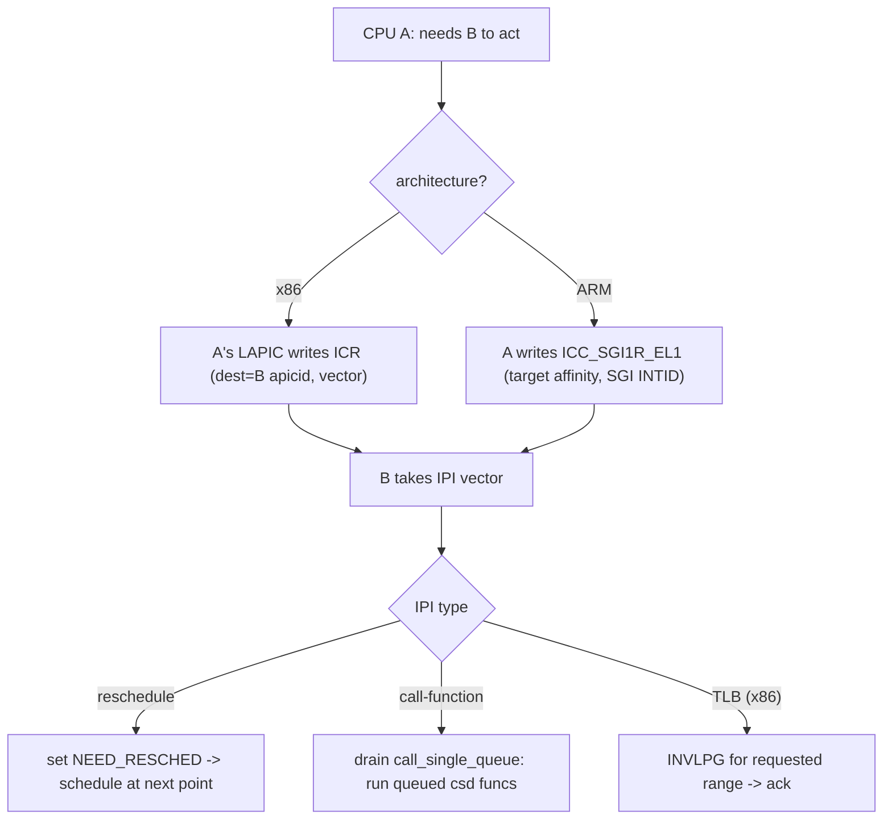

# Q5 — IPIs: Inter-Processor Interrupts

> **Subsystem:** Controllers / SMP · **Files:** `kernel/smp.c`, `arch/x86/kernel/smp.c`, `arch/arm64/kernel/smp.c`, `drivers/irqchip/`
> **Interviewer is really probing (AMD/NVIDIA favorite):** Do you understand how one CPU **interrupts
> another**, the **standard IPI types** (reschedule, call-function, TLB-shootdown), and the hardware
> (x86 ICR vectors vs GICv3 SGIs)?

---

## TL;DR Cheat Sheet

- An **IPI (Inter-Processor Interrupt)** is an interrupt **one CPU sends to another** (or a set) — the
  mechanism for **cross-CPU coordination** in an SMP kernel.
- **Standard IPI uses:**
  - **Reschedule IPI** — "you have a newly-runnable higher-priority task; call `schedule()`" (wakeups,
    load balancing).
  - **Call-function IPI** (`smp_call_function`/`_single`) — "run this function on that CPU/those CPUs"
    (sync or async); the workhorse for cross-CPU work.
  - **TLB-shootdown IPI** (x86) — "invalidate these TLB entries" after a page-table change (memory mgmt).
  - **Timer broadcast, CPU stop/kexec/crash, IRQ-work, single-function** IPIs, etc.
- **Hardware:** x86 sends via the **Local APIC ICR** (Interrupt Command Register) targeting a destination
  APIC ID + **vector** (Q2). ARM GICv3 sends **SGIs** (INTID 0–15) by writing **`ICC_SGI1R_EL1`** with target
  affinity (Q1); GICv2 used `GICD_SGIR`.
- **Cost:** IPIs are **expensive** (interrupt on the target + cross-CPU sync); at high core counts
  **IPI storms** (esp. TLB shootdowns on x86) are a real scalability problem — mitigated by batching,
  `call_single_queue`, and on ARM by **broadcast TLBI** (no IPI needed for TLB).
- **`smp_call_function_single(cpu, func, info, wait)`** is the main API; results may be **synchronous**
  (wait for completion) or **async** (`call_single_data`/`__smp_call_single_queue`).

---

## The Question

> What is an IPI and what are the standard uses? How does one CPU send an interrupt to another on x86 vs ARM,
> and why are IPIs a scalability concern?

What they want: the **cross-CPU coordination** role, the **named IPI types** (reschedule / call-function /
TLB-shootdown), the **hardware mechanism** (ICR vector vs GICv3 SGI), and the **cost/scaling** angle.

---

## Why IPIs exist

In an SMP kernel, CPUs frequently need to **make another CPU do something now**, not eventually:

- **Scheduling:** CPU A wakes a task that should run on CPU B (it just became runnable, or load balancing
  moved it). A must **poke B** to re-run the scheduler immediately, rather than waiting for B's next timer
  tick — otherwise wakeup latency would be terrible. → **reschedule IPI**.
- **Cross-CPU execution:** some operations must run **on a specific CPU** — reading a per-CPU register, an
  MSR, flushing a CPU-local cache, reprogramming that CPU's hardware. A can't do it remotely; it must ask B
  to run a function **in B's context**. → **call-function IPI** (`smp_call_function`).
- **TLB coherence (x86):** when A changes a page table, B may hold **stale TLB entries** (Q-MM TLB
  shootdown). x86 has **no hardware broadcast** TLB invalidate, so A must **IPI** B to run `INVLPG`. → **TLB-
  shootdown IPI**. (ARM has **broadcast `TLBI`**, so it largely avoids this IPI — a key contrast.)
- **Lifecycle:** stopping CPUs for **kexec/crash/reboot/CPU hotplug**, timer broadcast for idle CPUs,
  deferring work to a CPU (`irq_work`).

So IPIs are the kernel's **"interrupt another CPU"** primitive — the only way to get **synchronous,
immediate** cross-CPU action. The senior angle is that they're **not free**: each IPI is a real interrupt on
the target (entry/exit cost) plus **synchronization** (the sender may wait for acknowledgement), so at high
core counts they become a **bottleneck** — which is why the kernel **batches** them, uses **lockless queues**
(`call_single_queue`), and why ARM's **broadcast TLBI** (avoiding the most frequent IPI) is such a
scalability win.

---

## When each IPI fires

| IPI type | Trigger | API / mechanism |
|----------|---------|-----------------|
| **Reschedule** | wake a task / load balance onto another CPU | `smp_send_reschedule(cpu)` → sets NEED_RESCHED |
| **Call-function (single)** | run a func on one CPU | `smp_call_function_single(cpu, f, info, wait)` |
| **Call-function (mask/all)** | run a func on many CPUs | `smp_call_function_many/all()` |
| **TLB shootdown (x86)** | page-table change, stale TLBs | `flush_tlb_others()` → IPI → `INVLPG` |
| **IRQ work** | defer work to a CPU from NMI/atomic | `irq_work_queue_on(work, cpu)` |
| **CPU stop / crash / kexec** | shutdown/panic | `smp_send_stop()`, NMI shootdown |
| **Timer broadcast** | wake idle CPU for a timer | `tick_broadcast` IPI |
| **Single function (async)** | queue work, don't wait | `call_single_data` on `call_single_queue` |

---

## Where in the kernel

```
kernel/smp.c               <- smp_call_function*, call_single_queue, generic IPI handling, csd
arch/x86/kernel/smp.c      <- reschedule/call-function/TLB IPI vectors, APIC ICR send
arch/x86/include/asm/apic.h<- apic->send_IPI*, ICR
arch/arm64/kernel/smp.c    <- ipi_handler, enum ipi_msg_type, arm64 IPI demux
drivers/irqchip/irq-gic-v3.c <- gic_send_sgi: write ICC_SGI1R_EL1 (SGI = IPI)
kernel/sched/core.c        <- smp_send_reschedule, scheduler_ipi
arch/x86/mm/tlb.c          <- flush_tlb_others (TLB-shootdown IPI), native_flush_tlb_multi
```

---

## How IPIs work — mechanics

### 1. Sending an IPI

**x86:** the sender's **Local APIC** writes the **ICR (Interrupt Command Register)** with a **destination**
(APIC ID, or shorthand "all but self" / "all") and a **vector** (Q2). Each IPI type has a dedicated **vector**
(e.g. `RESCHEDULE_VECTOR`, `CALL_FUNCTION_VECTOR`, `CALL_FUNCTION_SINGLE_VECTOR`, `TLB` vectors). The target
LAPIC raises that vector → the IDT entry → the kernel's IPI handler.

```
x86: apic->send_IPI(cpu, CALL_FUNCTION_SINGLE_VECTOR)  -> write ICR(dest=apicid, vector)
```

**ARM GICv3:** the sender writes **`ICC_SGI1R_EL1`** with the **target affinity** (Aff3/2/1 + a 16-bit target
list within an Aff1 cluster, or "broadcast") and the **SGI INTID (0–15)**. The GIC delivers the **SGI** to the
target cores' CPU interfaces (Q1). Linux uses a few SGIs and **demuxes** an IPI-message-type inside the
handler.

```
ARM: write ICC_SGI1R_EL1 {affinity, target list, INTID(SGI)}  -> GIC delivers SGI to targets
```

### 2. Receiving / dispatching

The target CPU takes the interrupt and runs the IPI handler:
- **Reschedule IPI:** essentially just sets `TIF_NEED_RESCHED` (often the work is already done by the
  wakeup); the actual reschedule happens at the next preemption point. On modern kernels the reschedule IPI
  can be a near-no-op beyond forcing the CPU out of idle/user.
- **Call-function IPI:** drains the per-CPU **`call_single_queue`** — a lockless list of **`call_single_data`
  (csd)** entries — running each queued function `func(info)`. If the sender requested `wait`, it spins until
  the target marks the csd complete.
- **TLB IPI:** runs the flush (`INVLPG`/full flush) for the requested mm/range, then acks (Q-MM TLB
  shootdown).

### 3. `smp_call_function` family

```c
/* run func on `cpu`, optionally wait for it to finish */
int smp_call_function_single(int cpu, smp_call_func_t func, void *info, int wait);
/* run on a set of CPUs */
void smp_call_function_many(const struct cpumask *mask, smp_call_func_t func, void *info, bool wait);
/* async, no wait: queue a pre-allocated csd */
int smp_call_function_single_async(int cpu, struct __call_single_data *csd);
```
- Implemented over the per-CPU **`call_single_queue`** (lockless `llist`): the sender enqueues a **csd** on
  the target's queue and sends **one** call-function IPI; the target processes **all** queued csds — so
  multiple requests **batch** into fewer IPIs.
- **`wait=1`** = synchronous (sender blocks until the function ran); **`wait=0`**/async = fire-and-continue
  (you must keep the csd alive until done).
- **Cannot be called with IRQs disabled in a way that deadlocks** (waiting for a CPU that can't respond) —
  there are context rules; `smp_call_function` may sleep/spin appropriately.

### 4. Reschedule IPI and the scheduler

When `try_to_wake_up` places a task on a remote CPU's runqueue, it calls **`smp_send_reschedule(cpu)`** so
that CPU **re-evaluates** and preempts promptly. Without it, the woken task would wait until the target's next
tick — adding up to a full tick of **wakeup latency**. This is one of the **most frequent** IPIs and is
carefully optimized (e.g. avoided if the target is already going to reschedule).

### 5. TLB shootdown — the scalability villain (x86)

On x86, changing/unmapping a PTE requires invalidating other CPUs' TLBs (Q-MM). With **no hardware
broadcast**, the kernel sends **IPIs** to all CPUs sharing the mm (`flush_tlb_others`/`native_flush_tlb_multi`)
→ each runs `INVLPG` → sender waits for acks. Under munmap/exit-heavy, fork/exec-heavy, or many-thread
workloads, this produces **IPI storms** that dominate CPU time at high core counts. Mitigations:
**`mmu_gather` batching** (one flush per teardown, not per PTE), only IPI CPUs in **`mm_cpumask`**, lazy TLB,
and **huge pages** (fewer mappings). **ARM avoids this entirely** with broadcast **`TLBI ...IS`** — a clean
contrast to draw (and an AMD/Intel-relevant pain point).

---

## Diagrams

### Send/receive



### Batching call-function IPIs

```
multiple requests to CPU B:  enqueue csd1, csd2, csd3 on B's call_single_queue (lockless llist)
                             send ONE call-function IPI -> B drains all 3  (fewer IPIs = cheaper)
```

---

## Annotated C

```c
/* Cross-CPU function call descriptor (kernel/smp.c). */
struct __call_single_data {
    struct llist_node llist;      /* on the target CPU's call_single_queue */
    smp_call_func_t func;         /* function to run on the target */
    void *info;
    unsigned int flags;           /* SYNC/wait, etc. */
};

/* Run func on one CPU (sync if wait). */
int smp_call_function_single(int cpu, smp_call_func_t func, void *info, int wait);

/* Wake/preempt a remote CPU (reschedule IPI). */
void smp_send_reschedule(int cpu);    /* arch: send RESCHEDULE_VECTOR / SGI */

/* x86 send via APIC ICR. */
static void native_send_call_func_single_ipi(int cpu) {
    apic->send_IPI(cpu, CALL_FUNCTION_SINGLE_VECTOR);   /* write ICR */
}

/* ARM GICv3 send SGI (the IPI). */
static void gic_send_sgi(u64 cluster, u16 target_list, unsigned int sgi_intid) {
    u64 val = /* Aff3/Aff2/Aff1 | target_list | (sgi_intid << 24) */;
    write_sysreg_s(val, SYS_ICC_SGI1R_EL1);
}

/* TLB shootdown IPI (x86, arch/x86/mm/tlb.c). */
void flush_tlb_others(const struct cpumask *cpumask, const struct flush_tlb_info *info);
```

> Senior nuance: the call-function path is **lockless and batched** — requests queue on the target's
> `call_single_queue` (an `llist`) and **one IPI drains many**, which is essential to keep IPI rates down.
> And the big contrast: **x86 TLB shootdown = IPI storm** (no broadcast), while **ARM uses broadcast TLBI**
> (no IPI) — so "IPIs are a scalability problem" is mostly an **x86 TLB** story, plus reschedule/call-function
> everywhere.

---

## Company Angle

- **AMD/Intel (the headline):** **TLB-shootdown IPI storms** at high core counts (munmap/fork/exec-heavy),
  `mm_cpumask` scoping, `mmu_gather` batching, `perf` showing `flush_tlb_func`/`smp_call_function`; reschedule
  IPI cost; x2APIC IPI delivery (Q2).
- **NVIDIA (RT/latency):** IPI latency on real-time paths, reschedule IPI for wakeup latency, cross-CPU
  function calls to program per-CPU device state.
- **Qualcomm/ARM:** GICv3 **SGIs** as IPIs (`ICC_SGI1R_EL1`), broadcast TLBI avoiding TLB IPIs, IPI demux of
  message types; PREEMPT_RT IPI considerations (Q22).
- **Google (scale):** IPI rates in fleet profiling, reschedule/call-function overhead, batching, isolating
  CPUs from IPIs (`nohz_full`, Q18).

---

## War Story

*"A many-core x86 server spent a shocking fraction of CPU in `smp_call_function`/`flush_tlb_func` under a
fork/exec-heavy workload — `perf record` made it obvious: **TLB-shootdown IPI storms**. Each `munmap`/exit
was IPIing many CPUs to `INVLPG`, and the sender **waited** for all acks, so the cost scaled with core count.
Mitigations: (1) confirmed **`mmu_gather`** was batching (one flush per teardown, not per PTE) and that we
only IPI'd CPUs in the process's **`mm_cpumask`**, not the whole machine; (2) reduced unmap churn (buffer
pooling, `MADV_FREE` instead of `munmap` where possible); (3) backed the hot buffers with **huge pages** so
there were far fewer mappings to invalidate. IPI rate dropped sharply. The interviewer's follow-up — *'would
ARM behave the same?'* — let me explain **no**: ARM uses **broadcast `TLBI ...IS`** in hardware (no IPI), so
the TLB-shootdown IPI storm is fundamentally an **x86** problem; on ARM the remaining IPIs are mostly
**reschedule** and **call-function** (SGIs), which are far less frequent."*

---

## Interviewer Follow-ups

1. **What is an IPI?** An interrupt one CPU sends to another (or a set) for cross-CPU coordination — the only
   way to make another CPU act **immediately**.

2. **Name the standard IPI types.** Reschedule (wake/preempt remote CPU), call-function
   (`smp_call_function`), TLB shootdown (x86), IRQ-work, CPU-stop/crash, timer broadcast.

3. **How does x86 send an IPI?** The Local APIC writes the **ICR** with destination APIC ID + a per-type
   **vector** (Q2); the target LAPIC raises that vector.

4. **How does ARM GICv3 send an IPI?** Write **`ICC_SGI1R_EL1`** with target affinity + an **SGI INTID
   (0–15)**; the GIC delivers the SGI (Q1); Linux demuxes the message type.

5. **What does the reschedule IPI do?** Pokes a remote CPU to re-run the scheduler promptly after a wakeup/
   load-balance, avoiding up to a tick of wakeup latency; often near-no-op beyond forcing reschedule.

6. **How are call-function IPIs batched?** Requests queue as **csd** entries on the target's lockless
   `call_single_queue`; one IPI drains many — fewer IPIs.

7. **Why are TLB-shootdown IPIs a scalability problem?** x86 has **no broadcast** TLB invalidate, so a PTE
   change IPIs every relevant CPU to `INVLPG` and the sender waits — storms at high core counts.

8. **How does ARM avoid TLB IPIs?** Broadcast **`TLBI ...IS`** invalidates all CPUs in hardware — no IPI
   needed (Q-MM contrast).

9. **`smp_call_function_single` wait vs async?** `wait=1` blocks until the function ran on the target;
   async (`_async` / csd) fires and continues (keep the csd alive until done).

---

## 30-Minute Talk Track

| Min | Cover |
|-----|-------|
| 0–4 | Why IPIs: immediate cross-CPU action (schedule, run-here, TLB coherence) |
| 4–8 | The IPI types: reschedule, call-function, TLB shootdown, irq_work, stop/crash |
| 8–12 | x86 send: LAPIC ICR + per-type vectors; receive via IDT (Q2) |
| 12–16 | ARM send: ICC_SGI1R_EL1 SGIs; GIC delivery; message-type demux (Q1) |
| 16–20 | Reschedule IPI + scheduler wakeup latency; near-no-op optimizations |
| 20–24 | call_single_queue: lockless csd batching; sync vs async; smp_call_function APIs |
| 24–28 | TLB shootdown IPI storms (x86) vs ARM broadcast TLBI; mmu_gather/mm_cpumask mitigations |
| 28–30 | War story (x86 TLB IPI storm) + ARM contrast |
