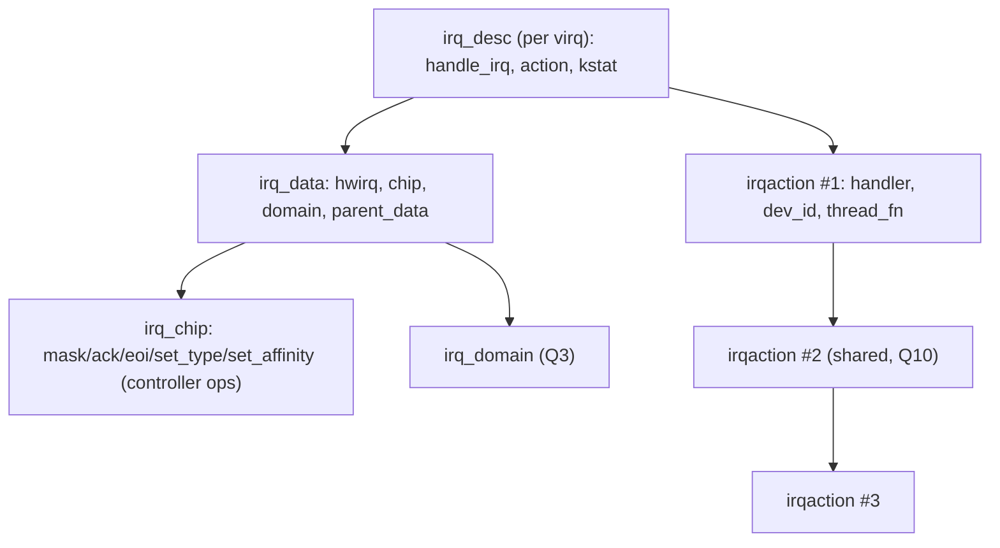
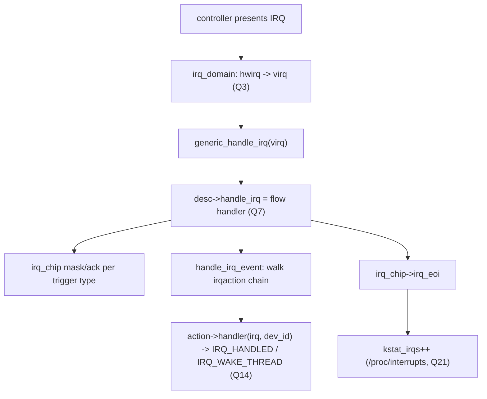

# Q6 — The Generic IRQ Layer: irq_desc, irq_chip, irq_data, irqaction

> **Subsystem:** Generic IRQ Core · **Files:** `kernel/irq/irqdesc.c`, `kernel/irq/chip.c`, `kernel/irq/handle.c`, `include/linux/irqdesc.h`
> **Interviewer is really probing:** Do you know the **core data structures** that abstract every interrupt
> controller behind one API — `irq_desc`, `irq_chip`, `irq_data`, `irqaction` — and how they fit together?

---

## TL;DR Cheat Sheet

- The **generic IRQ layer** is the hardware-independent core that sits between **interrupt controllers**
  (GIC/APIC, Q1/Q2) and **drivers** (`request_irq`, Q9). It abstracts "an interrupt" so drivers never touch
  controller registers.
- **The four key structures:**
  - **`irq_desc`** — the **per-IRQ descriptor**: one per Linux IRQ (`virq`). Holds the **flow handler**, the
    list of **`irqaction`s** (registered handlers), the **`irq_data`**, status/stats, and a lock.
  - **`irq_chip`** — the **controller's operations**: `irq_mask`, `irq_unmask`, `irq_ack`, `irq_eoi`,
    `irq_set_type`, `irq_set_affinity`. Provided by the irqchip driver (Q1/Q2). One chip serves many IRQs.
  - **`irq_data`** — the **per-IRQ hardware data**: `hwirq`, the `irq_chip`, the `irq_domain`, affinity, and
    (hierarchical, Q3) `parent_data` up the controller stack.
  - **`irqaction`** — one **registered handler**: `handler` (top half), `thread_fn` (threaded, Q14),
    `dev_id`, flags (`IRQF_SHARED`…), and `next` (chain for shared IRQs, Q10).
- **Flow:** controller → `generic_handle_irq(virq)` → `irq_desc->handle_irq` (**flow handler**, Q7) →
  walks the **`irqaction`** chain calling each driver handler → EOIs via `irq_chip`.
- **Separation of concerns:** `irq_chip` = *how to talk to the hardware*; flow handler = *the
  trigger-type-specific sequence* (Q7); `irqaction` = *what the driver wants done*.

---

## The Question

> Describe the generic IRQ layer. What are `irq_desc`, `irq_chip`, `irq_data`, and `irqaction`, and how do
> they work together to deliver an interrupt to a driver?

What they want: the **per-IRQ descriptor model**, the **chip = controller ops** abstraction, the
**irqaction chain**, and how a hardware interrupt becomes a driver callback through these structures.

---

## Why the generic IRQ layer exists

Before the generic IRQ layer, every architecture and controller had its **own** interrupt handling code —
duplicated, inconsistent, and hard to share drivers across. The problems it solves:

- **Controller abstraction:** there are dozens of interrupt controllers (GIC, APIC, GPIO chips, PMICs,
  cascaded controllers, MSI). A driver shouldn't know **which** controller its interrupt comes from or how to
  mask/ack/EOI it. The **`irq_chip`** abstracts those operations so the **same driver** works on any
  controller.
- **One handler model:** drivers want a simple contract — "call my function when my interrupt fires." The
  **`irqaction`** + **`request_irq`** (Q9) provide that, while the layer handles the messy
  trigger-type-specific **mask/ack/EOI sequencing** (the **flow handler**, Q7) underneath.
- **Sharing, threading, stats, affinity:** the layer centrally implements **shared IRQs** (Q10), **threaded
  handlers** (Q14), **affinity** (Q15), **/proc/interrupts** accounting (Q21), masking/disabling (Q20), and
  **spurious detection** (Q10) — once, for everyone.

The elegant design is a **clean separation of three concerns**, each its own structure:
1. **`irq_chip`** — *how to manipulate the controller hardware* for this IRQ (mask/ack/eoi/affinity).
2. **flow handler** (in `irq_desc->handle_irq`) — *the correct sequence* for this **trigger type**
   (level/edge/fasteoi, Q7): when to mask, when to ack, when to EOI, how to handle re-trigger.
3. **`irqaction`** — *what the consumer wants* (the driver's handler/thread).

Tied together by the **`irq_desc`** (the per-IRQ hub) and **`irq_data`** (the per-IRQ hardware identity,
including the hierarchical stack, Q3). This is the backbone behind every other topic in this set, so
interviewers use it to test whether you understand the **architecture**, not just APIs.

---

## When these structures are used

| Moment | Structures touched |
|--------|--------------------|
| irqchip driver init | creates `irq_chip`, an `irq_domain` (Q3); each mapped IRQ gets an `irq_desc` + `irq_data` |
| `request_irq` (Q9) | allocates and links an **`irqaction`** into the `irq_desc` |
| interrupt fires | `irq_desc->handle_irq` (flow handler, Q7) runs; walks `irqaction` chain; uses `irq_chip` to ack/EOI |
| mask/affinity (Q15/Q20) | calls `irq_data->chip` ops (walking `parent_data` for hierarchy) |
| `/proc/interrupts` (Q21) | reads `irq_desc` per-CPU counters |

---

## Where in the kernel

```
include/linux/irqdesc.h    <- struct irq_desc
include/linux/irq.h        <- struct irq_chip, struct irq_data, irq_chip ops, IRQ status flags
include/linux/interrupt.h  <- struct irqaction, request_irq, irq_handler_t
kernel/irq/irqdesc.c       <- irq_desc allocation, irq_to_desc, sparse irq (Q8)
kernel/irq/chip.c          <- irq_chip helpers, default flow handler bits, mask/ack/eoi helpers
kernel/irq/handle.c        <- handle_irq_event: walks irqaction chain, calls handlers
kernel/irq/manage.c        <- request_irq/setup (Q9), affinity, threaded handling
```

---

## How they fit together — mechanics

### 1. `irq_desc` — the per-IRQ hub

```c
struct irq_desc {
    struct irq_data      irq_data;     /* hwirq, chip, domain, affinity (+ parent_data, Q3) */
    irq_flow_handler_t   handle_irq;   /* the FLOW HANDLER (Q7): handle_level/edge/fasteoi_irq */
    struct irqaction    *action;       /* head of the registered-handler chain (Q10) */
    unsigned int         status_use_accessors; /* IRQ_* status (disabled, per-cpu, level...) */
    unsigned int         depth;        /* nested disable_irq depth (Q20) */
    unsigned int         irq_count;    /* for spurious detection (Q10) */
    atomic_t             threads_active;/* threaded handlers in flight (Q14) */
    raw_spinlock_t       lock;
    struct kstat_irqs __percpu *kstat_irqs; /* per-CPU counts -> /proc/interrupts (Q21) */
    const char          *name;
};
```
There is **one `irq_desc` per Linux IRQ** (`virq`). `irq_to_desc(virq)` finds it. It's the **central record**:
which flow handler runs, which drivers registered, the hardware identity (`irq_data`), and the stats.

### 2. `irq_chip` — controller operations

```c
struct irq_chip {
    const char *name;                 /* shows in /proc/interrupts */
    void (*irq_mask)(struct irq_data *);     /* stop delivery (Q20) */
    void (*irq_unmask)(struct irq_data *);
    void (*irq_ack)(struct irq_data *);      /* acknowledge (edge) */
    void (*irq_eoi)(struct irq_data *);      /* end-of-interrupt (fasteoi/level) */
    int  (*irq_set_type)(struct irq_data *, unsigned int flow_type); /* level/edge (Q7) */
    int  (*irq_set_affinity)(struct irq_data *, const struct cpumask *, bool force); /* Q15 */
    int  (*irq_set_wake)(struct irq_data *, unsigned int on);  /* wakeup (Q24) */
};
```
Implemented by the **irqchip driver** (GIC/APIC/GPIO/MSI, Q1–Q4). **One `irq_chip` serves all IRQs of that
controller** — the per-IRQ specifics live in `irq_data`. The flow handler (Q7) calls these in the right order
for the trigger type.

### 3. `irq_data` — per-IRQ hardware identity

```c
struct irq_data {
    irq_hw_number_t   hwirq;          /* controller-local hwirq (Q3) */
    unsigned int      irq;            /* the Linux virq */
    struct irq_chip  *chip;           /* this layer's controller ops */
    struct irq_domain *domain;        /* mapping domain (Q3) */
    struct irq_data  *parent_data;    /* HIERARCHICAL: next controller down (Q3/Q4) */
    struct cpumask   *affinity;       /* where it's routed (Q15) */
};
```
This binds the Linux IRQ to its **hardware** (hwirq + chip + domain) and, for **hierarchical** controllers
(Q3), chains to the parent layer. Chip ops act on `irq_data` so they know *which* hwirq to manipulate.

### 4. `irqaction` — a registered handler

```c
struct irqaction {
    irq_handler_t  handler;     /* the driver's TOP HALF (Q-fundamentals) */
    void          *dev_id;      /* cookie; disambiguates shared IRQs (Q10) */
    irq_handler_t  thread_fn;   /* threaded bottom half (Q14), or NULL */
    struct task_struct *thread; /* the IRQ thread, if threaded */
    unsigned int   irq;
    unsigned long  flags;       /* IRQF_SHARED, IRQF_ONESHOT, trigger type ... */
    struct irqaction *next;     /* next handler on this IRQ (SHARED chain, Q10) */
    const char    *name;        /* shows in /proc/interrupts */
};
```
`request_irq` (Q9) builds one and links it into `irq_desc->action`. **Shared** IRQs (Q10) have **multiple**
irqactions chained via `next`; the flow handler calls each in turn until one returns `IRQ_HANDLED`.

### 5. The full delivery path through these structures

```
controller (GIC/APIC) presents interrupt
  -> arch entry -> irq_domain maps hwirq -> virq (Q3)
  -> generic_handle_irq(virq):
        desc = irq_to_desc(virq)
        desc->handle_irq(desc)            <-- FLOW HANDLER (Q7), e.g. handle_fasteoi_irq:
              chip = desc->irq_data.chip
              [mask/ack per trigger type]
              handle_irq_event(desc):
                  for action in desc->action:        <-- irqaction chain (Q10)
                       res = action->handler(irq, action->dev_id)   <-- driver top half
                       if (res == IRQ_WAKE_THREAD) wake action->thread  (Q14)
              chip->irq_eoi(&desc->irq_data)          <-- EOI
  -> update desc->kstat_irqs (/proc/interrupts, Q21)
```
So: **`irq_desc`** routes to the **flow handler**, which uses the **`irq_chip`** (via `irq_data`) to sequence
the hardware and walks the **`irqaction`** chain to call drivers. Four structures, one clean pipeline.

---

## Diagrams

### Structure relationships



### Delivery pipeline



---

## Annotated C

```c
/* Generic entry the controller code calls after mapping hwirq->virq (Q3). */
int generic_handle_irq(unsigned int virq) {
    struct irq_desc *desc = irq_to_desc(virq);
    desc->handle_irq(desc);            /* dispatch to the flow handler (Q7) */
    return 0;
}

/* Walk the registered handlers (kernel/irq/handle.c). */
irqreturn_t handle_irq_event_percpu(struct irq_desc *desc) {
    irqreturn_t retval = IRQ_NONE;
    struct irqaction *action;
    for (action = desc->action; action; action = action->next) {
        irqreturn_t res = action->handler(desc->irq_data.irq, action->dev_id);
        if (res == IRQ_WAKE_THREAD) __irq_wake_thread(desc, action);  /* threaded (Q14) */
        retval |= res;
    }
    return retval;                      /* IRQ_NONE everywhere -> spurious (Q10) */
}

/* Bind chip + flow handler to a virq (used by irq_domain map, Q3). */
void irq_set_chip_and_handler(unsigned int irq, const struct irq_chip *chip,
                              irq_flow_handler_t handle);
```

> Senior nuance: the **three-way separation** is the insight to articulate — **`irq_chip`** = controller
> mechanics, **flow handler** = trigger-type protocol (Q7), **`irqaction`** = consumer intent — all hubbed at
> **`irq_desc`** with **`irq_data`** carrying the (possibly hierarchical, Q3) hardware identity. Everything
> else (sharing Q10, threading Q14, affinity Q15, stats Q21, masking Q20) is implemented **once** on top of
> these.

---

## Company Angle

- **All companies:** this is the **conceptual backbone** — expect it as the structure behind Q1–Q4, Q7–Q10,
  Q14–Q15. Be able to whiteboard `irq_desc` → `irq_data` → `irq_chip` and the `irqaction` chain.
- **Qualcomm/NVIDIA (drivers):** writing irqchip drivers (`irq_chip` ops) for SoC controllers/GPIO; binding
  flow handlers; hierarchical `irq_data` for ITS/MSI (Q3/Q4).
- **AMD/Intel:** x86 `irq_chip` for APIC/IO-APIC/MSI, vector data in `irq_data` (Q2/Q4).
- **Google:** understanding the layer for large-scale IRQ affinity/observability (`/proc/interrupts`, Q21).

---

## War Story

*"A custom SoC interrupt controller's IRQs **fired once and then went dead**. The bug was in the driver's
**`irq_chip`** and **flow-handler** pairing: the controller is **level-triggered**, but the driver had bound
it to `handle_edge_irq` and implemented `irq_ack` but **not** `irq_eoi`/proper unmask sequencing. So after
the first interrupt, the level line stayed asserted/un-acked from the controller's perspective and no further
interrupts were delivered (or it was masked and never unmasked). Walking the **generic IRQ layer** made it
clear: `irq_desc->handle_irq` (the flow handler, Q7) must match the **trigger type** and call the right
`irq_chip` ops in the right order — for a level GIC-like controller that's `handle_fasteoi_irq` +
`irq_eoi`/`irq_mask`/`irq_unmask`. I fixed the `irq_chip` ops and bound `handle_fasteoi_irq` via
`irq_set_chip_and_handler`. Interrupts then delivered continuously. The interviewer's follow-up — *'whose job
is the mask/ack/eoi ordering?'* — let me explain it's the **flow handler's** (Q7), using the **`irq_chip`**
ops, while the **`irqaction`** handler just does the device work — that separation is the whole point of the
generic layer."*

---

## Interviewer Follow-ups

1. **What is `irq_desc`?** The per-Linux-IRQ descriptor: flow handler, the `irqaction` chain, `irq_data`,
   status, per-CPU stats, and lock. One per `virq`.

2. **What is `irq_chip`?** The interrupt controller's operations (mask/unmask/ack/eoi/set_type/set_affinity)
   provided by the irqchip driver; one chip serves many IRQs.

3. **What is `irq_data`?** Per-IRQ hardware identity: hwirq, chip, domain, affinity, and `parent_data` for
   hierarchical controllers (Q3).

4. **What is `irqaction`?** A registered handler (top half + optional thread_fn, dev_id, flags); shared IRQs
   chain multiple via `next` (Q10).

5. **Who sequences mask/ack/EOI?** The **flow handler** (`irq_desc->handle_irq`, Q7), using `irq_chip` ops —
   not the driver's handler.

6. **How does a driver's handler get called?** `generic_handle_irq` → flow handler → `handle_irq_event` walks
   the `irqaction` chain calling each `handler(irq, dev_id)`.

7. **How does threading fit in?** A handler returns `IRQ_WAKE_THREAD` and the layer wakes `action->thread`
   (the threaded `thread_fn`, Q14).

8. **One chip vs one desc — what's per-IRQ?** `irq_desc`/`irq_data` are **per-IRQ**; `irq_chip` is **shared**
   across a controller's IRQs (per-IRQ specifics live in `irq_data`).

9. **Where do `/proc/interrupts` counts come from?** `irq_desc->kstat_irqs` per-CPU counters (Q21).

---

## 30-Minute Talk Track

| Min | Cover |
|-----|-------|
| 0–4 | Why a generic layer: abstract controllers, one handler model, central sharing/threading/stats |
| 4–8 | The three-way separation: irq_chip (HW ops) / flow handler (protocol) / irqaction (intent) |
| 8–13 | irq_desc: the per-IRQ hub (handle_irq, action chain, irq_data, kstat) |
| 13–17 | irq_chip: mask/ack/eoi/set_type/set_affinity; one chip many IRQs; irqchip drivers (Q1/Q2) |
| 17–20 | irq_data: hwirq/chip/domain/affinity + parent_data hierarchy (Q3/Q4) |
| 20–23 | irqaction: handler/thread_fn/dev_id/flags; shared chain (Q10) |
| 23–27 | Full delivery path through all four structures + EOI + stats |
| 27–30 | War story (wrong flow handler/chip ops) + "whose job is mask/ack/eoi" |
