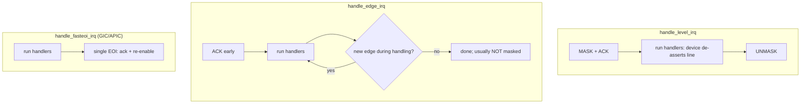

# Q7 — Flow Handlers: level / edge / fasteoi / per-CPU

> **Subsystem:** Generic IRQ Core · **Files:** `kernel/irq/chip.c` (`handle_*_irq`), `include/linux/irq.h`
> **Interviewer is really probing:** Do you understand the **trigger-type-specific mask/ack/EOI sequencing**
> — why level vs edge need different handling, what `handle_fasteoi_irq` is for, and how per-CPU IRQs differ?

---

## TL;DR Cheat Sheet

- A **flow handler** is the function in `irq_desc->handle_irq` (Q6) that implements the **correct
  mask/ack/EOI sequence for a given trigger type**, then calls the driver handlers (`irqaction` chain) in
  between. It's the "protocol" layer between the controller (`irq_chip`) and the driver.
- **The main flow handlers:**
  - **`handle_level_irq`** — **level-triggered**: **mask** the IRQ, **ack**, run handlers (device de-asserts
    the line), then **unmask**. Masking prevents a re-storm while the level is still asserted.
  - **`handle_edge_irq`** — **edge-triggered**: **ack early** (edges can re-arrive), run handlers; if a new
    edge arrived during handling, **re-run** (don't lose edges). Usually **not masked**.
  - **`handle_fasteoi_irq`** — modern controllers (**GIC**, APIC) that have a single **EOI** that both acks
    and re-enables: run handlers, then **`irq_eoi`**. No separate mask/unmask in the common path → **fast**.
  - **`handle_percpu_irq`** — **per-CPU** interrupts (PPIs, IPIs, per-CPU timers, Q25): no locking/spurious
    machinery needed (each CPU has its own), minimal overhead.
  - **`handle_simple_irq`** / `handle_untracked_irq` — for software/edge-like cases with no chip ack needed.
- **Why it matters:** the **wrong flow handler** (or wrong `irq_set_type`) causes **lost interrupts**
  (edges dropped), **interrupt storms** (level not masked), or **dead lines** (no EOI) — see Q6 war story.
- The flow handler is chosen by the **irqchip driver** (`irq_set_chip_and_handler`) and/or the **trigger
  type** from device tree (`IRQ_TYPE_LEVEL_HIGH`/`EDGE_RISING`, via `irq_set_type`).

---

## The Question

> What is a flow handler? Compare `handle_level_irq`, `handle_edge_irq`, `handle_fasteoi_irq`, and
> `handle_percpu_irq`. Why do level and edge interrupts need different sequences?

What they want: the **trigger-type protocols** (mask/ack/EOI ordering and *why*), the **fasteoi** modern
fast path, and the **per-CPU** simplification — i.e. the layer that sits between Q6's structures and the
hardware reality of level vs edge.

---

## Why flow handlers exist

The generic IRQ layer (Q6) wants drivers to write **one** simple handler regardless of controller. But the
**electrical reality** of interrupts differs by **trigger type**, and the **sequence of controller
operations** (mask, ack, EOI, unmask) must match that reality or interrupts break:

- **Level-triggered:** the line stays **asserted** as long as the device needs service. If you don't **mask**
  it (or the device doesn't de-assert) while handling, the controller will **immediately re-present** it →
  an **interrupt storm**. So the sequence must **mask first**, let the handler quiet the device, then
  **unmask**.
- **Edge-triggered:** the interrupt is a **transient pulse**. If a **new edge** arrives **while you're
  handling** the previous one, you **must not lose it** — so you **ack early** (to catch further edges) and
  **re-check/re-run** if another edge came in. Masking is usually unnecessary/undesirable (you'd miss edges).
- **Modern controllers (GIC/APIC)** combine ack + priority management into a single **EOI**, so the optimal
  sequence is just "handle, then EOI" — the **fasteoi** path, avoiding extra mask/unmask register writes.
- **Per-CPU interrupts** (PPIs/IPIs, Q25) are **private to one CPU**, so there's **no cross-CPU racing**,
  **no shared-IRQ chain**, and **no spurious-detection** needed — a stripped-down, fast handler.

A flow handler **encapsulates the right protocol** for each case so it lives in **one place** (the generic
layer) instead of being re-implemented (often wrongly) in every driver. The driver just provides the
`irqaction` handler (Q6); the flow handler wraps it with the correct **mask/ack/EOI choreography**. Getting
this pairing right (flow handler ↔ trigger type ↔ `irq_chip` ops) is a classic source of subtle bugs, which
is why it's a senior interview staple.

---

## When each flow handler is used

| Controller / trigger | Flow handler |
|-----------------------|--------------|
| Old-style level (mask/ack/unmask separate) | `handle_level_irq` |
| Old-style edge (GPIO edges, ack early) | `handle_edge_irq` |
| Modern GIC / APIC (single EOI) | **`handle_fasteoi_irq`** |
| Per-CPU PPI / IPI / per-CPU timer (Q25) | `handle_percpu_irq` / `handle_percpu_devid_irq` |
| Software/MSI-edge with no ack needed | `handle_simple_irq` / `handle_edge_irq` |
| EOI-style but edge re-trigger | `handle_fasteoi_ack_irq` / `handle_edge_eoi_irq` |

Set via the irqchip driver (`irq_set_chip_and_handler`) and trigger type via `irq_set_type` (from DT
`interrupts` flags, Q3).

---

## Where in the kernel

```
kernel/irq/chip.c        <- handle_level_irq, handle_edge_irq, handle_fasteoi_irq,
                            handle_percpu_irq, handle_percpu_devid_irq, handle_simple_irq
kernel/irq/handle.c      <- handle_irq_event (walks irqaction chain, Q6)
include/linux/irq.h      <- irq_flow_handler_t, IRQ_TYPE_* (level/edge), irq_chip ops
drivers/irqchip/*        <- each driver picks the flow handler for its IRQs (Q1/Q2)
```

---

## How each flow handler works — mechanics

### 1. `handle_level_irq` — mask, ack, handle, unmask

```c
void handle_level_irq(struct irq_desc *desc) {
    raw_spin_lock(&desc->lock);
    mask_ack_irq(desc);                 /* MASK (stop re-presentation) + ACK */
    /* ... if no action or disabled, leave masked ... */
    handle_irq_event(desc);             /* run driver handlers; device de-asserts the line */
    cond_unmask_irq(desc);              /* UNMASK once it's safe */
    raw_spin_unlock(&desc->lock);
}
```
**Why mask first:** a level line stays asserted until the **device** clears the cause. If you ran the handler
**without masking**, the controller would keep re-presenting the still-asserted interrupt → **storm**. Mask
blocks re-delivery; the handler quiets the device; unmask re-enables. This is the classic level protocol.

### 2. `handle_edge_irq` — ack early, handle, catch re-edges

```c
void handle_edge_irq(struct irq_desc *desc) {
    raw_spin_lock(&desc->lock);
    desc->irq_data.chip->irq_ack(&desc->irq_data);   /* ACK early: future edges can latch */
    do {
        if (!desc->action) { mask_irq(desc); break; }
        handle_irq_event(desc);                       /* run handlers */
        /* if a NEW edge arrived during handling (IRQS_PENDING), loop again */
    } while (irqd_irq_pending(...) /* re-check */);
    raw_spin_unlock(&desc->lock);
}
```
**Why ack early + loop:** edges are **transient** — if another edge fires while the handler runs and you
hadn't acked, it could be **lost**. Acking early lets the controller latch new edges; the loop **re-runs** the
handler if a new edge came in, so **no edge is dropped**. Edge IRQs are generally **not masked** (masking
would miss edges). GPIO controllers commonly use this.

### 3. `handle_fasteoi_irq` — the modern fast path (GIC/APIC)

```c
void handle_fasteoi_irq(struct irq_desc *desc) {
    raw_spin_lock(&desc->lock);
    /* ... handle disabled/oneshot cases ... */
    handle_irq_event(desc);                           /* run driver handlers */
    desc->irq_data.chip->irq_eoi(&desc->irq_data);    /* single EOI: ack + re-enable */
    raw_spin_unlock(&desc->lock);
}
```
Modern controllers (**GIC** via `ICC_EOIR1_EL1`, Q1; **APIC** EOI register, Q2) handle priority/ack in a
**single EOI** — so the optimal flow is **just handle, then EOI**, no separate mask/unmask register writes in
the common path. This is the **default for GIC/APIC** and the **fastest** general flow handler. For
**threaded/oneshot** IRQs (Q14), `IRQF_ONESHOT` keeps the IRQ **masked** until the threaded handler finishes,
and the fasteoi variant cooperates with that.

### 4. `handle_percpu_irq` — per-CPU, minimal overhead (Q25)

```c
void handle_percpu_irq(struct irq_desc *desc) {
    struct irq_chip *chip = irq_desc_get_chip(desc);
    if (chip->irq_ack) chip->irq_ack(&desc->irq_data);
    handle_irq_event_percpu(desc);                    /* run the per-CPU handler */
    if (chip->irq_eoi) chip->irq_eoi(&desc->irq_data);
}
```
**No `desc->lock`, no spurious detection, no shared chain** — because a **per-CPU interrupt** (PPI, IPI,
per-CPU timer, Q25) is **private to this CPU**: no other CPU can race on it, and it's never shared. This makes
it **lean** (important for the per-CPU timer/IPI hot paths). `handle_percpu_devid_irq` adds a per-CPU `dev_id`
for `request_percpu_irq` (Q25).

### 5. Picking the right one

The irqchip driver (Q1/Q2/Q6) calls `irq_set_chip_and_handler(virq, &chip, handle_fasteoi_irq)` (or
level/edge), and `irq_set_type()` (from DT `IRQ_TYPE_*` flags, Q3) can switch level↔edge, which may change
the handler. **Mismatch = bugs**: edge handler on a level line → storms or stuck; level handler on edges →
lost edges; missing EOI → dead after first interrupt (Q6 war story).

---

## Diagrams

### Level vs edge protocol



### Why each sequence

```
LEVEL: line stays high -> must MASK or it re-fires forever (storm). Unmask after device quiets it.
EDGE:  transient pulse -> must ACK early + re-check, or a concurrent edge is LOST.
FASTEOI: controller's single EOI does ack+priority -> just handle then EOI (fast, no mask churn).
PERCPU: private to one CPU -> no lock, no spurious, no shared chain (minimal).
```

---

## Annotated C

```c
/* Bind a controller + flow handler to a virq (irqchip driver, Q6). */
irq_set_chip_and_handler(virq, &gic_chip, handle_fasteoi_irq);   /* GIC default */
irq_set_chip_and_handler(gpio_virq, &gpio_chip, handle_edge_irq); /* GPIO edges */

/* Set trigger type (from DT IRQ_TYPE_* flags, Q3) -> may swap level/edge handling. */
irq_set_irq_type(virq, IRQ_TYPE_LEVEL_HIGH);   /* or IRQ_TYPE_EDGE_RISING */

/* The flow-handler signature. */
typedef void (*irq_flow_handler_t)(struct irq_desc *desc);

/* Oneshot (threaded, Q14): keep masked until the thread completes. */
/* handle_fasteoi_irq + IRQF_ONESHOT -> irq stays masked through the thread_fn. */
```

> Senior nuance: the flow handler is **trigger-type protocol**, the `irq_chip` is **how to poke the
> controller** (Q6), and the driver's handler is **device work**. The three must be **consistent**: level
> needs mask-before-handle, edge needs ack-early-and-recheck, fasteoi needs just-handle-then-EOI, per-CPU
> needs none of the locking. The default for **GIC/APIC is `handle_fasteoi_irq`** — know that cold.

---

## Company Angle

- **Qualcomm/NVIDIA (SoC/GPIO drivers):** picking level vs edge for GPIO/PMIC IRQs (`irq_set_type` from DT),
  `handle_edge_irq` re-trigger handling, `handle_fasteoi_irq` for the GIC; per-CPU handlers for PPIs (Q25).
- **AMD/Intel (x86):** `handle_fasteoi_irq`/APIC EOI, edge MSI vs level IO-APIC; remote-IRR level handling
  (Q2).
- **Google:** correctness/perf of flow handlers on the IRQ hot path; per-CPU handlers for IPIs/timers.
- **All:** the **flow-handler ↔ trigger-type ↔ chip-ops** consistency is a classic debugging signal.

---

## War Story

*"A GPIO-based interrupt **occasionally missed events** under bursty input — taps on a sensor were sometimes
dropped. The line was **edge-triggered**, but the driver had it bound to **`handle_level_irq`** (copy-paste
from another driver). With the **level** flow handler, the IRQ was **masked during handling**, so any
**edge** that arrived in that window was **lost** (a level handler assumes the source stays asserted; an edge
doesn't). Switching to **`handle_edge_irq`** (via `irq_set_chip_and_handler` and the correct DT
`IRQ_TYPE_EDGE_*`) fixed it: edges are **acked early** and the handler **re-checks** for edges that arrived
during processing, so none are dropped. The interviewer's follow-up — *'why not just always use edge?'* — let
me explain a **level** source (e.g. a shared, still-asserted line) under an edge handler would **storm or get
stuck**, because edge handling doesn't mask and expects transient pulses — the handler must **match the
electrical trigger type**, which is exactly what flow handlers encode."*

---

## Interviewer Follow-ups

1. **What is a flow handler?** The function in `irq_desc->handle_irq` that performs the correct
   mask/ack/EOI sequence for the trigger type and calls the driver handlers in between.

2. **Why do level and edge differ?** Level stays asserted → must **mask** to avoid storms (unmask after the
   device quiets it); edge is transient → must **ack early + re-check** so concurrent edges aren't lost.

3. **What is `handle_fasteoi_irq`?** The modern flow handler for GIC/APIC where a single **EOI** does ack +
   re-enable — just handle, then EOI; fastest, the default for those controllers.

4. **What makes `handle_percpu_irq` special?** Per-CPU interrupts are private to one CPU → no lock, no
   spurious detection, no shared chain → minimal overhead (PPIs/IPIs/timers, Q25).

5. **Who picks the flow handler?** The irqchip driver (`irq_set_chip_and_handler`) and the trigger type
   (`irq_set_type` from DT `IRQ_TYPE_*`, Q3).

6. **What happens if you use the wrong one?** Lost interrupts (level handler on edges), storms/stuck lines
   (edge on level, or level without mask), or dead-after-first (missing EOI) — Q6.

7. **How does edge handling avoid losing interrupts?** Ack early so new edges latch, then loop/re-run the
   handler if `IRQS_PENDING` shows another edge arrived during handling.

8. **How does fasteoi cooperate with threaded/oneshot IRQs (Q14)?** `IRQF_ONESHOT` keeps the IRQ **masked**
   until the threaded `thread_fn` completes, then EOIs/unmasks.

9. **Where is the device's de-assert in the level flow?** Inside `handle_irq_event` — the driver handler
   clears the device's interrupt cause so the level drops before unmask.

---

## 30-Minute Talk Track

| Min | Cover |
|-----|-------|
| 0–4 | Why flow handlers: trigger-type electrical reality needs different mask/ack/EOI sequences |
| 4–9 | handle_level_irq: mask+ack, handle (device de-asserts), unmask; why mask prevents storms |
| 9–14 | handle_edge_irq: ack early, handle, re-check/loop; why edges would otherwise be lost |
| 14–18 | handle_fasteoi_irq: single EOI (GIC/APIC), just handle then EOI; default + fastest |
| 18–21 | handle_percpu_irq: no lock/spurious/shared chain; PPIs/IPIs/timers (Q25) |
| 21–25 | Choosing: irq_set_chip_and_handler + irq_set_type (DT flags, Q3); mismatch bugs |
| 25–28 | Oneshot/threaded interplay (Q14); remote-IRR level on x86 (Q2) |
| 28–30 | War story (level handler on edge line dropping events) + match-the-trigger-type |
