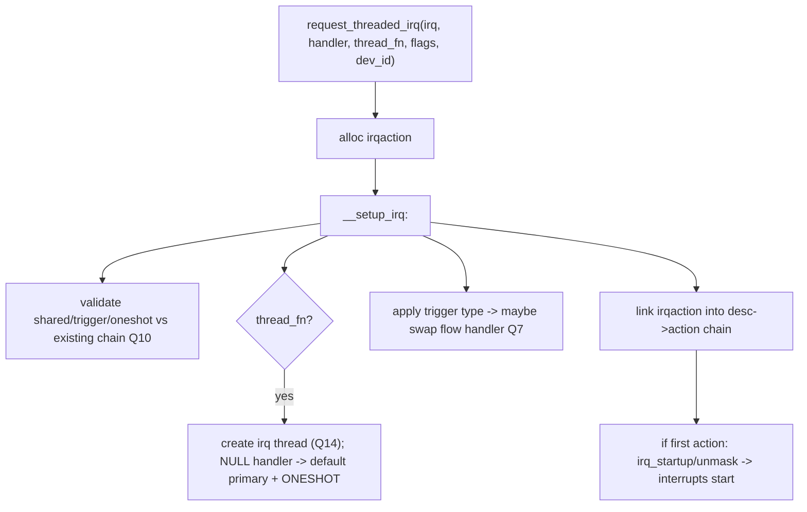
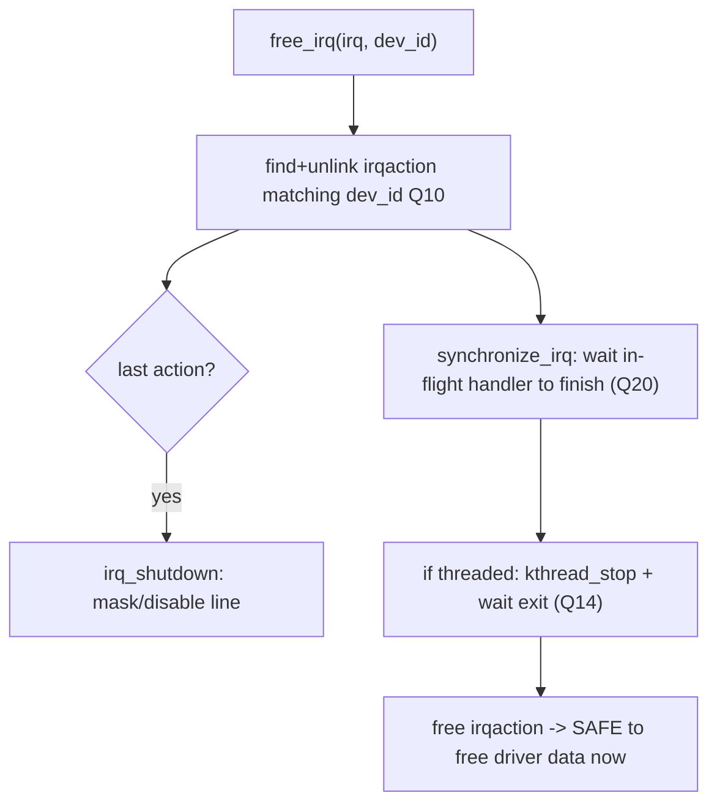

# Q9 — request_irq / request_threaded_irq / free_irq Lifecycle

> **Subsystem:** Generic IRQ Core · **Files:** `kernel/irq/manage.c`, `include/linux/interrupt.h`
> **Interviewer is really probing:** Do you know exactly what happens when a driver **registers an interrupt
> handler** — `irqaction` install, flags, threaded setup, enabling the line — and the **teardown** ordering?

---

## TL;DR Cheat Sheet

- **`request_irq(irq, handler, flags, name, dev_id)`** registers a **top-half** handler for a Linux IRQ
  (`virq`, Q3): allocates an **`irqaction`** (Q6), links it into the `irq_desc`, applies the **trigger type**,
  and **unmasks/enables** the line so interrupts start arriving.
- **`request_threaded_irq(irq, handler, thread_fn, flags, name, dev_id)`** additionally creates a **kernel
  thread** to run `thread_fn` in process context (Q14). `handler` (the quick top half) returns
  **`IRQ_WAKE_THREAD`** to defer to it; pass `handler = NULL` for the **default primary handler** (just wakes
  the thread). **`IRQF_ONESHOT`** keeps the IRQ masked until the thread finishes (required for the NULL-handler
  case and level IRQs).
- **Key flags:** `IRQF_SHARED` (Q10), `IRQF_ONESHOT` (threaded), `IRQF_TRIGGER_*` (level/edge, Q7),
  `IRQF_NO_SUSPEND`/`IRQF_EARLY_RESUME` (PM, Q24), `IRQF_PERCPU` (Q25), `IRQF_NOBALANCING`,
  `IRQF_NO_THREAD`/`IRQF_FORCE_RESUME`.
- **`free_irq(irq, dev_id)`** removes the `irqaction` matching **`dev_id`** (vital for shared IRQs, Q10),
  **synchronizes** (waits for any in-flight handler/thread to finish — like `synchronize_irq`, Q20), and
  **disables/masks** the line if it was the last action. **Returns only after the handler can no longer run.**
- **`devm_request_irq`** ties the IRQ to device lifetime (auto-freed on unbind) — the modern best practice.
- **Context:** `request_irq` is called in **process context** (it may sleep allocating); the **handler** runs
  in hard IRQ context (can't sleep, Q-fundamentals); the **thread_fn** runs in a kthread (can sleep, Q14).

---

## The Question

> Walk through what `request_irq` / `request_threaded_irq` actually does internally, the important flags, and
> what `free_irq` must guarantee on teardown.

What they want: the **`irqaction` install + enable** sequence, the **threaded** setup, the meaning of the
**flags** (esp. `IRQF_SHARED`/`IRQF_ONESHOT`), and the **teardown safety** (`free_irq` synchronizes before
returning) — the correctness contract drivers depend on.

---

## Why this API exists (and why teardown is subtle)

Drivers need a **simple, safe contract** to connect their device's interrupt to a handler, without touching
controller registers (the generic layer, Q6) or worrying about trigger-type sequencing (flow handlers, Q7).
`request_irq` provides that: "call my function when IRQ N fires." But several things must happen **correctly**
and in **order**:

- **Registration must be atomic w.r.t. delivery:** you can't have the line enabled before the handler is
  installed, or an early interrupt would find **no handler** (spurious, Q10). So `request_irq` installs the
  `irqaction` **then** enables.
- **Shared IRQs (Q10) need compatible flags and a unique `dev_id`:** multiple drivers chain on one line; the
  layer must verify they all agree on `IRQF_SHARED`/trigger type, and `dev_id` is the cookie that lets
  `free_irq` remove the **right** one.
- **Threaded handlers (Q14) need a thread + masking discipline:** to defer work to process context, the layer
  spawns a kthread and, with `IRQF_ONESHOT`, keeps the IRQ **masked** until the thread completes so the device
  doesn't re-interrupt mid-processing.
- **Teardown must be race-free:** `free_irq` cannot just unlink the handler — an interrupt might be **executing
  right now** on another CPU, or the **IRQ thread** might be running. If `free_irq` returned while the handler
  could still fire, the driver would **free its data structures out from under a live handler** → use-after-
  free. So `free_irq` must **synchronize** (wait for in-flight handlers/threads) **before** returning.

The senior framing: `request_irq`/`free_irq` is a **lifecycle with a strict ordering and synchronization
contract** — enable only after install, and on teardown **guarantee the handler can never run again** before
returning. Drivers rely on that guarantee to free resources safely. Knowing the internals (and `devm_`
management) separates a senior from someone who's only used the API.

---

## When / which variant

| Need | API |
|------|-----|
| Simple top-half-only handler | `request_irq` |
| Handler may sleep / slow bus / take mutex | `request_threaded_irq` (thread_fn, Q14) |
| Quick check then defer everything | `request_threaded_irq(NULL, thread_fn, IRQF_ONESHOT, ...)` |
| Shared line (Q10) | add `IRQF_SHARED`, unique `dev_id` |
| Per-CPU interrupt (PPI, Q25) | `request_percpu_irq` |
| Auto-free on device unbind | `devm_request_irq` / `devm_request_threaded_irq` |
| Tear down | `free_irq(irq, dev_id)` (synchronizes) |

---

## Where in the kernel

```
kernel/irq/manage.c        <- request_threaded_irq, __setup_irq, free_irq, __free_irq,
                              setup_irq_thread, irq_thread (Q14), synchronize_irq (Q20)
include/linux/interrupt.h   <- request_irq inline (wraps request_threaded_irq), IRQF_* flags,
                              irq_handler_t, IRQ_HANDLED/IRQ_NONE/IRQ_WAKE_THREAD
kernel/irq/devres.c         <- devm_request_irq (managed)
```

---

## How it works — step by step

### 1. `request_irq` is `request_threaded_irq` with `thread_fn = NULL`

```c
static inline int request_irq(unsigned int irq, irq_handler_t handler, unsigned long flags,
                              const char *name, void *dev) {
    return request_threaded_irq(irq, handler, NULL, flags, name, dev);
}
```
So the threaded path is the **one true implementation**; non-threaded is just `thread_fn == NULL`.

### 2. `__setup_irq` — the install sequence

`request_threaded_irq` allocates an **`irqaction`** and calls `__setup_irq(desc, irq, action)` which:

1. **Validates flags vs existing actions (shared, Q10):** if the IRQ already has actions, the new one must set
   `IRQF_SHARED` **and match** the trigger type and `IRQF_ONESHOT`-ness of the existing chain; else `-EBUSY`.
   Each must have a **unique `dev_id`**.
2. **Sets up the IRQ thread (if `thread_fn`):** `setup_irq_thread()` creates a kthread (`irq/NN-name`) running
   `irq_thread()` (Q14); if `handler == NULL`, installs a **default primary handler** that just returns
   `IRQ_WAKE_THREAD` (so `IRQF_ONESHOT` is mandatory there).
3. **Applies the trigger type:** `__irq_set_trigger()` programs level/edge via the chip's `irq_set_type`
   (which may swap the flow handler, Q7).
4. **Links the action into the chain:** appends the `irqaction` at the tail of `desc->action`.
5. **Enables/unmasks the line:** for the **first** action, `irq_startup()`/`unmask` so interrupts begin
   arriving. (Until now the line was masked — no early spurious.)
6. **Sets affinity defaults** (Q15), registers in `/proc/interrupts` (Q21), wakes the IRQ thread if needed.

### 3. The handler contract at runtime

When the IRQ fires, the flow handler (Q7) walks the `irqaction` chain (Q6) and calls each `handler(irq,
dev_id)`:
- **`IRQ_HANDLED`** — this device handled it.
- **`IRQ_NONE`** — not mine (shared IRQ, Q10) → try the next action; all-`IRQ_NONE` = spurious (Q10).
- **`IRQ_WAKE_THREAD`** — wake the threaded handler (`thread_fn`, Q14); with `IRQF_ONESHOT` the IRQ stays
  **masked** until the thread finishes and the layer unmasks/EOIs.

The **top half runs in hard IRQ context** (can't sleep, Q-fundamentals); the **thread_fn runs in a kthread**
(process context, can sleep — take mutexes, do slow I2C/SPI, allocate `GFP_KERNEL`).

### 4. `free_irq` — the synchronization contract

```c
const void *free_irq(unsigned int irq, void *dev_id) {
    /* __free_irq: */
    /* 1. find the irqaction matching dev_id in the chain (shared, Q10) and UNLINK it */
    /* 2. if it was the LAST action: irq_shutdown() -> mask/disable the line */
    /* 3. synchronize_irq(irq): WAIT until any in-flight handler on any CPU has finished */
    /* 4. if threaded: kthread_stop the IRQ thread and wait for it to exit */
    /* 5. free the irqaction; return dev_id */
}
```
The critical guarantees:
- **Match by `dev_id`:** on a shared line, only the caller's handler is removed (Q10) — that's why `dev_id`
  must be unique and non-NULL for shared IRQs.
- **Synchronize before return:** `free_irq` **does not return** until the handler is guaranteed **not running
  and never to run again** (in-flight handler drained via `synchronize_irq`, Q20; IRQ thread stopped). This is
  what lets a driver safely **free its data** right after `free_irq`.
- **Disable if last:** if no actions remain, the line is masked/disabled (`irq_shutdown`).

**Ordering pitfall:** never `free_irq` while holding a lock the handler also takes (deadlock — `free_irq`
waits for the handler which waits for the lock). And free the IRQ **before** freeing the data the handler
dereferences.

### 5. `devm_request_irq` — managed lifetime

```c
int devm_request_irq(struct device *dev, unsigned int irq, irq_handler_t handler,
                     unsigned long flags, const char *name, void *dev_id);
```
Ties the IRQ to the **device's** lifetime: on driver **unbind**/probe-failure the IRQ is **auto-freed** (in
the right order), eliminating manual `free_irq` and the classic **error-path leak**. Modern drivers prefer it
(matches `devm_` resource management generally).

---

## Diagrams

### request → enable



### free → synchronize



---

## Annotated C

```c
/* The real entry point (request_irq wraps this with thread_fn=NULL). */
int request_threaded_irq(unsigned int irq, irq_handler_t handler, irq_handler_t thread_fn,
                         unsigned long flags, const char *name, void *dev_id);

/* Driver: split handler (quick top half) + threaded bottom half (Q14). */
static irqreturn_t my_hardirq(int irq, void *dev) {
    struct mydev *d = dev;
    if (!(readl(d->regs + STATUS) & PENDING)) return IRQ_NONE;  /* shared: not mine (Q10) */
    writel(ACK, d->regs + ACK);
    return IRQ_WAKE_THREAD;                  /* defer to thread_fn */
}
static irqreturn_t my_thread(int irq, void *dev) {
    struct mydev *d = dev;
    mutex_lock(&d->lock);                    /* OK: process context (Q14) */
    process(d);
    mutex_unlock(&d->lock);
    return IRQ_HANDLED;
}
/* Register (shared + oneshot + threaded), managed lifetime: */
devm_request_threaded_irq(&pdev->dev, irq, my_hardirq, my_thread,
                          IRQF_SHARED | IRQF_ONESHOT, "mydev", dev);

/* Manual teardown (if not devm): synchronizes before returning. */
free_irq(irq, dev);   /* handler guaranteed not running afterward; now free dev */
```

> Senior nuance: the two contracts to nail are **(1) enable only after the irqaction is installed** (no early
> spurious), and **(2) `free_irq` synchronizes** — it drains in-flight handlers (`synchronize_irq`, Q20) and
> stops the IRQ thread (Q14) **before** returning, so the driver can free its data safely. `dev_id` uniqueness
> is what makes both shared-IRQ removal and synchronization correct (Q10). Prefer **`devm_`** to avoid
> error-path leaks.

---

## Company Angle

- **Qualcomm/NVIDIA (drivers):** threaded IRQs (`request_threaded_irq` + `IRQF_ONESHOT`) for slow-bus devices
  (I2C/SPI/regmap), `devm_` management, correct `free_irq`/unbind ordering, shared IRQs on SoCs (Q10).
- **AMD/Intel (PCI/MSI):** per-vector `request_irq` after `pci_alloc_irq_vectors` (Q4), `IRQF_SHARED` for INTx
  fallback, teardown on device removal/hotplug.
- **Google:** correctness/observability of IRQ registration at scale; threaded NAPI/handlers (Q16).
- **All:** the **`free_irq` synchronization guarantee** and `dev_id` discipline are universal correctness
  points.

---

## War Story

*"A driver crashed with a **use-after-free** during device **removal** under load. The remove path did
`kfree(dev)` and *then* `free_irq(irq, dev)` — wrong order — and even after reordering, an early version still
crashed because the handler was **executing on another CPU** at the moment of teardown. The fix relied on
understanding **`free_irq`'s contract**: call `free_irq(irq, dev)` **first**, which **unlinks** the handler,
**masks** the line if last, and crucially **`synchronize_irq`s** — waiting until any in-flight hard handler
**and** the IRQ thread (it was a `request_threaded_irq`) have **finished** — and only **then** `kfree(dev)`.
Once `free_irq` returned, the handler was guaranteed never to run again, so freeing the data was safe. We
later moved to **`devm_request_threaded_irq`** so unbind auto-frees the IRQ in the correct order, eliminating
the manual ordering bug entirely. The interviewer's follow-up — *'why must `free_irq` synchronize?'* — let me
explain that without it, `free_irq` could return while a handler was mid-execution on another CPU (or the IRQ
thread was running), and the driver would free structures the live handler still dereferences — exactly the
use-after-free we hit."*

---

## Interviewer Follow-ups

1. **What does `request_irq` do internally?** Allocates an `irqaction`, validates flags (shared/trigger,
   Q10), links it into the `irq_desc` chain, applies the trigger type, and **enables** the line (first action).

2. **`request_irq` vs `request_threaded_irq`?** Threaded additionally creates a kthread for `thread_fn`
   (process context, can sleep, Q14); `request_irq` is `thread_fn == NULL`.

3. **What does `IRQF_ONESHOT` do?** Keeps the IRQ **masked** until the threaded handler completes — required
   when `handler == NULL` (default primary) and for level IRQs with threads.

4. **What does `free_irq` guarantee?** It unlinks the matching (`dev_id`) handler, disables the line if last,
   and **synchronizes** (waits for in-flight handler + IRQ thread to finish) **before** returning — so freeing
   driver data is safe.

5. **Why must `dev_id` be unique/non-NULL for shared IRQs?** It identifies **which** handler to call/remove on
   a shared chain (Q10); `free_irq` matches on it.

6. **What can a top half vs thread_fn do?** Top half runs in hard IRQ context (no sleep); `thread_fn` runs in
   a kthread (process context — mutexes, sleeping bus I/O, `GFP_KERNEL`, Q14).

7. **What return values can a handler give?** `IRQ_HANDLED`, `IRQ_NONE` (not mine, Q10), `IRQ_WAKE_THREAD`
   (defer to thread, Q14).

8. **Why prefer `devm_request_irq`?** Auto-frees on unbind/probe-failure in correct order — eliminates manual
   `free_irq` and error-path leaks.

9. **Common teardown bug?** Freeing driver data before `free_irq` (use-after-free), or `free_irq` while
   holding a lock the handler takes (deadlock).

---

## 30-Minute Talk Track

| Min | Cover |
|-----|-------|
| 0–4 | The contract: connect device IRQ to a handler safely; enable-after-install; teardown safety |
| 4–8 | request_irq = request_threaded_irq(thread_fn=NULL); __setup_irq overview |
| 8–13 | Install steps: validate shared/trigger (Q10), thread setup (Q14), trigger type (Q7), link, enable |
| 13–17 | Runtime: handler return codes (HANDLED/NONE/WAKE_THREAD); hard vs thread context |
| 17–22 | free_irq: unlink by dev_id, shutdown if last, synchronize_irq (Q20), stop thread — the guarantee |
| 22–25 | Important flags: SHARED, ONESHOT, TRIGGER_*, NO_SUSPEND (Q24), PERCPU (Q25) |
| 25–28 | devm_request_irq managed lifetime; ordering pitfalls (free-before-data, lock deadlock) |
| 28–30 | War story (remove use-after-free) + "why free_irq synchronizes" |
