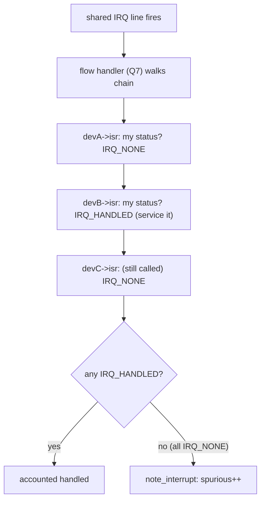
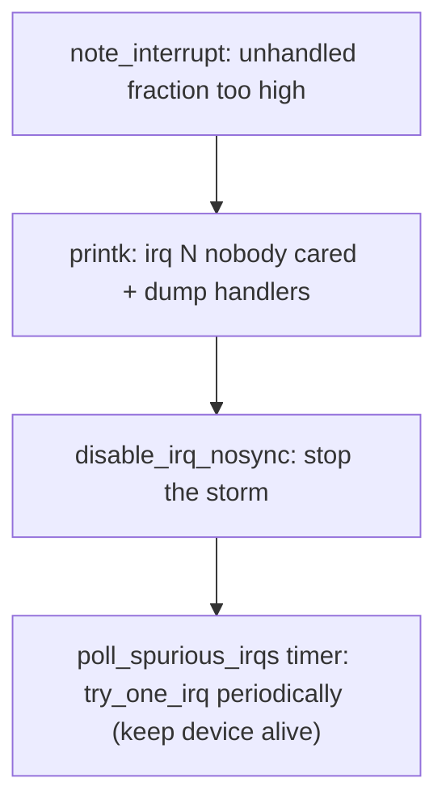

# Q10 — Shared Interrupts and Spurious / Storm Detection

> **Subsystem:** Generic IRQ Core · **Files:** `kernel/irq/spurious.c`, `kernel/irq/manage.c`, `kernel/irq/handle.c`
> **Interviewer is really probing:** Do you understand **how multiple devices share one IRQ line**, how a
> handler decides "**is it mine?**", and how the kernel detects/handles **spurious interrupts and storms**?

---

## TL;DR Cheat Sheet

- A **shared interrupt** (`IRQF_SHARED`) is one **physical line** used by **multiple devices**. Each registers
  an `irqaction` (Q9) chained on the same `irq_desc` (Q6); when the line fires, the flow handler (Q7) calls
  **each handler in turn** until one claims it.
- **"Is it mine?"** Every shared handler must **read its device's status register** and return:
  - **`IRQ_HANDLED`** if its device caused the interrupt (and it serviced it), or
  - **`IRQ_NONE`** if not — so the next handler in the chain gets a try.
- **Why shared IRQs exist:** **wired/INTx** interrupt lines are **scarce** (PCI has only 4 INTx lines per
  slot, legacy ISA even fewer), so devices must **share**. **MSI/MSI-X** (Q4) largely **eliminates** sharing
  (each vector is private) — a big reason to prefer it.
- **Spurious detection:** if an interrupt fires and **every** handler returns `IRQ_NONE` (nobody claimed it),
  it's **spurious**. `note_interrupt()` counts these; if too many spurious/unhandled occur (a **storm** — a
  stuck level line, a buggy device, or a missing handler), the kernel **disables** the IRQ and may switch to
  **polling** the handlers periodically (`poll_spurious_irqs`) to keep the device alive while logging
  `"irq N: nobody cared"`.
- **Storms** also come from **level-triggered** lines that aren't properly masked/acked (Q7) or a device that
  keeps re-asserting — detected via high unhandled counts and excessive interrupt rate.

---

## The Question

> How do shared interrupts work? How does a handler know if the interrupt was for its device, and how does the
> kernel detect and handle spurious interrupts or interrupt storms?

What they want: the **shared `irqaction` chain + `IRQ_NONE`/`IRQ_HANDLED`** protocol, **why** sharing exists
(scarce INTx lines, and MSI removing the need), and the **spurious/storm detection + polling fallback**
mechanics (`note_interrupt`, "nobody cared").

---

## Why shared interrupts (and spurious detection) exist

Legacy **wired interrupt lines are a scarce resource**. PCI defines only **four INTx lines (A/B/C/D)** per
slot, and after routing through the PCI bridge, **many devices end up sharing** the same line into the
IO-APIC/GIC. ISA was worse (a dozen-ish IRQs total). So the kernel **must** support **multiple devices on one
line** — there simply aren't enough lines to give each device its own.

This creates two problems the kernel must solve:

1. **Demultiplexing — "which device fired?"** A shared line gives **no information** about which of its
   devices raised the interrupt. The only way to know is for **each device's handler to check its own status
   register**. So the contract is: the flow handler (Q7) **calls every handler** in the shared chain, and each
   returns **`IRQ_HANDLED`** (mine, serviced) or **`IRQ_NONE`** (not mine). This "poll each candidate" cost is
   a real downside of sharing — and a key reason **MSI-X** (Q4), where each interrupt is **unambiguous**, is
   preferred for performance.

2. **Detecting broken/stuck interrupts.** With sharing (and hardware bugs), interrupts can fire that **nobody
   claims** — a device asserted but no registered handler recognizes it, a **level line stuck asserted**
   (Q7), a handler that returns `IRQ_NONE` when it shouldn't, or a **missing/mis-registered handler**. If the
   kernel naively kept re-running handlers on a stuck line, it would **livelock** (an **interrupt storm**
   consuming all CPU). So the kernel **counts unhandled/spurious** interrupts and, past a threshold,
   **defends itself**: disable the line and **poll** the handlers periodically instead, logging the famous
   **"irq N: nobody cared"**.

The senior framing: shared IRQs are a **necessary consequence of scarce wired lines**, with a **demux-by-
polling** protocol (`IRQ_NONE`/`IRQ_HANDLED`) and a **self-defense mechanism** (spurious detection → disable
+ poll) against storms — and **MSI is the modern escape** from both costs.

---

## When sharing / spurious handling applies

| Situation | Behavior |
|-----------|----------|
| Multiple devices on one INTx line | each registers `IRQF_SHARED` + unique `dev_id` (Q9); chain handlers |
| Interrupt fires | flow handler (Q7) calls each handler until one returns `IRQ_HANDLED` |
| A handler doesn't recognize it | returns `IRQ_NONE` → try next |
| **All** return `IRQ_NONE` | spurious → `note_interrupt` counts it |
| Too many spurious/unhandled | **storm** → disable IRQ, switch to **polling** the handlers; log "nobody cared" |
| Stuck level line (Q7) | high unhandled rate → same defense |
| MSI/MSI-X device (Q4) | **not shared** — each vector private, no "is it mine?" |

---

## Where in the kernel

```
kernel/irq/manage.c     <- __setup_irq: validates IRQF_SHARED compatibility across the chain (Q9)
kernel/irq/handle.c     <- handle_irq_event_percpu: walks irqaction chain, ORs return values
kernel/irq/spurious.c   <- note_interrupt, try_one_irq, poll_spurious_irqs, "nobody cared",
                           IRQ disable threshold, polling timer
include/linux/interrupt.h <- IRQF_SHARED, irqreturn_t (IRQ_NONE/IRQ_HANDLED/IRQ_WAKE_THREAD)
```

---

## How it works — mechanics

### 1. Registering a shared IRQ

To share, **all** participants must agree (`__setup_irq`, Q9):
- set **`IRQF_SHARED`**,
- provide a **unique, non-NULL `dev_id`** (so `free_irq` removes the right one and handlers can identify their
  device, Q9),
- **match the trigger type** (you can't mix level and edge on one line) and `IRQF_ONESHOT`-ness.
If a new request conflicts (no `IRQF_SHARED`, or trigger mismatch), `request_irq` returns **`-EBUSY`**. The
`irqaction`s form a **chain** via `next` (Q6).

### 2. The "is it mine?" demux at interrupt time

```c
/* handle_irq_event_percpu (kernel/irq/handle.c), simplified */
irqreturn_t handle_irq_event_percpu(struct irq_desc *desc) {
    irqreturn_t retval = IRQ_NONE;
    struct irqaction *action;
    for (action = desc->action; action; action = action->next) {
        irqreturn_t res = action->handler(irq, action->dev_id);  /* each device checks its status */
        retval |= res;                                            /* OR the results */
    }
    return retval;     /* IRQ_NONE if NOBODY claimed it -> spurious */
}
```
Each handler does:
```c
static irqreturn_t my_isr(int irq, void *dev_id) {
    struct mydev *d = dev_id;
    u32 st = readl(d->regs + STATUS);
    if (!(st & MY_PENDING)) return IRQ_NONE;   /* not my device -> let the chain continue */
    writel(st, d->regs + ACK);                 /* service it */
    return IRQ_HANDLED;
}
```
The kernel **ORs** all returns: if **any** handler said `IRQ_HANDLED`, the interrupt is accounted as handled;
if **all** said `IRQ_NONE`, it's **spurious** and goes to `note_interrupt()`.

### 3. Spurious / storm detection (`note_interrupt`)

```
note_interrupt(desc, action_ret):
   if action_ret == IRQ_NONE (nobody cared):
        desc->irqs_unhandled++
   track irq_count and a time window:
        every ~100k interrupts, check the unhandled ratio
   if unhandled fraction is too high (e.g. ~99% unhandled over the window):
        printk("irq %d: nobody cared (try booting with the irqpoll option)\n");
        __report_bad_irq(...)            /* dump the registered handlers */
        desc->status |= IRQS_SPURIOUS_DISABLED;
        disable_irq_nosync(irq);         /* STOP the storming line */
        mod_timer(&poll_spurious_irq_timer, ...); /* poll handlers periodically instead */
```
- **Disable + poll:** once disabled, `poll_spurious_irqs()` (a timer) periodically calls `try_one_irq()` on
  disabled IRQs to **run the handlers anyway** — so a device that *does* need service still gets polled,
  while the **storm** (the CPU-consuming flood of unclaimed interrupts) is stopped.
- **`irqpoll` / `irqfixup` boot options** force this polling behavior to recover systems with mis-routed or
  buggy shared IRQs.
- This is the famous **"nobody cared"** message — almost always a **bug**: a device asserting without a
  handler, a handler wrongly returning `IRQ_NONE`, a **stuck level line** (Q7), or a misrouted IRQ.

### 4. Why level lines storm (and the mask discipline)

A **level-triggered** shared line that a handler **fails to quiet** (doesn't clear the device cause) stays
asserted → the controller **re-presents it immediately** → storm. The **flow handler** (`handle_level_irq`,
Q7) **masks** during handling precisely to bound this, but if **no** handler clears the source, the unhandled
count climbs and spurious detection eventually disables it. **Edge** lines storm differently (a device
asserting rapidly), but the unhandled-ratio defense still applies.

### 5. MSI eliminates the problem (Q4)

With **MSI/MSI-X**, each interrupt is a **distinct memory write** → a **private vector** → **no sharing**, so
there's **no "is it mine?" poll** and **no shared-line storm** from demux ambiguity. This is a major
performance and robustness reason modern devices use MSI-X. (You can still get storms from a genuinely
malfunctioning device, but not from line sharing.)

---

## Diagrams

### Shared demux



### Storm defense



---

## Annotated C

```c
/* Registering a shared handler (Q9): IRQF_SHARED + unique dev_id. */
request_irq(irq, my_isr, IRQF_SHARED, "devB", devB);   /* -EBUSY if incompatible with chain */

/* Shared handler MUST check its own device and may return IRQ_NONE. */
static irqreturn_t my_isr(int irq, void *dev_id) {
    struct mydev *d = dev_id;
    if (!(readl(d->regs + STATUS) & PENDING)) return IRQ_NONE;  /* not mine */
    /* service ... */ return IRQ_HANDLED;
}

/* Spurious accounting (kernel/irq/spurious.c). */
void note_interrupt(struct irq_desc *desc, irqreturn_t action_ret) {
    if (action_ret == IRQ_NONE) desc->irqs_unhandled++;
    /* periodically: if unhandled ratio too high -> __report_bad_irq + disable + poll */
}

/* irq_desc fields involved (Q6). */
/* unsigned int irq_count;        // total since last spurious check */
/* unsigned int irqs_unhandled;   // unclaimed (IRQ_NONE) count */
```

> Senior nuance: the contract is **every shared handler must read its device status and return `IRQ_NONE` if
> not its interrupt** — a handler that **always** returns `IRQ_HANDLED` **breaks** sharing (it masks other
> devices' interrupts and defeats spurious detection). The kernel's **self-defense** (disable + poll on
> excessive unhandled) prevents a stuck/buggy line from livelocking the system — and **MSI-X removes the whole
> class** by making interrupts unambiguous (Q4).

---

## Company Angle

- **AMD/Intel (PCI/legacy):** INTx sharing on x86, `IRQF_SHARED`, "nobody cared" from misrouted IRQs,
  `irqpoll` recovery; MSI-X (Q4) to escape sharing for performance.
- **Qualcomm/NVIDIA (SoC/drivers):** shared GIC SPIs among SoC blocks, correct `IRQ_NONE` returns, level-line
  storm avoidance (Q7), GPIO shared/cascaded lines (Q3).
- **Google (robustness):** detecting storms in the fleet, observability via `/proc/interrupts` rate (Q21),
  preferring MSI-X for NICs to avoid demux cost.
- **All:** the `IRQ_NONE`/`IRQ_HANDLED` discipline and spurious "nobody cared" are classic debugging topics.

---

## War Story

*"After adding a second device on a shared PCI **INTx** line, the system started logging **`irq 17: nobody
cared`** and that IRQ got **disabled** — both devices stopped receiving interrupts. The new device's handler
had a bug: under certain states it **returned `IRQ_HANDLED` unconditionally** (without actually checking its
status register), but in others it **returned `IRQ_NONE` when it *had* in fact asserted** — so on a real
interrupt from it, **all** handlers returned `IRQ_NONE`, the kernel counted it **spurious**, and after enough
of them it tripped the **storm defense**: 'nobody cared' → `disable_irq` → polling. The fix was to make the
shared handler **correctly read its device status** and return `IRQ_HANDLED` **only** when its device caused
and it serviced the interrupt, `IRQ_NONE` otherwise — so the demux worked and spurious detection saw the line
as handled. Long term we moved the device to **MSI-X** (Q4), which gives it a **private vector** with no
sharing and no 'is it mine?' ambiguity at all. The interviewer's follow-up — *'why did the whole line get
disabled, not just the bad device?'* — let me explain spurious detection works at the **line** level (the
`irq_desc`): if no handler on the shared chain claims the interrupt, the kernel can't tell *which* device is
broken, so it defends by disabling/polling the **line** — which is exactly why correct `IRQ_NONE`/`IRQ_HANDLED`
returns are critical and why MSI's per-device vectors are more robust."*

---

## Interviewer Follow-ups

1. **How do shared interrupts work?** Multiple devices register `IRQF_SHARED` handlers chained on one
   `irq_desc`; the flow handler calls each until one returns `IRQ_HANDLED`.

2. **How does a handler know if it's "mine"?** It reads its **device's status register**; returns
   `IRQ_HANDLED` if its device caused (and it serviced) the interrupt, `IRQ_NONE` otherwise.

3. **Why do shared IRQs exist?** Wired/INTx lines are scarce (4 per PCI slot) so devices must share; MSI/MSI-X
   (Q4) removes the need by giving each interrupt a private vector.

4. **What is a spurious interrupt?** One where **all** chained handlers return `IRQ_NONE` (nobody claimed it)
   — counted by `note_interrupt`.

5. **What does the kernel do about storms?** Past an unhandled-ratio threshold it logs **"nobody cared"**,
   **disables** the IRQ, and **polls** the handlers periodically (`poll_spurious_irqs`) to keep devices alive.

6. **What breaks a shared IRQ?** A handler that always returns `IRQ_HANDLED` (masks others, defeats detection)
   or wrongly returns `IRQ_NONE` (triggers spurious disable); mismatched trigger type (`-EBUSY`).

7. **Why does the whole line get disabled, not one device?** Detection is at the **line/`irq_desc`** level; if
   nobody claims it, the kernel can't identify the culprit device, so it defends the line.

8. **How do level lines storm?** A handler that doesn't quiet a level source leaves it asserted → re-presented
   immediately; flow-handler masking (Q7) bounds it, spurious detection eventually disables it.

9. **What are `irqpoll`/`irqfixup`?** Boot options that force polling/fixup of mis-routed or buggy IRQs to
   recover affected systems.

---

## 30-Minute Talk Track

| Min | Cover |
|-----|-------|
| 0–4 | Why sharing: scarce INTx lines; the demux problem; MSI as the escape (Q4) |
| 4–8 | Registering shared: IRQF_SHARED, unique dev_id, matching trigger; -EBUSY (Q9) |
| 8–13 | "Is it mine?": chain walk, read status, IRQ_HANDLED vs IRQ_NONE, OR of returns |
| 13–18 | Spurious detection: note_interrupt, unhandled ratio, "nobody cared" |
| 18–22 | Storm defense: disable_irq + poll_spurious_irqs; irqpoll/irqfixup |
| 22–25 | Level-line storms and flow-handler masking (Q7); buggy-handler failure modes |
| 25–28 | MSI-X removing sharing + demux cost (Q4); line-level vs device-level detection |
| 28–30 | War story (nobody cared from bad shared handler) + correct return discipline |
