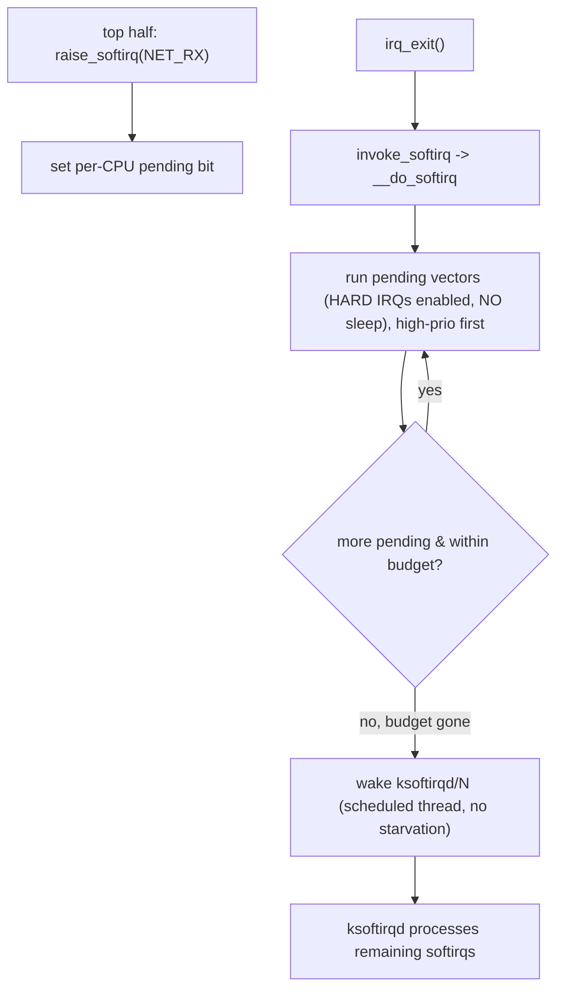

# Q11 — Softirqs Deep Dive

> **Subsystem:** Bottom Halves · **Files:** `kernel/softirq.c`, `include/linux/interrupt.h`, `net/core/dev.c`
> **Interviewer is really probing (Google favorite):** Do you understand the **static softirq vectors**, how
> `__do_softirq` runs them, the **ksoftirqd** offload, and the **budget/starvation** dynamics that matter for
> high-throughput networking?

---

## TL;DR Cheat Sheet

- A **softirq** is the kernel's lowest-level **deferred-work** mechanism: a **statically-numbered**, per-CPU
  bottom half that runs in **atomic context** (interrupts enabled, but **can't sleep**), used by core
  high-performance subsystems.
- **The fixed softirq vectors** (priority order): `HI`, `TIMER`, `NET_TX`, `NET_RX`, `BLOCK`, `IRQ_POLL`,
  `TASKLET`, `SCHED`, `HRTIMER`, `RCU`. You **can't add** new ones — drivers consume existing ones (e.g.
  networking via `NET_RX`/NAPI, Q16).
- **Raised** by `raise_softirq(NR)` / `__raise_softirq_irqoff` (sets a **per-CPU pending bitmask**); **run** at
  **IRQ-exit** (`irq_exit` → `invoke_softirq`) or by **`ksoftirqd`**.
- **`__do_softirq`** processes the pending mask with **interrupts enabled**: it loops, runs each pending
  vector's handler, and is **bounded** (max restarts / time budget `MAX_SOFTIRQ_RESTART`); if work remains,
  it **wakes `ksoftirqd/N`** (a per-CPU kthread) to finish — preventing user-space **starvation**.
- **Reentrancy:** the **same** softirq vector can run **concurrently on different CPUs** (unlike tasklets,
  Q12), so handlers must be **SMP-safe** (per-CPU data / locks).
- **Key tension:** softirqs run **before** returning to the interrupted task, so a flood (high network PPS)
  can **monopolize a CPU** in softirq → mitigated by the budget + ksoftirqd offload, NAPI polling (Q16), and
  **threaded NAPI/softirqs** (Q22).

---

## The Question

> Explain softirqs. What are the vectors, how/when do they run, what is `ksoftirqd`, and how does the
> budget/offload prevent starvation?

What they want: the **static-vector** model, the **pending bitmask + `__do_softirq` + ksoftirqd** flow, the
**SMP reentrancy** rule, and the **starvation/budget** dynamics central to networking performance.

---

## Why softirqs exist

When a hardware interrupt fires, the **top half** (Q-fundamentals) must be **short** — it runs with the line
masked and **can't sleep** (Q-fundamentals). But the **real work** (processing a received packet, completing a
block I/O, running expired timers) is often substantial and must happen **soon** and **at high frequency**.
You need a deferral mechanism that is:

- **Fast and low-overhead** (no per-instance allocation, no context switch in the common case) — because it
  runs **millions of times per second** on a busy network/storage server,
- **Concurrent across CPUs** (a 64-core box processing packets needs all cores running RX work in parallel),
- but **bounded** so it doesn't **starve user space** (if you just kept processing softirqs, the CPU would
  never return to applications).

**Softirqs** are that mechanism: a small, **fixed set** of high-priority deferred-work vectors, dispatched
**per-CPU** via a **pending bitmask**, run in **atomic context** right after interrupt handling. The "fixed
set" is deliberate — softirqs are a **scarce, performance-critical** resource reserved for **core
subsystems** (timers, net, block, RCU, tasklets), not something drivers add to. Their **per-CPU, lock-free
dispatch** and **SMP-concurrent** handlers give the throughput; the **budget + ksoftirqd** offload provides
the fairness backstop.

The senior framing: softirqs are the **high-performance bottom half** for core subsystems, trading the
flexibility of workqueues/threads for **raw speed and per-CPU concurrency**, with a carefully-designed
**budget/offload** to keep them from starving the system — the exact dynamics that dominate **networking
performance** (why Google probes this).

---

## When softirqs run

| Trigger | Path |
|---------|------|
| top half raises one | `raise_softirq(NR)` → set per-CPU pending bit; on IRQ-exit, run |
| **IRQ exit** | `irq_exit()` → `invoke_softirq()` → `__do_softirq()` (if pending, not nested) |
| explicit | `local_bh_enable()` after `local_bh_disable()` runs pending softirqs |
| **overload** | `__do_softirq` exceeds budget → wake **`ksoftirqd/N`** to finish |
| networking | NAPI poll runs under `NET_RX_SOFTIRQ` (Q16) |

---

## Where in the kernel

```
kernel/softirq.c        <- softirq_vec[], __do_softirq, raise_softirq, invoke_softirq, ksoftirqd,
                           local_bh_disable/enable, MAX_SOFTIRQ_RESTART budget
include/linux/interrupt.h <- enum softirq vectors, open_softirq, __raise_softirq_irqoff
kernel/time/timer.c, net/core/dev.c, block/blk-mq.c, kernel/rcu/  <- consumers (TIMER/NET/BLOCK/RCU)
/proc/softirqs            <- per-CPU softirq counts (Q21)
```

---

## How softirqs work — mechanics

### 1. The static vectors

```c
enum {
    HI_SOFTIRQ = 0,    /* high-priority tasklets */
    TIMER_SOFTIRQ,     /* expired timers */
    NET_TX_SOFTIRQ,    /* network transmit */
    NET_RX_SOFTIRQ,    /* network receive (NAPI, Q16) */
    BLOCK_SOFTIRQ,     /* block I/O completion */
    IRQ_POLL_SOFTIRQ,
    TASKLET_SOFTIRQ,   /* tasklets (Q12) */
    SCHED_SOFTIRQ,     /* load balancing */
    HRTIMER_SOFTIRQ,
    RCU_SOFTIRQ,       /* RCU callbacks */
    NR_SOFTIRQS
};
```
Lower index = **higher priority** (processed first). Each vector has a handler registered at boot via
**`open_softirq(NR, handler)`**. The set is **fixed** — you consume an existing vector, you don't add one.

### 2. Raising and the pending bitmask

```c
void raise_softirq(unsigned int nr) {
    local_irq_save(flags);
    or_softirq_pending(1UL << nr);     /* set the per-CPU pending bit */
    /* if not in interrupt, wake ksoftirqd */
    local_irq_restore(flags);
}
```
There's a **per-CPU `__softirq_pending` bitmask**. Raising a softirq just **sets a bit** — cheap, no
allocation. The actual handler runs later when the pending mask is processed.

### 3. `__do_softirq` — the dispatch loop

On **IRQ exit** (`irq_exit` → `invoke_softirq`), if softirqs are pending and we're not nested,
`__do_softirq()` runs:

```c
asmlinkage void __do_softirq(void) {
    unsigned long end = jiffies + MAX_SOFTIRQ_TIME;
    int max_restart = MAX_SOFTIRQ_RESTART;   /* budget: e.g. 10 */
    pending = local_softirq_pending();
    __local_bh_disable();                    /* mark in-softirq */
restart:
    set_softirq_pending(0);
    local_irq_enable();                      /* run with HARD IRQs ENABLED */
    for (each set bit in pending)            /* high-prio first */
        softirq_vec[bit].action(...);        /* run the handler (NET_RX poll, timers, etc.) */
    local_irq_disable();
    pending = local_softirq_pending();       /* new ones raised while we ran? */
    if (pending && --max_restart && time_before(jiffies, end))
        goto restart;                        /* keep going within budget */
    if (pending)
        wakeup_softirqd();                   /* budget exhausted -> hand off to ksoftirqd */
    __local_bh_enable();
}
```
Key properties:
- **Interrupts enabled** while running handlers (so it's not blocking new IRQs), but it's still **atomic** —
  **no sleeping** (a softirq handler can't take a mutex or do `GFP_KERNEL`).
- **Bounded**: at most `MAX_SOFTIRQ_RESTART` restarts (or a time limit). This is the **fairness backstop** —
  it can't loop forever processing newly-raised softirqs.

### 4. ksoftirqd — the offload

If the budget is exhausted and softirqs **still pending** (a flood — e.g. high network PPS keeps raising
`NET_RX`), `__do_softirq` **wakes `ksoftirqd/N`** (a per-CPU kernel thread, `SCHED_NORMAL`). ksoftirqd then
processes the remaining softirqs **as a scheduled thread**, so:
- the CPU **returns to user space** between ksoftirqd runs (no starvation),
- softirq processing becomes **schedulable** (subject to the scheduler, can be preempted by higher-priority
  tasks),
- but throughput may drop slightly (context switches vs inline processing).

This **inline-until-budget, then-thread** design balances **latency/throughput** (process inline when light)
against **fairness** (offload to a thread when heavy). Under sustained load you'll see `ksoftirqd` consuming
CPU in `top` — a signal of a softirq-heavy (usually networking) workload.

### 5. SMP reentrancy

The **same softirq vector can run on multiple CPUs simultaneously** (e.g. `NET_RX` on every core processing
its own queue). So softirq handlers **must be SMP-safe** — typically using **per-CPU data** (each CPU's NAPI
poll list, per-CPU stats) to avoid locks on the hot path. This is a key difference from **tasklets** (Q12),
which are **serialized** (a given tasklet never runs on two CPUs at once).

### 6. `local_bh_disable/enable`

Code that must **exclude softirqs** (e.g. networking touching shared state) uses
**`local_bh_disable()`/`local_bh_enable()`** — this disables softirq processing on the CPU (without disabling
hard IRQs). `local_bh_enable()` runs any pending softirqs. It's how non-IRQ code synchronizes with softirq
handlers.

---

## Diagrams

### Raise → run → offload



### Inline vs ksoftirqd

```
light load:  IRQ -> __do_softirq inline -> done quickly (low latency)
heavy load:  IRQ -> __do_softirq hits budget -> ksoftirqd thread finishes (fair, schedulable)
```

---

## Annotated C

```c
/* Register a softirq handler at boot (core subsystems only). */
void open_softirq(int nr, void (*action)(struct softirq_action *));
/* e.g. net: open_softirq(NET_RX_SOFTIRQ, net_rx_action);  (Q16) */

/* Raise from a top half (sets per-CPU pending bit). */
void raise_softirq(unsigned int nr);
void __raise_softirq_irqoff(unsigned int nr);   /* caller already has IRQs off */

/* Exclude softirqs on this CPU (sync with handlers). */
local_bh_disable();
/* ... critical section vs softirq ... */
local_bh_enable();   /* runs any pending softirqs */

/* Per-CPU pending bitmask + budget (kernel/softirq.c). */
#define MAX_SOFTIRQ_RESTART 10
DEFINE_PER_CPU(__u32, irq_stat.__softirq_pending);
```

> Senior nuance: softirqs are **static, per-CPU, SMP-concurrent, atomic, and bounded**. The **budget +
> ksoftirqd** is the crucial design: process **inline** while light (low latency), **offload to a thread**
> when heavy (no user-space starvation). Networking (NAPI, Q16) is the dominant consumer, and a CPU pinned in
> `ksoftirqd` is the classic "drowning in softirqs" signal. They **can't sleep** — anything sleeping must go
> to a workqueue/thread (Q13/Q14).

---

## Company Angle

- **Google (the headline):** softirq is the engine of the **networking** datapath — `NET_RX`/NAPI (Q16),
  ksoftirqd CPU, softirq starvation under high PPS, **RPS/RFS** spreading softirq load (Q15), **threaded
  NAPI/softirqs** (Q22), `/proc/softirqs` observability (Q21).
- **NVIDIA/AMD (storage/net):** `BLOCK_SOFTIRQ` completion, NIC `NET_RX`, softirq affinity, per-CPU
  concurrency.
- **Qualcomm (RT/embedded):** softirq latency, threaded softirqs under PREEMPT_RT (Q22), bounding softirq time
  for determinism.
- **All:** the budget/ksoftirqd dynamics and "can't sleep in softirq" are universal.

---

## War Story

*"A high-PPS server saw one CPU pegged at ~100% in **`ksoftirqd/3`** while throughput plateaued and latency
spiked. The NIC's RX interrupts (and thus **`NET_RX_SOFTIRQ`**) were all landing on **CPU3** (single-queue /
bad affinity, Q15), so that one CPU was **drowning in softirqs**: `__do_softirq` repeatedly hit its **budget**
(`MAX_SOFTIRQ_RESTART`) and offloaded to **ksoftirqd**, which then consumed the core. The other 31 cores sat
idle because softirq work for that queue is **per-CPU** and couldn't migrate. Fixes: (1) enabled **MSI-X
multi-queue** + **managed affinity** (Q4/Q15) so RX interrupts/softirqs **spread across CPUs**; (2) turned on
**RPS/RFS** (Q16) to further distribute RX processing; (3) considered **threaded NAPI** (Q22) so softirq
networking became schedulable. Load spread and ksoftirqd CPU dropped. The interviewer's follow-up — *'why did
it go to ksoftirqd instead of just processing inline?'* — let me explain the **budget**: `__do_softirq`
processes inline only up to `MAX_SOFTIRQ_RESTART`/time; under a sustained flood it **hands off to ksoftirqd**
so the CPU can still return to user space — that offload is *by design* to prevent starvation, and seeing
ksoftirqd hot tells you you're **softirq-bound on that CPU**."*

---

## Interviewer Follow-ups

1. **What is a softirq?** A statically-numbered, per-CPU, atomic (can't sleep) deferred-work mechanism for
   core high-performance subsystems; runs after IRQ handling.

2. **Name the vectors.** HI, TIMER, NET_TX, NET_RX, BLOCK, IRQ_POLL, TASKLET, SCHED, HRTIMER, RCU — fixed set,
   lower index = higher priority.

3. **How are softirqs raised and run?** `raise_softirq` sets a per-CPU **pending bit**; `__do_softirq` runs
   pending vectors at IRQ-exit (or via `local_bh_enable`).

4. **What is `ksoftirqd`?** A per-CPU kthread that processes softirqs when `__do_softirq` exceeds its
   **budget** — prevents user-space starvation by making heavy softirq work schedulable.

5. **What's the budget for?** `MAX_SOFTIRQ_RESTART`/time bound on inline processing so a flood can't loop
   forever; excess goes to ksoftirqd.

6. **Can the same softirq run on two CPUs at once?** Yes — softirq vectors are **SMP-reentrant**, so handlers
   must be SMP-safe (per-CPU data/locks); contrast tasklets (serialized, Q12).

7. **Can a softirq sleep?** No — atomic context; sleeping work must go to a workqueue/thread (Q13/Q14).

8. **Why can't drivers add softirqs?** It's a scarce, performance-critical static set for core subsystems;
   drivers use existing vectors (e.g. NAPI under NET_RX) or workqueues/threaded IRQs.

9. **What does `local_bh_disable` do?** Disables softirq processing on the CPU (not hard IRQs) so non-IRQ code
   can synchronize with softirq handlers; `local_bh_enable` runs pending ones.

---

## 30-Minute Talk Track

| Min | Cover |
|-----|-------|
| 0–4 | Why softirqs: fast, per-CPU, high-frequency deferred work; top half too short for it |
| 4–8 | The static vectors (HI/TIMER/NET_TX/NET_RX/BLOCK/.../RCU); priority; open_softirq |
| 8–12 | Raise: per-CPU pending bitmask; run at irq_exit/invoke_softirq |
| 12–18 | __do_softirq loop: IRQs enabled but atomic, high-prio first, budget (MAX_SOFTIRQ_RESTART) |
| 18–22 | ksoftirqd offload: inline-until-budget then thread; no user starvation; latency/throughput |
| 22–25 | SMP reentrancy (handlers must be SMP-safe) vs tasklet serialization (Q12) |
| 25–28 | local_bh_disable/enable; networking as dominant consumer (NAPI, Q16); /proc/softirqs (Q21) |
| 28–30 | War story (ksoftirqd pegged, softirq-bound) + budget/offload explanation |
