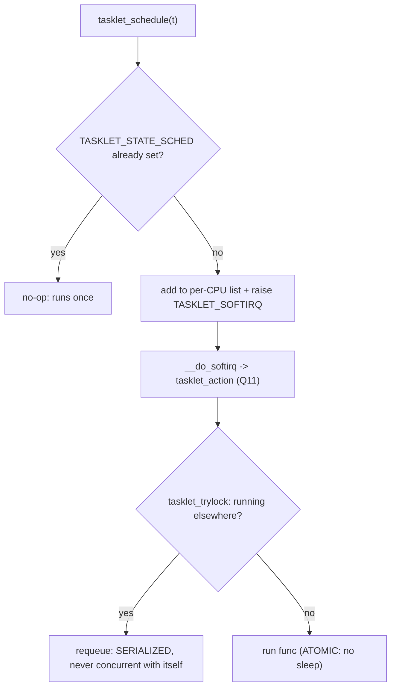
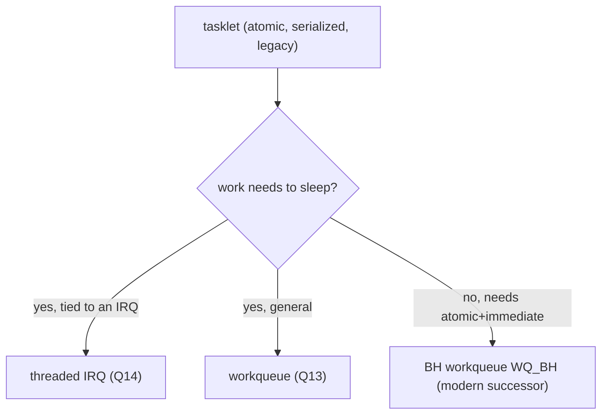

# Q12 — Tasklets: Internals, Serialization, and Deprecation (BH Workqueues)

> **Subsystem:** Bottom Halves · **Files:** `kernel/softirq.c` (tasklet code), `include/linux/interrupt.h`, `kernel/workqueue.c` (BH workqueues)
> **Interviewer is really probing:** Do you understand how **tasklets** are built on softirqs, their
> **serialization** guarantee, **why they're being deprecated**, and what **replaces** them?

---

## TL;DR Cheat Sheet

- A **tasklet** is a deferred-work primitive built **on top of the `TASKLET_SOFTIRQ`** (and `HI_SOFTIRQ` for
  high-prio). Like a softirq it runs in **atomic context** (can't sleep), but it's **dynamically created** by
  drivers (unlike static softirqs, Q11).
- **Key property — serialization:** a given tasklet is **guaranteed never to run on two CPUs at once**, and is
  serialized with itself. This makes tasklet handlers **simpler** (no per-tasklet SMP locking needed) than
  softirq handlers (which are SMP-reentrant, Q11).
- **Scheduling:** `tasklet_schedule(t)` adds the tasklet to a **per-CPU list** and raises `TASKLET_SOFTIRQ`;
  `__do_softirq` (Q11) later runs the tasklet softirq, which walks the list and runs each tasklet's function
  **once**.
- **Why deprecated:** tasklets are **atomic-only** (can't sleep — a real limitation as drivers need to do
  sleeping bus I/O), have **latency/fairness** issues (run in softirq context, can be delayed), a clumsy API,
  and the **serialization** can serialize unrelated work. The kernel is **removing** them.
- **Replacements:** **threaded IRQs** (Q14) for "handle this interrupt, maybe sleeping," **workqueues** (Q13)
  for sleepable deferred work, and the new **BH (bottom-half) workqueues** (`WQ_BH`) which provide
  **tasklet-like atomic-context** semantics with the cleaner **workqueue API** — the direct modern successor.
- New code should **not** use tasklets.

---

## The Question

> What is a tasklet and how is it implemented? What's its serialization guarantee, why is it being deprecated,
> and what replaces it?

What they want: **tasklet = dynamic bottom half on the tasklet softirq**, the **never-concurrent-with-itself**
serialization, the **atomic-context limitation** that dooms it, and the **threaded-IRQ / workqueue / BH-
workqueue** replacements.

---

## Why tasklets existed (and why they're going away)

Softirqs (Q11) are **fast** but **static** (fixed set) and **SMP-reentrant** (handlers must be SMP-safe).
Drivers wanted a **dynamic** deferred-work primitive — "schedule *this* function to run soon, in a bottom
half" — **without** the burden of making it SMP-safe and **without** consuming a precious static softirq
vector. **Tasklets** filled that gap:

- **Dynamic:** a driver creates a tasklet with its own function/data at runtime (no static registration).
- **Serialized:** the kernel **guarantees** a tasklet never runs **concurrently with itself**, so the handler
  can touch its own data **without locks** — simpler than a softirq handler.
- **Cheap:** built on the existing `TASKLET_SOFTIRQ`, so scheduling is just adding to a per-CPU list + raising
  a softirq.

But over time the **limitations** became deal-breakers:

1. **Atomic-only — can't sleep.** A tasklet runs in **softirq context**, so it **cannot** take a mutex, do
   sleeping bus I/O (I2C/SPI/regmap), or `GFP_KERNEL`-allocate. Modern drivers frequently **need to sleep** in
   their deferred work — and tasklets simply can't, forcing awkward two-stage tasklet→workqueue hops.
2. **Latency / fairness.** Tasklets run in softirq context, subject to softirq budget/ksoftirqd dynamics
   (Q11) — not well-suited to latency-sensitive or RT workloads, and the **global serialization** can delay a
   tasklet behind unrelated ones.
3. **API and semantics.** The tasklet API is **clumsy** and error-prone (enable/disable counts, kill
   ordering, the `TASKLET_STATE_*` flags), and the serialization sometimes **over-serializes**.

So the kernel community decided tasklets are **legacy** and is actively **converting** users to better
mechanisms and **removing** the API. The replacements cover the spectrum: **threaded IRQs** (Q14) and
**workqueues** (Q13) for **sleepable** work, and **BH workqueues** (`WQ_BH`) for code that genuinely needs
**tasklet-like atomic, immediate** execution but with the **modern workqueue API**. The senior framing:
*"tasklets were a dynamic, serialized softirq for drivers; their atomic-only nature and latency/API problems
made them obsolete, and they're being replaced by threaded IRQs, workqueues, and BH workqueues."*

---

## When (not) to use tasklets

| Need | Modern choice (NOT tasklet) |
|------|------------------------------|
| Deferred work that may **sleep** | **workqueue** (Q13) or **threaded IRQ** (Q14) |
| "Handle this IRQ, possibly slow/sleeping" | **threaded IRQ** (Q14) |
| Atomic-context immediate deferral (tasklet-like) | **BH workqueue** (`WQ_BH`) |
| High-throughput per-CPU networking | **NAPI/softirq** (Q11/Q16) |
| Existing tasklet in old code | convert it; don't add new tasklets |

---

## Where in the kernel

```
kernel/softirq.c          <- tasklet_action / tasklet_hi_action (run under TASKLET_SOFTIRQ),
                             tasklet_schedule, tasklet_init, tasklet_kill, TASKLET_STATE_SCHED/RUN
include/linux/interrupt.h  <- struct tasklet_struct, DECLARE_TASKLET, tasklet_schedule
kernel/workqueue.c         <- BH workqueues (WQ_BH): the modern atomic-context replacement
Documentation/             <- tasklet deprecation notes; conversion guidance
```

---

## How tasklets work — mechanics

### 1. The tasklet structure and scheduling

```c
struct tasklet_struct {
    struct tasklet_struct *next;   /* per-CPU list linkage */
    unsigned long state;           /* TASKLET_STATE_SCHED, TASKLET_STATE_RUN */
    atomic_t count;                /* disable count (0 = enabled) */
    void (*func)(unsigned long);   /* the handler */
    unsigned long data;
};

void tasklet_schedule(struct tasklet_struct *t) {
    if (!test_and_set_bit(TASKLET_STATE_SCHED, &t->state)) {  /* schedule once */
        /* add to this CPU's tasklet_vec list, raise TASKLET_SOFTIRQ */
        __tasklet_schedule(t);
    }
}
```
`tasklet_schedule` is **idempotent** while pending (`TASKLET_STATE_SCHED`): scheduling an already-scheduled
tasklet does nothing — it runs **once** even if scheduled many times before it runs. It adds the tasklet to a
**per-CPU list** and raises **`TASKLET_SOFTIRQ`** (Q11).

### 2. Running and the serialization guarantee

```c
static void tasklet_action(struct softirq_action *a) {
    /* take this CPU's tasklet list */
    for (each tasklet t in list) {
        if (tasklet_trylock(t)) {                /* TASKLET_STATE_RUN: exclusive */
            if (atomic_read(&t->count) == 0) {   /* not disabled */
                clear_bit(TASKLET_STATE_SCHED, &t->state);
                t->func(t->data);                /* RUN the handler (atomic context) */
            }
            tasklet_unlock(t);
        } else {
            /* already RUNNING on another CPU -> requeue, run later (SERIALIZATION) */
        }
    }
}
```
The **`tasklet_trylock`** (`TASKLET_STATE_RUN` bit) is the serialization: if the tasklet is **already running
on another CPU**, this CPU **doesn't** run it — it requeues it. So a given tasklet **never runs concurrently
with itself**. That's the simplification tasklets offer over softirqs (Q11), at the cost of the very
limitations that doom them.

### 3. The atomic-context limitation (the killer)

Because `tasklet_action` runs under **`TASKLET_SOFTIRQ`** (softirq context, Q11), the tasklet's `func` runs
**atomically** — **no sleeping**. A tasklet **cannot**:
- take a **mutex** (only spinlocks),
- do **sleeping bus I/O** (I2C/SPI/regmap that sleeps),
- allocate with **`GFP_KERNEL`** (must use `GFP_ATOMIC`),
- call **`copy_to_user`** (may fault/sleep).

The moment a driver's deferred work needs any of these (increasingly common), the tasklet model **breaks** —
you'd have to bolt on a workqueue, defeating the point. This is the central reason for deprecation.

### 4. enable/disable/kill

`tasklet_disable(t)` increments `count` (and **waits** if running) so the tasklet won't run; `tasklet_enable`
decrements; `tasklet_kill(t)` waits for it to finish and unschedules it — used on teardown. These APIs are
**fiddly** (ordering, sleeping in `tasklet_disable`/`kill`) and a source of bugs.

### 5. The replacements

- **Threaded IRQ (Q14):** for "process this interrupt's work, possibly sleeping" — a kthread runs `thread_fn`
  in **process context** (can sleep). Replaces the common "tasklet did IRQ post-processing" pattern, and is
  **PREEMPT_RT-friendly** (Q22).
- **Workqueue (Q13):** for general sleepable deferred work scheduled on `kworker` threads.
- **BH workqueue (`WQ_BH`):** the **direct successor** for code that truly needs **atomic, immediate**
  (tasklet-like) execution. It runs work in **softirq/BH context** like a tasklet, but through the **unified,
  cleaner workqueue API** (`queue_work` on a `WQ_BH` workqueue) — so conversions keep atomic semantics without
  the legacy tasklet API. The kernel added `WQ_BH` specifically to **retire tasklets**.

```c
/* Modern BH workqueue (atomic-context, tasklet replacement). */
struct workqueue_struct *bh_wq = alloc_workqueue("mybh", WQ_BH, 0);
INIT_WORK(&w, my_bh_work);     /* runs in BH/atomic context like a tasklet */
queue_work(bh_wq, &w);
```

---

## Diagrams

### Tasklet schedule → run (serialized)



### Deprecation map



---

## Annotated C

```c
/* Legacy tasklet (don't use in new code). */
void my_tasklet_fn(unsigned long data) {
    /* ATOMIC context: spinlocks only, GFP_ATOMIC, NO mutex/sleep/copy_to_user */
}
DECLARE_TASKLET(my_tasklet, my_tasklet_fn, 0);
/* from a top half: */
tasklet_schedule(&my_tasklet);     /* idempotent while pending; runs once; serialized */
/* teardown: */
tasklet_kill(&my_tasklet);

/* MODERN replacements: */
/* 1) sleeping work tied to an IRQ -> threaded IRQ (Q14) */
request_threaded_irq(irq, hardfn, thread_fn, IRQF_ONESHOT, "dev", dev);
/* 2) general sleeping work -> workqueue (Q13) */
schedule_work(&dev->work);
/* 3) atomic immediate (tasklet-like) -> BH workqueue */
queue_work(alloc_workqueue("bh", WQ_BH, 0), &dev->bh_work);
```

> Senior nuance: the one-liner is **"tasklet = a dynamic, self-serialized bottom half on the tasklet softirq;
> atomic-only, which is why it's deprecated."** The serialization (`tasklet_trylock`/`TASKLET_STATE_RUN`) is
> its defining feature *and* part of its problem (over-serialization). The modern answer to "what replaces
> tasklets?" is **threaded IRQs / workqueues for sleepable work, and `WQ_BH` BH workqueues for atomic
> tasklet-like work** — know all three.

---

## Company Angle

- **Qualcomm/NVIDIA (drivers):** converting legacy tasklets to **threaded IRQs** (Q14) for slow-bus devices
  (the atomic limitation bites I2C/SPI), or **BH workqueues** for atomic post-processing; PREEMPT_RT (Q22)
  strongly favors threaded over tasklet.
- **Google (networking/latency):** softirq/NAPI (Q11/Q16) over tasklets for the datapath; latency concerns
  with tasklet context; BH workqueue migration.
- **AMD/Intel:** block/driver deferred completion moving off tasklets.
- **All:** "why are tasklets deprecated and what replaces them" is a **current, modern-kernel** question.

---

## War Story

*"A sensor driver used a **tasklet** to post-process IRQ data, but a new board revision required reading a
**calibration register over I2C** in that path — and **I2C transfers sleep**. The tasklet runs in **softirq/
atomic context**, so the I2C call hit **`BUG: scheduling while atomic`** / `might_sleep` splats and
occasionally wedged the CPU. The instinct was to bolt a **workqueue** onto the tasklet (tasklet schedules a
workqueue item), but that's a clumsy **two-stage** hop with extra latency. The right fix was to **convert the
whole thing to a threaded IRQ** (Q14): a tiny hard-IRQ top half that acks and returns `IRQ_WAKE_THREAD`, and a
`thread_fn` that does the **sleeping** I2C read under a mutex — cleaner, lower latency, and **PREEMPT_RT-ready**
(Q22). For a different driver that needed **atomic but immediate** post-processing (no sleeping), we used the
modern **BH workqueue** (`WQ_BH`) instead of a tasklet. The interviewer's follow-up — *'why are tasklets being
removed at all?'* — let me explain the core reason is exactly this: **tasklets can't sleep**, modern drivers
increasingly need to, the API is clunky, and `WQ_BH`/threaded IRQs cover both atomic and sleepable cases with
better semantics — so tasklets are legacy."*

---

## Interviewer Follow-ups

1. **What is a tasklet?** A dynamic bottom half built on `TASKLET_SOFTIRQ`; atomic context (can't sleep),
   created by drivers at runtime.

2. **What's its serialization guarantee?** A given tasklet **never runs concurrently with itself** (via
   `tasklet_trylock`/`TASKLET_STATE_RUN`), so its handler needs no per-tasklet SMP lock.

3. **Tasklet vs softirq?** Softirqs are static + SMP-reentrant (Q11); tasklets are dynamic + serialized but
   built on the tasklet softirq — simpler handlers, but atomic-only and being removed.

4. **Why are tasklets deprecated?** Atomic-only (can't sleep — a real limitation), latency/fairness issues,
   clumsy API, and over-serialization; better replacements exist.

5. **What replaces tasklets?** Threaded IRQs (Q14) and workqueues (Q13) for **sleepable** work; **BH
   workqueues** (`WQ_BH`) for **atomic, tasklet-like** work via the modern workqueue API.

6. **Is `tasklet_schedule` idempotent?** Yes — while `TASKLET_STATE_SCHED` is set, re-scheduling is a no-op;
   the tasklet runs **once**.

7. **What can't a tasklet do?** Sleep — no mutex, no sleeping bus I/O, no `GFP_KERNEL`, no `copy_to_user`
   (atomic context).

8. **What is a BH workqueue (`WQ_BH`)?** A workqueue whose work runs in **softirq/BH (atomic) context** — the
   direct, modern successor to tasklets with the clean workqueue API.

9. **How do you convert a tasklet that needs to sleep?** Move to a **threaded IRQ** (if tied to an interrupt)
   or a **workqueue** (general) — both run in process context.

---

## 30-Minute Talk Track

| Min | Cover |
|-----|-------|
| 0–4 | Why tasklets existed: dynamic, serialized bottom half on the tasklet softirq |
| 4–8 | Structure + tasklet_schedule: per-CPU list, idempotent, raise TASKLET_SOFTIRQ |
| 8–12 | tasklet_action + the serialization (tasklet_trylock / STATE_RUN): never concurrent with itself |
| 12–16 | The atomic-context limitation: no sleep/mutex/GFP_KERNEL — the killer |
| 16–19 | enable/disable/kill API clunkiness; latency/over-serialization issues |
| 19–24 | Why deprecated + the replacements: threaded IRQs (Q14), workqueues (Q13), BH workqueues (WQ_BH) |
| 24–27 | When to use which replacement; PREEMPT_RT favoring threaded (Q22) |
| 27–30 | War story (tasklet + I2C sleep → threaded IRQ; WQ_BH for atomic) + deprecation rationale |
