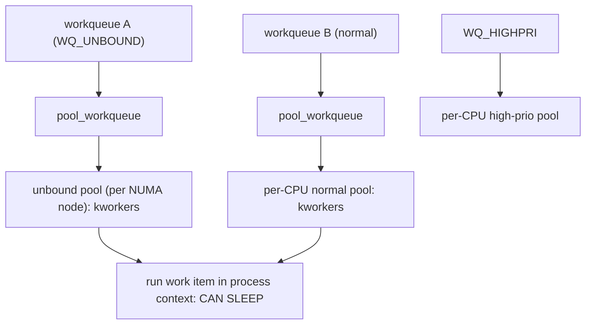
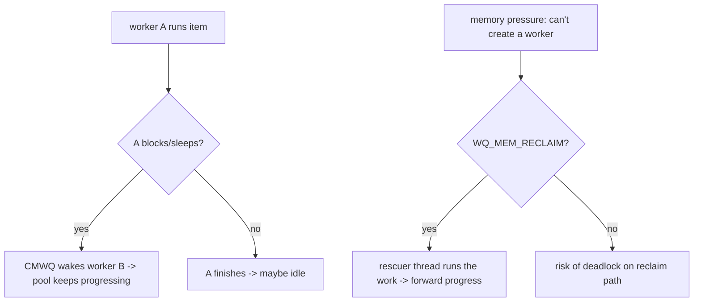

# Q13 — Workqueues and the Concurrency-Managed Workqueue (CMWQ)

> **Subsystem:** Bottom Halves · **Files:** `kernel/workqueue.c`, `include/linux/workqueue.h`
> **Interviewer is really probing:** Do you understand **process-context deferred work**, the **CMWQ**
> worker-pool model, the important **flags** (`WQ_UNBOUND`/`HIGHPRI`/`MEM_RECLAIM`/`ORDERED`), and the
> **rescuer**?

---

## TL;DR Cheat Sheet

- A **workqueue** runs deferred work in **process context** on **`kworker`** kernel threads — so the work
  **can sleep** (mutexes, sleeping bus I/O, `GFP_KERNEL`, `copy_to_user`), unlike softirqs/tasklets
  (Q11/Q12).
- **CMWQ (Concurrency-Managed Workqueues)** is the modern implementation: a shared pool of **`kworker`**
  threads per CPU (normal + high-priority pools) that execute work items from **all** workqueues, with the
  kernel **managing concurrency** — it keeps **just enough** workers running (wakes another only when a
  running worker **blocks/sleeps**), avoiding both thread explosion and stalls.
- **A `workqueue_struct` is a logical queue + attributes**, not a dedicated thread pool. Work items
  (`work_struct`) are queued to it and dispatched to **worker pools**. `schedule_work()` uses the **system**
  workqueue.
- **Key flags (`alloc_workqueue`):** `WQ_UNBOUND` (not CPU-bound; for long/cache-cold/NUMA work),
  `WQ_HIGHPRI` (high-priority worker pool), `WQ_MEM_RECLAIM` (guarantees a **rescuer** thread for forward
  progress under memory pressure), `WQ_FREEZABLE`, `WQ_BH` (atomic/BH context, tasklet replacement, Q12);
  `max_active` bounds concurrency; **ordered** workqueues run one item at a time in order.
- **Rescuer:** `WQ_MEM_RECLAIM` workqueues get a dedicated **rescuer thread** so work on the memory-reclaim
  path can run even when no new worker can be allocated (avoids deadlock).
- `delayed_work` runs after a timer; `flush_work`/`cancel_work_sync` synchronize/cancel.

---

## The Question

> Explain workqueues and CMWQ. How does the worker-pool/concurrency model work, what do the main flags do, and
> what is the rescuer for?

What they want: **process-context (sleepable) deferral**, the **CMWQ shared-worker-pool + concurrency
management** design (why it replaced per-workqueue threads), the **flags/`max_active`/ordered** controls, and
the **`WQ_MEM_RECLAIM` rescuer** for forward progress.

---

## Why workqueues (and CMWQ) exist

Softirqs and tasklets (Q11/Q12) run in **atomic context** — they **can't sleep**. But a huge amount of
deferred kernel work **must** sleep: taking a **mutex**, doing **sleeping bus I/O** (I2C/SPI/regmap), waiting
on a **completion**, allocating with **`GFP_KERNEL`** (which may block in reclaim), or **`copy_to_user`**
(which may fault). For all of that you need deferral that runs in **process context** on a real **kernel
thread** — a **workqueue**.

The naive design (the **original** workqueues) gave **each workqueue its own dedicated kthread(s) per CPU**.
That had two problems:
1. **Thread explosion:** every subsystem creating a workqueue spawned threads, wasting memory and PIDs at
   scale.
2. **Poor concurrency control:** dedicated threads either **under-utilized** (one thread, work serializes) or
   **over-provisioned** (many threads, context-switch overhead), and a blocked worker could **stall** its
   queue.

**CMWQ** redesigned this: workqueues became **logical queues** that feed a **shared pool of `kworker`
threads** (per CPU, normal + high-prio). The kernel **manages concurrency dynamically** — it runs **one**
worker per pool until that worker **goes to sleep** (blocks), at which point it wakes **another** to keep the
CPU busy. This achieves **"just enough" concurrency**: no thread explosion (workers are shared and created on
demand), no stalls (a blocked worker triggers another), and good CPU utilization. Plus it adds **forward-
progress guarantees** (the **rescuer** for `WQ_MEM_RECLAIM`) so work on the **memory-reclaim path** can't
deadlock waiting for a worker that can't be allocated because memory is tight.

The senior framing: workqueues are the **sleepable bottom half**; **CMWQ** is the clever **shared-worker-pool
+ concurrency-managed** implementation that gives flexible, scalable, deadlock-safe process-context deferral —
the go-to for any interrupt/driver work that needs to block (and the destination when converting tasklets,
Q12).

---

## When to use a workqueue (vs alternatives)

| Need | Choice |
|------|--------|
| Deferred work that **sleeps** (mutex, sleeping I/O, GFP_KERNEL) | **workqueue** |
| Work tied to a specific IRQ that may sleep | **threaded IRQ** (Q14) — often better than WQ |
| Atomic, immediate (tasklet-like) | **BH workqueue** `WQ_BH` (Q12) |
| High-throughput per-CPU atomic | **softirq/NAPI** (Q11/Q16) |
| Long-running / cache-cold / NUMA-spread | `WQ_UNBOUND` workqueue |
| Work on the **reclaim** path | `WQ_MEM_RECLAIM` (rescuer) |
| Strictly ordered, one-at-a-time | **ordered** workqueue (`max_active = 1`) |
| Run after a delay | `delayed_work` / `schedule_delayed_work` |

---

## Where in the kernel

```
kernel/workqueue.c        <- CMWQ: worker_pool, worker, pool_workqueue (pwq), worker management,
                             alloc_workqueue, queue_work, flush/cancel, rescuer, WQ_* flags
include/linux/workqueue.h  <- work_struct, delayed_work, INIT_WORK, schedule_work, WQ_* flags
Documentation/core-api/workqueue.rst  <- the CMWQ design doc
/sys/devices/virtual/workqueue/ , /proc  <- workqueue attributes/affinity
```

---

## How workqueues / CMWQ work — mechanics

### 1. Work items and queues

```c
struct work_struct { atomic_long_t data; struct list_head entry; work_func_t func; };
INIT_WORK(&dev->work, my_work_fn);     /* my_work_fn runs in process context (can sleep) */
schedule_work(&dev->work);             /* queue on the SYSTEM workqueue */
/* or a dedicated workqueue: */
dev->wq = alloc_workqueue("mydev", WQ_UNBOUND | WQ_MEM_RECLAIM, 0);
queue_work(dev->wq, &dev->work);
```
A **`work_struct`** is just "a function + linkage." A **`workqueue_struct`** is a **logical queue** with
attributes; queuing a work item attaches it to a **`pool_workqueue (pwq)`** which feeds a **worker pool**.

### 2. Worker pools and `kworker` threads

CMWQ maintains **per-CPU worker pools** (a **normal** and a **high-priority** pool per CPU) plus **unbound**
pools (per NUMA node) for `WQ_UNBOUND` work. Each pool has a set of **`kworker`** threads (you see
`kworker/0:1`, `kworker/u8:2` in `ps`). A pool's workers pull and execute work items from the workqueues that
target that pool. Workers are **created on demand** and **reclaimed** when idle — no static per-workqueue
threads.

### 3. Concurrency management (the CMWQ insight)

The kernel keeps **exactly one** runnable worker per pool busy, and wakes **another** only when the running
one **goes to sleep**:

```
worker A runs work item -> calls mutex_lock() and BLOCKS
   -> CMWQ notices A scheduled out -> wakes worker B to run the next work item
worker A wakes later, finishes -> may go idle
```
This is done via scheduler hooks (`wq_worker_sleeping`/`wq_worker_running`): when a worker **sleeps**, CMWQ
ensures **another** worker is available so the pool keeps making progress; when work is light, only one (or
zero) workers run. Net effect: **"just enough" concurrency** — high CPU utilization without thread explosion
or stalls. `max_active` caps how many work items of a workqueue can run **concurrently** (default high;
**ordered** = 1).

### 4. The important flags

```
WQ_UNBOUND     : work not bound to the CPU that queued it; runs on unbound (NUMA) pools.
                 For LONG-running or CPU-intensive work (don't pin a CPU) or cache-cold work.
WQ_HIGHPRI     : use the high-priority worker pool (runs before normal-prio work).
WQ_MEM_RECLAIM : guarantee a RESCUER thread -> forward progress under memory pressure (see below).
WQ_FREEZABLE   : freeze during system suspend (Q24).
WQ_BH          : run in BH/atomic (softirq) context -> tasklet replacement (Q12) [no sleeping].
WQ_SYSFS       : expose attributes in sysfs (affinity tuning).
max_active     : max concurrent work items; ordered workqueue = alloc_ordered_workqueue (max_active 1).
```

### 5. The rescuer (`WQ_MEM_RECLAIM`)

Normally CMWQ **creates a new worker** when a pool needs one. But on the **memory-reclaim path**, allocating a
new worker (which needs memory) could **deadlock** — you need to do work to free memory, but you can't get a
worker without memory. So workqueues marked **`WQ_MEM_RECLAIM`** get a **dedicated, pre-allocated rescuer
thread**: if the pool **can't** create a normal worker (memory pressure), the **rescuer** steps in to run the
queue's work, guaranteeing **forward progress**. Any workqueue used on the **writeback/reclaim/IO completion**
path (which frees memory) **must** set `WQ_MEM_RECLAIM` to avoid this deadlock — a classic correctness
requirement.

### 6. Synchronization and teardown

```c
flush_work(&dev->work);          /* wait until THIS work item finishes */
flush_workqueue(dev->wq);        /* wait for all current work on the wq */
cancel_work_sync(&dev->work);    /* cancel + wait (safe teardown) */
destroy_workqueue(dev->wq);      /* drain + free */
```
`cancel_work_sync`/`flush_work` are essential on **driver teardown** (like `free_irq`'s synchronization, Q9):
ensure no work item is still running before freeing data it touches. `delayed_work` adds a timer:
`schedule_delayed_work(&dwork, jiffies_delay)`.

---

## Diagrams

### CMWQ structure



### Concurrency management + rescuer



---

## Annotated C

```c
/* A unit of deferred, sleepable work. */
struct work_struct work;
INIT_WORK(&work, my_work_fn);
static void my_work_fn(struct work_struct *w) {
    struct mydev *d = container_of(w, struct mydev, work);
    mutex_lock(&d->lock);            /* OK: process context, CAN SLEEP */
    slow_i2c_transfer(d);            /* sleeping bus I/O fine here */
    mutex_unlock(&d->lock);
}

/* Dedicated workqueue with reclaim safety + bounded concurrency. */
struct workqueue_struct *wq = alloc_workqueue("mydev",
        WQ_UNBOUND | WQ_MEM_RECLAIM, 1 /* max_active */);
queue_work(wq, &work);

/* Ordered (one at a time, in order). */
struct workqueue_struct *owq = alloc_ordered_workqueue("ord", 0);

/* Delayed work + teardown sync. */
schedule_delayed_work(&dwork, msecs_to_jiffies(50));
cancel_work_sync(&work);
destroy_workqueue(wq);
```

> Senior nuance: the two ideas to nail are **(1) CMWQ shares `kworker` pools and manages concurrency** —
> wake another worker only when a running one **blocks** → "just enough" parallelism, no thread explosion;
> and **(2) `WQ_MEM_RECLAIM` provides a rescuer** so work on the **reclaim path** makes forward progress when
> no new worker can be allocated. Use `WQ_UNBOUND` for long/NUMA work, ordered for serialization, and always
> `cancel_work_sync` on teardown.

---

## Company Angle

- **Qualcomm/NVIDIA (drivers):** workqueues for **sleeping** deferred work (I2C/SPI/regmap, firmware load),
  `WQ_MEM_RECLAIM` for IO/reclaim-path work, `WQ_UNBOUND` for long ops; often **threaded IRQs** (Q14) preferred
  for IRQ-tied work; converting tasklets (Q12) to workqueues/BH workqueues.
- **Google (scale):** CMWQ worker-pool efficiency, `WQ_UNBOUND` + NUMA affinity, `max_active` tuning,
  observability of `kworker` CPU; rescuer correctness on writeback/reclaim.
- **AMD/Intel (storage/IO):** block IO completion workqueues, `WQ_MEM_RECLAIM` requirement on the writeback
  path, high-prio pools.
- **All:** `WQ_MEM_RECLAIM`/rescuer (deadlock avoidance) and `cancel_work_sync` teardown are universal
  correctness points.

---

## War Story

*"Under heavy memory pressure, a storage driver **deadlocked**: its IO-completion path used a **plain
workqueue** (no `WQ_MEM_RECLAIM`), and completing IO is exactly what would **free memory**. When memory got
tight, CMWQ needed to **allocate a new `kworker`** to run the completion work — but allocating the worker
**needs memory**, which was unavailable until the completion work freed some… a classic **reclaim deadlock**.
The system hung with work stuck on the queue. The fix was textbook: mark that workqueue **`WQ_MEM_RECLAIM`**,
which gives it a **dedicated rescuer thread** pre-allocated at creation — so when the pool can't spawn a normal
worker under pressure, the **rescuer** runs the completion work, freeing memory and breaking the cycle. We
audited all driver workqueues on the IO/writeback path to ensure they set `WQ_MEM_RECLAIM`. The interviewer's
follow-up — *'why does CMWQ need a rescuer at all?'* — let me explain CMWQ normally **creates workers on
demand**, which requires memory; on the **reclaim path** that's circular, so the rescuer is a **pre-allocated
escape hatch** guaranteeing forward progress — which is why any workqueue whose work helps free memory **must**
declare `WQ_MEM_RECLAIM`."*

---

## Interviewer Follow-ups

1. **Workqueue vs softirq/tasklet?** Workqueues run in **process context** on kthreads → **can sleep**
   (mutex, sleeping I/O, `GFP_KERNEL`); softirqs/tasklets are atomic (Q11/Q12).

2. **What is CMWQ?** Concurrency-Managed Workqueues — workqueues are logical queues feeding **shared per-CPU
   `kworker` pools**, with the kernel managing **how many workers run** (wake another only when one blocks).

3. **Why did CMWQ replace per-workqueue threads?** To avoid **thread explosion** and provide **dynamic
   concurrency** (good utilization, no stalls) instead of static dedicated threads.

4. **What does `WQ_UNBOUND` do?** Work isn't bound to the queuing CPU; runs on unbound (NUMA) pools — for
   long-running, CPU-intensive, or cache-cold work.

5. **What is the rescuer / `WQ_MEM_RECLAIM`?** A pre-allocated thread guaranteeing forward progress when a new
   worker can't be allocated under memory pressure — required for workqueues on the **reclaim/writeback** path.

6. **What does `max_active` / ordered do?** Caps concurrent work items; **ordered** (`max_active = 1`) runs one
   at a time in queue order.

7. **How does concurrency management work?** Scheduler hooks detect when a worker **sleeps** and wake another
   so the pool keeps progressing — "just enough" concurrency.

8. **How do you safely tear down?** `cancel_work_sync`/`flush_work` to ensure no work is running, then
   `destroy_workqueue` — like `free_irq`'s synchronization (Q9).

9. **What's `WQ_BH`?** A workqueue running in **BH/atomic** context — the modern **tasklet replacement** (Q12);
   it **can't sleep**.

---

## 30-Minute Talk Track

| Min | Cover |
|-----|-------|
| 0–4 | Why workqueues: sleepable deferred work (mutex/sleeping I/O/GFP_KERNEL) vs atomic softirq/tasklet |
| 4–8 | Original per-workqueue threads → problems (explosion, poor concurrency) → CMWQ |
| 8–13 | CMWQ structure: workqueue (logical) → pwq → shared kworker pools (per-CPU normal/highpri, unbound) |
| 13–17 | Concurrency management: one worker until it blocks, then wake another; max_active; ordered |
| 17–22 | Flags: WQ_UNBOUND/HIGHPRI/MEM_RECLAIM/FREEZABLE/BH; when each |
| 22–26 | The rescuer + WQ_MEM_RECLAIM: forward progress on the reclaim path (deadlock avoidance) |
| 26–28 | Synchronization/teardown: flush_work, cancel_work_sync, delayed_work |
| 28–30 | War story (reclaim deadlock → WQ_MEM_RECLAIM rescuer) + CMWQ rationale |
