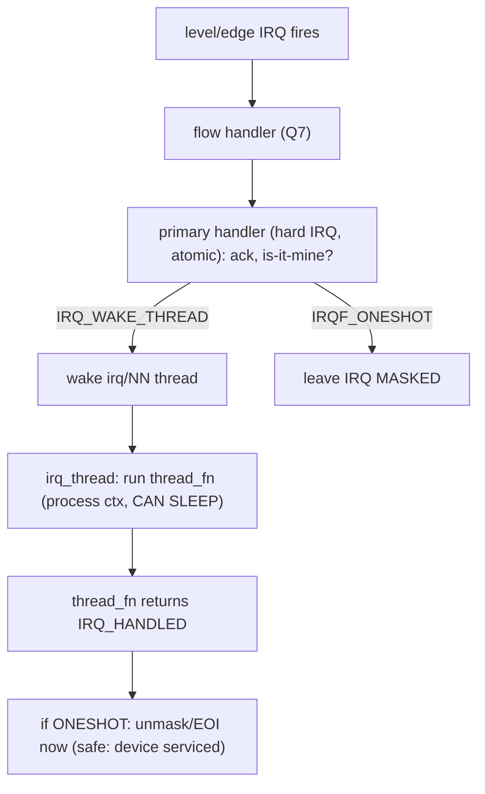
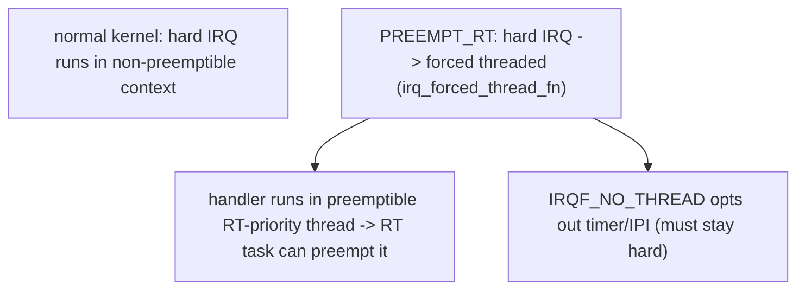

# Q14 — Threaded IRQs Internals

> **Subsystem:** Bottom Halves · **Files:** `kernel/irq/manage.c` (`irq_thread`), `include/linux/interrupt.h`
> **Interviewer is really probing (NVIDIA/Qualcomm favorite):** Do you understand how a **handler runs in a
> kernel thread**, the **primary/threaded split**, **`IRQF_ONESHOT`** masking, and why **PREEMPT_RT forces**
> threaded IRQs?

---

## TL;DR Cheat Sheet

- A **threaded IRQ** runs the interrupt handler's body in a **dedicated kernel thread** (`irq/NN-name`), in
  **process context** — so it **can sleep** (mutex, sleeping bus I/O, `GFP_KERNEL`), unlike a hard IRQ handler.
- **`request_threaded_irq(irq, handler, thread_fn, flags, name, dev)`** (Q9):
  - **`handler`** = the **primary** (hard-IRQ) handler — quick, atomic; returns **`IRQ_WAKE_THREAD`** to defer.
  - **`thread_fn`** = the **threaded** handler — runs in the kthread, can sleep.
  - **`handler == NULL`** → a **default primary** that just wakes the thread (requires **`IRQF_ONESHOT`**).
- **`IRQF_ONESHOT`** keeps the IRQ **masked** from the hard-IRQ until the **thread_fn completes**, then
  unmasks/EOIs — so a **level** device doesn't re-interrupt while the (slow) thread is still processing.
- **Why thread:** lets the "bottom half" **sleep** (the big win over softirq/tasklet, Q11/Q12), gives each IRQ
  a **schedulable**, **prioritizable**, **affinitizable** thread, and is the foundation of **PREEMPT_RT**
  (Q22), where **all** hard IRQs are **forced threaded** so they're preemptible.
- The IRQ thread can be given **RT priority** (`SCHED_FIFO`) for low, bounded latency; its affinity follows
  the IRQ's affinity (Q15).

---

## The Question

> How do threaded IRQs work internally? Explain the primary/threaded split, `IRQF_ONESHOT`, the IRQ thread,
> and why PREEMPT_RT forces threading.

What they want: the **two-part handler** model, the **kthread (`irq_thread`) + `IRQ_WAKE_THREAD`** mechanics,
the **`IRQF_ONESHOT` masking** discipline (esp. for level IRQs), and the **PREEMPT_RT forced-threading**
rationale.

---

## Why threaded IRQs exist

The classic interrupt model is **top half (hard IRQ) + bottom half (softirq/tasklet/workqueue)**
(Q11/Q12/Q13). The hard IRQ runs with the line masked and **can't sleep** (Q-fundamentals). For a lot of
devices that's fine — but increasingly drivers need their interrupt processing to **sleep**:

- a sensor's IRQ requires reading a register over **I2C/SPI/regmap** (which **sleeps**),
- the handler must take a **mutex** that protects shared driver state,
- it needs to **allocate** with `GFP_KERNEL` or do other blocking operations.

The old workarounds were ugly: hard IRQ → **tasklet** (still atomic, Q12) → bolt on a **workqueue** for the
sleeping part (a clumsy two-stage hop with extra latency). **Threaded IRQs** make this clean: the kernel runs
the handler body **in a dedicated kernel thread** tied to that IRQ, in **process context**, so it can sleep
**directly**. The driver provides a tiny **primary** handler (acks the device, decides "is it mine?") and a
**threaded** handler (`thread_fn`) that does the real, possibly-sleeping work.

Two further motivations make threaded IRQs central, not just convenient:

1. **Schedulability & priority.** An IRQ thread is a **real task** — it can be given **RT priority**, pinned
   to CPUs, and **preempted**. This gives **predictable, bounded interrupt latency** for real-time workloads,
   instead of unbounded hard-IRQ execution stealing the CPU.
2. **PREEMPT_RT (Q22).** Real-time Linux needs the kernel to be **preemptible almost everywhere**, but hard
   IRQ handlers run in non-preemptible context. PREEMPT_RT **forces all hard IRQs to be threaded**, so the
   actual handling runs in **preemptible threads** that the scheduler can prioritize — shrinking the
   non-preemptible windows that cause latency. Threaded IRQs are the **mechanism** that makes RT possible.

The senior framing: threaded IRQs move interrupt **handling into schedulable process-context threads**,
giving **sleepability**, **priority**, and **preemptibility** — the modern default for many drivers and the
**foundation of PREEMPT_RT**. Tasklets (Q12) are being replaced largely *by* threaded IRQs.

---

## When to use threaded IRQs

| Situation | Use |
|-----------|-----|
| Handler must sleep (I2C/SPI/regmap, mutex, GFP_KERNEL) | **threaded IRQ** (`thread_fn`) |
| Quick check then defer everything sleepable | `request_threaded_irq(NULL, thread_fn, IRQF_ONESHOT)` |
| Level IRQ + slow handling | threaded + **`IRQF_ONESHOT`** (keep masked until thread done) |
| Real-time / bounded latency | threaded IRQ with **RT priority** |
| PREEMPT_RT kernel | **all** hard IRQs forced threaded automatically (Q22) |
| Pure fast atomic work | hard IRQ + softirq/NAPI (Q11/Q16) — threading adds latency |

---

## Where in the kernel

```
kernel/irq/manage.c     <- request_threaded_irq, __setup_irq (thread setup, Q9), irq_thread(),
                           irq_thread_fn, wake_threads_waitq, IRQF_ONESHOT mask handling,
                           irq_forced_thread_fn (PREEMPT_RT forced threading)
include/linux/interrupt.h <- IRQF_ONESHOT, IRQ_WAKE_THREAD, request_threaded_irq
kernel/irq/chip.c       <- flow handler cooperation (handle_fasteoi/level with oneshot, Q7)
```

---

## How threaded IRQs work — mechanics

### 1. The two-part handler

```c
/* PRIMARY (hard IRQ): quick, atomic, decides whether to wake the thread. */
static irqreturn_t my_primary(int irq, void *dev) {
    struct mydev *d = dev;
    u32 st = readl(d->regs + STATUS);
    if (!(st & PENDING)) return IRQ_NONE;   /* shared: not mine (Q10) */
    writel(st, d->regs + ACK);              /* ack fast */
    d->pending = st;
    return IRQ_WAKE_THREAD;                  /* defer to thread_fn */
}
/* THREADED (kthread, process context): may sleep. */
static irqreturn_t my_thread(int irq, void *dev) {
    struct mydev *d = dev;
    mutex_lock(&d->lock);                    /* OK: can sleep here */
    slow_i2c_read(d, d->pending);            /* sleeping bus I/O fine */
    mutex_unlock(&d->lock);
    return IRQ_HANDLED;
}
request_threaded_irq(irq, my_primary, my_thread, IRQF_ONESHOT, "mydev", dev);
```
If `handler` (primary) is **NULL**, the kernel installs **`irq_default_primary_handler`** which simply returns
`IRQ_WAKE_THREAD` — but then **`IRQF_ONESHOT` is mandatory** (the line must stay masked until the thread runs,
since there's no real primary to quiet the device).

### 2. The IRQ thread (`irq_thread`)

`__setup_irq` (Q9) creates a kthread per threaded `irqaction`:
```
kthread "irq/<irq>-<name>"  running irq_thread():
   loop:
      wait until woken (IRQ_WAKE_THREAD set THREAD_WAKE)
      call action->thread_fn(irq, dev_id)     <-- the sleeping handler runs here
      if IRQF_ONESHOT: unmask the IRQ (the hard IRQ kept it masked)
      note completion (threads_active--, wake waiters for synchronize_irq, Q20)
```
When the primary returns `IRQ_WAKE_THREAD`, the generic layer (`__irq_wake_thread`) **wakes** this thread. The
thread runs `thread_fn` in **process context** — preemptible, schedulable, can sleep. There's **one thread per
threaded irqaction** (so shared threaded IRQs, Q10, each get their own thread).

### 3. `IRQF_ONESHOT` and masking (the level-IRQ correctness point)

For a **level-triggered** device, the interrupt stays asserted until the device is serviced — but the
**threaded** handler runs **later** (after a wakeup + scheduling delay) and **slowly** (it sleeps). If the line
were **unmasked** during that window, the controller would **re-present** the still-asserted interrupt
repeatedly → a **storm** (Q7/Q10). **`IRQF_ONESHOT`** solves this: the hard-IRQ path **leaves the IRQ masked**
after waking the thread, and the IRQ is **unmasked only after `thread_fn` completes**. So the device can't
re-interrupt until its handler has actually serviced it. `IRQF_ONESHOT` is **required** when there's no real
primary handler and **strongly recommended** for level IRQs with threads.

### 4. Priority, affinity, and scheduling

The IRQ thread is a normal task:
- It can be given **RT priority** (`SCHED_FIFO`) — e.g. via the driver or `chrt` on `irq/NN-*` — for **low,
  bounded** latency (the scheduler runs it ahead of normal work). This is how RT systems get deterministic
  interrupt response (Q22/Q23).
- Its **affinity** follows the IRQ's affinity (Q15) — the thread runs where the interrupt is routed (locality;
  the kernel keeps them aligned, `IRQTF_AFFINITY`).
- Being **preemptible**, it doesn't monopolize the CPU like a hard IRQ could — important for latency.

### 5. PREEMPT_RT forced threading (Q22)

On **PREEMPT_RT**, the kernel **forces almost all** hard IRQ handlers to run **threaded** (via
`irq_forced_thread_fn`), even those registered as plain `request_irq`. Why: hard IRQ context is
**non-preemptible**, and unbounded hard-IRQ execution destroys real-time latency. By **threading** the
handlers, RT makes interrupt handling **preemptible and prioritizable**, so a high-priority RT task can
**preempt** interrupt processing — shrinking the non-preemptible windows to tiny `raw_spinlock`/genuinely-
atomic regions. Forced threading is a **defining feature** of PREEMPT_RT, and threaded IRQs are its building
block. (`IRQF_NO_THREAD` opts specific IRQs out — e.g. the timer/IPIs that must stay in hard context.)

### 6. Synchronization with `free_irq`/`synchronize_irq`

`free_irq` (Q9) and `synchronize_irq` (Q20) must account for the **thread**: teardown stops the IRQ thread
(`kthread_stop`) and waits for any in-flight `thread_fn` to finish (`threads_active`/`synchronize_irq`)
**before** returning — so the driver can safely free data. This is part of the `free_irq` synchronization
contract (Q9).

---

## Diagrams

### Primary → thread



### PREEMPT_RT forced threading



---

## Annotated C

```c
/* The IRQ thread loop (kernel/irq/manage.c, simplified). */
static int irq_thread(void *data) {
    struct irqaction *action = data;
    struct irq_desc *desc = irq_to_desc(action->irq);
    while (!kthread_should_stop()) {
        wait_for_wake(action);                 /* primary returned IRQ_WAKE_THREAD */
        irqreturn_t ret = action->thread_fn(action->irq, action->dev_id); /* CAN SLEEP */
        if (action->flags & IRQF_ONESHOT)
            unmask_threaded_irq(desc);         /* device serviced -> safe to unmask */
        wake_threads_waitq(desc);              /* for synchronize_irq (Q20) */
    }
    return 0;
}

/* Default primary when handler == NULL (requires IRQF_ONESHOT). */
irqreturn_t irq_default_primary_handler(int irq, void *dev) { return IRQ_WAKE_THREAD; }

/* Give the IRQ thread RT priority for bounded latency (Q22/Q23). */
/* sched_setscheduler(action->thread, SCHED_FIFO, &param);  or chrt on irq/NN-* */
```

> Senior nuance: the three things to nail — **(1)** primary returns `IRQ_WAKE_THREAD` to defer to a kthread
> that **can sleep**; **(2)** `IRQF_ONESHOT` **keeps the IRQ masked until `thread_fn` finishes** (essential
> for level IRQs so they don't storm during the slow threaded handling); **(3)** PREEMPT_RT **forces** all
> hard IRQs threaded so handling is **preemptible/prioritizable** — the basis of RT latency (Q22). Threaded
> IRQs are also the clean replacement for tasklet+workqueue hops (Q12).

---

## Company Angle

- **Qualcomm/NVIDIA (the headline):** threaded IRQs for **slow-bus** devices (I2C/SPI/regmap/PMIC) that must
  sleep in the handler; converting tasklets (Q12); RT priority for latency (Q23); the default driver pattern on
  SoCs.
- **NVIDIA/Qualcomm (RT/automotive):** **PREEMPT_RT** forced threading (Q22), RT-priority IRQ threads,
  bounded interrupt latency, `IRQF_NO_THREAD` for timer/IPI.
- **Google:** threaded NAPI (Q16) as a relative; threaded handlers for predictable latency at scale.
- **AMD/Intel:** threaded IRQs where handlers block; interplay with MSI-X per-vector handlers (Q4) and
  affinity (Q15).

---

## War Story

*"A PMIC driver's IRQ handler needed to read several status registers over **I2C** to figure out which
sub-interrupt fired — and **I2C transfers sleep**. It was originally a plain `request_irq` hard handler doing
the I2C reads, which produced **`scheduling while atomic`** splats and intermittent hangs (you **can't sleep**
in hard IRQ context). I converted it to a **threaded IRQ**: a tiny **primary** that just returns
`IRQ_WAKE_THREAD` (so `handler = NULL` with **`IRQF_ONESHOT`**), and a **`thread_fn`** that does the sleeping
I2C reads under the driver mutex. Crucially, the PMIC IRQ is **level-triggered**, so without `IRQF_ONESHOT` the
line would stay asserted and **storm** while the threaded handler was still reading registers — `IRQF_ONESHOT`
keeps it **masked until `thread_fn` completes**, then unmasks. On the RT variant of the product we also gave
the IRQ thread **`SCHED_FIFO`** priority for bounded latency. The interviewer's follow-up — *'why is
`IRQF_ONESHOT` needed for the NULL-handler case?'* — let me explain there's **no real primary** to quiet the
device, and the threaded handler runs **later and slowly**, so the IRQ **must** stay masked until the thread
services the device — otherwise a level line re-fires continuously (Q7/Q10); `IRQF_ONESHOT` enforces exactly
that masking discipline."*

---

## Interviewer Follow-ups

1. **What is a threaded IRQ?** An interrupt whose handler body (`thread_fn`) runs in a **dedicated kernel
   thread** in **process context**, so it **can sleep**.

2. **Primary vs threaded handler?** Primary = quick hard-IRQ handler (atomic, "is it mine?", ack) returning
   `IRQ_WAKE_THREAD`; threaded = the sleeping work in the kthread. `handler == NULL` uses a default primary
   (needs `IRQF_ONESHOT`).

3. **What does `IRQF_ONESHOT` do?** Keeps the IRQ **masked** from the hard-IRQ until `thread_fn` completes —
   prevents a level device from re-interrupting (storming) during slow threaded handling.

4. **When is `IRQF_ONESHOT` required?** When `handler == NULL` (no real primary), and strongly recommended for
   level IRQs with threads.

5. **Why thread an IRQ at all?** To **sleep** in the handler (mutex/sleeping I/O/GFP_KERNEL), and to make
   handling **schedulable, prioritizable, preemptible** (RT latency).

6. **Why does PREEMPT_RT force threading?** Hard IRQ context is non-preemptible; threading makes handlers
   preemptible RT-priority tasks so RT work can preempt them — the basis of RT latency (Q22).

7. **One thread per IRQ?** One IRQ thread **per threaded irqaction** — shared threaded IRQs (Q10) each get
   their own.

8. **How does affinity/priority work?** The thread follows the IRQ's affinity (Q15) and can be given RT
   priority (`SCHED_FIFO`) for bounded latency (Q23).

9. **How does teardown handle the thread?** `free_irq`/`synchronize_irq` stop the IRQ thread and wait for any
   in-flight `thread_fn` before returning (Q9/Q20).

---

## 30-Minute Talk Track

| Min | Cover |
|-----|-------|
| 0–4 | Why thread: need to sleep in the handler; old tasklet+workqueue hop was clumsy (Q12) |
| 4–8 | Two-part model: primary (hard IRQ, atomic) → IRQ_WAKE_THREAD → thread_fn (process ctx, sleeps) |
| 8–12 | request_threaded_irq; handler==NULL default primary; one thread per irqaction (Q9) |
| 12–16 | irq_thread loop: wake, run thread_fn, unmask if ONESHOT, signal completion |
| 16–20 | IRQF_ONESHOT + level IRQ masking discipline (no storm during slow threaded handling, Q7/Q10) |
| 20–24 | Priority/affinity: RT-priority IRQ threads, follow IRQ affinity (Q15), preemptible (latency Q23) |
| 24–27 | PREEMPT_RT forced threading: why, irq_forced_thread_fn, IRQF_NO_THREAD exceptions (Q22) |
| 27–30 | War story (PMIC I2C in IRQ → threaded + ONESHOT) + ONESHOT rationale |
