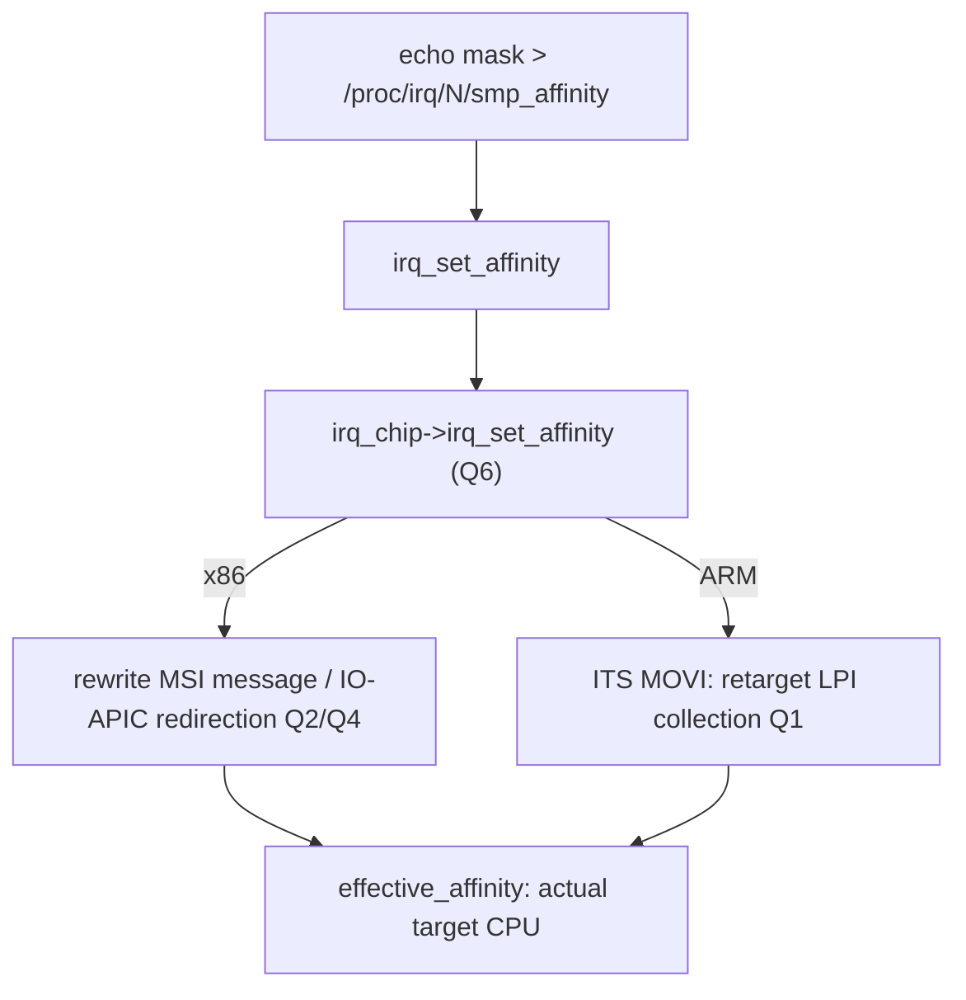
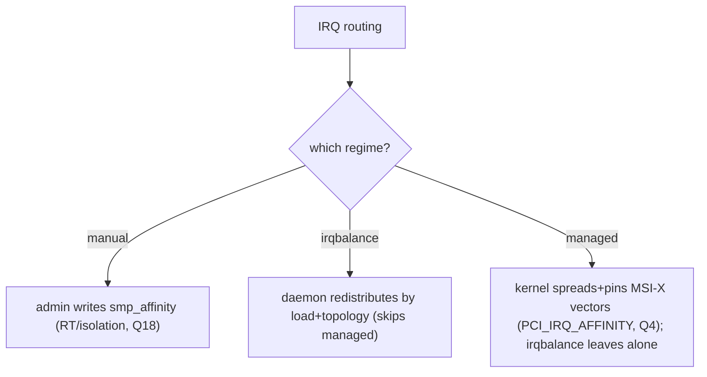

# Q15 — IRQ Affinity and irqbalance

> **Subsystem:** Affinity & Performance · **Files:** `kernel/irq/manage.c` (`irq_set_affinity`), `kernel/irq/affinity.c`, userspace `irqbalance`
> **Interviewer is really probing (Google/AMD favorite):** Do you understand **where interrupts are routed**,
> how `smp_affinity` / **managed affinity** work, what **irqbalance** does, and the locality/scaling trade-offs?

---

## TL;DR Cheat Sheet

- **IRQ affinity** = which **CPU(s)** a given interrupt is delivered to. Set per-IRQ via
  **`/proc/irq/N/smp_affinity`** (mask) or `smp_affinity_list`, and in-kernel via `irq_set_affinity()` →
  the controller's `irq_chip->irq_set_affinity` (GIC ITS command / x86 MSI message rewrite, Q1/Q2/Q4).
- **Why it matters:** routing a device's interrupt to the **CPU that will process its data** (and that
  submitted the work) gives **cache locality**, spreads load across cores (**scaling**), and keeps interrupts
  **off** latency-critical/isolated CPUs (Q18). Bad affinity = one CPU drowning in softirqs (Q11) while others
  idle.
- **Three affinity regimes:**
  - **Manual:** write `smp_affinity` (admin/scripts).
  - **irqbalance:** a **userspace daemon** that periodically **redistributes** IRQs across CPUs based on load
    and topology (good for general servers; sometimes fights latency tuning).
  - **Managed/auto affinity** (`IRQD_AFFINITY_MANAGED`): the **kernel** spreads a device's MSI-X vectors
    across CPUs at allocation (`PCI_IRQ_AFFINITY`, Q4) and **pins** them — the modern default for multi-queue
    NICs/NVMe; **irqbalance leaves managed IRQs alone**.
- **`affinity_hint`**: a driver's suggestion of the ideal CPU per vector (irqbalance can honor it).
- **Locality vs spreading:** spread for **throughput** (all cores busy), but keep each queue's IRQ near the
  CPU consuming its data for **cache locality** — managed affinity does both by construction.

---

## The Question

> How does IRQ affinity work? Explain `smp_affinity`, managed affinity, and irqbalance, and the trade-offs in
> routing interrupts for performance.

What they want: the **per-IRQ CPU routing** mechanism (`smp_affinity` → chip op), the **manual / irqbalance /
managed** regimes, **why locality + spreading** matter (multi-queue scaling, Q4/Q16), and the **managed-
affinity-vs-irqbalance** interaction.

---

## Why IRQ affinity matters

On an SMP machine, **where** an interrupt is delivered has large performance consequences:

- **Cache locality:** when a device finishes work (a NIC receives a packet, an NVMe completes an I/O), the
  data is processed in the **softirq/NAPI** (Q11/Q16) or threaded handler triggered by the interrupt. If that
  runs on the **same CPU** that submitted the request (or will consume the data), the relevant data is **warm
  in that CPU's cache** → much faster. Routing the completion interrupt to a **random** CPU means cache
  misses and cross-core traffic.
- **Load spreading / scaling:** a multi-queue device (Q4) has **many** interrupt vectors. If they all land on
  **one CPU**, that CPU **drowns in softirqs** (Q11 war story) while the rest idle — throughput is capped at
  one core. Spreading vectors across CPUs lets interrupt/softirq processing **scale** with cores.
- **Latency isolation:** latency-critical or **isolated** CPUs (RT tasks, `nohz_full`, Q18) should be kept
  **free of device interrupts** so they're not perturbed. Affinity is how you **steer interrupts away** from
  those CPUs.

So IRQ affinity is a **first-order performance and latency lever**. The challenge is doing it **well**: you
want vectors **spread** across CPUs (scaling) **and** each near the CPU that consumes its data (locality) **and**
off the isolated cores — a non-trivial assignment that the **managed/auto affinity** machinery now handles
automatically for MSI-X devices, while **irqbalance** handles general cases and **manual** tuning handles
special ones. The senior framing: **affinity decides where interrupt work lands — get it right (spread +
local + isolated-aware) and the system scales; get it wrong and one CPU melts down.**

---

## When each affinity regime applies

| Situation | Regime |
|-----------|--------|
| Multi-queue NIC/NVMe/GPU (MSI-X) | **managed/auto affinity** (`PCI_IRQ_AFFINITY`, kernel spreads + pins) |
| General-purpose server, mixed devices | **irqbalance** daemon redistributes |
| RT / `nohz_full` / pinned workloads | **manual** `smp_affinity` to steer IRQs off isolated CPUs (Q18) |
| Specific tuning / debugging | **manual** `/proc/irq/N/smp_affinity` |
| Driver knows ideal CPU per vector | **`affinity_hint`** (irqbalance honors) |

---

## Where in the kernel

```
kernel/irq/manage.c      <- irq_set_affinity, __irq_set_affinity, irq_set_affinity_hint,
                            /proc/irq/N/smp_affinity handling
kernel/irq/affinity.c    <- irq_create_affinity_masks: spread vectors across CPUs (managed)
kernel/irq/proc.c        <- /proc/irq/N/{smp_affinity, smp_affinity_list, effective_affinity}
drivers/pci/msi/         <- PCI_IRQ_AFFINITY -> managed affinity for MSI-X (Q4)
irq_chip->irq_set_affinity in drivers/irqchip (GIC ITS, Q1) / arch/x86 (MSI, Q2/Q4)
Userspace: irqbalance daemon
```

---

## How IRQ affinity works — mechanics

### 1. Setting affinity (the path to hardware)

```
echo 4 > /proc/irq/42/smp_affinity        # route IRQ 42 to CPU2 (bit 2 set)
   -> irq_set_affinity(42, mask)
      -> irq_desc->irq_data.chip->irq_set_affinity(irq_data, mask, force)
           x86:  recompute + REWRITE the MSI message (dest APIC/vector) (Q2/Q4)
           ARM:  issue an ITS MOVI command to retarget the LPI collection (Q1)
   -> effective_affinity may be a subset (hardware can target one CPU, not the whole mask)
```
You request a **mask** of allowed CPUs; the controller picks an **effective** CPU (visible in
`/proc/irq/N/effective_affinity`). For **wired** IRQs the IO-APIC/GIC redirection/route is reprogrammed; for
**MSI** it's the message/ITS (Q4) — the actual mechanism differs by controller but the **`irq_chip` op**
abstracts it (Q6).

### 2. `smp_affinity` interface

- **`/proc/irq/N/smp_affinity`** — hex CPU bitmask of **allowed** CPUs.
- **`/proc/irq/N/smp_affinity_list`** — same as a CPU list (e.g. `2-3,8`).
- **`/proc/irq/N/effective_affinity`** — the CPU(s) the hardware **actually** targets (often a single CPU).
- **`/proc/irq/default_smp_affinity`** — default for newly-allocated IRQs.

### 3. irqbalance — the userspace daemon

**`irqbalance`** runs in userspace and periodically:
- reads `/proc/interrupts` (Q21) and topology (`/sys` — package/cache/NUMA),
- computes a **balanced** assignment, and
- writes `smp_affinity` to **redistribute** IRQs across CPUs by load, with **topology awareness** (keep
  related IRQs on the same package/cache, spread heavy ones).
It's good for **general** servers with diverse devices. Caveats: it can **fight** manual/RT tuning (it may move
an IRQ you pinned), and it **skips managed IRQs** (it must not re-balance kernel-managed MSI-X affinity).
On latency-critical/RT systems, irqbalance is often **disabled** in favor of **manual** steering (Q18).

### 4. Managed / automatic affinity (the modern default)

For **MSI-X multi-queue** devices, the kernel does affinity **at vector allocation** (`PCI_IRQ_AFFINITY`, Q4):
```
pci_alloc_irq_vectors_affinity(pdev, ..., PCI_IRQ_AFFINITY, &affd):
   irq_create_affinity_masks(): SPREAD the N vectors across CPUs (and NUMA nodes),
      assigning each vector a managed affinity (one vector per CPU/group).
   each vector's IRQ is marked IRQD_AFFINITY_MANAGED -> kernel owns its affinity.
```
- The kernel **spreads** vectors across all CPUs **and pins** each (managed) — so queue *i*'s interrupt lands
  on a sensible CPU, and the driver maps **queue *i* → that CPU** (RX/TX/completion locality).
- **irqbalance leaves managed IRQs alone** (it must — moving them would break the device's queue↔CPU mapping).
- Managed affinity also handles **CPU hotplug** gracefully (vectors for an offlined CPU are reassigned within
  the managed set).
This gives **spreading + locality automatically** — the reason multi-queue NICs/NVMe "just scale" on modern
kernels.

### 5. `affinity_hint`

A driver can call `irq_set_affinity_hint(irq, mask)` to **suggest** the ideal CPU for a vector (e.g. the CPU
its queue serves). irqbalance can **honor** the hint when balancing. (Managed affinity supersedes hints for
managed IRQs.)

### 6. Locality vs spreading trade-off

- **Throughput** wants vectors **spread** so all cores share interrupt/softirq load.
- **Locality** wants each vector **near** the CPU consuming its data (cache-warm).
- **Latency isolation** wants vectors **off** RT/isolated CPUs (Q18).
Managed affinity reconciles spread + locality by construction (one queue per CPU, driver aligns queues). For
RT, you **override** to steer all device IRQs onto housekeeping CPUs (Q18). For NUMA, keep a device's vectors
on its **local node's** CPUs (the device's `dev_to_node`).

---

## Diagrams

### smp_affinity → hardware



### Three regimes



---

## Annotated C

```c
/* In-kernel: set where an IRQ is delivered. */
int irq_set_affinity(unsigned int irq, const struct cpumask *cpumask);
/* -> desc->irq_data.chip->irq_set_affinity(...) -> controller reprograms target (Q1/Q2/Q4) */

/* Driver hint (irqbalance may honor). */
int irq_set_affinity_hint(unsigned int irq, const struct cpumask *m);  /* (newer: irq_update_affinity_hint) */

/* Managed/auto affinity for MSI-X (the modern default, Q4). */
struct irq_affinity affd = { .pre_vectors = 1, /* e.g. admin/mgmt vector */ };
int n = pci_alloc_irq_vectors_affinity(pdev, min, max,
            PCI_IRQ_MSIX | PCI_IRQ_AFFINITY, &affd);  /* kernel spreads + pins (IRQD_AFFINITY_MANAGED) */

/* Spread N vectors across CPUs (kernel/irq/affinity.c). */
struct irq_affinity_desc *irq_create_affinity_masks(unsigned int nvecs,
                                                    struct irq_affinity *affd);
```

```bash
cat /proc/irq/42/smp_affinity_list       # allowed CPUs
cat /proc/irq/42/effective_affinity_list # actual target
echo 2-3 > /proc/irq/42/smp_affinity_list
systemctl status irqbalance              # the daemon
```

> Senior nuance: **managed affinity is the modern default** for MSI-X multi-queue — the kernel **spreads and
> pins** vectors at allocation (`PCI_IRQ_AFFINITY`), giving scaling **and** locality, and **irqbalance must
> not touch managed IRQs**. Use **manual** `smp_affinity` to steer interrupts **off** isolated/RT CPUs (Q18).
> The mechanism (rewrite MSI message vs ITS MOVI) differs by controller but is abstracted by the
> `irq_chip->irq_set_affinity` op (Q6).

---

## Company Angle

- **Google/AMD (the headline):** multi-queue NIC/NVMe affinity at scale, managed affinity + RPS/RFS (Q16),
  spreading across many cores, NUMA-local vector placement, irqbalance vs managed; `/proc/interrupts` analysis
  (Q21).
- **NVIDIA (GPU/MSI-X):** per-vector affinity for completion-interrupt locality (Q4), steering GPU IRQs.
- **Qualcomm/ARM (RT/SoC):** GIC ITS affinity (MOVI, Q1), steering IRQs off RT/isolated cores (Q18/Q22),
  manual affinity for determinism.
- **All:** the locality+spreading trade-off and managed-vs-irqbalance interaction are universal.

---

## War Story

*"A multi-queue NIC's interrupts were all stacking on **CPU0** — `/proc/interrupts` (Q21) showed every queue's
vector counting up on one core, which **drowned in `NET_RX` softirqs** (Q11) and capped throughput while 31
cores idled. Two issues: the driver requested vectors **without `PCI_IRQ_AFFINITY`** (so no managed spreading),
and **irqbalance** wasn't effectively redistributing them (and on this latency-sensitive box we'd actually
disabled it). Fix: switched the driver to **`pci_alloc_irq_vectors_affinity(..., PCI_IRQ_AFFINITY)`** so the
kernel **spread and pinned** the MSI-X vectors across all CPUs (managed affinity, `IRQD_AFFINITY_MANAGED`), and
aligned **queue *i* → its vector's CPU** for **cache locality**. Interrupts spread across cores, softirq load
balanced, and throughput scaled. We also confirmed **irqbalance leaves managed IRQs alone** so it wouldn't
undo the kernel's assignment. The interviewer's follow-up — *'why not just let irqbalance handle it?'* — let
me explain irqbalance is a **general** userspace heuristic that reacts **after the fact** and can fight tuning;
**managed affinity** sets the right spread+locality **at allocation** and is **hotplug-aware**, which is why
it's the modern default for multi-queue devices — irqbalance is for the **general/mixed** case and **must
not** touch managed IRQs."*

---

## Interviewer Follow-ups

1. **What is IRQ affinity?** Which CPU(s) an interrupt is delivered to — set via `/proc/irq/N/smp_affinity`
   or `irq_set_affinity`, reprogramming the controller (MSI message / ITS).

2. **Why does affinity matter?** Cache locality (process data on the CPU that owns it), load spreading
   (scaling across cores), and keeping interrupts off latency/isolated CPUs (Q18).

3. **Manual vs irqbalance vs managed?** Manual = admin writes smp_affinity; irqbalance = userspace daemon
   redistributes by load/topology; managed = kernel spreads+pins MSI-X vectors at allocation
   (`PCI_IRQ_AFFINITY`).

4. **What is managed affinity?** `IRQD_AFFINITY_MANAGED` — the kernel assigns/pins MSI-X vector affinity
   (spread + local) at allocation; irqbalance leaves these alone; hotplug-aware.

5. **What does `effective_affinity` show?** The CPU(s) the hardware **actually** targets (often a single CPU),
   vs the requested allowed mask.

6. **How is affinity applied to hardware?** `irq_chip->irq_set_affinity`: x86 rewrites the MSI message /
   IO-APIC entry; ARM issues an ITS `MOVI` to retarget the LPI (Q1/Q2/Q4).

7. **Why might you disable irqbalance?** On RT/latency-critical or carefully-tuned systems it can move IRQs you
   pinned; you steer manually instead (Q18).

8. **What is `affinity_hint`?** A driver's suggested ideal CPU per vector that irqbalance may honor (managed
   affinity supersedes it for managed IRQs).

9. **Locality vs spreading?** Spread for throughput (all cores), keep each vector near the consuming CPU for
   locality, off isolated CPUs for latency — managed affinity does spread+local automatically.

---

## 30-Minute Talk Track

| Min | Cover |
|-----|-------|
| 0–4 | Why affinity: cache locality, load spreading, latency isolation; bad affinity = one CPU melts |
| 4–8 | smp_affinity interface; the path to hardware via irq_chip->irq_set_affinity (Q6); effective_affinity |
| 8–12 | x86 (rewrite MSI message/IO-APIC) vs ARM (ITS MOVI) affinity mechanics (Q1/Q2/Q4) |
| 12–16 | irqbalance: userspace daemon, load+topology, caveats (fights tuning, skips managed) |
| 16–22 | Managed/auto affinity: PCI_IRQ_AFFINITY, spread+pin, IRQD_AFFINITY_MANAGED, hotplug, queue↔CPU |
| 22–25 | affinity_hint; NUMA-local placement; steering off isolated/RT CPUs (Q18) |
| 25–28 | Locality vs spreading trade-off; relation to NAPI/RPS (Q16) |
| 28–30 | War story (all IRQs on CPU0 → managed affinity) + irqbalance-vs-managed |
