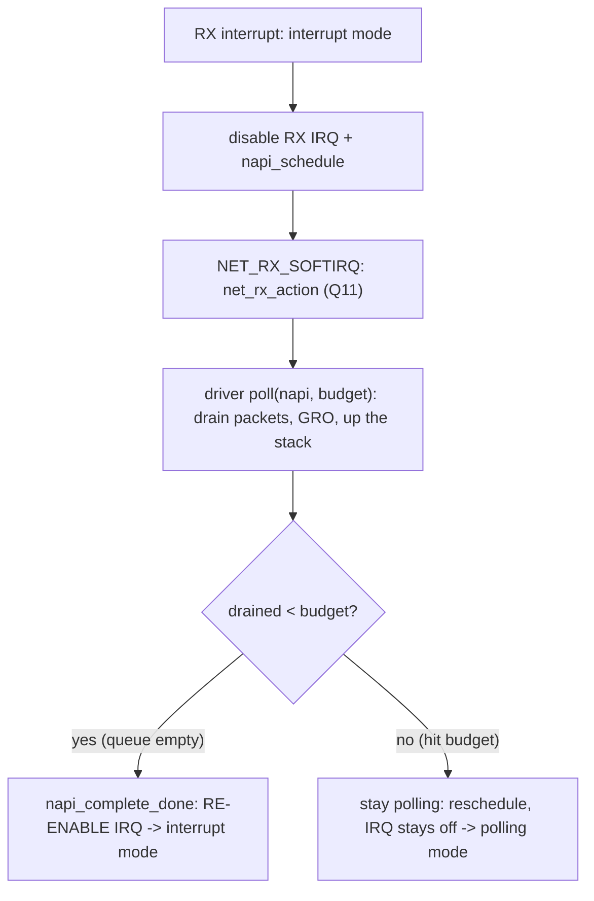

# Q16 — NAPI and Interrupt Mitigation

> **Subsystem:** Affinity & Performance · **Files:** `net/core/dev.c`, `include/linux/netdevice.h`, drivers' `poll`
> **Interviewer is really probing (Google favorite):** Do you understand **why per-packet interrupts don't
> scale**, how **NAPI** switches to **polling** under load, the **budget**, and the **softirq/RPS/threaded-NAPI**
> ecosystem?

---

## TL;DR Cheat Sheet

- **NAPI (New API)** is the kernel's **interrupt-mitigation** scheme for networking: under high traffic it
  **disables the device's RX interrupt** and **polls** the NIC for packets in **batches**, instead of taking
  **one interrupt per packet** — which would melt the CPU at high packet rates.
- **Mechanism:** RX interrupt fires → driver **disables further RX IRQs** and **schedules NAPI**
  (`napi_schedule`) → runs under **`NET_RX_SOFTIRQ`** (Q11) → the driver's **`poll(napi, budget)`** drains up
  to **`budget`** packets (default **64**) → if it drained **fewer** than budget (queue empty), **re-enable
  the interrupt** (`napi_complete_done`) and go back to interrupt mode; if it hit budget, **stay polling**
  (reschedule).
- **Adaptive:** **interrupt mode** at low rates (low latency, no wasted polling) ↔ **polling mode** at high
  rates (high throughput, interrupt mitigation). The budget bounds per-poll work so one NIC can't starve
  others/user space (Q11).
- **Ecosystem:** **GRO** (Generic Receive Offload) coalesces packets during poll; **RPS/RFS** spread RX
  processing across CPUs in software (complements MSI-X affinity, Q15); **threaded NAPI** runs poll in a
  **kthread** instead of softirq (better latency/isolation, Q22); **XDP** runs in the poll path for
  ultra-fast filtering/redirect.
- Tunables: `ethtool -c` (coalescing, Q17), `net.core.netdev_budget`, `netdev_budget_usecs`, RPS via
  `/sys/class/net/*/queues/rx-*/rps_cpus`, `/sys/class/net/*/threaded` (threaded NAPI).

---

## The Question

> What is NAPI and why does it exist? How does it switch between interrupt and polling modes, what is the
> budget, and how do GRO/RPS/threaded-NAPI fit in?

What they want: the **per-packet-interrupt scaling problem**, the **disable-IRQ + poll-in-batches** mechanism,
the **budget + interrupt↔poll mode switching**, and the **softirq/RPS/threaded-NAPI** context (the heart of
Linux networking performance).

---

## Why NAPI exists

At high packet rates, **one interrupt per packet is catastrophic**. A 10/40/100 GbE NIC can receive
**millions of packets per second**; an interrupt per packet means:
- **millions of interrupts/sec** — the CPU spends all its time in **interrupt entry/exit overhead** (context
  save/restore, EOI), not actually processing packets,
- **livelock**: under a packet flood the CPU is so busy taking interrupts it makes **no forward progress** on
  the packets themselves (the classic "receive livelock"),
- **no batching**: per-packet processing can't amortize costs (cache, locks) across packets.

The fix is **interrupt mitigation**: when traffic is heavy, **stop taking interrupts** and instead **poll** the
device, pulling **many packets per poll** in a **batch**. This amortizes overhead, eliminates the
interrupt-per-packet storm, and prevents livelock. But you don't want to poll when traffic is **light** (that
wastes CPU and adds latency) — so the scheme must be **adaptive**: **interrupt-driven** when idle/light
(responsive, no wasted polling), **poll-driven** when busy (high throughput). That adaptive switch is **NAPI**.

NAPI also needs a **fairness backstop**: polling could monopolize the CPU. So each poll is bounded by a
**budget** (max packets per poll), and polling runs under the **`NET_RX_SOFTIRQ`** with the softirq budget +
**ksoftirqd** offload (Q11) — so one busy NIC can't starve other NICs or user space. The senior framing:
**NAPI is adaptive interrupt mitigation — interrupt when light, poll-in-batches when heavy, bounded by a
budget** — and it's the foundation of Linux's high-performance receive path, surrounded by **GRO/RPS/RFS/
threaded-NAPI/XDP**. Google probes this because networking throughput/latency lives here.

---

## When NAPI switches modes

| Condition | Mode |
|-----------|------|
| Low/no traffic | **interrupt mode** — RX IRQ enabled, fires per (few) packets |
| RX IRQ fires | disable RX IRQ, **`napi_schedule`** → poll |
| poll drains **< budget** (queue empty) | **`napi_complete_done`** → **re-enable IRQ**, back to interrupt mode |
| poll hits **budget** (more pending) | **stay in poll mode** (reschedule NAPI), IRQ stays disabled |
| sustained high traffic | **polling mode** — interrupts effectively off, batched polling |

---

## Where in the kernel

```
net/core/dev.c          <- napi_schedule, napi_complete_done, net_rx_action (NET_RX_SOFTIRQ poll loop),
                           netdev_budget, napi_poll, GRO (napi_gro_receive), threaded NAPI
include/linux/netdevice.h <- struct napi_struct, netif_napi_add, napi->poll
drivers/net/.../*_poll() <- per-driver poll() that drains the RX ring
net/core/dev.c (RPS/RFS) <- get_rps_cpu, rps_map; sysfs rps_cpus
sysctl: net.core.netdev_budget, netdev_budget_usecs; /sys/class/net/*/threaded
```

---

## How NAPI works — mechanics

### 1. The poll cycle

```
RX interrupt fires (interrupt mode):
   driver ISR: disable RX interrupts on the NIC; napi_schedule(&napi)  -> raise NET_RX_SOFTIRQ
NET_RX_SOFTIRQ (net_rx_action, Q11):
   for each scheduled napi (within netdev_budget / netdev_budget_usecs):
        work = napi->poll(napi, budget);     // driver drains up to `budget` packets
        if (work < budget) {                 // queue drained -> done
            napi_complete_done(napi, work);  // RE-ENABLE the RX interrupt -> back to interrupt mode
        } else {
            // hit budget -> more packets pending -> STAY polling (leave on the poll list)
        }
```
Each driver implements **`poll(napi, budget)`**: pull packets off the RX ring, run them up the stack
(`napi_gro_receive` → `netif_receive_skb`), and **return how many** it processed. Returning **< budget** means
"queue empty, I'm done" → re-enable the interrupt; returning **== budget** means "more to do" → keep polling.

### 2. The budget (per-poll and per-softirq)

- **Per-NAPI budget** (default **64**): max packets a single `poll()` call processes — bounds one queue's work
  per poll so it can't hog.
- **Per-softirq budget** (`net.core.netdev_budget`, default ~300, and `netdev_budget_usecs`): the **total**
  work `net_rx_action` does per softirq invocation across all NAPIs — when exceeded, it **yields** (and may
  defer to **ksoftirqd**, Q11). This is the system-level fairness backstop.

### 3. Interrupt ↔ poll mode switching (the adaptive core)

```
LIGHT traffic:  interrupt fires -> poll drains the few packets (< budget) -> re-enable IRQ.
                Effectively still interrupt-driven: low latency, no wasted CPU polling.
HEAVY traffic:  poll always hits budget (queue never empties) -> NAPI stays scheduled,
                IRQ stays DISABLED -> pure polling: no interrupt storm, max batching/throughput.
```
The switch is **automatic and per-queue**, driven entirely by whether `poll` drained the queue. This is the
elegance: **no mode flag to manage** — the budget/drain test *is* the mode switch.

### 4. GRO — batching up the stack

During poll, **GRO (Generic Receive Offload)** coalesces multiple received packets of the same flow into one
larger `skb` (`napi_gro_receive`) before passing up the stack — amortizing per-packet stack costs across a
batch. A big throughput win, complementary to NAPI's interrupt mitigation.

### 5. RPS / RFS — spreading RX in software

MSI-X affinity (Q15) steers the **interrupt** to a CPU, but you may want RX **protocol processing** spread
further or steered to the CPU running the consuming app:
- **RPS (Receive Packet Steering):** software hashing of incoming packets to **distribute** them across CPUs
  for stack processing (set via `rps_cpus`), useful when the NIC has fewer queues than CPUs.
- **RFS (Receive Flow Steering):** steer a flow's packets to the CPU where the **application** that consumes
  them runs (flow→CPU table) — for **cache locality** end-to-end.
These complement NAPI/MSI-X by balancing the **softirq** RX work, important for high-PPS scaling (Q15 war
story).

### 6. Threaded NAPI

By default NAPI poll runs in **softirq** context (`NET_RX_SOFTIRQ`, Q11) — which can monopolize a CPU and is
hard to prioritize/isolate. **Threaded NAPI** (`/sys/class/net/*/threaded`) runs each NAPI's poll in a
**dedicated kthread** instead, so RX processing becomes **schedulable** (priority, affinity, preemptible) —
better for **latency**, **isolation** (Q18), and **PREEMPT_RT** (Q22). It trades a little throughput for much
better control. Increasingly used for latency-sensitive and RT networking.

### 7. XDP (mention)

**XDP (eXpress Data Path)** runs an eBPF program **in the NAPI poll path** (before `skb` allocation) for
ultra-low-latency **drop/redirect/load-balance** — the fastest in-kernel packet path, built on the same
poll/NAPI infrastructure.

---

## Diagrams

### NAPI poll cycle



### Adaptive modes

```
   low traffic  -> interrupt mode (responsive)   |   high traffic -> polling mode (throughput)
   switch is automatic: did poll() drain the queue (< budget)? yes->IRQ on ; no->keep polling
```

---

## Annotated C

```c
/* NAPI context (include/linux/netdevice.h). */
struct napi_struct {
    struct list_head poll_list;
    int (*poll)(struct napi_struct *, int budget);   /* driver drains RX ring */
    int weight;                                       /* per-poll budget (default 64) */
    /* state, GRO list, thread (threaded NAPI), etc. */
};

/* Driver: register NAPI + poll. */
netif_napi_add(netdev, &q->napi, my_poll);   /* weight = NAPI_POLL_WEIGHT (64) */

/* ISR (interrupt mode): disable IRQ, schedule poll. */
static irqreturn_t rx_isr(int irq, void *q_) {
    struct myq *q = q_;
    disable_rx_irq(q);            /* stop per-packet interrupts */
    napi_schedule(&q->napi);     /* raise NET_RX_SOFTIRQ */
    return IRQ_HANDLED;
}

/* poll: drain up to `budget`, decide mode. */
static int my_poll(struct napi_struct *napi, int budget) {
    int work = 0;
    while (work < budget && (skb = drain_one(napi)))
        { napi_gro_receive(napi, skb); work++; }     /* GRO + up the stack */
    if (work < budget) {                              /* queue empty */
        napi_complete_done(napi, work);
        enable_rx_irq(napi);                          /* back to interrupt mode */
    }
    return work;                                      /* == budget -> keep polling */
}
```

```bash
sysctl net.core.netdev_budget net.core.netdev_budget_usecs
echo f > /sys/class/net/eth0/queues/rx-0/rps_cpus      # RPS: spread RX to CPUs 0-3
echo 1 > /sys/class/net/eth0/threaded                  # threaded NAPI
ethtool -c eth0                                        # interrupt coalescing (Q17)
```

> Senior nuance: NAPI's brilliance is the **automatic mode switch via the budget/drain test** — no per-packet
> interrupt under load (poll in batches), but full interrupt responsiveness when idle, with **no explicit mode
> management**. It runs under **`NET_RX_SOFTIRQ`** (Q11), so its fairness inherits the softirq budget +
> ksoftirqd; **threaded NAPI** moves it to a kthread for latency/isolation (Q18/Q22); **GRO/RPS/RFS** batch and
> spread the work. This is *the* Linux RX performance story.

---

## Company Angle

- **Google (the headline):** NAPI/`NET_RX_SOFTIRQ` (Q11), budget tuning, **RPS/RFS**, **threaded NAPI**,
  **XDP**, GRO, MSI-X per-queue affinity (Q15), ksoftirqd CPU under high PPS — core networking-performance
  territory.
- **NVIDIA (smartNICs/DPU):** high-PPS RX, XDP/AF_XDP, NAPI budget, interrupt coalescing (Q17).
- **AMD/Intel:** NIC driver poll, MSI-X queues + NAPI, RPS on many-core, coalescing.
- **Qualcomm (mobile/embedded net):** NAPI on lower-power NICs, threaded NAPI for latency, power vs
  throughput.

---

## War Story

*"A 25 GbE server hit a throughput ceiling well below line rate with one CPU pegged at ~100% in **`ksoftirqd`**
(Q11). Tracing showed the RX path was effectively **interrupt-per-packet** at moderate rates because the
driver's coalescing/NAPI wasn't engaging properly, and all RX softirq work was on **one CPU** (single queue /
poor affinity, Q15). Fixes, in NAPI terms: (1) ensured **NAPI** was correctly disabling the RX interrupt on
schedule and **polling in batches** (so we got interrupt mitigation under load instead of a per-packet storm);
(2) enabled **MSI-X multi-queue + managed affinity** (Q4/Q15) so RX interrupts/NAPI instances **spread across
CPUs**; (3) turned on **RPS/RFS** to distribute stack processing and steer flows to the consuming app's CPU
(locality); (4) for the latency-sensitive variant, enabled **threaded NAPI** so poll ran in schedulable
kthreads we could prioritize/isolate (Q18/Q22). Throughput climbed toward line rate and ksoftirqd stopped
saturating one core. The interviewer's follow-up — *'how does NAPI decide to poll vs interrupt?'* — let me
explain the **budget/drain test**: if `poll` drains **fewer than budget** packets, the queue's empty so it
**re-enables the interrupt** (light traffic → interrupt mode); if it **hits budget**, more packets are
pending so it **keeps polling** with the IRQ disabled (heavy traffic → polling mode) — fully automatic, no
mode flag."*

---

## Interviewer Follow-ups

1. **What is NAPI?** Adaptive interrupt mitigation for networking: under load it disables the RX interrupt and
   **polls** the NIC in **batches** instead of taking one interrupt per packet.

2. **Why is per-packet interrupt bad?** Millions of interrupts/sec at high PPS = all CPU in interrupt
   overhead, receive **livelock**, no batching.

3. **How does mode switching work?** If `poll` drains **< budget** (queue empty) → `napi_complete_done`
   re-enables the IRQ (interrupt mode); if it hits **budget** → stay polling (IRQ off). Automatic.

4. **What is the budget?** Per-poll cap (default 64 packets) + per-softirq `netdev_budget` — bounds work so one
   queue/NIC can't starve others or user space (Q11).

5. **Where does NAPI run?** Under **`NET_RX_SOFTIRQ`** (Q11) in `net_rx_action`; **threaded NAPI** runs poll in
   a kthread instead.

6. **What is GRO?** Generic Receive Offload — coalesces same-flow packets into larger skbs during poll to
   amortize stack costs.

7. **RPS vs RFS?** RPS spreads RX stack processing across CPUs (software hashing); RFS steers a flow to the
   CPU running its consuming application (locality).

8. **What is threaded NAPI and why?** Poll runs in a dedicated kthread (not softirq) → schedulable,
   prioritizable, isolatable — better latency/isolation/RT (Q18/Q22).

9. **How does NAPI relate to MSI-X affinity (Q15)?** MSI-X gives per-queue interrupts spread across CPUs;
   NAPI/RPS/RFS spread/steer the RX processing — together they scale the receive path.

---

## 30-Minute Talk Track

| Min | Cover |
|-----|-------|
| 0–4 | Per-packet interrupt problem: storms, livelock, no batching at high PPS |
| 4–8 | NAPI mechanism: ISR disables RX IRQ + napi_schedule → NET_RX_SOFTIRQ poll |
| 8–13 | The poll cycle + budget; drain<budget → re-enable IRQ; drain==budget → keep polling |
| 13–16 | Adaptive modes: interrupt when light, poll when heavy; automatic via budget/drain |
| 16–19 | Per-poll vs per-softirq budget (netdev_budget); fairness + ksoftirqd (Q11) |
| 19–23 | GRO (batch up the stack); RPS/RFS (spread/steer RX, locality) vs MSI-X affinity (Q15) |
| 23–27 | Threaded NAPI (kthread, latency/isolation, Q18/Q22); XDP in the poll path |
| 27–30 | War story (ksoftirqd-bound RX → NAPI+MSI-X+RPS+threaded) + mode-switch explanation |
