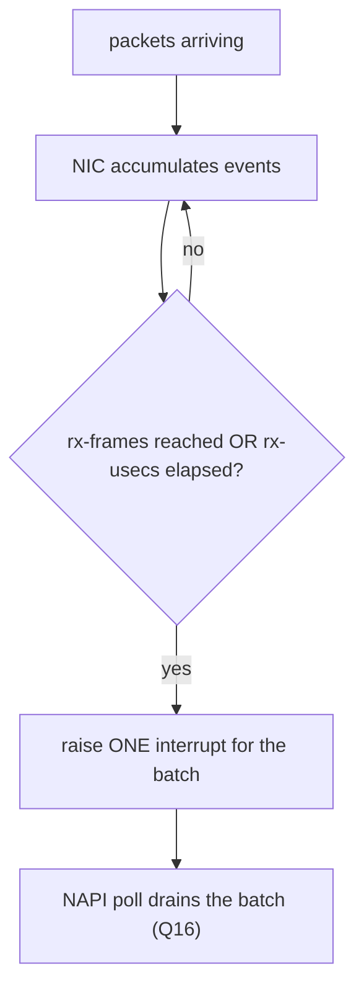

# Q17 — Interrupt Coalescing and Moderation

> **Subsystem:** Affinity & Performance · **Files:** driver `ethtool` ops, `ethtool -C`, `include/uapi/linux/ethtool.h`
> **Interviewer is really probing:** Do you understand **hardware** interrupt coalescing (vs NAPI's software
> mitigation, Q16), the **latency vs throughput** trade-off, and **adaptive moderation**?

---

## TL;DR Cheat Sheet

- **Interrupt coalescing (moderation)** is a **hardware** feature (mostly NICs) that **delays/batches**
  interrupts: instead of interrupting after every packet/completion, the device waits until **N events** or a
  **time window (T µs)** elapses, then raises **one** interrupt for the batch.
- **Two knobs:** **packet count** (`rx-frames`) and **time** (`rx-usecs`) — interrupt fires when **either**
  threshold is hit. Separate settings for RX and TX.
- **Why:** fewer interrupts → less CPU overhead and better **throughput** at high rates; but each interrupt
  now covers a **batch**, adding up to T µs of **latency**. It's a direct **latency ↔ throughput** dial.
- **vs NAPI (Q16):** NAPI is the kernel's **software** mitigation (poll in batches). Coalescing is the
  **hardware** layer **beneath** it — they're complementary: coalescing reduces how often the NIC interrupts;
  NAPI batches processing once interrupted. Both reduce interrupt-per-packet overhead.
- **Adaptive (DIM):** **Dynamic Interrupt Moderation** auto-tunes coalescing based on traffic — low latency
  (small/no coalescing) when light, more coalescing when heavy. Configured via `ethtool -C adaptive-rx on`.
- Configured with **`ethtool -c/-C <dev>`**; driver implements `get/set_coalesce`.

---

## The Question

> What is interrupt coalescing? How does it differ from NAPI, what's the latency/throughput trade-off, and what
> is adaptive moderation?

What they want: **hardware batching of interrupts** (count/time thresholds), the explicit **latency-vs-
throughput** trade-off, the **complementary** relationship to NAPI (Q16), and **adaptive (DIM)** moderation.

---

## Why interrupt coalescing exists

Even with NAPI (Q16) batching the **processing**, the **device** still decides **when to raise an interrupt**.
If the NIC interrupts on **every** received packet, then at high packet rates you get a flood of interrupts —
each causing an entry into the kernel (even if NAPI then polls). **Interrupt coalescing** lets the **hardware**
**hold off** the interrupt and **batch** multiple events into **one** signal:

- raise an interrupt only after **N packets/completions** have accumulated (`rx-frames`), **or**
- after a **time window** of **T microseconds** since the first un-notified event (`rx-usecs`),
- whichever comes **first**.

The motivation is the same **interrupt-overhead** problem as NAPI, attacked at the **hardware** layer:
**fewer interrupts = less per-interrupt CPU cost = higher throughput**. But it introduces a **deliberate
latency**: a packet might sit in the NIC for up to **T µs** (or until N accumulate) before the CPU is told.
So coalescing is a **direct latency ↔ throughput trade-off dial**:

- **More coalescing** (high N, high T): great **throughput**, low CPU overhead, **higher latency** — good for
  bulk transfer, storage, batch workloads.
- **Less/no coalescing** (low N, low T): **low latency**, more interrupts, more CPU — good for latency-
  sensitive workloads (HFT, RPC, gaming, RT).

The senior framing: coalescing is the **hardware-level** complement to NAPI's **software-level** mitigation —
together they minimize interrupt overhead — and tuning it (or letting **adaptive/DIM** tune it) is how you
place a workload on the **latency-vs-throughput** spectrum. Knowing it's **separate from** but **works with**
NAPI is a key distinction interviewers check.

---

## When to tune coalescing

| Workload | Setting |
|----------|---------|
| Latency-sensitive (HFT, RPC, RT, gaming) | **low** `rx-usecs`/`rx-frames` (minimal coalescing) → low latency |
| Throughput/bulk (storage, backups, streaming) | **higher** `rx-usecs`/`rx-frames` → fewer interrupts, more throughput |
| Mixed / general | **adaptive** (`adaptive-rx on`) — DIM auto-tunes |
| CPU-overload from interrupts | increase coalescing to cut interrupt rate |
| Tail-latency problems | decrease coalescing (less holding delay) |

---

## Where in the kernel / userspace

```
include/uapi/linux/ethtool.h  <- struct ethtool_coalesce (rx/tx-usecs, rx/tx-frames, adaptive flags)
net/ethtool/                  <- ethtool netlink/ioctl: get/set coalesce
drivers/net/.../ethtool_ops   <- driver get_coalesce/set_coalesce (program the NIC registers)
drivers/net/.../*_dim.c       <- Dynamic Interrupt Moderation (DIM) library (net/core/dim.c)
net/core/dim.c                <- generic DIM: adaptive moderation algorithm
Userspace: ethtool -c / -C <dev>
```

---

## How coalescing works — mechanics

### 1. The thresholds

```
NIC accumulates RX events; raise ONE interrupt when EITHER:
   - rx-frames packets have arrived since the last interrupt, OR
   - rx-usecs microseconds have elapsed since the first un-notified packet
   (whichever comes first)
TX has its own tx-frames / tx-usecs.
```
- **`rx-usecs`** bounds **latency** (a packet waits at most this long) — but if set high, low-rate traffic
  waits the full window.
- **`rx-frames`** bounds the **batch size** — fires early if many packets arrive quickly (so it doesn't add
  latency under burst).
The **OR** of the two is the elegance: time bounds latency under light load, frame count caps batching under
heavy load. Some NICs add `*-usecs-irq`/`*-frames-irq` variants and high/low watermarks.

### 2. Configuring with ethtool

```bash
ethtool -c eth0                          # show current coalescing
ethtool -C eth0 rx-usecs 50 rx-frames 64 # batch: up to 64 pkts or 50us
ethtool -C eth0 rx-usecs 0  rx-frames 1  # minimal coalescing -> low latency
ethtool -C eth0 adaptive-rx on           # let DIM auto-tune (see below)
```
`ethtool -C` calls the driver's `set_coalesce`, which writes the NIC's **interrupt moderation registers**.
It's a **hardware** setting — independent of NAPI.

### 3. Relationship to NAPI (the key distinction)

```
HARDWARE coalescing: decides HOW OFTEN the NIC raises an interrupt (batch N events / T us).
SOFTWARE NAPI (Q16): once interrupted, disables the IRQ and POLLS packets in batches.
   -> They stack: coalescing reduces interrupt frequency; NAPI batches processing per interrupt.
   -> Both reduce interrupt-per-packet overhead, at different layers.
```
Under heavy load, NAPI may already be in **pure polling** mode (IRQ disabled, Q16), so coalescing matters most
at **moderate** rates and for the **first** interrupt that kicks off polling, and for **latency** of when the
NIC decides to signal. They're **complementary**, not redundant — a common interview clarification.

### 4. Adaptive / Dynamic Interrupt Moderation (DIM)

Static coalescing forces a **fixed** latency/throughput point, but traffic varies. **DIM** (`net/core/dim.c`,
`adaptive-rx`/`adaptive-tx`) **measures** the traffic (packets/bytes per interval) and **dynamically adjusts**
the coalescing parameters:
```
DIM loop:  sample (packets, bytes) over an interval -> classify (low/med/high throughput)
           -> pick a moderation profile (more coalescing for high tput, less for low)
           -> program rx-usecs/rx-frames accordingly
```
So at **low** rates DIM uses **little** coalescing (low latency), and at **high** rates it **increases**
coalescing (throughput) — automatically tracking the workload. It's the recommended default for general
servers; latency-critical systems often **disable** adaptive and **pin low** coalescing for deterministic
latency.

### 5. Other moderation contexts

- **NVMe / storage** controllers have analogous **interrupt coalescing** (aggregation threshold + time) to
  batch completion interrupts — same latency/throughput trade-off for I/O.
- **Interrupt throttling rate (ITR)** on some NICs caps the **max interrupt rate** directly.

---

## Diagrams

### Coalescing thresholds



### Latency vs throughput dial

```
low coalescing (rx-usecs 0, rx-frames 1):  many interrupts | LOW latency  | lower throughput | more CPU
high coalescing (rx-usecs 100, rx-frames 128): few interrupts | HIGH latency | high throughput | less CPU
adaptive (DIM): slides along this dial automatically based on measured traffic
```

---

## Annotated C

```c
/* ethtool coalesce params (include/uapi/linux/ethtool.h, subset). */
struct ethtool_coalesce {
    __u32 rx_coalesce_usecs;        /* rx-usecs: time threshold */
    __u32 rx_max_coalesced_frames;  /* rx-frames: count threshold */
    __u32 tx_coalesce_usecs;
    __u32 tx_max_coalesced_frames;
    __u32 use_adaptive_rx_coalesce; /* DIM on/off */
    __u32 use_adaptive_tx_coalesce;
};

/* Driver ethtool ops program the NIC moderation registers. */
static const struct ethtool_ops my_ethtool_ops = {
    .get_coalesce = my_get_coalesce,
    .set_coalesce = my_set_coalesce,   /* writes hardware moderation regs */
    .supported_coalesce_params = ETHTOOL_COALESCE_USECS | ETHTOOL_COALESCE_MAX_FRAMES |
                                 ETHTOOL_COALESCE_USE_ADAPTIVE,
};

/* DIM (net/core/dim.c) adjusts coalescing based on measured traffic. */
void net_dim(struct dim *dim, struct dim_sample end_sample);  /* picks a moderation profile */
```

> Senior nuance: coalescing is a **hardware** dial (`rx-usecs`/`rx-frames`, fire on **either**) that trades
> **latency for throughput** by **batching interrupts**, **distinct from but complementary to NAPI** (software
> polling, Q16). **Adaptive/DIM** auto-slides the dial by measured traffic — great for general use; for
> deterministic **low latency** you **disable adaptive** and pin coalescing **low**. NVMe/storage have the
> same concept for completion interrupts.

---

## Company Angle

- **Google/NVIDIA (networking — the headline):** tuning `rx-usecs`/`rx-frames`, **DIM/adaptive moderation**,
  latency-vs-throughput for RPC/storage/HFT, interplay with NAPI/RPS (Q16/Q15), smartNIC/DPU moderation.
- **AMD/Intel (NIC + NVMe):** NIC coalescing + NVMe completion-interrupt aggregation, ITR, MSI-X queues (Q4).
- **Qualcomm (mobile/power):** coalescing to reduce **wakeups**/interrupts for **power** (fewer interrupts =
  less CPU wake, Q24), balanced against latency.
- **All:** the latency/throughput trade-off and "coalescing ≠ NAPI" distinction are universal.

---

## War Story

*"A trading-adjacent service had **good throughput but unacceptable tail latency** on its receive path.
`ethtool -c` showed **adaptive-rx on** with the NIC choosing fairly aggressive coalescing under load — so
incoming packets were being **held in the NIC up to ~tens of microseconds** (`rx-usecs`) to batch interrupts,
adding exactly the latency we couldn't tolerate. Throughput was fine; **latency** was the problem, and
coalescing was the cause. Fix: **disabled adaptive** and pinned **minimal coalescing**
(`ethtool -C eth0 adaptive-rx off rx-usecs 0 rx-frames 1`) so the NIC interrupts **promptly** per packet/small
batch — trading some CPU efficiency and peak throughput for **low, deterministic latency**. We paired it with
**threaded NAPI** (Q16) and **IRQ affinity** (Q15) to keep RX processing on dedicated CPUs. p99 latency
dropped sharply. The interviewer's follow-up — *'isn't NAPI already mitigating interrupts? why touch
coalescing?'* — let me explain they operate at **different layers**: **coalescing (hardware)** decides **when
the NIC raises an interrupt** (and thus how long a packet waits before the CPU even knows), while **NAPI
(software)** batches processing **after** the interrupt — so for **latency**, the hardware **holding delay**
from coalescing is the dominant factor, and you must turn **that** down, not just rely on NAPI."*

---

## Interviewer Follow-ups

1. **What is interrupt coalescing?** A hardware feature that **batches** interrupts — raise one interrupt after
   N events (`rx-frames`) or T µs (`rx-usecs`), whichever first — to reduce interrupt overhead.

2. **What's the trade-off?** **Latency vs throughput**: more coalescing = fewer interrupts/higher throughput
   but up to T µs added latency; less = lower latency, more interrupts, more CPU.

3. **How is it different from NAPI?** NAPI is **software** mitigation (poll in batches after an interrupt);
   coalescing is **hardware** (how often the NIC interrupts). Complementary, different layers.

4. **What are the main knobs?** `rx-usecs`/`tx-usecs` (time) and `rx-frames`/`tx-frames` (count), via
   `ethtool -C`; the interrupt fires on **either** threshold.

5. **What is adaptive moderation (DIM)?** Dynamic Interrupt Moderation auto-tunes coalescing from measured
   traffic — low coalescing when light (latency), more when heavy (throughput).

6. **For low latency, how do you set it?** Disable adaptive, set `rx-usecs 0 rx-frames 1` (minimal coalescing)
   — interrupt promptly per packet.

7. **Does coalescing matter if NAPI is in pure polling mode?** Less so under sustained load (IRQ already
   disabled), but it controls the **first** interrupt and the NIC's signaling latency at moderate rates.

8. **Where else does coalescing apply?** Storage (NVMe completion-interrupt aggregation), and ITR
   (interrupt-throttling-rate) on some NICs — same trade-off.

9. **How does it relate to power (Q24)?** Fewer interrupts = fewer CPU wakeups = lower power — coalescing
   helps idle/power at some latency cost (mobile relevance).

---

## 30-Minute Talk Track

| Min | Cover |
|-----|-------|
| 0–4 | The hardware-side interrupt-overhead problem; coalescing = batch interrupts (count/time) |
| 4–8 | The two knobs (rx-usecs/rx-frames), fire-on-either; RX vs TX; ethtool -C |
| 8–13 | Latency ↔ throughput trade-off: the dial; when to set high vs low |
| 13–17 | Coalescing vs NAPI: hardware-when-to-interrupt vs software-batch-processing; complementary |
| 17–22 | Adaptive / DIM: measure traffic, auto-adjust profile; when to disable for determinism |
| 22–25 | NVMe/storage coalescing; ITR; power angle (fewer wakeups, Q24) |
| 25–28 | Pairing with NAPI/affinity/threaded-NAPI (Q15/Q16) for latency tuning |
| 28–30 | War story (adaptive coalescing → tail latency → pin low) + layer distinction |
