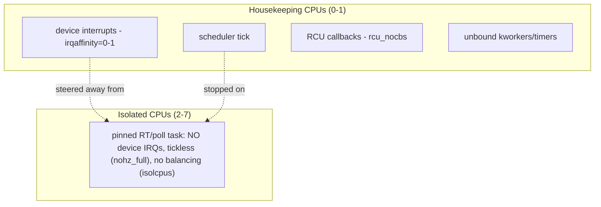

# Q18 — CPU Isolation for Interrupts (isolcpus, nohz_full, housekeeping)

> **Subsystem:** Affinity & Performance · **Files:** `kernel/sched/isolation.c`, `kernel/irq/`, boot params
> **Interviewer is really probing (NVIDIA/Qualcomm RT, Google latency):** Do you understand how to **keep
> interrupts (and other kernel noise) off latency-critical CPUs**, using `isolcpus`/`nohz_full`/
> `irqaffinity`/housekeeping CPUs?

---

## TL;DR Cheat Sheet

- **CPU isolation** dedicates some CPUs to **latency-critical or high-throughput** work and **moves kernel
  "noise" off them** — including **device interrupts**, the **scheduler tick**, RCU callbacks, kworkers, and
  timers — so those CPUs run the target task **uninterrupted**.
- **Key boot parameters:**
  - **`isolcpus=`** — exclude CPUs from the scheduler's load balancing (tasks don't get placed there unless
    pinned). (Largely superseded by **cpuset isolation** / `isolcpus` is legacy-ish but still used.)
  - **`nohz_full=`** — **tickless** on those CPUs: stop the periodic **scheduler tick** when one task runs
    (removes ~1000 Hz timer interrupts) → huge for RT/HPC.
  - **`irqaffinity=`** / **`rcu_nocbs=`** — steer **device IRQs** and **RCU callback** processing onto
    **housekeeping** CPUs, away from isolated ones.
  - **`nohz_full`** implies **housekeeping CPUs** (the non-isolated ones) that absorb timekeeping, unbound
    work, and IRQs.
- **Interrupt isolation specifically:** set **IRQ affinity** (Q15) so **no device interrupts** target isolated
  CPUs (and **disable irqbalance** or mark IRQs `IRQF_NOBALANCING` / use `irqaffinity=`); use **managed
  affinity** carefully (it spreads across *all* CPUs unless constrained).
- **Goal:** an isolated CPU sees **near-zero involuntary interruptions** — no device IRQs, no tick, no IPIs
  it doesn't need — so a pinned RT thread or polling loop (DPDK, trading, RT control) runs deterministically.

---

## The Question

> How do you keep interrupts and kernel noise off latency-critical CPUs? Explain `isolcpus`, `nohz_full`,
> housekeeping CPUs, and IRQ steering for isolation.

What they want: the **"dedicate CPUs, remove kernel noise"** model, the specific **boot params** and their
roles, and — for *this* set — how to **steer interrupts away** from isolated CPUs (affinity + irqbalance +
managed-affinity caveats).

---

## Why CPU isolation exists

Some workloads need a CPU to run **one thing, deterministically, without interruption**:

- **Real-time control loops** (robotics, automotive, industrial) need **bounded, tiny** latency — any
  involuntary interruption (a device IRQ, the scheduler tick, an IPI) is a **latency spike**.
- **High-frequency trading / low-latency networking** runs **busy-poll** loops (DPDK, AF_XDP) that must not be
  preempted or interrupted — a single device interrupt costs microseconds and jitter.
- **HPC** wants every cycle on computation, not on kernel housekeeping ("OS jitter" degrades tightly-coupled
  parallel jobs).

The default kernel **spreads work across all CPUs**: the scheduler load-balances onto any CPU, the **periodic
tick** (~1000 Hz) interrupts every CPU, device **interrupts** (Q15) can target any CPU, RCU callbacks and
kworkers run anywhere. For the workloads above, that **background noise** is the enemy — even if each
interruption is short, the **jitter** and **tail latency** are unacceptable.

**CPU isolation** flips the model for chosen CPUs: **remove the noise**. Stop the tick (`nohz_full`), keep the
scheduler from placing other tasks there (`isolcpus`/cpusets), move RCU callback processing off
(`rcu_nocbs`), and — crucially for this topic — **steer device interrupts away** (IRQ affinity, Q15). The
non-isolated CPUs become **"housekeeping" CPUs** that absorb all that work. The result: an isolated CPU runs
your pinned thread with **near-zero involuntary interruptions**.

The senior framing for the interrupt angle: **interrupts are a major source of OS jitter**, so isolating a CPU
**requires steering all device IRQs onto housekeeping CPUs** (and stopping the tick + per-CPU kernel threads).
Getting this right — and knowing the **managed-affinity** and **irqbalance** caveats — is the practical skill.

---

## When to isolate CPUs

| Workload | Isolation |
|----------|-----------|
| RT control loop (bounded latency) | `nohz_full` + `isolcpus` + IRQs steered off + RT thread pinned |
| DPDK / busy-poll networking | isolated cores, no IRQs, no tick; NIC RX via poll on those cores |
| HPC (low OS jitter) | `nohz_full` + housekeeping CPU for kernel work |
| Latency-sensitive service | partial: steer IRQs off the hot CPUs (Q15) |
| General server | no isolation (let work spread) |

---

## Where in the kernel

```
kernel/sched/isolation.c   <- housekeeping CPU masks (HK_TYPE_*), nohz_full parsing
kernel/time/tick-sched.c   <- nohz_full tickless operation
kernel/irq/manage.c        <- IRQ affinity (Q15); irqaffinity= default mask
kernel/rcu/                <- rcu_nocbs (offload RCU callbacks to housekeeping CPUs)
Boot params: isolcpus=, nohz_full=, rcu_nocbs=, irqaffinity=, kthread_cpus=
cpuset (cgroup v2) cpuset.cpus / isolated partitions  <- modern isolation
```

---

## How CPU isolation works — mechanics

### 1. The boot parameters and their roles

```
isolcpus=2-7         : keep the scheduler from load-balancing onto CPUs 2-7 (only pinned tasks run there)
nohz_full=2-7        : TICKLESS on 2-7 when 1 task runs -> stop the ~1000 Hz scheduler tick interrupt
rcu_nocbs=2-7        : offload RCU callback processing off 2-7 to housekeeping CPUs (no RCU softirq there)
irqaffinity=0-1      : default IRQ affinity = housekeeping CPUs 0-1 -> device IRQs avoid 2-7
                       (CPUs 0-1 become the HOUSEKEEPING CPUs)
```
Together: CPUs **2–7** become **isolated** (run only their pinned work), CPUs **0–1** become **housekeeping**
(absorb timekeeping, unbound kworkers, RCU callbacks, and **device interrupts**). `nohz_full` automatically
reserves at least one housekeeping CPU.

### 2. Removing the tick (`nohz_full`)

The periodic **scheduler tick** (~250–1000 Hz) is a timer **interrupt** on every CPU used for time-slice
accounting, load balancing, etc. On a `nohz_full` CPU, when **exactly one runnable task** is on it, the kernel
**stops the tick** — eliminating ~1000 interrupts/sec of jitter. (It still needs occasional ticks for
accounting, but the steady-state is tickless.) This is one of the **biggest** noise reductions for RT/HPC.

### 3. Steering device interrupts off isolated CPUs (the core of *this* topic)

Even tickless and unbalanced, an isolated CPU will still be hit by **device interrupts** unless you steer them
away (Q15). Methods:
- **`irqaffinity=<housekeeping mask>`** boot param → sets the **default** affinity for IRQs to housekeeping
  CPUs, so newly-allocated IRQs don't target isolated ones.
- **Manual `smp_affinity`** (Q15) → move existing IRQs' affinity onto housekeeping CPUs.
- **Disable irqbalance** (or it may move IRQs back onto isolated CPUs) — on isolated systems irqbalance is
  usually **off**, with manual/`irqaffinity=` steering instead.
- **Managed-affinity caveat (Q15):** MSI-X **managed** affinity (`PCI_IRQ_AFFINITY`) **spreads vectors across
  ALL CPUs** by default — including isolated ones. To respect isolation you must **constrain** the device's
  queues to housekeeping CPUs (driver/`irq_affinity` masks) or the isolated CPU **will** get that NIC's
  interrupts. This is a common gotcha.
- **Per-CPU/unavoidable interrupts:** the local **timer** (if not fully tickless), **IPIs** (Q5, e.g.
  reschedule/TLB), and the **NMI watchdog** can still hit isolated CPUs — minimize via `nohz_full`,
  `rcu_nocbs`, disabling the watchdog on isolated CPUs (`nowatchdog`/`nmi_watchdog=0`), and avoiding
  cross-CPU calls to them.

### 4. Housekeeping CPUs

`kernel/sched/isolation.c` maintains **housekeeping masks** per concern (`HK_TYPE_TIMER`, `HK_TYPE_RCU`,
`HK_TYPE_MISC`, `HK_TYPE_KTHREAD`, etc.). The **non-isolated** CPUs are the housekeeping set that runs:
timekeeping, **unbound kworkers** (Q13), RCU callbacks (`rcu_nocbs`), and (via `irqaffinity=`) **device
interrupts**. Pinning kernel threads (`kthread_cpus=`) and unbound workqueue affinity to housekeeping CPUs
keeps isolated CPUs clean.

### 5. cpuset isolation (modern)

Modern setups use **cgroup v2 cpusets** with **isolated partitions** (`cpuset.cpus.partition = isolated`)
instead of (or with) `isolcpus`, dynamically isolating CPUs at runtime. This integrates isolation with the
container/cgroup model and is more flexible than the static boot param.

### 6. Verifying isolation

After setup, an isolated CPU should show **near-zero** entries in `/proc/interrupts` (Q21) and minimal context
switches. Tools: `cat /proc/interrupts` (per-CPU columns — isolated CPUs near zero), **`cyclictest`** (Q23) to
measure residual latency, ftrace/`hwlatdetect` to catch stray interrupts/SMIs, and `/sys/devices/system/cpu/
isolated`.

---

## Diagrams

### Isolated vs housekeeping



### Sources of noise to remove

```
device IRQs        -> irqaffinity= / smp_affinity to housekeeping (Q15); disable irqbalance; constrain managed (Q4)
scheduler tick     -> nohz_full
RCU callbacks      -> rcu_nocbs
unbound kworkers   -> housekeeping affinity / kthread_cpus
NMI watchdog       -> nowatchdog on isolated CPUs
IPIs (Q5)          -> minimize cross-CPU calls; reschedule/TLB still possible
```

---

## Annotated C / config

```bash
# Boot cmdline: isolate CPUs 2-7, housekeeping 0-1
isolcpus=2-7 nohz_full=2-7 rcu_nocbs=2-7 irqaffinity=0-1 nowatchdog

# Steer existing IRQs off isolated CPUs (Q15):
for irq in /proc/irq/[0-9]*; do echo 3 > $irq/smp_affinity 2>/dev/null; done   # mask = CPUs 0-1
systemctl stop irqbalance ; systemctl disable irqbalance

# Constrain a NIC's managed MSI-X queues to housekeeping CPUs (driver-dependent), else
# managed affinity (Q4/Q15) will place some vectors on isolated CPUs.

# Pin the RT task to an isolated CPU with RT priority:
taskset -c 2 chrt -f 80 ./rt_app

# Verify: isolated CPUs near-zero in /proc/interrupts (Q21); measure with cyclictest (Q23)
cat /proc/interrupts
cyclictest -m -p 80 -a 2 -t 1
```

```c
/* Housekeeping masks (kernel/sched/isolation.c). */
bool housekeeping_cpu(int cpu, enum hk_type type);   /* is `cpu` housekeeping for this concern? */
const struct cpumask *housekeeping_cpumask(enum hk_type type);
/* IRQ default affinity honors HK_TYPE_MANAGED_IRQ / irqaffinity= */
```

> Senior nuance: for the **interrupt** angle, isolation = **steer all device IRQs to housekeeping CPUs** via
> `irqaffinity=`/`smp_affinity` (Q15), **disable irqbalance**, and **watch managed MSI-X affinity** (which
> spreads to *all* CPUs unless constrained, Q4). Combine with **`nohz_full`** (kill the tick),
> **`rcu_nocbs`** (offload RCU), and **`isolcpus`/cpusets** (no balancing). The goal is an isolated CPU with
> **near-zero `/proc/interrupts` activity** so a pinned RT/poll task runs deterministically.

---

## Company Angle

- **NVIDIA/Qualcomm (RT/automotive/embedded — the headline):** isolating cores for **RT control** (Q22/Q23),
  steering IRQs off RT cores, `nohz_full`, threaded NAPI/IRQs (Q14/Q16) pinned to housekeeping, cyclictest
  validation (Q23).
- **Google (low-latency/DPDK):** isolated cores for busy-poll networking (DPDK/AF_XDP), IRQ steering, RPS off
  isolated CPUs, OS-jitter reduction at scale.
- **AMD/Intel (HPC):** OS-jitter elimination for tightly-coupled jobs, `nohz_full`, housekeeping CPUs,
  managed-affinity constraints.
- **All:** the managed-MSI-X-affinity caveat and irqbalance-off are common practical gotchas.

---

## War Story

*"An RT control thread pinned to an **isolated** CPU (`isolcpus`/`nohz_full`) still showed periodic
**latency spikes** in `cyclictest` (Q23). `/proc/interrupts` (Q21) revealed the culprit: a **multi-queue NIC**
using **managed MSI-X affinity** (Q4/Q15) had **spread its vectors across ALL CPUs** — including the isolated
RT core — so that core was getting **device RX interrupts** despite isolation. Managed affinity doesn't know
about isolation by default; it just spreads. Fixes: (1) **constrained the NIC's queues** to the **housekeeping**
CPUs (driver `irq_affinity`/queue-count tuning) so no vector targeted the isolated core; (2) set
**`irqaffinity=`** to the housekeeping mask as the default for other IRQs; (3) confirmed **irqbalance was
disabled** so it couldn't move IRQs back; (4) added **`nohz_full`** + **`rcu_nocbs`** + **`nowatchdog`** to kill
the tick, RCU softirq, and NMI watchdog on the isolated core. After that, `/proc/interrupts` for the isolated
CPU was **near zero** and cyclictest latency dropped to bounded microseconds. The interviewer's follow-up —
*'why did managed affinity defeat your isolation?'* — let me explain managed MSI-X affinity **spreads vectors
across all online CPUs** for scaling (Q15) and is **isolation-unaware** by default, so you must **explicitly
constrain** the device to housekeeping CPUs — steering IRQs off isolated cores is the **essential** interrupt
step of CPU isolation."*

---

## Interviewer Follow-ups

1. **What is CPU isolation?** Dedicating CPUs to latency-critical work and removing kernel noise (device IRQs,
   tick, RCU, kworkers) so those CPUs run their pinned task uninterrupted.

2. **What does `nohz_full` do?** Makes a CPU **tickless** when one task runs — stops the ~1000 Hz scheduler
   tick interrupt, a major jitter source.

3. **What does `isolcpus` do?** Excludes CPUs from scheduler load balancing so only **pinned** tasks run there
   (legacy; cpusets are the modern way).

4. **How do you keep device interrupts off isolated CPUs?** Set IRQ affinity (`irqaffinity=`/`smp_affinity`,
   Q15) to housekeeping CPUs, **disable irqbalance**, and **constrain managed MSI-X affinity** (Q4).

5. **What's the managed-affinity caveat?** Managed MSI-X affinity (`PCI_IRQ_AFFINITY`) spreads vectors across
   **all** CPUs, including isolated ones — you must explicitly constrain the device to housekeeping CPUs.

6. **What are housekeeping CPUs?** The non-isolated CPUs that absorb timekeeping, unbound kworkers, RCU
   callbacks, and device interrupts (HK_TYPE_* masks).

7. **What does `rcu_nocbs` do?** Offloads RCU callback processing off the listed CPUs to housekeeping CPUs (no
   RCU softirq there).

8. **What residual interrupts can still hit an isolated CPU?** IPIs (Q5: reschedule/TLB), occasional accounting
   ticks, the NMI watchdog (disable with `nowatchdog`) — minimize but can't always fully eliminate.

9. **How do you verify isolation?** `/proc/interrupts` (isolated CPUs near zero, Q21), `cyclictest` (Q23),
   `hwlatdetect`/ftrace for stray interrupts.

---

## 30-Minute Talk Track

| Min | Cover |
|-----|-------|
| 0–4 | Why isolate: RT/HPC/DPDK need uninterrupted CPUs; interrupts/tick = OS jitter |
| 4–8 | The boot params: isolcpus, nohz_full, rcu_nocbs, irqaffinity; housekeeping CPUs |
| 8–12 | nohz_full: killing the scheduler tick (biggest noise reduction) |
| 12–18 | Steering device IRQs off isolated CPUs: irqaffinity/smp_affinity (Q15), disable irqbalance |
| 18–22 | Managed MSI-X affinity caveat (spreads to all CPUs, Q4) — must constrain to housekeeping |
| 22–25 | Residual noise: IPIs (Q5), NMI watchdog, accounting ticks; minimizing |
| 25–28 | cpuset isolated partitions (modern); verifying with /proc/interrupts + cyclictest (Q21/Q23) |
| 28–30 | War story (managed affinity defeated isolation) + "steer IRQs off isolated cores" |
