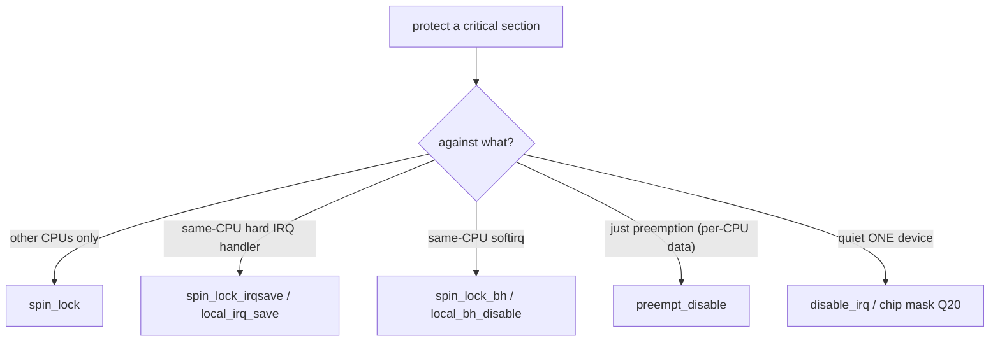

# Q19 — IRQ Context and Masking: local_irq_disable, preempt_count, in_hardirq

> **Subsystem:** Context / Masking · **Files:** `include/linux/irqflags.h`, `include/linux/preempt.h`, `kernel/softirq.c`
> **Interviewer is really probing:** Do you understand the **difference between disabling interrupts on the
> CPU vs masking one IRQ**, the **`preempt_count` context fields** (`in_hardirq`/`in_softirq`), and when each
> is appropriate?

---

## TL;DR Cheat Sheet

- **Disabling interrupts on the local CPU** (`local_irq_disable()`/`local_irq_save(flags)`) blocks **all**
  maskable interrupts on **that CPU** — a blunt, short-duration tool to protect data shared with **interrupt
  handlers** on the same CPU.
  - **`local_irq_disable()`/`local_irq_enable()`** — unconditional off/on.
  - **`local_irq_save(flags)`/`local_irq_restore(flags)`** — **save** prior state, restore it (nestable, safe
    when you don't know if IRQs were already off). **Prefer save/restore.**
- **Masking a single IRQ** (`disable_irq(irq)`, chip mask, Q20) blocks **one** interrupt line at the
  **controller**, leaving others working — different from CPU-wide disable.
- **`preempt_count`** is a per-CPU/per-task counter partitioned into fields tracking **execution context**:
  **HARDIRQ**, **SOFTIRQ**, **NMI**, and **PREEMPT** (preempt-disable nesting). Non-zero ⇒ **atomic context**
  (can't sleep, Q-fundamentals).
  - **`in_hardirq()`** — in a hard IRQ handler. **`in_softirq()`** — in softirq/BH. **`in_interrupt()`** —
    hardirq **or** softirq **or** NMI. **`in_task()`** — process context.
- **`local_bh_disable()`** masks **softirqs** (bottom halves) on the CPU without disabling hard IRQs (Q11).
- **Rule:** use the **narrowest** tool — a **spinlock** for cross-CPU, `spin_lock_irqsave` only if a hard IRQ
  handler also takes the lock, `local_bh_disable` for softirq sharing, single-IRQ mask to quiet one device.

---

## The Question

> Explain the difference between disabling interrupts on the CPU and masking a single IRQ. What is
> `preempt_count` and how do `in_hardirq`/`in_softirq`/`in_interrupt` work?

What they want: the **CPU-wide disable vs per-line mask** distinction, **`save/restore` vs unconditional**,
the **`preempt_count` context model** (and how the kernel knows which context it's in), and **which tool to
use when**.

---

## Why these mechanisms exist

Interrupt handlers run **asynchronously** and **preempt** whatever the CPU was doing. That creates a
**concurrency problem**: if process-context code and an interrupt handler both touch the same data, the
interrupt can fire **in the middle** of the process code's update → corruption. You need ways to **exclude**
interrupts (or specific ones) around critical sections. But "exclude interrupts" has **several granularities**,
and using the wrong one is either **incorrect** or **harmful to latency**:

- **All interrupts, this CPU** (`local_irq_disable`): the bluntest — blocks every maskable interrupt on the
  CPU. Correct for protecting against **any** same-CPU interrupt handler, but it **raises interrupt latency**
  (the CPU can't take *any* interrupt while disabled), so it must be **very short**.
- **One specific IRQ line** (`disable_irq`/chip mask, Q20): quiet **one** device without blinding the CPU to
  everything else — used to stop a particular interrupt while reconfiguring its device.
- **Softirqs/bottom halves** (`local_bh_disable`, Q11): exclude **deferred** work (networking/timers) without
  disabling hard IRQs — for data shared with softirq handlers.
- **Cross-CPU** (a **spinlock**): `local_irq_disable` only affects the **local** CPU; on SMP you also need a
  **lock** to exclude **other CPUs**. The combined `spin_lock_irqsave` handles both — but only when needed.

To make correct choices, the kernel (and you) must know **what context you're in** — hard IRQ? softirq? NMI?
process context? That's what **`preempt_count`** encodes: a single counter with **bit-fields** for each
context, so checks like `in_hardirq()`/`in_interrupt()` are cheap, and the scheduler can enforce **"don't
sleep in atomic context"** (Q-fundamentals). The senior framing: these are a **toolbox of exclusion
primitives at different granularities**, plus a **context-tracking counter** — and expertise is choosing the
**narrowest correct** tool to protect data **without** needlessly hurting interrupt latency.

---

## When to use which

| Sharing with… | Tool |
|---------------|------|
| A **hard IRQ handler** (same data) on this CPU | `local_irq_save/restore`, or `spin_lock_irqsave` if also cross-CPU |
| A **hard IRQ handler** + other CPUs | **`spin_lock_irqsave`** (lock + local IRQs off) |
| A **softirq/tasklet** handler | `local_bh_disable/enable` (or `spin_lock_bh`) |
| Another **CPU** only (not IRQ) | plain **spinlock** (`spin_lock`) |
| Quiet **one device's** interrupt | `disable_irq(irq)` / chip mask (Q20) |
| Check current context | `in_hardirq()`, `in_softirq()`, `in_interrupt()`, `in_task()` |

---

## Where in the kernel

```
include/linux/irqflags.h   <- local_irq_disable/enable/save/restore, raw_local_irq_* ; lockdep irq tracking
include/linux/preempt.h    <- preempt_count layout (HARDIRQ/SOFTIRQ/NMI/PREEMPT fields),
                              in_hardirq/in_softirq/in_interrupt/in_task, preempt_disable/enable
include/linux/bottom_half.h<- local_bh_disable/enable
kernel/softirq.c           <- __local_bh_disable_ip, irq_enter/irq_exit (set HARDIRQ field)
arch/*/include/asm/irqflags.h <- the actual CPU instructions (cli/sti, DAIF on ARM)
```

---

## How it works — mechanics

### 1. Disabling interrupts on the local CPU

```c
unsigned long flags;
local_irq_save(flags);        /* save current IRQ state, then disable (cli / msr DAIFset on ARM) */
/* ... very short critical section vs same-CPU IRQ handler ... */
local_irq_restore(flags);     /* restore prior state (may leave them off if they were off) */
```
- **`local_irq_disable()`** unconditionally disables; **`local_irq_enable()`** unconditionally enables —
  dangerous if IRQs were **already** off (you'd wrongly enable them).
- **`local_irq_save(flags)`/`local_irq_restore(flags)`** save/restore the prior state → **nestable** and safe
  when you don't know the entry state. **Always prefer save/restore** in library/driver code.
- This affects **only the local CPU** — other CPUs can still take interrupts. On SMP, pair with a **spinlock**
  (`spin_lock_irqsave`) to also exclude other CPUs.
- It **raises interrupt latency** (no interrupts taken while disabled), so keep it **minimal**. On ARM it
  manipulates **DAIF**; on x86 it's `cli`/`sti`.

### 2. Masking a single IRQ (vs CPU disable) — preview of Q20

```c
disable_irq(irq);     /* mask THIS one IRQ at the controller (and wait for in-flight handler) */
/* ... reconfigure the device ... */
enable_irq(irq);      /* unmask */
```
This blocks **one** line at the **controller** (`irq_chip->irq_mask`, Q6) — other interrupts keep working, and
the CPU stays responsive. Use it to **quiet a specific device**, not to protect a critical section from
**same-CPU** races (that's `local_irq_*`/spinlocks). Details and `disable_irq` vs `disable_irq_nosync` in Q20.

### 3. `preempt_count` — the context counter

A single per-task/per-CPU **`preempt_count`** is partitioned into bit-fields:

```
preempt_count bits:
   PREEMPT  : preempt_disable() nesting (and spinlocks)
   SOFTIRQ  : in softirq / local_bh_disable nesting
   HARDIRQ  : in a hard IRQ handler (set by irq_enter, cleared by irq_exit)
   NMI      : in an NMI handler
Any non-zero "atomic" field => atomic context => MUST NOT sleep (Q-fundamentals)
```
- **`irq_enter()`** (on IRQ entry) increments the **HARDIRQ** field; **`irq_exit()`** decrements it (and runs
  softirqs if pending, Q11).
- **`local_bh_disable()`** increments the **SOFTIRQ** field; softirq processing sets it too.
- **`preempt_disable()`** / holding a **spinlock** increments the **PREEMPT** field.
The scheduler checks `preempt_count` in `__schedule()` — if non-zero (atomic), trying to sleep is a **bug**
(`scheduling while atomic`). `might_sleep()` warns proactively.

### 4. The context-query macros

```c
in_hardirq()    -> HARDIRQ field set      (in a hard IRQ handler)
in_softirq()    -> SOFTIRQ field set      (in softirq/BH or bh-disabled)
in_nmi()        -> NMI field set
in_interrupt()  -> HARDIRQ | SOFTIRQ | NMI (any interrupt-ish context)
in_task()       -> none of the above      (process/task context -> can sleep)
```
Drivers/kernel code use these to **adapt behavior** (e.g. choose `GFP_ATOMIC` vs `GFP_KERNEL`, or assert a
function isn't called from IRQ context with `WARN_ON(in_interrupt())`). They're **cheap** (read a counter).

### 5. `local_bh_disable` — softirq exclusion (Q11)

```c
local_bh_disable();    /* exclude softirqs/tasklets on this CPU (SOFTIRQ field++), hard IRQs still on */
/* ... critical section vs softirq handler (e.g. networking shared state) ... */
local_bh_enable();     /* runs any pending softirqs */
```
This is the right tool when sharing data with a **softirq** (not a hard IRQ) — cheaper and less latency-harmful
than disabling hard IRQs.

### 6. The decision discipline (the senior point)

```
Need to exclude...        Use...
  other CPUs only         spin_lock (no IRQ disable)
  same-CPU hard IRQ       spin_lock_irqsave (lock + local_irq disable) — only if the lock is taken in IRQ
  same-CPU softirq        spin_lock_bh / local_bh_disable
  nothing but preemption  preempt_disable (e.g. per-CPU data, Q-percpu)
```
**Don't over-disable**: using `local_irq_disable` when a `spin_lock_bh` would do **needlessly raises interrupt
latency**. Use the **narrowest** primitive that's correct. `lockdep` validates IRQ-state consistency (e.g.
catches a lock taken with IRQs on in one place and in IRQ context in another — the IRQ-inversion class).

---

## Diagrams

### Granularity of exclusion



### preempt_count context

```mermaid
flowchart TD
    IRQ["irq_enter() -> HARDIRQ++"] --> HCTX["in_hardirq()==true (atomic, no sleep)"]
    BH["local_bh_disable() -> SOFTIRQ++"] --> SCTX["in_softirq()==true (atomic)"]
    PD["preempt_disable()/spinlock -> PREEMPT++"] --> PCTX[non-preemptible (atomic)]
    SLEEP["try to sleep with preempt_count != 0"] --> BUG[scheduling while atomic BUG]
```

---

## Annotated C

```c
/* Save/restore (preferred) vs unconditional local IRQ disable. */
unsigned long flags;
local_irq_save(flags);     /* disable + remember prior state */
/* ... short critical section vs same-CPU hard IRQ ... */
local_irq_restore(flags);  /* restore (won't wrongly enable if they were off) */

/* The right SMP tool when a hard IRQ handler also takes the lock: */
spin_lock_irqsave(&dev->lock, flags);
/* ... */
spin_unlock_irqrestore(&dev->lock, flags);

/* Softirq exclusion (sharing with a softirq, Q11): */
local_bh_disable(); /* ... */ local_bh_enable();
/* or: spin_lock_bh(&lock); ... spin_unlock_bh(&lock); */

/* Context queries (preempt_count fields). */
if (in_interrupt())  gfp = GFP_ATOMIC; else gfp = GFP_KERNEL;
WARN_ON(in_hardirq());        /* assert not called from a hard IRQ */
might_sleep();                /* warn if in atomic context */
```

> Senior nuance: the distinctions to nail — **`local_irq_disable` blocks ALL interrupts on the LOCAL CPU**
> (blunt, short, latency-costly, local-only) vs **`disable_irq`/chip mask blocks ONE line** (Q20); **always
> prefer `local_irq_save/restore`** over unconditional; **`local_bh_disable`** is for softirqs only;
> **`preempt_count`** fields (`in_hardirq`/`in_softirq`/`in_interrupt`) encode the context and enforce
> no-sleep-in-atomic. Choose the **narrowest** primitive — over-disabling interrupts hurts latency for no
> benefit.

---

## Company Angle

- **Qualcomm/NVIDIA (RT/drivers):** minimizing `local_irq_disable`/`spin_lock_irqsave` sections for latency
  (Q23), `raw_spinlock` vs `spinlock` under PREEMPT_RT (Q22), correct IRQ-safe locking (lockdep IRQ-inversion).
- **AMD/Intel:** IRQ-disable cost on the hot path, `local_bh_disable` for networking shared state, context
  checks for `GFP_ATOMIC`.
- **Google:** lockdep/IRQ-state correctness at scale, latency from over-long IRQ-disabled regions (Q23).
- **All:** the CPU-disable-vs-line-mask distinction and `preempt_count`/`in_interrupt` are fundamentals.

---

## War Story

*"A driver had unpredictable **latency spikes**, and ftrace's **`irqsoff`** tracer (Q23) pinned a long
**interrupts-disabled** region: the driver used **`local_irq_disable()`** around a sizeable critical section
to protect data shared with its IRQ handler — but it (a) disabled **all** interrupts on the CPU for far too
long (blocking the timer, other devices — latency), and (b) used the **unconditional** form, which in one
nested path **wrongly re-enabled** interrupts a caller had disabled. Two fixes: switched to
**`spin_lock_irqsave`/`spin_unlock_irqrestore`** (which **save/restore** prior IRQ state — nestable and
correct — and also provides the **cross-CPU** locking the bare `local_irq_disable` was missing on SMP), and
**shortened** the critical section so the IRQ-disabled window was tiny. Where the shared party was actually a
**softirq**, I used **`spin_lock_bh`** instead (no need to disable hard IRQs at all). Latency stabilized. The
interviewer's follow-up — *'why is `local_irq_save` better than `local_irq_disable`?'* — let me explain
`save/restore` **remembers** whether IRQs were already off and restores that state, so it's **safe to nest**
and won't wrongly enable interrupts; the unconditional pair assumes IRQs were on, which breaks under nesting —
a classic subtle bug."*

---

## Interviewer Follow-ups

1. **`local_irq_disable` vs masking one IRQ?** `local_irq_disable` blocks **all** maskable interrupts on the
   **local CPU** (blunt, short); masking (`disable_irq`/chip) blocks **one line** at the controller (Q20),
   leaving the CPU responsive.

2. **`local_irq_disable` vs `local_irq_save`?** `disable/enable` are unconditional (assume IRQs were on);
   `save/restore` remember and restore prior state — **nestable and safe** → prefer save/restore.

3. **Does `local_irq_disable` work across CPUs?** No — local CPU only; for cross-CPU exclusion you also need a
   **spinlock** (`spin_lock_irqsave` combines both).

4. **What is `preempt_count`?** A per-task/per-CPU counter with bit-fields for **HARDIRQ/SOFTIRQ/NMI/PREEMPT**
   contexts; non-zero atomic fields ⇒ can't sleep.

5. **`in_hardirq` vs `in_softirq` vs `in_interrupt`?** Hard IRQ handler / softirq-BH / **any** of
   hardirq|softirq|nmi, respectively; `in_task()` = process context.

6. **What sets the HARDIRQ field?** `irq_enter()` on IRQ entry (cleared by `irq_exit`), so the kernel knows
   it's in a hard handler.

7. **What's `local_bh_disable` for?** Excluding **softirqs/tasklets** on the CPU (not hard IRQs) — for data
   shared with softirq handlers (Q11); cheaper/less latency-harmful.

8. **Which primitive for sharing with only another CPU?** A plain **spinlock** (no IRQ disable) — disabling
   IRQs would be unnecessary.

9. **How does the kernel catch sleeping in atomic context?** `__schedule()` checks `preempt_count` →
   `scheduling while atomic` BUG; `might_sleep()` warns proactively.

---

## 30-Minute Talk Track

| Min | Cover |
|-----|-------|
| 0–4 | Why exclusion primitives: async interrupts race with process code; granularities |
| 4–9 | local_irq_disable/enable vs save/restore; local-only; latency cost; prefer save/restore |
| 9–12 | CPU-wide disable vs single-IRQ mask (disable_irq/chip, Q20) — different jobs |
| 12–17 | preempt_count fields (HARDIRQ/SOFTIRQ/NMI/PREEMPT); irq_enter/exit; atomic = no sleep |
| 17–21 | Context macros: in_hardirq/in_softirq/in_interrupt/in_task; uses (GFP, WARN) |
| 21–25 | local_bh_disable for softirq sharing (Q11); spin_lock_bh |
| 25–28 | Decision discipline: narrowest tool; spin_lock vs irqsave vs bh; lockdep IRQ-inversion |
| 28–30 | War story (long local_irq_disable → spin_lock_irqsave + shorten) + save-vs-disable |
