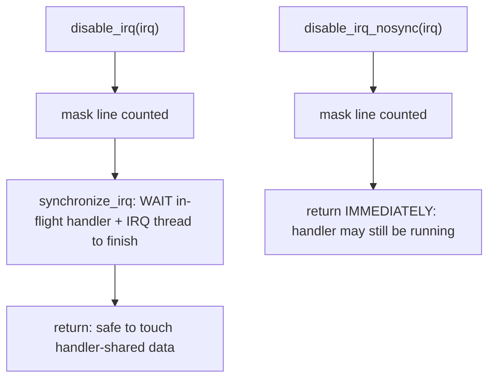
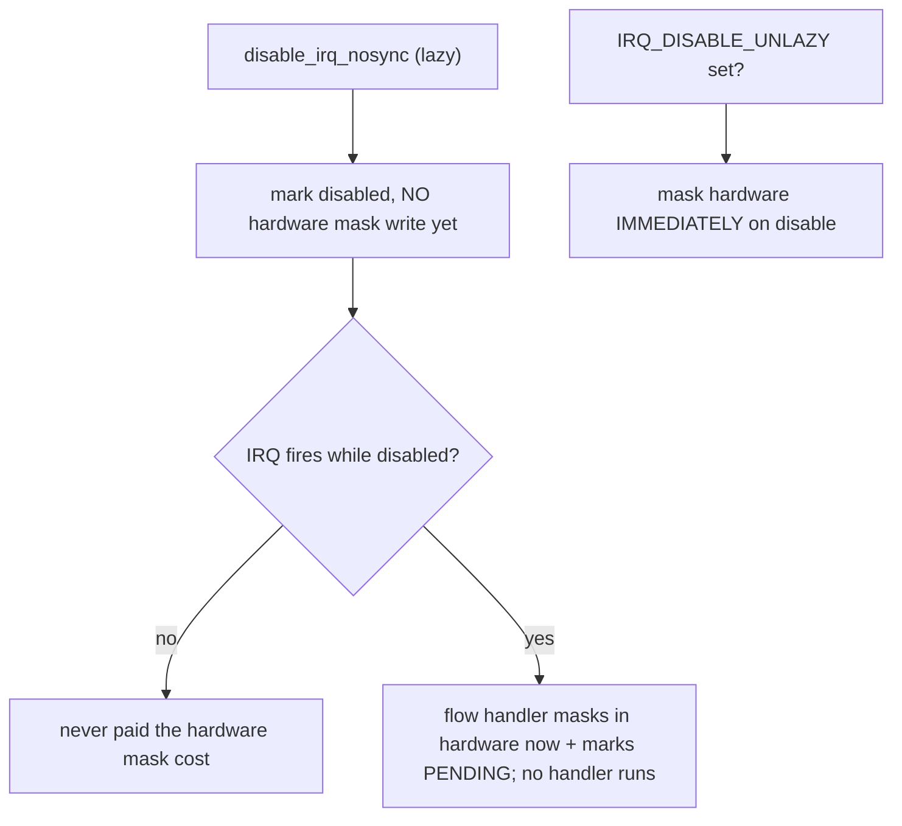

# Q20 — disable_irq vs disable_irq_nosync, Masking, Lazy Disable, synchronize_irq

> **Subsystem:** Context / Masking · **Files:** `kernel/irq/manage.c`, `kernel/irq/chip.c`, `include/linux/interrupt.h`
> **Interviewer is really probing:** Do you understand the **per-IRQ disable/mask** APIs, the crucial
> **`disable_irq` (waits) vs `disable_irq_nosync` (doesn't)** distinction, **lazy disable**, and what
> **`synchronize_irq`** guarantees?

---

## TL;DR Cheat Sheet

- **`disable_irq(irq)`** masks **one** IRQ line at the controller **and waits** (`synchronize_irq`) for any
  **in-flight handler** (on any CPU, including the IRQ thread, Q14) to **finish** before returning. Safe to
  then touch data the handler uses.
- **`disable_irq_nosync(irq)`** masks the line but **does NOT wait** for an in-flight handler — returns
  immediately. Faster, but the handler **may still be running**. Use when you can't block (e.g. inside the
  handler's own context) or don't need the sync.
- **`enable_irq(irq)`** unmasks; disable/enable are **nested/counted** (`irq_desc->depth`) — N disables need N
  enables.
- **`synchronize_irq(irq)`** **waits** until any executing handler/IRQ-thread for that IRQ has completed
  (without changing the mask) — the synchronization primitive `disable_irq` and `free_irq` (Q9) use.
- **Lazy disable:** when you `disable_irq`, the kernel may **not immediately** program the hardware mask;
  instead it marks the IRQ disabled and **masks it only if/when it next fires** (`IRQ_DISABLE_UNLAZY` controls
  this). Saves a (sometimes slow) hardware register write when the IRQ doesn't fire while disabled.
- **Masking** (`irq_chip->irq_mask`, Q6) is the **hardware** operation; **disable** is the **logical**
  (counted) operation that may use lazy masking. Don't confuse per-IRQ disable with **CPU-wide**
  `local_irq_disable` (Q19).

---

## The Question

> What's the difference between `disable_irq` and `disable_irq_nosync`? What does `synchronize_irq` guarantee,
> and what is lazy disable?

What they want: the **wait-vs-no-wait** semantics (and why it matters for safe data access / deadlock
avoidance), the **counted enable/disable**, **`synchronize_irq`'s** guarantee, and the **lazy-disable**
optimization — the per-line masking layer (vs CPU-wide disable, Q19).

---

## Why these APIs exist

Sometimes a driver needs to **stop a specific device's interrupt** temporarily — to **reconfigure** the device,
during **suspend** (Q24), while **tearing down** (Q9), or to **serialize** with the handler. Disabling **all**
interrupts on the CPU (`local_irq_disable`, Q19) is wrong here: it's too blunt (blocks unrelated devices/the
timer → latency) and doesn't even stop the IRQ on **other** CPUs. What you want is to **mask one line** at the
**controller** (`irq_chip`, Q6). That's `disable_irq`.

But masking alone isn't enough for **safe data access**. The interrupt might be **executing its handler right
now** on **another CPU** (or in its **IRQ thread**, Q14). If you mask the line and immediately **free or modify
the data the handler touches**, you race with the still-running handler → **use-after-free / corruption**. So
you need a way to **wait until the handler has actually finished**. That's the difference between the two APIs:

- **`disable_irq`** = mask **and wait** for in-flight completion (`synchronize_irq`) → safe to touch shared
  data afterward.
- **`disable_irq_nosync`** = mask **without** waiting → fast, but the handler may still be running (use when
  waiting would **deadlock** — e.g. calling it **from within** the handler — or when you don't need the sync).

The **lazy-disable** optimization exists because programming a controller mask register can be **expensive**
(especially on slow buses / nested controllers), and often an IRQ is disabled but **never fires** while
disabled — so why pay for the hardware write? Lazy disable **defers** the actual hardware masking until the
IRQ next fires (if ever), saving the cost in the common case. The senior framing: this is the **per-line
masking toolbox** with a critical **synchronization** distinction (`disable_irq` waits, `_nosync` doesn't) and
a **performance optimization** (lazy disable) — and getting the wait-vs-no-wait choice wrong causes either
**races** (used `_nosync` then freed data) or **deadlocks** (used `disable_irq` from the handler).

---

## When to use which

| Situation | API |
|-----------|-----|
| Reconfigure device, then safely touch handler-shared data | **`disable_irq`** (masks + waits) |
| From **within** the handler / can't block | **`disable_irq_nosync`** (no wait) |
| Just need to wait for handler completion (don't change mask) | **`synchronize_irq`** |
| Re-enable | **`enable_irq`** (counted) |
| Teardown | **`free_irq`** (does the sync internally, Q9) |
| Suspend/resume of an IRQ | disable/enable around it (or PM flags, Q24) |
| Protect a critical section vs same-CPU IRQ | **NOT these** — use `local_irq_save`/spinlock (Q19) |

---

## Where in the kernel

```
kernel/irq/manage.c   <- disable_irq, disable_irq_nosync, enable_irq (counted depth),
                         synchronize_irq, synchronize_hardirq, __disable_irq/__enable_irq
kernel/irq/chip.c     <- irq_mask/irq_unmask, lazy disable (mask_irq / IRQ_DISABLE_UNLAZY)
include/linux/interrupt.h <- the API declarations
kernel/irq/internals.h <- irq_settings_disable_unlazy, IRQS_* state
```

---

## How it works — mechanics

### 1. `disable_irq` — mask and wait

```c
void disable_irq(unsigned int irq) {
    disable_irq_nosync(irq);     /* 1. mask the line (counted) */
    synchronize_irq(irq);        /* 2. WAIT for any in-flight handler/IRQ-thread to finish */
}
```
After `disable_irq` returns, the IRQ is masked **and** no handler for it is executing — so you can safely
**reconfigure** or **free** data the handler uses. It **must be called from a context that can sleep/block**
(it waits), and **never from the handler itself** (it would wait for itself → **deadlock**).

### 2. `disable_irq_nosync` — mask without waiting

```c
void disable_irq_nosync(unsigned int irq) {
    /* increment desc->depth; if first disable, mask the line (lazily, see below) */
}
```
Masks the line and returns **immediately** — the handler **may still be running** on another CPU. Use it:
- **inside the handler** (you can't `synchronize_irq` from the handler — self-wait deadlock),
- when you only need to **stop future** deliveries and will synchronize separately (or don't need to),
- in **atomic context** where blocking is illegal.

### 3. Counted enable/disable (`depth`)

```
disable_irq(irq); disable_irq(irq);   // depth = 2, line masked
enable_irq(irq);                       // depth = 1, STILL masked
enable_irq(irq);                       // depth = 0, line UNMASKED
```
`irq_desc->depth` (Q6) counts nested disables; the line is unmasked only when `depth` returns to 0. **Balance
them** — an extra `enable_irq` (underflow) or missing one (stuck disabled) is a classic bug.

### 4. `synchronize_irq` — the wait guarantee

```c
void synchronize_irq(unsigned int irq) {
    /* spin/wait while the IRQ's handler is IN-FLIGHT (INPROGRESS) on any CPU,
       AND wait for the threaded handler (threads_active) to drain (Q14) */
}
```
Guarantee: **when it returns, no hard handler and no IRQ thread for this IRQ is executing** (and won't start,
if the line is masked). This is the primitive that makes `disable_irq` and **`free_irq`** (Q9) safe — the
"handler can't be running when I free its data" guarantee. `synchronize_hardirq` waits only for the **hard**
handler (not the thread). It must be called from **sleepable** context.

### 5. Lazy disable (the optimization)

Programming a controller's **mask register** can be slow (MMIO, slow bus, nested/`irq_bus_lock` controllers
like I2C-connected GPIO expanders). Often an IRQ is **disabled but never fires** while disabled, making the
hardware mask write **wasted**. **Lazy disable**:
```
disable_irq_nosync():  mark the IRQ disabled (logical), but DON'T write the hardware mask yet.
   if the IRQ then FIRES while disabled: the flow handler (Q7) sees it's disabled,
        masks it in hardware NOW (mask_irq), and marks it pending (IRQS_PENDING) — no handler runs.
   on enable_irq(): unmask; if it was pending, re-trigger.
```
So the hardware is masked **only if needed**. **`IRQ_DISABLE_UNLAZY`** (set via `irq_set_status_flags(irq,
IRQ_DISABLE_UNLAZY)`) **opts out** of laziness — forcing an **immediate** hardware mask on `disable_irq`. You
need unlazy when the device **must** be physically masked right away (e.g. a level line that would storm, or
hardware that requires the mask before reconfiguration). Knowing when laziness is wrong is a senior detail.

### 6. Relationship to `local_irq_disable` (Q19) and `free_irq` (Q9)

- **`disable_irq` ≠ `local_irq_disable`:** the former masks **one line** (others keep working, CPU
  responsive); the latter blocks **all** interrupts on the **local CPU** (Q19). Different tools.
- **`free_irq`** (Q9) internally does the equivalent of `synchronize_irq` (drains in-flight handler + stops the
  IRQ thread) before returning — the same guarantee, applied at teardown.

---

## Diagrams

### disable_irq vs disable_irq_nosync



### Lazy disable



---

## Annotated C

```c
/* Mask + wait: safe to reconfigure/free afterward. (sleepable context, NOT from handler) */
disable_irq(irq);
reconfigure_device(dev);     /* handler guaranteed not running now */
enable_irq(irq);             /* counted: balances the disable */

/* Mask without waiting: from the handler, or atomic context. */
static irqreturn_t isr(int irq, void *dev) {
    disable_irq_nosync(irq);  /* can't synchronize_irq from our own handler -> nosync */
    schedule_work(&dev->work);
    return IRQ_HANDLED;
}

/* Just wait for the handler to finish (e.g. before reading state it updates). */
synchronize_irq(irq);

/* Force immediate hardware masking (opt out of lazy disable). */
irq_set_status_flags(irq, IRQ_DISABLE_UNLAZY);
```

> Senior nuance: **`disable_irq` waits (`synchronize_irq`) so you can safely touch the handler's data;
> `disable_irq_nosync` doesn't** (use it from the handler or atomic context to avoid self-deadlock). Disables
> are **counted** (balance with `enable_irq`). **Lazy disable** skips the (slow) hardware mask write until the
> IRQ actually fires — opt out with `IRQ_DISABLE_UNLAZY` when the device must be masked immediately. And this
> is **per-line** masking — distinct from CPU-wide `local_irq_disable` (Q19).

---

## Company Angle

- **Qualcomm/NVIDIA (drivers/PM):** `disable_irq`/`enable_irq` around device reconfiguration and **suspend/
  resume** (Q24); `disable_irq_nosync` from handlers; lazy disable on **slow-bus** (I2C/SPI) GPIO/PMIC
  controllers (`irq_bus_lock`), `IRQ_DISABLE_UNLAZY` where needed.
- **AMD/Intel:** masking MSI-X vectors per-queue, synchronize before reprogramming, teardown sync (Q9).
- **Google:** correct counted disable/enable balance, `synchronize_irq` for race-free state reads at scale.
- **All:** the `disable_irq` vs `_nosync` (wait vs no-wait) distinction is a classic correctness/deadlock
  question.

---

## War Story

*"A driver intermittently **deadlocked** during an error path. From **inside its IRQ handler**, on detecting a
fault, it called **`disable_irq(irq)`** to stop the line — but `disable_irq` calls **`synchronize_irq`**, which
**waits for the in-flight handler to finish**… and the in-flight handler **was the very handler calling it** →
it waited for **itself** forever. The fix was to use **`disable_irq_nosync(irq)`** in the handler (mask without
waiting — you can't synchronize against your own execution), and do any needed synchronization **later** from
process context. Separately, on a GPIO-expander-over-I2C controller, `disable_irq` was **slow** because each
mask was an **I2C transaction**; since those IRQs rarely fired while disabled, **lazy disable** (the default)
avoided most of the writes — but one path required the line **physically masked immediately** before
reconfiguring the expander, so we set **`IRQ_DISABLE_UNLAZY`** for that IRQ to force the hardware mask. The
interviewer's follow-up — *'when must you use `disable_irq_nosync`?'* — let me explain: **from the handler's
own context** (or any atomic context), because `disable_irq`'s `synchronize_irq` would block/self-deadlock;
`_nosync` masks and returns immediately, and you synchronize elsewhere if needed."*

---

## Interviewer Follow-ups

1. **`disable_irq` vs `disable_irq_nosync`?** `disable_irq` masks **and waits** (`synchronize_irq`) for the
   in-flight handler to finish (safe to touch its data); `_nosync` masks and returns immediately (handler may
   still run).

2. **When must you use `_nosync`?** From **within the handler** or atomic context — `disable_irq` would
   self-wait/deadlock or block illegally.

3. **What does `synchronize_irq` guarantee?** When it returns, no hard handler **or** IRQ thread (Q14) for that
   IRQ is executing — the basis for safe data access (and `free_irq`, Q9).

4. **Are disable/enable counted?** Yes — `irq_desc->depth`; N disables need N enables; the line unmasks at
   depth 0. Imbalance is a bug.

5. **What is lazy disable?** Deferring the hardware mask write until the IRQ next fires (if ever) — saves a
   slow register write in the common case; `IRQ_DISABLE_UNLAZY` opts out.

6. **When do you need `IRQ_DISABLE_UNLAZY`?** When the device **must** be physically masked immediately (e.g.
   a level line that would storm, or hardware requiring the mask before reconfiguration).

7. **`disable_irq` vs `local_irq_disable`?** `disable_irq` masks **one line** at the controller (CPU stays
   responsive); `local_irq_disable` blocks **all** interrupts on the local CPU (Q19).

8. **Why does `disable_irq` need sleepable context?** It calls `synchronize_irq`, which **waits** — illegal in
   atomic context.

9. **How does `free_irq` relate?** It performs the same in-flight synchronization (drain handler + stop IRQ
   thread) before returning so the driver can free data (Q9).

---

## 30-Minute Talk Track

| Min | Cover |
|-----|-------|
| 0–4 | Why per-line disable: quiet one device (reconfigure/suspend/teardown) without blinding the CPU (vs Q19) |
| 4–9 | disable_irq = mask + synchronize_irq (wait in-flight); safe to touch data after |
| 9–13 | disable_irq_nosync = mask, no wait; use from handler/atomic; deadlock avoidance |
| 13–16 | Counted enable/disable (depth); balance; underflow/stuck bugs |
| 16–20 | synchronize_irq guarantee (hard handler + IRQ thread drained, Q14); sleepable context |
| 20–25 | Lazy disable: defer hardware mask until fire; slow-bus controllers; IRQ_DISABLE_UNLAZY opt-out |
| 25–28 | disable_irq vs local_irq_disable (Q19); free_irq sync (Q9); suspend/resume (Q24) |
| 28–30 | War story (disable_irq self-deadlock in handler; unlazy for I2C expander) + when to use _nosync |
