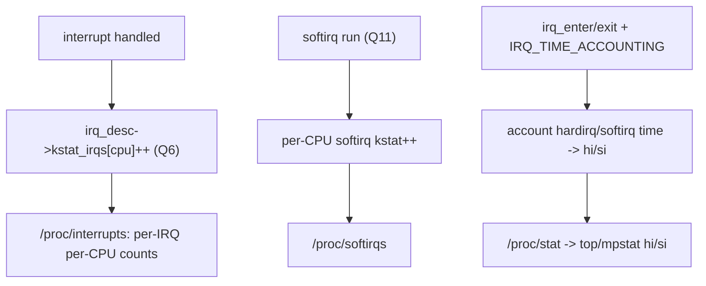
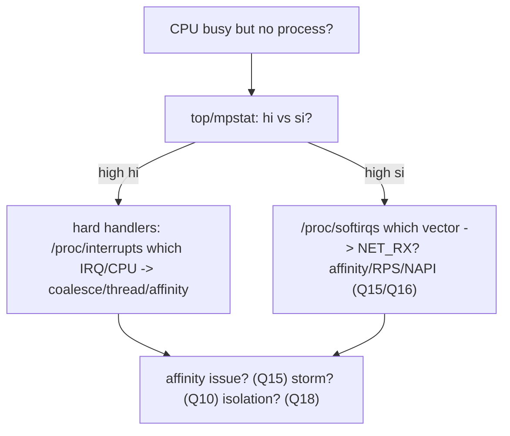

# Q21 — IRQ Time Accounting and Statistics (/proc/interrupts, /proc/softirqs)

> **Subsystem:** Context / State · **Files:** `kernel/irq/proc.c`, `fs/proc/stat.c`, `kernel/sched/cputime.c`, `include/linux/kernel_stat.h`
> **Interviewer is really probing:** Do you know how to **observe interrupt activity** (`/proc/interrupts`,
> `/proc/softirqs`), how **hardirq/softirq time** is accounted in CPU stats, and how to use this to **diagnose**
> interrupt problems?

---

## TL;DR Cheat Sheet

- **`/proc/interrupts`** — per-IRQ, **per-CPU** counts of how many times each interrupt fired, plus the
  controller (`irq_chip`/domain), trigger type, and device name(s). The **first place** to look for
  affinity/distribution problems (one CPU hot, others idle) and storms (Q10).
- **`/proc/softirqs`** — per-CPU counts of each **softirq** vector (`NET_RX`, `TIMER`, `RCU`, `TASKLET`…,
  Q11) — shows which softirqs dominate and on which CPUs (e.g. `NET_RX` lopsided = bad RX affinity, Q15/Q16).
- **CPU time accounting:** time spent in interrupt handling is reported separately in `/proc/stat` and tools:
  **`hi`** (hardirq time) and **`si`** (softirq time) columns (in `top`/`mpstat`). Requires
  **`CONFIG_IRQ_TIME_ACCOUNTING`** for precise per-IRQ-context time (else it's approximated by tick sampling).
- **Counts come from** `irq_desc->kstat_irqs` (per-CPU, Q6), incremented by the generic IRQ layer; softirq
  counts from per-CPU `kstat`. `/proc/stat` aggregates `irq`/`softirq` totals.
- **Diagnosing:** high `si` + lopsided `/proc/softirqs` `NET_RX` = networking softirq overload (Q11/Q16);
  one IRQ pegged on one CPU in `/proc/interrupts` = affinity issue (Q15); huge unclaimed counts = storm/spurious
  (Q10); high `hi` = too many/too-long hard handlers.

---

## The Question

> How do you observe and account for interrupt activity? Explain `/proc/interrupts`, `/proc/softirqs`,
> hardirq/softirq CPU time, and how you'd use them to diagnose an interrupt problem.

What they want: the **observability surfaces** (`/proc/interrupts`, `/proc/softirqs`, `hi`/`si` in CPU stats),
**where the numbers come from** (`kstat_irqs`, IRQ_TIME_ACCOUNTING), and a **diagnostic workflow** tying back
to affinity (Q15), softirqs (Q11/Q16), and storms (Q10).

---

## Why interrupt accounting exists

Interrupts are **invisible** to normal process accounting — they "steal" CPU time from whatever was running,
asynchronously. Without dedicated accounting you couldn't answer basic operational questions:

- **"Why is this CPU busy but no process shows high CPU?"** — it might be spending time in **interrupt
  handlers** (hardirq) or **softirqs** (networking/timers), which isn't attributed to any process.
- **"Is my IRQ affinity working?"** (Q15) — you need **per-CPU per-IRQ counts** to see whether interrupts are
  **spread** or **piled on one CPU**.
- **"Is something storming?"** (Q10) — a runaway interrupt rate or huge **unclaimed** counts signal a bug.
- **"What's eating the CPU — hard IRQs or softirqs?"** — the **`hi`/`si`** split tells you whether the cost is
  in **top halves** (hard handlers) or **bottom halves** (softirq/NAPI, Q11/Q16), which point at different
  fixes.

So the kernel **counts every interrupt per CPU** (`/proc/interrupts`), **counts every softirq per CPU**
(`/proc/softirqs`), and **accounts the CPU time** spent in hardirq/softirq context separately (`hi`/`si`).
This observability is essential for **performance tuning** (affinity, coalescing, NAPI) and **debugging**
(storms, starvation, latency). The senior framing: interrupt accounting is your **primary diagnostic surface**
for the entire interrupt subsystem — almost every interrupt problem in this set (affinity Q15, softirq
overload Q11/Q16, storms Q10, isolation Q18) is **first observed** in `/proc/interrupts`, `/proc/softirqs`, or
the `hi`/`si` CPU stats.

---

## When you use these

| Question | Surface |
|----------|---------|
| Is an IRQ piling on one CPU? (affinity, Q15) | `/proc/interrupts` per-CPU columns |
| Which softirq dominates / on which CPU? | `/proc/softirqs` (Q11/Q16) |
| Is CPU time in hard IRQs vs softirqs? | `top`/`mpstat` `hi`/`si`, `/proc/stat` |
| Is there a storm / spurious? (Q10) | `/proc/interrupts` rate + "nobody cared" in dmesg |
| Is an isolated CPU clean? (Q18) | `/proc/interrupts` (isolated CPU near zero) |
| Per-IRQ-context precise time | `CONFIG_IRQ_TIME_ACCOUNTING` + tracing |

---

## Where in the kernel

```
kernel/irq/proc.c        <- /proc/interrupts (show_interrupts), /proc/irq/N/* (affinity, Q15)
fs/proc/stat.c           <- /proc/stat: irq/softirq totals, per-CPU lines
kernel/irq/irqdesc.c     <- irq_desc->kstat_irqs (per-CPU counts, Q6), kstat_irqs_cpu
kernel/sched/cputime.c   <- account_hardirq_time/account_softirq_time (hi/si), IRQ_TIME_ACCOUNTING
kernel/softirq.c         <- /proc/softirqs counts (per-CPU per-vector)
include/linux/kernel_stat.h <- kstat, kstat_softirqs_cpu
```

---

## How accounting works — mechanics

### 1. `/proc/interrupts` — per-IRQ per-CPU counts

```
           CPU0       CPU1       CPU2       CPU3
  16:    1000123    0          0          0          IR-IO-APIC   16-fasteoi   eth0
  24:    50         60012      50         48         IR-PCI-MSI   ... eth1-rx-0
  25:    40         42         70033      45         IR-PCI-MSI   ... eth1-rx-1
 LOC:    9000123    9000050    9000044    9000012    Local timer interrupts
 RES:    12000      11050      ...                   Rescheduling interrupts (IPIs, Q5)
 CAL:    ...                                          Function call interrupts (Q5)
 TLB:    ...                                          TLB shootdowns (Q5)
```
- **Rows:** each hardware IRQ (by Linux IRQ number / `virq`) plus special rows for per-CPU/architectural
  interrupts (`LOC` timer, `RES`/`CAL`/`TLB` IPIs, Q5; `NMI`, etc.).
- **Columns:** **per-CPU** counts — instantly reveal **distribution**: `eth1-rx-0` heavy on CPU1, `rx-1` on
  CPU2 (good spread, Q15); or everything on CPU0 (bad affinity / single queue).
- **Right side:** the controller (`IR-PCI-MSI`, `IO-APIC`, `GICv3`, Q1/Q2), flow/trigger (`fasteoi`,
  `edge`/`level`, Q7), and the **device/handler name** (from `request_irq`'s name, Q9; multiple names = shared,
  Q10).
- Counts come from **`irq_desc->kstat_irqs`** (per-CPU, Q6), bumped by the generic IRQ layer on each handled
  interrupt.

### 2. `/proc/softirqs` — per-CPU softirq counts

```
                CPU0       CPU1       CPU2
      HI:       0          0          0
   TIMER:    500123     499050     ...
  NET_TX:     1000        ...
  NET_RX:   8000123        50        40        <- NET_RX lopsided on CPU0 = bad RX affinity (Q15/Q16)
   BLOCK:    20000        ...
 TASKLET:    ...
   SCHED:    ...
     RCU:    300000       ...
```
Shows which **softirq vectors** (Q11) are busy and **where**. A lopsided **`NET_RX`** points at **RX
interrupt/softirq concentration** (fix: MSI-X affinity Q15, RPS/RFS Q16). High **`TASKLET`** = heavy tasklet
use (consider migrating, Q12). High **`RCU`** = lots of RCU callbacks.

### 3. CPU time: `hi` (hardirq) and `si` (softirq)

`top`/`mpstat` show CPU time split, including:
- **`hi`** — time in **hard IRQ** handlers (top halves),
- **`si`** — time in **softirq** processing (bottom halves: NAPI, timers, RCU, Q11),
plus `us`/`sy`/`id`/`wa`/`st`. These come from `/proc/stat`'s `irq`/`softirq` fields.

```
%Cpu(s): 10.0 us, 5.0 sy, 0.0 ni, 70.0 id, 0.0 wa, 2.0 hi, 13.0 si, 0.0 st
                                                              ^^^^^^^^^^^ hard/soft IRQ time
```
**High `si`** = softirq-bound (usually **networking** — Q11/Q16); **high `hi`** = too many or too-long **hard
handlers** (consider threading Q14, coalescing Q17, or reducing interrupt rate). A CPU pegged in **`ksoftirqd`**
(a process, shows as `sy`/the thread) is the offload signal (Q11).

### 4. `CONFIG_IRQ_TIME_ACCOUNTING` — precise vs sampled

By default, CPU time is sampled at the **tick** — so interrupt time is **approximated** (whatever was running
at the tick gets charged). **`CONFIG_IRQ_TIME_ACCOUNTING`** uses **fine-grained timestamps** at IRQ
enter/exit (`account_hardirq_time`/`account_softirq_time`) to **precisely** account hardirq/softirq time,
**subtracting** it from process time. Important on **`nohz_full`** (Q18) CPUs (no regular tick to sample) and
for accurate `hi`/`si`. Trade-off: a small per-IRQ timestamp overhead.

### 5. The diagnostic workflow (the senior payoff)

```
1. top/mpstat: is the CPU in hi (hard) or si (soft)?  -> which half is the cost
2. /proc/interrupts: which IRQ, which CPU?  -> affinity/distribution (Q15), storm rate (Q10), isolation (Q18)
3. /proc/softirqs: which softirq vector, which CPU?  -> NET_RX overload (Q16), tasklet/RCU
4. dmesg: "nobody cared" / rcu stalls -> storms/spurious (Q10)
5. ftrace (irq events) / perf: deeper - which handler, how long (Q23)
```
Most interrupt issues are **localized in step 2–3**: e.g. `eth0` interrupts all on CPU0 + lopsided `NET_RX` +
high `si` on CPU0 = **single-queue/bad-affinity RX overload** → enable MSI-X multi-queue + managed affinity
(Q4/Q15) + RPS (Q16).

---

## Diagrams

### Where the numbers come from



### Diagnostic flow



---

## Annotated C

```c
/* Per-IRQ per-CPU counts (Q6). */
struct irq_desc { struct kstat_irqs __percpu *kstat_irqs; /* ... */ };
unsigned int kstat_irqs_cpu(unsigned int irq, int cpu);   /* count for one IRQ on one CPU */

/* /proc/interrupts is produced by show_interrupts() iterating descs (kernel/irq/proc.c). */

/* Precise IRQ time accounting (kernel/sched/cputime.c, CONFIG_IRQ_TIME_ACCOUNTING). */
void account_hardirq_time(struct task_struct *p, u64 cputime); /* -> CPUTIME_IRQ (hi) */
void account_softirq_time(struct task_struct *p, u64 cputime); /* -> CPUTIME_SOFTIRQ (si) */
/* called around irq_enter/irq_exit with fine-grained timestamps */
```

```bash
cat /proc/interrupts            # per-IRQ per-CPU counts + controller + device (Q15/Q10/Q18)
watch -n1 'cat /proc/interrupts'# watch rates (storm detection)
cat /proc/softirqs              # per-CPU softirq vector counts (Q11/Q16)
mpstat -P ALL 1                 # per-CPU %hi (hardirq) and %si (softirq)
cat /proc/stat | grep -E '^cpu' # raw irq/softirq totals
```

> Senior nuance: **`/proc/interrupts` (per-CPU per-IRQ) + `/proc/softirqs` (per-CPU per-vector) + `hi`/`si`
> CPU time** are the **diagnostic trinity** for interrupts. They directly expose **affinity** (Q15) problems
> (one CPU hot), **softirq overload** (Q11/Q16) (`NET_RX` lopsided + high `si`), **storms** (Q10) (runaway
> rates), and **isolation** (Q18) leaks (interrupts on isolated CPUs). Use **`CONFIG_IRQ_TIME_ACCOUNTING`**
> for precise `hi`/`si`, especially on `nohz_full`. Always start a tuning/debug session here.

---

## Company Angle

- **Google (the headline):** fleet-scale interrupt observability — `/proc/interrupts`/`/proc/softirqs`
  scraping, `si`/`hi` monitoring, detecting RX softirq imbalance and storms, validating affinity/RPS (Q15/Q16);
  IRQ_TIME_ACCOUNTING for accurate accounting.
- **AMD/Intel:** per-CPU interrupt distribution for multi-queue NVMe/NIC (Q4/Q15), `hi`/`si` on many-core.
- **Qualcomm (mobile/power):** interrupt counts as a **wakeup/power** signal (Q24), IRQ_TIME_ACCOUNTING on
  `nohz_full`/idle, identifying chatty interrupts draining battery.
- **NVIDIA (latency):** `hi` time from hard handlers, deciding to thread (Q14), per-vector GPU interrupt
  distribution.

---

## War Story

*"A service node showed **70% CPU 'used' but no process** explained it — classic 'invisible' CPU. `mpstat -P
ALL 1` revealed the answer: **CPU3 was ~60% `si`** (softirq time), the rest idle. `/proc/softirqs` showed
**`NET_RX`** counts overwhelmingly on **CPU3**, and `/proc/interrupts` showed the NIC's **single RX queue**
interrupt **all on CPU3** — so one CPU was drowning in `NET_RX` softirqs/NAPI (Q11/Q16) while 31 cores idled.
The accounting surfaces pinpointed it in three commands: `mpstat` (it's softirq, not a process), `/proc/
softirqs` (it's `NET_RX`), `/proc/interrupts` (it's the NIC, all on CPU3 = affinity/single-queue). Fix:
enabled **MSI-X multi-queue + managed affinity** (Q4/Q15) to spread RX interrupts across CPUs and **RPS/RFS**
(Q16) to distribute stack processing; afterward `/proc/interrupts` showed the queues **spread** and `si`
**balanced** across cores. The interviewer's follow-up — *'how would you have known it was softirq vs hard
IRQ?'* — let me explain the **`hi` vs `si`** split: high **`si`** meant the cost was in **bottom-half**
softirq/NAPI processing (point at affinity/RPS/NAPI), whereas high **`hi`** would have meant **hard handler**
cost (point at coalescing/threading/interrupt-rate) — the split **directs the fix**."*

---

## Interviewer Follow-ups

1. **What does `/proc/interrupts` show?** Per-IRQ, **per-CPU** counts + controller + trigger + device name —
   the primary view of interrupt **distribution** and **rate**.

2. **What does `/proc/softirqs` show?** Per-CPU counts of each **softirq vector** (NET_RX, TIMER, RCU, …, Q11)
   — which bottom-half work dominates and where.

3. **What are `hi` and `si`?** CPU time in **hard IRQ** handlers (`hi`) vs **softirq** processing (`si`), shown
   by `top`/`mpstat` from `/proc/stat`.

4. **Where do the counts come from?** `irq_desc->kstat_irqs` (per-CPU, Q6) for hard IRQs; per-CPU kstat for
   softirqs; `/proc/stat` aggregates.

5. **What does `CONFIG_IRQ_TIME_ACCOUNTING` do?** Precisely accounts hardirq/softirq time via fine-grained
   timestamps (vs tick sampling) — important on `nohz_full` (Q18) and for accurate `hi`/`si`.

6. **How do you spot an affinity problem?** `/proc/interrupts` shows an IRQ piling on **one CPU** while others
   are idle (Q15).

7. **How do you spot softirq overload?** High **`si`** + lopsided **`NET_RX`** in `/proc/softirqs` → RX
   concentration (Q11/Q16).

8. **How do you spot a storm?** Runaway interrupt **rate** in `/proc/interrupts` (watch it) + "nobody cared" in
   dmesg (Q10).

9. **hi vs si — why does the split matter?** High `hi` → fix hard handlers (coalesce/thread/rate); high `si` →
   fix softirq distribution (affinity/RPS/NAPI). The split **directs the fix**.

---

## 30-Minute Talk Track

| Min | Cover |
|-----|-------|
| 0–4 | Why interrupt accounting: interrupts are "invisible" CPU; need per-CPU counts + time split |
| 4–9 | /proc/interrupts: rows (IRQs + LOC/RES/CAL/TLB), per-CPU columns, controller/trigger/device |
| 9–13 | /proc/softirqs: per-CPU per-vector; spotting NET_RX/TASKLET/RCU dominance |
| 13–17 | hi vs si CPU time (top/mpstat, /proc/stat); what each implies for fixes |
| 17–20 | Where numbers come from: kstat_irqs (Q6), softirq kstat, /proc/stat |
| 20–23 | CONFIG_IRQ_TIME_ACCOUNTING: precise vs sampled; nohz_full importance |
| 23–27 | Diagnostic workflow: mpstat → /proc/interrupts → /proc/softirqs → dmesg → ftrace/perf |
| 27–30 | War story (invisible CPU = NET_RX softirq on one CPU) + hi-vs-si directs the fix |
