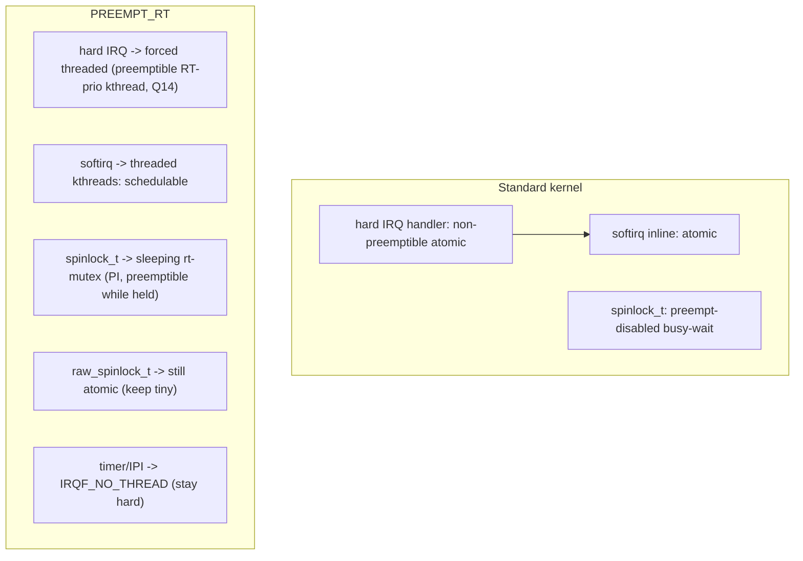

# Q22 — PREEMPT_RT and Interrupts

> **Subsystem:** Real-Time · **Files:** `kernel/irq/manage.c` (forced threading), `kernel/locking/`, `kernel/softirq.c`, `Kconfig.preempt`
> **Interviewer is really probing (NVIDIA/Qualcomm RT favorite):** Do you understand how **PREEMPT_RT
> transforms interrupt handling** — forced IRQ threading, sleeping spinlocks, threaded softirqs — to achieve
> bounded latency?

---

## TL;DR Cheat Sheet

- **PREEMPT_RT** makes Linux **real-time** by shrinking the **non-preemptible** regions to near zero, so a
  high-priority task can preempt **almost anything** — including interrupt handling. Most of RT is now
  **mainline** (selectable via `CONFIG_PREEMPT_RT`).
- **Interrupt-related transformations:**
  - **Forced IRQ threading:** **all** device hard-IRQ handlers run in **kthreads** (Q14) by default
    (`irq_forced_thread_fn`), so handling is **preemptible** and **prioritizable**. Only a tiny primary stays
    in hard-IRQ context. (`IRQF_NO_THREAD` opts out timer/IPI/critical IRQs.)
  - **Sleeping spinlocks:** most `spinlock_t` become **PI-aware rt-mutexes** (they can **sleep/preempt** while
    held); truly-atomic code uses **`raw_spinlock_t`** (stays non-preemptible, must be tiny).
  - **Threaded softirqs:** softirq processing (Q11) runs in **per-CPU kthreads** (`ksoftirqd`-like), so it's
    schedulable/preemptible rather than running inline in atomic context.
  - **Priority inheritance (PI):** rt-mutexes implement PI so a high-priority task blocked on a lock held by a
    low-priority one **boosts** the holder — preventing **unbounded priority inversion**.
- **Result:** **bounded, small** worst-case interrupt/scheduling latency (microseconds) — at the cost of more
  context switches and some throughput.
- **You still must keep `raw_spinlock`/IRQ-off/hard-primary sections tiny** — RT *exposes* them, it doesn't
  remove them.

---

## The Question

> How does PREEMPT_RT change interrupt handling? Explain forced IRQ threading, sleeping spinlocks, threaded
> softirqs, and why these enable bounded latency.

What they want: the **"make interrupt handling preemptible"** thesis, the **forced-threading + sleeping-locks +
threaded-softirqs** transformations, **priority inheritance**, and the **`raw_spinlock`/`IRQF_NO_THREAD`**
escape hatches — the RT interrupt model (tightly linked to Q14).

---

## Why PREEMPT_RT transforms interrupts

Real-time systems need a **bounded, small worst-case latency**: when a high-priority event occurs (a control
deadline, an audio buffer, a safety signal), the responsible task must run **within a guaranteed time**, every
time. The enemy of this is **non-preemptible kernel execution** — stretches where the scheduler **can't**
switch to the high-priority task:

- **Hard IRQ handlers** run in **non-preemptible** context with the line masked. A long or chained hard
  handler **delays** the RT task by its entire duration — **unbounded** if a driver's handler is slow.
- **Spinlock-held / IRQ-disabled regions** are non-preemptible; a long one (Q19) blocks the RT task.
- **Softirq processing** (Q11) runs in atomic context inline after interrupts — a softirq flood (networking)
  can **monopolize** the CPU, starving the RT task.
- **Priority inversion**: an RT task blocked on a lock held by a low-priority task that's been **preempted**
  can wait **indefinitely** (the Mars Pathfinder bug).

A standard kernel accepts these for **throughput**; an RT kernel **cannot**. **PREEMPT_RT's strategy is to
make nearly everything preemptible**, and the **interrupt subsystem** is a primary target because interrupts
are inherently asynchronous and were historically the **least** preemptible:

1. **Move hard-IRQ work into threads** (forced threading, Q14) → handling becomes a **schedulable, RT-priority,
   preemptible** task that the RT task can **preempt** or **outrank**.
2. **Make spinlocks sleepable** (rt-mutexes) → holding a "spinlock" no longer blocks preemption, so the RT
   task can run even when another task holds a lock; **PI** bounds how long it waits.
3. **Thread softirqs** → softirq/NAPI processing becomes schedulable, so it can't monopolize the CPU against
   the RT task.

The senior framing: **PREEMPT_RT converts interrupt handling from non-preemptible atomic work into
preemptible, prioritizable threads**, shrinking the non-preemptible windows to tiny `raw_spinlock`/IRQ-off/
hard-primary regions — which is what makes **bounded microsecond latency** achievable on Linux. Threaded IRQs
(Q14) are the building block; this question is the **system-level** picture.

---

## When PREEMPT_RT applies / what changes

| Standard kernel | PREEMPT_RT |
|-----------------|------------|
| hard IRQ handler runs in atomic context | **forced threaded** (kthread, preemptible, Q14) |
| `spinlock_t` = busy-wait, non-preemptible | **sleeping rt-mutex** (PI-aware, preemptible while held) |
| `raw_spinlock_t` = busy-wait | **unchanged** (truly atomic — keep tiny) |
| softirqs run inline (atomic) | **threaded** (per-CPU kthreads, schedulable) |
| local_irq_disable region non-preemptible | minimized; still non-preemptible (keep short) |
| timer/IPI handlers | stay hard (`IRQF_NO_THREAD`) for correctness |

---

## Where in the kernel

```
kernel/irq/manage.c     <- forced threading (force_irqthreads, irq_forced_thread_fn), IRQF_NO_THREAD
kernel/locking/rtmutex.c, spinlock_rt.* <- sleeping spinlocks (rt-mutex) + priority inheritance
kernel/softirq.c        <- threaded softirq handling under RT (ksoftirqd-style)
include/linux/spinlock.h <- spinlock_t vs raw_spinlock_t (RT divergence)
kernel/Kconfig.preempt   <- CONFIG_PREEMPT_RT
Documentation/, the (formerly out-of-tree) RT patchset, now mostly mainline
```

---

## How PREEMPT_RT changes interrupts — mechanics

### 1. Forced IRQ threading

On RT, the IRQ setup path (`__setup_irq`, Q9) **forces** threading for device IRQs: even an IRQ registered
with plain `request_irq` gets an **IRQ thread** running **`irq_forced_thread_fn`**, which wraps the driver's
handler so it runs in **process context** (Q14). The hard-IRQ portion becomes a tiny stub that **wakes** the
thread. Consequences:
- the actual handler is **preemptible** (an RT task can preempt it),
- it has a **schedulable priority** (RT-priority IRQ threads), so critical interrupts can be ranked above
  less-critical ones and above non-RT work,
- **`IRQF_NO_THREAD`** opts specific IRQs out — the **timer** and **IPIs** (Q5) and a few others must stay in
  hard context for correctness/latency (you can't thread the thing that drives scheduling).

This is the single biggest change: **hard-IRQ execution time stops being an unbounded latency source** because
it's now a preemptible thread.

### 2. Sleeping spinlocks (rt-mutexes)

On a standard kernel, `spin_lock()` **disables preemption** and busy-waits — a non-preemptible region. On RT,
most **`spinlock_t`** are converted to **sleeping, PI-aware rt-mutexes**:
- holding one is **preemptible** — the scheduler can switch away from a task "holding a spinlock,"
- a contending task **sleeps** (and boosts the holder via PI) instead of busy-waiting,
- so spinlock-protected critical sections **no longer block preemption** of the RT task.

The catch: some code is **genuinely atomic** (the scheduler core, the lock implementations themselves, IRQ
entry, per-CPU low-level state) and **must not sleep**. That code uses **`raw_spinlock_t`**, which on RT stays
a **true spinning, non-preemptible** lock. **Mixing them up is an RT-specific bug**: using a sleeping
`spinlock_t` in genuinely-atomic context (e.g. inside a `raw_spinlock` region or hard IRQ) is illegal. So RT
forces a careful **`spinlock_t` vs `raw_spinlock_t`** discipline across the kernel.

### 3. Threaded softirqs

Standard softirqs (Q11) run **inline** in atomic context at IRQ-exit and can **monopolize** the CPU under load
(e.g. `NET_RX` flood). On RT, softirq processing is **threaded** — run in **schedulable per-CPU kthreads** so
it's **preemptible** and **prioritizable** (an RT task outranks softirq processing). This prevents networking/
timer softirqs from creating unbounded latency for RT tasks, at some throughput cost. (Threaded NAPI, Q16, is
a related upstream feature.)

### 4. Priority inheritance (PI)

rt-mutexes implement **priority inheritance**: if a **high-priority** task blocks on a lock held by a
**low-priority** task, the holder is **temporarily boosted** to the high priority so it can finish and
**release** the lock quickly — bounding the inversion. Without PI, a medium-priority task could preempt the
low-priority holder indefinitely while the high-priority task waits (**unbounded priority inversion** — the
classic Mars Pathfinder failure). PI is essential to RT's **bounded** latency guarantee and is built into the
sleeping-lock infrastructure.

### 5. What stays non-preemptible (the residual)

RT shrinks but **doesn't eliminate** non-preemptible regions:
- **`raw_spinlock`** sections and explicit **IRQ-off** regions (Q19),
- the tiny **hard-IRQ primary** stubs and `IRQF_NO_THREAD` handlers (timer/IPI),
- NMI handlers.
These set the **worst-case latency floor**, so RT correctness still requires drivers/kernel code to keep these
regions **tiny**. A long `raw_spinlock`/IRQ-off section in a driver will **still** cause an RT latency spike
(Q23) — RT *exposes* it; you must fix it. This is the key senior caveat.

---

## Diagrams

### Standard vs RT interrupt handling



### Why it bounds latency

```
RT task becomes runnable -> can PREEMPT: threaded IRQ handlers, softirq threads, sleeping-lock holders
   -> non-preemptible floor = tiny raw_spinlock / IRQ-off / hard-primary regions only
   -> worst-case latency = that floor (microseconds), bounded
```

---

## Annotated C

```c
/* RT forces device IRQ handlers into threads (kernel/irq/manage.c). */
extern bool force_irqthreads;   /* true on PREEMPT_RT */
/* __setup_irq: if (force_irqthreads && !(flags & IRQF_NO_THREAD)) -> create IRQ thread (Q14) */
static irqreturn_t irq_forced_thread_fn(int irq, void *dev) {
    /* runs the driver's handler in the IRQ thread, with local_bh_disable around it */
    return action->handler(irq, dev);
}

/* spinlock_t vs raw_spinlock_t (include/linux/spinlock.h). */
spinlock_t      lock;       /* RT: sleeping PI rt-mutex (preemptible while held) */
raw_spinlock_t  raw;        /* RT: true spinning, non-preemptible (genuinely atomic, keep tiny) */

/* Opt an IRQ out of forced threading (timer/IPI/critical). */
request_irq(irq, handler, IRQF_NO_THREAD, "timer", dev);

/* Give an IRQ thread RT priority for bounded latency (Q14/Q23). */
/* sched_setscheduler(action->thread, SCHED_FIFO, &param); */
```

> Senior nuance: PREEMPT_RT's interrupt story = **forced IRQ threading (preemptible handlers)** + **sleeping
> PI spinlocks (preemptible critical sections)** + **threaded softirqs (schedulable bottom halves)**, leaving
> only **tiny `raw_spinlock`/IRQ-off/hard-primary** non-preemptible floors. **PI** prevents unbounded
> inversion. But RT **doesn't remove** non-preemptible regions — it **exposes** them, so you still must keep
> `raw_spinlock`/IRQ-off sections short (Q19/Q23). `spinlock_t` vs `raw_spinlock_t` discipline is the
> RT-specific bug class.

---

## Company Angle

- **NVIDIA/Qualcomm (RT/automotive/robotics — the headline):** PREEMPT_RT for bounded latency, forced IRQ
  threading + RT-priority IRQ threads (Q14), `raw_spinlock` discipline, threaded softirqs/NAPI, `IRQF_NO_THREAD`
  for timer/IPI, cyclictest validation (Q23). Core RT-product knowledge.
- **Google (latency):** RT/low-latency tuning, threaded NAPI (Q16), preemption models, isolating IRQs (Q18) +
  RT.
- **AMD/Intel:** RT on x86 (APIC, Q2), forced threading, PI; latency vs throughput trade-off.
- **All:** "what does PREEMPT_RT change about interrupts" and "spinlock_t vs raw_spinlock_t" are signature RT
  questions.

---

## War Story

*"A robotics control loop needed **sub-millisecond** worst-case wakeup latency, but on a stock kernel
`cyclictest` (Q23) showed **multi-millisecond** spikes. ftrace's **`irqsoff`/`preemptirqsoff`** tracers (Q23)
showed two culprits: (1) a **driver's hard-IRQ handler** ran long (it did real work in hard context — a
non-preemptible stretch), and (2) a **long IRQ-disabled / spinlock region** in another driver. Moving to a
**PREEMPT_RT** kernel addressed the first structurally: **forced IRQ threading** (Q14) turned that hard handler
into a **preemptible RT-priority thread**, so the control loop could **preempt** it — the hard-context time
collapsed to a tiny stub. The second culprit was a **genuine `raw_spinlock`/IRQ-off** section that RT
**couldn't** make preemptible (it was truly atomic), so RT **exposed** it and we had to **shorten** it by
breaking the work into chunks. We also set the relevant **IRQ thread to `SCHED_FIFO`** above the control loop's
non-critical work and **isolated** the RT core (Q18). `cyclictest` worst-case dropped from milliseconds to
tens of microseconds. The interviewer's follow-up — *'why didn't RT fix the second spike automatically?'* —
let me explain RT makes `spinlock_t` **sleepable** but leaves **`raw_spinlock_t`/IRQ-off** regions truly
atomic and **non-preemptible** — those are the **latency floor**, so RT *reveals* them but you must still keep
them **tiny**; RT shrinks non-preemptible windows, it doesn't magically remove genuinely-atomic ones."*

---

## Interviewer Follow-ups

1. **What does PREEMPT_RT fundamentally do?** Makes the kernel preemptible almost everywhere (shrinks
   non-preemptible regions) so high-priority tasks have **bounded, small** latency.

2. **What is forced IRQ threading?** On RT, **all** device hard-IRQ handlers run in **kthreads** (preemptible,
   RT-prioritizable, Q14); only a tiny primary stays in hard context. `IRQF_NO_THREAD` opts out timer/IPI.

3. **What happens to spinlocks on RT?** Most `spinlock_t` become **sleeping PI rt-mutexes** (preemptible while
   held); `raw_spinlock_t` stays a true spinning, non-preemptible lock for genuinely-atomic code.

4. **What are threaded softirqs?** Softirq processing runs in **schedulable per-CPU kthreads** so it's
   preemptible/prioritizable — can't monopolize the CPU against RT tasks (Q11).

5. **What is priority inheritance and why needed?** rt-mutexes boost a low-priority lock holder to the waiter's
   priority — prevents **unbounded priority inversion**; essential to bounded latency.

6. **What stays non-preemptible on RT?** `raw_spinlock`/IRQ-off regions, hard-IRQ primaries, `IRQF_NO_THREAD`
   handlers (timer/IPI), NMI — the latency **floor**.

7. **`spinlock_t` vs `raw_spinlock_t` — the RT bug?** Using a sleeping `spinlock_t` in genuinely-atomic context
   (raw-lock/hard-IRQ) is illegal on RT; you must pick the right type.

8. **Does RT remove non-preemptible regions?** No — it **shrinks/exposes** them; you still must keep
   `raw_spinlock`/IRQ-off sections tiny (Q19/Q23).

9. **Why thread IRQs for RT specifically?** A preemptible RT-priority thread can be outranked/preempted by the
   RT task, so hard-handler duration stops being an unbounded latency source.

---

## 30-Minute Talk Track

| Min | Cover |
|-----|-------|
| 0–4 | RT goal: bounded small latency; non-preemptible kernel execution is the enemy; interrupts a key source |
| 4–9 | Forced IRQ threading: all hard handlers → preemptible RT-prio kthreads (Q14); IRQF_NO_THREAD exceptions |
| 9–14 | Sleeping spinlocks: spinlock_t → PI rt-mutex (preemptible while held); raw_spinlock_t stays atomic |
| 14–18 | Threaded softirqs: schedulable bottom halves; can't monopolize CPU vs RT task (Q11) |
| 18–22 | Priority inheritance: bounding priority inversion (Mars Pathfinder) |
| 22–25 | The residual floor: raw_spinlock/IRQ-off/hard-primary/NMI — keep tiny (Q19/Q23) |
| 25–28 | spinlock_t vs raw_spinlock_t discipline (RT bug class); RT-priority IRQ threads |
| 28–30 | War story (RT forced threading + shorten raw_spinlock) + "RT exposes, doesn't remove" |
