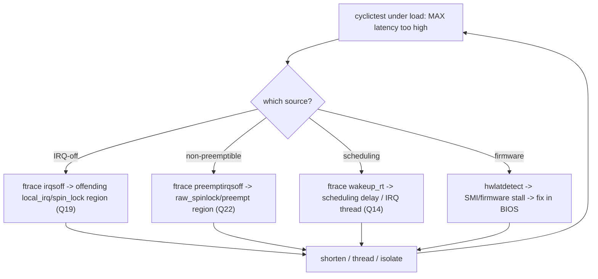

# Q23 — Interrupt Latency: Measuring and Reducing It

> **Subsystem:** Real-Time / Latency · **Files:** `kernel/trace/` (irqsoff/preemptirqsoff/wakeup), tools: `cyclictest`, `ftrace`, `perf`
> **Interviewer is really probing (NVIDIA/Qualcomm RT):** Do you know the **sources of interrupt latency**, how
> to **measure** it (cyclictest, ftrace latency tracers), and the **techniques to reduce** it?

---

## TL;DR Cheat Sheet

- **Interrupt latency** = time from the **hardware event** (interrupt asserted) to the **handler running** (and
  often to the **responsible task running** = end-to-end response latency). For RT, the **worst case** matters,
  not the average.
- **Sources of latency:**
  - **IRQs disabled** (`local_irq_disable`/`spin_lock_irqsave` regions, Q19) — the CPU can't take the interrupt.
  - **Higher-priority/in-progress handling** — another hard IRQ, a long handler, EOI ordering.
  - **Non-preemptible regions** — long `raw_spinlock`/preempt-disabled code (Q22).
  - **Softirq/bottom-half** processing delaying the wakeup (Q11).
  - **Scheduling delay** — getting the woken task onto the CPU (wakeup latency).
  - **SMIs / firmware** (System Management Interrupts) — invisible, unpreemptible firmware stalls (x86).
- **Measuring:** **`cyclictest`** (the RT yardstick — measures wakeup latency vs a timer), **ftrace latency
  tracers** (`irqsoff` = longest IRQ-off region, `preemptirqsoff`, `wakeup`/`wakeup_rt` = scheduler wakeup
  latency), **`perf`**, **`hwlatdetect`** (catches SMI/hardware stalls), `/proc/interrupts` (Q21).
- **Reducing:** **PREEMPT_RT** (forced threading, sleeping locks, Q22), **shorten IRQ-off/`raw_spinlock`
  regions** (Q19), **CPU isolation** (`nohz_full`/IRQ steering, Q18), **RT-priority IRQ threads** (Q14),
  **threaded NAPI** (Q16), affinity (Q15), disable SMIs/throttle firmware where possible.

---

## The Question

> What contributes to interrupt latency, how do you measure it, and how do you reduce it?

What they want: the **latency-source taxonomy** (IRQ-off, non-preemptible, softirq, scheduling, SMI), the
**measurement tools** (cyclictest + ftrace latency tracers), and the **reduction techniques** (RT, shorten
atomic regions, isolation, threading) — the practical RT-latency engineering loop.

---

## Why interrupt latency matters (and is hard)

For real-time and low-latency systems (robotics, automotive, audio, industrial control, HFT), the value isn't
**average** responsiveness — it's the **guaranteed worst case**. A control loop that usually responds in 5 µs
but **occasionally** in 5 ms will **miss deadlines** and fail. So the engineering target is the **maximum**
interrupt/wakeup latency, which is set by the **longest non-preemptible / interrupts-disabled** stretch
anywhere in the kernel and drivers — a single bad code path determines the worst case.

This is hard because latency is **death by a thousand cuts** from **many sources**:
- a driver disabling interrupts (Q19) a bit too long,
- a long `raw_spinlock`/preempt-disabled region (Q22),
- a slow or chained hard-IRQ handler (Q14),
- softirq/NAPI processing delaying a wakeup (Q11/Q16),
- the scheduler taking time to place the woken task,
- and **invisible** firmware **SMIs** (x86) that stall the CPU outside the kernel's control.

You can't fix what you can't **measure**, and the worst case only appears **rarely** — so you need tools that
capture the **maximum** (cyclictest's worst-case, ftrace's `tracing_max_latency`), not just averages. Then you
**attack the largest source** and re-measure. The senior framing: interrupt latency is a **measure-the-worst-
case, find-the-longest-non-preemptible-region, shorten-or-thread-it, repeat** loop — and PREEMPT_RT (Q22) is
the structural lever that converts most non-preemptible interrupt work into preemptible threads. This is the
practical culmination of Q14/Q18/Q19/Q22.

---

## When you measure/reduce latency

| Goal | Action |
|------|--------|
| Establish worst-case wakeup latency | **`cyclictest`** (long run, loaded system) |
| Find longest IRQ-off region | ftrace **`irqsoff`** tracer |
| Find longest preempt+IRQ-off region | ftrace **`preemptirqsoff`** |
| Find scheduler wakeup latency | ftrace **`wakeup`/`wakeup_rt`** |
| Catch firmware/SMI stalls | **`hwlatdetect`** |
| Reduce structurally | **PREEMPT_RT** (Q22) + isolation (Q18) |
| Reduce a specific spike | shorten the offending atomic region (Q19) |

---

## Where in the kernel / tools

```
kernel/trace/trace_irqsoff.c   <- irqsoff / preemptoff / preemptirqsoff latency tracers
kernel/trace/trace_sched_wakeup.c <- wakeup / wakeup_rt latency tracers
kernel/trace/                  <- tracing_max_latency, function_graph (Q-debugging)
drivers/misc/hwlatdetect / kernel  <- hardware latency detector (SMI/stalls)
tools: rt-tests (cyclictest), trace-cmd, perf, ftrace (/sys/kernel/tracing)
/proc/interrupts, /proc/softirqs (Q21)
```

---

## How to measure and reduce — mechanics

### 1. The latency breakdown (end-to-end)

```
hardware event (IRQ asserted)
   |--- (a) IRQs disabled?  wait until local_irq_enable (Q19)   <- IRQ-off latency
   |--- (b) controller priority / in-flight handler / EOI       <- delivery + handling
   v
handler runs (hard primary)
   |--- (c) if threaded (Q14): wake IRQ thread -> SCHEDULING delay until thread runs
   |--- (d) softirq/NAPI may run first (Q11/Q16)                <- bottom-half delay
   v
responsible task runs   <- end-to-end response latency
   |--- (e) non-preemptible regions delayed getting here (Q22)
```
The **worst case** is dominated by the **longest** of: (a) IRQ-disabled stretch, (e) non-preemptible region,
and (c) scheduling/wakeup delay. Each is a separate thing to measure and attack.

### 2. cyclictest — the RT yardstick

**`cyclictest`** (from `rt-tests`) runs a high-priority thread that sleeps on a timer for a fixed interval and
measures the **difference** between when it **should** wake and when it **actually** wakes — i.e. **wakeup
latency** end-to-end. Run it **under load** (a stress workload) for a **long time** to provoke the worst case:
```bash
cyclictest -m -p 99 -i 200 -h 100 -a 2 -t 1   # RT prio 99, 200us interval, histogram, CPU2
# Report: Min / Avg / MAX latency (us). MAX is what matters for RT.
```
A good RT system shows a **bounded, small MAX** (tens of µs) even under heavy load; a large MAX means there's a
long non-preemptible region to find. cyclictest tells you **how bad**, ftrace tells you **where**.

### 3. ftrace latency tracers — find the source

ftrace's **latency tracers** record the **maximum** observed latency and the **stack/trace** that caused it
(`tracing_max_latency` + the trace):
```bash
cd /sys/kernel/tracing
echo irqsoff > current_tracer          # longest interrupts-disabled region (Q19)
# ... run workload ...
cat tracing_max_latency ; cat trace     # the max + the code path that disabled IRQs that long

echo preemptirqsoff > current_tracer    # longest preempt-AND-irq-off region (Q22)
echo wakeup_rt      > current_tracer    # worst RT-task wakeup latency (scheduling delay)
```
- **`irqsoff`** pinpoints the function that left **interrupts disabled** too long (a driver's `local_irq_save`/
  `spin_lock_irqsave`, Q19).
- **`preemptirqsoff`** catches **non-preemptible** stretches (raw_spinlock/preempt-disable, Q22).
- **`wakeup`/`wakeup_rt`** measures the **scheduler** delay from wakeup to running — exposes scheduling-path
  latency (and whether a threaded IRQ's thread (Q14) is being scheduled promptly).
This is the **debugging workhorse**: cyclictest flags a spike, you switch on the matching tracer, reproduce,
and read off the offending stack.

### 4. hwlatdetect — firmware/SMI stalls

On x86, **SMIs (System Management Interrupts)** are firmware traps that **stall the CPU** in
firmware/BIOS — **invisible** to the OS and **unpreemptible**. They cause latency spikes the kernel tracers
can't see (the kernel isn't running). **`hwlatdetect`** runs a tight loop with interrupts disabled and measures
**gaps** in the timestamp counter — a gap means **something** (SMI/firmware) stole the CPU. If you see SMI
latency, you mitigate in **firmware/BIOS** (disable SMI sources, USB legacy emulation, etc.) — a real RT
bring-up issue.

### 5. Reduction techniques (the toolbox)

```
STRUCTURAL:
  PREEMPT_RT (Q22): forced IRQ threading + sleeping locks + threaded softirqs -> most work preemptible
  CPU isolation (Q18): nohz_full + steer IRQs off RT cores + isolcpus -> no device IRQs/tick on RT CPU
  threaded NAPI (Q16): networking softirq -> schedulable, can't monopolize the RT CPU
TARGETED:
  shorten IRQ-off / raw_spinlock / preempt-disabled regions (Q19/Q22) -- the #1 fix for a found spike
  RT-priority IRQ threads (Q14) for the critical interrupt; outrank non-critical work
  IRQ affinity (Q15): route the critical IRQ to the RT CPU (or off it, depending on design)
  interrupt coalescing OFF / low (Q17) for low latency (vs throughput)
FIRMWARE:
  disable SMI sources / tune BIOS (hwlatdetect-found stalls)
```
The discipline: **measure (cyclictest) → locate (ftrace) → fix the biggest source → re-measure**. Most found
spikes are a **too-long IRQ-off or non-preemptible region** (Q19/Q22) — shorten it or make it preemptible.

---

## Diagrams

### Measure → locate → fix loop



### Latency sources stacked

```
worst-case latency = MAX over: [ IRQ-off region | non-preemptible region | in-flight handler | softirq delay | scheduling | SMI ]
   -> one bad path sets the worst case; find and shorten/thread the longest
```

---

## Annotated commands / C

```bash
# 1. Measure worst-case wakeup latency under load (RT yardstick):
cyclictest -m -S -p 99 -i 200 -h 200   # all CPUs, RT prio, histogram; watch MAX

# 2. Locate the longest IRQ-off region:
cd /sys/kernel/tracing
echo irqsoff > current_tracer ; echo 0 > tracing_max_latency
# ... reproduce ...
cat tracing_max_latency ; cat trace      # max us + the stack that disabled IRQs

# 3. Non-preemptible + scheduling:
echo preemptirqsoff > current_tracer
echo wakeup_rt > current_tracer ; cat tracing_max_latency

# 4. Firmware/SMI stalls (x86):
hwlatdetect --duration=60                # reports max hardware latency (SMI)

# 5. Verify isolation/affinity (Q18/Q21):
cat /proc/interrupts                     # RT CPU near zero
```

```c
/* Latency tracers hook irq/preempt on/off (kernel/trace/trace_irqsoff.c). */
void trace_hardirqs_on(void);  void trace_hardirqs_off(void);   /* irqsoff */
void trace_preempt_on(unsigned long a0, unsigned long a1);      /* preemptoff */
/* tracing_max_latency records the worst observed window + its stack. */
```

> Senior nuance: the loop is **cyclictest (how bad, worst-case) → ftrace latency tracers (where:
> `irqsoff`/`preemptirqsoff`/`wakeup_rt`) → fix the biggest source → re-measure**. The fix is usually
> **shorten an IRQ-off/`raw_spinlock` region** (Q19/Q22) or make it **preemptible** (PREEMPT_RT forced
> threading, Q22) plus **isolate the RT CPU** (Q18) and **thread/prioritize** the critical IRQ (Q14). Don't
> forget **SMIs** (`hwlatdetect`) — firmware stalls the kernel can't see.

---

## Company Angle

- **NVIDIA/Qualcomm (RT — the headline):** cyclictest validation, ftrace `irqsoff`/`preemptirqsoff`/`wakeup_rt`,
  PREEMPT_RT (Q22), RT-priority IRQ threads (Q14), CPU isolation (Q18), SMI/firmware tuning; bounded latency for
  automotive/robotics/audio.
- **Google (low latency):** wakeup latency, threaded NAPI (Q16), isolation/DPDK (Q18), tail-latency tracing at
  scale.
- **AMD/Intel:** SMI latency (`hwlatdetect`) on x86, APIC delivery latency (Q2), IPI cost (Q5), many-core
  scheduling delay.
- **All:** the measure→locate→fix loop and "worst case, not average" mindset are universal RT skills.

---

## War Story

*"An audio/robotics product needed **<1 ms** worst-case response, but **`cyclictest -p 99`** under load showed
**MAX ~4 ms** spikes (average was fine — the worst case was the problem). I turned on ftrace's **`irqsoff`**
tracer and reproduced: `tracing_max_latency` pointed at a **driver holding `spin_lock_irqsave`** (interrupts
disabled, Q19) while doing a **bulk register copy** — a multi-millisecond **IRQ-off** region that blocked the
RT wakeup. First fix: **break that section into chunks** so IRQs were disabled only briefly. cyclictest MAX
dropped, but a smaller spike remained; **`preemptirqsoff`** found a long **`raw_spinlock`/preempt-disabled**
stretch in another driver, which we also shortened. Then I moved to **PREEMPT_RT** (Q22) so the **hard handler
became a preemptible RT-priority thread** (Q14) and **isolated** the RT core (`nohz_full` + IRQ steering off
it, Q18). Finally, **`hwlatdetect`** caught a residual **SMI** spike from firmware USB legacy emulation, which
we disabled in BIOS. cyclictest MAX settled to **tens of microseconds**, bounded. The interviewer's follow-up
— *'why measure worst-case with cyclictest instead of average?'* — let me explain RT correctness is about the
**guaranteed maximum**: a single rare long IRQ-off/non-preemptible region (or an SMI) blows the deadline, so
you must capture and eliminate the **worst case**, not optimize the average — hence cyclictest's MAX + ftrace's
`tracing_max_latency`."*

---

## Interviewer Follow-ups

1. **What is interrupt latency?** Time from the hardware event to the handler (and to the responsible task)
   running; for RT the **worst case** matters, not the average.

2. **Main sources?** IRQ-disabled regions (Q19), non-preemptible/raw_spinlock regions (Q22), long/in-flight
   hard handlers, softirq delay (Q11), scheduling delay, and **SMIs** (firmware, x86).

3. **What is cyclictest?** The RT yardstick — a high-priority thread measures wakeup latency vs a timer;
   report the **MAX** under load over a long run.

4. **Which ftrace tracers and what do they find?** `irqsoff` (longest IRQ-off region), `preemptirqsoff`
   (non-preemptible stretch), `wakeup`/`wakeup_rt` (scheduler wakeup latency); each records
   `tracing_max_latency` + the stack.

5. **What is `hwlatdetect` for?** Catching **SMI/firmware** stalls — CPU time stolen by firmware that the
   kernel can't see; fix in BIOS.

6. **How does PREEMPT_RT reduce latency?** Forced IRQ threading + sleeping locks + threaded softirqs make most
   interrupt work **preemptible**, shrinking the non-preemptible floor (Q22).

7. **What's the #1 targeted fix for a found spike?** **Shorten** the offending IRQ-off/`raw_spinlock`/preempt-
   disabled region (or make it preemptible) — Q19/Q22.

8. **How does CPU isolation help?** `nohz_full` + steering IRQs off the RT core (Q18) removes device interrupts
   and the tick from the latency-critical CPU.

9. **Why worst-case not average?** RT deadlines fail on the **maximum**; one rare long region/SMI misses the
   deadline regardless of a good average.

---

## 30-Minute Talk Track

| Min | Cover |
|-----|-------|
| 0–4 | Why worst-case latency matters; one bad non-preemptible region sets it; death by a thousand cuts |
| 4–9 | Latency breakdown: IRQ-off, non-preemptible, handler, softirq, scheduling, SMI |
| 9–13 | cyclictest: measure worst-case wakeup latency under load; read MAX |
| 13–18 | ftrace latency tracers: irqsoff / preemptirqsoff / wakeup_rt + tracing_max_latency (locate source) |
| 18–21 | hwlatdetect: SMI/firmware stalls invisible to the kernel; fix in BIOS |
| 21–26 | Reduction: PREEMPT_RT (Q22), shorten atomic regions (Q19), isolation (Q18), RT IRQ threads (Q14), coalescing off (Q17) |
| 26–28 | The loop: measure → locate → fix biggest source → re-measure |
| 28–30 | War story (4ms → tens of µs via shorten + RT + isolation + SMI) + worst-case mindset |
