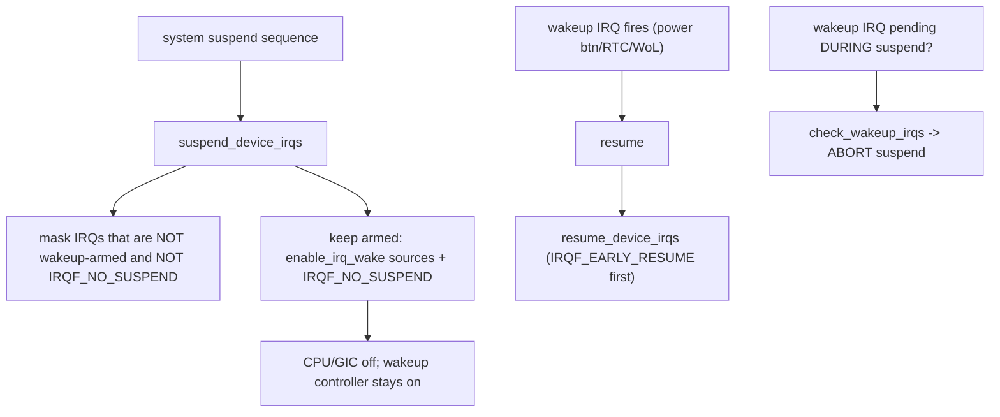
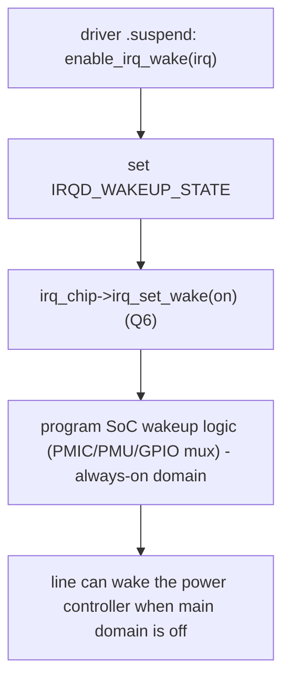

# Q24 — Wakeup Interrupts and Power Management

> **Subsystem:** Power · **Files:** `kernel/irq/pm.c`, `kernel/power/`, `drivers/base/power/`, `include/linux/interrupt.h`
> **Interviewer is really probing (Qualcomm favorite):** Do you understand how interrupts **wake the system
> from suspend**, `enable_irq_wake`, `IRQF_NO_SUSPEND`/`IRQF_EARLY_RESUME`, and how IRQs are
> suspended/resumed?

---

## TL;DR Cheat Sheet

- A **wakeup interrupt** is one allowed to **wake the system** from a low-power **suspend** state (S3/
  suspend-to-RAM, or runtime PM idle). The kernel **disables most interrupts** during suspend but **keeps
  wakeup-capable ones armed**.
- **`enable_irq_wake(irq)`** marks an IRQ as a **wakeup source**: it stays able to **abort/exit suspend** when
  it fires. `disable_irq_wake(irq)` clears it. Drivers call this in their **`.suspend`** PM callback for
  device interrupts that should wake the system (power button, RTC alarm, network WoL, sensor, modem).
- **During suspend** the IRQ core **suspends device interrupts** (`suspend_device_irqs`) — masks them — but
  **armed wakeup IRQs** (and `IRQF_NO_SUSPEND` ones) remain active; on resume `resume_device_irqs` re-enables.
- **Key flags:**
  - **`IRQF_NO_SUSPEND`** — the IRQ is **not** suspended (keeps firing through suspend) — for **timers, IPIs,
    and shared wakeup infrastructure** that must always work. (Not the same as a wakeup source.)
  - **`IRQF_EARLY_RESUME`** — resume this IRQ **early** in the resume sequence (before regular devices).
  - **`IRQD_WAKEUP_STATE`** — the per-IRQ wakeup-armed state set by `enable_irq_wake`.
- The controller's **`irq_chip->irq_set_wake`** programs the hardware (e.g. GIC/GPIO/PMIC wakeup logic) so the
  line can wake the SoC's power controller.
- **Abort-suspend race:** a wakeup IRQ firing **during** the suspend sequence must **abort** it (pending
  wakeup), handled via `pm_wakeup_event`/wakeup source accounting so you don't suspend through a wake event.

---

## The Question

> How do interrupts wake the system from suspend? Explain `enable_irq_wake`, `IRQF_NO_SUSPEND`/
> `IRQF_EARLY_RESUME`, and how the IRQ subsystem suspends/resumes interrupts.

What they want: the **wakeup-source** concept (`enable_irq_wake` + `irq_set_wake`), how the IRQ core
**suspends/resumes** device interrupts around system sleep, the **special PM flags**, and the **abort-suspend**
race — core SoC/mobile PM knowledge.

---

## Why wakeup interrupts exist

To save power, systems enter **low-power states** — full **system suspend** (suspend-to-RAM/S3: CPU off, RAM in
self-refresh) or, more granularly, **runtime PM** (individual devices/SoC blocks powered down while idle). But
a suspended system must still be able to **wake up** when something important happens:

- the **power button** is pressed,
- an **RTC alarm** fires,
- a **network** packet arrives (Wake-on-LAN),
- a **sensor**, **modem**, **touchscreen**, or **USB** device needs attention,
- a **key** is pressed.

These wake events arrive as **interrupts** — but here's the tension: during suspend, the kernel **masks most
interrupts** (the system is supposed to be quiet and the handling infrastructure may be torn down), yet a
**select few** must remain able to **wake the system**. So the kernel needs a way to say *"this specific IRQ is
a **wakeup source** — keep it armed through suspend so it can bring the system back."* That's
**`enable_irq_wake`** + the controller's **`irq_set_wake`**, which program the **hardware wakeup logic** (often
a separate always-on power/wakeup controller in the SoC) so the line can signal the power management unit even
when the main CPU/GIC is powered down.

There's also infrastructure that must **never** be suspended (the **timer** that drives the resume sequence,
**IPIs** (Q5), the wakeup-handling glue) — marked **`IRQF_NO_SUSPEND`** — and a **race** to handle: a wake
event arriving **mid-suspend** must **abort** the suspend (otherwise you'd sleep through it). The senior
framing: wakeup interrupts are the **bridge between the interrupt subsystem and power management** — arming
specific IRQs as wake sources, suspending the rest, handling the abort-suspend race, and resuming in the right
order. This is **central to mobile/embedded** (Qualcomm) battery life and responsiveness.

---

## When these mechanisms apply

| Event | Mechanism |
|-------|-----------|
| Device should wake the system | driver `.suspend` calls **`enable_irq_wake(irq)`** |
| System enters suspend | core **`suspend_device_irqs`** masks non-wakeup IRQs |
| Wakeup IRQ fires during sleep | wakes SoC power controller → resume |
| Wakeup IRQ fires **during** suspend sequence | **aborts** suspend (`pm_wakeup_event`) |
| System resumes | **`resume_device_irqs`** re-enables (early ones first) |
| Timer/IPI/always-on IRQ | **`IRQF_NO_SUSPEND`** (never suspended) |
| Runtime PM idle device | device wakeup via `enable_irq_wake` / `device_set_wakeup_enable` |

---

## Where in the kernel

```
kernel/irq/pm.c           <- suspend_device_irqs / resume_device_irqs, irq_pm_install_action,
                             check_wakeup_irqs (abort suspend if a wakeup IRQ is pending)
kernel/irq/manage.c       <- enable_irq_wake / disable_irq_wake -> irq_set_irq_wake -> chip->irq_set_wake
kernel/power/suspend.c    <- the suspend sequence (freeze, suspend devices, suspend_device_irqs, ...)
drivers/base/power/       <- device PM callbacks (.suspend/.resume), wakeup sources, pm_wakeup_event
include/linux/interrupt.h <- IRQF_NO_SUSPEND, IRQF_EARLY_RESUME, IRQF_COND_SUSPEND
irq_chip->irq_set_wake in drivers/irqchip (GIC, GPIO, PMIC)
```

---

## How wakeup interrupts work — mechanics

### 1. Arming a wakeup source

```c
/* In the driver's PM suspend callback: */
static int my_suspend(struct device *dev) {
    struct mydev *d = dev_get_drvdata(dev);
    if (device_may_wakeup(dev))          /* user/policy allows this device to wake */
        enable_irq_wake(d->irq);         /* arm the IRQ as a wakeup source */
    return 0;
}
static int my_resume(struct device *dev) {
    struct mydev *d = dev_get_drvdata(dev);
    if (device_may_wakeup(dev))
        disable_irq_wake(d->irq);        /* disarm */
    return 0;
}
```
`enable_irq_wake(irq)` sets the per-IRQ **`IRQD_WAKEUP_STATE`** and calls the controller's
**`irq_chip->irq_set_wake(irq_data, on)`**, which programs the **hardware** wakeup path — e.g. routing the line
to an **always-on** wakeup/power controller (PMIC, SoC PMU, GPIO wakeup mux) that stays powered when the main
domain (CPU, GIC) is off. `device_may_wakeup(dev)` gates it on the user/policy wakeup setting
(`/sys/devices/.../power/wakeup`).

### 2. Suspending device interrupts

During the suspend sequence (`kernel/power/suspend.c`), after freezing tasks and suspending devices, the IRQ
core calls **`suspend_device_irqs()`**:
```
for each irq_desc:
   if NOT IRQF_NO_SUSPEND and NOT armed as wakeup (IRQD_WAKEUP_ARMED):
        mark it suspended + mask it (it won't fire during sleep)
   else:
        leave it active (wakeup source, or no-suspend infrastructure)
```
So **most** interrupts are masked, but **armed wakeup IRQs** and **`IRQF_NO_SUSPEND`** IRQs stay live. This is
what lets the system be "asleep" yet still respond to the power button or RTC.

### 3. The abort-suspend race (`check_wakeup_irqs`)

A subtle but critical case: a **wakeup event can fire *during* the suspend sequence** — after you decided to
suspend but before the CPU is actually off. If ignored, the system would **sleep through** the wake event.
The kernel handles this with **wakeup-source accounting** (`pm_wakeup_event`/`pm_stay_awake`) and
**`check_wakeup_irqs()`**: if a wakeup-armed IRQ is found **pending** at the right point in the suspend
sequence, the suspend is **aborted** and the system stays awake (or immediately resumes). Drivers report wake
events via `pm_wakeup_event(dev, ...)` so the PM core knows a wake is in progress. Getting this wrong causes
the classic **"device won't wake the system"** or **"system suspends despite a pending wake"** bugs.

### 4. Resuming (and `IRQF_EARLY_RESUME`)

On resume, **`resume_device_irqs()`** re-enables the suspended interrupts. Some IRQs need to be resumed
**early** — before regular device resume — because **later resume steps depend on them** (e.g. an IRQ used by
the resume path itself, or an interrupt-driven bus controller other devices need). **`IRQF_EARLY_RESUME`**
marks those for early re-enable. Ordering matters: resume the **infrastructure** interrupts before the devices
that rely on them.

### 5. The special flags

```
IRQF_NO_SUSPEND   : NEVER suspended -> timers, IPIs (Q5), wakeup/PM infrastructure that must always work.
                    (NOTE: this is NOT the same as a wakeup source; it just isn't masked during suspend.
                     Don't use it to make a device wake the system — use enable_irq_wake for that.)
IRQF_EARLY_RESUME : re-enable this IRQ EARLY in the resume sequence (before regular devices).
IRQF_COND_SUSPEND : for shared IRQs (Q10) mixing a wakeup user and a normal user — conditional handling.
```
A common confusion the interview tests: **`IRQF_NO_SUSPEND` ≠ wakeup source**. `IRQF_NO_SUSPEND` keeps an IRQ
**unmasked** through suspend (so it can fire), but **doesn't** arm the **hardware wakeup** path to bring the
system **out** of a deep sleep — that's **`enable_irq_wake`/`irq_set_wake`**. Use the right one.

### 6. Runtime PM angle

Beyond full system suspend, **runtime PM** powers down **individual** idle devices/SoC blocks. A device in
runtime-suspended state can still be set to **wake** on its interrupt (`device_set_wakeup_enable`,
`enable_irq_wake` via runtime PM callbacks) so it powers back up on activity. Same wakeup machinery,
finer granularity — important for **always-on** mobile responsiveness (sensors, modem, touch).

---

## Diagrams

### Suspend/resume of interrupts



### enable_irq_wake path



---

## Annotated C

```c
/* Arm/disarm an IRQ as a system wakeup source. */
int enable_irq_wake(unsigned int irq);    /* -> irq_set_irq_wake(irq, 1) -> chip->irq_set_wake */
int disable_irq_wake(unsigned int irq);

/* irq_chip op the controller implements (Q6). */
struct irq_chip { int (*irq_set_wake)(struct irq_data *, unsigned int on); /* program HW wakeup */ };

/* Core suspend/resume of device interrupts (kernel/irq/pm.c). */
void suspend_device_irqs(void);   /* mask non-wakeup, non-NO_SUSPEND IRQs */
void resume_device_irqs(void);    /* re-enable (early ones first) */
int  check_wakeup_irqs(void);     /* abort suspend if a wakeup IRQ is pending */

/* Driver PM callback arming wakeup. */
if (device_may_wakeup(dev))
    enable_irq_wake(d->irq);

/* Report a wake event (abort-suspend accounting). */
pm_wakeup_event(dev, 0);

/* Flags: */
request_irq(irq, h, IRQF_NO_SUSPEND, "timer", d);          /* never suspended (timer/IPI) */
request_irq(irq, h, IRQF_EARLY_RESUME, "bus", d);          /* resume early */
```

> Senior nuance: **`enable_irq_wake` arms a hardware wakeup source** (via `irq_set_wake` → SoC always-on wakeup
> logic) so the line can bring the system **out** of deep sleep; the IRQ core **suspends most other device
> interrupts** (`suspend_device_irqs`) but keeps armed-wakeup and **`IRQF_NO_SUSPEND`** ones live. Crucially,
> **`IRQF_NO_SUSPEND` ≠ wakeup source** (it just stays unmasked; it doesn't arm the wakeup path). Handle the
> **abort-suspend race** (`check_wakeup_irqs`/`pm_wakeup_event`) so you don't sleep through a wake, and use
> **`IRQF_EARLY_RESUME`** for IRQs the resume path depends on.

---

## Company Angle

- **Qualcomm (the headline):** mobile/SoC suspend (deep sleep), `enable_irq_wake` for modem/sensor/touch/power
  button, SoC **always-on wakeup controllers** (PDC/MPM/GPIO wakeup mux), `irq_set_wake` programming, runtime
  PM, abort-suspend correctness — core battery-life/responsiveness work.
- **NVIDIA (Tegra/embedded):** wakeup sources, suspend/resume IRQ ordering, `IRQF_NO_SUSPEND` for timers.
- **AMD/Intel (laptops/servers):** ACPI wakeup (GPE), Wake-on-LAN, S3/s2idle, runtime PM, PCIe PME wakeup.
- **Google (Android/ChromeOS):** wakeup-source accounting (wakelocks), suspend-blocking on wake events,
  debugging "won't sleep / won't wake" via `/sys/.../power/wakeup` and wakeup-source stats.

---

## War Story

*"On a mobile SoC, a sensor that was supposed to wake the system from suspend **didn't** — pressing/triggering
it during sleep left the device dead until the power button. The driver had marked its IRQ
**`IRQF_NO_SUSPEND`**, assuming that made it a wakeup source — but `IRQF_NO_SUSPEND` only keeps the IRQ
**unmasked** through suspend; it does **not** arm the **hardware wakeup** path. With the main domain (CPU/GIC)
powered down in deep sleep, the line had no route to the **always-on wakeup controller**, so it couldn't bring
the system back. Fix: call **`enable_irq_wake(irq)`** in the driver's **`.suspend`** callback (gated on
`device_may_wakeup`), which goes through **`irq_chip->irq_set_wake`** to program the SoC's wakeup logic (the
PDC/GPIO wakeup mux) so the line wakes the power controller. We also fixed an **abort-suspend** race — the
sensor could fire **during** the suspend sequence, and we needed `pm_wakeup_event`/`check_wakeup_irqs` so the
system wouldn't **suspend through** the event. The interviewer's follow-up — *'what's the difference between
`IRQF_NO_SUSPEND` and `enable_irq_wake`?'* — let me explain `IRQF_NO_SUSPEND` keeps an IRQ **firing through
suspend** (for timers/IPIs/infrastructure that must always run), while **`enable_irq_wake`** arms the
**hardware wakeup** path to bring the system **out** of deep sleep — different jobs, and conflating them is
exactly the bug we hit."*

---

## Interviewer Follow-ups

1. **What is a wakeup interrupt?** One armed to **wake the system** from suspend; the kernel keeps it active
   (and routed to always-on wakeup hardware) while masking most other interrupts.

2. **What does `enable_irq_wake` do?** Marks an IRQ as a wakeup source (`IRQD_WAKEUP_STATE`) and calls
   `irq_chip->irq_set_wake` to program the SoC's hardware wakeup path; called in the driver's `.suspend`.

3. **`IRQF_NO_SUSPEND` vs `enable_irq_wake`?** `IRQF_NO_SUSPEND` keeps an IRQ **unmasked** through suspend (it
   fires) — for timers/IPIs/infrastructure; `enable_irq_wake` **arms hardware wakeup** to exit deep sleep.
   Different purposes.

4. **What does `suspend_device_irqs` do?** Masks all device IRQs **except** wakeup-armed and `IRQF_NO_SUSPEND`
   ones during the suspend sequence.

5. **What is the abort-suspend race?** A wake event firing **during** the suspend sequence must **abort** it
   (`check_wakeup_irqs`/`pm_wakeup_event`) so the system doesn't sleep through the wake.

6. **What is `IRQF_EARLY_RESUME`?** Re-enable an IRQ **early** in resume — before regular devices — for IRQs
   the resume path depends on.

7. **What programs the hardware wakeup?** `irq_chip->irq_set_wake` on the controller (GIC/GPIO/PMIC), routing
   the line to an **always-on** wakeup/power controller.

8. **How does `device_may_wakeup` fit in?** It gates `enable_irq_wake` on the user/policy wakeup setting
   (`/sys/.../power/wakeup`).

9. **How does runtime PM relate?** Individual idle devices can be set to wake on their interrupt
   (`device_set_wakeup_enable`/`enable_irq_wake`) — same machinery, per-device granularity.

---

## 30-Minute Talk Track

| Min | Cover |
|-----|-------|
| 0–4 | Why wakeup IRQs: suspend saves power but system must wake (button/RTC/WoL/sensor) |
| 4–9 | enable_irq_wake: arm a wakeup source; irq_set_wake programs SoC always-on wakeup HW |
| 9–13 | suspend_device_irqs: mask non-wakeup IRQs; keep armed + IRQF_NO_SUSPEND live |
| 13–17 | IRQF_NO_SUSPEND vs wakeup source — the key distinction (don't conflate) |
| 17–21 | Abort-suspend race: wake during suspend → check_wakeup_irqs/pm_wakeup_event |
| 21–24 | Resume: resume_device_irqs, IRQF_EARLY_RESUME ordering |
| 24–27 | Runtime PM wakeup (per-device); device_may_wakeup / sysfs wakeup policy |
| 27–30 | War story (IRQF_NO_SUSPEND mistaken for wakeup) + the distinction |
