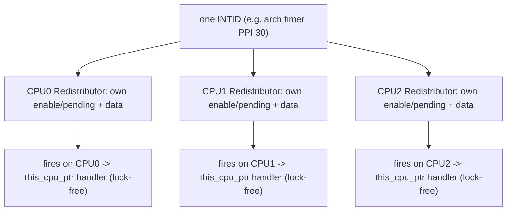
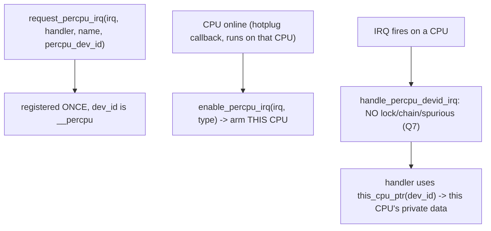

# Q25 — Per-CPU Interrupts (PPIs) and request_percpu_irq

> **Subsystem:** Special · **Files:** `kernel/irq/manage.c` (`request_percpu_irq`), `kernel/irq/chip.c` (`handle_percpu_*`), `drivers/clocksource/arm_arch_timer.c`
> **Interviewer is really probing (Qualcomm/ARM):** Do you understand **per-CPU interrupts** (each CPU has its
> own instance of the same interrupt line — the arch timer, PMU, IPIs), `request_percpu_irq`, and why their
> handling is **lock-free**?

---

## TL;DR Cheat Sheet

- A **per-CPU interrupt** is a single interrupt **number** that is **banked per CPU** — each CPU has its **own
  independent instance** of that line, with its own enable/pending state and (often) its own device. The
  canonical examples are the **ARM architected timer**, the **PMU** (perf counters), and **IPIs/SGIs** (Q5).
- On ARM these are **PPIs** (Private Peripheral Interrupts, INTID 16–31, Q1) — banked in each CPU's
  **Redistributor**. Each CPU's arch-timer PPI fires **independently** on that CPU.
- **API:** **`request_percpu_irq(irq, handler, name, percpu_dev_id)`** registers a **per-CPU** handler; the
  `dev_id` is a **per-CPU pointer** (`__percpu`). Each CPU must **`enable_percpu_irq(irq, type)`** locally
  (typically in CPU-hotplug/startup). `this_cpu_ptr(dev_id)` gives the CPU's private data.
- **Flow handler:** **`handle_percpu_devid_irq`** (Q7) — **no `desc->lock`, no shared `irqaction` chain, no
  spurious detection** — because the interrupt is **private to one CPU**, so there's **no cross-CPU racing**.
  This makes per-CPU IRQ handling **lean and fast** (critical for the timer hot path).
- **Why:** things like the **timer** and **PMU** are inherently **per-CPU** — every CPU needs its own timer
  interrupt for scheduling/timekeeping. Modeling them as one shared IRQ would be wrong (and slow); per-CPU
  IRQs give each CPU an **independent**, **lock-free** interrupt.

---

## The Question

> What is a per-CPU interrupt? Explain PPIs, `request_percpu_irq`, and why per-CPU interrupt handling needs no
> locking. Give examples.

What they want: the **banked-per-CPU** concept (one INTID, independent per CPU), the **PPI** mapping (Q1), the
**`request_percpu_irq` + `enable_percpu_irq` + per-CPU dev_id** model, and **why `handle_percpu_irq` is
lock-free** (Q7) — plus the **timer/PMU/IPI** examples.

---

## Why per-CPU interrupts exist

Some interrupt sources are **fundamentally per-CPU** — every CPU needs its **own** instance, firing
**independently**:

- **The architected timer** (ARM generic timer / x86 LAPIC timer): every CPU needs its **own** timer interrupt
  to drive its **scheduler tick**, **timekeeping**, and **high-resolution timers**. CPU0's timer firing has
  nothing to do with CPU1's — they're separate hardware timers in each core.
- **The PMU** (Performance Monitoring Unit): each CPU has its **own** performance counters that overflow and
  interrupt **that CPU** (for `perf` sampling). A counter overflow on CPU3 must interrupt **CPU3** (where the
  sampled code ran).
- **IPIs/SGIs** (Q5): inter-processor interrupts are delivered to **specific** CPUs; each CPU handles its own.

Modeling these as a **normal shared SPI** (Q1) would be **wrong** and **slow**: a shared interrupt has one
global `irq_desc` (Q6) with a **lock** and an **irqaction chain**, designed for the case where the interrupt
could come from any of several devices on **any** CPU and you must demux/serialize (Q10). But a per-CPU
interrupt is **private to one CPU** — there's **no cross-CPU race** (CPU1 can't be handling CPU0's timer), **no
sharing/demux** (it's one device per CPU), and **no spurious ambiguity**. Forcing the shared-IRQ machinery onto
it would add **needless locking and overhead** on the **hottest path in the kernel** (the timer interrupt fires
constantly).

So the kernel provides a **per-CPU interrupt** model: one **INTID** that's **banked per CPU** (each CPU has its
own enable/pending state and private data), with a **lean, lock-free flow handler** (`handle_percpu_devid_irq`,
Q7) and a **per-CPU registration API** (`request_percpu_irq`). On ARM, the hardware support is **PPIs** (Q1),
banked in each CPU's **Redistributor**. The senior framing: per-CPU interrupts exist because some sources are
**inherently per-CPU**, and they're handled **lock-free** precisely because they're **private to one CPU** —
no racing, no sharing — which is what makes the timer/PMU hot paths fast.

---

## When per-CPU interrupts are used

| Source | Per-CPU IRQ |
|--------|-------------|
| ARM architected timer / LAPIC timer | per-CPU timer interrupt (scheduler tick, hrtimers) |
| PMU (perf counter overflow) | per-CPU PMU interrupt |
| IPIs / SGIs (Q5) | per-CPU (reschedule, call-function, TLB) |
| Per-CPU local watchdog | per-CPU |
| Some per-CPU device/mailbox interrupts | per-CPU |

On ARM these map to **PPIs** (16–31) and **SGIs** (0–15); on x86 to **LAPIC LVT** entries / IPI vectors (Q2/Q5).

---

## Where in the kernel

```
kernel/irq/manage.c     <- request_percpu_irq, free_percpu_irq, enable_percpu_irq, disable_percpu_irq,
                           setup_percpu_irq, __irq_percpu (per-CPU dev_id handling)
kernel/irq/chip.c       <- handle_percpu_irq, handle_percpu_devid_irq (lock-free flow handlers, Q7)
drivers/clocksource/arm_arch_timer.c <- per-CPU arch timer using request_percpu_irq
drivers/perf/ , arch/*/kernel/perf_event* <- per-CPU PMU interrupts
drivers/irqchip/irq-gic-v3.c <- PPI/SGI banking in the Redistributor (Q1)
include/linux/interrupt.h <- request_percpu_irq, IRQF_PERCPU
```

---

## How per-CPU interrupts work — mechanics

### 1. Banking: one INTID, per-CPU instances

```
PPI (e.g. arch timer = INTID 30):
   CPU0 Redistributor: its own enable/pending for INTID 30  -> fires on CPU0 independently
   CPU1 Redistributor: its own enable/pending for INTID 30  -> fires on CPU1 independently
   ...
   ONE Linux IRQ number (virq), but each CPU has its OWN instance & private data.
```
The **same** INTID means "the timer" on every CPU, but each CPU's instance is **independent** — enabled,
pending, and handled **separately** per CPU. The GIC **Redistributor** (Q1) banks PPI/SGI state per CPU; x86
banks timer/IPI state in each LAPIC (Q2).

### 2. Registration: `request_percpu_irq` + per-CPU dev_id

```c
/* dev_id is a PER-CPU pointer: each CPU gets its own instance. */
static DEFINE_PER_CPU(struct my_timer, my_timers);
static struct my_timer __percpu *timers = &my_timers;

/* Register ONCE (not per CPU) with a per-CPU dev_id. */
request_percpu_irq(irq, my_percpu_handler, "arch_timer", timers);

/* Handler: get THIS CPU's private data. */
static irqreturn_t my_percpu_handler(int irq, void *dev_id) {
    struct my_timer *t = this_cpu_ptr(dev_id);   /* this CPU's instance */
    handle_this_cpus_timer(t);
    return IRQ_HANDLED;
}
```
`request_percpu_irq` registers the handler **once**, but the `dev_id` is a **`__percpu`** pointer, so each CPU's
handler invocation accesses **its own** data via `this_cpu_ptr()`. No shared state → no lock needed.

### 3. Per-CPU enable (each CPU arms its own)

Unlike a normal IRQ (enabled once globally), a per-CPU IRQ must be **enabled on each CPU** locally — typically
in the **CPU hotplug startup** callback (so it's armed as each CPU comes online):
```c
/* In the CPU-online hotplug callback (runs on the CPU being brought up): */
enable_percpu_irq(irq, IRQ_TYPE_LEVEL_LOW);   /* arm THIS CPU's instance */
/* On CPU offline: */
disable_percpu_irq(irq);
```
So bringing a CPU online arms its timer/PMU PPI; taking it offline disarms it. This per-CPU enable is a defining
difference from shared IRQs.

### 4. The lock-free flow handler (`handle_percpu_devid_irq`, Q7)

```c
void handle_percpu_devid_irq(struct irq_desc *desc) {
    struct irq_chip *chip = irq_desc_get_chip(desc);
    struct irqaction *action = desc->action;
    void *percpu_devid = raw_cpu_ptr(action->percpu_dev_id);  /* this CPU's dev_id */
    if (chip->irq_ack) chip->irq_ack(&desc->irq_data);
    action->handler(desc->irq_data.irq, percpu_devid);        /* run THIS CPU's handler */
    if (chip->irq_eoi) chip->irq_eoi(&desc->irq_data);
}
```
Notice what's **absent** compared to `handle_level/fasteoi_irq` (Q7): **no `raw_spin_lock(&desc->lock)`, no
shared `irqaction` chain walk, no spurious/storm detection** (Q10). Why? The interrupt is **private to this
CPU** — no other CPU can be handling it concurrently (nothing to lock against), it's **not shared** (one device
per CPU, no demux), and there's no "is it mine?" ambiguity. This makes per-CPU interrupt handling **minimal-
overhead** — essential because the **timer** fires extremely frequently. The leanness is the whole point.

### 5. Examples in the kernel

- **Arch timer** (`drivers/clocksource/arm_arch_timer.c`): uses `request_percpu_irq` for the PPI; each CPU's
  timer drives its own tick/hrtimers. Per-CPU enable in the hotplug callback.
- **PMU** (`drivers/perf/`): per-CPU counter-overflow interrupt; the handler reads **this CPU's** counters.
- **IPIs/SGIs** (Q5): handled per-CPU; `handle_percpu_devid_irq`-style dispatch.

### 6. Contrast with shared IRQs (Q10)

```
shared SPI (Q10):  one line, MANY devices on (possibly) ANY CPU -> desc->lock, irqaction chain,
                   "is it mine?" demux, spurious detection. Serialization needed.
per-CPU PPI:       one INTID, banked per CPU, ONE device per CPU, private -> NO lock, NO chain,
                   NO spurious. Lean & fast. Enabled per-CPU.
```
This contrast is exactly why there are **two** flow handlers (Q7) and **two** registration APIs (`request_irq`
vs `request_percpu_irq`) — the concurrency model is fundamentally different.

---

## Diagrams

### Banking



### Registration + per-CPU enable



---

## Annotated C

```c
/* Per-CPU IRQ registration (note the __percpu dev_id). */
int request_percpu_irq(unsigned int irq, irq_handler_t handler,
                       const char *devname, void __percpu *percpu_dev_id);
void free_percpu_irq(unsigned int irq, void __percpu *percpu_dev_id);

/* Each CPU arms/disarms its own instance (in hotplug callbacks). */
void enable_percpu_irq(unsigned int irq, unsigned int type);
void disable_percpu_irq(unsigned int irq);

/* Handler retrieves THIS CPU's private data. */
static irqreturn_t pmu_handler(int irq, void *dev_id) {
    struct cpu_pmu *p = this_cpu_ptr(dev_id);   /* this CPU's PMU state */
    handle_overflow(p);
    return IRQ_HANDLED;
}

/* Lock-free per-CPU flow handler (kernel/irq/chip.c, Q7) — no desc->lock, no chain, no spurious. */
void handle_percpu_devid_irq(struct irq_desc *desc);

/* CPU hotplug wiring (so each CPU enables its instance as it comes online). */
cpuhp_setup_state(CPUHP_AP_..., "arch_timer:starting",
                  arch_timer_starting_cpu /* enable_percpu_irq */,
                  arch_timer_dying_cpu    /* disable_percpu_irq */);
```

> Senior nuance: a per-CPU interrupt is **one INTID banked per CPU** — each CPU has an **independent** instance
> and **private data** (`this_cpu_ptr(dev_id)`). It's registered **once** (`request_percpu_irq`) but **enabled
> per CPU** (`enable_percpu_irq`, in hotplug). Handling is **lock-free** (`handle_percpu_devid_irq`) because
> it's **private to one CPU** — no cross-CPU race, no sharing, no spurious detection (contrast Q10). On ARM
> these are **PPIs** (banked in the Redistributor, Q1). The timer/PMU/IPI are the examples; the leanness is why
> the timer hot path is cheap.

---

## Company Angle

- **Qualcomm/ARM (the headline):** PPIs (Q1) for the **arch timer**, **PMU**, and per-CPU SoC interrupts;
  `request_percpu_irq` + per-CPU enable in CPU hotplug; Redistributor banking; SGIs as IPIs (Q5). Core SoC
  bring-up.
- **NVIDIA/AMD/Intel:** per-CPU LAPIC timer/PMU (Q2), perf counter-overflow interrupts, IPIs (Q5); per-CPU
  handling for the timer hot path.
- **Google:** per-CPU timer/PMU for scheduling/perf at scale; understanding lock-free per-CPU handling.
- **All:** the per-CPU-vs-shared concurrency contrast (lock-free vs serialized, Q10) and the timer/PMU examples
  are fundamentals.

---

## War Story

*"Bringing up a new ARM SoC, the **arch timer** worked on **CPU0** but secondary CPUs **hung** at boot — the
scheduler tick never fired on them. The timer is a **PPI** (per-CPU interrupt, Q1) registered with
**`request_percpu_irq`**, which registers the handler **once** — but each CPU must **`enable_percpu_irq`** its
**own** instance, and that has to happen **on that CPU** as it comes online. The bug: the driver enabled the
timer PPI only on the **boot CPU**, not in the **CPU-hotplug startup callback**, so secondary CPUs never armed
their timer instance and got no tick. Fix: wire `enable_percpu_irq(timer_irq, type)` into the **CPU-online
hotplug** callback (`cpuhp_setup_state` ... `:starting`) so each secondary CPU arms its **own** PPI as it boots,
and `disable_percpu_irq` on the dying callback. Secondary CPUs then got their per-CPU timer interrupts and the
scheduler ran. The interviewer's follow-up — *'why is the per-CPU handler lock-free?'* — let me explain a PPI
is **private to one CPU** (banked in that CPU's Redistributor): no other CPU can handle CPU1's timer, it's not
shared, and there's no demux — so `handle_percpu_devid_irq` skips `desc->lock`, the irqaction chain, and
spurious detection (Q7/Q10), which is exactly what keeps the **timer hot path** cheap; the trade-off is you
must **enable it per CPU**, which is what I'd missed."*

---

## Interviewer Follow-ups

1. **What is a per-CPU interrupt?** One interrupt INTID **banked per CPU** — each CPU has its own independent
   instance (enable/pending/data); examples: arch timer, PMU, IPIs.

2. **What are PPIs?** ARM **Private Peripheral Interrupts** (INTID 16–31, Q1), banked in each CPU's
   Redistributor — the hardware basis for per-CPU interrupts like the timer.

3. **How do you register one?** `request_percpu_irq(irq, handler, name, percpu_dev_id)` — registered **once**
   with a **`__percpu`** dev_id; each CPU's handler uses `this_cpu_ptr(dev_id)`.

4. **How is it enabled?** Per CPU via `enable_percpu_irq(irq, type)` — typically in the **CPU-hotplug startup**
   callback so each CPU arms its own instance as it comes online.

5. **Why is per-CPU IRQ handling lock-free?** It's **private to one CPU** — no cross-CPU race, no sharing/demux,
   no spurious detection — so `handle_percpu_devid_irq` skips `desc->lock`, the chain, and spurious logic (Q7).

6. **Contrast with shared IRQs (Q10).** Shared = one line, many devices, any CPU → lock + irqaction chain +
   "is it mine?" + spurious. Per-CPU = banked, private, one device per CPU → none of that; enabled per-CPU.

7. **Give examples.** Architected/LAPIC timer (scheduler tick/hrtimers), PMU (counter overflow), IPIs/SGIs
   (Q5), per-CPU watchdog.

8. **Why model the timer as per-CPU?** Every CPU needs its **own** timer for its tick/timekeeping; one shared
   IRQ would be wrong and add needless locking on the hottest path.

9. **What's the common bug?** Forgetting to `enable_percpu_irq` on **each** CPU (only enabling the boot CPU) →
   secondary CPUs get no interrupt; wire it into CPU hotplug.

---

## 30-Minute Talk Track

| Min | Cover |
|-----|-------|
| 0–4 | Some sources are inherently per-CPU (timer/PMU/IPI); each CPU needs its own instance |
| 4–8 | Banking: one INTID, per-CPU enable/pending/data; ARM PPIs in the Redistributor (Q1) |
| 8–12 | request_percpu_irq: register once, __percpu dev_id, this_cpu_ptr in the handler |
| 12–16 | Per-CPU enable: enable_percpu_irq in CPU-hotplug startup (the common bug) |
| 16–21 | Lock-free handle_percpu_devid_irq: no desc->lock/chain/spurious — why (private to one CPU, Q7) |
| 21–25 | Contrast with shared IRQs (Q10): serialized+demux vs lock-free+banked |
| 25–28 | Examples: arch timer, PMU, IPIs/SGIs (Q5); why the timer hot path stays cheap |
| 28–30 | War story (secondary CPUs no tick → enable_percpu_irq in hotplug) + lock-free rationale |
