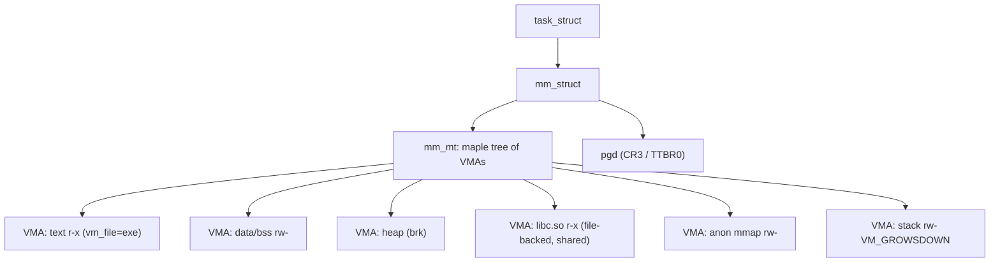

# Q1 — Process Virtual Address Space Layout & ASLR

> **Subsystem:** Virtual Memory · **Files:** `mm/mmap.c`, `mm/util.c`, `include/linux/mm_types.h`, `fs/binfmt_elf.c`, `arch/*/mm/`
> **Interviewer is really probing:** Do you know **how a process's address space is laid out**, how
> VMAs are stored/searched (now a **maple tree**), the **user/kernel split**, and how **ASLR** randomizes it?

---

## TL;DR Cheat Sheet

- Each process has an **`mm_struct`** describing its virtual address space: a set of **VMAs**
  (`vm_area_struct`), the page-table root (`pgd`), and layout pointers (`start_brk`, `mmap_base`,
  `start_stack`, …).
- A **VMA** is a contiguous range with uniform permissions/backing: code (r-x), data (rw-), heap,
  stacks, mmap'd files, anonymous mappings. Each has `vm_start/vm_end`, `vm_flags`, `vm_file`,
  `vm_ops`.
- **VMAs are stored in a [maple tree](https://docs.kernel.org/core-api/maple_tree.html)** (since
  v6.1), replacing the old red-black tree + linked list. Lookups (`vma_lookup`/`find_vma`) are
  RCU-friendly and enable **per-VMA locking** (fast page faults, Q3).
- **Address-space split:** user half (low) vs kernel half (high). x86-64 user = 0..`0x7fff_ffff_ffff`
  (128 TiB, 47-bit) or 56-bit with 5-level paging; kernel occupies the top. ARM64 splits via
  `TTBR0_EL1` (user) / `TTBR1_EL1` (kernel).
- Typical layout (classic "mmap topdown"): **text → data/bss → heap (grows up via `brk`)** … big
  gap … **mmap region (grows down)** + shared libs … **stack (grows down)** at the top of user space.
- **ASLR** randomizes the base of **stack, mmap region, heap (brk), and the executable (PIE)** each
  exec, so attackers can't predict addresses. Controlled by `/proc/sys/kernel/randomize_va_space`
  (0/1/2); **KASLR** does the same for the kernel image.
- `/proc/<pid>/maps` and `/proc/<pid>/smaps` dump the live VMA layout.

---

## The Question

> Walk me through the layout of a process's virtual address space. How are VMAs represented and
> searched, what's the user/kernel split, and how does ASLR work?

What they want: the **`mm_struct` → VMA → page-table** hierarchy, the **maple-tree** modernization,
the **segment layout + growth directions**, and a precise account of **what ASLR randomizes and why**.

---

## Why a virtual address space (and this structure)?

Virtual memory gives every process the **illusion of a private, contiguous address space**, while the
kernel maps it to scattered physical frames (Q-page-tables). The benefits drive the design:

- **Isolation/protection:** process A can't see B's memory; the kernel half is protected from user
  access. Permissions are **per-VMA** (`PROT_READ/WRITE/EXEC`) and enforced by the MMU.
- **Sparse, lazy layout:** most of the 128 TiB user space is unmapped; we only pay for regions
  actually used (VMAs + populated page tables). Heap/stack **grow on demand**.
- **Sharing:** shared libraries and `MAP_SHARED` files map the **same physical pages** into many
  processes; fork shares pages via **CoW** (Q4).
- **Fast lookup at fault time:** every page fault must find "which VMA covers this address?" in
  microseconds. That lookup structure must be **fast and concurrent** — which is exactly why the kernel
  moved from rbtree+list to the **maple tree** (cache-efficient, RCU-readable, supports per-VMA locks).

**Why ASLR?** If code, stack, heap, and libraries always sat at fixed addresses, an attacker who found
one bug could hardcode gadget/return addresses (ROP), libc offsets, etc. **Randomizing** the base of
each region per-exec makes those addresses **unpredictable**, raising the bar for exploitation. It's a
cheap, broad mitigation — a classic defense-in-depth layer (OWASP-style: assume bugs exist, make them
hard to weaponize).

---

## When is the layout built / changed?

- **At `execve()`:** `fs/binfmt_elf.c` builds a fresh `mm_struct`, maps the ELF segments (text/data),
  sets up the **stack**, picks **ASLR-randomized** bases for mmap/stack/(brk)/PIE load address.
- **At `brk()`/`sbrk()`:** the heap VMA's `vm_end` moves (grows/shrinks the heap).
- **At `mmap()`/`munmap()`/`mprotect()`/`mremap()`:** VMAs are created, split, merged, or have flags
  changed — all manipulating the maple tree under `mmap_lock`.
- **At `fork()`:** the child's `mm` is cloned — VMAs copied, private pages marked **CoW** (Q4).
- **At fault time:** the VMA is **looked up** (not modified) to resolve the fault (Q3).

---

## Where in the kernel

```
include/linux/mm_types.h     <- struct mm_struct, struct vm_area_struct, struct maple_tree mm_mt
mm/mmap.c                    <- mmap/munmap/brk, VMA create/split/merge, get_unmapped_area
mm/mmap_lock.c, mm/memory.c  <- mmap_lock, per-VMA lock (vma->vm_lock), fault entry
mm/util.c                    <- arch_pick_mmap_layout, mmap base randomization
fs/binfmt_elf.c              <- ELF loading, stack setup, ASLR base selection, PIE
arch/x86/mm/, arch/arm64/mm/ <- arch address-space limits, mmap_rnd_bits, KASLR
lib/maple_tree.c             <- the maple tree implementation
```

---

## How it works — step by step

### 1. The `mm_struct` and VMAs

```
task_struct ──► mm_struct ──► mm_mt (maple tree of VMAs)
                          ├──► pgd  (page-table root, loaded into CR3/TTBR0)
                          ├──► mmap_base, start_brk/brk, start_stack, ...
                          └──► owners, counters (RSS), mmap_lock, mm_users/mm_count
```
Each `vm_area_struct` covers `[vm_start, vm_end)` with `vm_flags` (READ/WRITE/EXEC/SHARED/GROWS*),
optional `vm_file` (file-backed) + `vm_pgoff`, and `vm_ops` (fault handlers). Anonymous VMAs have no
`vm_file` and fault in **zero pages** on first touch (Q3/Q5).

### 2. Classic user-space layout (x86-64, top-down mmap)

```
0x0000_0000_0000        +-------------------------+  (NULL guard page, unmapped)
                        |  ELF text (r-x)         |  <- executable code; PIE base randomized
                        |  ELF data + bss (rw-)   |
   start_brk ──────────►|  heap  ↓ grows up (brk) |
                        |        . . . . . .      |
                        |        big unmapped gap |
   mmap_base ──────────►|  mmap region ↓ grows    |  <- shared libs, malloc arenas, file maps
                        |  (down toward heap)     |     mmap_base randomized by ASLR
                        |        . . . . . .      |
   start_stack ───────►|  stack ↓ grows down     |  <- argv/env at top; stack base randomized
0x7fff_ffff_ffff        +-------------------------+  (top of 47-bit user space)
   ... non-canonical hole ...
0xffff_8000_0000_0000   +-------------------------+  KERNEL half (direct map, vmalloc, etc.)
```
- **Heap** grows **up** from the end of bss via `brk`. glibc's malloc uses both `brk` (main arena) and
  `mmap` (large allocations / thread arenas).
- **mmap region** grows **down** from `mmap_base` (the "top-down" or "flexible" layout chosen by
  `arch_pick_mmap_layout`); shared libraries and large `malloc` chunks live here.
- **Stack** grows **down** from near the top; a **`VM_GROWSDOWN`** VMA auto-extends it on fault up to
  `RLIMIT_STACK`. A **guard gap** prevents the stack and mmap from silently colliding.

ARM64 is analogous but the **user/kernel split is by hardware register** (`TTBR0` vs `TTBR1`), and VA
size depends on the page granule (39/48/52-bit).

### 3. VMA storage & lookup — the maple tree

Historically VMAs lived in **two** structures: an **rbtree** (for `find_vma` by address) and a
**doubly-linked list** (for in-order traversal). That duplicated state, complicated locking, and
limited concurrency. Since v6.1 they live in a single **maple tree** (`mm->mm_mt`):

- A **B-tree-like, range-indexed, RCU-safe** structure: nodes hold many entries → **cache-friendly**,
  fewer pointer chases than an rbtree.
- `vma_lookup(mm, addr)` / `find_vma(mm, addr)` find the covering (or next) VMA quickly.
- Crucially it enables **per-VMA locking**: a reader can take just that **VMA's** lock
  (`lock_vma_under_rcu`) instead of the whole-process **`mmap_lock`** (a rwsem), so **page faults on
  different VMAs scale in parallel** — a major fault-path latency win (Q3).

### 4. Stack & heap growth, guard gaps

- Touching just below the stack triggers a fault; `expand_stack` grows the `VM_GROWSDOWN` VMA (bounded
  by `RLIMIT_STACK` and the **stack guard gap**, default 256 pages, hardening against
  *stack-clash* attacks).
- `brk()` extends the heap VMA; failure (hitting mmap region or `RLIMIT_DATA`) makes malloc fall back
  to `mmap`.

### 5. ASLR — what gets randomized

At `execve`, the kernel adds randomness to several bases (entropy = `mmap_rnd_bits`, arch-tunable):

| Region | Randomized? | Mechanism |
|--------|-------------|-----------|
| **mmap base** (libs, malloc-mmap) | yes | `mmap_base += random << PAGE_SHIFT` |
| **stack base** | yes | random offset at stack setup |
| **brk/heap** | yes (with PIE) | `randomize_va_space >= 2` randomizes brk |
| **executable (PIE)** | yes if compiled `-fPIE -pie` | load base randomized; non-PIE = fixed |
| **vDSO** | yes | randomized mapping |
| **kernel image (KASLR)** | yes | boot-time random kernel base; **KASLR** is separate |

Controlled by **`/proc/sys/kernel/randomize_va_space`**:
- `0` = ASLR off, `1` = randomize mmap/stack/vDSO, `2` = also randomize **brk** (default).

ASLR's strength depends on **entropy bits** (`mmap_rnd_bits`/`mmap_rnd_compat_bits`) — more bits =
harder to brute-force. 32-bit address spaces have little entropy (a known weakness); 64-bit is strong.

---

## Diagrams

### Object hierarchy



### Fault-time VMA lookup with per-VMA lock

```mermaid
flowchart TD
    F[page fault @addr] --> R{lock_vma_under_rcu(addr) ok?}
    R -- yes --> FAST[per-VMA lock: handle fault, no mmap_lock]
    R -- no, fallback --> SLOW[down_read(mmap_lock); find_vma; handle]
    FAST --> D[resolve fault -> install PTE]
    SLOW --> D
```

---

## Annotated C

```c
/* The address space of a process. */
struct mm_struct {
    struct maple_tree mm_mt;     /* VMAs indexed by address range (replaces rbtree+list) */
    pgd_t            *pgd;        /* page-table root -> CR3 / TTBR0 */
    unsigned long mmap_base;     /* base of mmap region (ASLR-randomized) */
    unsigned long start_brk, brk, start_stack;
    unsigned long start_code, end_code, start_data, end_data;
    atomic_t      mm_users;      /* address-space users (threads) */
    atomic_t      mm_count;      /* references to the mm itself */
    struct rw_semaphore mmap_lock; /* protects the VMA tree (coarse) */
    /* RSS counters, exe_file, context (ASID/PCID), ... */
};

/* One region of the address space. */
struct vm_area_struct {
    unsigned long vm_start, vm_end;   /* [start, end) */
    vm_flags_t    vm_flags;           /* VM_READ/WRITE/EXEC/SHARED/GROWSDOWN... */
    struct file  *vm_file;            /* file-backed mapping (NULL = anonymous) */
    unsigned long vm_pgoff;           /* offset within vm_file, in pages */
    const struct vm_operations_struct *vm_ops; /* ->fault(), ->map_pages() ... */
    struct mm_struct *vm_mm;
    struct vm_lock   *vm_lock;        /* per-VMA lock for scalable faults */
    struct anon_vma  *anon_vma;       /* rmap for anonymous pages (Q-rmap) */
};

/* Address lookup at fault time. */
struct vm_area_struct *vma_lookup(struct mm_struct *mm, unsigned long addr);
/* Per-VMA RCU fast path (mm/memory.c): */
struct vm_area_struct *lock_vma_under_rcu(struct mm_struct *mm, unsigned long addr);
```

> Senior nuance: the move to a **maple tree** wasn't cosmetic — it removed the dual rbtree/list, made
> VMA reads **RCU-safe**, and unlocked **per-VMA locking**, which dramatically cut page-fault
> contention on threaded workloads (faults on different VMAs no longer serialize on `mmap_lock`).

---

## Company Angle

- **Google (scale/security):** ASLR/KASLR hardening, PIE everywhere, per-VMA lock scalability for
  threaded services, reading `/proc/pid/smaps` for memory accounting at fleet scale; `mmap_lock`
  contention as a tail-latency source.
- **NVIDIA (GPU/HMM):** how device drivers register VMAs and `vm_ops->fault`, `mmap` of device memory,
  and `mmu_notifier` hooking VMA/page-table changes (Q23); huge mappings of GPU buffers.
- **Qualcomm (Android/embedded):** tight 32/64-bit address spaces, ASLR entropy on ARM
  (`mmap_rnd_bits`), stack-guard-gap (stack-clash) hardening, low-RAM layouts.
- **AMD (NUMA/large mem):** 5-level paging (56-bit VA) for huge address spaces, mmap placement vs NUMA
  nodes, large `MAP_SHARED` regions.

---

## War Story

*"A multithreaded service regressed badly when we bumped its thread count — `perf` showed enormous
time in `rwsem` (the **`mmap_lock`**). Every thread's **page fault** took `mmap_lock` for reading, but
our workload also did frequent `mmap`/`munmap` (write side), so readers and the writer ping-ponged and
faults serialized. Upgrading to a 6.6 kernel with **per-VMA locks** (built on the maple-tree VMA store)
let faults on **different VMAs** proceed under their own `vma->vm_lock` via `lock_vma_under_rcu`,
bypassing `mmap_lock` entirely on the fast path. Fault latency under contention dropped sharply. The
follow-up I fielded — *'why did the maple tree matter here?'* — let me explain that RCU-safe,
range-indexed VMA lookup is the **prerequisite** for per-VMA locking; you can't safely read a VMA
without the global lock unless the container supports lockless reads."*

---

## Interviewer Follow-ups

1. **How are VMAs stored and why the change?** A **maple tree** (range-indexed, B-tree-like, RCU-safe)
   since v6.1, replacing rbtree+linked list — cache-friendly, enables per-VMA locking.

2. **`mmap_lock` vs per-VMA lock?** `mmap_lock` is a per-process rwsem guarding the whole VMA tree
   (coarse); per-VMA locks let faults on different VMAs run in parallel (`lock_vma_under_rcu`).

3. **User/kernel split on x86-64 vs ARM64?** x86-64: single space, kernel in the high canonical half
   (47-bit user, or 56-bit with 5-level). ARM64: hardware split via `TTBR0_EL1`(user)/`TTBR1_EL1`(kernel).

4. **Which way do heap and stack grow?** Heap grows **up** (`brk`); stack grows **down**
   (`VM_GROWSDOWN`); mmap region typically grows **down** from `mmap_base`.

5. **What exactly does ASLR randomize?** mmap base, stack, brk (level 2), PIE executable load address,
   vDSO. `randomize_va_space` 0/1/2 controls scope; entropy = `mmap_rnd_bits`.

6. **ASLR vs KASLR?** ASLR randomizes **user** space per exec; KASLR randomizes the **kernel image**
   base at boot.

7. **Why is the stack guard gap there?** To prevent **stack-clash** attacks where the growing stack
   silently overlaps an adjacent mapping; the gap forces a fault instead.

8. **What's a VMA merge/split?** Adjacent compatible VMAs merge (same flags/file/contiguous);
   `mprotect`/`munmap` on a sub-range **splits** a VMA. Keeps the tree minimal.

9. **How do you inspect a live layout?** `/proc/<pid>/maps` (ranges/perms/files), `/proc/<pid>/smaps`
   (per-VMA RSS/PSS/swap), `pmap`.

---

## 30-Minute Talk Track

| Min | Cover |
|-----|-------|
| 0–3 | Why virtual address spaces: isolation, sparse/lazy, sharing, fast fault lookup |
| 3–7 | mm_struct → VMAs → pgd hierarchy; what a VMA is (flags, file, ops) |
| 7–12 | Classic x86-64 layout: text/data/heap/mmap/stack, growth directions, guard gap |
| 12–16 | User/kernel split; ARM64 TTBR0/TTBR1; VA sizes (47/48/56-bit, granules) |
| 16–21 | VMA storage: maple tree vs old rbtree+list; vma_lookup; per-VMA locking & scalability |
| 21–25 | ASLR: what's randomized (mmap/stack/brk/PIE/vDSO), randomize_va_space, entropy, KASLR |
| 25–28 | Inspecting: /proc/pid/maps & smaps; VMA merge/split on mmap/mprotect |
| 28–30 | War story (mmap_lock → per-VMA locks) + trade-offs |
